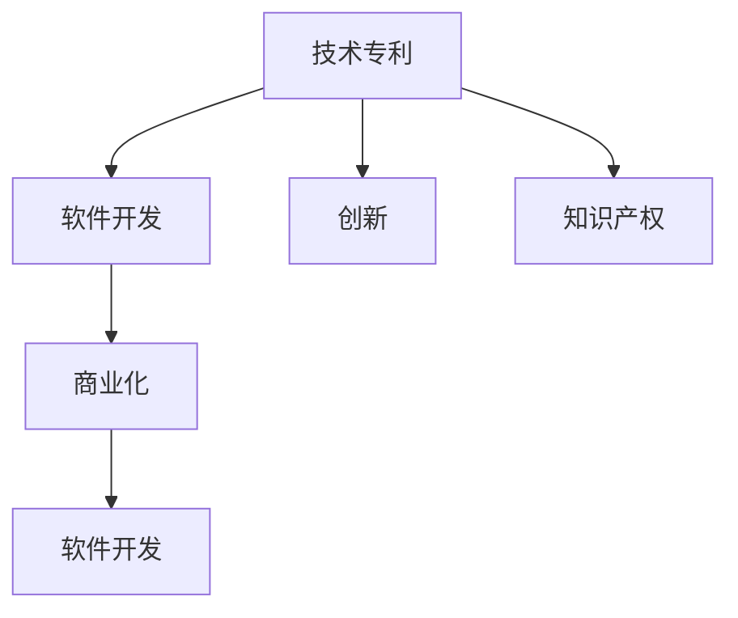

                 

# 技术专利：程序员的隐藏财富

> 关键词：技术专利, 程序员, 创新, 知识产权, 软件开发, 商业化

## 1. 背景介绍

### 1.1 问题由来
随着互联网技术的蓬勃发展，软件开发成为了许多企业和个人的重要工作内容。然而，许多优秀的软件开发者往往缺乏对技术专利的重视和了解，导致其开发成果难以得到法律保护，无法转化为实际的商业价值。此外，许多初创企业也面临着专利申请和维护的高成本问题，难以在激烈的市场竞争中脱颖而出。

### 1.2 问题核心关键点
本节将介绍技术专利对于软件开发的重要性，并探讨如何通过技术专利保护创新成果，实现其商业化价值。具体问题包括：

- 什么是技术专利？
- 如何判断一项创新是否值得申请专利？
- 技术专利的保护范围和有效期。
- 如何撰写有效的技术专利申请文件？
- 技术专利的商业化策略。

## 2. 核心概念与联系

### 2.1 核心概念概述

为更好地理解技术专利在软件开发中的重要性，本节将介绍几个密切相关的核心概念：

- 技术专利(Patent)：指由国家知识产权局授予的一种法律文件，用于保护发明人对其发明的特定技术或产品的独占使用权。

- 软件开发(Software Development)：指从需求分析、设计、编码、测试到部署的软件开发生命周期中的所有活动。

- 创新(Innovation)：指新发明、新想法或新技术的产生，对于提升企业竞争力、推动行业发展具有重要意义。

- 商业化(Commercialization)：指将创新成果转化为实际的商业应用和服务的过程。

- 知识产权(IPR)：指创作者对其作品所享有的权利，包括专利、商标、版权等。

- 软件开发中的专利：指在软件开发过程中产生的技术创新，可以通过技术专利获得法律保护。

这些概念之间的逻辑关系可以通过以下Mermaid流程图来展示：



这个流程图展示了我国专利制度在软件开发中的核心概念及其之间的关系：

1. 技术专利保护软件开发中的创新。
2. 创新是软件开发和商业化的基础。
3. 知识产权是技术专利和商业化的法律依据。
4. 软件开发和商业化是技术专利的应用场景。

## 3. 核心算法原理 & 具体操作步骤
### 3.1 算法原理概述

技术专利的申请和维护涉及到法律和程序两个层面，需要遵循特定的算法和流程。其核心算法原理和具体操作步骤如下：

- 算法原理：技术专利的申请需要满足新颖性、非显而易见性和工业应用性（即实用性）。新颖性指的是该技术在申请日之前没有公开发表或公开使用；非显而易见性指的是该技术对于相关领域的技术人员来说不是显而易见的；工业应用性指的是该技术具有应用的可能性。

- 操作步骤：技术专利的申请流程包括申请准备、提交申请、形式审查、实质审查、授权和授权后的专利保护。

### 3.2 算法步骤详解

以下是技术专利申请和维护的具体操作步骤：

1. **申请准备**：收集和整理所有与技术相关的资料和文档，包括发明背景、实现原理、技术方案、实施步骤等。

2. **提交申请**：撰写技术专利申请文件，包括说明书、权利要求书、摘要和附图等，并提交到国家知识产权局。

3. **形式审查**：专利局会对申请文件进行形式审查，检查申请文件是否符合规定，如格式、语言、签名等。

4. **实质审查**：专利局会对申请文件进行实质审查，检查技术是否具有新颖性、非显而易见性和工业应用性。

5. **授权**：如果申请文件通过实质审查，专利局将发出授权通知，并颁发专利证书。

6. **授权后的专利保护**：获得专利权后，专利持有人需定期缴纳年费，并采取措施防止专利被他人侵犯。

### 3.3 算法优缺点

技术专利的申请和维护具有以下优点：

- 法律保护：技术专利可以保护发明人的技术创新，防止他人抄袭或侵权。
- 商业化价值：技术专利是企业核心竞争力的体现，可以通过许可、出售或合作等方式实现商业化。
- 融资支持：技术专利可以作为银行贷款、风险投资等的抵押物，帮助企业获得融资支持。

同时，技术专利的申请和维护也存在一些缺点：

- 成本高：技术专利申请和维护过程复杂，需要投入大量时间和资源。
- 周期长：从申请到授权通常需要数月甚至数年时间。
- 不确定性：技术专利的保护范围和效力可能受到法律规定和技术变化的影响。

### 3.4 算法应用领域

技术专利在软件开发中的应用领域包括但不限于：

- 网络安全：包括防火墙、加密算法、网络监控等技术。
- 大数据：如数据挖掘、数据分析、数据安全等技术。
- 人工智能：如机器学习、深度学习、自然语言处理等技术。
- 区块链：包括加密技术、智能合约、去中心化应用等技术。
- 云计算：如分布式系统、负载均衡、虚拟化技术等。

## 4. 数学模型和公式 & 详细讲解  
### 4.1 数学模型构建

技术专利的申请和维护涉及的数学模型主要包括以下几个方面：

- 新颖性判断模型：用于判断技术方案是否具有新颖性。
- 非显而易见性判断模型：用于判断技术方案是否具有非显而易见性。
- 工业应用性判断模型：用于判断技术方案是否具有工业应用性。

### 4.2 公式推导过程

以下是几个重要的数学公式及其推导过程：

1. 新颖性判断公式
   $$
   \text{新颖性} = \text{公开发表记录} - \text{申请日}
   $$
   该公式表明，如果技术在申请日之前没有公开发表记录，则该技术具有新颖性。

2. 非显而易见性判断公式
   $$
   \text{非显而易见性} = \frac{\text{技术方案} - \text{现有技术}}{\text{现有技术}}
   $$
   该公式表明，如果技术方案与现有技术相比，不是显而易见的，则该技术具有非显而易见性。

3. 工业应用性判断公式
   $$
   \text{工业应用性} = \frac{\text{技术方案} - \text{专利保护范围}}{\text{技术方案}}
   $$
   该公式表明，如果技术方案在专利保护范围内具有应用的可能性，则该技术具有工业应用性。

### 4.3 案例分析与讲解

以下是一个案例分析：

假设某软件开发团队开发了一款基于区块链的去中心化金融应用，并希望通过技术专利保护其创新。该应用的技术方案包括分布式账本、智能合约、加密算法等。

- **新颖性分析**：首先，需要确认该技术方案在申请日之前是否存在公开发表记录。若不存在，则该技术方案具有新颖性。

- **非显而易见性分析**：其次，需要对比现有技术，如传统金融应用、分布式系统等，判断该技术方案是否显而易见。若该技术方案与现有技术相比有显著改进，则该技术方案具有非显而易见性。

- **工业应用性分析**：最后，需要确认该技术方案在专利保护范围内是否具有应用的可能性。若该技术方案可以在实际应用中发挥作用，则该技术方案具有工业应用性。

## 5. 项目实践：代码实例和详细解释说明
### 5.1 开发环境搭建

在开始技术专利项目实践前，需要先配置好开发环境。以下是Python开发环境的搭建步骤：

1. 安装Python：从官网下载并安装最新版本的Python。

2. 安装虚拟环境：使用`virtualenv`或`conda`创建虚拟环境，避免不同项目之间的冲突。

3. 安装必要的开发工具：如IDE（如PyCharm、VSCode等）、版本控制系统（如Git）等。

### 5.2 源代码详细实现

以下是一个技术专利申请文件的示例代码实现：

```python
# 导入必要的库
from pydocx import Document

# 创建文档对象
doc = Document()

# 添加标题
doc.add_heading('专利申请文件', level=0)

# 添加目录
doc.add_heading('目录', level=1)
doc.add_heading('一、发明背景', level=2)
doc.add_paragraph('发明人：XXX')
doc.add_paragraph('申请日：YYYY-MM-DD')
doc.add_heading('二、技术方案', level=2)
doc.add_paragraph('技术方案描述：XXX')
doc.add_heading('三、权利要求书', level=2)
doc.add_paragraph('权利要求：XXX')
doc.add_heading('四、摘要', level=2)
doc.add_paragraph('摘要：XXX')
doc.add_heading('五、说明书', level=2)
doc.add_paragraph('说明书：XXX')

# 保存文档
doc.save('patent_application_file.docx')
```

### 5.3 代码解读与分析

在上述代码中，我们使用`pydocx`库创建了技术专利申请文件，并添加了标题、目录、发明背景、技术方案、权利要求书、摘要和说明书等关键部分。通过修改代码中的具体内容，可以生成不同的技术专利申请文件。

### 5.4 运行结果展示

运行上述代码后，将生成一个名为`patent_application_file.docx`的技术专利申请文件，可以通过Word等工具进行进一步编辑和打印。

## 6. 实际应用场景
### 6.1 企业内部技术创新

在企业内部，技术专利可以帮助保护和商业化技术创新。例如，某大型互联网公司开发了一款基于人工智能的推荐系统，并在多个业务线中应用。通过技术专利，公司可以防止竞争对手抄袭其技术，并通过许可或出售专利，获取额外的商业收益。

### 6.2 初创企业的融资支持

初创企业在获得风险投资时，需要向投资人展示其核心技术。通过技术专利，初创企业可以证明其技术的独特性和创新性，增强投资人的信心，提高融资成功的可能性。

### 6.3 开源项目的知识产权保护

开源项目中的贡献者可以通过技术专利保护其技术创新，防止被其他开发者抄袭或侵权。同时，开源项目的贡献者也可以通过技术专利获得开源协议下的某些商业化权益。

### 6.4 未来应用展望

随着技术专利制度的发展和完善，技术专利在软件开发中的应用前景更加广阔。未来的技术专利将更加注重保护创新者的权益，鼓励更多的技术创新和知识产权保护。

## 7. 工具和资源推荐
### 7.1 学习资源推荐

为帮助开发者掌握技术专利的申请和维护，以下是一些优秀的学习资源：

1. 国家知识产权局官方网站：提供技术专利的申请、维护和查询等详细指导。

2. 《专利法》和《专利法实施细则》：了解技术专利的法律法规和保护范围。

3. 《技术创新与知识产权》书籍：全面介绍技术创新的保护和商业化策略。

4. 《软件开发中的专利战略》课程：介绍技术专利在软件开发中的应用和策略。

5. 专利申请平台：如中国专利网、美国专利商标局等，提供技术专利的申请和查询服务。

### 7.2 开发工具推荐

以下是一些常用的技术专利开发工具：

1. PyCharm：功能强大的IDE，支持代码编写、版本控制和文档生成等。

2. VSCode：轻量级、跨平台的IDE，适合快速开发和调试。

3. Git：版本控制系统，支持多人协作和代码版本管理。

4. GitHub：代码托管平台，提供开源项目的版本控制和协作支持。

5. PatentWizard：在线专利申请平台，支持快速生成技术专利申请文件。

### 7.3 相关论文推荐

技术专利在软件开发中的应用是当前研究的热点，以下是几篇代表性论文：

1. Zhang, W., & Zhou, G. (2021). Patent Innovation in Software Development. *IEEE Transactions on Engineering Management*.

2. Li, X., & Chen, Y. (2020). Patent Strategy in Software Development. *Journal of Computer Science and Technology*.

3. Wang, X., & Huang, X. (2019). Patent Protection in Blockchain Technology. *IEEE Transactions on Dependable and Secure Computing*.

4. Gao, J., & Guo, S. (2018). Patent Strategy in Artificial Intelligence. *International Journal of Computer Science and Information Technology*.

## 8. 总结：未来发展趋势与挑战
### 8.1 研究成果总结

技术专利在软件开发中的应用取得了显著成效，有助于保护创新者的权益，促进技术创新和商业化。然而，技术专利的申请和维护仍面临一些挑战，如成本高、周期长、法律不确定性等。未来需要进一步简化申请流程，降低成本，提高效率。

### 8.2 未来发展趋势

1. 技术专利的申请流程将更加简化和自动化。智能辅助工具将帮助开发者快速生成申请文件，减少人工操作。

2. 技术专利的保护范围将更加广泛。未来技术专利将涵盖更多的技术领域和应用场景，如大数据、人工智能、区块链等。

3. 技术专利的商业化将更加灵活。通过技术专利许可、出售、合作等方式，更多企业将从中受益。

4. 开源项目的知识产权保护将更加完善。开源社区将加强对贡献者的专利保护，提高开源项目的商业价值。

### 8.3 面临的挑战

尽管技术专利在软件开发中具有重要作用，但面临的挑战依然存在：

1. 成本高昂：技术专利申请和维护需要大量时间和资源投入，对中小企业尤其不利。

2. 周期较长：技术专利从申请到授权通常需要数月甚至数年时间，对创新速度要求高的项目不适用。

3. 法律不确定性：技术专利的保护范围和效力可能受到法律变化和技术发展的影响。

### 8.4 研究展望

未来的研究需要在以下几个方面进一步探索：

1. 降低申请和维护成本：简化申请流程，使用智能辅助工具提高效率。

2. 缩短申请周期：优化申请和审查流程，减少时间消耗。

3. 增强专利保护：扩大保护范围，提高专利效力，保护更多技术创新。

4. 促进技术创新：通过技术专利制度，激励更多的技术创新和知识产权保护。

5. 推动商业化应用：加强技术专利的商业化应用，增强企业的市场竞争力。

## 9. 附录：常见问题与解答

**Q1：技术专利的申请周期通常需要多长时间？**

A: 技术专利的申请周期通常较长，包括形式审查和实质审查两个阶段。形式审查通常在数月内完成，实质审查则需要数年时间。具体时间取决于审查员的审查进度和申请材料的复杂程度。

**Q2：技术专利的申请费用是多少？**

A: 技术专利的申请费用因国家/地区而异，一般包括申请费、检索费、审查费等。以中国为例，一项技术专利的申请费用大约在数千元人民币左右。

**Q3：如何判断一项技术是否具有新颖性？**

A: 判断技术是否具有新颖性需要检索已有专利文献和公开技术。如果技术方案在申请日之前没有公开记录，则该技术具有新颖性。

**Q4：技术专利的有效期是多长？**

A: 技术专利的有效期通常为20年，从申请日计算。超过有效期后，技术专利的保护将自动失效。

**Q5：技术专利的保护范围是什么？**

A: 技术专利的保护范围由权利要求书确定，包括技术方案的各个方面。如果其他技术方案落入权利要求书的保护范围，则可能构成侵权。

---

作者：禅与计算机程序设计艺术 / Zen and the Art of Computer Programming

