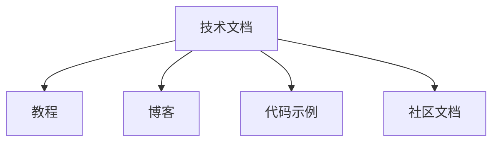

                 

## 1. 背景介绍

技术写作（Technical Writing）是指利用准确、清晰、简洁的语言，将复杂的算法、技术方案、产品文档等传递给读者。在当前信息爆炸的时代，技术写作对于推动知识传播、推动技术创新、加速产业应用具有极其重要的作用。

### 1.1 问题由来
随着IT行业的迅猛发展，技术文档和教程成为了技术传播的核心手段之一。然而，许多优秀的技术产品和技术方案，因为缺乏详细、易懂的文档，使得使用者难以理解和使用。许多技术博主和开发者积累了大量知识，但是如何将这些知识高效、准确地传授给目标受众，成为了一个重要的问题。

### 1.2 问题核心关键点
技术写作的核心关键点在于：
1. 如何编写易于理解的文档。
2. 如何让文档具有可读性、可操作性和可维护性。
3. 如何将抽象技术语言转换为易懂的通俗语言。
4. 如何将技术细节深入浅出地传递给不同层次的受众。

本文旨在探索和阐述技术写作的核心概念和实施方法，希望能为程序员和开发人员提供有效且实用的技术写作指南。

## 2. 核心概念与联系

### 2.1 核心概念概述

在深入探讨技术写作之前，我们先简要介绍几个核心概念：

1. **技术文档（Technical Documentation）**：包括但不限于API文档、使用指南、产品手册、用户手册等。技术文档的目的在于提供足够的信息，帮助读者理解和使用产品或技术。

2. **教程（Tutorials）**：详细指导用户如何在特定的环境中配置、使用、操作某个产品或工具的文档。教程具有实践指导性，往往结合实际操作步骤。

3. **博客（Blogs）**：个人或机构用于分享技术观点、经验、工具使用技巧等的文章形式。博客内容通常具有时效性和交流性，可以迅速传递最新技术和信息。

4. **代码示例（Code Examples）**：通过具体的代码片段和注释，展示技术原理和实现方法。代码示例通常用于验证概念、提供可执行的解决方案，以及帮助读者理解技术细节。

5. **社区文档（Community Documentation）**：由开源项目社区维护的文档，包括用户提交的反馈、问题解答、最佳实践等。社区文档具有实时性和交互性，常常结合社区动态更新。

这些核心概念之间相互关联，共同构成了技术写作的完整框架。

### 2.2 核心概念原理和架构的 Mermaid 流程图



通过这个简化的流程图，可以看出技术文档与其他核心概念之间的联系和交互。

## 3. 核心算法原理 & 具体操作步骤

### 3.1 算法原理概述

技术写作的原理可以抽象为以下几个步骤：

1. **需求分析（Requirement Analysis）**：了解目标受众的背景和需求，确定文档的目标、内容、结构和格式。
2. **信息组织（Information Organization）**：按照逻辑和易理解的方式组织文档内容，便于读者快速获取和使用。
3. **内容创作（Content Creation）**：使用准确、简洁、易懂的语言编写文档。
4. **版本控制（Version Control）**：持续更新和维护文档，确保文档内容的时效性和准确性。

这些步骤构成了技术写作的核心框架，每一个步骤都需要细致地规划和执行。

### 3.2 算法步骤详解

#### 3.2.1 需求分析

需求分析是技术写作的首要步骤。

**具体步骤：**
1. **确定受众**：了解受众的技术背景、行业经验、预期目标等。
2. **收集反馈**：通过调研、访谈等方式收集受众的反馈，确定他们的痛点和需求。
3. **明确目标**：根据受众需求，明确文档的目标，是介绍新功能、还是解决问题的方案、还是教育用户等。

**示例：**
假设你是一名软件开发人员，需要编写一份新的API文档。首先，需要了解目标受众的背景，如开发者、架构师、测试人员等。其次，通过调研收集用户反馈，确定用户希望了解哪些功能和用法。最后，明确文档的目标，是为用户提供清晰的API使用指南，还是解释技术细节。

#### 3.2.2 信息组织

信息组织是将内容按照逻辑顺序和结构化的方式展示出来，以便读者容易理解。

**具体步骤：**
1. **列出要点**：将文档的主要内容列出，如功能介绍、操作流程、使用示例等。
2. **结构设计**：将要点按逻辑顺序组织成章节、小节、段落等结构，保证文档的连贯性和易读性。
3. **示例插入**：通过具体示例说明关键点，增强文档的可操作性。

**示例：**
在编写API文档时，可以按照功能模块、参数说明、使用示例等结构组织内容。每个功能模块下可以进一步分为子模块和具体操作，每个操作下可以提供示例代码和详细说明。

#### 3.2.3 内容创作

内容创作是将抽象的技术知识转化为易懂的语言，传递给读者。

**具体步骤：**
1. **精简语言**：使用简洁、明确、专业的语言，避免使用行业术语和复杂句式。
2. **分段阐述**：将内容分成若干段落，每个段落只涵盖一个核心概念或步骤。
3. **图表辅助**：使用图表、示意图等辅助说明，增强文档的可理解性。

**示例：**
在编写教程时，可以使用分段说明的方式，每段说明一个操作步骤。在每段开头简要介绍操作的目的和步骤，然后通过代码示例、流程图等辅助说明。

#### 3.2.4 版本控制

版本控制是确保文档内容和结构随时间更新的重要手段。

**具体步骤：**
1. **版本管理**：使用版本控制系统（如Git）管理文档的版本，确保文档的历史记录清晰。
2. **定期更新**：定期检查文档内容，根据新的需求和技术变化进行更新。
3. **用户反馈**：鼓励用户提供反馈，及时修正错误和补充新内容。

**示例：**
在GitHub上创建文档仓库，使用分支管理不同版本的文档。在每次更新后，提交新版本的更改，并在文档中添加版本号或更新日志。

### 3.3 算法优缺点

技术写作的优点在于：
1. **知识传播**：通过清晰的文档和教程，将复杂的技术知识传递给更广泛的受众。
2. **技术交流**：通过博客和社区文档，促进开发者之间的交流和合作，加速技术传播和创新。
3. **内容迭代**：持续更新文档，保持内容的时效性和准确性，提供最新的解决方案和最佳实践。

然而，技术写作也存在一些缺点：
1. **编写难度高**：需要高度的技术理解力和语言表达能力，编写高质量的文档具有挑战性。
2. **更新维护难**：随着技术的发展，文档需要持续更新和维护，工作量较大。
3. **受众理解门槛**：过于专业的术语和复杂的结构可能使得部分受众难以理解。

### 3.4 算法应用领域

技术写作广泛应用于软件开发、IT咨询、技术支持、教育培训等领域，具有广泛的应用价值：

1. **软件开发**：API文档、使用指南、开发者手册等，帮助开发者快速了解和使用软件。
2. **IT咨询**：解决方案文档、项目报告、用户手册等，为咨询项目提供详细的技术支持。
3. **技术支持**：常见问题解答、故障排除指南、用户手册等，提升客户支持效率。
4. **教育培训**：课程大纲、实验室手册、学习指南等，帮助学生和培训机构进行课程开发和教学。
5. **产品营销**：产品白皮书、用户手册、演示文稿等，展示产品特点和优势，吸引用户。

## 4. 数学模型和公式 & 详细讲解 & 举例说明

### 4.1 数学模型构建

技术写作的数学模型构建，主要涉及文档的结构和内容组织。以API文档为例，可以构建以下数学模型：

**模型1: 功能模块图（Feature Module Diagram）**

$$
G(V,E) = \{V,E\}
$$

其中，$V$ 表示功能模块的集合，$E$ 表示模块之间的关系集合。每个模块对应一个API功能，关系表示模块之间的依赖和调用。

**模型2: 操作流程图（Operation Flow Diagram）**

$$
F = \{A,OP,D\}
$$

其中，$A$ 表示操作的步骤集合，$OP$ 表示操作的参数集合，$D$ 表示操作的输出结果集合。每个操作对应一个API调用，参数和输出对应API的输入和返回值。

### 4.2 公式推导过程

假设有一个API，功能是获取用户的地理位置信息。可以按照以下步骤进行公式推导：

1. **功能模块图**：

$$
G(V,E) = \{location\_info(V),get\_location(V),address\_to\_location(E)\}
$$

其中，$location\_info$ 表示用户信息模块，$get\_location$ 表示地理位置获取模块，$address\_to\_location$ 表示地址转经纬度的关系。

2. **操作流程图**：

$$
F = \{step1(A,OP,D),step2(A,OP,D),step3(A,OP,D)\}
$$

其中，$step1$ 表示输入用户地址，$OP$ 表示获取经纬度的操作，$D$ 表示输出地理位置信息。

### 4.3 案例分析与讲解

**案例：编写一个函数，计算两个数的平方和。**

1. **功能模块图**：

$$
G(V,E) = \{add\_numbers(V),square(V),sum(V,E)\}
$$

其中，$add\_numbers$ 表示加法模块，$square$ 表示平方模块，$sum$ 表示求和模块。

2. **操作流程图**：

$$
F = \{num1(A,OP,D),num2(A,OP,D),result(A,OP,D)\}
$$

其中，$num1$ 表示输入第一个数，$OP$ 表示加法操作，$D$ 表示第一个数的计算结果。$num2$ 表示输入第二个数，$OP$ 表示平方操作，$D$ 表示第二个数的计算结果。$result$ 表示计算最终结果。

**示例代码：**

```python
def square_sum(num1, num2):
    result1 = num1 + num2
    result2 = result1 ** 2
    return result2
```

在代码中，`num1` 和 `num2` 表示输入的数，`result1` 表示两个数的和，`result2` 表示结果的平方。

## 5. 项目实践：代码实例和详细解释说明

### 5.1 开发环境搭建

技术写作的开发环境需要搭建一个支持版本控制和代码编辑的平台。常用的开发环境包括：

1. **GitHub**：提供开源代码托管和协作功能，支持多人协作和版本控制。
2. **GitLab**：类似于GitHub，提供私有代码托管和团队协作功能。
3. **Jupyter Notebook**：支持代码和文本混合编辑，便于进行技术分析和文档编写。

### 5.2 源代码详细实现

以编写一个简单的API文档为例，我们可以按照以下步骤进行：

1. **需求分析**：确定文档的目标受众和需求。

2. **信息组织**：设计文档的结构和内容。

3. **内容创作**：编写文档内容，使用代码示例说明技术细节。

4. **版本控制**：使用Git进行版本管理，记录每次更新和修改。

### 5.3 代码解读与分析

#### 5.3.1 需求分析

假设我们要编写一个API文档，介绍如何使用Python编写一个简单的计算器应用。

**目标受众**：Python初学者，希望快速上手编写计算器的开发。

**需求分析**：

- 介绍Python的基础语法和环境搭建。
- 介绍如何使用Python的GUI库tkinter进行界面设计。
- 介绍计算器功能的实现，包括加、减、乘、除等基本运算。

#### 5.3.2 信息组织

我们可以将文档分为以下几节：

1. **引言**：简要介绍Python和GUI编程的基本概念。
2. **环境搭建**：介绍如何安装Python和tkinter库。
3. **计算器设计**：介绍GUI界面的设计和实现。
4. **计算器功能实现**：详细说明每个功能的代码实现。

#### 5.3.3 内容创作

在编写内容时，需要注意以下几点：

1. **精简语言**：使用简洁、易懂的语言，避免过度复杂的技术术语。
2. **分段阐述**：每个节选一个小节，只涵盖一个核心概念或步骤。
3. **代码示例**：通过代码片段说明技术细节，增强文档的可操作性。

**示例代码：**

```python
import tkinter as tk

class Calculator:
    def __init__(self, master):
        self.master = master
        self.master.title('Simple Calculator')

        # 界面设计
        self.entry = tk.Entry(self.master, width=15)
        self.entry.grid(row=0, column=0, columnspan=4, padx=5, pady=5)
        self.button_frame = tk.Frame(self.master)
        self.button_frame.grid(row=1, column=0, padx=5, pady=5)
        self.calc_button = tk.Button(self.button_frame, text='=', command=self.calculate)
        self.calc_button.grid(row=0, column=0, padx=5, pady=5)
        self.clear_button = tk.Button(self.button_frame, text='Clear', command=self.clear)
        self.clear_button.grid(row=0, column=1, padx=5, pady=5)
        self.num_7_button = tk.Button(self.button_frame, text='7', command=self.input_num_7)
        self.num_7_button.grid(row=0, column=2, padx=5, pady=5)
        self.num_8_button = tk.Button(self.button_frame, text='8', command=self.input_num_8)
        self.num_8_button.grid(row=0, column=3, padx=5, pady=5)

        # 绑定事件处理
        self.entry.bind('<Return>', self.calculate)

    def input_num_7(self, event):
        self.entry.insert(tk.END, '7')

    def input_num_8(self, event):
        self.entry.insert(tk.END, '8')

    def clear(self, event):
        self.entry.delete(0, tk.END)

    def calculate(self, event):
        try:
            result = eval(self.entry.get())
            self.entry.insert(tk.END, result)
        except:
            self.entry.insert(tk.END, 'Error')
```

**代码解释：**

1. **界面设计**：使用tkinter库创建GUI界面，包括一个文本框和一个按钮框架。
2. **事件绑定**：绑定按钮的点击事件和按键事件的回调函数。
3. **计算器功能实现**：通过`eval`函数计算用户输入的表达式。

### 5.4 运行结果展示

运行上述代码，即可看到一个简单的GUI计算器界面，用户可以通过按键输入表达式，并通过点击'='按钮计算结果。

## 6. 实际应用场景

### 6.1 软件开发

技术写作在软件开发中具有重要应用价值，帮助开发者快速了解和使用软件。

**案例：编写一个Python的web框架教程。**

1. **需求分析**：了解目标受众的背景和需求，确定教程的目标。

2. **信息组织**：设计教程的结构和内容，包括环境搭建、基本概念、代码实现等。

3. **内容创作**：编写教程内容，使用代码示例说明技术细节。

4. **版本控制**：使用Git进行版本管理，记录每次更新和修改。

### 6.2 教育培训

技术写作在教育培训中也有广泛应用，帮助学生和培训机构进行课程开发和教学。

**案例：编写一个机器学习的入门教程。**

1. **需求分析**：了解目标受众的背景和需求，确定教程的目标。

2. **信息组织**：设计教程的结构和内容，包括环境搭建、基本概念、算法实现等。

3. **内容创作**：编写教程内容，使用代码示例说明技术细节。

4. **版本控制**：使用Git进行版本管理，记录每次更新和修改。

### 6.3 技术支持

技术写作在技术支持中也非常重要，帮助用户快速解决技术问题。

**案例：编写一个常见问题解答（FAQ）文档。**

1. **需求分析**：了解目标受众的背景和需求，确定文档的目标。

2. **信息组织**：设计文档的结构和内容，包括常见问题、解决方案、详细说明等。

3. **内容创作**：编写文档内容，使用代码示例说明技术细节。

4. **版本控制**：使用Git进行版本管理，记录每次更新和修改。

## 7. 工具和资源推荐

### 7.1 学习资源推荐

为了帮助开发者系统掌握技术写作的理论基础和实践技巧，这里推荐一些优质的学习资源：

1. **《技术写作之道》**：详细介绍了技术写作的基本概念、方法和工具。
2. **《API文档编写指南》**：提供了编写高质量API文档的具体步骤和技巧。
3. **《Python GUI编程入门》**：介绍了如何使用Python进行GUI编程和界面设计。
4. **《Git教程》**：详细讲解了Git的基本操作和版本管理技巧。
5. **《Jupyter Notebook教程》**：介绍了如何使用Jupyter Notebook进行代码和文本混合编辑。

### 7.2 开发工具推荐

常用的技术写作工具包括：

1. **GitHub**：提供开源代码托管和协作功能，支持多人协作和版本控制。
2. **GitLab**：类似于GitHub，提供私有代码托管和团队协作功能。
3. **Jupyter Notebook**：支持代码和文本混合编辑，便于进行技术分析和文档编写。
4. **Markdown编辑器**：如Typora、Notion等，支持Markdown语法，方便编写技术文档。

### 7.3 相关论文推荐

技术写作的研究方向涉及多个领域，以下是几篇相关论文：

1. **《技术写作与技术传播》**：讨论了技术写作在技术传播中的作用和影响。
2. **《API文档的开发与维护》**：探讨了API文档的设计原则和实践方法。
3. **《技术教程的编写与优化》**：研究了如何编写具有可读性和可操作性的技术教程。

## 8. 总结：未来发展趋势与挑战

### 8.1 研究成果总结

技术写作在IT领域具有重要的应用价值，帮助开发者、用户和培训机构高效地传播和利用技术知识。

### 8.2 未来发展趋势

技术写作的未来发展趋势包括：

1. **多平台兼容**：技术写作需要支持多种平台和格式，满足不同受众的需求。
2. **交互式文档**：结合Web技术，开发交互式文档，增强用户互动体验。
3. **自动化生成**：使用自动化工具，生成技术文档和教程，提高生产效率。

### 8.3 面临的挑战

技术写作也面临一些挑战：

1. **内容质量控制**：确保文档和教程的内容准确、完整、易读。
2. **版本管理复杂**：随着文档和教程的更新，版本管理变得复杂。
3. **用户理解门槛**：确保文档内容易于理解，避免过度专业化的术语。

### 8.4 研究展望

未来的技术写作研究将更加注重以下几个方向：

1. **内容生成技术**：开发自动生成技术文档和教程的工具，提高生产效率。
2. **用户需求分析**：研究用户需求分析技术，优化文档和教程的设计。
3. **交互式体验**：结合Web技术，开发交互式文档，增强用户互动体验。

## 9. 附录：常见问题与解答

**Q1: 技术写作需要哪些基础知识？**

A: 技术写作需要以下基础知识：

1. **编程语言**：熟悉至少一种编程语言，了解基本语法和编程思维。
2. **文档标准**：了解不同平台和格式的文档标准，如Markdown、HTML等。
3. **版本控制**：熟悉版本控制工具，如Git，能够进行版本管理和协同编辑。

**Q2: 如何提高技术写作的可读性？**

A: 提高技术写作的可读性，可以从以下几方面入手：

1. **分段阐述**：每个段落只涵盖一个核心概念或步骤，避免长篇大论。
2. **精简语言**：使用简洁、易懂的语言，避免过度复杂的技术术语。
3. **图表辅助**：使用图表、示意图等辅助说明，增强文档的可理解性。

**Q3: 如何编写高质量的API文档？**

A: 编写高质量的API文档，可以按照以下步骤进行：

1. **需求分析**：了解目标受众的背景和需求，确定文档的目标。
2. **信息组织**：设计文档的结构和内容，包括功能模块、操作流程、代码示例等。
3. **内容创作**：编写文档内容，使用代码示例说明技术细节。
4. **版本控制**：使用Git进行版本管理，记录每次更新和修改。

**Q4: 技术写作需要哪些开发工具？**

A: 技术写作常用的开发工具包括：

1. **GitHub**：提供开源代码托管和协作功能，支持多人协作和版本控制。
2. **GitLab**：类似于GitHub，提供私有代码托管和团队协作功能。
3. **Jupyter Notebook**：支持代码和文本混合编辑，便于进行技术分析和文档编写。
4. **Markdown编辑器**：如Typora、Notion等，支持Markdown语法，方便编写技术文档。

---

作者：禅与计算机程序设计艺术 / Zen and the Art of Computer Programming

