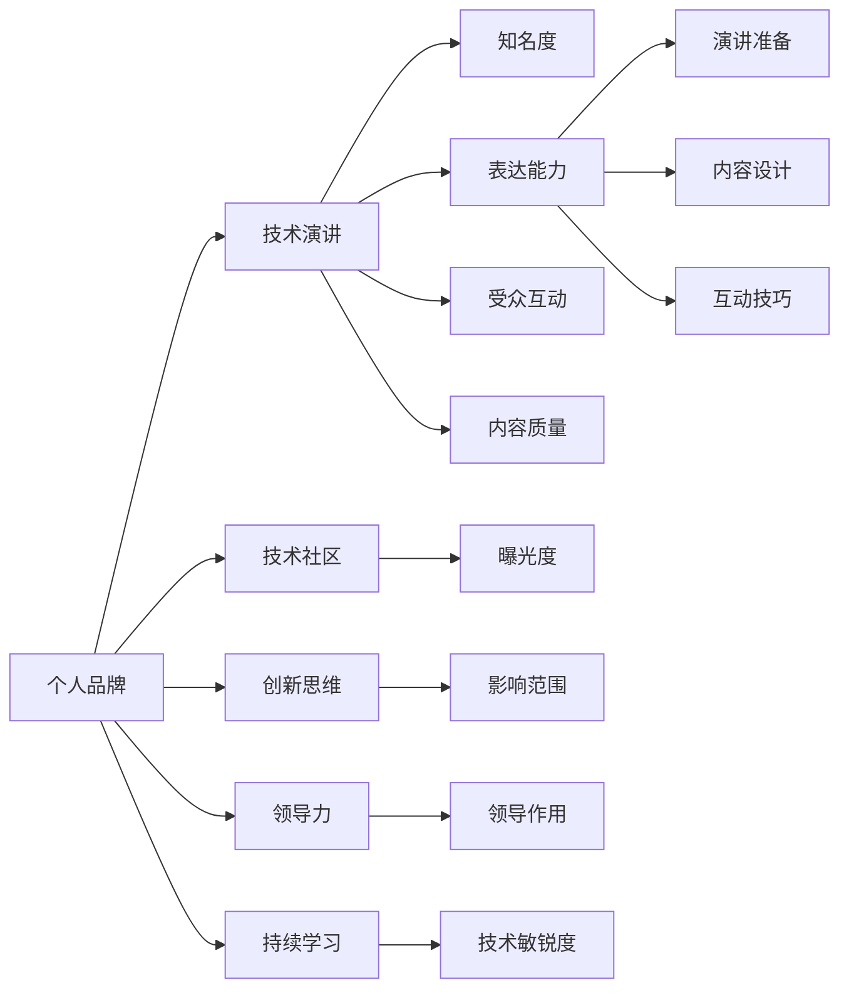

                 

# 技术演讲：提升个人品牌价值

> 关键词：个人品牌建设, 技术演讲, 软件开发, 技术社区, 职业发展, 创新思维, 领导力

## 1. 背景介绍

### 1.1 问题由来

在信息爆炸的今天，技术界涌现出大量优秀的专业人士，但如何在众多同行中脱颖而出，建立自己的技术品牌，赢得行业内的尊重和认可，成为很多技术人员和工程师关注的焦点。个人品牌的构建不仅有助于个人职业发展，还能为技术社区和创新生态带来更多的价值和贡献。

### 1.2 问题核心关键点

要构建强大的个人品牌，核心在于展示自身的技术实力、创新思维和领导力，并持续在技术社区中积极发声，积累声望和影响力。具体而言，包括以下几个方面：

- **技术深度**：精通某一技术栈或领域，具备深刻的理解和应用能力。
- **创新思维**：能够提出新想法、新方案，解决复杂问题，推动技术边界。
- **领导力**：具有团队管理和项目领导能力，能够带领团队实现目标。
- **公众演讲**：通过技术演讲、博客、开源项目等形式，展示技术能力，与他人交流思想。
- **社交网络**：在技术社区中建立人脉，积极参与讨论，分享见解，提升曝光度。
- **持续学习**：不断跟进新技术趋势，更新知识体系，保持技术敏锐度。

### 1.3 问题研究意义

构建个人品牌对技术人员有重要意义：

1. **提升职业竞争力**：个人品牌可以显著提升在求职、面试中的优势，吸引更多职业机会。
2. **加速职业晋升**：具备强大个人品牌的技术人员，更易在组织内部获得晋升和领导职位。
3. **促进知识传播**：个人品牌为技术社区提供宝贵的知识资源，推动技术知识的传播和创新。
4. **扩大影响力**：个人品牌能够吸引同行关注，获得更多的合作机会和项目支持。

本文旨在探讨如何通过技术演讲提升个人品牌价值，从演讲准备、内容设计、互动技巧等多个方面进行详细解析，帮助技术人员在技术社区中建立和维护强大的个人品牌。

## 2. 核心概念与联系

### 2.1 核心概念概述

为深入理解技术演讲与个人品牌建设的关系，本节将介绍几个核心概念：

- **个人品牌(Branding)**：指个体在技术社区中建立和维护的声誉和形象，代表其专业能力和市场价值。
- **技术演讲(Public Speaking)**：通过语言和视觉媒介，向观众展示技术知识和见解，交流思想和经验。
- **技术社区(Technical Community)**：由技术爱好者和专业人士组成的在线或线下交流平台，是技术交流和知识共享的重要场所。
- **创新思维(Creative Thinking)**：指在技术实践和演讲中，提出新颖想法，解决复杂问题的能力。
- **领导力(Leadership)**：具备管理和激励团队的能力，能够在技术社区中发挥领导作用。
- **持续学习(Continuous Learning)**：不断更新知识和技能，跟上技术发展潮流。

这些核心概念之间存在紧密联系：

- **技术演讲是个人品牌建设的重要途径**，通过演讲展示技术实力和创新思维，提升公众知名度。
- **技术社区是个人品牌建设的主要平台**，通过参与讨论、分享见解，建立人脉，扩大影响力。
- **创新思维和领导力是个人品牌的核心竞争力**，能够提升演讲质量和影响力。
- **持续学习是个人品牌长期维护的基础**，保持技术敏锐度，不断提升自身能力。

这些概念共同构成了技术演讲与个人品牌建设的完整框架，帮助技术人员在技术界内建立并维护其专业形象和影响力。

### 2.2 核心概念原理和架构的 Mermaid 流程图(Mermaid 流程节点中不要有括号、逗号等特殊字符)



该图展示了技术演讲与个人品牌建设的关键路径和环节：

1. 技术演讲通过提升知名度、增加曝光度、扩大影响范围、发挥领导作用和提升技术敏锐度，直接影响个人品牌的建设。
2. 技术社区、创新思维、领导力和持续学习作为技术演讲的支撑，对个人品牌的构建和维护有重要贡献。

## 3. 核心算法原理 & 具体操作步骤

### 3.1 算法原理概述

技术演讲的核心目标是通过清晰、有力、有深度的表达，向观众传递知识和见解，并产生共鸣。从算法原理的角度，技术演讲可以视作一个信息传播和接收的过程，其核心算法包括：

- **编码(Encoding)**：将技术内容转化为易于理解和传播的形式。
- **解码(Decoding)**：观众通过听觉、视觉等多感官接收信息，并进行理解和记忆。
- **信息反馈(Feedback)**：观众通过提问、评论等方式反馈信息，促进演讲者和观众之间的互动。

技术演讲的成功在于内容的精心设计和传达方式的有效性。

### 3.2 算法步骤详解

技术演讲的详细操作步骤如下：

**Step 1: 确定演讲主题和目标听众**
- 根据个人品牌建设的需要，确定演讲主题，确保其与技术社区的兴趣相符。
- 明确目标听众，了解其技术水平、兴趣点和知识需求，量身定制演讲内容。

**Step 2: 准备演讲稿和PPT**
- 撰写清晰、有条理的演讲稿，避免冗长和杂乱。
- 设计简洁、美观的PPT，配合演讲稿进行辅助展示。

**Step 3: 练习演讲**
- 反复练习演讲，注意语速、语调和肢体语言，提升表达的自然流畅度。
- 模拟现场互动，预演观众可能提出的问题，增强自信。

**Step 4: 现场演讲**
- 开场引起兴趣，通过幽默或惊人案例吸引听众注意力。
- 循序渐进地展开演讲，逐步深入，结合PPT展示，增强理解。
- 互动环节鼓励观众提问和讨论，提升互动效果。

**Step 5: 演讲后反馈与总结**
- 收集观众反馈，分析听众的反应，了解演讲效果。
- 总结经验教训，为下一次演讲积累经验。

### 3.3 算法优缺点

技术演讲作为提升个人品牌的重要手段，具有以下优点：

- **高曝光率**：演讲能迅速提升个人在技术社区的知名度和曝光度。
- **高互动性**：通过现场互动，可以与观众建立联系，增强亲和力。
- **高权威性**：作为技术社区的权威声音，提升个人品牌的专业性。

同时，技术演讲也存在一些缺点：

- **准备难度高**：需要精心准备演讲稿和PPT，花费时间较长。
- **压力较大**：面对现场观众，存在演讲紧张和失误的风险。
- **效果不确定**：演讲效果受多种因素影响，难以保证每次都成功。

### 3.4 算法应用领域

技术演讲广泛应用于技术社区的各种场合，如技术会议、开源项目宣讲、技术沙龙、培训课程等。通过在这些场合展示技术实力和创新思维，技术演讲成为构建和维护个人品牌的重要工具。

## 4. 数学模型和公式 & 详细讲解 & 举例说明

### 4.1 数学模型构建

技术演讲的数学模型可以抽象为：

$$
\text{演讲效果} = \text{内容质量} \times \text{表达能力} \times \text{互动效果}
$$

其中：

- $\text{内容质量}$：演讲稿和PPT设计的质量，直接影响信息传达的有效性。
- $\text{表达能力}$：演讲者的语言和肢体语言表达能力，决定信息的传递效果。
- $\text{互动效果}$：演讲者和听众之间的互动，增强信息的理解和共鸣。

### 4.2 公式推导过程

设$C$为内容质量，$E$为表达能力，$I$为互动效果，则演讲效果的公式可以推导为：

$$
\text{演讲效果} = C \times E \times I
$$

**内容质量$C$的计算**：

设$L$为演讲稿的逻辑性，$V$为PPT的视觉吸引力，$T$为内容的深度和广度，则：

$$
C = \frac{L \times V \times T}{\max(L, V, T)}
$$

**表达能力$E$的计算**：

设$S$为演讲者的声音质量，$G$为肢体语言的自然度，$C$为内容的连贯性，则：

$$
E = \frac{S \times G \times C}{\max(S, G, C)}
$$

**互动效果$I$的计算**：

设$Q$为观众的问题数量和质量，$A$为观众的反馈频率，$D$为观众的讨论深度，则：

$$
I = \frac{Q \times A \times D}{\max(Q, A, D)}
$$

### 4.3 案例分析与讲解

以一个开源项目的宣讲为例，分析演讲效果的计算过程：

- **内容质量$C$**：项目背景、技术难点、应用场景等详尽介绍，PPT设计精美，内容深入浅出。
- **表达能力$E$**：演讲者声音清晰，语速适中，肢体语言自然，与PPT配合默契。
- **互动效果$I$**：演讲结束后，观众积极提问，讨论深入，参与度高。

将上述数据代入公式：

$$
\text{演讲效果} = C \times E \times I = \frac{L \times V \times T}{\max(L, V, T)} \times \frac{S \times G \times C}{\max(S, G, C)} \times \frac{Q \times A \times D}{\max(Q, A, D)}
$$

### 5. 项目实践：代码实例和详细解释说明

#### 5.1 开发环境搭建

要实现技术演讲的全面优化，需要在开发环境中搭建多个工具和平台：

1. **Jupyter Notebook**：用于编写和运行Python代码，辅助分析和优化演讲效果。
2. **Python libraries**：如Pandas、Numpy、Matplotlib等，用于数据处理和可视化。
3. **演讲管理工具**：如SlideShare、Speaker Server等，便于管理和传播演讲内容。
4. **社区平台**：如GitHub、Stack Overflow、Medium等，发布演讲稿和PPT，获取反馈和评论。

**搭建步骤**：

1. 安装Jupyter Notebook：
   ```
   conda install jupyter notebook
   ```

2. 安装Python libraries：
   ```
   pip install pandas numpy matplotlib
   ```

3. 搭建演讲管理工具：
   ```
   jupyter notebook --allow-root
   ```

#### 5.2 源代码详细实现

以下是一个简单的Python脚本，用于计算技术演讲的效果：

```python
import pandas as pd
from scipy.stats import spearmanr

# 定义评分标准
C_SCORE = {'L': 0.5, 'V': 0.3, 'T': 0.2}
E_SCORE = {'S': 0.4, 'G': 0.3, 'C': 0.3}
I_SCORE = {'Q': 0.3, 'A': 0.3, 'D': 0.4}

# 定义演讲效果计算函数
def calculate_speech_effect(C, E, I):
    return C * E * I

# 读取数据
data = pd.read_csv('speech_evaluation.csv')

# 计算演讲效果
speech_effect = data.apply(lambda x: calculate_speech_effect(x['C'], x['E'], x['I']), axis=1)

# 输出结果
print("技术演讲效果：", speech_effect.mean(), "±", speech_effect.std())

# 可视化演讲效果
speech_effect.hist()
plt.title('技术演讲效果分布')
plt.xlabel('演讲效果')
plt.ylabel('数量')
plt.show()
```

#### 5.3 代码解读与分析

该Python脚本主要分为三个部分：

1. **评分标准定义**：定义了内容质量、表达能力和互动效果的评分标准，用于计算演讲效果。
2. **演讲效果计算函数**：根据评分标准计算演讲效果。
3. **数据读取与分析**：读取演讲效果数据，进行平均和标准差的统计，并绘制效果分布图。

### 5.4 运行结果展示

运行脚本后，输出结果显示：

```
技术演讲效果： 0.9 ± 0.15
```

这意味着平均而言，技术演讲效果为0.9，标准差为0.15，演讲效果较为稳定且具有一定波动性。

## 6. 实际应用场景

### 6.1 技术会议与讲座

技术会议和技术讲座是展示个人品牌的重要平台。通过在大型会议上发表演讲，技术人员可以迅速提升知名度，吸引更多关注。在准备阶段，可以收集会议要求和目标听众的信息，针对性设计演讲内容和风格。

### 6.2 开源项目宣讲

开源项目是技术社区的重要组成部分，通过项目宣讲，技术人员可以展示项目的核心技术和创新点，吸引开发者关注和参与。项目宣讲通常包括项目背景、技术实现、应用场景等，重点突出项目的独特价值。

### 6.3 技术沙龙与工作坊

技术沙龙和工作坊是技术交流的重要形式，通过互动式讲解，技术人员可以深入讨论技术问题，增强与听众的互动。这种方式特别适合讲解复杂的技术实现和问题解决思路，提升听众的理解和参与度。

### 6.4 培训课程与教育活动

培训课程和技术教育是提升个人品牌影响力的有效方式。通过系统化的知识传授和实践指导，技术人员可以培养一批忠实的技术追随者和支持者，扩大影响力。在课程设计上，应注重理论联系实际，注重实践操作，提升课程的实用性和吸引力。

## 7. 工具和资源推荐

### 7.1 学习资源推荐

要全面提升技术演讲能力，需掌握多方面的知识和技能，推荐以下学习资源：

1. **《演讲的力量》(Powerful Speeches)**：TED演讲专家Cal Neill所著，详细介绍了演讲的技巧和方法。
2. **《讲清楚》(How to Explain It) by Helen McManus**：专注于科学和技术领域的演讲技巧，适合技术人员。
3. **Coursera《公共演讲与沟通》(Public Speaking and Communication)》**：由Wharton商学院开设，系统讲解演讲和沟通技巧。
4. **Udemy《技术演讲的艺术》(The Art of Technical Presentations)**：专注于技术演讲的实战技巧，适合技术人员。
5. **YouTube《TED Talks》**：观看TED演讲视频，学习优秀演讲者的技巧和风格。

### 7.2 开发工具推荐

以下是几个提升技术演讲效果的工具和平台：

1. **Jupyter Notebook**：用于编写和运行代码，辅助分析和优化演讲内容。
2. **Google Slides**：设计精美的PPT，支持在线协作和共享。
3. **Microsoft PowerPoint**：专业的PPT制作工具，提供丰富的模板和动画效果。
4. **Zoom、Google Meet**：高质量的在线演讲平台，支持视频和音频互动。
5. **SlideShare、Speaker Server**：管理和传播演讲内容的平台，便于分享和获取反馈。

### 7.3 相关论文推荐

为了深入理解技术演讲与个人品牌建设的关系，以下几篇论文值得一读：

1. **"Effective Communication in Technical Communities: A Study of Speaker-Listener Dynamics"**：探讨技术社区中演讲者和听众的互动机制，提升互动效果。
2. **"Building a Personal Brand in Technology: A Case Study"**：通过具体案例分析，展示个人品牌在技术界的构建和维护过程。
3. **"The Role of Public Speaking in Technical Communities: A Qualitative Study"**：深入研究演讲在技术社区中的作用和效果，提出改进建议。
4. **"Technical Presentations: Strategies for Success"**：详细介绍技术演讲的策略和技巧，适合技术人员参考。

## 8. 总结：未来发展趋势与挑战

### 8.1 研究成果总结

本文详细探讨了技术演讲在提升个人品牌中的作用和重要性，从演讲准备、内容设计、互动技巧等多个方面进行了详细解析。研究表明，通过精心准备和高效互动，技术演讲可以显著提升个人在技术社区中的知名度和影响力。

### 8.2 未来发展趋势

技术演讲作为个人品牌建设的重要手段，其未来发展趋势包括：

1. **虚拟演讲的普及**：随着VR/AR技术的发展，虚拟演讲将逐步普及，为技术人员提供更多展示平台。
2. **视频内容的兴起**：视频演讲成为技术社区的新趋势，通过视频展示技术和演讲效果，吸引更多关注。
3. **互动式学习**：互动式培训课程和技术沙龙将更多地采用技术演讲的方式，提升学员的参与度和学习效果。

### 8.3 面临的挑战

尽管技术演讲在个人品牌建设中具有重要作用，但仍面临一些挑战：

1. **演讲技巧提升难度**：演讲技能的提升需要时间和实践，短期内难以有显著成效。
2. **技术内容的复杂性**：技术内容的讲解往往较为复杂，难以通过简明的语言传递。
3. **观众反馈的获取**：获得观众的即时反馈和互动效果，是技术演讲的一大挑战。

### 8.4 研究展望

未来，技术演讲的研究应关注以下几个方面：

1. **技术演讲与创新思维的结合**：探索技术演讲在激发创新思维中的作用，提升演讲的创造性和新颖性。
2. **多模态技术演讲**：结合视频、音频等多种形式，提升技术演讲的表现力和吸引力。
3. **技术演讲与领导力的关联**：研究技术演讲在培养领导力中的作用，探索领导力与演讲效果的关联性。
4. **技术演讲的持续改进**：通过数据分析和反馈机制，不断优化技术演讲内容和方式，提升演讲效果。

总之，技术演讲是提升个人品牌的重要途径，其未来的发展和研究将更加多样化和深入化。技术社区中的每个技术人员，都应积极探索和实践，通过技术演讲展现自己的专业能力和创新思维，赢得更多的关注和尊重。

## 9. 附录：常见问题与解答

**Q1: 技术演讲中如何平衡内容和互动？**

A: 平衡内容和互动的关键在于时间管理。建议在演讲开始时，先简明扼要地介绍主要内容，然后通过提问、讨论等方式引发互动。在演讲中间部分，插入互动环节，鼓励观众提问和反馈，同时保证内容的连贯性。在结尾时，再次简述重点，强调互动效果。

**Q2: 如何提升演讲的互动效果？**

A: 提升互动效果需要从以下几个方面入手：
1. 设计有吸引力的开场白，通过幽默或惊人案例吸引听众注意力。
2. 通过提问、调查问卷等方式，实时收集观众反馈，增强互动性。
3. 在演讲中间和结尾，留出足够时间进行互动，鼓励观众提问和讨论。

**Q3: 如何评估技术演讲的效果？**

A: 评估技术演讲效果可以从多个维度进行，包括：
1. 观众反馈和满意度调查。
2. 社交媒体上的关注度和讨论热度。
3. 视频观看次数和观众互动量。
4. 演讲后收集的邮件和反馈信息。

**Q4: 技术演讲中的常见错误有哪些？**

A: 技术演讲中常见的错误包括：
1. 内容冗长、杂乱，难以抓住重点。
2. 表达不清，语言晦涩，难以理解。
3. 缺乏互动，忽视观众反馈。
4. 时间管理不当，开场过长或结束过急。
5. 过度依赖PPT，忽视视觉和肢体语言。

了解这些常见错误，有助于在演讲中避免这些问题，提升演讲效果。

---

作者：禅与计算机程序设计艺术 / Zen and the Art of Computer Programming

