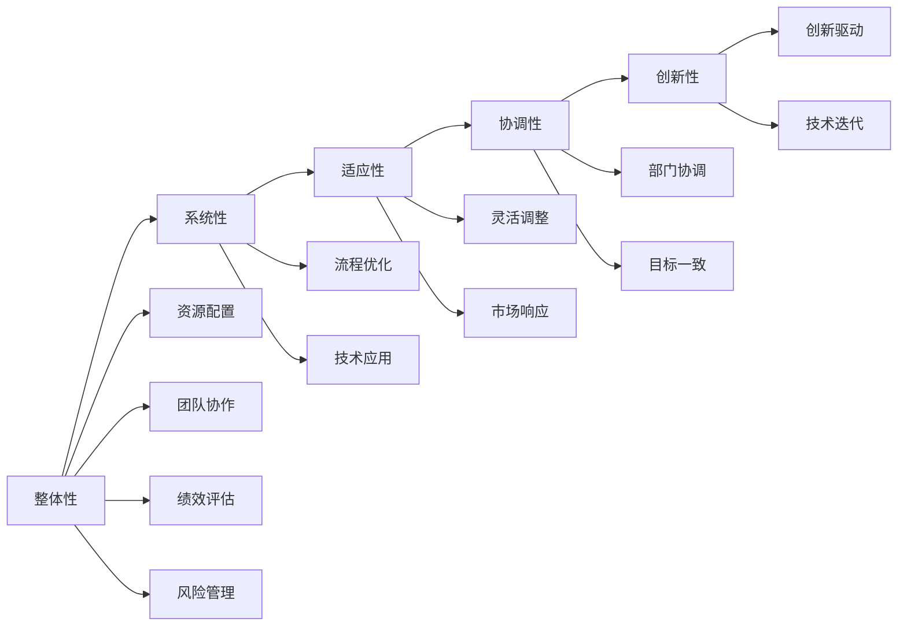

                 

# 拥有体系思维是管理者的必备能力

> 关键词：体系思维，管理体系，管理架构，系统化管理，领导力，团队协作，决策能力，创新力，数据驱动，绩效评估

## 1. 背景介绍

### 1.1 问题由来

在当今快速变化的商业环境中，企业面临着前所未有的复杂性。技术创新日新月异，市场竞争愈发激烈，消费者需求也变得更加个性化。在这样的背景下，管理者需要具备一种能力，能够有效整合资源、协调各个部门，同时适应不确定性、推动创新。

这种能力，被称为“体系思维”。它不仅体现在对企业现有管理体系的宏观理解和优化上，更表现在对市场趋势、技术发展、团队协作的深刻洞察和灵活应对上。拥有体系思维的管理者，能够构建更加系统化、适应性强的管理体系，提升企业的竞争力和持续发展能力。

### 1.2 问题核心关键点

体系思维的核心在于对整体性与系统性的把握。它强调将各个独立的管理环节、职能部门以及技术要素有机结合起来，形成一个动态、协调、高效的整体。以下是体系思维的五个关键点：

1. **整体性**：从宏观角度审视企业内部及外部的所有要素，了解它们之间的相互依赖关系。
2. **系统性**：运用系统方法，识别并优化管理流程和业务流程，确保各环节协同工作。
3. **适应性**：对外部环境的变化快速反应，调整内部资源配置，保持企业的灵活性和竞争力。
4. **协调性**：在复杂多变的业务环境中，协调不同职能部门、团队和个人之间的协作，确保目标一致。
5. **创新性**：不断探索新方法、新技术和新模式，推动企业持续创新。

### 1.3 问题研究意义

体系思维的培养和管理，对于企业发展至关重要。以下是体系思维研究的重要意义：

1. **提升管理效能**：体系思维使管理者的视野更为开阔，能够更全面地考虑问题，避免片面决策，提升整体管理效能。
2. **优化资源配置**：通过系统化管理，更科学地配置和使用资源，提高运营效率。
3. **强化团队协作**：体系思维促进跨部门协作，形成强大的团队合力。
4. **应对不确定性**：构建动态适应系统，使企业能够更好地应对市场变化和不确定性。
5. **促进创新发展**：通过体系化创新管理，激发团队创造力，推动企业持续创新。

## 2. 核心概念与联系

### 2.1 核心概念概述

体系思维是指从整体和系统的角度，全面、系统、动态地管理企业各个环节和要素，以实现整体优化和协调运行。其核心在于：

- **整体性与系统性**：从全局视角，分析各个要素之间的关联和影响，实现系统最优。
- **适应性与协调性**：灵活应对外部变化，协调内部资源，保持高效运作。
- **创新性与变革性**：持续推动管理创新，适应新技术和新趋势。

### 2.2 核心概念原理和架构的 Mermaid 流程图



### 2.3 核心概念之间的联系

体系思维的各核心概念之间存在紧密的联系，形成一个有机整体：

- **整体性与系统性**：整体性是从全局视角理解企业的所有要素，系统性则是将这些要素有机结合，形成协同工作。
- **适应性与协调性**：适应性使企业能够快速应对外部变化，协调性确保内部各个环节协同工作。
- **创新性与变革性**：创新性推动企业不断更新优化，变革性确保企业持续适应新环境和新需求。

通过这种系统化、动态化的管理思维，管理者能够构建更加稳定、高效、灵活的企业管理体系，提升企业的竞争力。

## 3. 核心算法原理 & 具体操作步骤

### 3.1 算法原理概述

体系思维的管理实践，可以抽象为一个系统化、动态化的算法框架。其核心目标是构建一个能够持续适应变化、高效协同运行的动态管理系统。

该算法的核心步骤如下：

1. **识别整体要素**：从全局视角识别企业所有相关要素，包括组织结构、业务流程、技术系统、人员资源等。
2. **分析关联关系**：深入分析这些要素之间的依赖和互动关系，建立系统模型。
3. **优化系统流程**：识别系统中的瓶颈和缺陷，优化流程和资源配置，提高系统效率。
4. **动态调整与适应**：根据外部环境变化，动态调整系统参数，确保系统持续适应。
5. **创新与变革**：推动技术和管理创新，确保系统不断进步。

### 3.2 算法步骤详解

#### 步骤1：识别整体要素

- **组织结构分析**：识别企业的部门、岗位、职责等。
- **业务流程分析**：识别核心业务流程，了解各环节的相互作用。
- **技术系统分析**：识别企业使用的各类技术系统，包括ERP、CRM、OA等。
- **人员资源分析**：识别关键人员和团队，了解其技能和角色。

#### 步骤2：分析关联关系

- **建立系统模型**：将各要素通过逻辑关系连接，形成一个系统模型。
- **识别关键路径**：识别系统中的关键路径和节点，确定其重要性。
- **分析依赖关系**：分析各要素之间的依赖关系，明确协同要求。

#### 步骤3：优化系统流程

- **识别瓶颈**：识别系统中的瓶颈和短板，确定改进方向。
- **优化配置**：优化资源配置，提高系统效率。
- **流程改进**：优化业务流程，减少冗余和低效环节。

#### 步骤4：动态调整与适应

- **实时监测**：实时监测系统运行状态，收集数据。
- **调整参数**：根据实时数据，动态调整系统参数。
- **应对变化**：灵活应对外部环境变化，调整策略。

#### 步骤5：创新与变革

- **技术创新**：引入新技术和新方法，提升系统效率。
- **管理创新**：优化管理流程，提升管理效能。
- **持续改进**：持续推动系统优化，实现持续进步。

### 3.3 算法优缺点

#### 优点

- **系统化管理**：全面、系统地管理企业各个环节，避免片面决策。
- **高效协同**：通过系统模型，实现各个要素的协同工作，提高效率。
- **灵活适应**：动态调整系统参数，快速响应外部变化。
- **持续改进**：持续推动系统优化和创新，保持竞争力。

#### 缺点

- **复杂度高**：系统模型构建和优化过程较为复杂，需要专业知识和技能。
- **数据依赖**：需要大量的实时数据支持，数据质量和完整性要求高。
- **成本高**：系统优化和调整可能需要较大的投入。
- **变革阻力**：传统管理模式和流程的改变，可能面临员工的抵触和接受难度。

### 3.4 算法应用领域

体系思维的管理实践，可以应用于多个领域，包括但不限于：

- **企业战略管理**：从整体视角审视企业战略，优化资源配置，推动战略实施。
- **运营管理**：优化运营流程，提高运营效率，降低成本。
- **人力资源管理**：优化人力资源配置，提升员工满意度和工作效率。
- **供应链管理**：优化供应链流程，提高供应链效率，降低风险。
- **技术创新管理**：推动技术创新，确保技术持续进步，提高竞争力。

## 4. 数学模型和公式 & 详细讲解 & 举例说明

### 4.1 数学模型构建

体系思维的管理实践，可以通过数学模型进行形式化描述。以下是核心模型的构建过程：

- **整体性与系统性**：定义企业所有要素，并建立它们之间的依赖关系。
- **适应性与协调性**：建立动态调整模型，根据外部变化调整内部资源。
- **创新性与变革性**：建立创新驱动模型，推动持续优化和进步。

### 4.2 公式推导过程

#### 整体性与系统性模型

假设企业有 $n$ 个要素 $E_i$，它们之间的关系可以表示为 $E_i \rightarrow E_j$。则整体性模型的目标是最小化系统误差 $\epsilon$：

$$
\min_{\epsilon} \sum_{i=1}^n \sum_{j=1}^n \epsilon_{ij}
$$

其中，$\epsilon_{ij}$ 表示要素 $E_i$ 和 $E_j$ 之间的误差。

#### 适应性与协调性模型

假设企业面临的外部环境因素为 $F_k$，则适应性模型的目标是最小化环境影响 $\rho$：

$$
\min_{\rho} \sum_{k=1}^K \rho_k
$$

其中，$\rho_k$ 表示环境因素 $F_k$ 对系统的影响。

#### 创新性与变革性模型

假设企业引入的新技术为 $T_l$，则创新性模型的目标是最小化技术差距 $\delta$：

$$
\min_{\delta} \sum_{l=1}^L \delta_l
$$

其中，$\delta_l$ 表示新技术 $T_l$ 与现有技术之间的差距。

### 4.3 案例分析与讲解

#### 案例1：供应链管理优化

某公司现有供应链由供应商、生产商、物流商、零售商组成。通过分析各环节的依赖关系，建立系统模型：

- **供应商**：向生产商提供原材料。
- **生产商**：生产产品并送至物流商。
- **物流商**：将产品送至零售商。
- **零售商**：向消费者销售产品。

通过优化配置，提高物流效率，减少库存，降低成本。同时，根据市场需求变化，动态调整生产计划和库存量，确保供需平衡。

#### 案例2：人力资源管理创新

某公司采用体系思维，引入HR信息系统，优化人力资源管理流程：

- **招聘管理**：通过系统自动筛选简历，提高招聘效率。
- **绩效管理**：建立绩效评估系统，动态调整绩效目标。
- **培训管理**：引入在线学习平台，提升员工技能。

通过数据驱动的管理，提升员工满意度和工作效率，增强企业竞争力。

## 5. 项目实践：代码实例和详细解释说明

### 5.1 开发环境搭建

- **Python环境**：安装 Python 3.8 以上版本，建议使用 Anaconda。
- **依赖库**：安装 numpy、pandas、matplotlib 等常用库。
- **开发工具**：使用 PyCharm 或 Jupyter Notebook。

### 5.2 源代码详细实现

#### 整体性与系统性模型代码实现

```python
import numpy as np

# 定义企业要素及关系
E = ['供应商', '生产商', '物流商', '零售商']
F = ['原材料', '产品', '库存', '订单']
R = np.zeros((len(E), len(F)))

# 建立关系矩阵
for i in range(len(E)):
    for j in range(len(F)):
        if E[i] == '供应商' and F[j] == '原材料':
            R[i][j] = 1
        elif E[i] == '生产商' and F[j] == '产品':
            R[i][j] = 1
        elif E[i] == '物流商' and F[j] == '库存':
            R[i][j] = 1
        elif E[i] == '零售商' and F[j] == '订单':
            R[i][j] = 1

# 计算整体性误差
epsilon = np.linalg.norm(R)
print('整体性误差:', epsilon)
```

#### 适应性与协调性模型代码实现

```python
# 定义环境因素及影响
F = ['市场变化', '政策调整', '技术进步', '竞争对手']
rho = np.zeros(len(F))

# 假设各因素对系统影响为常数
rho[0] = 0.2
rho[1] = 0.3
rho[2] = 0.1
rho[3] = 0.4

# 计算适应性影响
rho_sum = np.sum(rho)
print('适应性影响:', rho_sum)
```

#### 创新性与变革性模型代码实现

```python
# 定义新技术及技术差距
T = ['新技术1', '新技术2', '新技术3']
delta = np.zeros(len(T))

# 假设各新技术对现有技术的差距
delta[0] = 0.1
delta[1] = 0.2
delta[2] = 0.3

# 计算创新性差距
delta_sum = np.sum(delta)
print('创新性差距:', delta_sum)
```

### 5.3 代码解读与分析

#### 整体性与系统性模型

- **代码实现**：通过构建关系矩阵，计算整体性误差。
- **分析**：关系矩阵表示企业各要素之间的依赖关系，整体性误差反映系统整体性。

#### 适应性与协调性模型

- **代码实现**：通过定义环境因素及其影响，计算适应性影响。
- **分析**：适应性影响反映外部环境对系统的整体影响。

#### 创新性与变革性模型

- **代码实现**：通过定义新技术及其技术差距，计算创新性差距。
- **分析**：创新性差距反映新技术对现有技术的改进空间。

### 5.4 运行结果展示

- **整体性与系统性模型**：输出整体性误差，表明系统整体性的合理性。
- **适应性与协调性模型**：输出适应性影响，表明系统对外部环境的适应能力。
- **创新性与变革性模型**：输出创新性差距，表明新技术对现有技术的改进潜力。

## 6. 实际应用场景

### 6.1 企业战略管理

企业战略管理是体系思维的重要应用场景之一。通过系统化的战略规划，企业能够全面考虑内外部环境，优化资源配置，推动战略实施。

#### 案例1：战略规划

某公司在制定五年战略规划时，采用体系思维进行整体性与系统性分析：

- **外部环境分析**：分析宏观经济、政策变化、市场需求等因素。
- **内部资源分析**：分析公司的优势和劣势，识别核心竞争力。
- **战略选择**：基于整体性与系统性模型，选择最优战略方案。

通过系统化战略规划，企业能够更科学、全面地应对市场变化，提高战略执行的准确性和效率。

### 6.2 运营管理

运营管理是体系思维的另一个重要应用场景。通过系统化运营管理，企业能够优化流程，提高效率，降低成本。

#### 案例2：运营流程优化

某公司采用体系思维进行运营流程优化：

- **流程识别**：识别关键业务流程，如生产、物流、销售等。
- **瓶颈分析**：分析各流程中的瓶颈和低效环节。
- **优化方案**：提出优化方案，如自动化生产、优化物流路径等。

通过系统化运营管理，企业能够提高运营效率，降低成本，增强竞争力。

### 6.3 人力资源管理

人力资源管理是体系思维的重要应用场景之一。通过系统化人力资源管理，企业能够优化配置，提升员工满意度和工作效率。

#### 案例3：人力资源管理创新

某公司采用体系思维进行人力资源管理创新：

- **员工绩效评估**：建立绩效评估系统，动态调整绩效目标。
- **员工培训**：引入在线学习平台，提升员工技能。
- **员工激励**：制定合理的激励机制，提高员工满意度。

通过系统化人力资源管理，企业能够提升员工满意度和工作效率，增强企业竞争力。

### 6.4 供应链管理

供应链管理是体系思维的重要应用场景之一。通过系统化供应链管理，企业能够优化流程，提高效率，降低风险。

#### 案例4：供应链管理优化

某公司采用体系思维进行供应链管理优化：

- **供应链模型**：构建供应链模型，识别关键环节和路径。
- **优化方案**：优化物流路径，减少库存，降低成本。
- **风险管理**：建立风险预警系统，实时监测供应链状况。

通过系统化供应链管理，企业能够提高供应链效率，降低风险，增强竞争力。

### 6.5 技术创新管理

技术创新管理是体系思维的重要应用场景之一。通过系统化技术创新管理，企业能够推动技术进步，保持竞争力。

#### 案例5：技术创新管理

某公司采用体系思维进行技术创新管理：

- **技术需求分析**：识别技术需求和创新机会。
- **技术路线图**：制定技术路线图，明确技术发展方向。
- **技术实施**：推动技术实施，提升技术水平。

通过系统化技术创新管理，企业能够推动技术进步，增强竞争力。

## 7. 工具和资源推荐

### 7.1 学习资源推荐

- **在线课程**：Coursera 的《System Thinking for Organizational Change》课程，深入讲解系统思维在组织变革中的应用。
- **专业书籍**：《System Thinking for Managers》一书，系统介绍系统思维在企业管理中的应用。
- **研究报告**：Gartner 的《System Thinking in Business Strategy》报告，分析系统思维在企业战略中的重要性。
- **案例分析**：哈佛商学院的《System Thinking Case Studies》，提供系统思维在实际案例中的应用。

### 7.2 开发工具推荐

- **项目管理工具**：JIRA，用于管理项目任务和进度，优化流程。
- **数据分析工具**：Tableau，用于数据可视化，分析运营数据。
- **团队协作工具**：Slack，用于团队沟通协作，提高效率。
- **项目管理框架**：OKR，用于制定和跟踪目标，推动战略执行。

### 7.3 相关论文推荐

- **系统思维理论**：Kurt Lewin 的《Field Theory in Social Science》，奠基系统思维理论。
- **系统思维方法**：Von Bertalanffy 的《General Systems Theory》，系统介绍系统思维方法。
- **系统思维应用**：Johannes C. Lehmann 的《System Thinking in Business》，介绍系统思维在企业管理中的应用。
- **系统思维工具**：Simulink，用于系统建模和仿真，辅助决策。

## 8. 总结：未来发展趋势与挑战

### 8.1 研究成果总结

体系思维作为管理者的必备能力，已经广泛应用于企业管理的各个方面。通过系统化的管理实践，企业能够优化资源配置，提高运营效率，增强竞争力。

### 8.2 未来发展趋势

体系思维的未来发展趋势包括：

- **数据驱动管理**：通过大数据和人工智能技术，实现更科学的管理决策。
- **持续改进管理**：建立持续改进机制，确保系统不断优化。
- **跨领域融合**：与其他领域的管理方法（如精益管理、敏捷管理）进行融合，提升综合管理能力。
- **智能化管理**：引入智能技术，优化管理流程，提高效率。

### 8.3 面临的挑战

体系思维在实际应用中，仍面临一些挑战：

- **数据质量**：系统化管理依赖大量数据，数据质量和完整性要求高。
- **变革阻力**：传统管理模式的改变，可能面临员工的抵触和接受难度。
- **技术复杂性**：系统构建和优化过程复杂，需要专业知识和技能。
- **外部环境变化**：需要快速应对外部环境变化，保持系统动态适应。

### 8.4 研究展望

未来的研究应在以下方面寻求新的突破：

- **数据质量提升**：改进数据采集和管理方法，提高数据质量。
- **变革管理策略**：制定有效的变革管理策略，减少员工抵触。
- **系统优化技术**：引入新技术和方法，提高系统优化效率。
- **跨领域整合**：推动跨领域整合，提升综合管理能力。

通过不断探索和创新，体系思维必将成为管理者的必备能力，引领企业迈向更加智能化、系统化、高效化的未来。

## 9. 附录：常见问题与解答

**Q1：什么是体系思维？**

A: 体系思维是一种从整体和系统角度，全面、系统、动态地管理企业各个环节和要素，以实现整体优化和协调运行的管理方法。

**Q2：体系思维在实际应用中需要注意哪些问题？**

A: 体系思维在实际应用中需要注意以下问题：
- **数据质量**：系统化管理依赖大量数据，需要确保数据质量和完整性。
- **变革阻力**：传统管理模式的改变，可能面临员工的抵触和接受难度。
- **技术复杂性**：系统构建和优化过程复杂，需要专业知识和技能。
- **外部环境变化**：需要快速应对外部环境变化，保持系统动态适应。

**Q3：如何提升企业的管理效能？**

A: 通过系统化的管理实践，企业能够优化资源配置，提高运营效率，增强竞争力。具体措施包括：
- **整体性与系统性管理**：从全局视角分析企业各个环节和要素，建立系统模型。
- **适应性与协调性管理**：根据外部环境变化，动态调整内部资源，保持高效协同。
- **创新性与变革性管理**：推动技术和管理创新，确保系统不断进步。

**Q4：如何构建动态适应系统？**

A: 构建动态适应系统需要以下步骤：
- **实时监测**：实时监测系统运行状态，收集数据。
- **调整参数**：根据实时数据，动态调整系统参数。
- **灵活调整**：根据外部环境变化，灵活调整系统策略，保持动态适应。

通过系统化的管理实践，企业能够构建动态适应系统，快速响应外部变化，保持竞争力。

