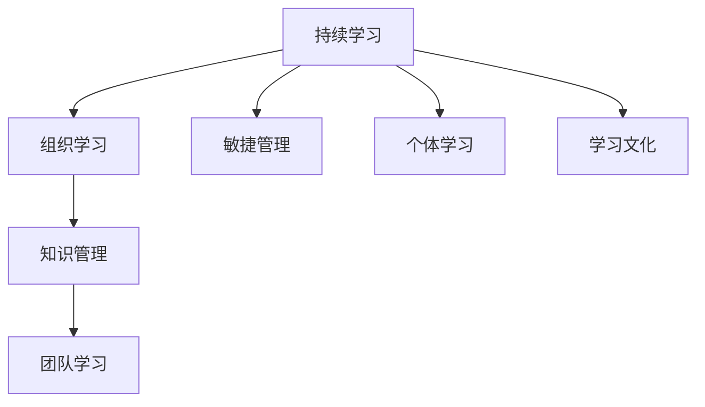

                 

# 持续学习对管理者的重要性

在当前快速变化和高度不确定性的商业环境中，持续学习（Continuous Learning）已成为组织生存和发展的关键要素。管理者作为组织的领航者，必须不断更新自己的知识与技能，以适应新的挑战和机遇。本文将深入探讨持续学习对管理者的重要性，并详细阐述其具体应用领域，提供相应的学习资源和工具，最后总结未来发展趋势与面临的挑战。

## 1. 背景介绍

### 1.1 问题由来

在过去的几十年里，技术进步、市场需求变化、法规政策更新等因素都极大地影响着企业的生存与发展。传统依靠经验与直觉的管理模式已不再适应这个快速变化的商业环境。管理者需要能够不断学习和适应新的技术和管理工具，以保持竞争优势。

### 1.2 问题核心关键点

持续学习作为管理者的核心能力之一，其重要性体现在以下几个方面：

- **适应性**：通过不断学习，管理者能够更快速地适应市场和技术变化，避免陷入“知识枯竭”的困境。
- **创新能力**：持续学习有助于管理者创造性地解决问题，提出新的管理策略，推动组织创新。
- **决策质量**：管理者通过不断学习最新的知识和最佳实践，能够做出更为明智的决策。
- **团队发展**：持续学习不仅提升个人能力，还能够带动团队成员共同成长，增强团队的整体效能。

## 2. 核心概念与联系

### 2.1 核心概念概述

为了更好地理解持续学习对管理者的重要性，本节将介绍几个关键概念：

- **持续学习**：指个体或组织在面对新信息、新技能时，不断更新和完善已有知识结构的过程。
- **组织学习**：组织内部知识、技能和经验的共享与传承，通过集体智慧的积累提升整体效能。
- **知识管理**：组织内部的信息管理和知识利用，包括知识的获取、存储、共享和应用。
- **敏捷管理**：一种快速响应变化、灵活调整管理策略的现代管理方法。

这些概念之间相互关联，共同构成了持续学习的完整框架。通过理解这些核心概念，可以更深刻地把握持续学习对管理者的意义。

### 2.2 核心概念原理和架构的 Mermaid 流程图



此流程图展示了持续学习与组织学习、知识管理、敏捷管理等关键概念之间的联系和互动关系。

## 3. 核心算法原理 & 具体操作步骤

### 3.1 算法原理概述

持续学习的核心在于不断更新已有知识，掌握新技能，并将其应用于实际工作中。对于管理者而言，持续学习通常涉及以下几个步骤：

1. **识别学习需求**：通过日常工作中的反思和反馈，识别需要学习的知识或技能。
2. **寻找学习资源**：利用在线课程、书籍、研讨会等资源，进行系统的学习。
3. **应用新知识**：将学习到的知识应用于管理实践，不断调整和优化管理策略。
4. **评估学习效果**：通过实际效果和反馈，评估学习成果，进行持续改进。

### 3.2 算法步骤详解

具体步骤可以分为以下几个环节：

#### 3.2.1 确定学习目标

管理者需要明确自身需要学习的内容和技能，包括但不限于领导力、团队管理、战略规划、创新思维等。

#### 3.2.2 获取学习资源

利用网络资源，如在线课程（如Coursera、Udemy等）、专业书籍、行业报告、专业研讨会等，获取相关知识。

#### 3.2.3 制定学习计划

根据学习目标和时间安排，制定系统的学习计划，包括学习时间、内容安排、评估标准等。

#### 3.2.4 实施学习过程

按照学习计划，逐步进行知识学习，可以通过在线课程、读书、实践操作等方式进行。

#### 3.2.5 应用学习成果

将学习到的知识应用到实际管理工作中，通过实践检验学习效果，并不断调整策略。

#### 3.2.6 评估学习效果

通过实际工作中的反馈和数据，评估学习成果，进行持续改进。

### 3.3 算法优缺点

持续学习的优点包括：

- **提升竞争优势**：持续学习使管理者能够掌握最新知识和技能，保持竞争优势。
- **增强决策能力**：通过不断学习，管理者能够更全面、准确地进行决策。
- **促进团队成长**：持续学习带动团队成员共同成长，提升团队整体效能。

其缺点包括：

- **学习成本高**：持续学习需要投入大量时间、精力和资源。
- **学习效果难量化**：学习效果和价值有时难以直接量化，影响评估和改进。

### 3.4 算法应用领域

持续学习对管理者的重要性不仅体现在其核心价值上，还表现在其在多个领域的应用：

- **领导力发展**：通过持续学习提升领导能力，更好地带领团队。
- **组织变革管理**：在组织变革过程中，管理者通过学习掌握新知识和技能，推动变革顺利进行。
- **创新管理**：持续学习有助于管理者创造新的管理工具和方法，推动组织创新。
- **危机管理**：在面对危机时，管理者通过持续学习掌握新知识和技能，更好地应对挑战。

## 4. 数学模型和公式 & 详细讲解 & 举例说明

### 4.1 数学模型构建

在管理学中，持续学习的数学模型通常可以表示为：

$$
L(t) = L_0 + \alpha_1 t + \alpha_2 \int_0^t f(t) dt
$$

其中，$L(t)$ 表示在时间 $t$ 时管理者的学习状态，$L_0$ 为初始学习状态，$\alpha_1$ 为知识学习速率，$\alpha_2$ 为技能提升速率，$f(t)$ 表示时间 $t$ 时学习效果的函数。

### 4.2 公式推导过程

为了更好地理解持续学习的动态过程，我们可以通过以下步骤进行推导：

1. **定义状态变量**：$L(t)$ 表示在时间 $t$ 时管理者的学习状态。
2. **建立微分方程**：根据学习过程和目标，建立微分方程模型，表达学习状态随时间变化的规律。
3. **求解微分方程**：通过求解微分方程，得到管理者的学习状态随时间的变化规律。
4. **应用边界条件**：利用初始条件和实际数据，求解微分方程，得到具体的学习效果。

### 4.3 案例分析与讲解

假设某企业中的管理者需要在一年内提升其数据分析能力。通过持续学习，其学习状态 $L(t)$ 可以用以下微分方程表示：

$$
\frac{dL(t)}{dt} = 0.1 + 0.02 \cdot t - 0.01 \cdot L(t)
$$

其中，$0.1$ 表示每年固定学习投入，$0.02 \cdot t$ 表示随时间增加的学习效果，$-0.01 \cdot L(t)$ 表示学习过程中的遗忘效果。

通过求解该微分方程，可以得到管理者一年后的学习状态。

## 5. 项目实践：代码实例和详细解释说明

### 5.1 开发环境搭建

在进行持续学习管理者的实践时，需要一个完善的开发环境。以下是一些推荐的开发环境搭建步骤：

1. **安装Python环境**：使用Anaconda或Miniconda安装Python 3.x版本，并创建虚拟环境。
2. **安装相关库**：安装Pandas、NumPy、SciPy等数据处理库，以及Jupyter Notebook、TensorFlow等深度学习库。
3. **配置项目管理工具**：使用Git、Docker等工具进行项目管理，确保代码的协作和部署。

### 5.2 源代码详细实现

以下是一个简化的代码实例，用于模拟持续学习过程：

```python
import numpy as np
from scipy.integrate import solve_ivp

# 定义微分方程
def func(t, L):
    return 0.1 + 0.02 * t - 0.01 * L

# 初始条件
L0 = 0  # 初始学习状态
t_span = (0, 365)  # 时间范围

# 求解微分方程
sol = solve_ivp(func, t_span, L0, method='RK45', dense_output=True)

# 输出学习状态
print(sol.sol(np.linspace(0, 365, 100)))
```

### 5.3 代码解读与分析

上述代码实现了使用SciPy库中的solve_ivp函数求解微分方程的过程。通过设置微分方程和初始条件，可以模拟管理者的学习状态随时间变化的情况。

## 6. 实际应用场景

### 6.1 领导力发展

管理者通过持续学习可以提升领导力，更好地引领团队。例如，某高层管理者通过系统学习团队管理课程，掌握了有效的团队激励和沟通技巧，从而提高了团队的整体效能。

### 6.2 组织变革管理

在组织变革过程中，管理者通过持续学习掌握新知识和技能，推动变革顺利进行。例如，某公司高管通过学习敏捷管理课程，成功实施了敏捷转型，提高了项目交付效率。

### 6.3 创新管理

持续学习有助于管理者创造新的管理工具和方法，推动组织创新。例如，某企业通过学习数据分析和人工智能课程，将机器学习应用到产品推荐系统，提升了用户体验和销售转化率。

### 6.4 危机管理

在面对危机时，管理者通过持续学习掌握新知识和技能，更好地应对挑战。例如，某医疗机构通过学习公共卫生管理课程，提升了应急响应能力，成功应对了新冠疫情的挑战。

## 7. 工具和资源推荐

### 7.1 学习资源推荐

为了帮助管理者持续学习，以下是一些推荐的资源：

1. **Coursera**：提供来自全球顶尖大学和企业的在线课程，涵盖领导力、创新、数据分析等多个领域。
2. **Udemy**：提供丰富的课程，涵盖管理、技术、创业等多个领域，支持技能提升和职业发展。
3. **edX**：提供来自哈佛大学、麻省理工学院等名校的课程，涵盖领导力、战略管理、创新等主题。
4. **LinkedIn Learning**：提供企业实战课程，涵盖软技能、项目管理、技术工具等多个领域，支持职业发展和技能提升。

### 7.2 开发工具推荐

高效的开发离不开优秀的工具支持。以下是几款用于持续学习实践开发的常用工具：

1. **Anaconda**：Python环境管理工具，支持创建虚拟环境，管理依赖库。
2. **Jupyter Notebook**：交互式编程环境，支持数据可视化、代码调试等。
3. **Git**：版本控制工具，支持代码协作和项目管理。
4. **Docker**：容器化平台，支持快速部署和管理持续学习项目。

### 7.3 相关论文推荐

持续学习作为管理者的重要能力，相关的学术研究也在不断深入。以下是几篇奠基性的相关论文，推荐阅读：

1. **"Continuous Learning in Complex Environments"**：探讨了复杂环境下的持续学习机制和应用。
2. **"Learning and Adapting in the Face of Uncertainty"**：分析了不确定性环境中的持续学习策略。
3. **"Agile Management and Continuous Learning"**：研究了敏捷管理与持续学习之间的关系及其应用。

## 8. 总结：未来发展趋势与挑战

### 8.1 研究成果总结

本文从背景介绍、核心概念与联系、核心算法原理、数学模型与公式、项目实践、实际应用场景、工具和资源推荐等方面，系统性地探讨了持续学习对管理者的重要性。

### 8.2 未来发展趋势

未来，持续学习在管理中的应用将呈现以下几个发展趋势：

1. **自动化学习平台**：通过AI技术和大数据，自动推荐和管理学习内容，提高学习效率。
2. **个性化学习**：根据管理者的学习习惯和需求，个性化定制学习计划，提升学习效果。
3. **虚拟教练**：利用虚拟教练技术，提供实时指导和反馈，帮助管理者更好地掌握新技能。
4. **混合学习模式**：结合在线学习和线下培训，实现多样化的学习方式。

### 8.3 面临的挑战

持续学习在应用过程中也面临一些挑战：

1. **学习资源质量参差不齐**：现有学习资源质量不一，难以找到真正有价值的课程。
2. **学习成果难以量化**：学习效果和价值有时难以直接量化，影响评估和改进。
3. **学习时间和精力有限**：管理者工作繁忙，难以投入大量时间和精力进行持续学习。

### 8.4 研究展望

为了克服这些挑战，未来的研究需要在以下几个方面寻求新的突破：

1. **建立学习效果评估标准**：制定科学合理的评估标准，量化学习成果，进行持续改进。
2. **提升学习资源质量**：开发高质量的在线课程和资源，提升学习体验和效果。
3. **引入虚拟教练**：开发虚拟教练系统，提供实时指导和反馈，提升学习效率。
4. **平衡工作和学习**：开发时间管理工具，帮助管理者更好地平衡工作和学习，提升学习效率。

## 9. 附录：常见问题与解答

### Q1: 如何平衡工作和学习？

A: 管理者需要制定科学的时间管理计划，将学习和工作合理安排。例如，利用碎片时间进行微学习，参与线上培训等。

### Q2: 如何选择合适的学习资源？

A: 可以通过网络评价、同行推荐、课程试用等方式，选择质量高、针对性强的学习资源。

### Q3: 学习成果如何评估？

A: 可以采用反馈调查、工作表现、绩效评估等方法，综合评估学习效果。

### Q4: 如何避免学习内容的陈旧？

A: 持续关注行业动态和前沿技术，定期更新学习内容，保持知识的时效性。

---

作者：禅与计算机程序设计艺术 / Zen and the Art of Computer Programming

