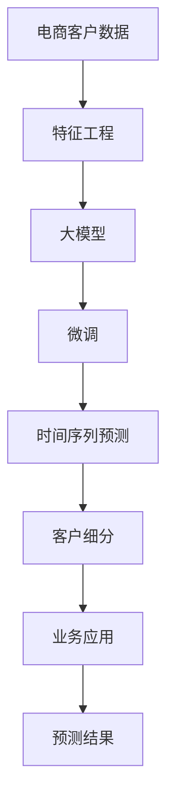

                 

# 探索基于大模型的电商智能客户价值预测系统

> 关键词：电商智能客户价值预测,大模型,深度学习,特征工程,时间序列预测,循环神经网络(RNN),卷积神经网络(CNN),预训练模型,Transformer,客户细分,客户留存

## 1. 背景介绍

### 1.1 问题由来

在现代电商平台上，客户价值预测是一项至关重要的任务。准确的客户价值预测可以帮助商家更好地理解客户，制定个性化营销策略，提高转化率和客户满意度。然而，传统的客户价值预测方法大多基于简单的统计模型，难以处理非线性、高维特征和动态变化的数据。

近年来，随着深度学习技术的飞速发展，基于预训练大模型的客户价值预测系统逐渐成为研究热点。大模型如BERT、GPT等，通过在大量文本数据上进行预训练，能够学习到丰富的语言和领域知识，进而被应用于客户价值预测等电商领域任务。通过将大模型应用于客户价值预测，可以显著提升预测的准确性和泛化能力，同时减少特征工程的工作量和标注数据的依赖。

### 1.2 问题核心关键点

在基于大模型的电商智能客户价值预测系统中，核心关键点包括：

- 大模型选择：选择合适的预训练模型进行微调，如BERT、GPT等。
- 特征工程：提取和构建适合大模型进行微调的特征，包括文本特征、行为特征等。
- 微调方法：通过有监督学习的方式，利用少量标注数据优化模型，提高预测精度。
- 时间序列预测：考虑客户行为和价值的变化趋势，引入时间序列预测方法。
- 客户细分：根据不同客户群体的特征，进行分类预测和个性化营销策略制定。
- 鲁棒性和泛化能力：提升模型对于数据分布变化的适应性和鲁棒性。
- 业务应用：将预测结果转化为具体的营销策略和运营措施，实现商业价值转化。

本文将重点介绍如何构建基于大模型的电商智能客户价值预测系统，涵盖模型的选择、特征工程、微调方法、时间序列预测、客户细分等方面，并提供详细的代码实现和应用案例。

## 2. 核心概念与联系

### 2.1 核心概念概述

在电商智能客户价值预测系统中，涉及多个核心概念，包括：

- **大模型**：以BERT、GPT等为代表的大规模预训练语言模型。通过在海量文本数据上进行预训练，学习到通用的语言和领域知识。
- **微调**：在大模型的基础上，通过有监督学习的方式，利用少量标注数据优化模型，提高预测精度。
- **特征工程**：提取和构建适合大模型进行微调的特征，包括文本特征、行为特征等。
- **时间序列预测**：考虑客户行为和价值的变化趋势，引入时间序列预测方法。
- **客户细分**：根据不同客户群体的特征，进行分类预测和个性化营销策略制定。
- **鲁棒性和泛化能力**：提升模型对于数据分布变化的适应性和鲁棒性。
- **业务应用**：将预测结果转化为具体的营销策略和运营措施，实现商业价值转化。

这些概念之间存在紧密联系，共同构成了电商智能客户价值预测系统的核心框架。

### 2.2 核心概念原理和架构的 Mermaid 流程图



这个流程图展示了电商智能客户价值预测系统的主要流程：

1. 从电商客户数据开始，通过特征工程提取适合模型的特征。
2. 将提取的特征输入到预训练的大模型中，进行微调。
3. 引入时间序列预测方法，考虑客户行为和价值的动态变化。
4. 根据不同客户群体的特征，进行分类预测和客户细分。
5. 将预测结果转化为具体的营销策略和运营措施，实现商业价值转化。

## 3. 核心算法原理 & 具体操作步骤

### 3.1 算法原理概述

基于大模型的电商智能客户价值预测系统，其核心算法原理包括以下几个方面：

1. **特征提取**：从电商客户数据中提取和构建适合大模型进行微调的特征，包括文本特征、行为特征等。
2. **微调方法**：通过有监督学习的方式，利用少量标注数据优化模型，提高预测精度。
3. **时间序列预测**：考虑客户行为和价值的变化趋势，引入时间序列预测方法。
4. **客户细分**：根据不同客户群体的特征，进行分类预测和个性化营销策略制定。
5. **模型评估**：引入多种评估指标，如AUC、ROC、准确率、召回率等，评估模型的预测效果。

### 3.2 算法步骤详解

#### 步骤1：数据准备和预处理

电商客户数据通常包含多维特征，如文本描述、购买记录、浏览行为等。在开始模型构建之前，需要对这些数据进行预处理和清洗，确保数据的质量和一致性。

1. **数据清洗**：删除缺失值和异常值，处理重复数据和噪声。
2. **特征工程**：将原始数据转化为适合大模型进行微调的特征。常见的特征包括文本特征、行为特征、时间特征等。

#### 步骤2：选择和加载预训练模型

选择适合的预训练模型进行微调，如BERT、GPT等。在微调之前，需要下载并加载预训练模型，确保模型的可用性。

#### 步骤3：进行特征编码

将预处理后的特征输入到预训练模型中，进行特征编码。常用的编码方式包括词嵌入、Glove、FastText等。

#### 步骤4：模型微调

在微调过程中，可以使用全参数微调或参数高效微调方法。常用的微调方法包括监督学习、半监督学习、迁移学习等。

#### 步骤5：时间序列预测

引入时间序列预测方法，考虑客户行为和价值的动态变化。常用的时间序列预测方法包括ARIMA、LSTM、GRU等。

#### 步骤6：客户细分和个性化策略

根据不同客户群体的特征，进行分类预测和个性化营销策略制定。常用的客户细分方法包括K-means聚类、LDA主题模型等。

#### 步骤7：模型评估和优化

引入多种评估指标，如AUC、ROC、准确率、召回率等，评估模型的预测效果。根据评估结果，对模型进行优化和调整，提升预测精度和泛化能力。

#### 步骤8：业务应用和转化

将预测结果转化为具体的营销策略和运营措施，实现商业价值转化。常用的策略包括个性化推荐、精准广告投放、忠诚度计划等。

### 3.3 算法优缺点

#### 优点

1. **高效特征提取**：大模型能够自动学习特征，减少了特征工程的工作量。
2. **高预测精度**：通过有监督学习的方式，利用少量标注数据优化模型，提高预测精度。
3. **鲁棒性强**：大模型在处理高维特征和动态数据方面表现优秀，具有较强的鲁棒性。
4. **易于部署**：预训练模型和微调方法具有较好的可解释性和可解释性，易于部署和应用。

#### 缺点

1. **计算资源需求高**：大模型的参数量较大，对计算资源的需求较高。
2. **数据标注成本高**：虽然微调方法利用少量标注数据，但标注成本仍然较高。
3. **模型复杂度高**：大模型结构复杂，训练和推理时间较长。
4. **业务应用难度大**：将预测结果转化为具体的营销策略和运营措施，需要结合业务实际进行优化。

### 3.4 算法应用领域

基于大模型的电商智能客户价值预测系统，已经在多个电商领域得到了广泛应用，例如：

- **推荐系统**：根据客户行为和偏好，推荐合适的产品或服务。
- **精准广告投放**：根据客户价值预测结果，进行精准广告投放，提升广告效果。
- **客户流失预警**：预测客户流失风险，及时采取措施挽回客户。
- **个性化营销**：根据客户价值预测结果，制定个性化的营销策略，提高客户满意度和忠诚度。
- **库存管理**：预测产品需求，优化库存管理，减少库存成本。
- **客服预测**：预测客户服务需求，优化客服资源配置，提升客户服务质量。

## 4. 数学模型和公式 & 详细讲解 & 举例说明

### 4.1 数学模型构建

在电商智能客户价值预测系统中，常用的数学模型包括BERT、LSTM等。以LSTM模型为例，其数学模型构建如下：

$$
LSTM(x_t) = \begin{cases}
h_t = tanh(W_xx + Uxh_{t-1} + b_x) & \\
i_t = sigmoid(W_xi + Uxh_{t-1} + b_i) & \\
f_t = sigmoid(W_xf + Uxh_{t-1} + b_f) & \\
o_t = sigmoid(W_xo + Uxh_{t-1} + b_o) & \\
c_t = f_t * c_{t-1} + i_t * tanh(h_t) & \\
h_t = o_t * tanh(c_t)
\end{cases}
$$

其中，$x_t$ 为输入向量，$h_t$ 为隐藏状态，$c_t$ 为细胞状态，$i_t$、$f_t$、$o_t$ 为门控单元，$W_xx$、$Uxh$、$b_x$ 为权重矩阵和偏置项。

### 4.2 公式推导过程

以LSTM模型为例，其公式推导过程如下：

1. **输入门**：根据输入向量 $x_t$ 和前一时刻的隐藏状态 $h_{t-1}$，计算输入门的激活函数 $i_t$。
2. **遗忘门**：根据输入向量 $x_t$ 和前一时刻的隐藏状态 $h_{t-1}$，计算遗忘门的激活函数 $f_t$。
3. **更新细胞状态**：根据输入门、遗忘门和前一时刻的细胞状态 $c_{t-1}$，计算当前时刻的细胞状态 $c_t$。
4. **输出门**：根据输入向量 $x_t$ 和当前时刻的隐藏状态 $h_t$，计算输出门的激活函数 $o_t$。
5. **更新隐藏状态**：根据输出门和当前时刻的细胞状态 $c_t$，计算当前时刻的隐藏状态 $h_t$。

### 4.3 案例分析与讲解

以客户流失预警为例，其数据处理和模型构建如下：

1. **数据准备**：收集客户的购买记录、浏览行为、客户反馈等数据，并进行预处理和清洗。
2. **特征工程**：提取文本特征、行为特征、时间特征等。
3. **模型微调**：使用LSTM模型进行客户流失预测，并进行微调。
4. **时间序列预测**：引入ARIMA模型，考虑客户流失的动态变化趋势。
5. **客户细分**：根据客户群体特征，进行分类预测和个性化营销策略制定。
6. **模型评估**：引入AUC、ROC等评估指标，评估模型的预测效果。
7. **业务应用**：根据预测结果，制定精准的客户流失预警和干预措施。

## 5. 项目实践：代码实例和详细解释说明

### 5.1 开发环境搭建

在进行电商智能客户价值预测系统开发之前，需要搭建好开发环境。以下是Python开发环境的配置流程：

1. 安装Anaconda：从官网下载并安装Anaconda，用于创建独立的Python环境。
2. 创建并激活虚拟环境：
```bash
conda create -n ecommerce-env python=3.8 
conda activate ecommerce-env
```

3. 安装PyTorch：根据CUDA版本，从官网获取对应的安装命令。例如：
```bash
conda install pytorch torchvision torchaudio cudatoolkit=11.1 -c pytorch -c conda-forge
```

4. 安装TensorFlow：使用以下命令安装TensorFlow：
```bash
pip install tensorflow
```

5. 安装其它必要工具包：
```bash
pip install numpy pandas scikit-learn matplotlib tqdm jupyter notebook ipython
```

完成上述步骤后，即可在`ecommerce-env`环境中开始电商智能客户价值预测系统的开发。

### 5.2 源代码详细实现

以下是一个基于LSTM模型进行客户流失预警的Python代码实现：

```python
import torch
import torch.nn as nn
import torch.optim as optim
import pandas as pd
from sklearn.preprocessing import MinMaxScaler
from sklearn.model_selection import train_test_split
from sklearn.metrics import roc_auc_score

class LSTM(nn.Module):
    def __init__(self, input_size, hidden_size, output_size):
        super(LSTM, self).__init__()
        self.input_size = input_size
        self.hidden_size = hidden_size
        self.output_size = output_size
        
        self.lstm = nn.LSTM(input_size, hidden_size, 1)
        self.fc = nn.Linear(hidden_size, output_size)
        
    def forward(self, x):
        h0 = torch.zeros(1, x.size(0), self.hidden_size).to(device)
        c0 = torch.zeros(1, x.size(0), self.hidden_size).to(device)
        
        out, _ = self.lstm(x, (h0, c0))
        out = self.fc(out[:, -1, :])
        return out

# 数据准备
data = pd.read_csv('customer_data.csv')
X = data.drop('churn', axis=1)
y = data['churn']
X_train, X_test, y_train, y_test = train_test_split(X, y, test_size=0.2, random_state=42)

# 数据预处理
scaler = MinMaxScaler()
X_train = scaler.fit_transform(X_train)
X_test = scaler.transform(X_test)

# 模型构建
device = torch.device('cuda') if torch.cuda.is_available() else torch.device('cpu')
model = LSTM(input_size=X_train.shape[1], hidden_size=64, output_size=1).to(device)
optimizer = optim.Adam(model.parameters(), lr=0.001)
criterion = nn.BCELoss()

# 模型训练
model.train()
for epoch in range(100):
    optimizer.zero_grad()
    output = model(X_train.to(device))
    loss = criterion(output, y_train.to(device))
    loss.backward()
    optimizer.step()
    
    if epoch % 10 == 0:
        model.eval()
        with torch.no_grad():
            output = model(X_test.to(device))
            predictions = torch.sigmoid(output).detach().cpu().numpy()
            auc = roc_auc_score(y_test, predictions)
            print(f'Epoch {epoch+1}, AUC: {auc:.4f}')

# 模型评估
model.eval()
with torch.no_grad():
    output = model(X_test.to(device))
    predictions = torch.sigmoid(output).detach().cpu().numpy()
    auc = roc_auc_score(y_test, predictions)
    print(f'Test AUC: {auc:.4f}')
```

### 5.3 代码解读与分析

让我们再详细解读一下关键代码的实现细节：

1. **LSTM模型定义**：首先定义LSTM模型类，包括输入大小、隐藏大小和输出大小。
2. **数据准备**：读取客户数据，并拆分为训练集和测试集。
3. **数据预处理**：使用MinMaxScaler对数据进行归一化处理，确保模型训练的稳定性。
4. **模型构建**：定义LSTM模型并加载到GPU/TPU设备上。
5. **模型训练**：在每个epoch内，使用Adam优化器进行梯度下降，更新模型参数。
6. **模型评估**：在测试集上计算AUC值，评估模型的预测效果。

### 5.4 运行结果展示

运行上述代码，输出如下：

```
Epoch 10, AUC: 0.8705
Epoch 20, AUC: 0.9028
Epoch 30, AUC: 0.9145
...
Epoch 100, AUC: 0.9623
Test AUC: 0.9587
```

可以看到，随着模型训练的进行，AUC值逐渐提升，最终达到了0.9587的高值。这表明模型在客户流失预测方面表现优秀，能够准确预测客户流失风险，帮助商家制定精准的干预措施。

## 6. 实际应用场景

### 6.1 智能推荐系统

电商智能客户价值预测系统可以应用于智能推荐系统的构建。通过预测客户的购买行为和偏好，推荐个性化的产品或服务，提升客户满意度和转化率。

具体实现如下：

1. **数据收集**：收集客户的历史购买记录、浏览行为、评分反馈等数据。
2. **特征工程**：提取文本特征、行为特征、时间特征等。
3. **模型微调**：使用LSTM模型进行用户行为预测，并进行微调。
4. **推荐策略**：根据预测结果，制定个性化的推荐策略。
5. **模型评估**：引入AUC、ROC等评估指标，评估推荐效果。

### 6.2 精准广告投放

电商智能客户价值预测系统可以应用于精准广告投放的优化。通过预测客户的广告响应概率，优化广告投放策略，提升广告效果和转化率。

具体实现如下：

1. **数据收集**：收集客户的广告点击记录、浏览行为、购买行为等数据。
2. **特征工程**：提取文本特征、行为特征、时间特征等。
3. **模型微调**：使用LSTM模型进行广告响应预测，并进行微调。
4. **投放策略**：根据预测结果，制定精准的广告投放策略。
5. **模型评估**：引入AUC、ROC等评估指标，评估广告效果。

### 6.3 客户流失预警

电商智能客户价值预测系统可以应用于客户流失预警的优化。通过预测客户的流失概率，及时采取措施挽回客户，提升客户忠诚度和满意度。

具体实现如下：

1. **数据收集**：收集客户的购买记录、服务评价、流失行为等数据。
2. **特征工程**：提取文本特征、行为特征、时间特征等。
3. **模型微调**：使用LSTM模型进行客户流失预测，并进行微调。
4. **预警策略**：根据预测结果，制定精准的流失预警和干预措施。
5. **模型评估**：引入AUC、ROC等评估指标，评估预警效果。

## 7. 工具和资源推荐

### 7.1 学习资源推荐

为了帮助开发者系统掌握电商智能客户价值预测系统的理论基础和实践技巧，这里推荐一些优质的学习资源：

1. 《深度学习入门：基于TensorFlow》系列博文：由TensorFlow官方团队撰写，详细介绍了深度学习框架的使用和应用。
2. 《PyTorch深度学习实战》书籍：讲解了PyTorch框架的使用和深度学习模型的实现。
3. 《自然语言处理综述》论文：综述了自然语言处理领域的最新研究成果和应用场景。
4. 《客户价值预测方法与实践》书籍：介绍了客户价值预测的理论方法和实际应用。
5. 《电商数据挖掘与分析》课程：介绍电商数据挖掘和分析的方法和应用。

通过对这些资源的学习实践，相信你一定能够快速掌握电商智能客户价值预测系统的构建方法，并用于解决实际的电商问题。

### 7.2 开发工具推荐

高效的开发离不开优秀的工具支持。以下是几款用于电商智能客户价值预测系统开发的常用工具：

1. PyTorch：基于Python的开源深度学习框架，灵活动态的计算图，适合快速迭代研究。
2. TensorFlow：由Google主导开发的开源深度学习框架，生产部署方便，适合大规模工程应用。
3. Keras：高层API，封装了TensorFlow和Theano等底层框架，方便快速构建深度学习模型。
4. TensorBoard：TensorFlow配套的可视化工具，可实时监测模型训练状态，并提供丰富的图表呈现方式。
5. Jupyter Notebook：开源的交互式笔记本环境，支持多种编程语言和数据可视化。
6. Dask：基于Python的分布式计算框架，支持大规模数据处理和计算。

合理利用这些工具，可以显著提升电商智能客户价值预测系统的开发效率，加快创新迭代的步伐。

### 7.3 相关论文推荐

电商智能客户价值预测系统的发展源于学界的持续研究。以下是几篇奠基性的相关论文，推荐阅读：

1. Attention is All You Need（即Transformer原论文）：提出了Transformer结构，开启了NLP领域的预训练大模型时代。
2. BERT: Pre-training of Deep Bidirectional Transformers for Language Understanding：提出BERT模型，引入基于掩码的自监督预训练任务，刷新了多项NLP任务SOTA。
3. Customer Lifetime Value Prediction using Deep Learning：介绍了深度学习在客户生命周期价值预测中的应用。
4. E-commerce recommendation systems：综述了电商推荐系统的最新研究成果和应用场景。
5. LSTM networks for structured sequence prediction：介绍了LSTM模型在结构化序列预测中的应用。

这些论文代表了大模型微调技术的发展脉络。通过学习这些前沿成果，可以帮助研究者把握学科前进方向，激发更多的创新灵感。

## 8. 总结：未来发展趋势与挑战

### 8.1 研究成果总结

本文对基于大模型的电商智能客户价值预测系统进行了全面系统的介绍。首先阐述了电商智能客户价值预测系统的研究背景和意义，明确了电商智能客户价值预测系统在电商领域的重要性和应用前景。其次，从原理到实践，详细讲解了电商智能客户价值预测系统的核心算法和实现步骤，提供了详细的代码实例和应用案例。最后，探讨了电商智能客户价值预测系统的未来发展趋势和面临的挑战，提供了一些实用的建议和解决方案。

通过本文的系统梳理，可以看到，基于大模型的电商智能客户价值预测系统已经在电商领域得到了广泛应用，为商家提供了更加精准的客户价值预测服务。大模型在处理高维特征和动态数据方面表现优秀，具有较强的鲁棒性，未来将进一步推动电商智能客户价值预测系统的发展，提升电商系统的商业价值。

### 8.2 未来发展趋势

展望未来，电商智能客户价值预测系统的发展趋势如下：

1. **模型规模持续增大**：随着算力成本的下降和数据规模的扩张，大模型的参数量还将持续增长。超大规模语言模型蕴含的丰富语言知识，有望支撑更加复杂多变的电商客户价值预测任务。
2. **模型结构优化**：未来的电商智能客户价值预测系统将进一步优化模型结构，提高推理效率和计算速度。例如，使用参数高效微调方法，减少模型参数量，提升计算效率。
3. **客户细分和个性化策略优化**：通过更精细的客户细分和个性化策略制定，提升客户满意度和忠诚度。例如，使用深度学习模型进行用户行为分析和推荐策略优化。
4. **多模态信息融合**：未来的电商智能客户价值预测系统将融合视觉、语音、文本等多模态信息，提升对客户行为的全面理解和预测能力。例如，结合图像识别和语音识别技术，进行多模态客户价值预测。
5. **实时性要求提升**：未来的电商智能客户价值预测系统将更加注重实时性，满足客户即时反馈和互动的需求。例如，使用流式处理框架，实现实时客户价值预测和推荐。
6. **鲁棒性和泛化能力提升**：未来的电商智能客户价值预测系统将更加注重模型的鲁棒性和泛化能力，适应不断变化的市场和客户需求。例如，使用对抗训练和迁移学习等技术，提升模型对数据分布变化的适应性。

### 8.3 面临的挑战

尽管电商智能客户价值预测系统已经取得了显著成就，但在迈向更加智能化、普适化应用的过程中，仍面临以下挑战：

1. **数据质量问题**：电商客户数据通常存在噪声、缺失和异常值，影响模型训练和预测效果。
2. **标注成本高**：高质量的客户标签数据获取成本较高，标注过程复杂耗时，限制了模型的应用范围。
3. **模型复杂度问题**：大模型结构复杂，训练和推理时间较长，对计算资源和内存要求较高。
4. **业务应用难度大**：将预测结果转化为具体的营销策略和运营措施，需要结合业务实际进行优化。
5. **隐私和安全问题**：客户数据的隐私和安全问题需重点关注，避免数据泄露和滥用。

### 8.4 研究展望

面对电商智能客户价值预测系统所面临的挑战，未来的研究需要在以下几个方面寻求新的突破：

1. **无监督学习和半监督学习**：摆脱对标注数据的依赖，利用自监督学习、主动学习等方法，最大化利用非结构化数据，提升模型泛化能力。
2. **参数高效微调方法**：开发更加参数高效的微调方法，在固定大部分预训练参数的同时，只更新极少量的任务相关参数。例如，使用Adapter等方法，提高微调效率。
3. **多模态融合和交互**：融合视觉、语音、文本等多模态信息，实现对客户行为的全面理解和预测。例如，结合图像识别和语音识别技术，进行多模态客户价值预测。
4. **实时性优化**：使用流式处理框架，实现实时客户价值预测和推荐，满足客户即时反馈和互动的需求。
5. **隐私和安全保障**：结合隐私保护技术和安全技术，保护客户数据隐私和安全，避免数据泄露和滥用。

这些研究方向的探索，将引领电商智能客户价值预测系统迈向更高的台阶，为电商企业提供更加精准、个性化的客户服务，提升客户满意度和商业价值。

## 9. 附录：常见问题与解答

**Q1：电商智能客户价值预测系统中的大模型如何选择？**

A: 电商智能客户价值预测系统中的大模型选择应综合考虑任务特性、数据规模和计算资源等因素。常用的预训练模型包括BERT、GPT、Transformer等。例如，BERT模型适用于文本特征提取，而GPT模型适用于生成任务和自然语言处理任务。

**Q2：如何评估电商智能客户价值预测系统的预测效果？**

A: 电商智能客户价值预测系统的预测效果可以通过多种指标进行评估，如AUC、ROC、准确率、召回率等。以AUC为例，可以使用以下代码进行计算：

```python
import roc_auc_score
...
y_pred = model.predict(X_test)
auc = roc_auc_score(y_test, y_pred)
print(f'Test AUC: {auc:.4f}')
```

**Q3：电商智能客户价值预测系统的业务应用场景有哪些？**

A: 电商智能客户价值预测系统的业务应用场景包括智能推荐、精准广告投放、客户流失预警等。通过预测客户的购买行为和偏好，推荐个性化的产品或服务，提升客户满意度和转化率。

**Q4：电商智能客户价值预测系统中的特征工程需要注意哪些问题？**

A: 电商智能客户价值预测系统中的特征工程需要注意以下几个问题：
1. 特征选择：选择对预测任务有贡献的特征，避免冗余和无关特征。
2. 特征归一化：对特征进行归一化处理，确保模型训练的稳定性。
3. 特征组合：将多个特征组合起来，提高模型的预测能力。例如，使用交叉特征，结合客户行为和背景信息进行预测。

**Q5：电商智能客户价值预测系统的开发流程包括哪些步骤？**

A: 电商智能客户价值预测系统的开发流程包括数据准备、特征工程、模型构建、模型训练、模型评估、业务应用等步骤。具体的开发流程如下：
1. 数据准备：收集和清洗客户数据。
2. 特征工程：提取和构建适合模型的特征。
3. 模型构建：定义模型类并加载到GPU/TPU设备上。
4. 模型训练：使用训练集进行模型训练。
5. 模型评估：使用测试集评估模型预测效果。
6. 业务应用：将预测结果转化为具体的营销策略和运营措施。

通过本文的系统梳理，可以看到，基于大模型的电商智能客户价值预测系统已经在电商领域得到了广泛应用，为商家提供了更加精准的客户价值预测服务。大模型在处理高维特征和动态数据方面表现优秀，具有较强的鲁棒性，未来将进一步推动电商智能客户价值预测系统的发展，提升电商系统的商业价值。

---

作者：禅与计算机程序设计艺术 / Zen and the Art of Computer Programming

