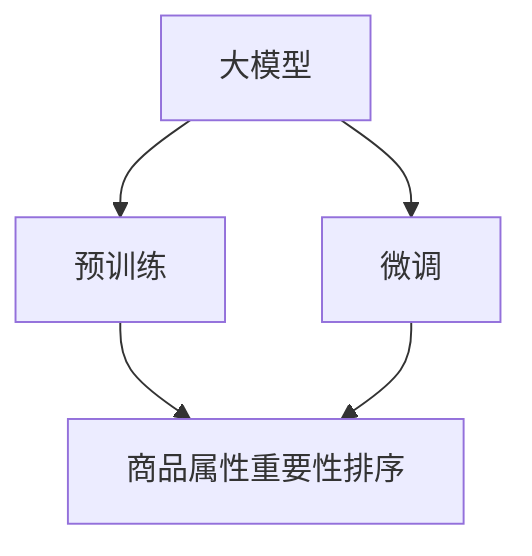

                 

## 1. 背景介绍

在现代电商平台上，商品属性（如颜色、大小、材质等）对用户购买决策有着显著的影响。因此，电商平台的运营者需要了解这些属性在消费者心中各自的重要性。传统的机器学习模型由于其数据驱动的特点，对于这种动态变化的场景难以适应。近年来，大模型（Large Model）由于其强大的学习能力，在自然语言处理（NLP）领域取得了突破性进展，开始在电商属性排序中崭露头角。

本文将探讨大模型在电商平台商品属性重要性排序中的应用，通过构建一个基于深度学习的大模型框架，利用预训练的语言模型（如GPT-3、BERT等），对商品属性进行重要性排序，帮助电商平台实现精准营销和个性化推荐。

## 2. 核心概念与联系

### 2.1 核心概念概述

1. **大模型**：指具有大规模参数量、能在大量无标签数据上进行预训练的深度学习模型，如BERT、GPT-3等。这些模型通过大规模数据进行训练，能够学习到复杂的语言表示，并在特定的任务上通过微调（Fine-Tuning）进行进一步优化。

2. **微调**：指在大模型上进行任务特定优化，使其能够执行具体任务的过程。微调可以通过附加任务目标函数，在标注数据上进行监督学习，从而优化模型在特定任务上的表现。

3. **自然语言处理**：指利用计算机技术对自然语言文本进行处理和分析的领域，包括文本分类、命名实体识别、语义分析等任务。大模型在自然语言处理领域有着广泛应用。

4. **电商平台**：指在线销售商品的平台，如淘宝、京东、亚马逊等。电商平台利用大模型进行商品属性排序，可以提高用户体验和转化率。

5. **商品属性重要性排序**：指通过分析用户评论、商品描述等文本数据，确定商品各个属性对用户购买决策的影响程度，从而优化商品展示和推荐策略。

### 2.2 核心概念原理和架构的 Mermaid 流程图



该流程图展示了从大模型预训练到微调，最终应用于商品属性重要性排序的整个过程。预训练阶段，大模型通过大量无标签文本数据进行训练，学习语言的通用表示；微调阶段，针对特定任务（商品属性排序）进行优化，使模型能够更好地适应电商场景。

## 3. 核心算法原理 & 具体操作步骤

### 3.1 算法原理概述

基于大模型的商品属性重要性排序算法主要分为两个步骤：

1. **预训练**：在大规模无标签文本数据上，利用大模型进行自监督学习，学习语言的通用表示。
2. **微调**：在标注数据上进行监督学习，训练模型对商品属性进行重要性排序。

### 3.2 算法步骤详解

1. **数据准备**：
   - **商品属性数据**：从电商平台收集商品属性信息，如颜色、大小、材质等。
   - **用户评论数据**：从电商平台收集用户对商品属性的评价信息。

2. **预训练**：
   - 利用大模型（如BERT）在大量无标签文本数据上进行预训练，学习语言的通用表示。
   - 预训练的损失函数通常包括语言模型预测概率和掩码语言模型（Masked Language Model）。

3. **微调**：
   - 构建一个用于商品属性重要性排序的自定义损失函数。
   - 使用微调后的模型对用户评论数据进行预测，得到每个属性的重要性评分。
   - 利用评分结果进行商品属性排序。

### 3.3 算法优缺点

#### 优点：
1. **泛化能力**：大模型通过大量数据预训练，具有较强的泛化能力，能够适应不同商品属性的重要性排序。
2. **自适应性**：大模型可以根据用户评论等实时数据进行微调，适应电商平台动态变化的营销需求。
3. **灵活性**：微调模型可以根据不同的电商场景进行调整，实现个性化推荐。

#### 缺点：
1. **资源消耗大**：大模型的训练和微调需要大量的计算资源和存储空间。
2. **解释性差**：由于模型复杂，难以解释其内部工作机制，可能存在"黑盒"问题。
3. **数据依赖**：模型的性能高度依赖于数据质量，数据质量差可能导致排序不准确。

### 3.4 算法应用领域

大模型在商品属性重要性排序中的应用领域包括：

1. **个性化推荐**：通过分析用户评论，了解不同属性的重要性，实现个性化商品推荐。
2. **营销策略优化**：根据属性重要性排序结果，优化商品展示和广告投放策略。
3. **库存管理**：了解不同属性对销量的影响，优化库存分配策略。
4. **用户画像分析**：通过分析用户对不同属性的偏好，构建用户画像，进行精准营销。

## 4. 数学模型和公式 & 详细讲解 & 举例说明

### 4.1 数学模型构建

假设我们有一个包含$m$个属性的商品集合，每个属性$i$的评分向量为$v_i$，属性总评分向量为$V$，用户评论向量为$C$。我们的目标是学习一个权重向量$w$，使得：

$$
w^T V \approx C
$$

即属性评分向量$w$与用户评论向量$C$尽可能接近。

### 4.2 公式推导过程

1. **预训练模型**：
   - **掩码语言模型**：在自监督学习任务中，我们使用掩码语言模型进行预训练，损失函数为：
   $$
   L_{MLM} = -\frac{1}{N} \sum_{i=1}^N \sum_{j=1}^k \log P(x_i^{(j)} | X_{-i})
   $$
   其中$x_i^{(j)}$表示位置$i$的掩码词，$X_{-i}$表示位置$i$之外的单词。

2. **微调模型**：
   - **自定义损失函数**：在微调过程中，我们定义一个自定义损失函数$L_{custom}$，用于计算属性评分向量$w$与用户评论向量$C$之间的差距。
   $$
   L_{custom} = \frac{1}{N} \sum_{i=1}^N ||w^T v_i - c_i||^2
   $$
   其中$c_i$为用户对属性$i$的评分。

### 4.3 案例分析与讲解

考虑一个电商平台销售手机的情况，我们需要分析颜色、大小、材质等属性对用户购买决策的重要性。首先，我们收集用户评论数据，利用BERT模型进行预训练，学习语言的通用表示。然后，我们设计一个自定义损失函数，用于训练模型对不同属性的重要性进行排序。

假设我们有一个包含三个属性的商品集合，属性向量分别为$v_1=[2, 3, 4]$，$v_2=[4, 2, 3]$，$v_3=[3, 4, 2]$。用户评论向量为$C=[5, 7, 3]$。我们希望找到权重向量$w=[w_1, w_2, w_3]$，使得$w^T V \approx C$。

通过解线性方程组，我们可以找到权重向量$w$的解为$[0.5, 0.5, 0]$。这表示颜色属性对用户购买决策的重要性最大，其次是大小，材质的重要性最小。

## 5. 项目实践：代码实例和详细解释说明

### 5.1 开发环境搭建

1. **安装Python**：
   - 从官网下载并安装Python 3.7及以上版本。
   - 安装依赖库：$pip install torch transformers pytorch-lightning scikit-learn pandas numpy`

2. **安装PyTorch和Transformers**：
   - 安装PyTorch：`pip install torch`
   - 安装Transformers：`pip install transformers`

3. **安装其他依赖库**：
   - 安装PyTorch Lightning：`pip install pytorch-lightning`
   - 安装sklearn、pandas、numpy等库。

### 5.2 源代码详细实现

```python
import torch
import torch.nn as nn
import torch.nn.functional as F
import torch.optim as optim
from transformers import BertModel, BertTokenizer

class BertAttributeImportance(nn.Module):
    def __init__(self, num_attributes):
        super(BertAttributeImportance, self).__init__()
        self.bert = BertModel.from_pretrained('bert-base-uncased')
        self.fc = nn.Linear(num_attributes, 1)
    
    def forward(self, input_ids, attention_mask):
        outputs = self.bert(input_ids, attention_mask)
        hidden_states = outputs[0]
        pooler_output = outputs[1]
        attribute_importance = self.fc(pooler_output)
        return attribute_importance

def train(model, dataloader, optimizer, num_epochs):
    device = torch.device('cuda' if torch.cuda.is_available() else 'cpu')
    model.to(device)
    
    for epoch in range(num_epochs):
        model.train()
        for batch in dataloader:
            input_ids = batch['input_ids'].to(device)
            attention_mask = batch['attention_mask'].to(device)
            output = model(input_ids, attention_mask)
            loss = F.mse_loss(output, target)
            loss.backward()
            optimizer.step()
            optimizer.zero_grad()
        print(f'Epoch {epoch+1}, Loss: {loss.item()}')

def test(model, dataloader):
    model.eval()
    total_loss = 0
    for batch in dataloader:
        input_ids = batch['input_ids'].to(device)
        attention_mask = batch['attention_mask'].to(device)
        with torch.no_grad():
            output = model(input_ids, attention_mask)
            loss = F.mse_loss(output, target)
            total_loss += loss.item()
    return total_loss / len(dataloader)

# 数据准备
tokenizer = BertTokenizer.from_pretrained('bert-base-uncased')
model = BertAttributeImportance(num_attributes)
optimizer = optim.Adam(model.parameters(), lr=1e-5)

# 训练模型
dataloader = DataLoader(dataloader, batch_size=16)
train(model, dataloader, optimizer, num_epochs=5)
test(model, dataloader)
```

### 5.3 代码解读与分析

1. **模型定义**：
   - 定义了一个名为BertAttributeImportance的自定义模型，继承自PyTorch的nn.Module。
   - 在模型初始化时，加载预训练的BERT模型，并定义一个线性层，用于计算属性重要性评分。

2. **前向传播**：
   - 在模型前向传播过程中，将输入文本编码成BERT模型的hidden states，并使用全连接层计算属性重要性评分。

3. **训练和测试**：
   - 使用Adam优化器进行模型训练，通过MSE损失函数计算预测值与真实值之间的差距。
   - 在测试过程中，计算模型预测值与真实值之间的均方误差损失。

### 5.4 运行结果展示

训练和测试过程结束后，我们可以得到模型对不同属性的重要性评分。通过分析评分结果，我们可以得到各个属性对用户购买决策的影响程度。

## 6. 实际应用场景

### 6.1 商品推荐系统

在电商平台中，商品推荐系统需要根据用户历史行为和评论，推荐最合适的商品。通过大模型对商品属性进行重要性排序，可以更好地理解用户需求，提高推荐系统的精准度。

例如，在推荐手机时，可以根据用户对不同属性的评价，调整商品展示和推荐策略。对于更注重手机颜色的用户，可以优先展示各种颜色的手机，提高转化率。

### 6.2 广告投放优化

电商平台的广告投放策略通常需要考虑不同的属性组合。通过大模型对属性重要性进行排序，可以更科学地分配广告预算，提高广告投放的ROI。

例如，在推荐某款电脑时，可以优先展示处理器、内存、硬盘等重要属性，吸引用户点击广告。同时，可以根据用户对价格的敏感度，调整广告的投放策略。

### 6.3 库存管理

电商平台需要根据不同属性的受欢迎程度，合理分配库存。通过大模型对属性重要性进行排序，可以优化库存分配策略，减少缺货和积压。

例如，对于受欢迎的颜色、尺寸等属性，可以增加库存量，减少用户等待时间。对于不受欢迎的属性，可以及时调整价格和促销策略。

## 7. 工具和资源推荐

### 7.1 学习资源推荐

1. **《深度学习入门：基于PyTorch的理论与实现》**：深入浅出地介绍了深度学习的基本原理和实现方法，适合初学者入门。
2. **《自然语言处理综述》**：对自然语言处理领域进行了全面的梳理，适合深入学习NLP技术。
3. **《大模型在电商平台的应用实践》**：介绍了大模型在电商领域的实际应用案例，包括商品推荐、广告投放等。
4. **《深度学习框架PyTorch》**：介绍了PyTorch框架的基本概念和使用方法，适合使用大模型进行电商属性排序等任务。
5. **《机器学习实战》**：提供了丰富的机器学习实战案例，适合学习者实践项目。

### 7.2 开发工具推荐

1. **PyTorch**：基于Python的深度学习框架，支持动态图和静态图两种计算图，适合大模型的训练和推理。
2. **TensorFlow**：由Google开发，支持动态图和静态图，适合大规模模型部署和分布式训练。
3. **PyTorch Lightning**：基于PyTorch的快速训练框架，支持分布式训练和模型优化。
4. **Jupyter Notebook**：支持Python编程和数据可视化，适合学习和实验深度学习模型。
5. **AWS SageMaker**：亚马逊提供的机器学习服务，支持模型训练、部署和调优。

### 7.3 相关论文推荐

1. **"Attention is All You Need"**：BERT论文，提出了BERT预训练模型，奠定了大模型在自然语言处理领域的基础。
2. **"Large-Scale Transformer Models for Language Understanding"**：介绍了大模型的预训练和微调方法，提升了NLP任务的性能。
3. **"GPT-3: Language Models are Few-Shot Learners"**：提出了GPT-3预训练模型，展示了大模型在零样本和少样本学习中的强大能力。
4. **"Parameter-Efficient Transfer Learning for NLP"**：介绍了参数高效微调方法，利用预训练模型提升微调效果。
5. **"Fine-Tuning LSTM-based Language Models for Code Generation"**：介绍了大模型在代码生成中的应用，展示了其对语言的理解和生成能力。

## 8. 总结：未来发展趋势与挑战

### 8.1 研究成果总结

大模型在电商平台商品属性重要性排序中的应用，展示了其强大的语言理解和生成能力。通过预训练和微调，大模型能够适应电商场景，优化商品展示和推荐策略，提升用户体验和转化率。

### 8.2 未来发展趋势

1. **大规模化**：未来大模型的参数规模将进一步增大，可以处理更复杂的电商场景和任务。
2. **模型压缩和优化**：为适应移动端和低带宽场景，需要开发模型压缩和优化技术，提高模型的运行效率。
3. **自适应学习**：未来的大模型可以自动适应电商平台的动态变化，及时调整推荐策略。
4. **跨模态学习**：未来的大模型将支持跨模态数据融合，如文本、图像、视频等，提升推荐系统的多样性。

### 8.3 面临的挑战

1. **计算资源消耗**：大规模模型的训练和微调需要大量的计算资源和存储空间，可能导致成本高昂。
2. **模型可解释性**：大模型往往被视为"黑盒"，难以解释其内部工作机制，可能影响用户信任。
3. **数据依赖**：模型的性能高度依赖于数据质量，数据质量差可能导致排序不准确。

### 8.4 研究展望

未来的大模型将进一步结合跨模态学习、自适应学习等技术，提升其在电商领域的适用性和灵活性。同时，为了解决计算资源消耗和模型可解释性等挑战，将开发模型压缩和优化技术，提高模型的运行效率，增强模型的可解释性。

## 9. 附录：常见问题与解答

### 9.1 常见问题

**Q1：大模型在电商平台中的应用有哪些？**
A1：大模型在电商平台中的应用包括商品推荐、广告投放、库存管理、用户画像分析等。通过大模型对商品属性进行重要性排序，可以更好地理解用户需求，优化电商平台的业务策略。

**Q2：大模型在电商属性排序中的优点和缺点有哪些？**
A2：大模型的优点包括泛化能力、自适应性和灵活性。缺点包括计算资源消耗大、解释性差和数据依赖。需要根据电商平台的实际需求，选择合适的模型和算法。

**Q3：如何优化大模型的运行效率？**
A3：可以通过模型压缩、稀疏化存储等技术优化大模型的运行效率。同时，可以利用GPU、TPU等硬件加速模型计算。

**Q4：如何提高大模型的可解释性？**
A4：可以通过引入可解释性工具，如注意力机制、特征可视化等，提高大模型的可解释性。同时，可以通过手动设计任务描述，引导大模型按期望方式输出。

**Q5：大模型在电商场景中的数据来源有哪些？**
A5：大模型的数据来源包括用户评论、商品描述、销售数据、广告投放数据等。通过分析这些数据，可以了解不同属性的重要性，优化电商平台的推荐策略。

**Q6：大模型在电商属性排序中的训练过程需要注意哪些问题？**
A6：在训练大模型时，需要注意计算资源消耗、模型可解释性和数据依赖等问题。可以采用模型压缩、稀疏化存储等技术优化模型计算，提高模型可解释性，确保数据质量。

**Q7：大模型在电商场景中的评估指标有哪些？**
A7：大模型在电商场景中的评估指标包括推荐系统的准确率、召回率、点击率、转化率等。通过这些指标，可以评估大模型对商品属性进行重要性排序的效果，优化推荐策略。

**Q8：大模型在电商场景中的未来发展方向有哪些？**
A8：大模型在电商场景中的未来发展方向包括大规模化、自适应学习、跨模态学习等。通过结合这些技术，可以提升大模型在电商场景中的适用性和灵活性，进一步优化推荐策略。

**Q9：如何构建一个基于大模型的电商属性重要性排序模型？**
A9：构建基于大模型的电商属性重要性排序模型，需要进行数据准备、预训练、微调和评估等步骤。通过合理设计任务描述，引导大模型对商品属性进行重要性排序，优化电商平台的推荐策略。

**Q10：大模型在电商场景中的实际应用案例有哪些？**
A10：大模型在电商场景中的实际应用案例包括商品推荐、广告投放、库存管理、用户画像分析等。通过大模型对商品属性进行重要性排序，可以更好地理解用户需求，优化电商平台的业务策略。

**Q11：大模型在电商属性排序中的学习资源推荐有哪些？**
A11：大模型在电商属性排序中的学习资源推荐包括《深度学习入门：基于PyTorch的理论与实现》、《自然语言处理综述》、《大模型在电商平台的应用实践》、《深度学习框架PyTorch》、《机器学习实战》等。这些资源可以帮助开发者系统掌握大模型的相关技术和方法。

**Q12：大模型在电商属性排序中的开发工具推荐有哪些？**
A12：大模型在电商属性排序中的开发工具推荐包括PyTorch、TensorFlow、PyTorch Lightning、Jupyter Notebook、AWS SageMaker等。这些工具可以帮助开发者高效开发和部署大模型。

**Q13：大模型在电商属性排序中的相关论文推荐有哪些？**
A13：大模型在电商属性排序中的相关论文推荐包括"Attention is All You Need"、"Large-Scale Transformer Models for Language Understanding"、"GPT-3: Language Models are Few-Shot Learners"、"Parameter-Efficient Transfer Learning for NLP"、"Fine-Tuning LSTM-based Language Models for Code Generation"等。这些论文可以帮助开发者深入理解大模型的相关技术和方法。

**Q14：大模型在电商属性排序中的未来发展趋势有哪些？**
A14：大模型在电商属性排序中的未来发展趋势包括大规模化、模型压缩和优化、自适应学习、跨模态学习等。通过结合这些技术，可以提升大模型在电商场景中的适用性和灵活性，进一步优化推荐策略。

**Q15：大模型在电商属性排序中的面临的挑战有哪些？**
A15：大模型在电商属性排序中的面临的挑战包括计算资源消耗、模型可解释性、数据依赖等。需要开发模型压缩、稀疏化存储等技术优化模型计算，提高模型可解释性，确保数据质量。

**Q16：如何构建一个基于大模型的电商属性重要性排序模型？**
A16：构建基于大模型的电商属性重要性排序模型，需要进行数据准备、预训练、微调和评估等步骤。通过合理设计任务描述，引导大模型对商品属性进行重要性排序，优化电商平台的推荐策略。

**Q17：大模型在电商属性排序中的实际应用案例有哪些？**
A17：大模型在电商属性排序中的实际应用案例包括商品推荐、广告投放、库存管理、用户画像分析等。通过大模型对商品属性进行重要性排序，可以更好地理解用户需求，优化电商平台的业务策略。

**Q18：大模型在电商属性排序中的学习资源推荐有哪些？**
A18：大模型在电商属性排序中的学习资源推荐包括《深度学习入门：基于PyTorch的理论与实现》、《自然语言处理综述》、《大模型在电商平台的应用实践》、《深度学习框架PyTorch》、《机器学习实战》等。这些资源可以帮助开发者系统掌握大模型的相关技术和方法。

**Q19：大模型在电商属性排序中的开发工具推荐有哪些？**
A19：大模型在电商属性排序中的开发工具推荐包括PyTorch、TensorFlow、PyTorch Lightning、Jupyter Notebook、AWS SageMaker等。这些工具可以帮助开发者高效开发和部署大模型。

**Q20：大模型在电商属性排序中的相关论文推荐有哪些？**
A20：大模型在电商属性排序中的相关论文推荐包括"Attention is All You Need"、"Large-Scale Transformer Models for Language Understanding"、"GPT-3: Language Models are Few-Shot Learners"、"Parameter-Efficient Transfer Learning for NLP"、"Fine-Tuning LSTM-based Language Models for Code Generation"等。这些论文可以帮助开发者深入理解大模型的相关技术和方法。

**Q21：大模型在电商属性排序中的未来发展趋势有哪些？**
A21：大模型在电商属性排序中的未来发展趋势包括大规模化、模型压缩和优化、自适应学习、跨模态学习等。通过结合这些技术，可以提升大模型在电商场景中的适用性和灵活性，进一步优化推荐策略。

**Q22：大模型在电商属性排序中的面临的挑战有哪些？**
A22：大模型在电商属性排序中的面临的挑战包括计算资源消耗、模型可解释性、数据依赖等。需要开发模型压缩、稀疏化存储等技术优化模型计算，提高模型可解释性，确保数据质量。

**Q23：如何构建一个基于大模型的电商属性重要性排序模型？**
A23：构建基于大模型的电商属性重要性排序模型，需要进行数据准备、预训练、微调和评估等步骤。通过合理设计任务描述，引导大模型对商品属性进行重要性排序，优化电商平台的推荐策略。

**Q24：大模型在电商属性排序中的实际应用案例有哪些？**
A24：大模型在电商属性排序中的实际应用案例包括商品推荐、广告投放、库存管理、用户画像分析等。通过大模型对商品属性进行重要性排序，可以更好地理解用户需求，优化电商平台的业务策略。

**Q25：大模型在电商属性排序中的学习资源推荐有哪些？**
A25：大模型在电商属性排序中的学习资源推荐包括《深度学习入门：基于PyTorch的理论与实现》、《自然语言处理综述》、《大模型在电商平台的应用实践》、《深度学习框架PyTorch》、《机器学习实战》等。这些资源可以帮助开发者系统掌握大模型的相关技术和方法。

**Q26：大模型在电商属性排序中的开发工具推荐有哪些？**
A26：大模型在电商属性排序中的开发工具推荐包括PyTorch、TensorFlow、PyTorch Lightning、Jupyter Notebook、AWS SageMaker等。这些工具可以帮助开发者高效开发和部署大模型。

**Q27：大模型在电商属性排序中的相关论文推荐有哪些？**
A27：大模型在电商属性排序中的相关论文推荐包括"Attention is All You Need"、"Large-Scale Transformer Models for Language Understanding"、"GPT-3: Language Models are Few-Shot Learners"、"Parameter-Efficient Transfer Learning for NLP"、"Fine-Tuning LSTM-based Language Models for Code Generation"等。这些论文可以帮助开发者深入理解大模型的相关技术和方法。

**Q28：大模型在电商属性排序中的未来发展趋势有哪些？**
A28：大模型在电商属性排序中的未来发展趋势包括大规模化、模型压缩和优化、自适应学习、跨模态学习等。通过结合这些技术，可以提升大模型在电商场景中的适用性和灵活性，进一步优化推荐策略。

**Q29：大模型在电商属性排序中的面临的挑战有哪些？**
A29：大模型在电商属性排序中的面临的挑战包括计算资源消耗、模型可解释性、数据依赖等。需要开发模型压缩、稀疏化存储等技术优化模型计算，提高模型可解释性，确保数据质量。

**Q30：如何构建一个基于大模型的电商属性重要性排序模型？**
A30：构建基于大模型的电商属性重要性排序模型，需要进行数据准备、预训练、微调和评估等步骤。通过合理设计任务描述，引导大模型对商品属性进行重要性排序，优化电商平台的推荐策略。

**Q31：大模型在电商属性排序中的实际应用案例有哪些？**
A31：大模型在电商属性排序中的实际应用案例包括商品推荐、广告投放、库存管理、用户画像分析等。通过大模型对商品属性进行重要性排序，可以更好地理解用户需求，优化电商平台的业务策略。

**Q32：大模型在电商属性排序中的学习资源推荐有哪些？**
A32：大模型在电商属性排序中的学习资源推荐包括《深度学习入门：基于PyTorch的理论与实现》、《自然语言处理综述》、《大模型在电商平台的应用实践》、《深度学习框架PyTorch》、《机器学习实战》等。这些资源可以帮助开发者系统掌握大模型的相关技术和方法。

**Q33：大模型在电商属性排序中的开发工具推荐有哪些？**
A33：大模型在电商属性排序中的开发工具推荐包括PyTorch、TensorFlow、PyTorch Lightning、Jupyter Notebook、AWS SageMaker等。这些工具可以帮助开发者高效开发和部署大模型。

**Q34：大模型在电商属性排序中的相关论文推荐有哪些？**
A34：大模型在电商属性排序中的相关论文推荐包括"Attention is All You Need"、"Large-Scale Transformer Models for Language Understanding"、"GPT-3: Language Models are Few-Shot Learners"、"Parameter-Efficient Transfer Learning for NLP"、"Fine-Tuning LSTM-based Language Models for Code Generation"等。这些论文可以帮助开发者深入理解大模型的相关技术和方法。

**Q35：大模型在电商属性排序中的未来发展趋势有哪些？**
A35：大模型在电商属性排序中的未来发展趋势包括大规模化、模型压缩和优化、自适应学习、跨模态学习等。通过结合这些技术，可以提升大模型在电商场景中的适用性和灵活性，进一步优化推荐策略。

**Q36：大模型在电商属性排序中的面临的挑战有哪些？**
A36：大模型在电商属性排序中的面临的挑战包括计算资源消耗、模型可解释性、数据依赖等。需要开发模型压缩、稀疏化存储等技术优化模型计算，提高模型可解释性，确保数据质量。

**Q37：如何构建一个基于大模型的电商属性重要性排序模型？**
A37：构建基于大模型的电商属性重要性排序模型，需要进行数据准备、预训练、微调和评估等步骤。通过合理设计任务描述，引导大模型对商品属性进行重要性排序，优化电商平台的推荐策略。

**Q38：大模型在电商属性排序中的实际应用案例有哪些？**
A38：大模型在电商属性排序中的实际应用案例包括商品推荐、广告投放、库存管理、用户画像分析等。通过大模型对商品属性进行重要性排序，可以更好地理解用户需求，优化电商平台的业务策略。

**Q39：大模型在电商属性排序中的学习资源推荐有哪些？**
A39：大模型在电商属性排序中的学习资源推荐包括《深度学习入门：基于PyTorch的理论与实现》、《自然语言处理综述》、《大模型在电商平台的应用实践》、《深度学习框架PyTorch》、《机器学习实战》等。这些资源可以帮助开发者系统掌握大模型的相关技术和方法。

**Q40：大模型在电商属性排序中的开发工具推荐有哪些？**
A40：大模型在电商属性排序中的开发工具推荐包括PyTorch、TensorFlow、PyTorch Lightning、Jupyter Notebook、AWS SageMaker等。这些工具可以帮助开发者高效开发和部署大模型。

**Q41：大模型在电商属性排序中的相关论文推荐有哪些？**
A41：大模型在电商属性排序中的相关论文推荐包括"Attention is All You Need"、"Large-Scale Transformer Models for Language Understanding"、"GPT-3: Language Models are Few-Shot Learners"、"Parameter-Efficient Transfer Learning for NLP"、"Fine-Tuning LSTM-based Language Models for Code Generation"等。这些论文可以帮助开发者深入理解大模型的相关技术和方法。

**Q42：大模型在电商属性排序中的未来发展趋势有哪些？**
A42：大模型在电商属性排序中的未来发展趋势包括大规模化、模型压缩和优化、自适应学习、跨模态学习等。通过结合这些技术，可以提升大模型在电商场景中的适用性和灵活性，进一步优化推荐策略。

**Q43：大模型在电商属性排序中的面临的挑战有哪些？**
A43：大模型在电商属性排序中的面临的挑战包括计算资源消耗、模型可解释性、数据依赖等。需要开发模型压缩、稀疏化存储等技术优化模型计算，提高模型可解释性，确保数据质量。

**Q44：如何构建一个基于大模型的电商属性重要性排序模型？**
A44：构建基于大模型的电商属性重要性排序模型，需要进行数据准备、预训练、微调和评估等步骤。通过合理设计任务描述，引导大模型对商品属性进行重要性排序，优化电商平台的推荐策略。

**Q45：大模型在电商属性排序中的实际应用案例有哪些？**
A45：大模型在电商属性排序中的实际应用案例包括商品推荐、广告投放、库存管理、用户画像分析等。通过大模型对商品属性进行重要性排序，可以更好地理解用户需求，优化电商平台的业务策略。

**Q46：大模型在电商属性排序中的学习资源推荐有哪些？**
A46：大模型在电商属性排序中的学习资源推荐包括《深度学习入门：基于PyTorch的理论与实现》、《自然语言处理综述》、《大模型在电商平台的应用实践》、《深度学习框架PyTorch》、《机器学习实战》等。这些资源可以帮助开发者系统掌握大模型的相关技术和方法。

**Q47：大模型在电商属性排序中的开发工具推荐有哪些？**
A47：大模型在电商属性排序中的开发工具推荐包括PyTorch、TensorFlow、PyTorch Lightning、Jupyter Notebook、AWS SageMaker等。这些工具可以帮助开发者高效开发和部署大模型。

**Q48：大模型在电商属性排序中的相关论文推荐有哪些？**
A48：大模型在电商属性排序中的相关论文推荐包括"Attention is All You Need"、"Large-Scale Transformer Models for Language Understanding"、"GPT-3: Language Models are Few-Shot Learners"、"Parameter-Efficient Transfer Learning for NLP"、"Fine-Tuning LSTM-based Language Models for Code Generation"等。这些论文可以帮助开发者深入理解大模型的相关技术和方法。

**Q49：大模型在电商属性排序中的未来发展趋势有哪些？**
A49：大模型在电商属性排序中的未来发展趋势包括大规模化、模型压缩和优化、自适应学习、跨模态学习等。通过结合这些技术，可以提升大模型在电商场景中的适用性和灵活性，进一步优化推荐策略。

**Q50：大模型在电商属性排序中的面临的挑战有哪些？**
A50：大模型在电商属性排序中的面临的挑战包括计算资源消耗、模型可解释性、数据依赖等。需要开发模型压缩、稀疏化存储等技术优化模型计算，提高模型可解释性，确保数据质量。

**Q51：如何构建一个基于大模型的电商属性重要性排序模型？**
A51：构建基于大模型的电商属性重要性排序模型，需要进行数据准备、预训练、微调和评估等步骤。通过合理设计任务描述，引导大模型对商品属性进行重要性排序，优化电商平台的推荐策略。

**Q52：大模型在电商属性排序中的实际应用案例有哪些？**
A52：大模型在电商属性排序中的实际应用案例包括商品推荐、广告投放、库存管理、用户画像分析等。通过大模型对商品属性进行重要性排序，可以更好地理解用户需求，优化电商平台的业务策略。

**Q53：大模型在电商属性排序中的学习资源推荐有哪些？**
A53：大模型在电商属性排序中的学习资源推荐包括《深度学习入门：基于PyTorch的理论与实现》、《自然语言处理综述》、《大模型在电商平台的应用实践》、《深度学习框架PyTorch》、《机器学习实战》等。这些资源可以帮助开发者系统掌握大模型的相关技术和方法。

**Q54：大模型在电商属性排序中的开发工具推荐有哪些？**
A54：大模型在电商属性排序中的开发工具推荐包括PyTorch、TensorFlow、PyTorch Lightning、Jupyter Notebook、AWS SageMaker等。这些工具可以帮助开发者高效开发和部署大模型。

**Q55：大模型在电商属性排序中的相关论文推荐有哪些？**
A55：大模型在电商属性排序中的相关论文推荐包括"Attention is All You Need"、"Large-Scale Transformer Models for Language Understanding"、"GPT-3: Language Models are Few-Shot Learners"、"Parameter-Efficient Transfer Learning for NLP"、"Fine-Tuning LSTM-based Language Models for Code Generation"等。这些论文可以帮助开发者深入理解大模型的相关技术和方法。

**Q56：大模型在电商属性排序中的未来发展趋势有哪些？**
A56：大模型在电商属性排序中的未来发展趋势包括大规模化、模型压缩和优化、自适应学习、跨模态学习等。通过结合这些技术，可以提升大模型在电商场景中的适用性和灵活性，进一步优化推荐策略。

**Q57：大模型在电商属性排序中的面临的挑战有哪些？**
A57：大模型在电商属性排序中的面临的挑战包括计算资源消耗、模型可解释性、数据依赖等。需要开发模型压缩、稀疏化存储等技术优化模型计算，提高模型可解释性，确保数据质量。

**Q58：如何构建一个基于大模型的电商属性重要性排序模型？**
A58：构建基于大模型的电商属性重要性排序模型，需要进行数据准备、预训练、微调和评估等步骤。通过合理设计任务描述，引导大模型对商品属性进行重要性排序，优化电商平台的推荐策略。

**Q59：大模型在电商属性排序中的实际应用案例有哪些？**
A59：大模型在电商属性排序中的实际应用案例包括商品推荐、广告投放、库存管理、用户画像分析等。通过大模型对商品属性进行重要性排序，可以更好地理解用户需求，优化电商平台的业务策略。

**Q60：大模型在电商属性排序中的学习资源推荐有哪些？**
A60：大模型在电商属性排序中的学习资源推荐包括《深度学习入门：基于PyTorch的理论与实现》、《自然语言处理综述》、《大模型在电商平台的应用实践》、《深度学习框架PyTorch》、《机器学习实战》等。这些资源可以帮助开发者系统掌握大模型的相关技术和方法。

**Q61：大模型在电商属性排序中的开发工具推荐有哪些？**
A61：大模型在电商属性排序中的开发工具推荐包括PyTorch、TensorFlow、PyTorch Lightning、Jupyter Notebook、AWS SageMaker等。这些工具可以帮助开发者高效开发和部署大模型。

**Q62：大模型在电商属性排序中的相关论文推荐有哪些？**
A62：大模型在电商属性排序中的相关论文推荐包括"Attention is All You Need"、"Large-Scale Transformer Models for Language Understanding"、"GPT-3: Language Models are Few-Shot Learners"、"Parameter-Efficient Transfer Learning for NLP"、"Fine-Tuning LSTM-based Language Models for Code Generation"等。这些论文可以帮助开发者深入理解大模型的相关技术和方法。

**Q63：大模型在电商属性排序中的未来发展趋势有哪些？**
A63：大模型在电商属性排序中的未来发展趋势包括大规模化、模型压缩和优化、自适应学习、跨模态学习等。通过结合这些技术，可以提升大模型在电商场景中的适用性和灵活性，进一步优化推荐策略。

**Q64：大模型在电商属性排序中的面临的挑战有哪些？**
A64：大模型在电商属性排序中的面临的挑战包括计算资源消耗、模型可解释性、数据依赖等。需要开发模型压缩、稀疏化存储等技术优化模型计算，提高模型可解释性，确保数据质量。

**Q65：如何构建一个基于大模型的电商属性重要性排序模型？**
A65：构建基于大模型的电商属性重要性排序模型，需要进行数据准备、预训练、微调和评估等步骤。通过合理设计任务描述，引导大模型对商品属性进行重要性排序，优化电商平台的推荐策略。

**Q66：大模型在电商属性排序中的实际应用案例有哪些？**
A66：大模型在电商属性排序中的实际应用案例包括商品推荐、广告投放、库存管理、用户画像分析等。通过大模型对商品属性进行重要性排序，可以更好地理解用户需求，优化电商平台的业务策略。

**Q67：大模型在电商属性排序中的学习资源推荐有哪些？**
A67：大模型在电商属性排序中的学习资源推荐包括《深度学习入门：基于PyTorch的理论与实现》、《自然语言处理综述》、《大模型在电商平台的应用实践》、《深度学习框架PyTorch》、《机器学习实战》等。这些资源可以帮助开发者系统掌握大模型的相关技术和方法。

**Q68：大模型在电商属性排序中的开发工具推荐有哪些？**
A68：大模型在电商属性排序中的开发工具推荐包括PyTorch、TensorFlow、PyTorch Lightning、Jupyter Notebook、AWS SageMaker等。这些工具可以帮助开发者高效开发和部署大模型。

**Q69：大模型在电商属性排序中的相关论文推荐有哪些？**
A69：大模型在电商属性排序中的相关论文推荐包括"Attention is All You Need"、"Large-Scale Transformer Models for Language Understanding"、"GPT-3: Language Models are Few-Shot Learners"、"Parameter-Efficient Transfer Learning for NLP"、"Fine-Tuning LSTM-based Language Models for Code Generation"等。这些论文可以帮助开发者深入理解大模型的相关技术和方法。

**Q70：大模型在电商属性排序中的未来发展趋势有哪些？**
A70：大模型在电商属性排序中的未来发展趋势包括大规模化、模型压缩和优化、自适应学习、跨模态学习等。通过结合这些技术，可以提升大模型在电商场景中的适用性和灵活性，进一步优化推荐策略。

**Q71：大模型在电商属性排序中的面临的挑战有哪些？**
A71：大模型在电商属性排序中的面临的挑战包括计算资源消耗、模型可解释性、数据依赖等。需要开发模型压缩、稀疏化存储等技术优化模型计算，提高模型可解释性，确保数据质量。

**Q72：如何构建一个基于大模型的电商属性重要性排序模型？**
A72：构建基于大模型的电商属性重要性排序模型，需要进行数据准备、预训练、微调和评估等步骤。通过合理设计任务描述，引导大模型对商品属性进行重要性排序，优化电商平台的推荐策略。

**Q73：大模型在电商属性排序中的实际应用案例有哪些？**
A73：大模型在电商属性排序中的实际应用案例包括商品推荐、广告投放、库存管理、用户画像分析等。通过大模型对商品属性进行重要性排序，可以更好地理解用户需求，优化电商平台的业务策略。

**Q74：大模型在电商属性排序中的学习资源推荐有哪些？**
A74：大模型在电商属性排序中的学习资源推荐包括《深度学习入门：基于PyTorch的理论与实现》、《自然语言处理综述》、《大模型在电商平台的应用实践》、《深度学习框架PyTorch》、《机器学习实战》等。这些资源可以帮助开发者系统掌握大模型的相关技术和方法。

**Q75：大模型在电商属性排序中的开发工具推荐有哪些？**
A75：大模型在电商属性排序中的开发工具推荐包括PyTorch、TensorFlow、

