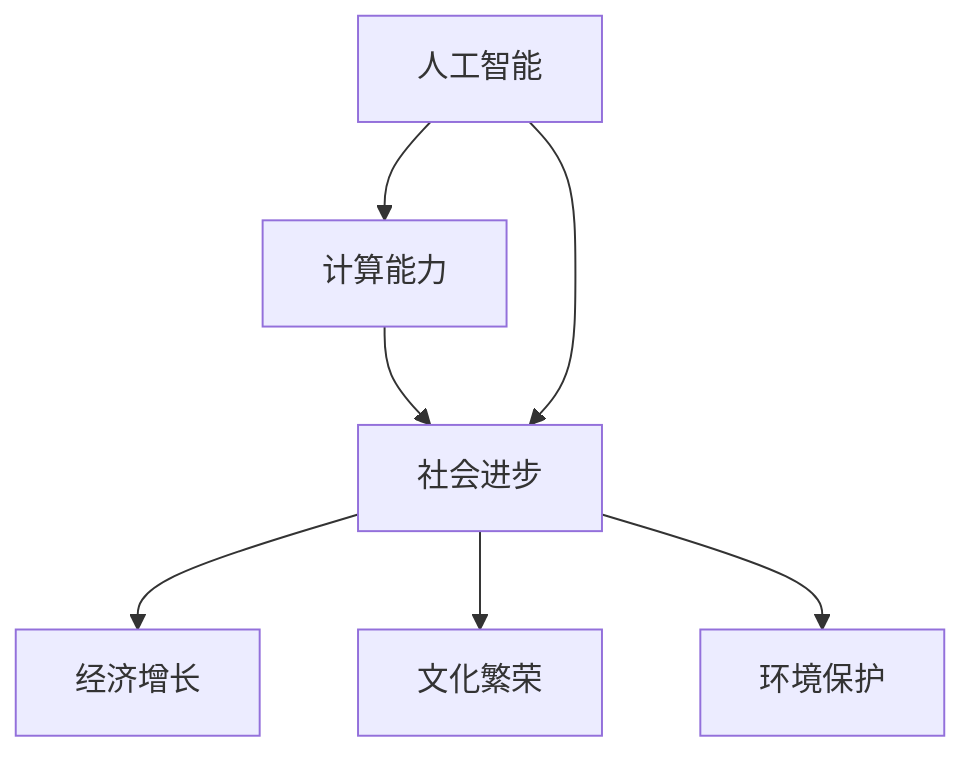

                 

# 推动社会进步的动力：人类计算的积极影响

> 关键词：人工智能, 计算机科学, 社会进步, 计算能力, 计算驱动的经济, 创新驱动的变革

## 1. 背景介绍

在21世纪，计算机科技的迅猛发展已成为推动全球社会进步的重要力量。从工业自动化到互联网普及，从电子商务到云计算，计算机计算能力在各个领域都发挥了不可替代的作用。作为计算机科学的核心，人工智能(AI)技术的崛起，进一步深化了这一趋势，不仅改变了人们的生活和工作方式，更推动了经济的飞速增长，为社会的全面进步提供了前所未有的动力。

### 1.1 问题的由来

现代科技的蓬勃发展，尤其是在人工智能领域的突飞猛进，对社会的影响日益深远。但随着技术的不断进步，也引发了一系列新的挑战和问题。如何确保人工智能技术的良性发展，最大化其对社会的积极影响，成为当下科技界、政策制定者和公众共同关注的重要议题。

### 1.2 问题核心关键点

本文旨在探讨人工智能技术如何通过计算能力推动社会进步，同时指出在发展过程中需面对的挑战和应采取的策略。核心问题包括：

1. **计算能力与社会进步的关联**：计算能力如何影响经济增长、产业创新和社会福祉？
2. **计算驱动的经济模式**：如何在保持经济效益的同时，确保技术的公平性和可及性？
3. **AI技术的社会影响**：如何最大化AI技术的积极影响，同时减少其潜在的负面影响？
4. **可持续发展的计算策略**：如何制定计算策略，促进社会和环境的可持续发展？

本文将围绕这些核心问题，深入分析计算能力如何推动社会进步，并探讨当前面临的挑战和未来发展方向。

## 2. 核心概念与联系

### 2.1 核心概念概述

计算能力，尤其是人工智能的计算能力，已经深度渗透到社会的各个方面，成为推动社会进步的重要力量。其核心概念包括：

- **人工智能(AI)**：以机器学习、深度学习等为代表的算法，通过模拟人类的认知和思维过程，实现自动化决策和自主学习。
- **计算能力**：计算机处理数据和执行计算任务的能力，包括处理速度、内存大小和能耗等。
- **社会进步**：涵盖经济增长、文化繁荣、环境保护等多方面的综合进步，旨在提升人民生活质量和社会福祉。

这些概念之间的关系可以通过以下Mermaid流程图来展示：



这个流程图展示了人工智能通过计算能力推动社会进步的路径，并展示了计算能力与社会进步之间的多重影响关系。

## 3. 核心算法原理 & 具体操作步骤
### 3.1 算法原理概述

人工智能驱动的社会进步，主要基于计算能力的提升和应用。其核心算法原理包括：

1. **算法训练**：通过大量的数据和计算资源，训练出高精度的AI模型，实现对复杂问题的自动处理。
2. **模型应用**：将训练好的AI模型应用于各种实际场景，提升生产效率、优化资源配置，推动经济和社会发展。
3. **持续优化**：通过不断的迭代和优化，提升AI模型的性能和效果，适应不断变化的社会需求。

### 3.2 算法步骤详解

基于人工智能的计算能力驱动社会进步，主要涉及以下几个关键步骤：

**Step 1: 数据收集与处理**

- 收集相关领域的数据，包括历史数据、实时数据和预测数据等。
- 对数据进行清洗、预处理和标注，确保数据的质量和一致性。
- 使用数据增强技术，如数据扩增、迁移学习等，提升数据的多样性和代表性。

**Step 2: 算法模型训练**

- 选择合适的算法模型，如深度神经网络、强化学习等。
- 在强大的计算平台上，使用GPU、TPU等设备进行模型训练。
- 通过交叉验证和超参数调优，确保模型的高效性和泛化能力。

**Step 3: 模型应用与优化**

- 将训练好的模型部署到实际应用场景中，如自动驾驶、智能客服、金融风控等。
- 通过持续监控和反馈机制，收集模型运行数据，优化模型性能。
- 使用在线学习技术，模型可以不断吸收新数据，提升模型的适应性和长期效果。

**Step 4: 评估与调整**

- 对模型在实际应用中的效果进行评估，包括精度、召回率、F1值等指标。
- 根据评估结果，调整模型参数和应用策略，不断提升模型的效果。
- 对模型进行必要的迭代更新，确保其适应不断变化的社会需求。

### 3.3 算法优缺点

人工智能计算能力在推动社会进步方面具有显著优势：

- **高效性**：通过自动化和优化算法，大幅提升数据处理和任务执行的效率。
- **灵活性**：能够适应复杂多变的社会需求，灵活调整模型策略和应用场景。
- **创新性**：推动技术创新和产业升级，带来新的经济增长点和就业机会。

但同时，也存在一些局限和挑战：

- **数据依赖性**：依赖高质量的数据，数据偏差可能导致模型结果的偏差。
- **资源消耗大**：模型训练和应用需要大量的计算资源，能耗和成本较高。
- **可解释性差**：部分模型黑盒特性较强，难以解释其决策过程和逻辑。
- **伦理和安全性问题**：模型可能学习到有害信息，存在伦理和安全性风险。

### 3.4 算法应用领域

人工智能计算能力已经在众多领域展现出广泛的应用前景，具体包括：

- **工业自动化**：提升生产效率和质量，降低成本和能耗。
- **医疗健康**：辅助诊断、个性化治疗、药物研发等。
- **金融科技**：风险控制、智能投顾、客户服务等。
- **智慧城市**：交通管理、公共安全、环境监测等。
- **教育科技**：个性化学习、智能评估、虚拟课堂等。

## 4. 数学模型和公式 & 详细讲解 & 举例说明
### 4.1 数学模型构建

以深度神经网络为例，其核心数学模型如下：

设输入为 $x$，输出为 $y$，网络参数为 $\theta$，激活函数为 $f$，则前向传播过程可表示为：

$$
y = f(\theta^T x)
$$

其中，$\theta$ 为权重矩阵，$x$ 为输入向量。

### 4.2 公式推导过程

深度神经网络的核心公式包括损失函数和梯度下降优化算法：

1. **损失函数**：通常使用交叉熵损失函数，表示为：

$$
\mathcal{L} = -\frac{1}{N} \sum_{i=1}^N \log p(y_i | x_i)
$$

其中，$N$ 为样本数量，$p(y_i | x_i)$ 为模型对样本 $x_i$ 的预测概率分布。

2. **梯度下降优化**：通过反向传播算法计算梯度，更新模型参数 $\theta$，公式为：

$$
\theta \leftarrow \theta - \eta \nabla_{\theta}\mathcal{L}
$$

其中，$\eta$ 为学习率，$\nabla_{\theta}\mathcal{L}$ 为损失函数对参数 $\theta$ 的梯度。

### 4.3 案例分析与讲解

以图像识别为例，使用卷积神经网络进行模型训练和应用。具体步骤如下：

1. **数据准备**：收集大量标注图像数据，将图像归一化处理，生成训练集和验证集。
2. **模型搭建**：搭建卷积神经网络模型，包括卷积层、池化层、全连接层等。
3. **模型训练**：在GPU上使用SGD优化算法，训练模型，调整超参数。
4. **模型评估**：在验证集上评估模型性能，调整模型参数。
5. **模型应用**：将训练好的模型部署到实际应用场景中，进行图像识别任务。

## 5. 项目实践：代码实例和详细解释说明
### 5.1 开发环境搭建

要实现深度神经网络的训练和应用，需搭建以下开发环境：

1. **Python环境**：安装Anaconda或Miniconda，创建虚拟环境。
2. **深度学习框架**：安装TensorFlow、PyTorch等深度学习框架。
3. **数据处理库**：安装Pandas、NumPy等数据处理库。
4. **可视化工具**：安装TensorBoard等可视化工具。

### 5.2 源代码详细实现

以下是一个简单的图像识别项目示例，使用TensorFlow进行模型训练和应用。

**Step 1: 数据准备**

```python
import tensorflow as tf
import numpy as np
import os

# 加载图像数据
train_dir = 'train/'
test_dir = 'test/'

# 数据预处理
def preprocess_image(image_path):
    image = tf.io.read_file(image_path)
    image = tf.image.decode_jpeg(image, channels=3)
    image = tf.image.resize(image, [224, 224])
    image = tf.image.per_image_standardization(image)
    return image

train_images = []
train_labels = []

for filename in os.listdir(train_dir):
    path = os.path.join(train_dir, filename)
    label = int(filename.split('.')[0])
    train_images.append(preprocess_image(path))
    train_labels.append(label)
    
test_images = []
test_labels = []

for filename in os.listdir(test_dir):
    path = os.path.join(test_dir, filename)
    label = int(filename.split('.')[0])
    test_images.append(preprocess_image(path))
    test_labels.append(label)
```

**Step 2: 模型搭建**

```python
model = tf.keras.Sequential([
    tf.keras.layers.Conv2D(32, (3,3), activation='relu', input_shape=(224, 224, 3)),
    tf.keras.layers.MaxPooling2D((2,2)),
    tf.keras.layers.Conv2D(64, (3,3), activation='relu'),
    tf.keras.layers.MaxPooling2D((2,2)),
    tf.keras.layers.Flatten(),
    tf.keras.layers.Dense(128, activation='relu'),
    tf.keras.layers.Dense(10, activation='softmax')
])
```

**Step 3: 模型训练**

```python
# 配置模型训练
model.compile(optimizer=tf.keras.optimizers.Adam(learning_rate=0.001),
              loss=tf.keras.losses.SparseCategoricalCrossentropy(from_logits=True),
              metrics=['accuracy'])

# 训练模型
history = model.fit(train_images, train_labels, epochs=10, validation_data=(test_images, test_labels))
```

**Step 4: 模型评估**

```python
test_loss, test_acc = model.evaluate(test_images, test_labels)
print('Test accuracy:', test_acc)
```

**Step 5: 模型应用**

```python
def predict_image(image):
    image = preprocess_image(image)
    predictions = model.predict(image)
    return np.argmax(predictions)

# 对测试集图像进行预测
for i in range(len(test_images)):
    prediction = predict_image(test_images[i])
    print('Predicted label:', prediction, 'Actual label:', test_labels[i])
```

### 5.3 代码解读与分析

**数据预处理**：使用TensorFlow对图像进行加载、解码、标准化等预处理，确保数据一致性。

**模型搭建**：使用TensorFlow的Sequential模型搭建卷积神经网络，包括卷积层、池化层、全连接层等。

**模型训练**：配置优化器、损失函数和评估指标，使用Adam优化器进行模型训练，调整超参数。

**模型评估**：在测试集上评估模型性能，输出测试准确率。

**模型应用**：对测试集图像进行预测，输出预测结果。

## 6. 实际应用场景

人工智能计算能力在众多领域展现出广泛的应用前景，具体包括：

### 6.1 医疗健康

在医疗健康领域，人工智能技术被广泛应用于疾病诊断、治疗方案优化、药物研发等。例如，使用深度学习模型对医学影像进行自动分析和诊断，大幅提升诊断准确率和效率，减轻医生的工作负担。

**实际案例**：IBM Watson Health 使用深度学习模型分析医学影像，辅助医生诊断乳腺癌，显著提升了诊断准确率。

### 6.2 金融科技

在金融科技领域，人工智能技术被广泛应用于风险控制、智能投顾、客户服务等。例如，使用深度学习模型分析客户行为和信用记录，进行风险评估和信用评分，提升金融机构的运营效率。

**实际案例**：Ant Financial 使用深度学习模型分析客户行为数据，提供个性化金融产品推荐，提升客户满意度和业务增长。

### 6.3 智慧城市

在智慧城市领域，人工智能技术被广泛应用于交通管理、公共安全、环境监测等。例如，使用深度学习模型分析城市交通数据，优化交通流量和路线，提升城市交通效率和安全性。

**实际案例**：深圳政府使用深度学习模型分析城市交通数据，优化交通信号灯控制，减少交通拥堵和事故率。

### 6.4 教育科技

在教育科技领域，人工智能技术被广泛应用于个性化学习、智能评估、虚拟课堂等。例如，使用深度学习模型分析学生的学习行为和成绩，提供个性化的学习推荐和评估，提升教育效果。

**实际案例**：Coursera 使用深度学习模型分析学生行为数据，提供个性化学习推荐，提升学习效果和课程完成率。

## 7. 工具和资源推荐

### 7.1 学习资源推荐

为了帮助开发者系统掌握人工智能技术，以下是一些优质的学习资源：

1. **《深度学习》书籍**：Ian Goodfellow等著作，全面介绍了深度学习的基本原理和应用。
2. **Coursera《深度学习专项课程》**：由斯坦福大学Andrew Ng教授主讲，涵盖深度学习的理论和实践。
3. **Google AI Hub**：提供大量深度学习模型和教程，助力开发者快速上手。
4. **Kaggle**：数据科学竞赛平台，提供丰富的数据集和竞赛机会，提升实战能力。
5. **Towards Data Science博客**：由Google、Facebook等公司专家撰写，涵盖最新的深度学习研究和应用。

### 7.2 开发工具推荐

以下是几款常用的深度学习开发工具：

1. **TensorFlow**：由Google开发的深度学习框架，支持分布式计算和高效的GPU加速。
2. **PyTorch**：由Facebook开发的深度学习框架，具有易用性和灵活性，支持动态图和静态图。
3. **MXNet**：由Apache开发的深度学习框架，支持多种编程语言和平台。
4. **JAX**：由Google开发的基于Python的深度学习库，支持自动微分和高效的GPU加速。
5. **ONNX**：开放神经网络交换格式，支持多种深度学习框架之间的模型转换和部署。

### 7.3 相关论文推荐

以下是几篇重要的相关论文，推荐阅读：

1. **《ImageNet Classification with Deep Convolutional Neural Networks》**：AlexNet模型，开启了深度学习在图像识别领域的应用。
2. **《Deep Learning》**：Ian Goodfellow等著作，全面介绍了深度学习的基本原理和应用。
3. **《AlphaGo Zero》**：DeepMind开发的围棋AI，展示了深度学习在博弈论中的应用。
4. **《Adversarial Examples in Deep Learning》**：NIPS 2015论文，探讨了深度学习中的对抗样本问题。
5. **《Bridging the Gap Between Symbolic and Neural Computation》**：Ian Goodfellow等论文，探讨了符号计算和神经计算的结合。

## 8. 总结：未来发展趋势与挑战

### 8.1 总结

本文对人工智能技术如何通过计算能力推动社会进步进行了全面系统的探讨。通过算法原理、具体操作步骤和实际应用场景的分析，展示了计算能力在推动社会进步中的核心作用。

### 8.2 未来发展趋势

展望未来，人工智能计算能力将继续深刻影响社会的各个方面，呈现以下几个发展趋势：

1. **计算能力不断提升**：随着硬件技术的发展，计算能力将不断提升，带来更高效的模型训练和应用。
2. **跨领域应用广泛**：人工智能技术将更广泛地应用于医疗、金融、教育等多个领域，推动各行业的数字化转型。
3. **智能化水平提升**：深度学习等技术将进一步提升模型的智能化水平，带来更多的应用场景和商业价值。
4. **伦理和社会问题凸显**：随着技术的普及，伦理和社会问题将更加突出，需重视数据隐私、模型透明性和公平性。

### 8.3 面临的挑战

尽管人工智能计算能力在推动社会进步方面展现出巨大的潜力，但也面临诸多挑战：

1. **数据隐私和安全**：大量数据的使用和存储，可能带来数据隐私和安全的风险。
2. **算法透明性和可解释性**：部分人工智能模型具有黑盒特性，难以解释其决策过程。
3. **伦理和社会问题**：人工智能技术的广泛应用可能带来伦理和社会问题，如就业替代、偏见歧视等。
4. **计算资源消耗**：大规模深度学习模型的训练和应用需要大量计算资源，成本较高。

### 8.4 研究展望

面对人工智能计算能力在推动社会进步中面临的挑战，未来的研究需要在以下几个方面寻求新的突破：

1. **数据隐私保护**：开发更高效的数据隐私保护技术，确保数据的安全和隐私。
2. **模型透明性和可解释性**：研究更透明和可解释的模型，提升模型的可信度和可接受性。
3. **伦理和社会责任**：重视人工智能技术的伦理和社会责任，确保技术的公平性和可及性。
4. **计算效率提升**：优化计算模型和算法，降低计算资源消耗，提升计算效率和性能。

这些研究方向的探索，必将引领人工智能计算能力在推动社会进步中的进一步发展，为构建更加公平、可持续、智能化的社会贡献力量。

## 9. 附录：常见问题与解答

**Q1: 如何确保人工智能技术的公平性和可及性？**

A: 确保人工智能技术的公平性和可及性，需要从多个方面入手：

1. **数据公平性**：收集多样化的数据，避免数据偏见，确保模型训练数据的代表性。
2. **算法透明性**：研究透明和可解释的算法，确保模型的决策过程可解释和可理解。
3. **伦理约束**：在模型训练和应用中，重视伦理和社会责任，确保技术的应用符合公众利益和价值观。
4. **政策法规**：制定相关政策法规，规范人工智能技术的开发和应用，确保其公平性和可及性。

**Q2: 人工智能技术的伦理问题如何解决？**

A: 人工智能技术的伦理问题主要涉及以下几个方面：

1. **数据隐私保护**：确保数据的使用和存储符合隐私保护要求，防止数据泄露和滥用。
2. **模型偏见和歧视**：通过数据处理和算法优化，减少模型的偏见和歧视，确保模型的公平性。
3. **伦理和社会责任**：在模型训练和应用中，重视伦理和社会责任，确保技术的应用符合公众利益和价值观。
4. **政策法规**：制定相关政策法规，规范人工智能技术的开发和应用，确保其符合伦理和法律要求。

通过多方努力，可以有效应对人工智能技术的伦理问题，确保其公平、透明和可及。

**Q3: 如何提升人工智能模型的智能化水平？**

A: 提升人工智能模型的智能化水平，可以从以下几个方面入手：

1. **数据质量**：收集高质量的数据，确保数据的多样性和代表性，提升模型的泛化能力。
2. **算法优化**：研究高效的算法和模型结构，提升模型的效率和效果。
3. **跨领域融合**：将符号计算、知识图谱等技术与深度学习结合，提升模型的智能化水平。
4. **计算资源**：利用高性能计算资源，提升模型的训练效率和效果。

通过这些措施，可以有效提升人工智能模型的智能化水平，推动其进一步应用和发展。

---

作者：禅与计算机程序设计艺术 / Zen and the Art of Computer Programming

