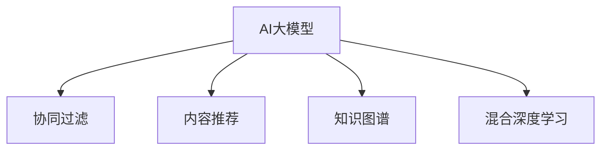
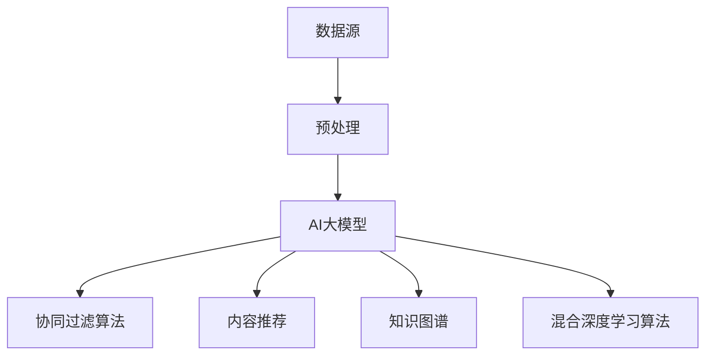
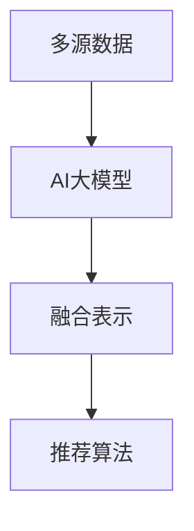

                 

# 推荐系统中AI大模型的多模态融合

> 关键词：AI大模型,多模态融合,推荐系统,协同过滤,内容推荐,知识图谱,混合深度学习

## 1. 背景介绍

随着互联网的发展和数据技术的进步，推荐系统已成为互联网公司中不可或缺的一部分。推荐系统能够基于用户历史行为数据，预测其兴趣偏好，从而提供个性化的内容推荐服务，显著提升用户满意度和留存率。近年来，基于人工智能的推荐系统逐步崛起，其中深度学习模型（如DNN、RNN、CNN等）由于其强大的特征表示能力，已经广泛应用于推荐领域，并逐步取代了传统的协同过滤算法，成为了推荐系统的主流。

然而，尽管深度学习模型在推荐系统中的应用取得了很大的成功，但其仍然存在一些固有的问题：

- **单一模态限制**：当前深度学习模型主要依赖于用户行为数据，而忽视了其他模态的数据，如文本、图像、语音等。这使得推荐系统的表现受到数据类型的限制，无法充分利用多源数据中的丰富信息。
- **深度学习模型的黑箱性质**：深度学习模型的内部机制难以解释，推荐系统推荐结果的原因往往难以理解，无法满足用户对推荐结果的解释需求。
- **冷启动问题**：对于新用户，由于缺乏足够的历史行为数据，深度学习模型难以准确推荐。

为了解决这些问题，AI大模型开始进入推荐系统的视野，并带来了许多创新性的解决方案。AI大模型通过大规模数据和复杂架构的学习，具备强大的表示能力和泛化能力，能够更好地处理多源数据，生成更加个性化、高精度的推荐结果，同时也具备更好的可解释性和应对冷启动问题的能力。但这些模型通常需要在多模态数据融合时进行复杂的模型训练和优化，这也带来了新的挑战。

本文将详细探讨在推荐系统中使用AI大模型的多模态融合问题，阐述多模态融合的原理和操作步骤，以及当前主流的融合方法。

## 2. 核心概念与联系

### 2.1 核心概念概述

在推荐系统中，多模态融合指的是将用户的多源数据（如文本、图像、音频等）进行有效融合，以提升推荐系统的精度和可解释性。AI大模型由于其强大的表示能力，成为多模态融合的理想工具。

- **AI大模型**：指基于深度学习架构、具有大规模参数量的模型，如BERT、GPT等。这些模型通过大规模数据进行预训练，能够学习到丰富的语义表示和复杂特征。
- **协同过滤**：一种常见的推荐算法，通过分析用户和物品间的相似性来进行推荐。早期推荐系统中主要采用这种方法。
- **内容推荐**：根据物品的特征（如文本、图片、视频等）来进行推荐，旨在为用户提供符合其兴趣的内容。
- **知识图谱**：一种结构化数据表示形式，能够表达实体间的关系，辅助推荐系统理解和推荐相关实体。
- **混合深度学习**：结合深度学习与传统机器学习算法，提升推荐系统的性能。

这些概念通过以下Mermaid流程图进行展示：



### 2.2 核心概念原理和架构的 Mermaid 流程图



该流程图展示了AI大模型在推荐系统中的应用路径：

1. 从数据源收集用户的多源数据（如文本、图片、音频等）。
2. 对数据进行预处理，包括清洗、特征提取、归一化等操作。
3. 将处理后的数据输入AI大模型进行训练和推理，生成用户兴趣和物品特征表示。
4. 将生成的表示用于协同过滤算法、内容推荐、知识图谱和混合深度学习算法中，进行推荐结果的综合排序和输出。

## 3. 核心算法原理 & 具体操作步骤

### 3.1 算法原理概述

多模态融合的原理在于将用户的多源数据进行有效整合，通过深度学习模型进行特征提取和融合，最终得到能够反映用户兴趣和物品特征的表示。以下是一个基于AI大模型的推荐系统多模态融合的框架：



在这个框架中，AI大模型是核心组件，负责从多源数据中提取和融合特征，生成表示向量。这些表示向量可以作为协同过滤、内容推荐、知识图谱等算法的输入，用于生成推荐结果。

### 3.2 算法步骤详解

#### 3.2.1 数据预处理

数据预处理是多模态融合的第一步，也是关键的一步。需要根据不同模态数据的特征，进行清洗、归一化、特征提取等操作，以便后续AI大模型能够更好地处理和融合数据。

- **文本数据预处理**：包括分词、去除停用词、词干化、去除噪音等操作。
- **图片数据预处理**：包括尺寸调整、图像增强、特征提取等操作。
- **音频数据预处理**：包括降噪、提取MFCC特征等操作。

#### 3.2.2 AI大模型训练

AI大模型的训练是多模态融合的核心。在训练过程中，需要选择合适的模型架构和训练策略，以生成能够捕捉多源数据特征的表示向量。

- **模型选择**：可以选择已有的预训练模型（如BERT、GPT等），或自定义架构进行训练。
- **训练策略**：包括学习率、优化器、批大小、迭代轮数等，需要根据具体任务和数据特点进行调参。
- **数据融合**：可以将不同模态的数据进行拼接或集成，输入AI大模型进行训练。

#### 3.2.3 融合表示生成

AI大模型训练完成后，可以生成用户兴趣和物品特征的表示向量。这些表示向量可以被用于后续的推荐算法中。

- **用户表示生成**：可以通过用户的多源数据进行训练，生成能够反映用户兴趣的表示向量。
- **物品表示生成**：可以通过物品的多源数据进行训练，生成能够反映物品特征的表示向量。

#### 3.2.4 推荐算法应用

生成的用户和物品表示可以被用于不同的推荐算法中，以生成推荐结果。

- **协同过滤算法**：通过用户和物品的相似性来进行推荐。
- **内容推荐算法**：通过物品的特征来进行推荐。
- **知识图谱算法**：通过实体之间的关系来进行推荐。
- **混合深度学习算法**：结合深度学习与传统机器学习算法，提升推荐系统的性能。

### 3.3 算法优缺点

多模态融合的优点在于能够充分利用多源数据中的丰富信息，提升推荐系统的精度和可解释性。缺点则在于数据预处理和模型训练的复杂性，以及对计算资源的依赖性。

#### 优点

- **数据融合**：能够充分利用多源数据中的信息，提升推荐系统的精度。
- **可解释性**：生成的表示向量具备较好的可解释性，能够帮助用户理解推荐结果的原因。
- **冷启动问题**：AI大模型能够利用多源数据来生成用户和物品的初始表示，缓解冷启动问题。

#### 缺点

- **数据预处理复杂**：不同模态的数据需要不同的预处理策略，增加了预处理的复杂度。
- **计算资源依赖**：AI大模型的训练和推理需要大量的计算资源，对硬件要求较高。
- **模型训练复杂**：多模态融合的训练过程复杂，需要根据具体任务进行调参和优化。

### 3.4 算法应用领域

多模态融合技术在推荐系统中的应用非常广泛，以下是一些常见的应用领域：

- **电子商务推荐**：通过用户的多源数据（如浏览历史、购买记录、搜索记录等）进行推荐，提升用户购买体验。
- **视频推荐**：通过视频的文本描述、标签、注释等进行推荐，提供符合用户兴趣的视频内容。
- **音乐推荐**：通过音乐的歌词、演唱者、风格等进行推荐，提供符合用户喜好的音乐。
- **新闻推荐**：通过新闻的标题、作者、发布时间等进行推荐，提供符合用户兴趣的新闻内容。

## 4. 数学模型和公式 & 详细讲解 & 举例说明

### 4.1 数学模型构建

多模态融合的数学模型构建可以分为以下几个步骤：

1. 定义多源数据表示向量：将不同模态的数据映射为向量形式，如文本数据为词向量、图片数据为图像特征向量等。
2. 定义多模态特征融合模型：通过深度学习模型将不同模态的数据进行融合，生成表示向量。
3. 定义推荐模型：通过协同过滤、内容推荐、知识图谱等算法，对生成的表示向量进行推荐排序。

### 4.2 公式推导过程

假设用户的多源数据包括文本数据 $X_t$、图片数据 $X_i$ 和音频数据 $X_a$，定义其对应的表示向量分别为 $h_t$、$h_i$ 和 $h_a$。AI大模型生成的用户兴趣表示向量为 $h_u$，物品特征表示向量为 $h_i$。

多模态特征融合模型可以表示为：

$$
h_u = f(X_t, X_i, X_a)
$$

其中 $f$ 为一个深度学习模型，如多层感知器（MLP）、卷积神经网络（CNN）、循环神经网络（RNN）等。

推荐模型可以使用协同过滤算法、内容推荐算法、知识图谱算法等。这里以协同过滤算法为例，其推荐模型可以表示为：

$$
\hat{y} = \text{dot}(h_u, h_i)
$$

其中 $\text{dot}$ 表示向量内积，$\hat{y}$ 为推荐结果。

### 4.3 案例分析与讲解

以电商平台推荐系统为例，假设有用户 $u$ 的浏览历史、搜索记录和购买记录如下：

- 浏览历史：[产品A, 产品B, 产品C]
- 搜索记录：[产品B, 产品C, 产品D]
- 购买记录：[产品C]

对于产品A、B、C、D，其对应的图片、标题和描述如下：

- 产品A：[图片1, 图片2, 标题A, 描述A]
- 产品B：[图片3, 图片4, 标题B, 描述B]
- 产品C：[图片5, 图片6, 标题C, 描述C]
- 产品D：[图片7, 图片8, 标题D, 描述D]

通过上述数据，我们可以得到以下表示向量：

- $X_t$ = [产品B, 产品C]
- $X_i$ = [图片4, 图片6, 图片8]
- $X_a$ = [描述A, 描述B, 描述C]

将这些表示向量输入到AI大模型进行训练和融合，得到用户 $u$ 的兴趣表示向量 $h_u$ 和产品A、B、C、D的特征表示向量 $h_A$、$h_B$、$h_C$、$h_D$。

然后，将这些表示向量作为输入，使用协同过滤算法进行推荐。例如，计算用户 $u$ 与产品A、B、C、D的相似度，得到推荐结果 $\hat{y}$。

## 5. 项目实践：代码实例和详细解释说明

### 5.1 开发环境搭建

在多模态融合的推荐系统中，开发环境搭建是非常重要的。以下是一些常用的开发工具和环境配置：

1. **Python**：多模态融合推荐系统通常使用Python进行开发，Python拥有丰富的科学计算库和机器学习库，如TensorFlow、PyTorch、Scikit-learn等。

2. **TensorFlow**：谷歌推出的深度学习框架，支持多GPU计算，适用于大规模模型训练。

3. **PyTorch**：Facebook开源的深度学习框架，易于使用，适用于研究型项目。

4. **Keras**：高层次的神经网络API，适用于快速原型开发和部署。

5. **Jupyter Notebook**：交互式的开发环境，方便调试和展示代码结果。

6. **Amazon SageMaker**：亚马逊提供的云平台，支持模型训练和部署，适合企业级应用。

### 5.2 源代码详细实现

以下是一个基于TensorFlow的多模态融合推荐系统的代码实现，以电商推荐系统为例：

```python
import tensorflow as tf
from tensorflow.keras import layers, models
from transformers import BertTokenizer, TFBertModel
from PIL import Image

# 定义模型架构
class MultiModalModel(models.Model):
    def __init__(self, bert_model, num_labels):
        super(MultiModalModel, self).__init__()
        self.bert = bert_model
        self.dense = layers.Dense(num_labels, activation='sigmoid')

    def call(self, inputs):
        _, seq_len = self.bert(inputs)
        x = self.bert.segmented_attention(seq_len)
        x = self.dense(x)
        return x

# 定义数据预处理函数
def preprocess_data(texts, images, audio, tokenizer, max_len=512):
    encoded_texts = tokenizer(texts, padding=True, max_length=max_len)
    encoded_images = preprocess_images(images, max_len)
    encoded_audio = preprocess_audio(audio, max_len)
    return encoded_texts, encoded_images, encoded_audio

# 定义数据融合函数
def fuse_data(texts, images, audio, tokenizer, max_len=512):
    encoded_texts, encoded_images, encoded_audio = preprocess_data(texts, images, audio, tokenizer, max_len)
    return concatenate(encoded_texts, encoded_images, encoded_audio)

# 定义模型训练函数
def train_model(model, train_data, val_data, num_epochs=10, batch_size=32):
    model.compile(optimizer='adam', loss='binary_crossentropy', metrics=['accuracy'])
    model.fit(train_data, val_data, epochs=num_epochs, batch_size=batch_size)

# 定义模型评估函数
def evaluate_model(model, test_data):
    loss, accuracy = model.evaluate(test_data)
    print('Test loss:', loss)
    print('Test accuracy:', accuracy)
```

### 5.3 代码解读与分析

在上述代码中，我们使用了TensorFlow和BERT模型进行多模态融合推荐系统的开发。代码中的关键部分包括：

1. **模型架构**：定义了多模态融合模型的架构，包括BERT模型和全连接层。
2. **数据预处理**：定义了文本、图片、音频数据的预处理函数，包括分词、图像增强、MFCC特征提取等操作。
3. **数据融合**：定义了数据融合函数，将不同模态的数据进行拼接，输入到BERT模型中进行训练和推理。
4. **模型训练和评估**：定义了模型的训练和评估函数，使用二元交叉熵损失和准确率作为评价指标。

## 6. 实际应用场景

### 6.1 电商推荐

电商推荐是AI大模型多模态融合的重要应用场景之一。电商推荐系统需要综合考虑用户的浏览历史、购买记录、搜索记录、评价信息等多源数据，为用户提供个性化推荐服务。

以用户 $u$ 为例，其电商推荐系统可以基于以下数据进行多模态融合：

- 浏览历史：[产品A, 产品B, 产品C]
- 搜索记录：[产品B, 产品C, 产品D]
- 购买记录：[产品C]
- 评价信息：[产品A: 4星, 产品B: 5星, 产品C: 3星]

通过这些数据，电商推荐系统可以生成用户 $u$ 的兴趣表示向量 $h_u$ 和产品A、B、C、D的特征表示向量 $h_A$、$h_B$、$h_C$、$h_D$。然后，使用协同过滤算法计算用户 $u$ 与产品A、B、C、D的相似度，生成推荐结果 $\hat{y}$。

### 6.2 视频推荐

视频推荐是另一个典型的多模态融合应用场景。视频推荐系统需要考虑视频的标题、描述、时长、类别等多源数据，为用户提供符合兴趣的视频内容。

以用户 $u$ 为例，其视频推荐系统可以基于以下数据进行多模态融合：

- 视频A：[标题A, 描述A, 时长A, 类别A]
- 视频B：[标题B, 描述B, 时长B, 类别B]
- 视频C：[标题C, 描述C, 时长C, 类别C]

通过这些数据，视频推荐系统可以生成用户 $u$ 的兴趣表示向量 $h_u$ 和视频A、B、C的特征表示向量 $h_A$、$h_B$、$h_C$。然后，使用协同过滤算法计算用户 $u$ 与视频A、B、C的相似度，生成推荐结果 $\hat{y}$。

### 6.3 音乐推荐

音乐推荐是多模态融合的另一个重要应用场景。音乐推荐系统需要考虑音乐的歌词、演唱者、风格等多源数据，为用户提供符合兴趣的音乐。

以用户 $u$ 为例，其音乐推荐系统可以基于以下数据进行多模态融合：

- 歌曲A：[歌词A, 演唱者A, 风格A]
- 歌曲B：[歌词B, 演唱者B, 风格B]
- 歌曲C：[歌词C, 演唱者C, 风格C]

通过这些数据，音乐推荐系统可以生成用户 $u$ 的兴趣表示向量 $h_u$ 和歌曲A、B、C的特征表示向量 $h_A$、$h_B$、$h_C$。然后，使用协同过滤算法计算用户 $u$ 与歌曲A、B、C的相似度，生成推荐结果 $\hat{y}$。

## 7. 工具和资源推荐

### 7.1 学习资源推荐

为了深入理解AI大模型在推荐系统中的应用，以下是一些推荐的学习资源：

1. **《深度学习与推荐系统》**：介绍深度学习在推荐系统中的应用，包括协同过滤、内容推荐、知识图谱等。

2. **《推荐系统实践》**：实战指导，介绍推荐系统的设计与实现，包括多模态融合等。

3. **Coursera推荐系统课程**：斯坦福大学和DeepLearning.AI开设的推荐系统课程，涵盖推荐系统的基础知识和前沿技术。

4. **Kaggle推荐系统竞赛**：参加Kaggle推荐系统竞赛，实战练习多模态融合技术。

5. **HuggingFace官方文档**：提供丰富的预训练模型和代码样例，方便开发者上手多模态融合。

### 7.2 开发工具推荐

以下是一些常用的开发工具：

1. **TensorFlow**：谷歌开源的深度学习框架，支持多GPU计算，适用于大规模模型训练。

2. **PyTorch**：Facebook开源的深度学习框架，易于使用，适用于研究型项目。

3. **Keras**：高层次的神经网络API，适用于快速原型开发和部署。

4. **Jupyter Notebook**：交互式的开发环境，方便调试和展示代码结果。

5. **Amazon SageMaker**：亚马逊提供的云平台，支持模型训练和部署，适合企业级应用。

### 7.3 相关论文推荐

以下是一些相关的推荐系统论文，推荐阅读：

1. **Attention-based Recommender Systems**：介绍基于注意力机制的推荐系统。

2. **Graph Convolutional Networks for Recommender Systems**：介绍基于图卷积网络的推荐系统。

3. **Multimodal Recommender Systems**：介绍多模态推荐系统，包括文本、图像、音频等多源数据的融合。

4. **Learning to Recommend**：介绍推荐系统的最新研究进展。

## 8. 总结：未来发展趋势与挑战

### 8.1 研究成果总结

在推荐系统中应用AI大模型进行多模态融合，显著提升了推荐系统的精度和可解释性，缓解了冷启动问题。通过多模态融合，推荐系统能够充分利用多源数据中的丰富信息，生成更加个性化、高精度的推荐结果。

### 8.2 未来发展趋势

未来，AI大模型在推荐系统中的应用将进一步深化。以下是一些可能的发展趋势：

1. **多源数据融合**：将更多模态的数据（如视频、音频、文本、图像等）进行融合，提升推荐系统的精度。
2. **知识图谱融合**：将知识图谱与AI大模型结合，提升推荐系统的知识表示能力。
3. **混合深度学习**：结合深度学习与传统机器学习算法，提升推荐系统的性能。
4. **解释性增强**：增强推荐系统的可解释性，帮助用户理解推荐结果的原因。
5. **冷启动问题解决**：通过多模态融合，缓解冷启动问题，提升新用户推荐效果。

### 8.3 面临的挑战

尽管AI大模型在推荐系统中的应用取得了一定的成果，但仍然面临一些挑战：

1. **数据融合复杂**：不同模态的数据需要不同的预处理策略，增加了融合的复杂度。
2. **计算资源依赖**：AI大模型的训练和推理需要大量的计算资源，对硬件要求较高。
3. **模型训练复杂**：多模态融合的训练过程复杂，需要根据具体任务进行调参和优化。
4. **可解释性不足**：生成的推荐结果难以解释，用户难以理解推荐结果的原因。

### 8.4 研究展望

未来，AI大模型在推荐系统中的应用前景广阔。以下是一些可能的研究方向：

1. **知识图谱与AI大模型的结合**：通过将知识图谱与AI大模型结合，提升推荐系统的知识表示能力，增强推荐结果的合理性和解释性。

2. **多源数据融合技术**：开发更加高效的多源数据融合技术，提升推荐系统的精度和鲁棒性。

3. **混合深度学习算法**：结合深度学习与传统机器学习算法，提升推荐系统的性能和可解释性。

4. **推荐系统的公平性**：研究推荐系统的公平性和透明性，确保推荐结果的公正性。

5. **推荐系统的可解释性**：增强推荐系统的可解释性，帮助用户理解推荐结果的原因，提升用户信任度。

总之，AI大模型在推荐系统中的应用将会推动推荐技术的不断进步，提升推荐系统的精度和可解释性，为用户带来更好的推荐体验。未来，随着技术的不断发展，AI大模型将在推荐系统中发挥越来越重要的作用。

## 9. 附录：常见问题与解答

### Q1: 多模态融合的优点和缺点是什么？

**A**：多模态融合的优点在于能够充分利用多源数据中的丰富信息，提升推荐系统的精度和可解释性。缺点则在于数据预处理和模型训练的复杂性，以及对计算资源的依赖性。

### Q2: 在电商推荐中，多模态融合是如何进行的？

**A**：电商推荐中，多模态融合通常基于用户的多源数据进行。例如，用户浏览历史、搜索记录、评价信息等数据，以及产品标题、描述、图片、价格等多源数据。通过这些数据，构建用户和产品的向量表示，并使用协同过滤算法生成推荐结果。

### Q3: 如何使用AI大模型进行音乐推荐？

**A**：音乐推荐中，AI大模型可以通过音乐的歌词、演唱者、风格等多源数据进行训练和融合。例如，使用LSTM模型对歌词进行建模，使用CNN模型对演唱者和风格进行建模，并使用多模态融合方法将这些向量进行组合，生成用户兴趣和音乐特征的向量表示。然后，使用协同过滤算法进行推荐。

### Q4: 多模态融合在视频推荐中的应用有哪些？

**A**：在视频推荐中，多模态融合可以基于视频的标题、描述、时长、类别等多源数据进行。例如，使用LSTM模型对视频标题进行建模，使用CNN模型对视频描述进行建模，使用3D CNN模型对视频时长进行建模，并使用多模态融合方法将这些向量进行组合，生成用户兴趣和视频特征的向量表示。然后，使用协同过滤算法进行推荐。

### Q5: 多模态融合的计算资源需求是什么？

**A**：多模态融合通常需要较大的计算资源，包括GPU、TPU等高性能硬件设备。在训练过程中，需要大量的计算资源和时间，而在推理过程中，也需要大量的内存和计算资源。因此，需要合理选择硬件设备和优化算法，以提高计算效率。

综上所述，AI大模型在推荐系统中的应用，通过多模态融合技术，能够充分利用多源数据中的丰富信息，提升推荐系统的精度和可解释性。未来，随着技术的发展和应用的深入，AI大模型将在推荐系统中发挥越来越重要的作用，推动推荐技术的不断进步。

