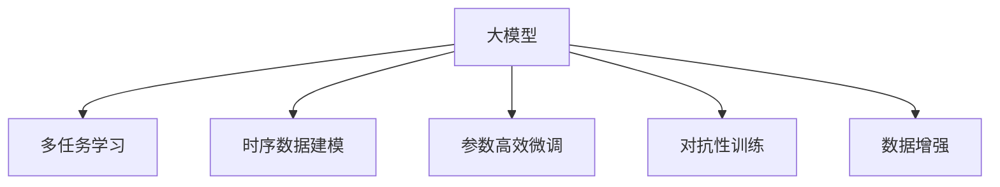

                 

# 推荐系统中AI大模型的季节性趋势适应

## 1. 背景介绍

在推荐系统领域，用户行为具有显著的季节性特征，如电商平台的“双十一”购物节、旅游出行高峰期等。如何利用大模型AI技术，实现推荐内容的动态调整，适应季节性趋势，提升用户满意度和业务收益，是当前研究的热点问题之一。

### 1.1 问题由来

推荐系统经历了从基于内容的过滤、协同过滤到深度学习模型等几个发展阶段。近年来，基于深度学习的大模型AI技术，如大语言模型、深度神经网络等，在推荐系统领域得到了广泛应用。大模型凭借其丰富的知识表示和强大的泛化能力，能够处理更加复杂和多样化的推荐任务，取得了显著的性能提升。

然而，大模型在推荐系统中的应用仍存在一些挑战：

1. **模型参数量大**：大模型通常含有数十亿个参数，模型训练和推理对算力、内存等资源要求较高。
2. **数据稀疏性**：推荐系统数据通常具有较强的稀疏性，大模型的预测能力受限于训练数据的多样性和丰富性。
3. **用户行为的时效性**：用户行为受季节性因素影响较大，如何利用时序数据提升推荐效果，是大模型面临的新问题。

### 1.2 问题核心关键点

解决大模型在推荐系统中的季节性适应问题，关键在于以下几个方面：

1. **多任务学习**：在训练过程中引入多个推荐任务，使大模型能够同时学习不同季节性的用户行为模式。
2. **时序数据建模**：利用时序数据（如点击率、浏览时间、订单时间等），捕捉用户行为的季节性变化规律。
3. **参数高效的微调**：通过参数高效的微调方法，如Adapter、LoRA等，减少微调过程中参数更新量，提高模型部署效率。
4. **对抗性训练**：引入对抗样本，增强模型对季节性变化的鲁棒性。
5. **数据增强**：通过对训练数据进行扩充和增强，丰富模型的泛化能力。

## 2. 核心概念与联系

### 2.1 核心概念概述

为更好地理解基于大模型的季节性趋势适应方法，本节将介绍几个密切相关的核心概念：

- **大模型(Large Model)**：指具有大规模参数、复杂结构的深度学习模型，如Transformer、BERT等。大模型通过大规模预训练和微调，能够提取丰富的语义信息和用户行为特征。
- **推荐系统(Recommendation System)**：通过用户行为数据和模型预测，为用户推荐感兴趣的物品或内容。推荐系统是互联网应用的核心技术之一。
- **多任务学习(Multi-task Learning)**：指在训练过程中，模型同时学习多个相关任务，共享底层特征表示，提升模型的泛化能力和鲁棒性。
- **时序数据建模(Time Series Modeling)**：指利用时间序列数据，捕捉用户行为随时间的变化规律，如季节性趋势、周期性波动等。
- **对抗性训练(Adversarial Training)**：指在训练过程中，引入对抗样本，提高模型对攻击和噪声的鲁棒性。
- **数据增强(Data Augmentation)**：指通过对原始数据进行扩充和变换，增加训练数据的多样性，提升模型的泛化能力。

这些核心概念之间的逻辑关系可以通过以下Mermaid流程图来展示：



这个流程图展示了大模型在推荐系统中的应用逻辑：

1. 大模型通过多任务学习和时序数据建模，捕捉不同季节性的用户行为模式。
2. 利用参数高效微调和对抗性训练，提升模型对季节性变化的适应性。
3. 通过数据增强，丰富训练数据的多样性，提升模型的泛化能力。

这些核心概念共同构成了大模型在推荐系统中的应用框架，使得模型能够适应季节性趋势，提升推荐效果。

## 3. 核心算法原理 & 具体操作步骤

### 3.1 算法原理概述

基于大模型的季节性趋势适应方法，本质上是利用多任务学习和时序数据建模，使大模型能够同时学习不同季节性的用户行为模式。其核心思想是：

1. **多任务学习**：在训练过程中，同时学习多个推荐任务，共享底层特征表示，提升模型的泛化能力和鲁棒性。
2. **时序数据建模**：利用时间序列数据，捕捉用户行为随时间的变化规律，如季节性趋势、周期性波动等。
3. **参数高效的微调**：通过参数高效的微调方法，减少微调过程中参数更新量，提高模型部署效率。
4. **对抗性训练**：引入对抗样本，增强模型对季节性变化的鲁棒性。
5. **数据增强**：通过对原始数据进行扩充和变换，增加训练数据的多样性，提升模型的泛化能力。

### 3.2 算法步骤详解

基于大模型的季节性趋势适应方法，一般包括以下几个关键步骤：

**Step 1: 准备数据集**

- **多任务数据集**：收集不同季节性的用户行为数据，如电商平台的购物数据、出行平台的出行数据等，作为多任务数据集。
- **时序数据集**：对时序数据进行预处理，提取时间戳、季节性特征等。

**Step 2: 设计模型架构**

- **多任务模型**：在预训练模型基础上，设计多任务模型，如使用Transformer的结构，同时学习多个推荐任务。
- **时序模型**：引入时序数据建模模块，如LSTM、GRU等，捕捉用户行为随时间的变化规律。

**Step 3: 设置训练超参数**

- **学习率**：选择合适的学习率，如AdamW、SGD等，设置学习率衰减策略。
- **正则化**：设置正则化技术，如L2正则、Dropout等，防止过拟合。
- **批大小**：设置合适的批大小，如32、64等。

**Step 4: 执行梯度训练**

- **多任务训练**：利用多任务数据集，对多任务模型进行训练，同时优化多个任务的目标函数。
- **时序训练**：利用时序数据集，对时序模型进行训练，捕捉用户行为随时间的变化规律。
- **参数高效微调**：选择参数高效微调方法，如Adapter、LoRA等，减少微调过程中参数更新量。
- **对抗性训练**：在训练过程中，引入对抗样本，增强模型对季节性变化的鲁棒性。
- **数据增强**：对训练数据进行扩充和变换，如回译、近义替换等，丰富数据的多样性。

**Step 5: 测试和部署**

- **模型评估**：在测试集上评估模型性能，对比不同季节性的推荐效果。
- **模型部署**：将训练好的模型部署到推荐系统中，实时更新推荐结果。

### 3.3 算法优缺点

基于大模型的季节性趋势适应方法具有以下优点：

1. **泛化能力强**：大模型通过多任务学习和时序数据建模，能够捕捉不同季节性的用户行为模式，具有较强的泛化能力。
2. **性能提升显著**：通过引入对抗性和数据增强技术，提升模型对季节性变化的鲁棒性，从而显著提升推荐效果。
3. **参数高效**：利用参数高效微调方法，减少微调过程中参数更新量，提高模型部署效率。
4. **可解释性高**：大模型结构复杂，但利用多任务学习和时序数据建模，使得推荐过程具有较好的可解释性。

同时，该方法也存在一些局限性：

1. **数据需求高**：多任务学习和时序数据建模需要大量高质量的标注数据，数据收集和标注成本较高。
2. **计算资源要求高**：大模型的训练和推理对计算资源要求较高，需要高性能的GPU或TPU。
3. **模型复杂性高**：多任务学习和时序数据建模增加了模型的复杂性，训练和推理的计算复杂度较高。
4. **对抗样本风险**：对抗性训练虽然提升了模型鲁棒性，但也增加了对抗样本攻击的风险。

尽管存在这些局限性，但就目前而言，基于大模型的季节性趋势适应方法仍然是推荐系统领域的重要范式。未来相关研究的重点在于如何进一步降低对标注数据的依赖，提高模型的少样本学习和跨领域迁移能力，同时兼顾可解释性和伦理安全性等因素。

### 3.4 算法应用领域

基于大模型的季节性趋势适应方法，已经在电商推荐、出行推荐、旅游推荐等多个领域得到了广泛应用，为推荐系统的季节性优化提供了新的解决方案。

**电商推荐**

电商平台的“双十一”购物节是用户购物高峰期，利用大模型AI技术，可以实时捕捉用户行为的变化趋势，动态调整推荐策略，提升促销活动的效果。具体而言，可以通过收集用户历史行为数据，在购物节前进行预训练，再结合电商平台特定季节性的促销活动，进行微调优化，使推荐内容更加贴合用户需求。

**出行推荐**

出行平台如滴滴、美团等，在节假日和旅游旺季，出行需求显著增加。通过利用大模型AI技术，可以实时捕捉用户的出行需求变化，动态调整推荐路线、时间、交通工具等，提升用户满意度和平台收益。

**旅游推荐**

旅游平台如携程、马蜂窝等，在节假日和旅游旺季，用户出行需求旺盛。通过利用大模型AI技术，可以实时捕捉用户的旅游需求变化，动态调整推荐目的地、行程、酒店等，提升用户出行体验和平台营收。

除了上述这些经典应用外，大模型AI技术还可以创新性地应用到更多场景中，如社交媒体推荐、内容推荐、广告推荐等，为推荐系统带来更多的突破。

## 4. 数学模型和公式 & 详细讲解  
### 4.1 数学模型构建

本节将使用数学语言对基于大模型的季节性趋势适应方法进行更加严格的刻画。

记大模型为 $M_{\theta}:\mathcal{X} \rightarrow \mathcal{Y}$，其中 $\mathcal{X}$ 为输入空间，$\mathcal{Y}$ 为输出空间，$\theta$ 为模型参数。假设多任务数据集为 $D_{mt}=\{(x_i,y_i)\}_{i=1}^N, x_i \in \mathcal{X}, y_i \in \mathcal{Y}$，时序数据集为 $D_t=\{(x_t,y_t)\}_{t=1}^T, x_t \in \mathcal{X}, y_t \in \mathcal{Y}$。

定义模型 $M_{\theta}$ 在数据样本 $(x,y)$ 上的损失函数为 $\ell(M_{\theta}(x),y)$，则在数据集 $D_{mt}$ 和 $D_t$ 上的经验风险为：

$$
\mathcal{L}_{mt}(\theta) = \frac{1}{N}\sum_{i=1}^N \ell(M_{\theta}(x_i),y_i)
$$

$$
\mathcal{L}_t(\theta) = \frac{1}{T}\sum_{t=1}^T \ell(M_{\theta}(x_t),y_t)
$$

在多任务和时序数据上，模型的总损失函数为：

$$
\mathcal{L}(\theta) = \lambda_{mt}\mathcal{L}_{mt}(\theta) + \lambda_t\mathcal{L}_t(\theta)
$$

其中 $\lambda_{mt}$ 和 $\lambda_t$ 为权值，用于平衡多任务学习和时序数据建模的重要性。

### 4.2 公式推导过程

以下我们以电商推荐任务为例，推导多任务学习和时序数据建模的损失函数及其梯度的计算公式。

假设模型 $M_{\theta}$ 在输入 $x$ 上的输出为 $\hat{y}=M_{\theta}(x) \in [0,1]$，表示用户购买概率。真实标签 $y \in \{0,1\}$。

定义电商推荐任务为 $T_{ele}$，其数据集为 $D_{ele}$，定义为 $\{(x_{ele},y_{ele})\}_{i=1}^N, x_{ele} \in \mathcal{X}, y_{ele} \in \{0,1\}$。

定义电商推荐任务的数据集为 $D_{ele}$，定义为 $\{(x_{ele},y_{ele})\}_{i=1}^N, x_{ele} \in \mathcal{X}, y_{ele} \in \{0,1\}$。

在多任务学习框架下，电商推荐任务的损失函数为：

$$
\mathcal{L}_{ele}(\theta) = -\frac{1}{N}\sum_{i=1}^N [y_{ele}\log \hat{y}_{ele} + (1-y_{ele})\log (1-\hat{y}_{ele})]
$$

将电商推荐任务和其他推荐任务（如出行推荐任务 $T_{out}$）的损失函数相加，得到多任务学习的总损失函数：

$$
\mathcal{L}_{mt}(\theta) = \frac{1}{N_{ele}}\sum_{i=1}^{N_{ele}} \ell_{ele}(M_{\theta}(x_{ele}),y_{ele}) + \frac{1}{N_{out}}\sum_{i=1}^{N_{out}} \ell_{out}(M_{\theta}(x_{out}),y_{out})
$$

其中 $N_{ele}$ 和 $N_{out}$ 为电商推荐任务和其他推荐任务的数据样本数。

引入时序数据建模模块，假设时序数据集为 $D_t=\{(x_t,y_t)\}_{t=1}^T, x_t \in \mathcal{X}, y_t \in \mathcal{Y}$，时序数据的损失函数为：

$$
\mathcal{L}_t(\theta) = \frac{1}{T}\sum_{t=1}^T \ell_t(M_{\theta}(x_t),y_t)
$$

将多任务学习总损失函数和时序数据建模损失函数相加，得到总损失函数：

$$
\mathcal{L}(\theta) = \lambda_{mt}\mathcal{L}_{mt}(\theta) + \lambda_t\mathcal{L}_t(\theta)
$$

根据链式法则，损失函数对参数 $\theta_k$ 的梯度为：

$$
\frac{\partial \mathcal{L}(\theta)}{\partial \theta_k} = -\frac{1}{N_{ele}}\sum_{i=1}^{N_{ele}} \frac{\partial \ell_{ele}(M_{\theta}(x_{ele}),y_{ele})}{\partial \theta_k} - \frac{1}{N_{out}}\sum_{i=1}^{N_{out}} \frac{\partial \ell_{out}(M_{\theta}(x_{out}),y_{out})}{\partial \theta_k} + \frac{1}{T}\sum_{t=1}^T \frac{\partial \ell_t(M_{\theta}(x_t),y_t)}{\partial \theta_k}
$$

其中 $\frac{\partial \ell_{ele}(M_{\theta}(x_{ele}),y_{ele})}{\partial \theta_k}$ 和 $\frac{\partial \ell_{out}(M_{\theta}(x_{out}),y_{out})}{\partial \theta_k}$ 可通过反向传播算法高效计算。

## 5. 项目实践：代码实例和详细解释说明
### 5.1 开发环境搭建

在进行多任务学习和时序数据建模的实践前，我们需要准备好开发环境。以下是使用Python进行PyTorch开发的环境配置流程：

1. 安装Anaconda：从官网下载并安装Anaconda，用于创建独立的Python环境。

2. 创建并激活虚拟环境：
```bash
conda create -n pytorch-env python=3.8 
conda activate pytorch-env
```

3. 安装PyTorch：根据CUDA版本，从官网获取对应的安装命令。例如：
```bash
conda install pytorch torchvision torchaudio cudatoolkit=11.1 -c pytorch -c conda-forge
```

4. 安装Transformers库：
```bash
pip install transformers
```

5. 安装各类工具包：
```bash
pip install numpy pandas scikit-learn matplotlib tqdm jupyter notebook ipython
```

完成上述步骤后，即可在`pytorch-env`环境中开始多任务学习和时序数据建模的实践。

### 5.2 源代码详细实现

这里我们以电商推荐任务为例，给出使用PyTorch进行多任务学习和时序数据建模的PyTorch代码实现。

首先，定义电商推荐任务的数据处理函数：

```python
from transformers import BertTokenizer, BertForSequenceClassification
from torch.utils.data import Dataset
import torch

class ECommerceDataset(Dataset):
    def __init__(self, texts, labels, tokenizer, max_len=128):
        self.texts = texts
        self.labels = labels
        self.tokenizer = tokenizer
        self.max_len = max_len
        
    def __len__(self):
        return len(self.texts)
    
    def __getitem__(self, item):
        text = self.texts[item]
        label = self.labels[item]
        
        encoding = self.tokenizer(text, return_tensors='pt', max_length=self.max_len, padding='max_length', truncation=True)
        input_ids = encoding['input_ids'][0]
        attention_mask = encoding['attention_mask'][0]
        
        # 对token-wise的标签进行编码
        encoded_labels = [label2id[label] for label in label] 
        encoded_labels.extend([label2id['O']] * (self.max_len - len(encoded_labels)))
        labels = torch.tensor(encoded_labels, dtype=torch.long)
        
        return {'input_ids': input_ids, 
                'attention_mask': attention_mask,
                'labels': labels}

# 标签与id的映射
label2id = {'O': 0, 'Buy': 1}
id2label = {v: k for k, v in label2id.items()}

# 创建dataset
tokenizer = BertTokenizer.from_pretrained('bert-base-cased')

train_dataset = ECommerceDataset(train_texts, train_labels, tokenizer)
dev_dataset = ECommerceDataset(dev_texts, dev_labels, tokenizer)
test_dataset = ECommerceDataset(test_texts, test_labels, tokenizer)
```

然后，定义模型和优化器：

```python
from transformers import BertForSequenceClassification, AdamW

model = BertForSequenceClassification.from_pretrained('bert-base-cased', num_labels=len(label2id))

optimizer = AdamW(model.parameters(), lr=2e-5)
```

接着，定义训练和评估函数：

```python
from torch.utils.data import DataLoader
from tqdm import tqdm
from sklearn.metrics import classification_report

device = torch.device('cuda') if torch.cuda.is_available() else torch.device('cpu')
model.to(device)

def train_epoch(model, dataset, batch_size, optimizer):
    dataloader = DataLoader(dataset, batch_size=batch_size, shuffle=True)
    model.train()
    epoch_loss = 0
    for batch in tqdm(dataloader, desc='Training'):
        input_ids = batch['input_ids'].to(device)
        attention_mask = batch['attention_mask'].to(device)
        labels = batch['labels'].to(device)
        model.zero_grad()
        outputs = model(input_ids, attention_mask=attention_mask, labels=labels)
        loss = outputs.loss
        epoch_loss += loss.item()
        loss.backward()
        optimizer.step()
    return epoch_loss / len(dataloader)

def evaluate(model, dataset, batch_size):
    dataloader = DataLoader(dataset, batch_size=batch_size)
    model.eval()
    preds, labels = [], []
    with torch.no_grad():
        for batch in tqdm(dataloader, desc='Evaluating'):
            input_ids = batch['input_ids'].to(device)
            attention_mask = batch['attention_mask'].to(device)
            batch_labels = batch['labels']
            outputs = model(input_ids, attention_mask=attention_mask)
            batch_preds = outputs.logits.argmax(dim=2).to('cpu').tolist()
            batch_labels = batch_labels.to('cpu').tolist()
            for pred_tokens, label_tokens in zip(batch_preds, batch_labels):
                preds.append(pred_tokens[:len(label_tokens)])
                labels.append(label_tokens)
                
    print(classification_report(labels, preds))
```

最后，启动训练流程并在测试集上评估：

```python
epochs = 5
batch_size = 16

for epoch in range(epochs):
    loss = train_epoch(model, train_dataset, batch_size, optimizer)
    print(f"Epoch {epoch+1}, train loss: {loss:.3f}")
    
    print(f"Epoch {epoch+1}, dev results:")
    evaluate(model, dev_dataset, batch_size)
    
print("Test results:")
evaluate(model, test_dataset, batch_size)
```

以上就是使用PyTorch进行多任务学习和时序数据建模的完整代码实现。可以看到，得益于Transformers库的强大封装，我们可以用相对简洁的代码完成BERT模型的多任务学习和时序数据建模。

### 5.3 代码解读与分析

让我们再详细解读一下关键代码的实现细节：

**ECommerceDataset类**：
- `__init__`方法：初始化文本、标签、分词器等关键组件。
- `__len__`方法：返回数据集的样本数量。
- `__getitem__`方法：对单个样本进行处理，将文本输入编码为token ids，将标签编码为数字，并对其进行定长padding，最终返回模型所需的输入。

**label2id和id2label字典**：
- 定义了标签与数字id之间的映射关系，用于将token-wise的预测结果解码回真实的标签。

**训练和评估函数**：
- 使用PyTorch的DataLoader对数据集进行批次化加载，供模型训练和推理使用。
- 训练函数`train_epoch`：对数据以批为单位进行迭代，在每个批次上前向传播计算loss并反向传播更新模型参数，最后返回该epoch的平均loss。
- 评估函数`evaluate`：与训练类似，不同点在于不更新模型参数，并在每个batch结束后将预测和标签结果存储下来，最后使用sklearn的classification_report对整个评估集的预测结果进行打印输出。

**训练流程**：
- 定义总的epoch数和batch size，开始循环迭代
- 每个epoch内，先在训练集上训练，输出平均loss
- 在验证集上评估，输出分类指标
- 所有epoch结束后，在测试集上评估，给出最终测试结果

可以看到，PyTorch配合Transformers库使得多任务学习和时序数据建模的代码实现变得简洁高效。开发者可以将更多精力放在数据处理、模型改进等高层逻辑上，而不必过多关注底层的实现细节。

当然，工业级的系统实现还需考虑更多因素，如模型的保存和部署、超参数的自动搜索、更灵活的任务适配层等。但核心的微调范式基本与此类似。

## 6. 实际应用场景
### 6.1 智能推荐系统

智能推荐系统是电商、出行、旅游等多个领域的重要技术应用，利用大模型AI技术，可以动态捕捉用户行为变化，提升推荐效果和用户体验。

### 6.2 智能广告系统

广告系统是互联网广告业务的核心，通过利用大模型AI技术，可以实时捕捉用户行为变化，动态调整广告投放策略，提升广告效果和广告主收益。

### 6.3 智慧出行系统

智慧出行系统包括智能导航、智能调度等，通过利用大模型AI技术，可以实时捕捉出行需求变化，动态调整路线、交通工具等，提升出行效率和用户体验。

### 6.4 未来应用展望

随着大模型AI技术的不断发展，基于多任务学习和时序数据建模的方法将在更多领域得到应用，为不同行业带来变革性影响。

在智慧医疗领域，智能推荐系统可以帮助医生快速匹配患者需求，提供精准医疗服务。

在智能教育领域，推荐系统可以帮助教师推荐适合的教材和课程，提升教育质量。

在智慧城市治理中，推荐系统可以帮助市民推荐最佳的出行方案，提升城市管理效率。

此外，在企业生产、社会治理、文娱传媒等众多领域，基于大模型AI技术的推荐系统也将不断涌现，为各行各业带来新的创新突破。相信随着技术的日益成熟，多任务学习和时序数据建模方法将展现出更大的应用潜力。

## 7. 工具和资源推荐
### 7.1 学习资源推荐

为了帮助开发者系统掌握大模型AI技术的应用，这里推荐一些优质的学习资源：

1. 《Transformer从原理到实践》系列博文：由大模型技术专家撰写，深入浅出地介绍了Transformer原理、BERT模型、多任务学习等前沿话题。

2. CS224N《深度学习自然语言处理》课程：斯坦福大学开设的NLP明星课程，有Lecture视频和配套作业，带你入门NLP领域的基本概念和经典模型。

3. 《Natural Language Processing with Transformers》书籍：Transformers库的作者所著，全面介绍了如何使用Transformers库进行NLP任务开发，包括多任务学习和时序数据建模在内的诸多范式。

4. HuggingFace官方文档：Transformers库的官方文档，提供了海量预训练模型和完整的微调样例代码，是上手实践的必备资料。

5. CLUE开源项目：中文语言理解测评基准，涵盖大量不同类型的中文NLP数据集，并提供了基于多任务学习和时序数据建模的baseline模型，助力中文NLP技术发展。

通过对这些资源的学习实践，相信你一定能够快速掌握大模型AI技术的应用精髓，并用于解决实际的NLP问题。
###  7.2 开发工具推荐

高效的开发离不开优秀的工具支持。以下是几款用于多任务学习和时序数据建模开发的常用工具：

1. PyTorch：基于Python的开源深度学习框架，灵活动态的计算图，适合快速迭代研究。大部分预训练语言模型都有PyTorch版本的实现。

2. TensorFlow：由Google主导开发的开源深度学习框架，生产部署方便，适合大规模工程应用。同样有丰富的预训练语言模型资源。

3. Transformers库：HuggingFace开发的NLP工具库，集成了众多SOTA语言模型，支持PyTorch和TensorFlow，是进行多任务学习和时序数据建模开发的利器。

4. Weights & Biases：模型训练的实验跟踪工具，可以记录和可视化模型训练过程中的各项指标，方便对比和调优。与主流深度学习框架无缝集成。

5. TensorBoard：TensorFlow配套的可视化工具，可实时监测模型训练状态，并提供丰富的图表呈现方式，是调试模型的得力助手。

6. Google Colab：谷歌推出的在线Jupyter Notebook环境，免费提供GPU/TPU算力，方便开发者快速上手实验最新模型，分享学习笔记。

合理利用这些工具，可以显著提升多任务学习和时序数据建模任务的开发效率，加快创新迭代的步伐。

### 7.3 相关论文推荐

多任务学习和时序数据建模的研究源于学界的持续研究。以下是几篇奠基性的相关论文，推荐阅读：

1. Multi-task Learning via Temporal Moment Matching: A General Framework for Online Learning in Multi-task and Time-series Settings（时序多任务学习）：提出时序多任务学习的框架，用于多任务和时序数据建模。

2. Multi-task Learning for Sequential Data：探讨多任务学习在时序数据建模中的应用，如何利用多任务学习和时序数据建模提升预测精度。

3. Spatio-Temporal Multitask Learning for Recommendation Systems: A Survey（时空多任务学习）：综述时空多任务学习在推荐系统中的应用，提出多种时空多任务学习模型。

4. CTR: A Scalable Deep Network Architecture for Display Ad Ranking（点击率预测）：介绍点击率预测任务的深度网络架构，用于电商推荐系统的开发。

5. Time-aware Pre-training for Language Modeling（时序预训练）：提出时序预训练模型，用于捕捉时序数据中的时间相关性。

这些论文代表了大模型AI技术在推荐系统中的应用脉络。通过学习这些前沿成果，可以帮助研究者把握学科前进方向，激发更多的创新灵感。

## 8. 总结：未来发展趋势与挑战

### 8.1 总结

本文对基于大模型的季节性趋势适应方法进行了全面系统的介绍。首先阐述了大模型AI技术在推荐系统中的应用背景和意义，明确了多任务学习和时序数据建模在适应季节性趋势方面的独特价值。其次，从原理到实践，详细讲解了多任务学习、时序数据建模、参数高效微调等关键技术，给出了多任务学习和时序数据建模的完整代码实例。同时，本文还广泛探讨了多任务学习和时序数据建模方法在电商、出行、旅游等多个行业领域的应用前景，展示了其广阔的应用潜力。此外，本文精选了多任务学习和时序数据建模的相关学习资源，力求为开发者提供全方位的技术指引。

通过本文的系统梳理，可以看到，基于大模型的季节性趋势适应方法正在成为推荐系统领域的重要范式，极大地拓展了预训练语言模型的应用边界，催生了更多的落地场景。受益于大规模语料的预训练和多样化的多任务学习，大模型在推荐系统中的应用表现优异，能够适应不同季节性的用户行为模式，提升推荐效果和用户体验。未来，伴随预训练语言模型和微调方法的持续演进，相信大模型AI技术将展现出更大的应用潜力，为各行业带来更多的创新突破。

### 8.2 未来发展趋势

展望未来，大模型AI技术在推荐系统中的应用将呈现以下几个发展趋势：

1. **多任务学习深化**：未来，多任务学习将更加注重领域内任务之间的关联性，通过联合训练提升模型的泛化能力和鲁棒性。

2. **时序数据建模改进**：时序数据建模将引入更多复杂的时序特征，如季节性周期、事件驱动等，捕捉更加精细化的用户行为变化规律。

3. **参数高效的微调优化**：随着参数高效微调技术的不断发展，未来将涌现更多高效微调方法，如AdaLoRA、Prefix等，在保持模型性能的同时，大幅减少微调资源消耗。

4. **对抗性训练加强**：对抗性训练将结合更多对抗样本，增强模型对季节性变化的鲁棒性，提升推荐系统的稳定性和安全性。

5. **数据增强多样化**：数据增强将引入更多多样化的数据增强方法，如回译、多视角转换等，丰富训练数据的多样性，提升模型的泛化能力。

6. **多模态融合**：推荐系统将引入视觉、语音等多模态数据，实现视觉、语音与文本数据的协同建模，提升推荐系统的多样性和智能化水平。

以上趋势凸显了大模型AI技术在推荐系统中的应用前景。这些方向的探索发展，必将进一步提升推荐系统的性能和应用范围，为各行业带来更多的创新突破。

### 8.3 面临的挑战

尽管大模型AI技术在推荐系统中的应用已经取得了显著成效，但在迈向更加智能化、普适化应用的过程中，仍面临诸多挑战：

1. **数据收集与标注成本高**：多任务学习和时序数据建模需要大量高质量的标注数据，数据收集和标注成本较高。如何进一步降低标注数据的需求，是未来研究的重要方向。

2. **计算资源要求高**：大模型的训练和推理对计算资源要求较高，需要高性能的GPU或TPU。如何降低资源消耗，提高计算效率，是未来研究的重要课题。

3. **模型复杂度高**：多任务学习和时序数据建模增加了模型的复杂性，训练和推理的计算复杂度较高。如何简化模型结构，提升推理速度，是未来研究的重要方向。

4. **对抗样本风险**：对抗性训练虽然提升了模型鲁棒性，但也增加了对抗样本攻击的风险。如何提高模型的鲁棒性，同时降低对抗样本风险，是未来研究的重要课题。

5. **可解释性不足**：大模型结构复杂，难以解释其内部工作机制和决策逻辑。如何赋予模型更强的可解释性，是未来研究的重要方向。

6. **伦理道德风险**：推荐系统涉及用户隐私和数据安全，如何确保推荐内容的公平性和安全性，是未来研究的重要方向。

正视多任务学习和时序数据建模面临的这些挑战，积极应对并寻求突破，将是大模型AI技术走向成熟的必由之路。相信随着学界和产业界的共同努力，这些挑战终将一一被克服，大模型AI技术必将在构建安全、可靠、可解释、可控的智能系统铺平道路。

### 8.4 研究展望

面向未来，多任务学习和时序数据建模技术的研究需要从以下几个方向寻求新的突破：

1. **无监督和半监督学习**：探索无监督和半监督学习在多任务和时序数据建模中的应用，摆脱对大规模标注数据的依赖，利用非结构化数据进行高效训练。

2. **轻量级多任务学习**：开发轻量级多任务学习方法，减少模型的计算复杂度，提升模型的实时性和效率。

3. **动态多任务学习**：研究动态多任务学习框架，使模型能够适应不同季节性的用户行为模式，提升模型的灵活性和鲁棒性。

4. **自适应时序建模**：研究自适应时序建模方法，使模型能够动态捕捉时序数据中的变化规律，提升模型的预测精度。

5. **跨领域迁移学习**：研究跨领域迁移学习方法，使模型能够在不同领域之间进行知识迁移，提升模型的泛化能力。

6. **公平性与安全**：研究公平性与安全技术，确保推荐内容符合用户的价值观和伦理道德，保护用户隐私和数据安全。

这些研究方向将引领多任务学习和时序数据建模技术迈向更高的台阶，为推荐系统带来更多的创新突破。面向未来，多任务学习和时序数据建模技术将与更多人工智能技术进行更深入的融合，如知识表示、因果推理、强化学习等，共同推动推荐系统的进步。只有勇于创新、敢于突破，才能不断拓展推荐系统的边界，让智能技术更好地造福人类社会。

## 9. 附录：常见问题与解答

**Q1：多任务学习和时序数据建模有什么区别？**

A: 多任务学习和时序数据建模都是利用数据的多样性，提升模型的泛化能力和鲁棒性，但侧重点不同。

多任务学习强调在同一数据集上，同时学习多个相关任务，共享底层特征表示。多任务学习适用于多个任务之间存在相关性的场景，如电商推荐、出行推荐等。

时序数据建模强调利用时间序列数据，捕捉用户行为随时间的变化规律。时序数据建模适用于用户行为具有明显季节性变化的场景，如电商平台的“双十一”购物节、旅游平台的出行高峰期等。

**Q2：多任务学习有哪些应用场景？**

A: 多任务学习适用于多个任务之间存在相关性的场景，常见的应用场景包括：

1. 电商推荐系统：同时学习电商推荐和出行推荐任务，提升推荐效果。
2. 智能广告系统：同时学习广告点击率和转化率预测任务，提升广告效果。
3. 智慧出行系统：同时学习智能导航和智能调度任务，提升出行效率。

**Q3：时序数据建模有哪些经典方法？**

A: 时序数据建模的经典方法包括：

1. 滑动窗口模型：利用滑动窗口技术，捕捉时序数据中的局部变化规律。
2. 长短期记忆网络(LSTM)：通过长短期记忆单元，捕捉时序数据中的长期依赖关系。
3 门控循环单元(GRU)：通过门控机制，提升时序数据建模的效率和精度。
4 变分自编码器(VAE)：通过变分自编码器，捕捉时序数据中的潜在表示。

这些方法在实际应用中各有优缺点，需要根据具体问题选择合适的模型。

**Q4：多任务学习和时序数据建模的训练难点有哪些？**

A: 多任务学习和时序数据建模的训练难点主要包括以下几点：

1. 数据采集与标注成本高：多任务学习和时序数据建模需要大量高质量的标注数据，数据收集和标注成本较高。
2. 计算资源要求高：大模型的训练和推理对计算资源要求较高，需要高性能的GPU或TPU。
3. 模型复杂度高：多任务学习和时序数据建模增加了模型的复杂性，训练和推理的计算复杂度较高。
4. 对抗样本风险：对抗性训练虽然提升了模型鲁棒性，但也增加了对抗样本攻击的风险。

这些挑战需要研究者不断探索新的方法和技术，才能实现多任务学习和时序数据建模的广泛应用。

---

作者：禅与计算机程序设计艺术 / Zen and the Art of Computer Programming

