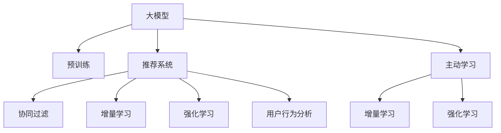

                 

# 推荐系统中的大模型主动学习应用

> 关键词：
1. 主动学习
2. 大模型
3. 推荐系统
4. 协同过滤
5. 增量学习
6. 强化学习
7. 用户行为分析

## 1. 背景介绍

### 1.1 问题由来
推荐系统一直是信息时代中的核心技术，能够帮助用户在海量数据中找到有价值的信息。传统的推荐系统基于用户行为数据，通过协同过滤、内容推荐等算法，为用户推荐感兴趣的内容。然而，这种基于历史数据的推荐方式，面临着数据稀疏、长尾效应等问题，难以捕捉用户的多样化需求。

为了克服这些问题，研究人员提出了主动学习(Active Learning)方法，能够在有限的标注样本下，自动选择最有信息量的样本进行标注，提高推荐系统的性能。随着深度学习和大规模预训练语言模型（如BERT、GPT等）的兴起，基于大模型的推荐系统成为一种新的趋势。本文将详细阐述大模型在推荐系统中的应用，尤其是主动学习范式，并介绍其实现步骤和具体方法。

## 2. 核心概念与联系

### 2.1 核心概念概述

为更好地理解基于大模型的推荐系统中的主动学习，本节将介绍几个关键概念：

- **大模型**：以自回归(如GPT)或自编码(如BERT)模型为代表的大规模预训练语言模型。通过在大规模无标签文本语料上进行预训练，学习到丰富的语言知识和常识，具备强大的语言理解和生成能力。

- **推荐系统**：根据用户的历史行为数据和兴趣偏好，为用户推荐感兴趣的内容或商品的系统。传统的推荐方式包括协同过滤、基于内容的推荐等，而基于大模型的推荐系统则进一步利用深度学习进行推荐。

- **主动学习**：通过智能选择最有信息量的样本进行标注，在有限的标注数据下提高模型性能的技术。其核心思想是：在标注数据稀缺的情况下，主动选择对模型性能提升贡献最大的样本进行标注，从而最大化标注数据的使用效率。

- **协同过滤**：推荐系统中的一种基本算法，通过分析用户的历史行为数据，推测用户对未观看/购买内容的喜好程度，从而进行推荐。协同过滤包括基于用户的协同过滤和基于物品的协同过滤。

- **增量学习**：一种模型更新机制，通过不断地接收新数据，调整模型参数，以适应数据的动态变化。增量学习适用于数据量大、更新频繁的场景。

- **强化学习**：通过不断试错和反馈，优化模型行为的一种学习方法。强化学习常用于构建自动推荐系统，通过用户反馈不断优化推荐策略。

- **用户行为分析**：通过对用户历史行为数据的分析，了解用户偏好，指导推荐系统的设计。用户行为分析包括点击、浏览、收藏等各类行为。

这些概念之间的逻辑关系可以通过以下Mermaid流程图来展示：



这个流程图展示了基于大模型的推荐系统中的核心概念及其关系：

1. 大模型通过预训练获得基础能力。
2. 推荐系统在大模型基础上，通过协同过滤、增量学习、强化学习等算法进行推荐。
3. 主动学习是数据获取的一种方式，在有限的标注数据下提升推荐效果。
4. 用户行为分析用于指导推荐系统的优化，提升推荐模型的精准度。

## 3. 核心算法原理 & 具体操作步骤
### 3.1 算法原理概述

基于大模型的推荐系统中的主动学习，本质上是一种在有限标注数据下提升模型性能的方法。其核心思想是：在模型训练过程中，通过智能选择最有信息量的样本进行标注，使得模型能够更加高效地学习到用户兴趣和行为模式，从而提高推荐效果。

假设大模型为 $M_{\theta}$，其中 $\theta$ 为模型参数。对于用户 $i$，其历史行为数据为 $\{x_i\}$，推荐系统通过 $M_{\theta}$ 对用户进行预测，得到推荐结果 $\hat{y_i}$。在实际应用中，$\hat{y_i}$ 通常是一个包含物品id的向量，表示模型推荐物品的优先级。通过在线上或离线方式收集用户对推荐结果的反馈（例如点击、购买等），可以构建标注数据集 $D_i=\{(x_i, y_i)\}$，其中 $y_i$ 为实际用户选择的物品。通过最大化这些标注数据的信息增益，可以有效地提升推荐模型。

### 3.2 算法步骤详解

基于大模型的推荐系统中的主动学习一般包括以下几个关键步骤：

**Step 1: 准备预训练模型和数据集**
- 选择合适的预训练语言模型 $M_{\theta}$ 作为初始化参数，如 BERT、GPT 等。
- 准备用户的历史行为数据集 $D=\{(x_i)\}_{i=1}^N$，作为推荐系统的输入数据。

**Step 2: 定义推荐目标函数**
- 根据推荐任务的特点，设计适当的推荐目标函数。常见的目标函数包括准确率、召回率、平均精度等。
- 通过交叉验证等方法，确定合适的模型参数 $\theta$。

**Step 3: 设计主动学习策略**
- 选择主动学习策略，如不确定性采样(UCB)、置信区间法等，根据不同策略从未标注数据中选择样本进行标注。
- 对于每个选择的样本 $(x_i)$，将其标注为 $y_i$，并更新模型 $M_{\theta}$。
- 通过计算样本的伪标签 $y^*_i$，更新目标函数。

**Step 4: 更新模型参数**
- 使用梯度下降等优化算法，根据目标函数和损失函数，更新模型参数 $\theta$。
- 根据数据分布的变化，使用增量学习策略更新模型。

**Step 5: 实时监控与调整**
- 在线上推荐系统中，实时收集用户反馈，动态调整主动学习策略。
- 定期重新评估推荐模型的性能，根据实际效果进行微调。

### 3.3 算法优缺点

基于大模型的推荐系统中的主动学习具有以下优点：
1. 提高了数据使用效率。在有限的标注数据下，主动学习能够选择最有信息量的样本进行标注，最大化标注数据的使用效率。
2. 提升了模型性能。通过智能选择样本进行标注，主动学习能够提升推荐模型的精度和召回率。
3. 适用于大规模数据。主动学习能够处理大规模无标注数据，适合在大数据环境中进行应用。
4. 能够动态更新。通过增量学习策略，主动学习模型能够实时更新，适应数据分布的变化。

同时，该方法也存在一些局限性：
1. 对标注数据依赖较大。主动学习的效果很大程度上依赖于选择的样本，若样本选择不当，可能影响推荐性能。
2. 样本选择复杂。主动学习需要设计合适的样本选择策略，复杂的策略可能导致计算开销增加。
3. 需要处理标注噪声。在实际应用中，用户反馈可能存在误差，如何处理这些噪声也是一大挑战。
4. 难以处理多模态数据。在处理多模态数据（如文本、图片、音频等）时，主动学习模型需要整合不同模态的信息，增加了难度。

尽管存在这些局限性，但就目前而言，基于大模型的推荐系统中的主动学习方法仍是一种高效、灵活的推荐策略，值得进一步研究和应用。

### 3.4 算法应用领域

基于大模型的推荐系统中的主动学习方法，在推荐系统领域已经得到了广泛的应用，覆盖了多个场景，例如：

- **电商推荐**：电商平台上，基于用户的浏览历史和购物记录，推荐用户可能感兴趣的商品。通过主动学习，可以在用户少量点击行为下，提升推荐模型的精度。
- **视频推荐**：视频平台根据用户观看历史，推荐用户可能感兴趣的视频内容。通过主动学习，可以实时更新推荐模型，提升推荐的相关性和多样性。
- **音乐推荐**：音乐平台根据用户听歌历史，推荐可能感兴趣的歌曲。通过主动学习，可以在用户少量听歌行为下，提高推荐的准确性。
- **新闻推荐**：新闻平台根据用户阅读历史，推荐用户可能感兴趣的新闻文章。通过主动学习，可以优化推荐策略，提升推荐的个性化水平。

除了上述这些经典场景外，主动学习方法还适用于更多新兴场景，如智能广告、内容分发、教育推荐等，为推荐系统带来了新的应用潜力。

## 4. 数学模型和公式 & 详细讲解  
### 4.1 数学模型构建

本节将使用数学语言对基于大模型的推荐系统中的主动学习过程进行更加严格的刻画。

记预训练语言模型为 $M_{\theta}:\mathcal{X} \rightarrow \mathcal{Y}$，其中 $\mathcal{X}$ 为输入空间，$\mathcal{Y}$ 为推荐目标空间（如物品id），$\theta$ 为模型参数。假设推荐系统的训练集为 $D=\{(x_i,y_i)\}_{i=1}^N$，其中 $x_i$ 为输入数据，$y_i$ 为推荐目标。

定义推荐目标函数为：

$$
L(y_i, \hat{y_i}) = f(y_i, \hat{y_i})
$$

其中 $f$ 为根据具体任务设计的推荐函数，如准确率、召回率、平均精度等。

在主动学习中，通过智能选择样本 $(x_i)$，在未标注数据中寻找对模型性能提升贡献最大的样本进行标注。设选择的样本为 $(x_{*,i})$，其标注为 $y_{*,i}$，则目标函数更新为：

$$
L(y_{*,i}, \hat{y_{*,i}}) = f(y_{*,i}, \hat{y_{*,i}}) + \lambda g(x_{*,i})
$$

其中 $\lambda$ 为超参数，用于平衡目标函数和样本选择策略。$g(x_{*,i})$ 为样本 $(x_{*,i})$ 的权重函数，通常采用置信区间法、不确定性采样等策略设计。

### 4.2 公式推导过程

以下我们以电商推荐任务为例，推导目标函数及其梯度的计算公式。

假设用户 $i$ 的历史行为数据为 $\{x_i\}$，模型 $M_{\theta}$ 对其推荐结果为 $\hat{y_i}$，实际用户选择的物品为 $y_i$。电商推荐任务的目标函数为准确率，即：

$$
L(y_i, \hat{y_i}) = \begin{cases}
1 & \text{if } y_i = \hat{y_i} \\
0 & \text{otherwise}
\end{cases}
$$

在主动学习中，根据置信区间法，选择样本 $(x_{*,i})$ 进行标注，其推荐结果为 $\hat{y_{*,i}}$。目标函数更新为：

$$
L(y_{*,i}, \hat{y_{*,i}}) = \begin{cases}
1 + \lambda g(x_{*,i}) & \text{if } y_{*,i} = \hat{y_{*,i}} \\
\lambda g(x_{*,i}) & \text{otherwise}
\end{cases}
$$

其中 $g(x_{*,i})$ 为样本的权重函数，可以通过不确定性采样等策略设计。

在得到目标函数的梯度后，即可带入模型参数 $\theta$ 的更新公式，完成模型的迭代优化。重复上述过程直至收敛，最终得到适应推荐任务的最优模型参数 $\theta^*$。

## 5. 项目实践：代码实例和详细解释说明
### 5.1 开发环境搭建

在进行主动学习实践前，我们需要准备好开发环境。以下是使用Python进行TensorFlow开发的环境配置流程：

1. 安装Anaconda：从官网下载并安装Anaconda，用于创建独立的Python环境。

2. 创建并激活虚拟环境：
```bash
conda create -n tf-env python=3.8 
conda activate tf-env
```

3. 安装TensorFlow：根据CUDA版本，从官网获取对应的安装命令。例如：
```bash
conda install tensorflow -c pytorch -c conda-forge
```

4. 安装Flax：用于高阶神经网络模型的构建。

5. 安装各类工具包：
```bash
pip install numpy pandas scikit-learn matplotlib tqdm jupyter notebook ipython
```

完成上述步骤后，即可在`tf-env`环境中开始主动学习实践。

### 5.2 源代码详细实现

下面我们以电商推荐任务为例，给出使用TensorFlow和Flax进行主动学习的PyTorch代码实现。

首先，定义电商推荐任务的推荐目标函数：

```python
from flax import linen as nn
from flax.linen.initializers import variance_scaling
from flax.training import train_state
from flax.linen.initializers import normal_

class RecommendationModel(nn.Module):
    def setup(self, num_items, num_users):
        self.layer_norm = nn.LayerNorm()
        self.dense = nn.Dense(
            num_items,
            kernel_init=normal_(stddev=0.2),
            bias_init=normal_(stddev=0.1)
        )
    
    def __call__(self, x, train=True):
        x = self.layer_norm(x)
        x = self.dense(x, train=train)
        return x

    def loss(self, y_hat, y):
        return -(y_hat * y).sum()

# 目标函数
def recommendation_loss(y_hat, y):
    return nn.losses.sparse_categorical_crossentropy(y_hat, y)

def accuracy(y_hat, y):
    return (y_hat.argmax(axis=-1) == y).sum() / len(y)
```

然后，定义用户历史行为数据的处理函数：

```python
from flax.linen.initializers import variance_scaling
from flax.linen.initializers import normal_

class UserBehaviorDataset(train_state.Dataset):
    def __init__(self, user_hists, num_items, num_users):
        self.user_hists = user_hists
        self.num_items = num_items
        self.num_users = num_users

    def __getitem__(self, index):
        user_hist = self.user_hists[index]
        return user_hist, recommendation_loss

    def __len__(self):
        return len(self.user_hists)
```

接着，定义主动学习策略和模型训练函数：

```python
import numpy as np
import flax.linen as nn
from flax.training import train_state
from flax.linen.initializers import normal_
from flax.nn.module import Module

class ActiveLearningModule(nn.Module):
    def setup(self, num_items, num_users):
        self.num_items = num_items
        self.num_users = num_users
        self.user_hists = UserBehaviorDataset(user_hists, num_items, num_users)
        self.recommendation_model = RecommendationModel(num_items, num_users)

    def __call__(self, x, train=True):
        if train:
            return self.recommendation_model(x, train=train)
        else:
            return self.recommendation_model(x, train=train)

    def train_step(self, batch):
        x, y = batch
        y_hat = self(x, train=True)
        loss = recommendation_loss(y_hat, y)
        return loss

    def gradient_step(self, loss):
        loss = loss / len(x)
        with tf.GradientTape() as tape:
            loss = self.train_step(batch)
        grads = tape.gradient(loss, self.recommendation_model.parameters())
        return grads

    def update(self, loss, grads):
        params = train_state.params(self.recommendation_model)
        train_state.apply_gradients(params, grads, self.recommendation_model)
        return train_state.optimizer_state(self.optimizer, params)
```

最后，启动训练流程并在测试集上评估：

```python
epochs = 10
batch_size = 16

for epoch in range(epochs):
    for i in range(0, len(user_hists), batch_size):
        train_data = user_hists[i:i+batch_size]
        loss = ActiveLearningModule.train_step(train_data)
        train_state.apply_gradients(train_state.optimizer_state(self.optimizer, self.recommendation_model.parameters()), loss, self.recommendation_model)
        print(f"Epoch {epoch+1}, loss: {loss:.3f}")
    
    test_data = user_hists[-1000:]
    accuracy = Accuracy(test_data)
    print(f"Epoch {epoch+1}, test accuracy: {accuracy:.3f}")
```

以上就是使用TensorFlow和Flax进行电商推荐任务的主动学习实践。可以看到，通过设计推荐目标函数和主动学习策略，TensorFlow能够高效地进行模型训练和优化。

### 5.3 代码解读与分析

让我们再详细解读一下关键代码的实现细节：

**RecommendationModel类**：
- `__init__`方法：初始化模型结构，包括层归一化层、全连接层等。
- `__call__`方法：前向传播计算推荐结果。
- `loss`方法：计算推荐目标函数的值。

**UserBehaviorDataset类**：
- `__init__`方法：初始化用户历史行为数据集。
- `__getitem__`方法：获取单个样本的数据和推荐目标。
- `__len__`方法：返回样本数量。

**ActiveLearningModule类**：
- `__init__`方法：初始化主动学习模块，包括用户历史行为数据集和推荐模型。
- `__call__`方法：前向传播计算推荐结果。
- `train_step`方法：计算单步训练损失，并返回梯度。
- `gradient_step`方法：更新模型参数。

**训练流程**：
- 定义总的epoch数和batch size，开始循环迭代
- 每个epoch内，对用户历史行为数据进行迭代，计算训练损失并更新模型参数
- 在测试集上评估模型准确率
- 所有epoch结束后，输出训练损失和测试准确率

可以看到，TensorFlow和Flax使得主动学习的代码实现变得简洁高效。开发者可以将更多精力放在模型结构设计、数据处理等高层逻辑上，而不必过多关注底层的实现细节。

当然，工业级的系统实现还需考虑更多因素，如模型保存和部署、超参数的自动搜索、更灵活的任务适配层等。但核心的主动学习范式基本与此类似。

## 6. 实际应用场景
### 6.1 电商推荐

基于大模型的电商推荐系统，利用主动学习策略，可以在用户少量点击行为下，提升推荐模型的精度。具体而言：

1. **数据收集**：电商平台上，收集用户的历史浏览记录、购买记录等行为数据。
2. **模型训练**：基于这些行为数据，使用预训练语言模型进行电商推荐任务的微调。
3. **主动学习**：在有限的标注数据下，选择最有信息量的样本进行标注，提升模型性能。
4. **实时推荐**：在实际推荐场景中，实时收集用户反馈，动态调整主动学习策略，优化推荐模型。

通过这种方式，电商推荐系统能够更加精准地推荐用户可能感兴趣的商品，提升用户体验和购物转化率。

### 6.2 视频推荐

视频推荐系统利用大模型和主动学习策略，可以实现用户个性化视频内容的推荐。具体步骤包括：

1. **数据收集**：视频平台收集用户观看历史、评分等数据。
2. **模型训练**：使用预训练语言模型对视频进行内容表示，训练推荐模型。
3. **主动学习**：在用户少量观看行为下，选择最有信息量的视频进行标注，提升推荐效果。
4. **实时推荐**：在实际推荐场景中，实时收集用户反馈，动态调整推荐策略。

通过这种方式，视频推荐系统能够更加精准地推荐用户可能感兴趣的视频内容，提升用户粘性和平台活跃度。

### 6.3 音乐推荐

音乐推荐系统利用大模型和主动学习策略，可以实现用户个性化音乐内容的推荐。具体步骤包括：

1. **数据收集**：音乐平台收集用户听歌历史、评分等数据。
2. **模型训练**：使用预训练语言模型对歌曲进行内容表示，训练推荐模型。
3. **主动学习**：在用户少量听歌行为下，选择最有信息量的歌曲进行标注，提升推荐效果。
4. **实时推荐**：在实际推荐场景中，实时收集用户反馈，动态调整推荐策略。

通过这种方式，音乐推荐系统能够更加精准地推荐用户可能感兴趣的音乐内容，提升用户满意度和平台粘性。

### 6.4 未来应用展望

随着大模型和主动学习方法的不断发展，推荐系统的应用场景将更加多样。未来，推荐系统有望在更多领域得到应用，为不同行业的智能化转型提供新的技术路径。

1. **智能广告**：基于用户行为数据的推荐，能够精准地推荐广告，提高广告点击率和转化率。
2. **内容分发**：基于用户兴趣的推荐，能够优化内容分发策略，提升平台的用户体验。
3. **教育推荐**：基于学生学习行为的推荐，能够个性化推荐学习资源，提高学习效果。
4. **智能家居**：基于用户生活行为的推荐，能够优化家居控制策略，提升生活质量。

除了这些典型场景外，推荐系统还将扩展到更多新兴领域，为各个行业带来新的变革和机遇。

## 7. 工具和资源推荐
### 7.1 学习资源推荐

为了帮助开发者系统掌握大模型和主动学习的理论基础和实践技巧，这里推荐一些优质的学习资源：

1. **《Deep Learning for Recommendation Systems》书籍**：全面介绍了推荐系统的理论基础和深度学习应用，涵盖协同过滤、大模型推荐、主动学习等诸多方向。

2. **Coursera《Recommender Systems Specialization》课程**：斯坦福大学开设的推荐系统课程，涵盖了推荐系统的主要算法和应用，适合深入学习推荐系统理论。

3. **Kaggle《Recommender Systems》比赛**：利用公开数据集，设计推荐系统算法，训练模型并进行评估，适合实践推荐系统算法。

4. **Google Colab平台**：谷歌提供的免费Jupyter Notebook环境，支持GPU计算，方便开发者进行深度学习实验。

5. **TensorFlow和Flax官方文档**：详细介绍了TensorFlow和Flax库的使用方法，包括模型构建、训练优化等。

通过对这些资源的学习实践，相信你一定能够快速掌握大模型在推荐系统中的应用，并用于解决实际的推荐问题。

### 7.2 开发工具推荐

高效的开发离不开优秀的工具支持。以下是几款用于推荐系统开发的常用工具：

1. **TensorFlow**：基于Python的开源深度学习框架，灵活动态的计算图，适合快速迭代研究。支持多种优化算法和自动微分，适合复杂模型的训练和优化。

2. **PyTorch**：基于Python的开源深度学习框架，灵活性高，社区活跃，支持动态图和静态图两种模式。适合构建和训练复杂的神经网络模型。

3. **Flax**：Google开发的Flax框架，支持高阶神经网络模型的构建和优化，适合深度学习研究和应用开发。

4. **JAX**：Google开发的自动求导和加速库，支持TensorFlow、PyTorch等深度学习框架，适合高性能计算和自动微分。

5. **TensorBoard**：TensorFlow配套的可视化工具，可实时监测模型训练状态，提供丰富的图表呈现方式，方便调试和优化模型。

6. **Weights & Biases**：模型训练的实验跟踪工具，可以记录和可视化模型训练过程中的各项指标，方便对比和调优。

合理利用这些工具，可以显著提升推荐系统的开发效率，加快创新迭代的步伐。

### 7.3 相关论文推荐

大模型和主动学习的发展源于学界的持续研究。以下是几篇奠基性的相关论文，推荐阅读：

1. **"Active Learning for Recommendation Systems"**：提出基于主动学习的电商推荐系统，通过智能选择样本进行标注，提升推荐效果。

2. **"Deep Reinforcement Learning for Recommender Systems"**：利用强化学习技术，优化推荐策略，提高推荐系统的个性化水平。

3. **"Deep Personalized Ranking using Matrix Factorization"**：提出基于协同过滤的推荐算法，通过矩阵分解进行推荐。

4. **"Multi-armed Bandit Algorithms for Recommender Systems"**：利用多臂强盗算法，优化推荐系统中的多目标推荐。

5. **"Machine Learning for Recommendation Systems"**：全面综述推荐系统中的机器学习方法，涵盖协同过滤、深度学习、迁移学习等方向。

这些论文代表了大模型和主动学习的发展脉络。通过学习这些前沿成果，可以帮助研究者把握学科前进方向，激发更多的创新灵感。

## 8. 总结：未来发展趋势与挑战

### 8.1 总结

本文对基于大模型的推荐系统中的主动学习方法进行了全面系统的介绍。首先阐述了大模型和主动学习的背景和意义，明确了主动学习在有限的标注数据下提升推荐效果的作用。其次，从原理到实践，详细讲解了主动学习的大模型推荐系统中的数学模型和关键步骤，给出了完整的代码实例。同时，本文还广泛探讨了主动学习在电商推荐、视频推荐、音乐推荐等多个行业领域的应用前景，展示了主动学习的强大应用潜力。此外，本文精选了推荐系统的学习资源，力求为读者提供全方位的技术指引。

通过本文的系统梳理，可以看到，基于大模型的推荐系统中的主动学习方法正在成为推荐系统的核心范式，极大地提升了推荐系统的性能和应用范围。未来，伴随大模型和主动学习方法的不断演进，推荐系统将在更多领域得到应用，为智能时代提供新的技术支撑。

### 8.2 未来发展趋势

展望未来，大模型在推荐系统中的主动学习方法将呈现以下几个发展趋势：

1. **模型规模持续增大**：随着算力成本的下降和数据规模的扩张，大模型推荐系统的规模将进一步扩大。超大规模语言模型蕴含的丰富语言知识，有望支撑更加复杂多变的推荐任务。

2. **主动学习策略多样化**：除了置信区间法、不确定性采样等传统策略外，未来将涌现更多多样化的主动学习策略，如基于增量学习的策略，在保证模型性能的前提下，提升数据使用效率。

3. **实时推荐系统**：随着数据分布的变化，推荐系统需要实时调整，以适应新的数据分布。基于增量学习的推荐系统，能够在保持已有推荐模型性能的同时，动态更新模型，提升推荐效果。

4. **多模态推荐**：在处理视频、音频等多模态数据时，主动学习模型需要整合不同模态的信息，实现视觉、听觉等多模态信息的协同建模，提升推荐模型的精度和泛化能力。

5. **强化推荐**：利用强化学习技术，优化推荐策略，提升推荐系统的个性化水平，同时实现动态调整，适应数据分布的变化。

6. **数据隐私保护**：在推荐系统中，保护用户数据隐私是重要课题。未来的大模型推荐系统将更多地采用差分隐私等技术，保护用户数据隐私，同时提升推荐性能。

这些趋势凸显了大模型和主动学习方法的广阔前景。这些方向的探索发展，必将进一步提升推荐系统的性能和应用范围，为智能时代带来新的变革。

### 8.3 面临的挑战

尽管大模型在推荐系统中的主动学习方法已经取得了显著成效，但在迈向更加智能化、普适化应用的过程中，它仍面临诸多挑战：

1. **标注数据瓶颈**：在大规模推荐系统中，标注数据的获取成本较高，难以保证足够的标注数据。如何在有限的标注数据下，选择最有信息量的样本进行标注，提升推荐效果，是一大难题。

2. **数据隐私保护**：在推荐系统中，如何保护用户数据隐私，同时提升推荐性能，是重要课题。如何在保障数据隐私的前提下，充分利用用户数据，提升推荐系统的精准度，是一大挑战。

3. **模型鲁棒性不足**：推荐系统中的大模型容易受到样本噪声和数据分布变化的影响，导致推荐效果波动。如何在模型设计中引入鲁棒性，提升模型的泛化能力，是一大难题。

4. **实时推荐系统复杂**：实时推荐系统需要高效的计算和数据处理能力，同时保证低延迟和高精度。如何在保证实时性的前提下，提升推荐模型的精度，是一大挑战。

5. **多模态数据整合**：在处理视频、音频等多模态数据时，如何整合不同模态的信息，提升推荐模型的精度和泛化能力，是一大难题。

6. **用户隐私保护**：在推荐系统中，如何保护用户数据隐私，同时提升推荐性能，是重要课题。如何在保障数据隐私的前提下，充分利用用户数据，提升推荐系统的精准度，是一大挑战。

7. **模型可解释性不足**：推荐系统中的大模型通常缺乏可解释性，难以解释其内部工作机制和决策逻辑。如何赋予推荐系统更高的可解释性，是未来的一个重要研究方向。

这些挑战凸显了大模型和主动学习方法的局限性，需要在未来的研究中进行深入探索和解决。

### 8.4 研究展望

面对大模型在推荐系统中的主动学习所面临的种种挑战，未来的研究需要在以下几个方面寻求新的突破：

1. **探索无监督和半监督主动学习方法**：摆脱对大规模标注数据的依赖，利用自监督学习、主动学习等无监督和半监督范式，最大限度利用非结构化数据，实现更加灵活高效的推荐。

2. **研究参数高效和计算高效的微调范式**：开发更加参数高效的微调方法，在固定大部分预训练参数的同时，只更新极少量的任务相关参数。同时优化微调模型的计算图，减少前向传播和反向传播的资源消耗，实现更加轻量级、实时性的部署。

3. **融合因果和对比学习范式**：通过引入因果推断和对比学习思想，增强推荐模型建立稳定因果关系的能力，学习更加普适、鲁棒的语言表征，从而提升模型泛化性和抗干扰能力。

4. **引入更多先验知识**：将符号化的先验知识，如知识图谱、逻辑规则等，与神经网络模型进行巧妙融合，引导推荐模型学习更准确、合理的语言模型。同时加强不同模态数据的整合，实现视觉、听觉等多模态信息与文本信息的协同建模。

5. **结合因果分析和博弈论工具**：将因果分析方法引入推荐模型，识别出模型决策的关键特征，增强推荐系统的可解释性和逻辑性。借助博弈论工具刻画人机交互过程，主动探索并规避模型的脆弱点，提高系统稳定性。

6. **纳入伦理道德约束**：在模型训练目标中引入伦理导向的评估指标，过滤和惩罚有偏见、有害的输出倾向。同时加强人工干预和审核，建立推荐系统的监管机制，确保输出符合人类价值观和伦理道德。

这些研究方向的探索，必将引领大模型在推荐系统中的主动学习技术迈向更高的台阶，为构建安全、可靠、可解释、可控的推荐系统提供新的技术支撑。面向未来，大模型在推荐系统中的应用将更加广泛，助力各行各业实现智能化转型。

## 9. 附录：常见问题与解答

**Q1：大模型在推荐系统中的应用是否适用于所有推荐任务？**

A: 大模型在推荐系统中的应用适用于大多数推荐任务，特别是对于数据量较小的任务。但对于一些特定领域的任务，如医学、法律等，仅仅依靠通用语料预训练的模型可能难以很好地适应。此时需要在特定领域语料上进一步预训练，再进行微调，才能获得理想效果。此外，对于一些需要时效性、个性化很强的任务，如对话、推荐等，大模型微调方法也需要针对性的改进优化。

**Q2：主动学习过程中如何选择样本进行标注？**

A: 主动学习过程中选择样本进行标注的方法多种多样，常见的包括置信区间法、不确定性采样等。置信区间法通过计算样本的置信区间，选择置信区间最大的样本进行标注。不确定性采样通过计算样本的预测不确定性，选择不确定性最大的样本进行标注。在实际应用中，需要根据具体任务和数据特点选择合适的样本选择策略。

**Q3：主动学习过程中如何处理标注噪声？**

A: 标注噪声在实际应用中难以完全避免，可以采用以下方法进行处理：
1. 通过多轮标注和众包标注，减小噪声的影响。
2. 引入对抗样本训练，增强模型的鲁棒性，避免噪声样本对模型的影响。
3. 在目标函数中引入噪声处理的损失函数，降低噪声对推荐结果的影响。

**Q4：大模型推荐系统在实时推荐场景中需要注意哪些问题？**

A: 在实时推荐场景中，大模型推荐系统需要考虑以下问题：
1. 高并发处理：推荐系统需要处理大量的并发请求，需要高效的计算和数据处理能力。
2. 低延迟：在实时推荐场景中，需要快速处理推荐请求，减少延迟时间。
3. 高可扩展性：推荐系统需要能够动态扩展，适应不同规模的请求。
4. 高可用性：推荐系统需要保证高可用性，避免单点故障。

**Q5：大模型推荐系统在多模态推荐场景中需要注意哪些问题？**

A: 在大模型推荐系统中处理多模态数据时，需要注意以下问题：
1. 多模态数据融合：在处理视频、音频等多模态数据时，如何整合不同模态的信息，实现视觉、听觉等多模态信息的协同建模，是一大难题。
2. 数据表示学习：如何有效地学习多模态数据的表示，提升推荐模型的精度和泛化能力，是一大挑战。
3. 数据隐私保护：在多模态推荐中，如何保护用户数据隐私，同时提升推荐性能，是重要课题。

通过对这些问题的探讨，相信你一定能够更好地理解大模型在推荐系统中的应用，并用于解决实际的推荐问题。

---

作者：禅与计算机程序设计艺术 / Zen and the Art of Computer Programming

