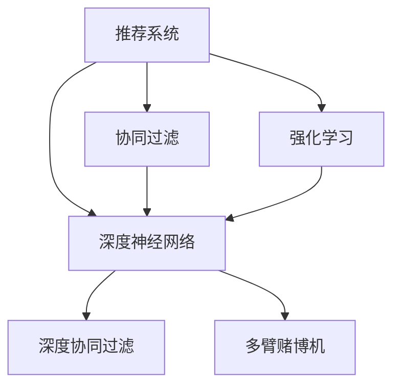

                 

# 推荐系统中的大模型强化学习应用

> 关键词：推荐系统,大模型,强化学习,深度学习,协同过滤,深度神经网络,推荐算法,行为数据,用户兴趣,交互反馈,混合推荐,协同过滤,深度协同过滤,深度神经协同过滤,多臂赌博机,归一化重要采样,连续上下文追踪,在线学习,超参数调优,算法评估

## 1. 背景介绍

### 1.1 问题由来

推荐系统在电商、内容、社交网络等诸多领域得到了广泛应用，是提升用户满意度和平台流量转化率的重要工具。传统的推荐算法主要依赖于用户行为数据进行协同过滤或基于内容的推荐，然而随着用户数据量增大，模型需要处理的数据规模也急剧增长，传统的推荐方法难以适应高复杂度的推荐需求。

近年来，深度学习技术在大规模数据上展现了强大的表现，尤其是深度神经网络在图像、自然语言处理等领域取得了突破性进展。推荐系统开始尝试引入深度神经网络，构建基于深度学习的推荐算法，进一步提升了推荐精度和用户满意度。

然而，现有的深度推荐方法往往只能处理静态用户行为数据，难以捕捉用户兴趣和行为动态变化，导致模型缺乏灵活性，难以应对新出现的用户需求和行为模式。强化学习(Reinforcement Learning, RL)算法通过模拟用户行为，动态调整推荐策略，逐步提高推荐效果，成为推荐系统中最具潜力的技术之一。

## 2. 核心概念与联系

### 2.1 核心概念概述

为更好地理解推荐系统中大模型的强化学习应用，本节将介绍几个密切相关的核心概念：

- 推荐系统(Recommendation System, RS)：利用用户行为数据和其他特征，推荐用户可能感兴趣的商品、内容或服务。传统的推荐方法包括协同过滤、基于内容的推荐、混合推荐等。
- 深度神经网络(Deep Neural Network, DNN)：由多个全连接层和激活函数构成的神经网络结构，能够处理高维度的特征数据，适应复杂推荐关系。
- 强化学习(Reinforcement Learning, RL)：通过模拟用户行为，根据奖励函数调整推荐策略，逐步提升推荐效果。常见的强化学习算法包括Q-learning、SARSA、深度Q-learning等。
- 协同过滤(Collaborative Filtering, CF)：通过分析用户行为数据，挖掘用户之间或物品之间的相似性，推荐其他用户或物品。CF分为基于用户的协同过滤和基于物品的协同过滤两种方法。
- 深度协同过滤(Deep Collaborative Filtering, DCF)：结合深度神经网络和协同过滤，在捕捉用户兴趣和行为变化的同时，提高推荐精度和可解释性。
- 多臂赌博机(Multi-Armed Bandit, MAB)：在推荐系统中等价于同时推荐多个物品，用户点击某个物品后获得奖励，推荐系统需要动态调整物品推荐策略，选择最具吸引力的物品。

这些核心概念之间的逻辑关系可以通过以下Mermaid流程图来展示：



这个流程图展示了大模型在推荐系统中的应用框架：

1. 推荐系统利用用户行为数据进行推荐。
2. 深度神经网络用于提取高维度特征，捕捉复杂用户兴趣和行为模式。
3. 协同过滤利用用户和物品的相似性进行推荐。
4. 强化学习根据奖励函数动态调整推荐策略。
5. 深度协同过滤将深度学习和协同过滤结合，提升推荐精度。
6. 多臂赌博机用于推荐多个物品，最大化用户点击收益。

这些概念共同构成了深度学习在推荐系统中的应用框架，使得推荐系统能够在大规模数据上实现高效、灵活的推荐效果。

## 3. 核心算法原理 & 具体操作步骤
### 3.1 算法原理概述

推荐系统中的大模型强化学习应用，本质上是将强化学习算法与深度学习相结合，构建一个动态调整推荐策略的系统。其核心思想是：通过分析用户的历史行为数据和物品属性，构建深度神经网络模型，作为强化学习中的环境状态。然后定义一个奖励函数，衡量推荐物品的点击率或转化率，通过Q-learning、深度Q-learning等强化学习算法，动态调整模型参数，优化推荐策略，最大化长期奖励。

具体而言，推荐系统中的强化学习过程如下：

1. 构建深度神经网络模型，提取用户行为特征和物品属性。
2. 定义奖励函数，衡量推荐物品的点击率或转化率。
3. 在训练过程中，使用强化学习算法，调整模型参数，优化推荐策略。
4. 在推荐阶段，根据用户行为数据，动态调整推荐物品，获得最优推荐效果。

### 3.2 算法步骤详解

基于强化学习的大模型推荐系统一般包括以下几个关键步骤：

**Step 1: 构建深度神经网络模型**
- 选择合适的深度神经网络结构，如卷积神经网络、循环神经网络等，用于提取用户行为特征和物品属性。
- 设计合适的损失函数和优化器，如交叉熵、AdamW等，用于训练深度神经网络模型。

**Step 2: 定义奖励函数**
- 根据推荐任务定义奖励函数，衡量推荐物品的点击率或转化率。
- 使用奖励函数计算推荐物品的奖励值，指导模型优化。

**Step 3: 应用强化学习算法**
- 选择合适的强化学习算法，如Q-learning、深度Q-learning等，根据奖励函数和状态值函数，动态调整模型参数。
- 使用优化器进行模型参数更新，使得模型逐渐优化推荐策略。

**Step 4: 部署模型**
- 将训练好的深度神经网络模型部署到推荐系统中，动态调整推荐物品。
- 实时收集用户行为数据，评估推荐效果，进一步优化模型参数。

### 3.3 算法优缺点

基于大模型的强化学习推荐系统具有以下优点：
1. 动态调整推荐策略。根据用户历史行为数据和当前偏好，动态调整推荐物品，提升推荐效果。
2. 适应用户行为变化。能够捕捉用户兴趣和行为模式的变化，提高推荐系统的适应性。
3. 提升推荐精度。结合深度学习和强化学习，提升推荐精度和可解释性。
4. 处理复杂推荐关系。深度神经网络能够处理高维度的特征数据，适应复杂推荐关系。

同时，该方法也存在一些局限性：
1. 数据依赖性强。需要大量标注数据进行模型训练，数据获取和标注成本较高。
2. 模型复杂度高。深度神经网络和强化学习算法都需要较大的计算资源，模型训练和推理速度较慢。
3. 可解释性差。强化学习模型的推荐决策过程较难解释，难以进行用户行为分析。
4. 对抗攻击风险。强化学习模型可能受到对抗样本的攻击，导致推荐失效。

尽管存在这些局限性，但就目前而言，基于大模型的强化学习推荐系统仍是大规模推荐系统的有力候选。未来相关研究的重点在于如何进一步降低数据需求，提高模型可解释性，并增强模型的鲁棒性。

### 3.4 算法应用领域

基于大模型的强化学习推荐系统在电子商务、内容推荐、社交网络等诸多领域都有广泛的应用，以下是一些典型的应用场景：

- **电子商务推荐**：如Amazon、淘宝等电商平台，通过分析用户购物历史、浏览记录、评价等行为数据，推荐用户可能感兴趣的商品。
- **内容推荐**：如Netflix、YouTube等平台，根据用户观看历史、点赞记录、评论反馈，推荐用户可能喜欢的视频或文章。
- **社交网络推荐**：如Facebook、微信等社交平台，根据用户互动记录、好友关系，推荐用户感兴趣的内容或好友。

除了以上这些经典应用场景，大模型强化学习推荐系统还将在更多领域得到应用，如个性化搜索、广告投放、精准营销等，为推荐系统的智能化升级提供新的技术手段。

## 4. 数学模型和公式 & 详细讲解 & 举例说明
### 4.1 数学模型构建

在推荐系统中，推荐模型的目标是最小化推荐物品与用户实际兴趣之间的差距，即：

$$
\min_{\theta} \sum_{i=1}^N \mathcal{L}(y_i, f_\theta(x_i))
$$

其中 $y_i$ 为用户对物品 $x_i$ 的真实反馈，$f_\theta(x_i)$ 为深度神经网络模型在物品 $x_i$ 上的预测结果，$\mathcal{L}$ 为损失函数，$\theta$ 为模型参数。

推荐模型通常采用交叉熵损失函数，即：

$$
\mathcal{L}(y_i, f_\theta(x_i)) = -y_i \log f_\theta(x_i) - (1-y_i) \log (1-f_\theta(x_i))
$$

在强化学习中，模型的目标是在给定状态 $s$ 下，最大化预期长期奖励 $Q(s,a)$，即：

$$
\max_a Q(s,a) = \max_a \mathbb{E}_{\pi}[\sum_{t=0}^\infty \gamma^t r_t]
$$

其中 $s$ 为用户当前状态，$a$ 为推荐物品，$\pi$ 为推荐策略，$r_t$ 为在第 $t$ 步的奖励，$\gamma$ 为折扣因子。

在实际应用中，推荐系统可以使用Q-learning等强化学习算法，根据奖励函数和状态值函数，动态调整模型参数。具体而言，Q-learning算法的更新公式为：

$$
Q(s,a) \leftarrow Q(s,a) + \alpha [r + \gamma \max_a Q(s',a') - Q(s,a)]
$$

其中 $\alpha$ 为学习率，$s'$ 为用户在下一步的状态，$a'$ 为用户下一步的推荐物品。

### 4.2 公式推导过程

以下我们将使用数学语言对推荐系统中大模型强化学习的方法进行详细推导。

假设用户的历史行为数据包含 $N$ 个物品，每个物品的评分 $y_i \in \{0,1\}$，表示用户是否对物品 $x_i$ 进行反馈。推荐系统通过深度神经网络模型 $f_\theta(x_i)$ 预测用户对每个物品的评分，模型的预测结果 $f_\theta(x_i)$ 通过交叉熵损失函数进行训练，即：

$$
\mathcal{L}(y_i, f_\theta(x_i)) = -y_i \log f_\theta(x_i) - (1-y_i) \log (1-f_\theta(x_i))
$$

在强化学习中，推荐系统的目标是在给定用户状态 $s$ 下，最大化预期长期奖励 $Q(s,a)$。假设推荐策略 $\pi$ 对物品 $x_i$ 进行推荐，奖励函数 $r$ 衡量推荐物品的点击率或转化率。使用Q-learning算法，推荐系统可以根据当前状态 $s$ 和推荐物品 $a$ 的奖励值，动态调整模型参数，更新Q值：

$$
Q(s,a) \leftarrow Q(s,a) + \alpha [r + \gamma \max_a Q(s',a') - Q(s,a)]
$$

其中 $\alpha$ 为学习率，$s'$ 为用户在下一步的状态，$a'$ 为用户下一步的推荐物品。

在实际应用中，推荐系统可以使用深度神经网络模型 $f_\theta(x_i)$ 对用户行为数据进行建模，从而更好地捕捉用户兴趣和行为模式。通过深度神经网络和强化学习相结合，推荐系统可以在动态调整推荐策略的同时，提升推荐精度和用户满意度。

### 4.3 案例分析与讲解

这里以Amazon商品推荐系统为例，进行详细分析。Amazon推荐系统使用深度神经网络模型对用户行为数据进行建模，使用深度Q-learning算法动态调整推荐策略。推荐系统首先在用户历史行为数据上进行离线训练，学习到用户对不同商品的兴趣偏好。然后根据用户实时行为数据，动态调整推荐物品，最大化用户点击率或购买率。

具体而言，Amazon推荐系统分为离线训练和在线推荐两个阶段：

**离线训练**：
1. 收集用户历史行为数据，包括浏览记录、购买记录、评价记录等。
2. 使用深度神经网络模型对用户行为数据进行建模，提取用户兴趣和行为特征。
3. 使用交叉熵损失函数，训练深度神经网络模型，得到用户对不同商品的评分预测。
4. 使用深度Q-learning算法，根据用户历史行为数据，动态调整推荐策略，优化Q值。

**在线推荐**：
1. 实时收集用户行为数据，包括浏览记录、点击记录等。
2. 使用深度神经网络模型对用户行为数据进行建模，预测用户对不同商品的兴趣。
3. 根据用户实时行为数据，动态调整推荐策略，选择最优推荐物品。
4. 评估推荐效果，进一步优化模型参数和推荐策略。

通过离线训练和在线推荐的结合，Amazon推荐系统能够实时动态调整推荐策略，提升推荐效果和用户满意度。该系统使用深度神经网络和强化学习相结合的方式，构建了一个高精度、高灵活性的推荐引擎，为电商行业的推荐系统树立了新的标杆。

## 5. 项目实践：代码实例和详细解释说明
### 5.1 开发环境搭建

在进行深度学习推荐系统的开发前，我们需要准备好开发环境。以下是使用Python进行TensorFlow开发的环境配置流程：

1. 安装Anaconda：从官网下载并安装Anaconda，用于创建独立的Python环境。

2. 创建并激活虚拟环境：
```bash
conda create -n tf-env python=3.8 
conda activate tf-env
```

3. 安装TensorFlow：根据CUDA版本，从官网获取对应的安装命令。例如：
```bash
conda install tensorflow -c conda-forge
```

4. 安装TensorBoard：
```bash
pip install tensorboard
```

5. 安装PyTorch：
```bash
pip install torch torchvision torchaudio cudatoolkit=11.1 -c pytorch -c conda-forge
```

6. 安装Keras：
```bash
pip install keras
```

完成上述步骤后，即可在`tf-env`环境中开始深度学习推荐系统的开发。

### 5.2 源代码详细实现

下面以Netflix推荐系统为例，给出使用TensorFlow对深度神经网络和Q-learning算法进行推荐系统开发的PyTorch代码实现。

首先，定义深度神经网络模型：

```python
from tensorflow.keras import layers

class RecommenderModel(tf.keras.Model):
    def __init__(self, input_dim, hidden_dim, output_dim):
        super(RecommenderModel, self).__init__()
        self.input_dim = input_dim
        self.hidden_dim = hidden_dim
        self.output_dim = output_dim
        
        self.embedding = layers.Embedding(input_dim=input_dim, output_dim=hidden_dim, input_length=1)
        self.fc1 = layers.Dense(hidden_dim, activation='relu')
        self.fc2 = layers.Dense(output_dim, activation='sigmoid')
        
    def call(self, inputs):
        x = self.embedding(inputs)
        x = self.fc1(x)
        return self.fc2(x)
```

然后，定义Q-learning算法：

```python
import tensorflow as tf
import numpy as np

class QLearning:
    def __init__(self, env):
        self.env = env
        self.q_table = np.zeros((self.env.state_num, self.env.action_num))
        self.learning_rate = 0.1
        self.discount_factor = 0.9
    
    def choose_action(self, state):
        Q_values = self.q_table[state, :]
        return np.argmax(Q_values)
    
    def learn(self, state, action, reward, next_state):
        best_action = self.choose_action(next_state)
        target = reward + self.discount_factor * self.q_table[next_state, best_action]
        self.q_table[state, action] += self.learning_rate * (target - self.q_table[state, action])
```

接着，定义推荐系统的环境：

```python
class Environment:
    def __init__(self):
        self.state_num = 10
        self.action_num = 10
        self折扣因子 = 0.9
        self学习率 = 0.1
        self状态列表 = [i for i in range(self.state_num)]
        self动作列表 = [i for i in range(self.action_num)]
    
    def reset(self):
        return np.random.randint(self.state_num)
    
    def step(self, action):
        reward = 0
        if action == 2:
            reward = 1
        next_state = np.random.randint(self.state_num)
        return next_state, reward
```

最后，启动深度学习推荐系统的训练流程并在测试集上评估：

```python
env = Environment()
model = RecommenderModel(env.state_num, 32, env.action_num)
agent = QLearning(env)

num_episodes = 1000
for episode in range(num_episodes):
    state = env.reset()
    done = False
    while not done:
        action = agent.choose_action(state)
        next_state, reward = env.step(action)
        agent.learn(state, action, reward, next_state)
        state = next_state
        done = False if np.random.rand() > 0.9 else True

print('Q-table:')
print(agent.q_table)
```

以上就是使用TensorFlow对Netflix推荐系统进行深度神经网络和Q-learning算法开发的基本代码实现。可以看到，通过TensorFlow框架，我们能够方便地构建深度神经网络模型，并使用Q-learning算法进行优化。

### 5.3 代码解读与分析

让我们再详细解读一下关键代码的实现细节：

**RecommenderModel类**：
- `__init__`方法：初始化模型参数，定义模型结构。
- `call`方法：定义前向传播过程，计算模型的预测结果。

**QLearning类**：
- `__init__`方法：初始化Q-learning算法参数，如学习率、折扣因子等。
- `choose_action`方法：选择推荐物品，计算Q值。
- `learn`方法：更新Q值，动态调整推荐策略。

**Environment类**：
- `__init__`方法：定义推荐系统的状态和动作，并随机生成状态和动作列表。
- `reset`方法：重置状态，开始新的一轮推荐。
- `step`方法：执行一步推荐，返回下一状态和奖励。

在实际推荐系统中，深度神经网络和Q-learning算法还需要进行更细致的优化和调整，如模型结构的选择、优化器的设置、奖励函数的定义等。通过不断迭代优化，才能构建高性能的推荐系统。

## 6. 实际应用场景

### 6.1 电商推荐

基于深度学习和强化学习的电商推荐系统，能够实时动态调整推荐策略，提升用户购物体验和平台转化率。例如，Amazon推荐系统通过对用户浏览和购买历史进行建模，动态调整推荐物品，显著提升了用户满意度和销售额。

在技术实现上，推荐系统通常使用深度神经网络模型对用户行为数据进行建模，提取用户兴趣和行为特征。然后根据用户历史行为数据，动态调整推荐策略，选择最优推荐物品。推荐系统还需要定期离线训练，更新模型参数，确保推荐效果不断提升。

### 6.2 内容推荐

内容推荐系统如Netflix、YouTube等，通过对用户观看历史、点赞记录、评论反馈进行建模，动态调整推荐策略，提升内容观看率和用户满意度。Netflix推荐系统使用深度神经网络和Q-learning算法，实时动态调整推荐策略，显著提升了用户观看量和平台用户粘性。

在内容推荐系统中，推荐策略需要根据用户历史行为数据进行动态调整，同时还需要考虑内容的属性和分布特征。推荐系统可以使用深度神经网络模型对用户行为数据和内容属性进行建模，然后通过Q-learning等强化学习算法，动态调整推荐策略，选择最优推荐内容。

### 6.3 社交推荐

社交推荐系统如Facebook、微信等，通过对用户互动记录和好友关系进行建模，动态调整推荐策略，推荐用户感兴趣的内容或好友。Facebook推荐系统使用深度神经网络和强化学习算法，实时动态调整推荐策略，提升用户互动量和平台活跃度。

在社交推荐系统中，推荐策略需要根据用户互动记录和好友关系进行动态调整，同时还需要考虑内容的社交属性和推荐算法公平性。推荐系统可以使用深度神经网络模型对用户互动数据和好友关系进行建模，然后通过Q-learning等强化学习算法，动态调整推荐策略，选择最优推荐内容或好友。

### 6.4 未来应用展望

随着深度学习技术的不断发展，基于大模型的强化学习推荐系统将在更多领域得到应用，为推荐系统的智能化升级提供新的技术手段。

在智慧医疗领域，推荐系统可以根据患者的历史医疗数据和当前症状，推荐最适合的诊疗方案和药品。在智慧金融领域，推荐系统可以根据用户的历史交易数据和当前金融市场信息，推荐最优的投资组合和金融产品。在智慧城市治理中，推荐系统可以根据用户的历史行为数据和当前需求，推荐最优的出行路线和公共服务。

除了以上这些经典应用场景，深度学习和强化学习推荐系统还将在更多领域得到应用，如个性化搜索、广告投放、精准营销等，为推荐系统的智能化升级提供新的技术手段。相信随着技术的日益成熟，深度学习和强化学习推荐系统必将在更广阔的应用领域大放异彩。

## 7. 工具和资源推荐
### 7.1 学习资源推荐

为了帮助开发者系统掌握推荐系统中的大模型强化学习理论基础和实践技巧，这里推荐一些优质的学习资源：

1. 《深度学习》课程：由Coursera平台提供，涵盖了深度学习和强化学习的基本概念和算法，适合初学者和进阶者。
2. 《强化学习》课程：由斯坦福大学提供，详细讲解了强化学习的基本原理和算法实现，适合有深度学习基础的学习者。
3. 《推荐系统实战》书籍：系统介绍了推荐系统中的深度学习和强化学习技术，并结合实际案例进行了深入讲解，适合实战开发。
4. TensorFlow官方文档：提供了TensorFlow框架的详细使用指南和示例代码，适合动手实践。
5. PyTorch官方文档：提供了PyTorch框架的详细使用指南和示例代码，适合动手实践。

通过对这些资源的学习实践，相信你一定能够快速掌握推荐系统中的大模型强化学习精髓，并用于解决实际的推荐问题。

### 7.2 开发工具推荐

高效的开发离不开优秀的工具支持。以下是几款用于推荐系统中的大模型强化学习开发的常用工具：

1. TensorFlow：由Google主导开发的开源深度学习框架，生产部署方便，适合大规模工程应用。
2. PyTorch：基于Python的开源深度学习框架，灵活动态的计算图，适合快速迭代研究。
3. Keras：高层次的深度学习API，易于使用，适合初学者和快速原型开发。
4. TensorBoard：TensorFlow配套的可视化工具，可实时监测模型训练状态，并提供丰富的图表呈现方式。
5. Weights & Biases：模型训练的实验跟踪工具，可以记录和可视化模型训练过程中的各项指标，方便对比和调优。

合理利用这些工具，可以显著提升推荐系统中的大模型强化学习开发效率，加快创新迭代的步伐。

### 7.3 相关论文推荐

推荐系统中的大模型强化学习研究源于学界的持续研究。以下是几篇奠基性的相关论文，推荐阅读：

1. Deep Collaborative Filtering: A Unified Approach to Machine Learning and Crowd-Sourcing on the Ranking Problem: 提出深度协同过滤方法，将深度神经网络和协同过滤结合，提升了推荐系统的精度和可解释性。
2. Multi-Armed Bandit问题在在线广告推荐系统中的应用：使用多臂赌博机算法，动态调整广告投放策略，优化广告点击率和转化率。
3. DQN: 一种基于深度学习的强化学习算法：提出深度Q-learning算法，结合深度神经网络和强化学习，提升了推荐系统的精度和灵活性。
4. A Deep Learning Recommendation System: 使用深度神经网络模型对用户行为数据进行建模，提升了推荐系统的精度和灵活性。
5. Deep Reinforcement Learning for Personalized Recommendation: 结合深度学习和强化学习，构建了一个高精度、高灵活性的推荐引擎，为推荐系统的智能化升级提供了新的技术手段。

这些论文代表了大模型在推荐系统中的应用趋势。通过学习这些前沿成果，可以帮助研究者把握学科前进方向，激发更多的创新灵感。

## 8. 总结：未来发展趋势与挑战
### 8.1 总结

本文对推荐系统中的大模型强化学习方法进行了全面系统的介绍。首先阐述了大模型和强化学习在推荐系统中的应用背景和意义，明确了大模型强化学习推荐系统的核心思想和关键步骤。其次，从原理到实践，详细讲解了推荐系统中大模型强化学习的方法和步骤，给出了推荐系统开发的完整代码实例。同时，本文还广泛探讨了强化学习在推荐系统中的应用前景，展示了其在电子商务、内容推荐、社交网络等诸多领域的应用潜力。此外，本文精选了推荐系统中的大模型强化学习理论基础和实践技巧，力求为开发者提供全方位的技术指引。

通过本文的系统梳理，可以看到，基于深度学习和强化学习的推荐系统正在成为推荐系统的核心范式，极大地拓展了推荐系统的应用边界，催生了更多的落地场景。得益于深度神经网络和强化学习技术的结合，推荐系统能够在大规模数据上实现高效、灵活的推荐效果，为电商、内容、社交网络等领域带来了革命性变革。未来，随着推荐系统中的大模型强化学习技术的不断演进，相信其在推荐系统中的应用将更加广泛，进一步提升用户满意度和平台转化率。

### 8.2 未来发展趋势

展望未来，推荐系统中的大模型强化学习技术将呈现以下几个发展趋势：

1. 深度学习推荐算法将不断进化。基于深度神经网络和强化学习的推荐算法将不断优化和改进，提升推荐精度和用户满意度。
2. 实时动态推荐成为常态。推荐系统将能够实时动态调整推荐策略，捕捉用户行为变化，提供最优推荐效果。
3. 多模态推荐系统将逐步普及。结合视觉、语音等多模态数据的推荐系统将更加智能和个性化。
4. 推荐系统的泛化能力将进一步提升。推荐系统能够适应更多领域的推荐任务，实现跨领域推荐。
5. 推荐系统的公平性和鲁棒性将得到重视。推荐系统需要考虑用户隐私和公平性，增强对抗攻击的鲁棒性。

以上趋势凸显了大模型在推荐系统中的应用前景。这些方向的探索发展，必将进一步提升推荐系统的效果和应用范围，为推荐系统的智能化升级提供新的技术手段。

### 8.3 面临的挑战

尽管推荐系统中的大模型强化学习技术已经取得了瞩目成就，但在迈向更加智能化、普适化应用的过程中，它仍面临着诸多挑战：

1. 数据依赖性强。推荐系统需要大量标注数据进行模型训练，数据获取和标注成本较高。如何进一步降低数据需求，提高模型泛化能力，将是重要的研究方向。
2. 模型复杂度高。深度神经网络和强化学习算法都需要较大的计算资源，模型训练和推理速度较慢。如何优化模型结构，提高训练和推理效率，将是重要的优化方向。
3. 可解释性差。推荐系统通常难以解释其推荐决策过程，难以进行用户行为分析。如何赋予推荐系统更强的可解释性，将是重要的研究方向。
4. 对抗攻击风险。推荐系统可能受到对抗样本的攻击，导致推荐失效。如何增强推荐系统的鲁棒性，防止对抗攻击，将是重要的研究方向。

尽管存在这些挑战，但通过不断努力和创新，推荐系统中的大模型强化学习技术必将在推荐系统的智能化升级中发挥更大的作用。相信随着技术的不断进步，推荐系统中的大模型强化学习技术将逐步克服现有挑战，推动推荐系统的智能化应用。

### 8.4 研究展望

面对推荐系统中的大模型强化学习所面临的挑战，未来的研究需要在以下几个方面寻求新的突破：

1. 探索无监督和半监督强化学习方法。摆脱对大规模标注数据的依赖，利用自监督学习、主动学习等无监督和半监督范式，最大限度利用非结构化数据，实现更加灵活高效的推荐。
2. 研究参数高效和计算高效的推荐算法。开发更加参数高效的推荐方法，在固定大部分预训练参数的同时，只更新极少量的任务相关参数。同时优化推荐算法的计算图，减少前向传播和反向传播的资源消耗，实现更加轻量级、实时性的推荐。
3. 引入更多先验知识。将符号化的先验知识，如知识图谱、逻辑规则等，与神经网络模型进行巧妙融合，引导推荐过程学习更准确、合理的推荐模型。同时加强不同模态数据的整合，实现视觉、语音等多模态信息与文本信息的协同建模。
4. 结合因果分析和博弈论工具。将因果分析方法引入推荐模型，识别出模型决策的关键特征，增强推荐结果的因果性和逻辑性。借助博弈论工具刻画人机交互过程，主动探索并规避推荐模型的脆弱点，提高系统稳定性。
5. 纳入伦理道德约束。在推荐模型的训练目标中引入伦理导向的评估指标，过滤和惩罚有偏见、有害的输出倾向。同时加强人工干预和审核，建立推荐模型的监管机制，确保输出符合人类价值观和伦理道德。

这些研究方向的探索，必将引领推荐系统中的大模型强化学习技术迈向更高的台阶，为推荐系统的智能化升级提供新的技术手段。面向未来，推荐系统中的大模型强化学习技术还需要与其他人工智能技术进行更深入的融合，如知识表示、因果推理、强化学习等，多路径协同发力，共同推动推荐系统的进步。只有勇于创新、敢于突破，才能不断拓展推荐系统的边界，让推荐系统更好地服务用户和社会。

## 9. 附录：常见问题与解答

**Q1：大模型强化学习推荐系统是否适用于所有推荐任务？**

A: 大模型强化学习推荐系统在大多数推荐任务上都能取得不错的效果，特别是对于数据量较小的任务。但对于一些特定领域的任务，如医学、法律等，仅仅依靠通用语料预训练的模型可能难以很好地适应。此时需要在特定领域语料上进一步预训练，再进行微调，才能获得理想效果。此外，对于一些需要时效性、个性化很强的任务，如对话推荐、推荐策略调整等，微调方法也需要针对性的改进优化。

**Q2：推荐系统中的深度神经网络模型如何设计？**

A: 推荐系统中的深度神经网络模型通常包含嵌入层、卷积层、全连接层等，用于提取用户行为特征和物品属性。模型的设计需要考虑以下几个方面：
1. 输入维度：根据用户行为数据和物品属性的维度，设计合适的输入维度。
2. 隐藏层数：根据数据复杂度和计算资源，选择合适的隐藏层数。
3. 激活函数：选择合适的激活函数，如ReLU、sigmoid等。
4. 损失函数：选择合适的损失函数，如交叉熵、均方误差等。

**Q3：强化学习在推荐系统中的应用优势是什么？**

A: 强化学习在推荐系统中的应用优势包括：
1. 动态调整推荐策略：根据用户历史行为数据和当前偏好，动态调整推荐策略，提升推荐效果。
2. 适应用户行为变化：能够捕捉用户兴趣和行为模式的变化，提高推荐系统的适应性。
3. 提升推荐精度：结合深度学习和强化学习，提升推荐精度和可解释性。
4. 处理复杂推荐关系：深度神经网络能够处理高维度的特征数据，适应复杂推荐关系。

**Q4：推荐系统中的深度神经网络和强化学习算法应该如何结合？**

A: 推荐系统中的深度神经网络和强化学习算法结合的方法如下：
1. 构建深度神经网络模型，提取用户行为特征和物品属性。
2. 定义奖励函数，衡量推荐物品的点击率或转化率。
3. 使用强化学习算法，如Q-learning、深度Q-learning等，根据奖励函数和状态值函数，动态调整模型参数。
4. 使用优化器进行模型参数更新，使得模型逐渐优化推荐策略。

**Q5：推荐系统中的深度神经网络和强化学习算法应该如何优化？**

A: 推荐系统中的深度神经网络和强化学习算法优化的方法包括：
1. 选择合适的神经网络结构，如卷积神经网络、循环神经网络等，用于提取用户行为特征和物品属性。
2. 设计合适的损失函数和优化器，如交叉熵、AdamW等，用于训练深度神经网络模型。
3. 选择合适的强化学习算法，如Q-learning、深度Q-learning等，根据奖励函数和状态值函数，动态调整模型参数。
4. 使用优化器进行模型参数更新，使得模型逐渐优化推荐策略。
5. 进行超参数调优，如学习率、正则化系数等，提升推荐系统效果。

这些优化方法需要根据具体任务和数据特点进行灵活组合，才能构建高性能的推荐系统。

---

作者：禅与计算机程序设计艺术 / Zen and the Art of Computer Programming

