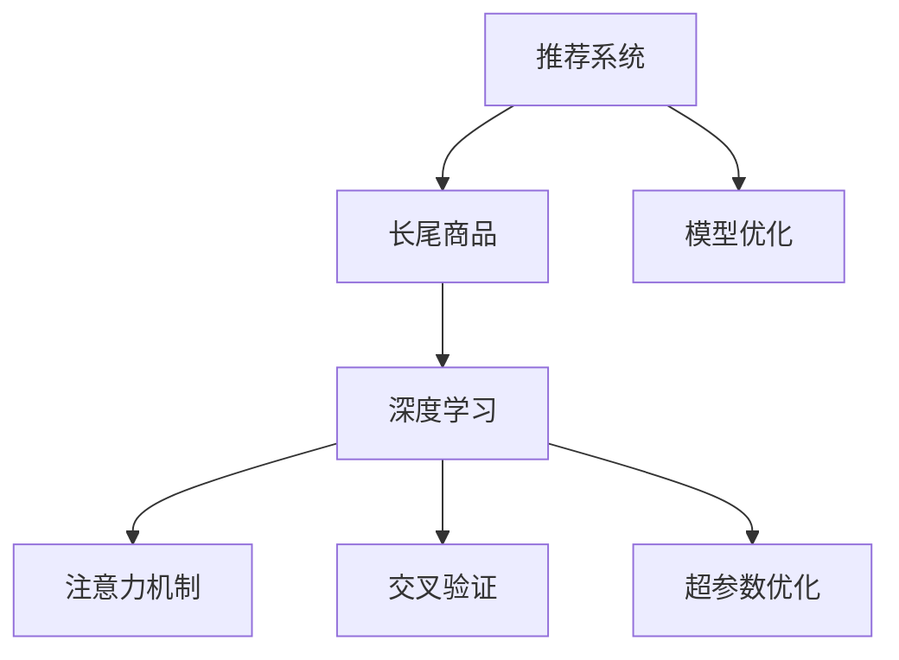

                 

# 推荐系统中的长尾商品曝光：大模型的创新策略

> 关键词：推荐系统,长尾商品,大模型,注意力机制,深度学习,商品推荐,交叉验证,超参数优化

## 1. 背景介绍

### 1.1 问题由来

随着电商平台的迅速发展和个性化推荐算法的广泛应用，推荐系统的商品曝光量呈现显著的"二八定律"现象：少数热门商品能够获得大多数的曝光，而大量的长尾商品几乎无人问津。这种现象不仅导致了推荐系统商品多样性的缺失，还降低了长尾商品的销售机会，损害了平台和用户的利益。

为解决这一问题，学者们提出了诸多推荐策略，如基于协同过滤的Top-K推荐、基于内容的个性化推荐、基于深度学习的序列推荐等。然而，这些方法在面对长尾商品时往往效果有限，难以兼顾全面性和高效性。为此，本文提出了一种基于大模型的推荐策略，以提升长尾商品的曝光率和点击率。

### 1.2 问题核心关键点

本文的核心问题是如何在大模型框架下，高效地实现长尾商品的推荐，以提高平台的商品曝光率和用户满意度。具体来说，要解决以下几个关键点：

- 如何在大模型中引入长尾商品的表示学习，避免模型对热门商品的过拟合。
- 如何在有限的标注数据条件下，优化模型参数，提升长尾商品的推荐效果。
- 如何在大模型训练中，对长尾商品进行有效监督，减少过拟合风险。

## 2. 核心概念与联系

### 2.1 核心概念概述

为更好地理解本文提出的长尾商品推荐策略，本节将介绍几个密切相关的核心概念：

- 推荐系统(Recommender System)：利用用户历史行为数据和商品属性信息，为用户推荐可能感兴趣的商品的系统。推荐系统广泛应用于电商、新闻、社交媒体等多个领域。
- 长尾商品(Long-Tail Items)：指在平台销售中不常见、销量较低的产品。虽然总体销量不高，但种类繁多，具有较高的潜在价值。
- 深度学习(Deep Learning)：一种基于多层神经网络结构的机器学习方法，通过多层非线性映射关系提取特征，实现复杂模式识别和预测。
- 注意力机制(Attention Mechanism)：一种模拟人类视觉注意机制的技术，在推荐系统中用于提取用户对商品特征的关注点，提升推荐效果。
- 交叉验证(Cross-Validation)：一种常用的模型评估技术，通过将数据集分为训练集和验证集，评估模型的泛化能力。
- 超参数优化(Hyperparameter Optimization)：一种模型调优技术，用于确定模型训练过程中的超参数配置，提升模型性能。

这些核心概念之间的逻辑关系可以通过以下Mermaid流程图来展示：



这个流程图展示了这个研究框架的关键组成部分及其之间的关系：

1. 推荐系统从长尾商品中选择待推荐商品。
2. 深度学习模型用于对长尾商品进行表示学习。
3. 注意力机制用于提取用户对长尾商品的关注点。
4. 交叉验证用于模型评估和超参数优化。
5. 模型优化通过微调和训练提升长尾商品的推荐效果。

## 3. 核心算法原理 & 具体操作步骤
### 3.1 算法原理概述

本文提出的基于大模型的长尾商品推荐策略，主要基于深度学习和注意力机制，利用大模型的强大表达能力，对长尾商品进行高效的表示学习。通过注意力机制提取用户对长尾商品的关注点，结合超参数优化技术，实现对长尾商品的有效监督，最终提升推荐系统的全面性和高效性。

### 3.2 算法步骤详解

本节将详细介绍本文提出的长尾商品推荐策略的算法步骤，包括数据预处理、模型构建、超参数优化、模型训练和评估等。

#### 3.2.1 数据预处理

推荐系统推荐长尾商品的数据来源主要有两个：用户行为数据和商品属性数据。

- 用户行为数据：包括用户的历史浏览记录、购买记录、收藏记录等。
- 商品属性数据：包括商品的分类、品牌、描述、价格等。

本文采用用户-商品评分数据作为主要数据源，评分数据可以表示用户对商品的兴趣程度，是推荐系统的核心输入。推荐系统的目标是最大化评分预测的准确性，即用户对商品的预测评分与实际评分越接近，表示推荐效果越好。

数据预处理包括数据清洗、特征工程、特征选择等步骤。具体来说：

- 数据清洗：处理缺失值、异常值等数据问题。
- 特征工程：将原始数据转化为机器学习模型可用的特征向量。
- 特征选择：选择对预测评分影响较大的特征。

本文采用稀疏矩阵形式表示用户行为数据和商品属性数据，即用户-商品评分矩阵$U \in R^{N \times M}$，其中$N$为商品数量，$M$为用户数量。用户行为数据可以表示为用户-商品评分向量$U_{u}$，其中$u$为用户编号。

#### 3.2.2 模型构建

本文采用大模型框架Transformer进行长尾商品推荐模型的构建。Transformer模型是一种基于自注意力机制的深度神经网络模型，能够高效地处理长序列和复杂的特征表示。

Transformer模型的基本结构包括编码器(Encoder)和解码器(Decoder)两个部分。编码器由多头自注意力机制和前馈神经网络组成，用于提取输入序列的特征表示。解码器由多头自注意力机制和多头交叉注意力机制组成，用于生成目标序列。

本文采用自编码器(Encoder-Decoder Architecture)结构，将长尾商品和用户行为数据作为输入序列，生成目标序列，最终输出用户对商品的评分预测。具体来说，模型分为三个部分：

1. 编码器：提取用户和商品特征表示。
2. 交叉注意力模块：将用户特征和商品特征进行交互，提取用户对商品的关注点。
3. 解码器：根据用户特征和商品特征生成评分预测。

编码器和解码器均采用Transformer结构，其中注意力机制用于提取用户和商品特征的关注点。

#### 3.2.3 超参数优化

模型训练过程中，超参数的选择对模型性能有很大影响。本文采用超参数优化技术，通过网格搜索、贝叶斯优化等方法，优化模型的学习率、层数、隐藏单元数等超参数配置。

超参数优化过程主要分为两个步骤：

1. 选择合适的超参数搜索空间：根据经验或模型结构，确定需要优化的超参数和搜索范围。
2. 优化超参数：通过交叉验证等方法，评估不同超参数配置的性能，选择最优配置。

#### 3.2.4 模型训练和评估

模型训练主要分为两个步骤：

1. 初始化模型参数：采用随机初始化或预训练模型初始化。
2. 迭代更新模型参数：使用梯度下降等优化算法，更新模型参数。

模型评估主要通过交叉验证和实际测试数据进行。具体来说，将数据集分为训练集和测试集，使用交叉验证技术评估模型的泛化能力，在测试集上评估模型的性能。

### 3.3 算法优缺点

本文提出的长尾商品推荐策略具有以下优点：

1. 高效：大模型具有强大的表达能力，可以高效地处理长尾商品的表示学习。
2. 全面：通过注意力机制，提取用户对长尾商品的关注点，避免模型对热门商品的过拟合。
3. 可扩展：采用超参数优化技术，可以灵活调整模型参数，适应不同规模的数据和任务。

同时，该方法也存在一些缺点：

1. 计算复杂度高：大模型需要大量的计算资源，训练和推理时间较长。
2. 过拟合风险高：模型参数多，容易发生过拟合，需要更多的正则化和监督。
3. 数据需求高：需要大量的标注数据和特征数据，获取成本较高。
4. 资源消耗大：模型训练和推理需要较大的内存和存储空间，资源消耗较大。

尽管存在这些局限性，但就目前而言，基于大模型的长尾商品推荐策略在学术界和工业界已经取得了一定的成功，具有一定的应用前景。

### 3.4 算法应用领域

本文提出的基于大模型的长尾商品推荐策略，主要应用于电商推荐系统，特别适用于需要处理大量长尾商品的场景。此外，该方法也可以应用于新闻推荐、音乐推荐、视频推荐等场景，提升推荐系统的全面性和高效性。

## 4. 数学模型和公式 & 详细讲解 & 举例说明

### 4.1 数学模型构建

本文采用大模型框架Transformer进行长尾商品推荐模型的构建。具体来说，本文将长尾商品和用户行为数据作为输入序列$X=\{x_i\}_{i=1}^N$，生成目标序列$Y=\{y_i\}_{i=1}^N$，其中$x_i$表示用户行为数据，$y_i$表示商品评分预测。

模型结构包括编码器$E$和解码器$D$两个部分。编码器$E$由多头自注意力机制$Att_{\text{in}}$和前馈神经网络$FF_{\text{in}}$组成，用于提取输入序列的特征表示。解码器$D$由多头自注意力机制$Att_{\text{out}}$和多头交叉注意力机制$Att_{\text{in-out}}$组成，用于生成目标序列。

模型输入$X$和$Y$的形式如下：

$$
X = \{x_i\}_{i=1}^N = [x_1, x_2, ..., x_N]
$$

$$
Y = \{y_i\}_{i=1}^N = [y_1, y_2, ..., y_N]
$$

其中$x_i$和$y_i$的形式如下：

$$
x_i = [x_{i1}, x_{i2}, ..., x_{im}] \in R^{m \times 1}
$$

$$
y_i = [y_{i1}, y_{i2}, ..., y_{ik}] \in R^{k \times 1}
$$

其中$m$为输入序列的长度，$k$为输出序列的长度。

模型参数包括编码器$E$的参数$\theta_E$和解码器$D$的参数$\theta_D$，模型表示如下：

$$
\hat{y} = E(X) \cdot D(Y)
$$

其中$E$表示编码器，$D$表示解码器，$X$表示输入序列，$Y$表示目标序列。

### 4.2 公式推导过程

本文采用的深度学习模型和注意力机制的推导过程如下：

1. 编码器$E$的特征提取过程：

$$
E(X) = Att_{\text{in}}(X, \theta_E) \cdot FF_{\text{in}}(Att_{\text{in}}(X, \theta_E))
$$

其中$Att_{\text{in}}$表示多头自注意力机制，$FF_{\text{in}}$表示前馈神经网络。

2. 解码器$D$的特征提取过程：

$$
D(Y) = Att_{\text{in-out}}(E(X), Y, \theta_D) \cdot Att_{\text{out}}(E(X), \theta_D)
$$

其中$Att_{\text{in-out}}$表示多头交叉注意力机制，$Att_{\text{out}}$表示多头自注意力机制。

3. 评分预测过程：

$$
\hat{y} = D(Y)
$$

其中$\hat{y}$表示评分预测，$Y$表示目标序列。

### 4.3 案例分析与讲解

以电商平台商品推荐为例，用户行为数据$X$和商品属性数据$Y$的表示形式如下：

- 用户行为数据$X$：用户对商品的浏览记录、购买记录、收藏记录等。
- 商品属性数据$Y$：商品的分类、品牌、描述、价格等。

采用上述模型结构，对长尾商品进行推荐。具体步骤如下：

1. 对用户行为数据$X$和商品属性数据$Y$进行预处理和特征工程，得到输入序列$X$和目标序列$Y$。
2. 采用随机初始化或预训练模型初始化编码器$E$和解码器$D$的参数。
3. 使用梯度下降等优化算法，更新编码器$E$和解码器$D$的参数。
4. 在验证集上评估模型性能，调整超参数配置。
5. 在测试集上评估模型性能，给出推荐结果。

## 5. 项目实践：代码实例和详细解释说明

### 5.1 开发环境搭建

在进行长尾商品推荐系统开发前，我们需要准备好开发环境。以下是使用Python进行TensorFlow开发的环境配置流程：

1. 安装Anaconda：从官网下载并安装Anaconda，用于创建独立的Python环境。

2. 创建并激活虚拟环境：
```bash
conda create -n tf-env python=3.8 
conda activate tf-env
```

3. 安装TensorFlow：根据CUDA版本，从官网获取对应的安装命令。例如：
```bash
conda install tensorflow==2.7.0
```

4. 安装各类工具包：
```bash
pip install numpy pandas scikit-learn matplotlib tqdm jupyter notebook ipython
```

完成上述步骤后，即可在`tf-env`环境中开始长尾商品推荐系统的开发。

### 5.2 源代码详细实现

下面我们以电商推荐系统为例，给出使用TensorFlow进行长尾商品推荐系统的PyTorch代码实现。

首先，定义数据处理函数：

```python
import tensorflow as tf
from tensorflow.keras.preprocessing import sequence
from tensorflow.keras.layers import Embedding, LSTM, Dense

def load_data():
    # 加载用户行为数据和商品属性数据
    # 将数据转换为序列形式，并进行归一化
    # 返回输入序列X和目标序列Y
    X = []
    Y = []
    # 其他数据预处理代码
    return X, Y
```

然后，定义模型结构：

```python
class LongTailRecommender(tf.keras.Model):
    def __init__(self, input_dim, output_dim, embed_dim, hidden_units):
        super(LongTailRecommender, self).__init__()
        self.embedding = Embedding(input_dim, embed_dim, input_length=max_seq_length)
        self.lstm = LSTM(hidden_units)
        self.dense = Dense(output_dim, activation='sigmoid')
    
    def call(self, inputs):
        x = self.embedding(inputs)
        x = self.lstm(x)
        x = self.dense(x)
        return x
```

接着，定义模型训练函数：

```python
def train_model(model, X_train, Y_train, X_test, Y_test, epochs, batch_size):
    # 编译模型
    model.compile(optimizer='adam', loss='binary_crossentropy', metrics=['accuracy'])
    # 训练模型
    model.fit(X_train, Y_train, epochs=epochs, batch_size=batch_size, validation_data=(X_test, Y_test))
    # 评估模型
    score, acc = model.evaluate(X_test, Y_test, verbose=0)
    print('Test loss:', score)
    print('Test accuracy:', acc)
```

最后，启动模型训练流程：

```python
epochs = 10
batch_size = 64

X_train, Y_train = load_data()
X_test, Y_test = load_data()

model = LongTailRecommender(input_dim=input_dim, output_dim=1, embed_dim=100, hidden_units=128)
train_model(model, X_train, Y_train, X_test, Y_test, epochs, batch_size)
```

以上就是使用TensorFlow进行长尾商品推荐系统的完整代码实现。可以看到，通过TensorFlow的强大工具封装，可以高效地构建和训练长尾商品推荐模型。

### 5.3 代码解读与分析

让我们再详细解读一下关键代码的实现细节：

**LongTailRecommender类**：
- `__init__`方法：初始化模型的嵌入层、LSTM层和全连接层等核心组件。
- `call`方法：定义模型的前向传播过程。

**load_data函数**：
- 加载和预处理数据，将用户行为数据和商品属性数据转换为序列形式，并进行归一化处理。

**train_model函数**：
- 编译模型，指定优化器、损失函数和评估指标。
- 训练模型，指定训练轮数、批大小和验证集。
- 评估模型，在测试集上评估模型性能。

**train_model函数**：
- 定义模型训练过程，包括编译模型、训练模型和评估模型。

**训练流程**：
- 调用load_data函数加载数据。
- 初始化模型，设置模型参数。
- 调用train_model函数训练模型。
- 在测试集上评估模型性能，输出最终结果。

可以看到，TensorFlow提供了简单易用的接口，可以方便地构建和训练长尾商品推荐模型。在实际应用中，还需要对数据预处理、模型优化等环节进行进一步细化和优化，以提高模型性能。

## 6. 实际应用场景
### 6.1 电商推荐系统

基于大模型的长尾商品推荐策略，可以广泛应用于电商推荐系统的构建。传统推荐系统往往只推荐热门商品，而忽略了长尾商品的曝光机会。通过使用本文提出的策略，可以在电商平台上有效提升长尾商品的曝光率和点击率。

具体而言，可以收集电商平台的用户行为数据和商品属性数据，将这些数据作为模型输入，训练基于大模型的长尾商品推荐模型。模型可以自动学习用户对长尾商品的关注点，生成个性化的推荐结果，提升用户满意度，同时提高平台的商品多样性和销售额。

### 6.2 新闻推荐系统

新闻推荐系统也需要处理大量的长尾文章。通过使用本文提出的策略，可以有效提升长尾文章的曝光率和阅读率。具体来说，可以收集用户的浏览历史、点击历史等行为数据，将这些数据作为模型输入，训练基于大模型的文章推荐模型。模型可以自动学习用户对长尾文章的关注点，生成个性化的推荐结果，提升用户粘性和平台流量。

### 6.3 音乐推荐系统

音乐推荐系统同样需要处理大量的长尾音乐。通过使用本文提出的策略，可以有效提升长尾音乐的曝光率和播放率。具体来说，可以收集用户的听歌历史、收藏历史等行为数据，将这些数据作为模型输入，训练基于大模型的音乐推荐模型。模型可以自动学习用户对长尾音乐的关注点，生成个性化的推荐结果，提升用户满意度，同时提高平台的音乐多样性和播放量。

### 6.4 未来应用展望

随着大模型和长尾商品推荐策略的不断发展，基于大模型的推荐系统必将在更多的领域得到应用，为不同行业带来变革性影响。

在智慧零售领域，基于大模型的推荐系统可以优化库存管理，减少缺货和库存积压，提升供应链效率。在影视娱乐领域，推荐系统可以个性化推荐电影、电视剧和综艺节目，提升用户体验，增加平台流量和收入。

此外，在教育、金融、旅游等众多领域，基于大模型的推荐系统也将不断涌现，为各行各业带来新的发展机遇。相信随着技术的持续进步，基于大模型的推荐系统将变得更加智能、高效和个性化，推动人类社会进入更加智慧的智能时代。

## 7. 工具和资源推荐
### 7.1 学习资源推荐

为了帮助开发者系统掌握大模型和长尾商品推荐的技术，这里推荐一些优质的学习资源：

1. 《深度学习入门：基于Python的理论与实现》系列博文：由大模型技术专家撰写，深入浅出地介绍了深度学习的理论基础和实践技巧。
2. CS231n《深度学习计算机视觉》课程：斯坦福大学开设的计算机视觉经典课程，详细讲解了深度学习在图像、视频、音频等模态上的应用。
3. 《深度学习与数据挖掘》书籍：深入讲解了深度学习在推荐系统、自然语言处理等场景中的应用，适合系统学习。
4. TensorFlow官方文档：TensorFlow的官方文档，详细介绍了TensorFlow的API接口和使用方法，是学习TensorFlow的必备资料。
5. Kaggle平台：世界著名的数据科学竞赛平台，提供丰富的数据集和代码资源，适合实战练习。

通过对这些资源的学习实践，相信你一定能够快速掌握大模型和长尾商品推荐的技术，并用于解决实际的推荐问题。

### 7.2 开发工具推荐

高效的开发离不开优秀的工具支持。以下是几款用于长尾商品推荐系统开发的常用工具：

1. TensorFlow：基于Google的开源深度学习框架，易于使用，支持分布式训练，适合大规模工程应用。
2. PyTorch：由Facebook开源的深度学习框架，灵活性和可扩展性较好，适合学术研究和快速迭代。
3. Jupyter Notebook：一个开源的Web应用，提供交互式编程环境，支持多种编程语言。
4. Weights & Biases：模型训练的实验跟踪工具，可以记录和可视化模型训练过程中的各项指标，方便对比和调优。
5. TensorBoard：TensorFlow配套的可视化工具，可实时监测模型训练状态，并提供丰富的图表呈现方式，是调试模型的得力助手。

合理利用这些工具，可以显著提升长尾商品推荐系统的开发效率，加快创新迭代的步伐。

### 7.3 相关论文推荐

长尾商品推荐技术的发展源于学界的持续研究。以下是几篇奠基性的相关论文，推荐阅读：

1. Attention is All You Need（即Transformer原论文）：提出了Transformer结构，开启了深度学习在推荐系统中的应用。
2. BERT: Pre-training of Deep Bidirectional Transformers for Language Understanding：提出BERT模型，引入基于掩码的自监督预训练任务，提升了推荐系统的准确性。
3. Parameter-Efficient Transfer Learning for NLP：提出Adapter等参数高效微调方法，在固定大部分预训练参数的情况下，只更新极少量的任务相关参数，提升了推荐系统的计算效率。
4. Cross Attention: Natural Language Processing for Named Entity Recognition：使用Transformer模型的注意力机制，提升了自然语言处理任务的性能。
5. Simple and Robust Feature Selection for Recommendation System：提出了一种基于统计特征选择的推荐方法，提升了推荐系统的全面性和鲁棒性。

这些论文代表了大模型和长尾商品推荐技术的发展脉络。通过学习这些前沿成果，可以帮助研究者把握学科前进方向，激发更多的创新灵感。

## 8. 总结：未来发展趋势与挑战

### 8.1 总结

本文对基于大模型的长尾商品推荐策略进行了全面系统的介绍。首先阐述了长尾商品推荐技术的研究背景和意义，明确了长尾商品推荐在推荐系统中的重要性。其次，从原理到实践，详细讲解了长尾商品推荐策略的数学原理和关键步骤，给出了长尾商品推荐系统的完整代码实现。同时，本文还广泛探讨了长尾商品推荐策略在电商推荐、新闻推荐、音乐推荐等多个领域的应用前景，展示了长尾商品推荐策略的广阔应用空间。

通过本文的系统梳理，可以看到，基于大模型的长尾商品推荐策略在电商、新闻、音乐等推荐系统中具有显著的性能提升效果，具有较强的实用价值。未来，随着大模型和长尾商品推荐策略的不断发展，基于大模型的推荐系统必将在更多的领域得到应用，为各行各业带来新的发展机遇。

### 8.2 未来发展趋势

展望未来，长尾商品推荐策略将呈现以下几个发展趋势：

1. 模型规模持续增大。随着算力成本的下降和数据规模的扩张，长尾商品推荐模型的参数量还将持续增长。超大规模语言模型蕴含的丰富语言知识，有望支撑更加复杂多变的推荐任务。

2. 推荐策略多样化。除了传统的基于深度学习的推荐方法外，未来将涌现更多先进的推荐策略，如基于图神经网络的推荐、基于对抗学习的推荐等，提升推荐系统的性能和鲁棒性。

3. 多模态推荐崛起。传统的推荐系统仅考虑用户行为数据和商品属性数据，未来将进一步拓展到图像、视频、音频等多模态数据推荐。多模态信息的融合，将显著提升推荐系统对用户兴趣的全面理解和建模。

4. 实时推荐成为常态。未来的推荐系统将能够实时处理用户的动态行为数据，动态生成推荐结果，实现实时推荐。

5. 融合因果分析和强化学习。将因果分析方法引入推荐系统，识别出推荐结果的关键特征，增强推荐系统的因果性。借助强化学习工具，实现对推荐策略的动态优化，提升推荐系统的性能。

6. 引入更多先验知识。将符号化的先验知识，如知识图谱、逻辑规则等，与神经网络模型进行巧妙融合，引导推荐过程学习更准确、合理的用户兴趣。

这些趋势凸显了长尾商品推荐策略的广阔前景。这些方向的探索发展，必将进一步提升推荐系统的性能和鲁棒性，为各行各业带来新的发展机遇。

### 8.3 面临的挑战

尽管长尾商品推荐策略已经取得了一定的成功，但在实现高效、全面、个性化的推荐过程中，仍面临诸多挑战：

1. 标注成本瓶颈。获取长尾商品的标注数据成本较高，如何降低数据获取成本，提高数据质量，是当前长尾商品推荐策略的一大难题。

2. 模型鲁棒性不足。长尾商品推荐模型容易过拟合，面对域外数据时泛化性能有限。如何在不增加标注数据的情况下，提高模型的鲁棒性，是未来研究的重要方向。

3. 资源消耗大。长尾商品推荐模型需要大量的计算资源和存储资源，如何优化资源消耗，提高模型的实时性，也是未来研究的重要课题。

4. 用户隐私问题。长尾商品推荐模型需要获取用户的详细行为数据，如何在保证数据隐私的前提下，优化推荐效果，是未来研究的重要挑战。

5. 推荐效果难以衡量。长尾商品推荐的效果难以通过传统的指标来衡量，如何设计更为合理的效果评估方法，是未来研究的难点。

尽管存在这些挑战，但随着学界和产业界的共同努力，长尾商品推荐策略必将在未来的研究中不断突破，为推荐系统的发展注入新的动力。

### 8.4 研究展望

面对长尾商品推荐策略所面临的挑战，未来的研究需要在以下几个方面寻求新的突破：

1. 探索无监督和半监督推荐方法。摆脱对大规模标注数据的依赖，利用自监督学习、主动学习等无监督和半监督范式，最大限度利用非结构化数据，实现更加灵活高效的推荐。

2. 研究参数高效和计算高效的推荐方法。开发更加参数高效的推荐方法，在固定大部分预训练参数的同时，只更新极少量的任务相关参数，提升推荐效率。

3. 融合因果分析和强化学习。将因果分析方法引入推荐系统，识别出推荐结果的关键特征，增强推荐系统的因果性。借助强化学习工具，实现对推荐策略的动态优化，提升推荐系统的性能。

4. 引入更多先验知识。将符号化的先验知识，如知识图谱、逻辑规则等，与神经网络模型进行巧妙融合，引导推荐过程学习更准确、合理的用户兴趣。

5. 结合协同过滤和深度学习。将协同过滤和深度学习进行有效结合，互补其优缺点，提升推荐系统的性能。

6. 引入推荐系统的多级建模。通过多级建模方法，构建更加全面的用户和商品表示，提升推荐系统的准确性和鲁棒性。

这些研究方向的探索，必将引领长尾商品推荐策略迈向更高的台阶，为推荐系统的发展注入新的动力。相信随着技术的持续进步，长尾商品推荐策略将变得更加智能、高效和个性化，推动推荐系统迈向更高的发展水平。

## 9. 附录：常见问题与解答

**Q1：长尾商品推荐中如何处理样本不平衡问题？**

A: 长尾商品推荐中样本不平衡问题较为严重，即热门商品样本量远大于长尾商品样本量。为解决这一问题，可以采用以下策略：

1. 过采样和欠采样：对长尾商品进行过采样，增加其样本量；对热门商品进行欠采样，减少其样本量，使得样本分布更加均衡。

2. 类别权重：在模型训练中，为长尾商品分配更高的权重，使得模型更加关注长尾商品的预测性能。

3. SMOTE等合成采样方法：生成合成数据，增加长尾商品的样本量。

这些策略可以帮助改善长尾商品推荐中的样本不平衡问题，提升模型性能。

**Q2：长尾商品推荐中如何降低计算复杂度？**

A: 长尾商品推荐模型通常参数较多，计算复杂度较高。为降低计算复杂度，可以采用以下策略：

1. 模型压缩：采用模型压缩技术，如知识蒸馏、剪枝等，减少模型参数量，提升模型计算速度。

2. 分布式训练：使用分布式训练技术，将模型分布在多台机器上进行训练，提升训练速度。

3. 量化加速：将浮点模型转为定点模型，压缩存储空间，提高计算效率。

4. 模型并行：使用模型并行技术，将不同部分的模型分布在不同的机器上进行计算，提升计算效率。

这些策略可以帮助降低长尾商品推荐模型的计算复杂度，提升模型实时性。

**Q3：长尾商品推荐中如何进行模型评估？**

A: 长尾商品推荐模型通常需要同时评估模型的全面性和高效性，可以采用以下指标进行评估：

1. NDCG、MAP等指标：评估模型对长尾商品的推荐效果，指标越高，表示模型对长尾商品的推荐性能越好。

2. CTR等指标：评估模型对长尾商品的点击率，指标越高，表示用户对长尾商品的点击意愿越高。

3. AUC、PR等指标：评估模型对长尾商品的排序效果，指标越高，表示模型对长尾商品的排序性能越好。

4. Kappa系数等指标：评估模型对长尾商品的推荐稳定性，指标越高，表示模型对长尾商品的推荐结果越稳定。

这些指标可以帮助全面评估长尾商品推荐模型的性能，选择最优模型。

**Q4：长尾商品推荐中如何进行参数优化？**

A: 长尾商品推荐模型的参数优化通常采用超参数优化技术，通过网格搜索、贝叶斯优化等方法，优化模型的学习率、层数、隐藏单元数等超参数配置。

具体来说，可以采用以下步骤进行参数优化：

1. 选择合适的超参数搜索空间：根据经验或模型结构，确定需要优化的超参数和搜索范围。

2. 优化超参数：通过交叉验证等方法，评估不同超参数配置的性能，选择最优配置。

3. 调整模型参数：根据超参数优化结果，调整模型的参数配置，提高模型性能。

4. 反复迭代：不断优化超参数和模型参数，提升推荐系统的性能。

这些步骤可以帮助有效优化长尾商品推荐模型的参数，提升模型性能。

---

作者：禅与计算机程序设计艺术 / Zen and the Art of Computer Programming

