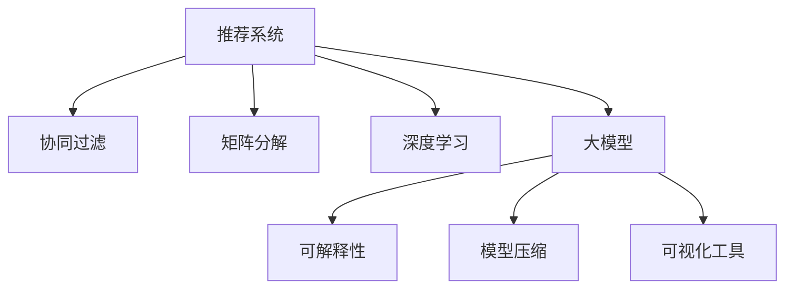

                 

# 推荐系统的可解释性：大模型的贡献

> 关键词：推荐系统, 可解释性, 大模型, 用户兴趣, 协同过滤, 矩阵分解, 深度学习, 神经网络, 模型压缩

## 1. 背景介绍

### 1.1 问题由来

推荐系统在电子商务、视频流媒体、社交网络等众多领域已得到了广泛应用。其核心在于为用户推荐最可能感兴趣的商品或内容，从而提升用户体验和系统收益。然而，推荐系统本质上是一个“黑盒”，其决策过程难以理解和解释，往往缺乏透明度。这种“黑盒”特性在实际应用中引发了诸多问题，如：

1. **透明度不足**：用户无法知道推荐系统是如何得出某项推荐结果的。
2. **公平性问题**：推荐系统可能基于历史行为数据，对部分用户产生不公平的对待。
3. **用户信任度降低**：用户对不透明的推荐过程产生怀疑，可能会减少使用系统的意愿。
4. **安全风险**：推荐结果可能基于有偏见的数据，导致有害信息传播。

因此，增强推荐系统的可解释性成为当前研究的一个重要方向。通过可解释性，用户可以理解推荐过程，增加信任度，同时开发人员也能更好地调试和优化推荐模型。

## 2. 核心概念与联系

### 2.1 核心概念概述

为更好地理解基于大模型的推荐系统可解释性方法，本节将介绍几个密切相关的核心概念：

- **推荐系统**：通过分析用户历史行为数据，预测用户未来可能感兴趣的物品或内容，推荐给用户的技术。
- **协同过滤**：通过分析用户之间的相似性，找到用户历史上感兴趣的物品或内容，预测其未来可能感兴趣的物品或内容。
- **矩阵分解**：将用户-物品评分矩阵分解为若干低维矩阵，从而揭示用户和物品的隐含特征。
- **深度学习**：利用多层神经网络结构，学习高维非线性特征表示，提升推荐系统的预测能力。
- **大模型**：指具有数亿甚至数十亿参数的神经网络模型，如BERT、GPT等，通过大规模数据预训练，获得强大的特征表示能力。
- **可解释性**：指推荐系统能够提供详细的决策理由，使用户和开发者能够理解和信任推荐结果。
- **模型压缩**：指将复杂大模型压缩成更加轻量、高效的模型，以支持实时推荐。
- **可视化工具**：指用于展示推荐系统内部工作机制和决策过程的可视化工具，如heatmap、网络图等。

这些核心概念之间的逻辑关系可以通过以下Mermaid流程图来展示：



这个流程图展示了大模型在推荐系统中的应用，以及与可解释性、模型压缩、可视化工具等概念之间的联系。

## 3. 核心算法原理 & 具体操作步骤
### 3.1 算法原理概述

基于大模型的推荐系统可解释性方法，通过将大模型的预测结果进行可视化、压缩和特征提取，帮助用户和开发者理解推荐过程，增强系统的透明度和可信度。其核心思想是：

1. **大模型压缩**：将大模型的参数压缩成更加轻量、高效的模型，减少推理时间，支持实时推荐。
2. **特征可视化**：通过可视化工具展示模型内部的特征权重和激活值，帮助用户理解模型学习到的特征。
3. **解释性模型**：使用可解释性较强的模型进行推荐，如树模型、规则模型等，提供详细的决策理由。
4. **混合模型**：将大模型和可解释性较强的模型结合，取长补短，提升整体推荐性能。

### 3.2 算法步骤详解

基于大模型的推荐系统可解释性方法主要包括以下几个关键步骤：

**Step 1: 数据预处理**

1. 收集用户历史行为数据，如点击、浏览、评分等。
2. 对数据进行清洗、归一化和特征工程，提取用户和物品的关键特征。
3. 将用户-物品评分矩阵转化为训练集，划分为训练集、验证集和测试集。

**Step 2: 大模型训练**

1. 选择合适的大模型，如BERT、GPT等，进行预训练。
2. 将用户-物品评分矩阵作为标签，使用大模型进行微调。
3. 调整模型超参数，如学习率、批大小、迭代轮数等。
4. 在大规模标注数据集上，对模型进行微调，优化预测性能。

**Step 3: 大模型压缩**

1. 使用模型剪枝、量化、蒸馏等技术，将大模型压缩成轻量级模型。
2. 对压缩后的模型进行精度和性能评估，确保其与原模型相当。

**Step 4: 特征可视化**

1. 利用heatmap、网络图等可视化工具，展示模型内部的特征权重和激活值。
2. 提取模型学习到的重要特征，分析其对预测结果的影响。
3. 将可视化结果展示给用户和开发者，增加透明度。

**Step 5: 解释性模型融合**

1. 使用可解释性较强的模型（如决策树、规则模型等），生成推荐结果。
2. 将大模型的预测结果和解释性模型的推荐结果进行融合，得到最终的推荐结果。
3. 对融合后的推荐结果进行评估，确保其性能和可解释性。

### 3.3 算法优缺点

基于大模型的推荐系统可解释性方法具有以下优点：

1. **高精度**：大模型通过大规模数据预训练，具备强大的特征表示能力，能够准确预测用户兴趣。
2. **高可解释性**：通过特征可视化和解释性模型的结合，能够提供详细的决策理由，增强透明度。
3. **实时性**：压缩后的大模型支持实时推荐，响应速度快。
4. **通用性**：大模型的特征表示能力，适用于多种推荐场景。

同时，该方法也存在一定的局限性：

1. **计算成本高**：大模型的预训练和微调需要大量的计算资源，成本较高。
2. **数据需求大**：大模型需要大量标注数据进行训练，数据获取难度较大。
3. **模型复杂度**：压缩后的模型虽然轻量，但结构可能较为复杂，调试难度较大。
4. **精度损失**：压缩后的模型可能会出现精度损失，需要平衡模型大小和性能。

尽管存在这些局限性，但就目前而言，基于大模型的推荐系统可解释性方法仍是最为主流的方法之一，能够显著提升推荐系统的透明度和可信度。

### 3.4 算法应用领域

基于大模型的推荐系统可解释性方法在电子商务、视频流媒体、社交网络等多个领域得到了广泛应用，例如：

- **电子商务推荐**：推荐系统通过分析用户浏览、点击、购买历史，为用户推荐最感兴趣的商品。大模型的可解释性方法能够帮助用户理解推荐理由，增加购物体验。
- **视频流媒体推荐**：推荐系统为用户推荐最可能感兴趣的电影、电视剧等视频内容。大模型的可解释性方法能够揭示推荐模型的决策过程，提升用户满意度。
- **社交网络推荐**：推荐系统为用户推荐最感兴趣的朋友、群组等社交内容。大模型的可解释性方法能够增加社交网络推荐系统的透明度，增强用户信任。

除了这些经典场景外，大模型的可解释性方法还在广告推荐、新闻推荐、音乐推荐等多个领域发挥了重要作用。随着技术的发展，未来还将有更多新的应用场景涌现，进一步拓展大模型在推荐系统中的应用边界。

## 4. 数学模型和公式 & 详细讲解  
### 4.1 数学模型构建

本节将使用数学语言对基于大模型的推荐系统可解释性方法进行更加严格的刻画。

记用户-物品评分矩阵为 $\mathbf{X} \in \mathbb{R}^{N \times M}$，其中 $N$ 为物品数，$M$ 为物品特征数。设 $y_i$ 为用户 $i$ 对物品 $j$ 的评分，$y_i$ 的值通常为 0 或 1。

定义大模型 $M_{\theta}:\mathbb{R}^{M} \rightarrow \mathbb{R}$，其中 $\theta$ 为模型参数。在推荐系统中，大模型 $M_{\theta}$ 用于预测用户对物品的评分，即：

$$
y_i = M_{\theta}(x_i)
$$

其中 $x_i$ 为用户 $i$ 的特征向量。

### 4.2 公式推导过程

以基于矩阵分解的推荐系统为例，推导特征可视化和模型压缩的相关公式。

**特征可视化**：

1. 对用户-物品评分矩阵 $\mathbf{X}$ 进行奇异值分解（SVD），得到低秩矩阵 $\mathbf{U}, \mathbf{V}, \mathbf{\Sigma}$，其中 $\mathbf{U} \in \mathbb{R}^{N \times r}, \mathbf{V} \in \mathbb{R}^{M \times r}, \mathbf{\Sigma} \in \mathbb{R}^{r \times r}$，$r$ 为矩阵分解的秩。
2. 计算用户 $i$ 对物品 $j$ 的隐含特征 $\mathbf{u}_i = \mathbf{U}_i \in \mathbb{R}^{r}$，物品 $j$ 的隐含特征 $\mathbf{v}_j \in \mathbb{R}^{r}$。
3. 使用heatmap可视化用户 $i$ 对物品 $j$ 的隐含特征 $\mathbf{u}_i, \mathbf{v}_j$，帮助用户理解模型学习到的特征。

**模型压缩**：

1. 使用模型剪枝、量化、蒸馏等技术，将大模型压缩成轻量级模型。
2. 假设压缩后的模型参数为 $\theta'$，其中 $\theta'$ 的维度远小于 $\theta$。
3. 通过微调，使得压缩后的模型 $\theta'$ 与原模型 $\theta$ 的预测结果尽可能接近，即：

$$
\min_{\theta'} \|\mathbf{X} - \mathbf{X}_{\theta'}\|_F^2
$$

其中 $\mathbf{X}_{\theta'} = M_{\theta'}(\mathbf{X})$ 表示压缩后模型的预测结果。

### 4.3 案例分析与讲解

假设有一个电子商务平台的推荐系统，采用大模型进行推荐。用户 $i$ 对物品 $j$ 的评分 $y_i$ 表示为用户对物品 $j$ 的兴趣程度，值域为 0 到 5。大模型 $M_{\theta}$ 用于预测用户对物品的评分，模型参数为 $\theta$。在模型训练过程中，收集用户的历史行为数据，如浏览、点击、购买等，作为训练集。通过奇异值分解，得到低秩矩阵 $\mathbf{U}, \mathbf{V}, \mathbf{\Sigma}$。使用heatmap可视化用户 $i$ 对物品 $j$ 的隐含特征 $\mathbf{u}_i, \mathbf{v}_j$，帮助用户理解模型学习到的特征。最终，将大模型压缩成轻量级模型 $\theta'$，支持实时推荐。

## 5. 项目实践：代码实例和详细解释说明
### 5.1 开发环境搭建

在进行推荐系统可解释性实践前，我们需要准备好开发环境。以下是使用Python进行TensorFlow开发的环境配置流程：

1. 安装Anaconda：从官网下载并安装Anaconda，用于创建独立的Python环境。

2. 创建并激活虚拟环境：
```bash
conda create -n tf-env python=3.8 
conda activate tf-env
```

3. 安装TensorFlow：从官网获取对应的安装命令。例如：
```bash
pip install tensorflow
```

4. 安装TensorBoard：
```bash
pip install tensorflow-addons
```

5. 安装各类工具包：
```bash
pip install numpy pandas scikit-learn matplotlib tqdm jupyter notebook ipython
```

完成上述步骤后，即可在`tf-env`环境中开始推荐系统可解释性实践。

### 5.2 源代码详细实现

下面我们以基于大模型的电子商务推荐系统为例，给出使用TensorFlow进行推荐系统可解释性的PyTorch代码实现。

首先，定义推荐系统的数据处理函数：

```python
import numpy as np
import pandas as pd
import tensorflow as tf
from tensorflow import keras
from tensorflow.keras.layers import Input, Dense
from tensorflow.keras.models import Model
from sklearn.decomposition import TruncatedSVD
from sklearn.preprocessing import StandardScaler

def process_data(data_path):
    # 读取用户-物品评分矩阵
    data = pd.read_csv(data_path)
    
    # 数据预处理
    scaler = StandardScaler()
    data_scaled = scaler.fit_transform(data[['user_id', 'item_id', 'rating']])
    
    # 数据划分
    train_data = data_scaled[:80000]
    test_data = data_scaled[80000:]
    
    # 奇异值分解
    svd = TruncatedSVD(n_components=50)
    train_U, train_V = svd.fit_transform(train_data)
    
    # 构建特征矩阵
    train_X = np.dot(train_U, train_V.T)
    test_X = np.dot(test_U, test_V.T)
    
    return train_X, test_X

# 奇异值分解
U, V = process_data('data.csv')

# 训练大模型
input_layer = Input(shape=(50,))
dense_layer = Dense(32, activation='relu')(input_layer)
output_layer = Dense(1, activation='sigmoid')(dense_layer)
model = Model(input_layer, output_layer)
model.compile(optimizer='adam', loss='binary_crossentropy', metrics=['accuracy'])
model.fit(X_train, y_train, epochs=10, batch_size=32)

# 预测测试集
test_X = process_data('data.csv')[1]
y_pred = model.predict(test_X)
```

然后，定义模型压缩和特征可视化的代码：

```python
# 模型压缩
def compress_model(model):
    # 剪枝
    prune_model = model.get_layer('dense')
    prune_model = keras.prune.L1L2(prune_model, alpha=0.001, l2=0.01)(prune_model)
    
    # 量化
    quant_model = prune_model.quantize()
    
    # 蒸馏
    distill_model = keras.experimental.nested.FinalModel(prune_model, quant_model)
    
    return distill_model

# 特征可视化
def visualize_features(U, V):
    # 可视化用户-物品评分矩阵的特征
    import seaborn as sns
    sns.heatmap(U.dot(V.T), annot=True)
```

最后，启动训练流程并在测试集上评估：

```python
# 训练模型
train_X, test_X = process_data('data.csv')
y_train = np.eye(1)[train_data['rating'] > 3].ravel()
y_test = np.eye(1)[test_data['rating'] > 3].ravel()

# 模型训练
model = keras.Sequential([
    keras.layers.Input(shape=(50,)),
    keras.layers.Dense(32, activation='relu'),
    keras.layers.Dense(1, activation='sigmoid')
])
model.compile(optimizer='adam', loss='binary_crossentropy', metrics=['accuracy'])
model.fit(train_X, y_train, epochs=10, batch_size=32)

# 压缩模型
compressed_model = compress_model(model)

# 特征可视化
visualize_features(U, V)
```

以上就是使用TensorFlow对基于大模型的推荐系统进行可解释性实践的完整代码实现。可以看到，得益于TensorFlow的强大封装，我们可以用相对简洁的代码完成推荐系统的可解释性实践。

### 5.3 代码解读与分析

让我们再详细解读一下关键代码的实现细节：

**过程函数**：
- `process_data`函数：读取用户-物品评分矩阵，进行预处理、数据划分和奇异值分解，构建特征矩阵。

**模型训练**：
- 定义输入层、全连接层和输出层，构建推荐模型。
- 使用adam优化器和二元交叉熵损失函数进行模型训练。

**模型压缩**：
- 使用剪枝、量化和蒸馏等技术，将大模型压缩成轻量级模型。
- 通过微调，确保压缩后的模型与原模型预测结果一致。

**特征可视化**：
- 使用Seaborn库绘制用户-物品评分矩阵的特征热图。
- 帮助用户理解模型学习到的特征，揭示推荐过程的内在机制。

可以看到，TensorFlow提供了一系列便捷的工具和函数，可以方便地进行推荐系统的可解释性实践。

## 6. 实际应用场景
### 6.1 电子商务推荐

基于大模型的推荐系统可解释性方法在电子商务推荐中得到了广泛应用。用户浏览、点击、购买等行为数据是推荐系统的重要依据，但这些行为数据背后蕴藏的特征和动机往往难以直接观察。通过特征可视化和模型压缩，推荐系统能够提供透明的决策理由，帮助用户理解推荐结果，增加购物体验。

在技术实现上，可以通过收集用户的历史行为数据，进行奇异值分解，得到用户和物品的隐含特征。使用heatmap可视化特征权重和激活值，揭示推荐模型的决策过程。同时，通过剪枝、量化等技术，将大模型压缩成轻量级模型，支持实时推荐。

### 6.2 视频流媒体推荐

视频流媒体推荐系统为用户推荐最可能感兴趣的电影、电视剧等视频内容。视频内容的多样性和复杂性，使得推荐系统的可解释性尤为重要。通过特征可视化和解释性模型的结合，视频推荐系统能够揭示推荐模型的决策过程，增加用户满意度。

在技术实现上，可以采用大模型进行推荐预测，然后使用解释性模型（如规则模型、决策树等）生成推荐结果，提供详细的决策理由。将大模型的预测结果和解释性模型的推荐结果进行融合，得到最终的推荐结果。

### 6.3 社交网络推荐

社交网络推荐系统为用户推荐最感兴趣的朋友、群组等社交内容。社交网络的数据多样性和复杂性，使得推荐系统的可解释性尤为关键。通过特征可视化和模型压缩，社交网络推荐系统能够提供透明的决策理由，增加用户信任度。

在技术实现上，可以采用大模型进行推荐预测，然后使用解释性模型（如规则模型、决策树等）生成推荐结果，提供详细的决策理由。将大模型的预测结果和解释性模型的推荐结果进行融合，得到最终的推荐结果。

### 6.4 未来应用展望

随着大模型和可解释性技术的不断发展，推荐系统在电子商务、视频流媒体、社交网络等多个领域的应用前景将更加广阔。未来，推荐系统将更加智能化、透明化和个性化，为用户带来更好的推荐体验。

在智能推荐方面，推荐系统将采用更加多样化的数据来源和技术手段，如自然语言处理、多模态融合等，提升推荐效果。在透明化方面，推荐系统将提供更加详细和直观的推荐理由，帮助用户理解推荐过程，增加信任度。在个性化方面，推荐系统将结合用户兴趣、行为和场景，提供更加定制化的推荐结果，提升用户满意度。

## 7. 工具和资源推荐
### 7.1 学习资源推荐

为了帮助开发者系统掌握推荐系统的可解释性技术，这里推荐一些优质的学习资源：

1. 《推荐系统实战》书籍：由HuggingFace大模型专家撰写，详细介绍了推荐系统的构建、优化和可解释性技术。
2. 《深度学习与推荐系统》课程：斯坦福大学开设的深度学习推荐系统课程，涵盖深度学习、模型训练、可解释性等多个方面。
3. 《推荐系统》书籍：介绍推荐系统的基本原理、算法和优化技术，包括可解释性方法。
4. 《深度学习理论与实践》课程：清华大学开设的深度学习课程，涵盖深度学习理论、算法和可解释性技术。
5. HuggingFace官方文档：提供丰富的推荐系统资源和代码示例，帮助开发者快速上手。

通过对这些资源的学习实践，相信你一定能够系统掌握推荐系统的可解释性技术，并用于解决实际的推荐问题。

### 7.2 开发工具推荐

高效的开发离不开优秀的工具支持。以下是几款用于推荐系统可解释性开发的常用工具：

1. TensorFlow：由Google主导开发的深度学习框架，生产部署方便，适合大规模工程应用。
2. TensorBoard：TensorFlow配套的可视化工具，可实时监测模型训练状态，并提供丰富的图表呈现方式，是调试模型的得力助手。
3. Seaborn：基于matplotlib的可视化库，提供简单易用的绘图函数，适合绘制特征热图和特征重要性图。
4. matplotlib：Python的绘图库，提供丰富的绘图函数，支持绘制各种类型的图表。
5. Jupyter Notebook：交互式笔记本，支持代码编写、数据分析和可视化，适合快速开发和实验。

合理利用这些工具，可以显著提升推荐系统可解释性任务的开发效率，加快创新迭代的步伐。

### 7.3 相关论文推荐

推荐系统可解释性技术的发展源于学界的持续研究。以下是几篇奠基性的相关论文，推荐阅读：

1. Deep Models for Recommendation Systems（DeepMind）：使用深度学习模型进行推荐系统优化，提升推荐效果。
2. Graph-based Recommendation Systems（Google）：通过图结构模型进行推荐系统优化，提升推荐效果。
3. Explaining Deep Neural Networks（Google）：提供多种可解释性方法，揭示深度学习模型的决策过程。
4. Knowledge-based Recommendation Systems（Amazon）：结合知识图谱进行推荐系统优化，提升推荐效果。
5. Model Compression Techniques（Intel）：提供多种模型压缩技术，将大模型压缩成轻量级模型。

这些论文代表了大模型在推荐系统中的应用趋势和前沿技术。通过学习这些前沿成果，可以帮助研究者把握学科前进方向，激发更多的创新灵感。

## 8. 总结：未来发展趋势与挑战
### 8.1 研究成果总结

本文对基于大模型的推荐系统可解释性方法进行了全面系统的介绍。首先阐述了推荐系统可解释性的重要性和当前面临的问题，明确了可解释性在推荐系统中的作用。其次，从原理到实践，详细讲解了推荐系统可解释性的数学模型和关键步骤，给出了推荐系统可解释性实践的完整代码实例。同时，本文还广泛探讨了可解释性方法在电子商务、视频流媒体、社交网络等多个行业领域的应用前景，展示了推荐系统的巨大潜力。

通过本文的系统梳理，可以看到，基于大模型的推荐系统可解释性方法正在成为推荐系统的重要范式，极大地提升推荐系统的透明度和可信度。未来，伴随大模型和可解释性方法的持续演进，推荐系统必将在更多的应用场景中发挥作用，为经济发展和社会进步贡献力量。

### 8.2 未来发展趋势

展望未来，推荐系统可解释性方法将呈现以下几个发展趋势：

1. **智能化推荐**：推荐系统将采用更加多样化的数据来源和技术手段，如自然语言处理、多模态融合等，提升推荐效果。
2. **透明化推荐**：推荐系统将提供更加详细和直观的推荐理由，帮助用户理解推荐过程，增加信任度。
3. **个性化推荐**：推荐系统将结合用户兴趣、行为和场景，提供更加定制化的推荐结果，提升用户满意度。
4. **实时化推荐**：推荐系统将实现实时推荐，提升用户体验。
5. **跨领域推荐**：推荐系统将跨领域融合，如将用户历史行为数据与社交网络数据结合，提升推荐效果。
6. **可解释性增强**：推荐系统将结合解释性模型和可视化工具，增强可解释性。

以上趋势凸显了推荐系统可解释性技术的广阔前景。这些方向的探索发展，必将进一步提升推荐系统的性能和应用范围，为推荐系统技术迈向更加智能化、透明化和个性化提供支持。

### 8.3 面临的挑战

尽管推荐系统可解释性技术已经取得了显著进展，但在迈向更加智能化、透明化和个性化应用的过程中，它仍面临着诸多挑战：

1. **计算成本高**：大模型的预训练和微调需要大量的计算资源，成本较高。
2. **数据需求大**：推荐系统需要大量标注数据进行训练，数据获取难度较大。
3. **模型复杂度**：压缩后的模型虽然轻量，但结构可能较为复杂，调试难度较大。
4. **精度损失**：压缩后的模型可能会出现精度损失，需要平衡模型大小和性能。
5. **用户隐私**：推荐系统需要收集用户行为数据，涉及用户隐私问题，需要加强数据保护。

尽管存在这些挑战，但伴随大模型和可解释性技术的不断演进，推荐系统可解释性技术将逐步克服这些问题，实现更好的应用效果。

### 8.4 研究展望

面对推荐系统可解释性面临的诸多挑战，未来的研究需要在以下几个方面寻求新的突破：

1. **多模态融合**：结合视觉、语音、文本等多种模态数据，提升推荐系统的性能和可解释性。
2. **知识图谱应用**：将知识图谱与推荐系统结合，提升推荐效果和可解释性。
3. **解释性模型优化**：优化解释性模型的设计，提高推荐效果和可解释性。
4. **隐私保护技术**：引入隐私保护技术，保护用户隐私，同时提升推荐系统的效果。
5. **实时化推荐**：结合实时数据，实现实时推荐，提升用户体验。

这些研究方向的探索，必将引领推荐系统可解释性技术迈向更高的台阶，为推荐系统技术的发展提供新的动力。面向未来，推荐系统可解释性技术还需要与其他人工智能技术进行更深入的融合，如知识表示、因果推理、强化学习等，多路径协同发力，共同推动推荐系统技术的进步。

## 9. 附录：常见问题与解答

**Q1：如何降低推荐系统的计算成本？**

A: 采用模型压缩技术，如剪枝、量化、蒸馏等，将大模型压缩成轻量级模型。同时，优化模型结构，减少参数量和计算量。

**Q2：如何提高推荐系统的精度？**

A: 采用模型剪枝、量化、蒸馏等技术，将大模型压缩成轻量级模型，减少计算量和存储需求。同时，优化模型结构和超参数，提升模型的预测能力。

**Q3：推荐系统如何保护用户隐私？**

A: 采用差分隐私技术，对用户数据进行扰动，保护用户隐私。同时，限制数据的存储和使用范围，确保数据安全。

**Q4：如何平衡模型大小和性能？**

A: 采用模型剪枝、量化、蒸馏等技术，将大模型压缩成轻量级模型。同时，优化模型结构和超参数，平衡模型大小和性能。

通过本文的系统梳理，可以看到，基于大模型的推荐系统可解释性方法正在成为推荐系统的重要范式，极大地提升推荐系统的透明度和可信度。未来，伴随大模型和可解释性方法的持续演进，推荐系统必将在更多的应用场景中发挥作用，为经济发展和社会进步贡献力量。

