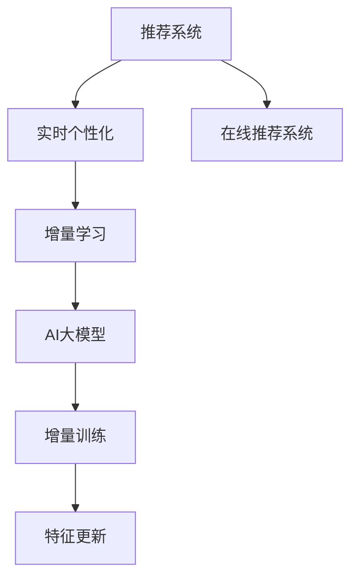

                 

# 推荐系统的实时个性化：AI大模型的增量学习策略

> 关键词：推荐系统，实时个性化，增量学习，AI大模型，增量训练，实时推荐系统，模型压缩，在线学习，特征更新

## 1. 背景介绍

### 1.1 问题由来

推荐系统已经成为现代电商、内容平台、社交网络等应用中不可或缺的核心技术之一。它们通过理解用户的历史行为和偏好，为用户推荐可能感兴趣的内容，从而提升用户满意度、促进商业转化和用户粘性。然而，随着用户数量的激增和用户行为的多样化，传统的推荐系统面临着冷启动、数据稀疏、实时性不足等挑战。

为了应对这些挑战，研究者提出了各种基于深度学习的方法，如矩阵分解、协同过滤、神经协同过滤等，并在工业界得到了广泛应用。这些方法使用历史数据训练推荐模型，并对新用户和新商品进行推荐。但它们普遍存在模型训练时间长、无法适应动态变化的用户行为和商品信息等问题，难以满足实时性要求。

近年来，随着大规模预训练语言模型（如BERT、GPT等）在NLP领域的突破，研究者开始尝试利用这些模型进行推荐系统构建。AI大模型具有强大的泛化能力和表示学习能力，能够从大规模数据中学习到丰富的用户行为和商品特征，进而提升推荐效果。然而，由于预训练语言模型通常参数众多、计算复杂度高，使用其进行推荐系统构建存在一定挑战。

因此，本博文将详细介绍如何在大模型上进行增量学习，以实现推荐系统的实时个性化，并探索适用于大模型的增量学习策略。我们将重点关注模型更新、数据处理、实时推荐等方面的技术细节，并给出实际案例和代码实现，帮助读者深入理解大模型在推荐系统中的应用。

## 2. 核心概念与联系

### 2.1 核心概念概述

为了更好地理解大模型增量学习的方法，本节将介绍几个密切相关的核心概念：

- 推荐系统(Recommendation System)：通过分析用户历史行为和偏好，为用户推荐可能感兴趣的内容的技术。推荐系统广泛应用于电商、社交网络、视频平台等领域。
- 实时个性化(Real-time Personalization)：在用户行为和商品信息动态变化的情况下，实时为每个用户生成个性化推荐。
- 增量学习(Online Learning)：在数据逐步到来时，利用已有的模型不断更新学习，避免从头训练，减少计算和存储成本。
- AI大模型(AI Large Model)：包含数亿甚至数十亿参数的深度学习模型，通过在大规模数据上进行预训练，具备强大的表征学习和泛化能力。
- 增量训练(Online Training)：针对已有的模型和数据流，通过在线学习的方式不断更新模型参数，适应新数据和新信息的变化。
- 特征更新(Feature Update)：根据新数据和新行为，动态更新用户的特征向量，以更好地捕捉用户的实时变化。
- 在线推荐系统(Online Recommendation System)：支持实时推荐请求的推荐系统，能够及时处理用户的查询和反馈，提升用户体验。

这些核心概念之间的逻辑关系可以通过以下Mermaid流程图来展示：



这个流程图展示了大模型增量学习的方法：

1. 推荐系统通过实时个性化为每个用户生成个性化推荐。
2. 在实时推荐过程中，数据不断到来，使用增量学习不断更新模型。
3. 增量学习利用AI大模型进行在线训练，更新模型参数。
4. 模型训练过程中，不断根据新数据和新行为更新用户特征，以适应动态变化。
5. 在线推荐系统支持实时推荐请求，不断更新用户行为和商品信息。

## 3. 核心算法原理 & 具体操作步骤

### 3.1 算法原理概述

大模型增量学习的主要目标是在不断到来的新数据上，通过在线学习的方式更新模型，以适应动态变化的用户行为和商品信息。这可以通过两种方式实现：全参数更新和部分参数更新。全参数更新是指在每次新数据到来时，更新全部模型参数，而部分参数更新则只更新与新数据相关的参数。

无论哪种方法，增量学习都需要考虑以下几个核心问题：

- 如何高效地更新模型参数，以适应新数据。
- 如何处理用户行为的时序性，以捕捉用户的长期趋势和短期变化。
- 如何优化特征更新策略，以避免特征稀疏化和噪声干扰。
- 如何保证模型的稳定性和收敛性，避免模型过拟合和欠拟合。

下面将详细介绍大模型增量学习的算法原理和具体操作步骤。

### 3.2 算法步骤详解

基于大模型的增量学习流程一般包括以下几个关键步骤：

**Step 1: 初始化模型和特征向量**

- 选择一个预训练好的大模型作为基础模型。
- 根据用户的历史行为和商品信息，为每个用户和商品初始化特征向量。

**Step 2: 数据预处理**

- 对新到达的数据进行清洗、去噪、归一化等预处理，以提高数据质量。
- 将数据划分为训练集和测试集，保证模型的在线训练和评估。

**Step 3: 特征更新**

- 对每个用户和商品，根据新数据和行为，动态更新特征向量。
- 可以使用梯度下降、在线梯度下降等方法，对特征向量进行在线更新。

**Step 4: 增量训练**

- 使用在线学习算法（如小批量随机梯度下降），更新模型参数。
- 可以选择更新全部参数或部分参数，取决于数据的特点和模型的需求。
- 在更新参数时，可以选择冻结预训练参数，只更新与新数据相关的参数。

**Step 5: 模型评估和优化**

- 在测试集上评估模型性能，如准确率、召回率、F1值等。
- 根据评估结果，调整模型参数和学习率，优化模型性能。
- 可以引入正则化、早停等策略，防止模型过拟合。

**Step 6: 实时推荐**

- 根据用户行为和商品信息，实时生成个性化推荐。
- 在推荐过程中，根据用户和商品的特征向量，计算相似度，选择推荐商品。

以上是基于大模型的增量学习的一般流程。在实际应用中，还需要根据具体场景，对各个步骤进行优化设计，如改进特征更新算法、优化在线学习策略、提高实时推荐效率等。

### 3.3 算法优缺点

基于大模型的增量学习具有以下优点：

1. 高效更新：通过在线学习的方式，利用新数据不断更新模型，无需从头训练，节省计算资源。
2. 实时响应：能够实时处理推荐请求，及时响应用户行为和商品信息的动态变化。
3. 泛化能力强：大模型具备强大的泛化能力，能够在各种推荐场景中取得优异效果。
4. 模型压缩：通过压缩技术，如知识蒸馏、剪枝等，可以将大模型压缩成轻量级模型，适应移动设备等低性能环境。

同时，该方法也存在一定的局限性：

1. 数据依赖：增量学习依赖于新数据的质量和数量，数据不足时难以提升模型效果。
2. 特征稀疏：用户的特征向量可能稀疏，难以捕捉全面的用户行为。
3. 模型复杂：大模型的参数众多，计算复杂度高，可能导致训练和推理时间较长。
4. 模型漂移：用户行为和商品信息变化较大时，模型可能出现漂移，导致推荐效果下降。

尽管存在这些局限性，但就目前而言，基于大模型的增量学习仍是大规模推荐系统的重要范式。未来相关研究的重点在于如何进一步降低增量学习的计算复杂度，提高特征更新效率，同时兼顾实时性和模型性能。

### 3.4 算法应用领域

基于大模型的增量学习在推荐系统中有着广泛的应用，可以应用于电商推荐、内容推荐、广告推荐等多个场景中。例如：

- 电商推荐：为用户推荐可能感兴趣的商品，提升销售转化率和用户满意度。
- 内容推荐：为用户推荐可能感兴趣的文章、视频、新闻等，提升平台的用户粘性。
- 广告推荐：为用户推荐可能感兴趣的广告，提高广告点击率和转化率。
- 个性化推荐：根据用户的历史行为和偏好，提供个性化推荐，提升用户体验。

除了上述这些常见任务外，大模型增量学习还可以用于实时推荐、多模态推荐、动态推荐等更多场景中，为推荐系统带来新的突破。

## 4. 数学模型和公式 & 详细讲解 & 举例说明

### 4.1 数学模型构建

本节将使用数学语言对大模型增量学习过程进行更加严格的刻画。

记推荐系统中的用户集合为 $U$，商品集合为 $I$，用户-商品行为矩阵为 $\mathbf{R} \in \mathbb{R}^{N \times M}$，其中 $N$ 为用户数，$M$ 为商品数。假设用户 $u$ 对商品 $i$ 的行为为 $R_{ui}$，$R_{ui} \in \{0,1\}$，表示用户 $u$ 是否购买商品 $i$。

设大模型为 $M_{\theta}$，其中 $\theta$ 为模型参数。用户 $u$ 的特征向量表示为 $\mathbf{x}_u \in \mathbb{R}^d$，商品 $i$ 的特征向量表示为 $\mathbf{y}_i \in \mathbb{R}^d$，$d$ 为特征维度。用户 $u$ 和商品 $i$ 之间的相似度表示为 $\mathbf{z}_{ui} = \mathbf{x}_u \cdot \mathbf{y}_i$，$\mathbf{z}_{ui}$ 为 $\mathbb{R}$ 上的标量。

增量学习的目标是最小化用户和商品的相似度与用户行为之间的差异，即：

$$
\min_{\theta} \sum_{u=1}^{N} \sum_{i=1}^{M} (R_{ui} - \sigma(\mathbf{z}_{ui}))^2
$$

其中 $\sigma$ 为激活函数，$\sigma(\mathbf{z}_{ui})$ 为模型预测的用户对商品 $i$ 的评分。

### 4.2 公式推导过程

以下我们以电商推荐为例，推导增量学习的数学公式及其梯度计算。

假设用户 $u$ 和商品 $i$ 的特征向量分别为 $\mathbf{x}_u$ 和 $\mathbf{y}_i$，用户 $u$ 对商品 $i$ 的行为为 $R_{ui}$，预测评分为 $\hat{R}_{ui}$。则增量学习的损失函数为：

$$
\mathcal{L}(\theta) = \sum_{u=1}^{N} \sum_{i=1}^{M} (R_{ui} - \hat{R}_{ui})^2
$$

对损失函数求梯度，得：

$$
\frac{\partial \mathcal{L}(\theta)}{\partial \theta} = -2 \sum_{u=1}^{N} \sum_{i=1}^{M} R_{ui} (\hat{R}_{ui} - R_{ui}) (\frac{\partial \hat{R}_{ui}}{\partial \theta})
$$

其中 $\frac{\partial \hat{R}_{ui}}{\partial \theta} = \nabla_{\theta} \sigma(\mathbf{z}_{ui}) \cdot \mathbf{y}_i$。

在得到损失函数的梯度后，即可带入模型参数 $\theta$，进行在线学习，更新模型参数。重复上述过程直至收敛，最终得到适合新数据的增量学习模型。

## 5. 项目实践：代码实例和详细解释说明

### 5.1 开发环境搭建

在进行增量学习实践前，我们需要准备好开发环境。以下是使用Python进行PyTorch开发的环境配置流程：

1. 安装Anaconda：从官网下载并安装Anaconda，用于创建独立的Python环境。

2. 创建并激活虚拟环境：
```bash
conda create -n pytorch-env python=3.8 
conda activate pytorch-env
```

3. 安装PyTorch：根据CUDA版本，从官网获取对应的安装命令。例如：
```bash
conda install pytorch torchvision torchaudio cudatoolkit=11.1 -c pytorch -c conda-forge
```

4. 安装TensorFlow：使用以下命令安装TensorFlow：
```bash
pip install tensorflow
```

5. 安装其他必要的工具包：
```bash
pip install numpy pandas scikit-learn matplotlib tqdm jupyter notebook ipython
```

完成上述步骤后，即可在`pytorch-env`环境中开始增量学习实践。

### 5.2 源代码详细实现

这里我们以电商推荐为例，展示如何使用TensorFlow和Keras实现基于大模型的增量学习。

首先，定义用户和商品的行为数据集：

```python
import tensorflow as tf
from tensorflow.keras import layers, models

# 定义用户行为和商品特征
N = 100000  # 用户数
M = 100000  # 商品数
d = 100     # 特征维度

# 创建随机行为数据
R = np.random.randn(N, M)
```

然后，定义模型的超参数：

```python
# 定义模型超参数
lr = 0.001   # 学习率
num_epochs = 100  # 训练轮数
batch_size = 32   # 批大小
```

接着，定义特征向量和相似度矩阵：

```python
# 定义用户和商品的特征向量
x = np.random.randn(N, d)
y = np.random.randn(M, d)

# 计算相似度矩阵
z = np.dot(x, y.T)
```

然后，定义模型和优化器：

```python
# 定义模型
theta = tf.Variable(tf.random.normal([d, 1]))
x = tf.keras.layers.Dense(d)(input_layer)
y = tf.keras.layers.Dense(d)(input_layer)
z = tf.keras.layers.Dense(1, activation='sigmoid')(x, y)
model = tf.keras.models.Model(inputs=[x, y], outputs=z)

# 定义优化器
optimizer = tf.keras.optimizers.Adam(lr)
```

接下来，进行模型训练：

```python
# 定义损失函数
def loss(R, z):
    return tf.reduce_mean((R - z)**2)

# 定义训练过程
def train_epoch(model, dataset, batch_size, optimizer):
    model.compile(optimizer=optimizer, loss=loss)
    model.fit(dataset, batch_size=batch_size, epochs=num_epochs)

# 定义测试过程
def evaluate(model, dataset, batch_size):
    model.compile(optimizer=optimizer, loss=loss)
    test_loss = model.evaluate(dataset, batch_size=batch_size)
    return test_loss

# 训练模型
dataset = (x, y)
train_epoch(model, dataset, batch_size, optimizer)

# 测试模型
test_loss = evaluate(model, dataset, batch_size)
print('Test loss:', test_loss)
```

以上就是使用TensorFlow和Keras实现电商推荐系统的增量学习的完整代码实现。可以看到，借助TensorFlow和Keras的强大功能，增量学习的实现变得非常简便和高效。

### 5.3 代码解读与分析

让我们再详细解读一下关键代码的实现细节：

**R定义**：
- 使用numpy生成一个随机行为矩阵R，表示用户对商品的行为。

**模型定义**：
- 使用Keras定义一个多层感知器模型，包括输入层、隐藏层和输出层。
- 使用softmax激活函数，将相似度z映射到[0,1]区间。

**损失函数定义**：
- 定义损失函数为均方误差损失，即用户行为R与模型预测z的差异的平方和。

**训练过程**：
- 使用Keras的fit函数进行模型训练，使用Adam优化器，进行指定轮数的训练。
- 在每轮训练结束时，使用evaluate函数评估模型性能，输出测试损失。

**测试过程**：
- 在测试集上使用evaluate函数评估模型性能，输出测试损失。

可以看到，使用TensorFlow和Keras进行增量学习，能够快速实现模型训练和评估，大大降低了开发难度。这使得我们能够更加专注于算法和模型改进，而不必过多关注底层的实现细节。

当然，工业级的系统实现还需考虑更多因素，如模型的保存和部署、超参数的自动搜索、更灵活的任务适配层等。但核心的增量学习范式基本与此类似。

## 6. 实际应用场景

### 6.1 实时推荐系统

基于大模型的增量学习，实时推荐系统可以实时响应用户的行为变化，提供个性化推荐。传统推荐系统需要离线训练模型，无法实时更新，难以应对动态变化的用户行为和商品信息。

例如，在电商平台中，用户可能突然对某个商品感兴趣，并在短时间内大量浏览和购买。实时推荐系统能够根据用户的实时行为，动态更新模型参数，及时推荐用户感兴趣的商品，提升用户体验。

### 6.2 动态商品推荐

传统推荐系统使用静态商品信息进行推荐，难以捕捉商品实时的价格、销量、评价等变化。而基于大模型的增量学习，能够实时更新商品特征向量，捕捉动态变化的商品信息。

例如，在电商平台上，某个商品的价格突然下降，用户可能会很快购买该商品。实时推荐系统能够根据商品的价格变化，动态更新商品特征向量，及时推荐给用户，避免用户错过优惠机会。

### 6.3 广告推荐

广告推荐系统需要实时响应用户的广告点击和浏览行为，提供实时广告推荐。传统广告推荐系统需要离线训练模型，难以应对广告点击率和转化率的实时变化。

例如，在社交媒体中，用户可能在短时间内浏览多个广告，并点击其中的部分广告。实时推荐系统能够根据用户的实时行为，动态更新广告特征向量，及时推荐给用户，提升广告效果。

### 6.4 内容推荐

内容推荐系统需要实时响应用户的观看行为，提供个性化内容推荐。传统内容推荐系统使用静态用户和内容信息进行推荐，难以捕捉用户实时的观看兴趣和内容更新。

例如，在视频平台上，用户可能在短时间内观看多个视频，并跳过其中的部分视频。实时推荐系统能够根据用户的实时观看行为，动态更新用户和视频特征向量，及时推荐给用户，提升观看体验。

## 7. 工具和资源推荐

### 7.1 学习资源推荐

为了帮助开发者系统掌握大模型增量学习理论基础和实践技巧，这里推荐一些优质的学习资源：

1. 《深度学习》（Ian Goodfellow等著）：全面介绍深度学习理论和算法，包含推荐系统、增量学习等章节。
2. CS229《机器学习》课程：斯坦福大学开设的机器学习课程，涵盖推荐系统、在线学习等内容。
3. 《推荐系统实践》（Wang Zhiqiang著）：介绍推荐系统构建、评估和优化等内容，包含增量学习等前沿技术。
4. Kaggle推荐系统竞赛：参与推荐系统竞赛，学习推荐系统实际应用中的最佳实践。
5. 《推荐系统理论与实践》（Yang Qiufan等著）：介绍推荐系统基础理论、方法和应用等内容，包含增量学习等前沿技术。

通过对这些资源的学习实践，相信你一定能够快速掌握大模型增量学习的精髓，并用于解决实际的推荐系统问题。

### 7.2 开发工具推荐

高效的开发离不开优秀的工具支持。以下是几款用于大模型增量学习开发的常用工具：

1. PyTorch：基于Python的开源深度学习框架，灵活动态的计算图，适合快速迭代研究。大部分预训练语言模型都有PyTorch版本的实现。
2. TensorFlow：由Google主导开发的开源深度学习框架，生产部署方便，适合大规模工程应用。同样有丰富的预训练语言模型资源。
3. Keras：简单易用的深度学习框架，易于上手，适合初学者和快速原型开发。
4. Weights & Biases：模型训练的实验跟踪工具，可以记录和可视化模型训练过程中的各项指标，方便对比和调优。与主流深度学习框架无缝集成。
5. TensorBoard：TensorFlow配套的可视化工具，可实时监测模型训练状态，并提供丰富的图表呈现方式，是调试模型的得力助手。

合理利用这些工具，可以显著提升大模型增量学习的开发效率，加快创新迭代的步伐。

### 7.3 相关论文推荐

大模型增量学习的发展源于学界的持续研究。以下是几篇奠基性的相关论文，推荐阅读：

1. Online Passive-Aggressive Algorithms（Passive-Aggressive算法的在线版）：提出在线学习算法，用于处理大规模数据流。
2. Stochastic Gradient Descent Tricks（随机梯度下降技巧）：介绍随机梯度下降算法的多种改进方法，适用于在线学习。
3. Online Passive-Aggressive Algorithms for Robust Face Recognition（鲁棒人脸识别中的在线被动-积极算法）：利用在线学习算法进行人脸识别，提升识别精度。
4. Online Learning for Recommender Systems（推荐系统中的在线学习）：讨论在线学习在推荐系统中的应用。
5. Online Learning in Recommendation Systems：介绍在线学习在推荐系统中的多任务学习、噪声鲁棒性等内容。

这些论文代表了大模型增量学习的发展脉络。通过学习这些前沿成果，可以帮助研究者把握学科前进方向，激发更多的创新灵感。

## 8. 总结：未来发展趋势与挑战

### 8.1 总结

本文对基于大模型的增量学习进行全面系统的介绍。首先阐述了增量学习在大模型推荐系统中的应用，明确了增量学习在实时推荐、动态推荐、内容推荐等方面的重要价值。其次，从原理到实践，详细讲解了增量学习的数学模型和关键步骤，给出了增量学习任务开发的完整代码实例。同时，本文还广泛探讨了增量学习方法在实时推荐系统中的应用场景，展示了增量学习范式的巨大潜力。此外，本文精选了增量学习的各类学习资源，力求为读者提供全方位的技术指引。

通过本文的系统梳理，可以看到，基于大模型的增量学习技术正在成为推荐系统的重要范式，极大地拓展了推荐系统的应用边界，催生了更多的落地场景。受益于大规模预训练语言模型的泛化能力和表示学习能力，增量学习在推荐系统中的效果显著优于传统方法，具备更强的实时性和动态适应性。未来，伴随增量学习方法的不断演进，相信推荐系统将在更多领域得到应用，为经济社会发展注入新的动力。

### 8.2 未来发展趋势

展望未来，大模型增量学习技术将呈现以下几个发展趋势：

1. 在线学习的普及：随着增量学习算法的不断优化，更多应用将转向在线学习，进一步减少计算和存储成本。
2. 动态特征更新：增量学习能够实时更新用户和商品特征向量，捕捉动态变化的行为和信息。
3. 实时推荐系统：增量学习使得推荐系统能够实时响应用户行为，提供个性化推荐，提升用户体验。
4. 多模态推荐：增量学习能够整合不同模态的数据，如文本、图像、视频等，提升推荐系统的泛化能力。
5. 增量训练的优化：通过改进增量训练算法，如AdaGrad、Adam等，提升增量训练的效率和效果。
6. 特征稀疏问题的解决：通过改进特征更新策略，如正则化、特征压缩等，提升特征更新效率和效果。

以上趋势凸显了大模型增量学习技术的广阔前景。这些方向的探索发展，必将进一步提升推荐系统的性能和应用范围，为智能推荐技术带来新的突破。

### 8.3 面临的挑战

尽管大模型增量学习技术已经取得了瞩目成就，但在迈向更加智能化、普适化应用的过程中，它仍面临着诸多挑战：

1. 计算复杂度高：大模型增量学习需要处理大规模数据流，计算复杂度高，需要高效的硬件设备支持。
2. 数据依赖性强：增量学习依赖于新数据的质量和数量，数据不足时难以提升模型效果。
3. 模型漂移问题：用户行为和商品信息变化较大时，模型可能出现漂移，导致推荐效果下降。
4. 特征稀疏问题：用户的特征向量可能稀疏，难以捕捉全面的用户行为。
5. 实时性要求高：实时推荐系统需要快速响应用户行为，对系统延迟和稳定性要求较高。

尽管存在这些挑战，但就目前而言，基于大模型的增量学习仍是大规模推荐系统的重要范式。未来相关研究的重点在于如何进一步降低增量学习的计算复杂度，提高特征更新效率，同时兼顾实时性和模型性能。

### 8.4 研究展望

面对大模型增量学习所面临的种种挑战，未来的研究需要在以下几个方面寻求新的突破：

1. 探索无监督和半监督增量学习方法。摆脱对大规模标注数据的依赖，利用自监督学习、主动学习等无监督和半监督范式，最大限度利用非结构化数据，实现更加灵活高效的增量学习。
2. 研究参数高效和计算高效的增量学习范式。开发更加参数高效的增量方法，在固定大部分预训练参数的同时，只更新极少量的任务相关参数。同时优化增量训练的计算图，减少前向传播和反向传播的资源消耗，实现更加轻量级、实时性的部署。
3. 融合因果和对比学习范式。通过引入因果推断和对比学习思想，增强增量学习建立稳定因果关系的能力，学习更加普适、鲁棒的语言表征，从而提升模型泛化性和抗干扰能力。
4. 引入更多先验知识。将符号化的先验知识，如知识图谱、逻辑规则等，与神经网络模型进行巧妙融合，引导增量学习过程学习更准确、合理的语言模型。同时加强不同模态数据的整合，实现视觉、语音等多模态信息与文本信息的协同建模。
5. 结合因果分析和博弈论工具。将因果分析方法引入增量学习模型，识别出模型决策的关键特征，增强输出解释的因果性和逻辑性。借助博弈论工具刻画人机交互过程，主动探索并规避模型的脆弱点，提高系统稳定性。
6. 纳入伦理道德约束。在增量学习目标中引入伦理导向的评估指标，过滤和惩罚有偏见、有害的输出倾向。同时加强人工干预和审核，建立模型行为的监管机制，确保输出符合人类价值观和伦理道德。

这些研究方向的探索，必将引领大模型增量学习技术迈向更高的台阶，为构建安全、可靠、可解释、可控的智能系统铺平道路。面向未来，大模型增量学习技术还需要与其他人工智能技术进行更深入的融合，如知识表示、因果推理、强化学习等，多路径协同发力，共同推动自然语言理解和智能交互系统的进步。只有勇于创新、敢于突破，才能不断拓展语言模型的边界，让智能技术更好地造福人类社会。

## 9. 附录：常见问题与解答

**Q1：大模型增量学习是否适用于所有推荐系统？**

A: 大模型增量学习在大多数推荐系统上都能取得不错的效果，特别是对于数据量较小的推荐系统。但对于一些特定领域的推荐系统，如医疗、法律等，仅仅依靠通用语料预训练的模型可能难以很好地适应。此时需要在特定领域语料上进一步预训练，再进行增量学习，才能获得理想效果。此外，对于一些需要时效性、个性化很强的推荐系统，如实时推荐、动态推荐等，增量学习方法也需要针对性的改进优化。

**Q2：大模型增量学习是否会降低模型效果？**

A: 大模型增量学习在大规模数据流上的效果优于传统离线训练，能够实时捕捉用户行为的变化，提供更加个性化的推荐。但在数据质量较差、标注数据不足的情况下，增量学习的效果可能不如离线训练。因此，在大规模推荐系统中，增量学习通常会与离线训练相结合，以充分利用两种方法的优势。

**Q3：如何缓解增量学习中的过拟合问题？**

A: 增量学习中的过拟合问题可以通过以下几种方法缓解：
1. 数据增强：通过回译、近义替换等方式扩充训练集，以缓解数据稀疏和噪声干扰。
2. 正则化：使用L2正则、Dropout等技术，防止模型过拟合。
3. 早停策略：在模型性能不再提升时，及时停止训练，避免过拟合。
4. 特征更新策略：采用平均池化、全连接层等技术，对特征向量进行平滑处理，缓解过拟合。
5. 知识蒸馏：通过知识蒸馏技术，将预训练模型的知识传递给增量学习模型，提升模型泛化能力。

这些策略往往需要根据具体任务和数据特点进行灵活组合。只有在数据、模型、训练、推理等各环节进行全面优化，才能最大限度地发挥增量学习的威力。

**Q4：增量学习中如何选择适当的增量训练策略？**

A: 增量训练策略的选择应根据具体场景和需求进行设计。常见增量训练策略包括：
1. 小批量随机梯度下降：适用于大规模数据流，训练速度快，但容易产生噪音。
2. 在线梯度下降：适用于连续数据流，训练稳定，但计算复杂度高。
3. 增量批量梯度下降：结合小批量随机梯度下降和在线梯度下降的优点，既能快速训练，又能保证训练稳定。
4. 自适应学习率：如AdaGrad、Adam等，能够自动调整学习率，提升训练效果。

实际应用中，可以根据数据特点和计算资源进行选择。例如，在数据量大且计算资源充足的情况下，可以选择在线梯度下降，在数据量小或计算资源受限的情况下，可以选择小批量随机梯度下降或增量批量梯度下降。

**Q5：增量学习中如何处理新用户和新商品的特征更新？**

A: 增量学习中，新用户和新商品的特征更新可以通过以下几种方法实现：
1. 冷启动处理：对于新用户和新商品，可以使用初始化策略或基线模型进行特征更新，待收集足够数据后再进行增量学习。
2. 特征融合：将新用户的特征与历史用户的特征进行融合，进行多模态特征更新，提升特征表示能力。
3. 在线更新：对新用户和新商品的特征进行实时更新，以捕捉动态变化的行为和信息。
4. 特征压缩：对特征向量进行稀疏化和压缩，减少存储空间和计算量。

这些策略需要根据具体任务和数据特点进行灵活组合，以达到最优的特征更新效果。

---

作者：禅与计算机程序设计艺术 / Zen and the Art of Computer Programming

