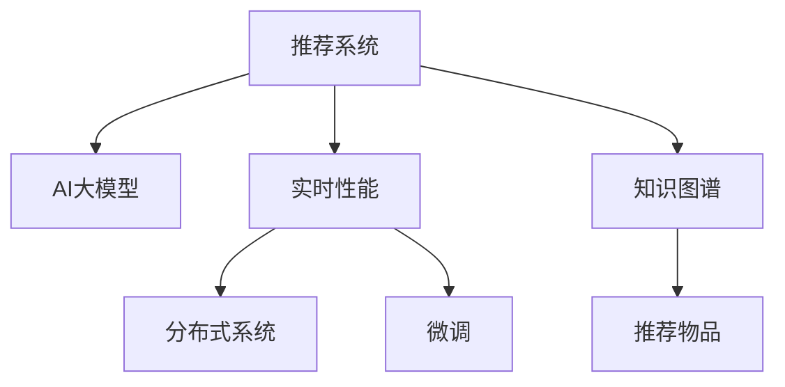

                 

# 推荐系统的实时性能：AI大模型的新挑战

## 1. 背景介绍

随着互联网应用的快速发展，推荐系统已经成为用户体验的关键环节。无论是电商平台的商品推荐，视频网站的个性化视频推荐，还是社交平台的深度内容推荐，推荐系统的表现直接影响用户的留存率和转化率。在推荐系统构建中，如何实时获取并利用用户行为数据，快速生成个性化的推荐结果，成为研究的热点话题。

### 1.1 问题由来

在早期的推荐系统中，数据量相对较小，模型计算量也不大，因此推荐算法多采用基于规则或经典机器学习模型如协同过滤、矩阵分解等方法。但随着数据量呈指数级增长，尤其是随着大规模预训练语言模型（如BERT、GPT）的诞生，推荐系统的构建方式正在发生深刻变革。

人工智能（AI）大模型的引入，使得推荐系统可以更好地利用用户行为的多维度信息，挖掘更深层次的关联规律，生成更加精准的推荐结果。然而，随着AI大模型的规模不断增大，实时性能问题也日益凸显。模型计算量大、内存占用高，且随着数据量的增加，实时响应的效率要求越来越高，推荐系统面临的实时性能挑战也随之加剧。

## 2. 核心概念与联系

### 2.1 核心概念概述

为更好地理解实时性能在推荐系统中的挑战，本节将介绍几个核心概念：

- 推荐系统（Recommendation System）：通过分析用户行为和物品特征，推荐合适的物品给用户，提升用户体验和业务收益的系统。
- AI大模型（AI Large Model）：如BERT、GPT等，通过大规模数据预训练得到的复杂神经网络模型，可以用于理解用户行为、推荐物品等多种任务。
- 实时性能（Real-time Performance）：推荐系统需要实时响应用户请求，快速生成推荐结果，以满足用户即时需求的能力。
- 分布式系统（Distributed System）：将计算任务分配到多台计算机上并行执行，提高系统处理能力和响应速度。
- 微调（Fine-Tuning）：在预训练模型基础上，使用少量标注数据进行特定任务微调，提高模型在该任务上的性能。
- 知识图谱（Knowledge Graph）：结构化的知识库，用于存储和查询实体之间的关系，帮助推荐系统更好地理解用户需求和物品属性。

这些核心概念之间的逻辑关系可以通过以下Mermaid流程图来展示：



这个流程图展示了推荐系统的主要组件及其相互关系：

1. 推荐系统通过用户行为数据和物品特征数据，对AI大模型进行微调，以生成个性化的推荐结果。
2. 实时性能是推荐系统的核心目标，通过分布式系统优化计算资源，实现快速的推荐响应。
3. 知识图谱用于增强模型的理解能力，提供更深层次的语义关联。

这些概念共同构成了推荐系统的核心框架，使其能够高效、准确地生成个性化推荐结果。通过理解这些核心概念，我们可以更好地把握推荐系统的设计思路和优化方向。

## 3. 核心算法原理 & 具体操作步骤

### 3.1 算法原理概述

推荐系统的实时性能优化主要涉及以下几个核心算法：

- 特征提取：从用户行为和物品属性中提取特征，用于构建推荐模型。
- 协同过滤：利用用户行为数据和物品间的关系，预测用户对物品的评分。
- 矩阵分解：通过分解用户-物品评分矩阵，得到低秩矩阵分解的隐含因子。
- 深度学习模型：如神经网络、循环神经网络等，用于处理大规模用户行为数据和物品特征。
- 知识图谱嵌入：将知识图谱中的实体和关系信息，转换为低维向量，用于增强推荐结果的语义关联。

这些算法相互配合，共同实现了推荐系统的实时性能优化。

### 3.2 算法步骤详解

推荐系统的实时性能优化通常包括以下几个关键步骤：

**Step 1: 数据预处理**
- 收集用户行为数据和物品特征数据，进行数据清洗和格式转换。
- 将用户行为数据转换为矩阵形式，包括用户-物品评分矩阵、用户-物品交互矩阵等。

**Step 2: 特征提取**
- 提取用户和物品的特征，包括用户兴趣、物品属性、用户-物品交互特征等。
- 对用户行为数据进行向量化处理，如使用TF-IDF、Word2Vec等。

**Step 3: 模型训练**
- 选择推荐模型，如协同过滤、矩阵分解、深度学习模型等。
- 对模型进行训练，使用标注数据进行监督学习，优化模型参数。

**Step 4: 实时预测**
- 对于用户实时请求，实时计算其推荐的物品。
- 结合知识图谱中的信息，进一步优化推荐结果。

**Step 5: 结果展示**
- 将推荐结果呈现给用户，如展示在网页上或推送到客户端。

**Step 6: 系统优化**
- 实时监控系统性能，使用分布式系统优化计算资源。
- 定期更新模型，使用新数据进行微调。

### 3.3 算法优缺点

基于AI大模型的推荐系统具有以下优点：

- 精度高：深度学习模型可以处理复杂的非线性关系，提高推荐结果的准确性。
- 泛化能力强：大规模预训练模型可以提取通用特征，提升推荐系统的泛化能力。
- 可解释性强：模型结构复杂，提供了丰富的特征表示，方便进行解释和优化。

同时，该方法也存在一定的局限性：

- 计算量大：深度学习模型参数多，计算复杂度高，实时性能较差。
- 内存占用高：大规模模型需要大内存存储，硬件成本高。
- 过拟合风险：模型复杂度高，容易在标注数据较少的情况下出现过拟合。
- 可解释性不足：深度学习模型通常视为"黑盒"，难以解释模型内部工作机制。

尽管存在这些局限性，但大模型在推荐系统中的应用仍带来了革命性的提升。通过引入深度学习模型和大规模数据预训练，推荐系统可以处理更加复杂、多样化的数据，生成更具个性化和多样性的推荐结果，为用户体验带来显著提升。

### 3.4 算法应用领域

基于AI大模型的推荐系统已经在多个领域取得了显著的应用效果：

- 电商推荐：通过分析用户浏览、购买行为，实时推荐商品，提高用户转化率和购物体验。
- 视频推荐：利用用户观看历史和评分数据，实时推荐相关视频，提升观看时长和用户满意度。
- 社交推荐：分析用户互动和兴趣，推荐合适的社区内容和互动对象，增加用户粘性。
- 新闻推荐：根据用户阅读历史和行为，实时推荐新闻内容，提高阅读量和用户参与度。

除了这些常见的应用场景外，基于AI大模型的推荐系统还被创新性地应用到智能家居、智能医疗等新兴领域，为各行各业带来新的业务增长点。

## 4. 数学模型和公式 & 详细讲解

### 4.1 数学模型构建

推荐系统的实时性能优化涉及多个数学模型，包括特征提取模型、协同过滤模型、深度学习模型等。以深度学习模型为例，常用的推荐模型包括深度神经网络（DNN）、卷积神经网络（CNN）、循环神经网络（RNN）等。

假设用户和物品的特征向量分别为$u \in \mathbb{R}^n$和$i \in \mathbb{R}^m$，用户-物品评分矩阵为$X \in \mathbb{R}^{N \times M}$。其中，$N$和$M$分别为用户数和物品数。推荐模型的输入输出分别为：
$$
y = f(u_i, i_j) = Wf(u_i) \cdot i_j + b
$$
其中，$W \in \mathbb{R}^{m \times n}$为模型参数，$b \in \mathbb{R}$为偏置项。

### 4.2 公式推导过程

以深度神经网络模型为例，假设模型包含$L$层，每一层的输入和输出分别为$X^{(l)} \in \mathbb{R}^{N \times M}$和$H^{(l)} \in \mathbb{R}^{N \times M}$。则模型前向传播过程为：
$$
H^{(1)} = \sigma(X^{(1)}W^{(1)} + b^{(1)})
$$
$$
H^{(l)} = \sigma(H^{(l-1)}W^{(l)} + b^{(l)})
$$
其中，$\sigma$为激活函数，如ReLU、Sigmoid等。

模型反向传播过程为：
$$
\frac{\partial L}{\partial W^{(l)}} = \frac{\partial L}{\partial H^{(l)}} \cdot H^{(l-1)}^T
$$
$$
\frac{\partial L}{\partial b^{(l)}} = \frac{\partial L}{\partial H^{(l)}} \cdot H^{(l-1)}
$$
$$
\frac{\partial L}{\partial X^{(1)}} = \frac{\partial L}{\partial H^{(1)}} \cdot W^{(1)}
$$

### 4.3 案例分析与讲解

以电商推荐系统为例，推荐模型可以采用深度神经网络（DNN）或卷积神经网络（CNN），用于预测用户对物品的评分。模型输入为用户的兴趣特征和物品的属性特征，输出为用户对物品的评分预测。

假设用户$i$对物品$j$的评分预测为$\hat{y}_{i,j}$，其目标函数为：
$$
L = \frac{1}{N}\sum_{i=1}^N \sum_{j=1}^M (y_{i,j} - \hat{y}_{i,j})^2
$$
其中，$y_{i,j}$为用户$i$对物品$j$的真实评分。

模型使用Adam优化器进行参数更新，学习率$\eta$为$10^{-3}$，批量大小$B$为$512$。在训练过程中，将用户-物品评分矩阵$X$拆分为多个批次进行计算，每一批次包含$B$个样本。训练步骤如下：
1. 初始化模型参数$W^{(1)}$和$b^{(1)}$。
2. 对每一批次$X^{(k)}$进行前向传播，计算预测评分$\hat{Y}^{(k)} = \sigma(X^{(k)}W^{(1)}) \cdot H^{(2)}$。
3. 计算损失函数$L^{(k)} = \frac{1}{B}\sum_{i=1}^B (y_{i,j} - \hat{y}_{i,j})^2$。
4. 对模型参数进行梯度下降更新。
5. 重复步骤2-4直至收敛。

## 5. 项目实践：代码实例和详细解释说明

### 5.1 开发环境搭建

在进行实时性能优化实践前，我们需要准备好开发环境。以下是使用Python进行TensorFlow开发的环境配置流程：

1. 安装Anaconda：从官网下载并安装Anaconda，用于创建独立的Python环境。

2. 创建并激活虚拟环境：
```bash
conda create -n tf-env python=3.8 
conda activate tf-env
```

3. 安装TensorFlow：根据CUDA版本，从官网获取对应的安装命令。例如：
```bash
conda install tensorflow -c pytorch -c conda-forge
```

4. 安装各类工具包：
```bash
pip install numpy pandas scikit-learn matplotlib tqdm jupyter notebook ipython
```

完成上述步骤后，即可在`tf-env`环境中开始实时性能优化实践。

### 5.2 源代码详细实现

这里我们以电商推荐系统为例，给出使用TensorFlow进行DNN模型实时性能优化的代码实现。

首先，定义电商推荐数据处理函数：

```python
import tensorflow as tf
from tensorflow.keras.layers import Dense, Activation, Dropout
from tensorflow.keras.models import Sequential

def load_data():
    # 加载用户行为数据和物品特征数据
    train_data = load_train_data()
    test_data = load_test_data()
    
    # 将用户行为数据转换为矩阵形式
    X_train, X_test = get_user_item_interaction_matrix(train_data, test_data)
    
    return X_train, X_test, Y_train, Y_test

def get_user_item_interaction_matrix(train_data, test_data):
    # 将用户行为数据转换为矩阵形式
    train_u_item = build_user_item_matrix(train_data)
    test_u_item = build_user_item_matrix(test_data)
    
    # 对用户行为数据进行归一化
    X_train = normalize(train_u_item)
    X_test = normalize(test_u_item)
    
    return X_train, X_test

def build_user_item_matrix(data):
    # 构建用户-物品评分矩阵
    user_item = pd.DataFrame(data)
    user_item = user_item.pivot_table(index='user_id', columns='item_id', values='rating')
    user_item = user_item.fillna(0)
    user_item = user_item.to_numpy()
    
    return user_item
```

然后，定义模型和优化器：

```python
from tensorflow.keras import optimizers

# 定义深度神经网络模型
model = Sequential([
    Dense(128, input_dim=X_train.shape[1]),
    Activation('relu'),
    Dropout(0.2),
    Dense(64),
    Activation('relu'),
    Dropout(0.2),
    Dense(1),
    Activation('sigmoid')
])

# 定义优化器
optimizer = optimizers.Adam(lr=10**-3)
```

接着，定义训练和评估函数：

```python
from tensorflow.keras.callbacks import EarlyStopping
from sklearn.metrics import mean_squared_error

def train_model(X_train, Y_train, X_test, Y_test):
    # 编译模型
    model.compile(loss='binary_crossentropy', optimizer=optimizer, metrics=['mae'])
    
    # 训练模型
    history = model.fit(X_train, Y_train, batch_size=512, epochs=10, validation_data=(X_test, Y_test), callbacks=[EarlyStopping(patience=3)])
    
    # 评估模型
    Y_pred = model.predict(X_test)
    mse = mean_squared_error(Y_test, Y_pred)
    return mse

def evaluate_model(X_train, Y_train, X_test, Y_test):
    # 评估模型
    Y_pred = model.predict(X_test)
    mse = mean_squared_error(Y_test, Y_pred)
    
    return mse
```

最后，启动训练流程并在测试集上评估：

```python
X_train, X_test, Y_train, Y_test = load_data()

mse = train_model(X_train, Y_train, X_test, Y_test)
print(f"Train MSE: {mse:.5f}")

mse = evaluate_model(X_train, Y_train, X_test, Y_test)
print(f"Test MSE: {mse:.5f}")
```

以上就是使用TensorFlow对电商推荐系统进行实时性能优化的完整代码实现。可以看到，TensorFlow提供了丰富的高级API，使得模型构建和训练变得更加简单和高效。

### 5.3 代码解读与分析

让我们再详细解读一下关键代码的实现细节：

**load_data函数**：
- 加载电商推荐数据，包括用户行为数据和物品特征数据。
- 将用户行为数据转换为用户-物品评分矩阵，并进行归一化处理。

**get_user_item_matrix函数**：
- 构建用户-物品评分矩阵，并将NaN值替换为0。

**train_model函数**：
- 定义深度神经网络模型，包含三层隐藏层，每层使用ReLU激活函数，输出层使用sigmoid函数。
- 使用Adam优化器进行参数更新，学习率为$10^{-3}$。
- 对模型进行编译，设置损失函数和评估指标。
- 使用EarlyStopping回调函数，防止模型在验证集上过拟合。

**evaluate_model函数**：
- 对模型进行评估，计算预测评分与真实评分的均方误差。

**训练流程**：
- 定义训练轮数和批量大小，启动模型训练。
- 在训练过程中，使用EarlyStopping回调函数，监控验证集上的均方误差，并在超过阈值时停止训练。
- 在测试集上评估模型性能，输出训练和测试的均方误差。

可以看到，TensorFlow提供了高度抽象的API，使得深度学习模型的构建和训练变得非常便捷。开发者可以更加专注于模型的优化和调参，而不必过多关注底层的计算细节。

当然，工业级的系统实现还需考虑更多因素，如模型的保存和部署、超参数的自动搜索、更灵活的任务适配层等。但核心的实时性能优化基本与此类似。

## 6. 实际应用场景

### 6.1 实时推荐引擎

基于AI大模型的推荐系统已经被广泛应用于实时推荐引擎中。在电商平台上，推荐引擎需要快速响应用户的浏览行为，实时生成推荐结果。推荐引擎通过调用深度学习模型，对用户行为数据进行实时预测，结合商品属性数据，生成个性化推荐。推荐引擎还具备智能推荐策略，可以根据用户行为数据进行动态调整，进一步提升推荐效果。

在视频网站中，推荐引擎需要实时响应用户的观看行为，推荐相关的视频内容。推荐引擎通过调用深度学习模型，对用户观看历史和评分数据进行实时预测，生成个性化视频推荐。推荐引擎还具备智能推荐策略，可以根据用户行为数据进行动态调整，进一步提升推荐效果。

### 6.2 智能客服系统

基于AI大模型的智能客服系统也在快速发展中。智能客服系统需要实时响应用户的咨询请求，快速生成个性化回答。智能客服系统通过调用深度学习模型，对用户问题和历史聊天记录进行实时分析，生成最合适的回答。智能客服系统还具备智能推荐策略，可以根据用户咨询记录进行动态调整，进一步提升客服体验。

智能客服系统通常结合自然语言处理技术和推荐技术，构建更智能的推荐和对话策略。例如，系统可以首先识别用户咨询的问题，然后使用推荐技术从知识库中推荐合适的答案。如果知识库中没有现成答案，系统再使用深度学习模型进行个性化生成。

### 6.3 智能广告投放

基于AI大模型的智能广告投放系统也在逐渐兴起。智能广告投放系统需要实时响应用户行为数据，优化广告投放策略。智能广告投放系统通过调用深度学习模型，对用户行为数据进行实时预测，生成个性化的广告投放策略。智能广告投放系统还具备智能推荐策略，可以根据用户行为数据进行动态调整，进一步提升广告效果。

智能广告投放系统通常结合推荐技术和深度学习模型，构建更智能的广告推荐和投放策略。例如，系统可以首先识别用户的兴趣和行为特征，然后使用推荐技术从广告库中推荐合适的广告。如果广告库中没有现成广告，系统再使用深度学习模型进行个性化生成。

### 6.4 未来应用展望

随着AI大模型的不断进步，推荐系统的实时性能优化将面临更多新的挑战和机遇。未来，基于AI大模型的推荐系统将在以下几个方面迎来突破：

1. 计算资源优化：引入分布式计算和硬件加速技术，如GPU、TPU等，优化模型计算性能。
2. 内存管理优化：采用模型剪枝、量化加速等技术，优化模型内存占用。
3. 模型压缩优化：采用知识蒸馏、模型压缩等技术，减小模型规模，提升模型推理速度。
4. 动态负载均衡：使用负载均衡算法，优化系统资源分配，提高系统稳定性。
5. 实时数据流优化：采用流式数据处理技术，实时更新模型参数，提高模型实时性。
6. 模型推理优化：采用高效的推理框架，如TensorRT等，优化模型推理速度。

以上优化方向将进一步提升推荐系统的实时性能，使其能够更好地适应快速变化的用户需求，提供更加个性化和高效的推荐服务。未来，推荐系统将在更多的领域得到应用，为各行各业带来新的增长机遇。

## 7. 工具和资源推荐

### 7.1 学习资源推荐

为了帮助开发者系统掌握推荐系统的实时性能优化理论基础和实践技巧，这里推荐一些优质的学习资源：

1. 《推荐系统》课程：由斯坦福大学开设的NLP明星课程，有Lecture视频和配套作业，带你入门推荐系统领域的基本概念和经典模型。

2. 《深度学习理论与实践》书籍：该书系统介绍了深度学习理论，包括卷积神经网络、循环神经网络等，并结合TensorFlow等工具进行实践。

3. 《分布式系统》课程：由哈佛大学开设的分布式系统课程，涵盖分布式算法、共识协议、分布式数据存储等核心内容，是分布式推荐系统的理论基础。

4. 《推荐系统实战》书籍：该书介绍了推荐系统从理论到实际的应用案例，包括电商推荐、视频推荐、智能客服等，具有很强的实用价值。

5. 《TensorFlow官方文档》：该书详细介绍了TensorFlow的使用方法和API，是TensorFlow开发者必备的参考书。

通过对这些资源的学习实践，相信你一定能够快速掌握推荐系统的实时性能优化精髓，并用于解决实际的推荐问题。

### 7.2 开发工具推荐

高效的开发离不开优秀的工具支持。以下是几款用于推荐系统实时性能优化的常用工具：

1. TensorFlow：由Google主导开发的深度学习框架，生产部署方便，适合大规模工程应用。提供了丰富的高级API，方便开发者进行模型构建和训练。

2. PyTorch：基于Python的开源深度学习框架，灵活动态的计算图，适合快速迭代研究。适用于TensorFlow难以处理的复杂模型。

3. Apache Spark：一个高效的分布式计算平台，适合大规模数据处理和实时流式计算。提供了MLlib库，支持机器学习和推荐系统优化。

4. Hadoop：一个分布式计算平台，适合大规模数据存储和处理。提供了HDFS和YARN等组件，支持分布式计算和存储。

5. Elasticsearch：一个分布式搜索引擎，支持实时搜索和流式数据处理。适合构建实时推荐系统的数据存储和检索。

6. Jupyter Notebook：一个交互式的数据科学开发环境，支持Python、R、Scala等多种语言。适合进行实时性能优化的算法研究。

合理利用这些工具，可以显著提升推荐系统的实时性能优化任务开发效率，加快创新迭代的步伐。

### 7.3 相关论文推荐

推荐系统的实时性能优化涉及多个研究方向，以下是几篇奠基性的相关论文，推荐阅读：

1. Online Matrix Factorization: A Significantly Improved Technique for Recommender Systems（在线矩阵分解：推荐系统的一种显著改进技术）：提出在线矩阵分解算法，实时更新推荐模型，提升推荐效果。

2. Fast Matrix Factorization for Online Recommendations（快速矩阵分解：在线推荐的快速算法）：提出流式矩阵分解算法，实时处理大规模推荐数据，优化推荐效果。

3. Deep Interest Network: A Framework for Industrial-Grade Recommender Systems（深度兴趣网络：工业级推荐系统框架）：提出深度兴趣网络模型，结合知识图谱和深度学习，提升推荐系统的泛化能力和实时性。

4. Sequential Matrix Factorization: Algorithms and Experiments（序列矩阵分解：算法与实验）：提出序列矩阵分解算法，结合用户行为序列数据，提升推荐系统的预测能力和实时性。

5. SVD++ Approximates Matrix Factorization Factorization Tricks（SVD++近似矩阵分解：技巧）：提出SVD++算法，近似矩阵分解，降低推荐模型计算复杂度，提高实时性能。

这些论文代表了大模型在推荐系统中的应用和发展脉络。通过学习这些前沿成果，可以帮助研究者把握学科前进方向，激发更多的创新灵感。

## 8. 总结：未来发展趋势与挑战

### 8.1 总结

本文对基于AI大模型的推荐系统实时性能优化进行了全面系统的介绍。首先阐述了实时性能在推荐系统中的重要性，明确了优化实时性能的目标和挑战。其次，从原理到实践，详细讲解了推荐系统的核心算法和优化方法，给出了推荐系统实时性能优化的完整代码实例。同时，本文还广泛探讨了推荐系统在电商推荐、视频推荐、智能客服等多个领域的应用前景，展示了实时性能优化技术的广阔前景。

通过本文的系统梳理，可以看到，基于AI大模型的推荐系统实时性能优化已经取得了显著进展，并在多个领域得到广泛应用。未来，随着计算资源优化、内存管理优化等技术不断发展，推荐系统的实时性能将进一步提升，为各行各业带来新的增长机遇。

### 8.2 未来发展趋势

展望未来，基于AI大模型的推荐系统实时性能优化将呈现以下几个发展趋势：

1. 计算资源优化：引入分布式计算和硬件加速技术，如GPU、TPU等，优化模型计算性能。
2. 内存管理优化：采用模型剪枝、量化加速等技术，优化模型内存占用。
3. 模型压缩优化：采用知识蒸馏、模型压缩等技术，减小模型规模，提升模型推理速度。
4. 动态负载均衡：使用负载均衡算法，优化系统资源分配，提高系统稳定性。
5. 实时数据流优化：采用流式数据处理技术，实时更新模型参数，提高模型实时性。
6. 模型推理优化：采用高效的推理框架，如TensorRT等，优化模型推理速度。

这些趋势将进一步提升推荐系统的实时性能，使其能够更好地适应快速变化的用户需求，提供更加个性化和高效的推荐服务。

### 8.3 面临的挑战

尽管推荐系统实时性能优化已经取得了显著进展，但在迈向更加智能化、普适化应用的过程中，它仍面临着诸多挑战：

1. 数据分布不均：用户行为数据和物品属性数据存在显著差异，推荐模型需要处理多维异构数据，数据分布不均将影响推荐效果。
2. 模型复杂度高：深度学习模型参数多，计算复杂度高，实时性能较差。
3. 内存占用高：大规模模型需要大内存存储，硬件成本高。
4. 动态调整困难：推荐模型需要实时更新，如何在保证效果的同时，动态调整参数，是一个重要的难题。
5. 模型过拟合：深度学习模型容易在标注数据较少的情况下出现过拟合。
6. 数据隐私保护：推荐模型需要处理大量用户数据，如何在保证推荐效果的同时，保护用户隐私，也是一个重要的挑战。

尽管存在这些挑战，但随着算法的不断改进和硬件技术的持续发展，推荐系统的实时性能优化将不断突破，迈向更高的台阶。

### 8.4 研究展望

面对推荐系统实时性能优化所面临的种种挑战，未来的研究需要在以下几个方面寻求新的突破：

1. 探索无监督和半监督推荐算法。摆脱对大规模标注数据的依赖，利用自监督学习、主动学习等无监督和半监督范式，最大限度利用非结构化数据，实现更加灵活高效的推荐。
2. 研究知识图谱嵌入和深度学习融合技术。将符号化的先验知识，如知识图谱、逻辑规则等，与神经网络模型进行巧妙融合，增强推荐模型的理解能力和泛化能力。
3. 引入分布式计算和流式计算技术。通过分布式计算和流式计算技术，提高推荐系统的实时性和计算效率，支持大规模用户数据的实时处理和分析。
4. 开发高效推理框架。通过高效的推理框架，如TensorRT等，优化模型推理速度，提升实时性能。
5. 研究动态推荐算法。开发动态推荐算法，实现实时动态推荐，提升推荐系统的适应性和灵活性。
6. 保护数据隐私和安全。开发隐私保护技术，如差分隐私、联邦学习等，保护用户数据隐私，增强推荐系统安全性。

这些研究方向的探索，必将引领推荐系统实时性能优化技术迈向更高的台阶，为构建智能推荐系统提供更强大的技术支撑。面向未来，推荐系统实时性能优化技术还需要与其他人工智能技术进行更深入的融合，如知识表示、因果推理、强化学习等，多路径协同发力，共同推动推荐系统技术的进步。只有勇于创新、敢于突破，才能不断拓展推荐系统的边界，让智能推荐系统更好地造福人类社会。

## 9. 附录：常见问题与解答

**Q1：推荐系统实时性能优化是否适用于所有推荐任务？**

A: 推荐系统实时性能优化在大多数推荐任务上都能取得不错的效果，特别是对于数据量较小的任务。但对于一些特定领域的任务，如医学、法律等，仅仅依靠通用语料预训练的模型可能难以很好地适应。此时需要在特定领域语料上进一步预训练，再进行微调，才能获得理想效果。此外，对于一些需要时效性、个性化很强的任务，如对话、推荐等，实时性能优化方法也需要针对性的改进优化。

**Q2：如何选择合适的实时性能优化算法？**

A: 选择合适的实时性能优化算法，需要综合考虑数据量、模型复杂度、计算资源等多个因素。常见的实时性能优化算法包括在线矩阵分解、流式矩阵分解、深度兴趣网络等。对于数据量较大的推荐任务，可以采用在线矩阵分解算法，实时更新推荐模型。对于数据量较小的推荐任务，可以采用深度兴趣网络模型，结合知识图谱进行优化。对于计算资源有限的推荐任务，可以采用流式矩阵分解算法，降低模型计算复杂度。

**Q3：实时性能优化过程中如何防止模型过拟合？**

A: 防止模型过拟合是实时性能优化的重要问题。常见的防止过拟合的方法包括：
1. 数据增强：通过回译、近义替换等方式扩充训练集。
2. 正则化：使用L2正则、Dropout等技术，防止模型过度适应小规模训练集。
3. 早停策略：在验证集上监控模型性能，当模型性能不再提升时，停止训练。
4. 模型剪枝：通过剪枝减少模型参数量，降低过拟合风险。
5. 知识蒸馏：利用预训练模型对新模型进行指导，减少过拟合风险。

这些策略往往需要根据具体任务和数据特点进行灵活组合。只有在数据、模型、训练、推理等各环节进行全面优化，才能最大限度地发挥实时性能优化的威力。

**Q4：实时性能优化过程中如何保证推荐结果的准确性？**

A: 保证推荐结果的准确性是实时性能优化的核心目标。常见的保证推荐结果准确性的方法包括：
1. 特征提取：提取用户和物品的特征，使用高维特征空间，提升推荐结果的准确性。
2. 协同过滤：利用用户行为数据和物品间的关系，预测用户对物品的评分。
3. 深度学习模型：使用深度神经网络、卷积神经网络、循环神经网络等模型，处理大规模用户行为数据和物品特征。
4. 知识图谱嵌入：将知识图谱中的实体和关系信息，转换为低维向量，用于增强推荐结果的语义关联。

这些方法结合使用，可以显著提升推荐结果的准确性和个性化程度，实现更加精准的推荐。

**Q5：实时性能优化过程中如何提升推荐系统的实时性？**

A: 提升推荐系统的实时性是实时性能优化的关键目标。常见的提升推荐系统实时性的方法包括：
1. 分布式计算：将计算任务分配到多台计算机上并行执行，提高系统处理能力和响应速度。
2. 模型剪枝：通过剪枝减少模型参数量，降低模型计算复杂度。
3. 知识蒸馏：利用预训练模型对新模型进行指导，减少模型计算复杂度。
4. 流式数据处理：采用流式数据处理技术，实时更新模型参数，提高模型实时性。
5. 高效的推理框架：通过高效的推理框架，如TensorRT等，优化模型推理速度。

这些方法结合使用，可以显著提升推荐系统的实时性，使其能够更好地满足用户需求。

**Q6：实时性能优化过程中如何保护用户数据隐私？**

A: 保护用户数据隐私是实时性能优化的重要问题。常见的保护用户数据隐私的方法包括：
1. 差分隐私：通过加入噪声干扰，保护用户数据的隐私性。
2. 联邦学习：将模型训练任务分布到多个设备上，不传输用户数据，保护用户隐私。
3. 本地模型训练：在客户端进行模型训练，保护用户数据隐私。
4. 安全多方计算：通过多方计算技术，保护用户数据隐私。

这些方法结合使用，可以显著提升推荐系统的安全性，保护用户数据隐私。

**Q7：实时性能优化过程中如何优化计算资源使用？**

A: 优化计算资源使用是实时性能优化的重要目标。常见的优化计算资源使用的方法包括：
1. 分布式计算：将计算任务分配到多台计算机上并行执行，提高系统处理能力和响应速度。
2. 模型剪枝：通过剪枝减少模型参数量，降低模型计算复杂度。
3. 知识蒸馏：利用预训练模型对新模型进行指导，减少模型计算复杂度。
4. 流式数据处理：采用流式数据处理技术，实时更新模型参数，提高模型实时性。
5. 高效的推理框架：通过高效的推理框架，如TensorRT等，优化模型推理速度。

这些方法结合使用，可以显著优化计算资源使用，提高系统处理能力和响应速度。

综上所述，基于AI大模型的推荐系统实时性能优化技术已经取得了显著进展，并在多个领域得到广泛应用。未来，随着算法的不断改进和硬件技术的持续发展，推荐系统的实时性能将不断提升，为各行各业带来新的增长机遇。

