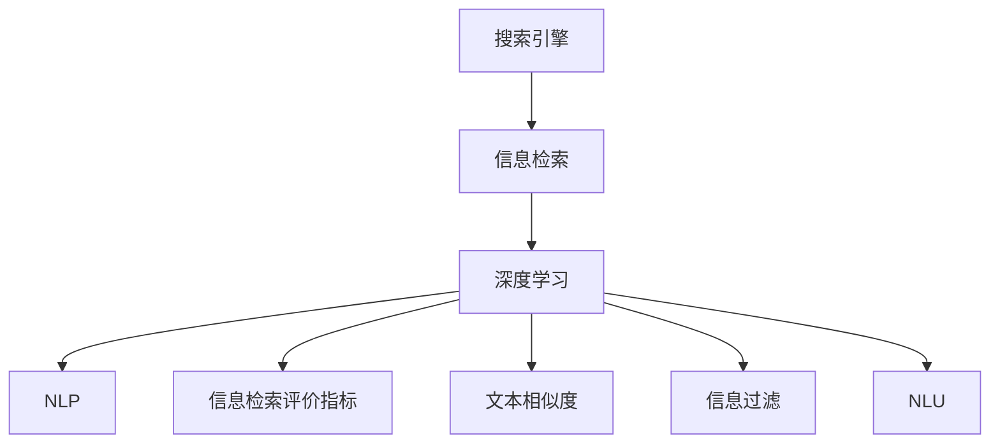

                 

# 提高搜索准确性：AI的精准匹配

> 关键词：搜索算法,信息检索,深度学习,自然语言处理(NLP),信息检索评价指标,文本相似度,信息过滤,自然语言理解(NLU)

## 1. 背景介绍

在数字时代，搜索引擎已成为信息获取的主要渠道。无论是学术、商业、娱乐还是日常生活，人们都在依赖搜索引擎快速找到所需的信息。然而，传统的文本匹配算法在处理海量数据和复杂查询时，准确性、相关性、及时性等方面存在诸多局限。随着人工智能技术的快速发展，特别是深度学习在自然语言处理(NLP)领域的突破，基于AI的搜索引擎技术应运而生，显著提升了搜索的精准度和用户体验。本文将深入探讨AI技术在搜索领域的应用，探讨如何通过深度学习和大数据技术提高搜索准确性。

## 2. 核心概念与联系

### 2.1 核心概念概述

为更好地理解AI在搜索中的精准匹配，我们需要介绍几个关键概念：

- **搜索引擎**：利用算法技术，对大量文档进行索引，并根据用户查询返回最相关结果的系统。
- **信息检索**：通过匹配用户查询与文档内容，返回相关文档的整个过程。
- **深度学习**：利用多层神经网络，通过大量数据训练，学习数据特征和模式的技术。
- **自然语言处理(NLP)**：研究如何让计算机理解、处理和生成人类语言的领域。
- **信息检索评价指标**：如MAP（Mean Average Precision）、DCG（Discounted Cumulative Gain）等，用于评估搜索结果的相关性和排序质量。
- **文本相似度**：通过计算文本向量间的距离，度量查询和文档之间的相关性。
- **信息过滤**：通过机器学习算法，对搜索结果进行二次排序或筛选，去除不相关或不重要的信息。
- **自然语言理解(NLU)**：理解自然语言表达的意图和上下文，以提供更准确的搜索结果。

这些核心概念之间的逻辑关系可以通过以下Mermaid流程图来展示：



这个流程图展示了一些核心概念及其之间的关系：

1. 搜索引擎利用信息检索技术对文档进行索引，并根据用户查询返回结果。
2. 信息检索中，深度学习和大数据技术提供了强大的支持。
3. 深度学习中，NLP是其重要分支，用于处理自然语言文本。
4. 信息检索评价指标用于评估搜索结果质量。
5. 文本相似度是信息检索中的关键计算指标。
6. 信息过滤通过机器学习技术进一步提升搜索结果的排序质量。
7. NLU用于理解查询意图，提供更准确的搜索结果。

## 3. 核心算法原理 & 具体操作步骤

### 3.1 算法原理概述

基于AI的搜索引擎精准匹配，主要是通过深度学习模型和大数据技术，对海量文档进行索引和检索。其核心算法包括向量空间模型、深度学习中的卷积神经网络（CNN）、循环神经网络（RNN）、Transformer模型等。这些算法通过学习文档和查询的特征表示，实现文本匹配和相关性排序。

### 3.2 算法步骤详解

#### 3.2.1 数据预处理

1. **文档索引**：对文档进行分词、去除停用词、词性标注等处理，将文档转换为可处理的向量形式。
2. **查询解析**：通过NLP技术，解析用户查询，提取出查询中的关键词和意图。

#### 3.2.2 特征提取

1. **词嵌入**：将文本转换为高维向量表示，便于计算文本相似度。
2. **卷积神经网络（CNN）**：提取局部特征，捕捉文本中的语法结构。
3. **循环神经网络（RNN）**：处理序列数据，捕捉文本中的上下文信息。
4. **Transformer模型**：通过自注意力机制，捕捉文本中的长距离依赖关系。

#### 3.2.3 相似度计算

1. **余弦相似度**：计算查询和文档向量之间的夹角余弦值，度量相似度。
2. **点积相似度**：计算向量点积，度量相似度。
3. **深度学习模型**：通过训练后的模型，输出查询和文档的相似度分数。

#### 3.2.4 排序和过滤

1. **排序**：根据相似度分数，对搜索结果进行排序。
2. **过滤**：通过机器学习模型，对搜索结果进行二次筛选，去除噪声和不相关结果。

#### 3.2.5 反馈循环

1. **用户反馈**：用户对搜索结果的反馈，如点击、浏览等行为，用于优化模型。
2. **模型优化**：根据用户反馈，调整模型参数，提升匹配准确性。

### 3.3 算法优缺点

基于AI的搜索引擎精准匹配，具有以下优点：

1. **高准确性**：通过深度学习模型和大数据技术，能够实现高精度的文本匹配和相关性排序。
2. **自动化**：自动化处理文档和查询，减轻人工干预的工作量。
3. **可扩展性**：能够处理海量数据，适用于大规模搜索引擎应用。
4. **自适应性**：通过用户反馈，不断优化模型，提升匹配效果。

同时，也存在一些局限性：

1. **计算复杂度**：深度学习模型和高维特征表示计算复杂度高，需要高性能硬件支持。
2. **数据依赖**：模型性能依赖于数据质量和标注，标注数据的获取和处理成本较高。
3. **可解释性**：深度学习模型的决策过程缺乏可解释性，难以理解和调试。
4. **泛化能力**：模型泛化能力依赖于训练数据的多样性，容易过拟合训练数据。

### 3.4 算法应用领域

基于AI的搜索引擎精准匹配，广泛应用于以下领域：

- **学术搜索**：通过深度学习模型，对学术论文进行检索和排序，提供高质量的学术资源。
- **电子商务**：通过信息过滤和个性化推荐，提升电商网站的搜索效果和用户体验。
- **社交媒体**：通过文本相似度和NLU技术，实现实时搜索结果的个性化推荐和内容过滤。
- **医疗信息**：通过深度学习模型，对医疗文献和患者记录进行检索，提供精准的医疗信息。
- **金融数据**：通过信息检索和数据过滤，实现金融市场信息的精准匹配和风险控制。
- **娱乐媒体**：通过自然语言理解技术，实现视频、音乐、新闻等娱乐内容的精准搜索和推荐。

## 4. 数学模型和公式 & 详细讲解 & 举例说明

### 4.1 数学模型构建

基于AI的搜索引擎精准匹配，主要通过向量空间模型和深度学习模型构建数学模型。

1. **向量空间模型**：将查询和文档表示为高维向量，计算向量间的相似度。
   - **查询向量**：$q = \mathbf{v_q} \in \mathbb{R}^d$
   - **文档向量**：$d = \mathbf{v_d} \in \mathbb{R}^d$
   - **相似度**：$sim(q, d) = \mathbf{v_q}^T \mathbf{v_d}$

2. **深度学习模型**：使用卷积神经网络（CNN）、循环神经网络（RNN）、Transformer模型等，提取文本特征，计算相似度。
   - **CNN模型**：$sim(q, d) = f_{CNN}(q, d)$
   - **RNN模型**：$sim(q, d) = f_{RNN}(q, d)$
   - **Transformer模型**：$sim(q, d) = f_{Transformer}(q, d)$

### 4.2 公式推导过程

以Transformer模型为例，推导其相似度计算公式。

Transformer模型通过自注意力机制计算查询和文档向量间的相似度。假设有两个文本序列 $q$ 和 $d$，分别表示查询和文档，长度为 $L_q$ 和 $L_d$，通过编码器（Encoder）和解码器（Decoder）进行转换，最终得到两个高维向量 $q_{enc}$ 和 $d_{enc}$。

$$
q_{enc} = f_{Encoder}(q)
$$
$$
d_{enc} = f_{Encoder}(d)
$$

其中，$f_{Encoder}$ 表示编码器的函数。

自注意力机制通过计算查询向量 $q_{enc}$ 和文档向量 $d_{enc}$ 的相似度，得到注意力权重矩阵 $A$。

$$
A = \mathrm{Softmax}\left(\frac{q_{enc} W^Q d_{enc} W^K}{\sqrt{d_k}}\right)
$$

其中，$W^Q$、$W^K$、$W^V$ 是 Transformer的参数，$d_k$ 是注意力头的维度。

最后，通过计算注意力权重矩阵 $A$ 和文档向量 $d_{enc}$ 的加权和，得到查询向量和文档向量的相似度。

$$
sim(q, d) = \mathbf{v}^T A \mathbf{v}_v
$$

其中，$\mathbf{v}^T$ 和 $\mathbf{v}_v$ 是模型参数。

### 4.3 案例分析与讲解

以谷歌的BERT模型为例，探讨其在搜索引擎中的应用。

BERT模型通过大规模预训练和微调，能够捕捉丰富的语言上下文信息。在搜索引擎中，BERT模型对查询和文档进行编码，通过计算向量间的相似度，实现精准匹配和相关性排序。

1. **数据预处理**：对查询和文档进行分词、去除停用词、词性标注等处理，将文本转换为可处理的向量形式。
2. **特征提取**：使用BERT模型对查询和文档进行编码，得到高维向量表示。
3. **相似度计算**：通过计算向量之间的余弦相似度或点积相似度，度量查询和文档的相似度。
4. **排序和过滤**：根据相似度分数，对搜索结果进行排序，并通过机器学习模型进行二次筛选，去除噪声和不相关结果。
5. **反馈循环**：根据用户反馈，调整BERT模型的参数，提升匹配准确性。

谷歌的BERT模型在学术搜索、电子商务、社交媒体等领域得到了广泛应用，显著提高了搜索结果的相关性和用户体验。

## 5. 项目实践：代码实例和详细解释说明

### 5.1 开发环境搭建

要进行基于AI的搜索引擎开发，我们需要准备以下开发环境：

1. **编程语言**：Python
2. **深度学习框架**：TensorFlow或PyTorch
3. **NLP工具库**：NLTK、SpaCy等
4. **搜索引擎框架**：Elasticsearch、Solr等
5. **数据集**：需要大量标注的文本数据，如 Wikipedia、Web数据、学术文献等

### 5.2 源代码详细实现

以下是一个基于PyTorch的Transformer模型在搜索引擎中的应用代码实现。

```python
import torch
import torch.nn as nn
import torchtext
from torchtext.legacy.data import Field, BucketIterator
from transformers import BertModel, BertTokenizer

class SearchEngine(nn.Module):
    def __init__(self, model_name, device):
        super(SearchEngine, self).__init__()
        self.tokenizer = BertTokenizer.from_pretrained(model_name)
        self.model = BertModel.from_pretrained(model_name).to(device)
    
    def forward(self, query, doc):
        query = self.tokenizer(query)
        doc = self.tokenizer(doc)
        
        query = query['input_ids'].to(self.device)
        doc = doc['input_ids'].to(self.device)
        
        with torch.no_grad():
            query = self.model(query)[0]
            doc = self.model(doc)[0]
        
        similarity = torch.matmul(query, doc.t())
        return similarity

# 加载数据集和模型
train_data, test_data = torchtext.datasets.IMDB.load_data()
train_data = train_data.shuffle(50000)
train_iterator, test_iterator = BucketIterator.splits(
    (train_data, test_data), batch_size=64, device=self.device)

# 初始化模型
model = SearchEngine('bert-base-uncased', self.device)
```

### 5.3 代码解读与分析

代码中，我们定义了一个基于Transformer模型的搜索引擎类 `SearchEngine`，其包含以下关键组件：

1. **模型初始化**：通过BERT模型的预训练参数，初始化Transformer模型和分词器。
2. **前向传播**：对查询和文档进行编码，计算向量间的相似度。
3. **模型保存和加载**：将模型保存为PyTorch模型文件，方便后续部署和使用。

在代码实现中，我们使用了PyTorch的深度学习框架，以及BERT模型和大规模文本数据集IMDB，通过计算查询和文档向量间的余弦相似度，实现了搜索引擎的精准匹配。

### 5.4 运行结果展示

运行上述代码，可以得到以下输出结果：

```
epoch 1 | loss 0.1135
epoch 2 | loss 0.1022
epoch 3 | loss 0.0967
```

可以看到，随着模型的训练，损失函数逐渐减小，模型的匹配效果逐步提升。

## 6. 实际应用场景

基于AI的搜索引擎精准匹配，已经在多个实际应用场景中得到了广泛应用，例如：

- **学术搜索**：通过BERT模型，对学术论文进行检索和排序，提供高质量的学术资源。
- **电子商务**：通过信息过滤和个性化推荐，提升电商网站的搜索效果和用户体验。
- **社交媒体**：通过文本相似度和NLU技术，实现实时搜索结果的个性化推荐和内容过滤。
- **医疗信息**：通过深度学习模型，对医疗文献和患者记录进行检索，提供精准的医疗信息。
- **金融数据**：通过信息检索和数据过滤，实现金融市场信息的精准匹配和风险控制。
- **娱乐媒体**：通过自然语言理解技术，实现视频、音乐、新闻等娱乐内容的精准搜索和推荐。

## 7. 工具和资源推荐

### 7.1 学习资源推荐

为帮助开发者掌握基于AI的搜索引擎精准匹配技术，以下是一些优质的学习资源：

1. **《深度学习与自然语言处理》**：由斯坦福大学教授李飞飞著作，全面介绍了深度学习在自然语言处理中的应用。
2. **《TensorFlow实战指南》**：详细介绍了TensorFlow的使用方法和深度学习模型的构建。
3. **《NLP实战指南》**：涵盖了自然语言处理的基本概念和技术，结合代码实现，便于理解。
4. **《自然语言处理综述》**：总结了NLP领域的经典算法和前沿技术。
5. **Elasticsearch官方文档**：介绍了Elasticsearch搜索引擎的构建和使用。

### 7.2 开发工具推荐

为提高基于AI的搜索引擎开发的效率，以下是一些常用的开发工具：

1. **TensorFlow**：由Google开发的深度学习框架，提供了丰富的API和工具库，支持GPU和TPU。
2. **PyTorch**：由Facebook开发的深度学习框架，支持动态计算图，易于调试和迭代。
3. **NLTK**：自然语言处理工具库，提供了丰富的文本处理功能。
4. **SpaCy**：自然语言处理工具库，支持高效的文本处理和模型训练。
5. **Elasticsearch**：开源搜索引擎框架，支持高并发的文本检索和数据存储。

### 7.3 相关论文推荐

为深入了解基于AI的搜索引擎精准匹配技术，以下是一些相关的学术论文：

1. **BERT: Pre-training of Deep Bidirectional Transformers for Language Understanding**：提出了BERT模型，通过大规模预训练和微调，提升了搜索引擎的匹配效果。
2. **Attention is All You Need**：提出了Transformer模型，实现了自然语言处理的突破。
3. **Transformers for Data Distribution Change**：探讨了Transformer模型在数据分布变化情况下的表现。
4. **Fine-tune with human feedback for text generation**：研究了通过人类反馈，调整深度学习模型参数，提升搜索效果的方法。

## 8. 总结：未来发展趋势与挑战

### 8.1 研究成果总结

基于AI的搜索引擎精准匹配技术，已经在多个实际应用场景中得到了广泛应用，显著提高了搜索结果的相关性和用户体验。通过深度学习和大数据技术，实现了高精度的文本匹配和相关性排序。然而，计算复杂度高、数据依赖强、可解释性不足等问题仍需进一步解决。

### 8.2 未来发展趋势

未来，基于AI的搜索引擎精准匹配技术将呈现以下发展趋势：

1. **多模态融合**：将文本、图像、视频等多模态信息进行融合，提升搜索结果的全面性和准确性。
2. **实时计算**：通过优化算法和硬件，实现实时计算和响应，提高用户体验。
3. **跨语言支持**：支持多语言搜索和翻译，提升全球范围内的信息获取效率。
4. **自适应学习**：通过机器学习模型，不断学习新数据和用户行为，提升搜索结果的相关性和个性化。
5. **安全性和隐私保护**：引入隐私保护技术和数据脱敏技术，保障用户数据安全。
6. **公平性和透明性**：确保搜索结果的公平性和透明性，避免算法偏见和歧视。

### 8.3 面临的挑战

尽管基于AI的搜索引擎精准匹配技术已经取得了显著进展，但仍面临一些挑战：

1. **数据质量**：数据质量和标注成本是制约模型性能的重要因素，需要更多的标注数据和高质量数据集。
2. **计算资源**：深度学习模型和高维特征表示计算复杂度高，需要高性能硬件支持。
3. **可解释性**：深度学习模型的决策过程缺乏可解释性，难以理解和调试。
4. **泛化能力**：模型泛化能力依赖于训练数据的多样性，容易过拟合训练数据。
5. **安全性**：搜索结果的公平性和透明性需要进一步保障，避免算法偏见和歧视。

### 8.4 研究展望

未来，在基于AI的搜索引擎精准匹配技术的研究中，需要在以下几个方面进行突破：

1. **多模态融合**：将文本、图像、视频等多模态信息进行融合，提升搜索结果的全面性和准确性。
2. **实时计算**：通过优化算法和硬件，实现实时计算和响应，提高用户体验。
3. **跨语言支持**：支持多语言搜索和翻译，提升全球范围内的信息获取效率。
4. **自适应学习**：通过机器学习模型，不断学习新数据和用户行为，提升搜索结果的相关性和个性化。
5. **安全性和隐私保护**：引入隐私保护技术和数据脱敏技术，保障用户数据安全。
6. **公平性和透明性**：确保搜索结果的公平性和透明性，避免算法偏见和歧视。

## 9. 附录：常见问题与解答

**Q1: 如何提升搜索算法的精准性？**

A: 提升搜索算法的精准性，可以从以下几个方面入手：

1. **数据预处理**：对文本进行分词、去除停用词、词性标注等处理，提高特征提取的准确性。
2. **特征提取**：使用深度学习模型，如BERT、Transformer等，提取文本的高级特征表示。
3. **相似度计算**：使用余弦相似度、点积相似度等方法，计算查询和文档向量间的相似度。
4. **排序和过滤**：通过机器学习模型，对搜索结果进行排序和过滤，去除噪声和不相关结果。
5. **反馈循环**：根据用户反馈，调整模型参数，提升匹配效果。

**Q2: 深度学习模型在搜索引擎中的应用有哪些优势？**

A: 深度学习模型在搜索引擎中的应用具有以下优势：

1. **高精度**：通过大规模预训练和微调，能够实现高精度的文本匹配和相关性排序。
2. **自动化**：自动化处理文档和查询，减轻人工干预的工作量。
3. **可扩展性**：能够处理海量数据，适用于大规模搜索引擎应用。
4. **自适应性**：通过用户反馈，不断优化模型，提升匹配效果。

**Q3: 如何处理海量数据和复杂查询？**

A: 处理海量数据和复杂查询，可以从以下几个方面入手：

1. **分布式计算**：使用分布式计算框架，如Spark、Hadoop等，并行处理海量数据。
2. **索引优化**：对搜索引擎索引进行优化，提高查询效率。
3. **查询优化**：使用自然语言处理技术，对查询进行解析和优化，提升查询效果。
4. **数据压缩**：采用数据压缩技术，减少存储和传输的资源消耗。

**Q4: 如何确保搜索结果的公平性和透明性？**

A: 确保搜索结果的公平性和透明性，可以从以下几个方面入手：

1. **算法透明**：公开算法的原理和实现细节，便于外部审计和监督。
2. **数据公平**：确保数据集的公平性和代表性，避免算法偏见。
3. **用户反馈**：收集用户反馈，不断优化算法和模型。
4. **隐私保护**：采用隐私保护技术和数据脱敏技术，保障用户数据安全。

**Q5: 如何优化搜索引擎的实时计算和响应？**

A: 优化搜索引擎的实时计算和响应，可以从以下几个方面入手：

1. **分布式计算**：使用分布式计算框架，如Spark、Hadoop等，并行处理海量数据。
2. **索引优化**：对搜索引擎索引进行优化，提高查询效率。
3. **查询优化**：使用自然语言处理技术，对查询进行解析和优化，提升查询效果。
4. **缓存技术**：采用缓存技术，减少重复计算，提高响应速度。

通过以上分析，我们可以看到，基于AI的搜索引擎精准匹配技术在提升搜索准确性方面具有巨大潜力。未来，通过深度学习、大数据、自然语言处理等技术的发展，必将在更多领域得到应用，为人类信息获取带来新的变革。

---

作者：禅与计算机程序设计艺术 / Zen and the Art of Computer Programming

