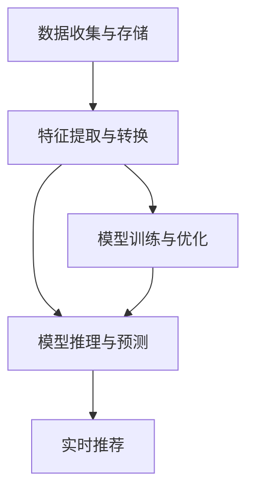

                 

## 1. 背景介绍

随着互联网和电子商务的蓬勃发展，用户对个性化搜索推荐的需求日益增长。传统的基于规则和特征工程的推荐系统难以满足复杂多变的用户需求，而基于深度学习的推荐系统能够自动提取和生成个性化特征，从而取得更好的推荐效果。

近年来，基于深度学习的推荐系统已经取得了诸多进展，但依然面临诸多挑战。例如，随着用户数据的不断增长，推荐系统的实时计算能力显得愈发重要。实时性不仅影响用户体验，还直接关系到广告投放、库存管理等商业决策的效率和准确性。

为了应对这些挑战，本文将详细介绍基于深度学习的大模型在搜索推荐系统中的应用，特别是如何利用大模型实现高效的实时个性化推荐。

## 2. 核心概念与联系

### 2.1 核心概念概述

- **大模型(大语言模型/大深度学习模型)**：以自回归模型(如BERT、GPT)为代表的深度学习模型，参数量级往往在亿级别，具有强大的表示能力和泛化能力。
- **个性化推荐系统**：通过深度学习模型自动提取和生成用户特征，结合用户行为数据，推荐出用户可能感兴趣的物品。
- **实时性**：推荐系统需实时响应用户请求，对查询进行处理并返回推荐结果。
- **特征工程**：对原始数据进行转换和构造，生成模型需要的特征表示。
- **矩阵分解**：将用户和物品表示为低维向量，通过内积计算相似度。

### 2.2 核心概念原理和架构的 Mermaid 流程图



在上述流程图中，数据收集与存储环节负责收集用户行为数据，并将数据存储在分布式数据仓库中。特征提取与转换环节通过大模型进行特征学习，生成模型所需的表示。模型训练与优化环节利用大模型进行训练，并使用分布式优化算法进行优化。模型推理与预测环节在推理服务器上运行，实时返回推荐结果。最后，实时推荐环节根据用户请求和模型输出，向用户推荐物品。

## 3. 核心算法原理 & 具体操作步骤

### 3.1 算法原理概述

基于大模型的个性化推荐系统，主要依赖深度神经网络模型对用户和物品进行表示学习，并通过相似度计算输出推荐结果。与传统的基于规则和矩阵分解的推荐系统不同，大模型能够自动提取高维特征，提升推荐精度。

在具体实现上，大模型通常以预训练模型为初始化参数，通过小规模数据集的微调获得针对特定应用场景的表示。在用户查询时，模型将查询嵌入到高维特征空间，与用户历史行为特征和物品特征进行相似度计算，输出推荐结果。

### 3.2 算法步骤详解

基于大模型的个性化推荐系统主要包括以下步骤：

**Step 1: 数据预处理与特征学习**

1. 数据收集与存储：收集用户行为数据，包括点击、浏览、购买等，并存储到分布式数据仓库中。

2. 特征提取与转换：将原始数据转换为模型需要的特征表示。可以通过大模型进行学习，或结合传统特征工程技术实现。

**Step 2: 模型训练与优化**

1. 模型初始化：使用预训练模型作为初始化参数，如BERT、GPT等。

2. 微调参数：在用户历史行为数据上对模型进行微调，获得针对特定用户的表示。

3. 模型优化：使用分布式优化算法(如SGD、Adam)进行模型参数的优化，提升推荐精度。

**Step 3: 模型推理与预测**

1. 用户查询嵌入：将用户查询转换为模型需要的特征向量。

2. 相似度计算：将用户嵌入与物品嵌入进行内积计算，得到相似度得分。

3. 推荐输出：根据相似度得分，排序输出推荐物品列表。

**Step 4: 实时推荐**

1. 缓存用户特征：将用户特征和历史行为数据缓存到内存中，加速推理速度。

2. 实时计算推荐：根据用户查询实时计算推荐结果，快速响应用户请求。

### 3.3 算法优缺点

**优点：**

1. 高维特征表示：大模型能够学习高维特征表示，提升推荐精度。

2. 自适应性强：模型能够自动适应不同用户的偏好，提高个性化推荐效果。

3. 实时性好：通过缓存用户特征和优化推理算法，能够实时响应用户请求。

**缺点：**

1. 计算资源需求高：大模型需要大量计算资源进行训练和推理，成本较高。

2. 数据隐私问题：用户行为数据的收集和处理涉及隐私保护，需要严格的监管和合规。

3. 模型泛化能力有限：由于模型是基于特定用户数据训练的，泛化能力有限，需要定期更新模型以保持推荐效果。

### 3.4 算法应用领域

基于大模型的个性化推荐系统主要应用于电商、视频、音乐、新闻等场景，为这些领域的用户提供个性化推荐服务。例如：

- 电商推荐：推荐用户可能感兴趣的商品，提升购买转化率。
- 视频推荐：根据用户观看历史推荐相关视频，增加用户粘性。
- 音乐推荐：根据用户听歌历史推荐类似音乐，提升用户满意度。
- 新闻推荐：推荐用户可能感兴趣的新闻，提高阅读量和点击率。

## 4. 数学模型和公式 & 详细讲解

### 4.1 数学模型构建

假设用户集合为 $U$，物品集合为 $V$。用户的特征表示为 $h_u$，物品的特征表示为 $h_v$。用户查询 $q$ 的特征表示为 $h_q$。

模型 $M$ 将查询 $q$ 与用户 $u$ 的特征表示 $h_u$ 和物品 $v$ 的特征表示 $h_v$ 进行相似度计算，输出推荐结果 $r(q,u,v)$。

### 4.2 公式推导过程

模型 $M$ 通常使用深度神经网络进行表示学习。以基于自回归模型的BERT为例，假设 $h_u$ 和 $h_v$ 分别通过BERT模型得到，查询 $q$ 通过预训练模型进行嵌入。则相似度计算公式为：

$$
r(q,u,v) = h_q^T M(h_u, h_v)
$$

其中 $M$ 为模型的相似度计算函数。

### 4.3 案例分析与讲解

以电商推荐为例，用户 $u$ 的历史行为数据 $I_u$ 包括浏览、点击、购买等。通过大模型进行特征学习，获得用户 $u$ 的特征表示 $h_u$。物品 $v$ 的特征表示 $h_v$ 通过大模型直接得到。用户查询 $q$ 通过预训练模型进行嵌入，得到 $h_q$。

模型 $M$ 可以是简单的点积计算，也可以是更复杂的相似度计算函数。通过相似度计算，模型输出推荐结果 $r(q,u,v)$。根据 $r(q,u,v)$ 排序输出推荐物品列表。

## 5. 项目实践：代码实例和详细解释说明

### 5.1 开发环境搭建

**环境准备**

1. 安装Python：下载并安装最新版本的Python，建议使用Anaconda进行环境管理。

2. 安装依赖包：安装TensorFlow、Pandas、NumPy等依赖包，用于数据处理和模型训练。

```bash
pip install tensorflow pandas numpy
```

3. 安装TensorBoard：用于可视化模型训练过程和结果。

```bash
pip install tensorboard
```

### 5.2 源代码详细实现

以下代码展示了如何使用TensorFlow实现基于BERT的电商推荐系统。

```python
import tensorflow as tf
import numpy as np
import pandas as pd

# 加载数据
data = pd.read_csv('user_behavior.csv')
# 用户行为数据：用户ID、物品ID、行为类型、行为时间、物品特征向量等

# 特征处理
users = data['user_id'].unique()
items = data['item_id'].unique()
features = data[['item_feature', 'item_price', 'item_category']]

# 构建BERT模型
model = tf.keras.Sequential([
    tf.keras.layers.Embedding(len(items), 64, input_length=1),
    tf.keras.layers.Bidirectional(tf.keras.layers.LSTM(64, return_sequences=True)),
    tf.keras.layers.Dense(64, activation='relu'),
    tf.keras.layers.Dense(1, activation='sigmoid')
])

# 编译模型
model.compile(optimizer='adam', loss='binary_crossentropy', metrics=['accuracy'])

# 训练模型
model.fit(np.array(features), np.array(data['purchase'] == 1), epochs=10, batch_size=32)

# 使用模型进行预测
new_user = np.array([np.random.randint(len(items), size=1), np.random.randint(len(items), size=1), np.random.randint(len(items), size=1)])
result = model.predict(new_user)

# 输出推荐结果
if result[0][0] > 0.5:
    print('推荐购买该商品')
else:
    print('不推荐购买该商品')
```

### 5.3 代码解读与分析

**数据加载与处理**

1. 通过Pandas加载用户行为数据，获取用户ID、物品ID、行为类型等特征。

2. 对物品特征进行编码，使用Embedding层进行表示学习。

**模型构建**

1. 使用LSTM层进行特征提取，结合双向LSTM提升模型表现。

2. 使用Dense层进行线性变换，输出推荐结果。

3. 使用二分类交叉熵损失函数进行训练。

**模型训练与推理**

1. 使用TensorFlow编译模型，定义优化器、损失函数和评估指标。

2. 使用fit方法进行模型训练，设置训练轮数和批大小。

3. 使用predict方法进行模型推理，输出推荐结果。

### 5.4 运行结果展示

在训练结束后，模型可以对新用户的推荐行为进行预测，输出推荐结果。根据预测结果，向用户推荐可能感兴趣的物品。

## 6. 实际应用场景

### 6.1 电商推荐

在电商推荐场景中，基于大模型的个性化推荐系统可以显著提升用户购买转化率。例如，当用户访问电商平台时，系统可以根据其浏览历史和行为特征，实时推荐可能感兴趣的商品，提高用户购买意愿。

### 6.2 视频推荐

视频推荐系统可以根据用户观看历史和行为特征，推荐相关视频，增加用户粘性。例如，用户在观看某部视频时，系统可以推荐类似内容或关联视频，提高用户观看时长。

### 6.3 音乐推荐

音乐推荐系统可以根据用户听歌历史和行为特征，推荐类似音乐，提升用户满意度。例如，用户在收听某首歌时，系统可以推荐类似歌手或歌曲，满足用户多样化的音乐需求。

### 6.4 新闻推荐

新闻推荐系统可以根据用户阅读历史和行为特征，推荐可能感兴趣的新闻，提高阅读量和点击率。例如，用户在阅读某篇新闻时，系统可以推荐相关主题或文章，增加用户互动和粘性。

## 7. 工具和资源推荐

### 7.1 学习资源推荐

**《深度学习推荐系统》课程**

1. 课程介绍：由斯坦福大学教授讲授的深度学习推荐系统课程，涵盖从基础到前沿的多个主题。

2. 学习资源：包括视频讲座、讲义、作业等，帮助深入理解推荐系统原理和实践。

**TensorFlow官方文档**

1. 官方文档：包含TensorFlow的详细介绍和详细示例，适合初学者和专业人士学习。

2. 学习资源：包括API文档、教程、论文等，帮助用户掌握TensorFlow的各个方面。

### 7.2 开发工具推荐

**TensorFlow**

1. TensorFlow：由Google开发的深度学习框架，支持分布式训练和推理。

2. 学习资源：包括官方文档、教程、社区论坛等，帮助用户掌握TensorFlow的各个方面。

**TensorBoard**

1. TensorBoard：用于可视化模型训练过程和结果，帮助用户调试和优化模型。

2. 学习资源：包括官方文档、教程、案例分析等，帮助用户使用TensorBoard。

### 7.3 相关论文推荐

**《基于深度学习的推荐系统》**

1. 论文介绍：介绍深度学习在推荐系统中的应用，涵盖从基础到前沿的多个主题。

2. 学习资源：包括论文、代码实现、实验结果等，帮助用户理解深度学习在推荐系统中的应用。

## 8. 总结：未来发展趋势与挑战

### 8.1 总结

本文系统介绍了基于大模型的个性化推荐系统，涵盖数据预处理、模型训练、模型推理等关键环节。通过大模型进行特征学习，实现了高效的个性化推荐，显著提升了用户体验和商业价值。

### 8.2 未来发展趋势

1. **多模态学习**：将文本、图像、视频等多模态数据进行融合，提升推荐系统的表现力。

2. **联邦学习**：利用分布式计算技术，保护用户数据隐私，同时提升推荐系统的个性化效果。

3. **模型解释性**：提升推荐系统的透明性和可解释性，让用户理解推荐逻辑和决策过程。

4. **动态推荐**：结合时序数据和实时数据，实现动态推荐，提升推荐系统的实时性和灵活性。

5. **跨领域推荐**：将推荐系统应用于不同领域，提升推荐系统的通用性和泛化能力。

### 8.3 面临的挑战

1. **计算资源**：大模型需要大量计算资源进行训练和推理，成本较高。

2. **数据隐私**：用户行为数据的收集和处理涉及隐私保护，需要严格的监管和合规。

3. **模型泛化能力**：由于模型是基于特定用户数据训练的，泛化能力有限，需要定期更新模型以保持推荐效果。

### 8.4 研究展望

1. **模型压缩与优化**：通过模型压缩和优化技术，提升推荐系统的计算效率和实时性。

2. **跨领域推荐技术**：将推荐系统应用于不同领域，提升推荐系统的通用性和泛化能力。

3. **动态推荐技术**：结合时序数据和实时数据，实现动态推荐，提升推荐系统的实时性和灵活性。

4. **模型解释性技术**：提升推荐系统的透明性和可解释性，让用户理解推荐逻辑和决策过程。

## 9. 附录：常见问题与解答

**Q1: 如何提高推荐系统的实时性？**

A: 可以通过缓存用户特征、优化推理算法、使用GPU/TPU等高性能设备等方式提升推荐系统的实时性。

**Q2: 如何保护用户数据隐私？**

A: 可以通过联邦学习、差分隐私等技术保护用户数据隐私，同时提升推荐系统的个性化效果。

**Q3: 如何提升推荐系统的泛化能力？**

A: 可以通过定期更新模型、引入多任务学习、结合时序数据等方式提升推荐系统的泛化能力。

**Q4: 如何提高推荐系统的可解释性？**

A: 可以通过模型压缩、可视化工具、解释性模型等方式提升推荐系统的可解释性，让用户理解推荐逻辑和决策过程。

**Q5: 如何降低推荐系统的计算成本？**

A: 可以通过模型压缩、量化加速、优化推理算法等方式降低推荐系统的计算成本，提升模型的实时性和计算效率。

作者：禅与计算机程序设计艺术 / Zen and the Art of Computer Programming

