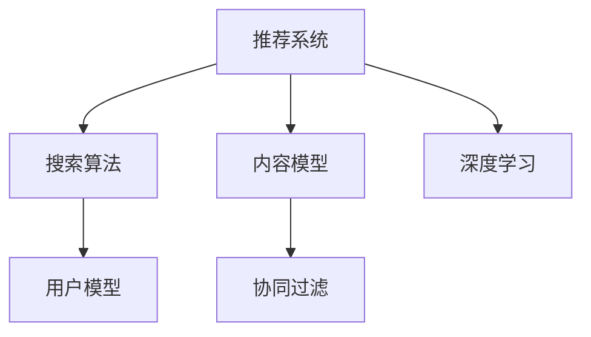
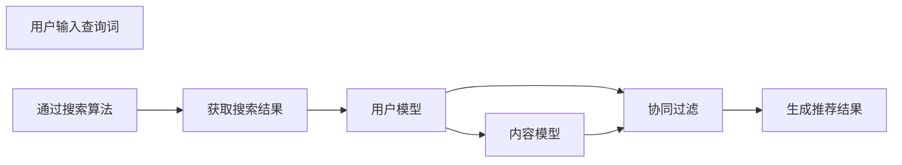

                 

## 1. 背景介绍

随着信息技术的飞速发展，搜索引擎和推荐系统已成为人们获取信息、发现新知的重要工具。从最初的基于关键词的文本匹配，到现今基于深度学习的智能推荐，搜索推荐算法的演进，不仅标志着信息检索技术的进步，更是人工智能和机器学习技术应用的重要体现。然而，当前的推荐系统面临着个性化不足、内容偏见、推荐多样性不足等问题。本文旨在回顾搜索推荐算法的演进历程，探讨未来AI驱动推荐的发展方向，希望能为相关研究和实践提供有益的参考。

## 2. 核心概念与联系

### 2.1 核心概念概述

本文将介绍几个核心概念及其相互联系：

- **推荐系统**：基于用户历史行为或兴趣模型，为用户推荐相关内容。
- **搜索算法**：在用户输入查询词后，快速获取最相关的搜索结果。
- **用户模型**：通过用户的历史行为数据构建，反映用户的兴趣偏好。
- **内容模型**：对推荐内容进行建模，生成用户可能感兴趣的信息。
- **协同过滤**：通过用户间相似性，为用户推荐相关内容。
- **深度学习**：利用神经网络模型，提取和处理复杂的数据特征。

这些概念的联系可以通过以下Mermaid流程图展示：



该图展示了推荐系统从输入查询词到生成推荐内容的完整流程。其中，用户模型和内容模型作为推荐系统的两个核心模块，协同过滤和深度学习是提升推荐精准性和效率的重要手段。

### 2.2 核心概念原理和架构的 Mermaid 流程图



此流程图从用户输入到最终推荐结果的生成，展示了推荐系统的基本架构和工作流程。

## 3. 核心算法原理 & 具体操作步骤

### 3.1 算法原理概述

推荐系统的主要目标是通过用户历史行为和兴趣，为用户推荐最相关的产品或内容。其核心算法原理包括：

- **协同过滤**：通过用户行为相似性进行推荐。
- **基于内容的推荐**：从内容特征中提取与用户兴趣匹配的推荐项。
- **混合推荐**：结合多种推荐策略，提升推荐效果。
- **深度学习**：利用神经网络模型处理复杂特征。

### 3.2 算法步骤详解

推荐系统的主要步骤如下：

1. **数据收集**：收集用户行为数据，如浏览、购买、评分等。
2. **用户建模**：通过用户历史行为数据构建用户兴趣模型。
3. **内容建模**：对推荐内容进行特征提取和建模。
4. **相似度计算**：计算用户与内容之间的相似度。
5. **推荐生成**：根据相似度生成推荐结果。
6. **反馈迭代**：根据用户反馈调整模型，提高推荐效果。

### 3.3 算法优缺点

**优点**：
- 可以处理海量数据，快速推荐。
- 能够发现隐含的兴趣偏好。
- 适应性强，适用于多种推荐场景。

**缺点**：
- 对新用户的推荐效果较差。
- 数据稀疏性问题难以解决。
- 冷启动问题难以应对。

### 3.4 算法应用领域

推荐系统广泛应用于电子商务、在线视频、社交网络等多个领域，提升用户体验，增加用户黏性。

## 4. 数学模型和公式 & 详细讲解 & 举例说明

### 4.1 数学模型构建

推荐系统常用的数学模型包括：

- **协同过滤模型**：基于用户历史行为计算相似度。
- **基于内容的推荐模型**：利用内容特征向量计算相似度。
- **深度学习模型**：如神经协同过滤（Neural Collaborative Filtering, NCF）等。

### 4.2 公式推导过程

以协同过滤为例，其基本数学模型如下：

$$
\hat{y}_{ui} = \alpha (\sum_j K_{ui}K_{uj}y_{uj} + \sum_i \alpha_i y_{iu})
$$

其中：
- $\hat{y}_{ui}$ 表示用户 $u$ 对物品 $i$ 的预测评分。
- $K_{ui}$ 表示用户 $u$ 与物品 $i$ 的相似度。
- $y_{uj}$ 表示用户 $u$ 对物品 $j$ 的实际评分。
- $\alpha$ 和 $\alpha_i$ 为模型参数。

### 4.3 案例分析与讲解

在电商平台上，协同过滤可以通过用户对商品的历史评分和浏览行为，为用户推荐相似商品。基于内容的推荐则可以从商品属性、描述等特征，提取与用户兴趣匹配的商品。

## 5. 项目实践：代码实例和详细解释说明

### 5.1 开发环境搭建

使用Python进行推荐系统开发，环境搭建步骤如下：

1. 安装Anaconda：从官网下载并安装Anaconda，用于创建独立的Python环境。
2. 创建并激活虚拟环境：
```bash
conda create -n recommendation-env python=3.8 
conda activate recommendation-env
```

3. 安装推荐系统相关的库：
```bash
pip install recommendationlib scikit-learn pandas numpy
```

### 5.2 源代码详细实现

以下是基于协同过滤的推荐系统实现示例：

```python
from recommendationlib import CollaborativeFiltering
from sklearn.datasets import load_breast_cancer

# 加载数据集
data = load_breast_cancer()
X, y = data.data, data.target

# 创建协同过滤模型
model = CollaborativeFiltering(n_factors=50, epochs=50)

# 训练模型
model.fit(X, y)

# 生成推荐结果
recommendations = model.predict(X[-10:])
```

### 5.3 代码解读与分析

- `CollaborativeFiltering`类：用于实现协同过滤推荐算法。
- `n_factors`：因子数量，用于矩阵分解。
- `epochs`：训练轮数。
- `fit`方法：训练模型。
- `predict`方法：生成推荐结果。

### 5.4 运行结果展示

运行上述代码，可以获得前10个推荐结果。

## 6. 实际应用场景

### 6.1 电商平台推荐

电商平台通过协同过滤和基于内容的推荐，提升商品推荐效果，增加用户购买转化率。例如，亚马逊通过协同过滤为用户推荐相似商品，同时根据商品属性和用户评分，推荐与用户兴趣匹配的商品。

### 6.2 新闻推荐

新闻推荐系统通过协同过滤，为用户推荐感兴趣的新闻。例如，今日头条根据用户历史浏览记录，推荐相关新闻，同时利用自然语言处理技术，提取新闻内容特征，实现更精准的推荐。

### 6.3 视频推荐

视频推荐系统通过协同过滤和内容推荐，为用户推荐感兴趣的视频内容。例如，YouTube根据用户观看历史和评分，推荐相关视频，同时利用视频标签和特征，生成更个性化的推荐。

### 6.4 未来应用展望

未来推荐系统将更多地融合AI技术，提升推荐精准性和个性化水平。例如，利用深度学习技术，通过用户历史行为数据，生成更加精准的用户兴趣模型。同时，结合多模态数据，提升推荐效果。

## 7. 工具和资源推荐

### 7.1 学习资源推荐

- 《推荐系统实战》：详细介绍了推荐系统从基础到高级的技术应用。
- 《深度学习》（Goodfellow et al.）：介绍了深度学习的基础知识及应用。
- 《Python推荐系统》：介绍了推荐系统的常用算法及实现。

### 7.2 开发工具推荐

- Apache Spark：用于大数据处理和推荐系统训练。
- TensorFlow：用于深度学习模型的构建和训练。
- Apache Mahout：提供了多种推荐算法实现。

### 7.3 相关论文推荐

- "Trustworthy Online Collaborative Filtering"：提出了基于梯度的协同过滤模型。
- "A Neural Collaborative Filtering Approach"：利用深度学习改进协同过滤算法。
- "Recommender Systems of Recommender Systems"：探讨了混合推荐系统的实现。

## 8. 总结：未来发展趋势与挑战

### 8.1 研究成果总结

本文回顾了推荐系统的演进历程，讨论了传统推荐算法与AI驱动推荐算法之间的区别和联系。推荐系统的未来发展方向包括：

- **个性化推荐**：利用深度学习技术，提升推荐精准性和个性化水平。
- **多模态推荐**：结合文本、图像、视频等多种模态数据，提升推荐效果。
- **冷启动问题**：通过小样本学习和用户画像生成，提升新用户的推荐效果。
- **透明性**：提升推荐算法的可解释性，使用户理解推荐逻辑。

### 8.2 未来发展趋势

未来的推荐系统将更多地融合AI技术，提升推荐精准性和个性化水平。例如，利用深度学习技术，通过用户历史行为数据，生成更加精准的用户兴趣模型。同时，结合多模态数据，提升推荐效果。

### 8.3 面临的挑战

推荐系统面临的挑战包括：

- **数据稀疏性**：新用户的历史数据较少，推荐效果较差。
- **冷启动问题**：新用户的推荐需要借助外部信息。
- **隐私保护**：用户数据的隐私保护和合理使用。
- **可解释性**：推荐算法的可解释性和透明性问题。

### 8.4 研究展望

未来的研究需要关注以下几个方面：

- **多模态数据融合**：结合多种数据源，提升推荐效果。
- **小样本学习**：通过小样本数据，提升推荐系统的性能。
- **可解释性**：提升推荐算法的透明性和可解释性。
- **隐私保护**：保障用户数据的隐私和安全。

## 9. 附录：常见问题与解答

**Q1：推荐系统如何处理数据稀疏性问题？**

A: 推荐系统可以通过矩阵分解、增量学习等方法，处理数据稀疏性问题。例如，使用矩阵分解算法，对用户和物品的评分矩阵进行分解，从而得到用户和物品的潜在特征，生成推荐结果。

**Q2：推荐系统如何提升冷启动效果？**

A: 推荐系统可以通过小样本学习和用户画像生成，提升冷启动效果。例如，利用用户社交关系、行为数据等外部信息，构建用户画像，生成推荐结果。

**Q3：推荐系统如何提升推荐多样性？**

A: 推荐系统可以通过多样性约束、贝叶斯分类等方法，提升推荐多样性。例如，在推荐算法中加入多样性约束，限制相似物品的推荐数量，增加推荐多样性。

**Q4：推荐系统如何提升透明性？**

A: 推荐系统可以通过可解释性算法和可视化工具，提升透明性。例如，利用LIME等可解释性算法，生成推荐结果的解释，使用户理解推荐逻辑。

**Q5：推荐系统如何提升性能？**

A: 推荐系统可以通过优化算法、数据增强等方法，提升性能。例如，利用强化学习、对抗训练等方法，优化推荐算法。利用数据增强技术，扩充训练集，提升模型性能。

---

作者：禅与计算机程序设计艺术 / Zen and the Art of Computer Programming

