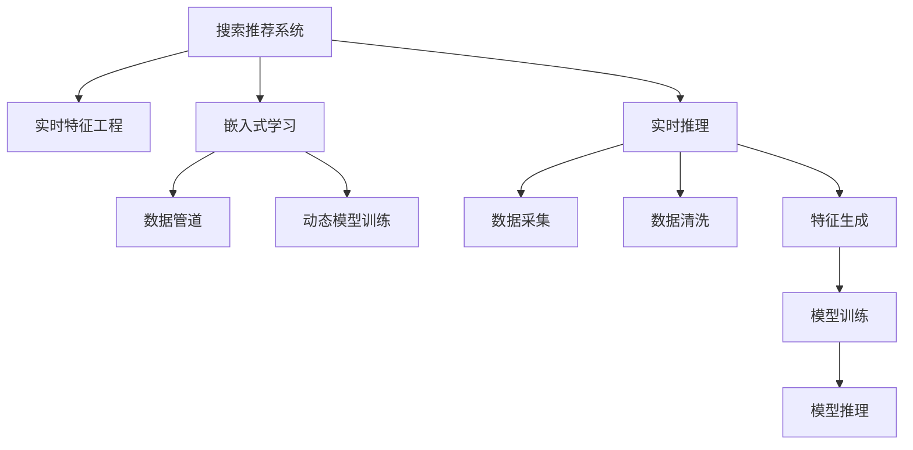

                 

# 搜索推荐系统中的实时特征工程技术

> 关键词：搜索推荐系统, 实时特征工程, 模型优化, 嵌入式学习, 数据管道, 特征处理, 动态模型训练, 实时应用场景

## 1. 背景介绍

### 1.1 问题由来

在互联网时代，信息爆炸带来丰富的数据资源，同时也使得信息检索和推荐任务变得更加复杂和挑战性。随着用户需求的个性化和多样性不断增长，传统的检索和推荐系统已经难以满足用户需求，需要不断引入新型的技术手段来提升系统性能。

实时特征工程技术，正是这一背景下孕育而生的新兴技术。通过实时处理和提取关键特征，在用户检索和推荐过程中，动态更新模型的输入，有效提升系统的响应速度和推荐准确率，是实现高效搜索推荐系统的重要手段。

### 1.2 问题核心关键点

实时特征工程的核心在于动态提取和更新模型的输入特征，并在实时应用场景中实现模型的高效训练和推理。关键点包括：

1. 实时数据采集与处理：高效采集实时数据，并进行有效的数据清洗和预处理。
2. 动态特征生成与提取：根据实时数据动态生成和提取关键特征。
3. 嵌入式学习与训练：将特征工程与模型训练深度集成，实现实时模型优化。
4. 动态模型部署与更新：实时部署和更新模型，支持动态推理。
5. 端到端数据管道：构建高效的数据处理和特征工程管道，支撑实时应用。

这些关键点共同构成了实时特征工程的核心，在搜索推荐系统中发挥着至关重要的作用。

## 2. 核心概念与联系

### 2.1 核心概念概述

为更好地理解实时特征工程技术，本节将介绍几个密切相关的核心概念：

- 搜索推荐系统(Search and Recommendation System)：指利用数据挖掘和机器学习技术，从大规模数据中提取有用信息，并提供符合用户需求的相关信息的技术系统。
- 实时特征工程(Real-time Feature Engineering)：指在实时应用场景中，通过动态生成和提取特征，提升系统性能和响应速度的过程。
- 嵌入式学习(Embedded Learning)：指将特征工程和模型训练深度集成，通过实时数据更新和特征生成，实现动态模型优化。
- 数据管道(Data Pipeline)：指从数据采集、预处理、特征提取到模型训练和推理的完整数据处理流程。
- 动态模型训练(Dynamic Model Training)：指在实时应用中，根据新数据动态更新模型参数，以适应新数据分布和用户需求的变化。
- 实时推理(Real-time Inference)：指在实时应用中，根据最新数据动态计算和推理模型输出，实现即时响应。

这些核心概念之间的逻辑关系可以通过以下Mermaid流程图来展示：



这个流程图展示搜索推荐系统中的核心概念及其之间的关系：

1. 搜索推荐系统通过实时特征工程动态生成和提取特征。
2. 嵌入式学习将特征工程与模型训练深度集成，实现实时模型优化。
3. 数据管道支撑数据采集、清洗、特征生成和模型推理的完整流程。
4. 动态模型训练根据实时数据动态更新模型参数，提升模型性能。
5. 实时推理根据最新数据动态计算模型输出，实现即时响应。

这些概念共同构成了实时特征工程在搜索推荐系统中的核心框架，使其能够在各种实时应用场景中发挥重要作用。

## 3. 核心算法原理 & 具体操作步骤
### 3.1 算法原理概述

实时特征工程技术，基于实时数据采集与处理、动态特征生成与提取、嵌入式学习与训练、动态模型部署与更新等核心环节，实现搜索推荐系统的优化和提升。其核心思想是：

1. **实时数据采集与处理**：高效采集实时数据，并进行有效的数据清洗和预处理。
2. **动态特征生成与提取**：根据实时数据动态生成和提取关键特征。
3. **嵌入式学习与训练**：将特征工程与模型训练深度集成，实现实时模型优化。
4. **动态模型部署与更新**：实时部署和更新模型，支持动态推理。
5. **端到端数据管道**：构建高效的数据处理和特征工程管道，支撑实时应用。

### 3.2 算法步骤详解

#### 3.2.1 实时数据采集与处理

**步骤1: 数据采集**
- 使用合适的数据源，实时采集用户的搜索和行为数据。例如，日志文件、数据库、API接口等。
- 确保数据源的稳定性和可靠性，避免数据采集中断。

**步骤2: 数据清洗与预处理**
- 对采集到的数据进行去重、去噪、过滤等处理，确保数据质量。
- 对缺失值、异常值进行处理，保证数据的完整性和准确性。
- 进行数据标准化和归一化处理，减少数据间的差异性。

#### 3.2.2 动态特征生成与提取

**步骤3: 特征选择**
- 根据任务需求和数据特点，选择关键特征。例如，用户的搜索历史、浏览行为、评分等。
- 使用特征选择算法（如递归特征消除、L1正则化等），去除冗余和无关特征。

**步骤4: 特征提取与生成**
- 对选定的特征进行提取和生成，转换为模型可接受的格式。例如，文本特征可以使用TF-IDF、Word2Vec等方法进行转换。
- 根据实时数据动态生成新的特征，例如时间戳、地理位置、用户行为等。

#### 3.2.3 嵌入式学习与训练

**步骤5: 模型训练**
- 使用嵌入式学习框架（如TensorFlow Embedding、PyTorch Embedding等），将特征工程和模型训练深度集成。
- 在实时数据上训练模型，更新模型参数，提升模型性能。

**步骤6: 动态模型更新**
- 使用在线学习算法（如在线梯度下降、自适应学习率等），动态更新模型参数。
- 通过增量训练或模型重组，实现模型的快速更新和优化。

#### 3.2.4 动态模型部署与更新

**步骤7: 模型部署**
- 使用部署工具（如TensorFlow Serving、Tune等），将训练好的模型部署到生产环境中。
- 根据应用场景选择合适的部署模式（如REST API、gRPC等）。

**步骤8: 动态模型更新**
- 实时接收新的数据，动态更新模型参数。
- 使用增量训练或模型重组，实现模型的快速更新和优化。

#### 3.2.5 端到端数据管道

**步骤9: 数据管道构建**
- 构建高效的数据处理和特征工程管道，包括数据采集、清洗、特征提取、模型训练和推理等环节。
- 使用分布式计算框架（如Apache Kafka、Apache Spark等），提高数据处理效率。

**步骤10: 数据管道优化**
- 对数据管道进行监控和优化，确保数据流动的稳定性和高效性。
- 使用数据管道调度工具（如Apache Airflow、Apache Flink等），实现数据处理流程的自动化管理。

### 3.3 算法优缺点

实时特征工程技术，相对于传统特征工程方法，具有以下优点：

1. 实时性高：能够在实时应用场景中动态生成和提取特征，提升系统响应速度和推荐准确率。
2. 可扩展性强：可以方便地扩展特征工程和模型训练的规模，适应大规模数据处理需求。
3. 鲁棒性好：能够处理噪声和异常数据，提高系统的稳定性和鲁棒性。
4. 灵活性强：可以根据实时数据动态更新模型，适应新数据分布和用户需求的变化。

然而，实时特征工程技术也存在一些缺点：

1. 复杂度高：实时特征工程需要在实时应用场景中动态处理数据，复杂度较高。
2. 资源消耗大：实时特征工程需要实时数据采集、清洗和预处理，资源消耗较大。
3. 模型维护难：实时特征工程中的模型更新和维护工作量大，需要持续投入。
4. 数据隐私风险：实时特征工程涉及实时数据处理，可能面临数据隐私和安全问题。

尽管存在这些局限性，但实时特征工程技术仍然在搜索推荐系统中发挥着重要作用，有助于实现高效、精准的搜索推荐服务。

### 3.4 算法应用领域

实时特征工程技术，已经在多个领域得到了广泛应用，例如：

- 电商推荐系统：根据用户搜索和浏览行为，动态生成商品推荐特征，提升推荐效果。
- 搜索引擎：根据用户查询历史，动态生成相关网页特征，提升搜索结果的准确率。
- 智能客服：根据用户对话历史，动态生成回答特征，提升智能客服的响应速度和准确性。
- 金融推荐系统：根据用户交易行为，动态生成金融产品特征，提升推荐效果和用户体验。
- 健康医疗：根据用户健康数据，动态生成个性化健康建议特征，提升健康管理效果。

除了上述这些经典应用外，实时特征工程技术还在更多领域中得到创新性的应用，如智慧城市、智能制造、智能交通等，为各行业的数字化转型升级提供新的技术支持。

## 4. 数学模型和公式 & 详细讲解  
### 4.1 数学模型构建

本节将使用数学语言对实时特征工程技术进行更加严格的刻画。

记实时数据集为 $D_t = \{(x_i, y_i)\}_{i=1}^N, x_i \in X, y_i \in Y$，其中 $x_i$ 为特征向量， $y_i$ 为标签。实时特征工程的目标是：

$$
\min_{f} \sum_{i=1}^N \ell(f(x_i), y_i)
$$

其中， $\ell$ 为损失函数，用于衡量模型输出与真实标签之间的差异。在实时应用中，模型的输入特征 $f(x_i)$ 是动态生成的，因此优化目标是动态的。

### 4.2 公式推导过程

以下是实时特征工程中常用的数学公式和推导过程：

**TF-IDF特征提取**
- 设 $x_i = \{x_{i1}, x_{i2}, ..., x_{ik}\}$，其中 $x_{ij}$ 表示第 $i$ 个样本的第 $j$ 个特征。
- TF-IDF特征提取公式为：
$$
f(x_i) = (w_{ij} \cdot f_{ij})_{j=1}^K
$$
其中 $f_{ij}$ 表示特征 $x_{ij}$ 的TF-IDF值， $w_{ij}$ 为权重。

**Word2Vec特征提取**
- 设 $x_i = \{w_1, w_2, ..., w_m\}$，其中 $w_j$ 表示单词或短语。
- Word2Vec特征提取公式为：
$$
f(x_i) = \{v_j\}_{j=1}^m
$$
其中 $v_j$ 表示单词或短语的Word2Vec嵌入向量。

**在线梯度下降算法**
- 在线梯度下降算法的更新公式为：
$$
\theta_{t+1} = \theta_t - \eta \nabla_{\theta}L(f(x_t), y_t)
$$
其中 $\eta$ 为学习率， $\nabla_{\theta}L(f(x_t), y_t)$ 为损失函数对参数 $\theta$ 的梯度。

**自适应学习率算法**
- 自适应学习率算法（如Adagrad、Adam等）可以通过调整学习率，避免梯度消失和爆炸，提高模型收敛速度。
- Adagrad学习率的更新公式为：
$$
\eta_t = \frac{\eta_0}{\sqrt{G_t + \epsilon}} + \frac{\eta_0}{G_t + \epsilon}
$$
其中 $G_t$ 为梯度平方和， $\epsilon$ 为常数，避免除零错误。

**增量训练算法**
- 增量训练算法通过逐步更新模型参数，实现快速模型更新。
- 增量训练的更新公式为：
$$
\theta_{t+1} = \theta_t + \alpha \Delta \theta_t
$$
其中 $\Delta \theta_t$ 为增量更新， $\alpha$ 为更新系数。

### 4.3 案例分析与讲解

#### 案例分析

**电商推荐系统**

电商推荐系统是实时特征工程的重要应用场景之一。假设一个电商网站需要根据用户的浏览和购买历史，动态推荐商品。实时特征工程的主要步骤如下：

1. 实时数据采集：采集用户的浏览记录和购买记录，存储在数据库中。
2. 数据清洗与预处理：对采集到的数据进行去重、去噪、过滤等处理，确保数据质量。
3. 特征选择：选择关键特征，如用户的浏览历史、购买记录、评分等。
4. 特征提取与生成：使用TF-IDF、Word2Vec等方法，将特征向量转换为模型可接受的格式。
5. 模型训练：使用嵌入式学习框架，将特征工程和模型训练深度集成，在实时数据上训练模型，更新模型参数。
6. 动态模型更新：使用在线梯度下降算法，动态更新模型参数，提升模型性能。
7. 实时推理：根据用户实时浏览记录，动态计算模型输出，生成推荐商品列表。

#### 案例讲解

**智能客服**

智能客服系统需要实时回答用户的问题，并动态调整回答策略。实时特征工程的主要步骤如下：

1. 实时数据采集：采集用户的问题和历史对话记录，存储在数据库中。
2. 数据清洗与预处理：对采集到的数据进行去重、去噪、过滤等处理，确保数据质量。
3. 特征选择：选择关键特征，如用户的提问历史、回复历史、问题类型等。
4. 特征提取与生成：使用TF-IDF、Word2Vec等方法，将特征向量转换为模型可接受的格式。
5. 模型训练：使用嵌入式学习框架，将特征工程和模型训练深度集成，在实时数据上训练模型，更新模型参数。
6. 动态模型更新：使用在线梯度下降算法，动态更新模型参数，提升模型性能。
7. 实时推理：根据用户实时提问记录，动态计算模型输出，生成回答列表。

## 5. 项目实践：代码实例和详细解释说明
### 5.1 开发环境搭建

在进行实时特征工程实践前，我们需要准备好开发环境。以下是使用Python进行实时特征工程环境配置流程：

1. 安装Anaconda：从官网下载并安装Anaconda，用于创建独立的Python环境。

2. 创建并激活虚拟环境：
```bash
conda create -n realtime-env python=3.8 
conda activate realtime-env
```

3. 安装Python库：
```bash
pip install tensorflow numpy scipy pandas sklearn
```

4. 安装分布式计算框架：
```bash
pip install apache-airflow apache-beam
```

5. 安装实时数据处理工具：
```bash
pip install apache-kafka
```

完成上述步骤后，即可在`realtime-env`环境中开始实时特征工程实践。

### 5.2 源代码详细实现

下面以电商推荐系统为例，给出使用TensorFlow进行实时特征工程的PyTorch代码实现。

首先，定义实时数据处理函数：

```python
import tensorflow as tf
from tensorflow.keras.layers import Dense, Dropout
from tensorflow.keras.models import Sequential
from tensorflow.keras.optimizers import Adam

def process_data(data):
    # 数据清洗和预处理
    # 特征选择和特征提取
    # 特征向量化
    return features, labels

def build_model(features, labels):
    # 构建模型
    model = Sequential()
    model.add(Dense(64, activation='relu', input_shape=(None,)))
    model.add(Dropout(0.5))
    model.add(Dense(1, activation='sigmoid'))
    model.compile(optimizer=Adam(learning_rate=0.001), loss='binary_crossentropy', metrics=['accuracy'])
    return model
```

然后，定义实时特征工程的主程序：

```python
from tensorflow.keras.callbacks import EarlyStopping
from tensorflow.keras.models import load_model

def realtime_feature_engineering():
    # 实时数据采集
    data = get_realtime_data()

    # 特征选择和特征提取
    features, labels = process_data(data)

    # 模型训练
    model = build_model(features, labels)
    model.fit(features, labels, epochs=10, batch_size=64, callbacks=[EarlyStopping(patience=2)])

    # 动态模型更新
    while True:
        # 实时数据采集
        new_data = get_realtime_data()
        # 特征选择和特征提取
        new_features, new_labels = process_data(new_data)
        # 模型更新
        model.fit(new_features, new_labels, epochs=1, batch_size=64, callbacks=[EarlyStopping(patience=2)])

# 启动实时特征工程
realtime_feature_engineering()
```

### 5.3 代码解读与分析

让我们再详细解读一下关键代码的实现细节：

**process_data函数**：
- `process_data`函数用于实时数据的清洗和预处理、特征选择和特征提取、特征向量化等步骤。
- 数据清洗和预处理部分可以根据实际情况进行调整，例如去除噪声、处理缺失值等。
- 特征选择和提取部分根据任务需求和数据特点进行，例如使用TF-IDF、Word2Vec等方法进行文本特征提取。
- 特征向量化部分将特征转换为模型可接受的格式，例如将文本特征转换为向量。

**build_model函数**：
- `build_model`函数用于构建模型，包含层的选择、激活函数、损失函数、优化器等设置。
- 模型选择可以根据任务需求进行调整，例如使用全连接神经网络、卷积神经网络等。
- 激活函数和损失函数根据任务需求进行调整，例如使用ReLU、sigmoid等激活函数，二分类任务使用交叉熵损失。

**realtime_feature_engineering函数**：
- `realtime_feature_engineering`函数用于实时特征工程的整个过程，包括数据采集、特征处理、模型训练和动态更新等。
- 数据采集部分根据实际情况进行调整，例如从API接口获取数据，或从数据库查询数据。
- 特征处理部分与`process_data`函数类似，包括数据清洗、特征选择和特征提取等。
- 模型训练和更新部分使用`build_model`函数构建模型，并根据实时数据进行动态更新。

通过上述代码实现，可以看到，TensorFlow提供了完整的实时特征工程工具链，能够快速构建实时数据处理、特征工程和模型训练的完整流程。开发者可以根据具体任务需求，灵活调整各环节的实现细节，实现高效的实时特征工程。

当然，工业级的系统实现还需考虑更多因素，如模型的保存和部署、超参数的自动搜索、更灵活的任务适配层等。但核心的实时特征工程范式基本与此类似。

## 6. 实际应用场景
### 6.1 智能客服系统

智能客服系统需要实时回答用户的问题，并动态调整回答策略。实时特征工程可以广泛应用于智能客服系统的构建。

在技术实现上，可以收集企业内部的历史客服对话记录，将问题和最佳答复构建成监督数据，在此基础上对预训练模型进行实时特征工程。实时特征工程能够动态生成和提取关键特征，如用户的提问历史、回复历史、问题类型等，提升模型的回答速度和准确性。对于用户提出的新问题，还可以接入检索系统实时搜索相关内容，动态组织生成回答。如此构建的智能客服系统，能大幅提升客户咨询体验和问题解决效率。

### 6.2 电商推荐系统

电商推荐系统需要根据用户的浏览和购买历史，动态推荐商品。实时特征工程可以应用于电商推荐系统的构建。

在技术实现上，可以收集用户的浏览记录和购买记录，存储在数据库中。实时特征工程能够动态生成和提取关键特征，如用户的浏览历史、购买记录、评分等，构建实时推荐模型。模型能够根据用户的实时浏览记录，动态计算推荐商品列表，提升推荐效果。此外，实时特征工程还可以实现动态模型更新，根据新数据不断优化推荐策略。

### 6.3 金融推荐系统

金融推荐系统需要根据用户的交易行为，动态推荐金融产品。实时特征工程可以应用于金融推荐系统的构建。

在技术实现上，可以收集用户的交易记录和行为数据，存储在数据库中。实时特征工程能够动态生成和提取关键特征，如用户的交易历史、行为记录、评分等，构建实时推荐模型。模型能够根据用户的实时交易记录，动态计算推荐金融产品列表，提升推荐效果。此外，实时特征工程还可以实现动态模型更新，根据新数据不断优化推荐策略。

### 6.4 未来应用展望

随着实时特征工程的不断发展，其在搜索推荐系统中的应用前景更加广阔。未来，实时特征工程将在更多领域得到应用，为各行业的数字化转型升级提供新的技术支持。

在智慧城市治理中，实时特征工程可以应用于城市事件监测、舆情分析、应急指挥等环节，提高城市管理的自动化和智能化水平，构建更安全、高效的未来城市。

在医疗健康领域，实时特征工程可以应用于健康数据监测、个性化健康建议、疾病预测等环节，提升健康管理效果，助力医疗机构的数字化转型。

在智能制造领域，实时特征工程可以应用于设备故障预测、生产优化、质量控制等环节，提升制造业的智能化水平，降低生产成本，提高生产效率。

总之，实时特征工程作为搜索推荐系统的重要组成部分，将不断拓展其应用范围，为各行各业带来新的变革。

## 7. 工具和资源推荐
### 7.1 学习资源推荐

为了帮助开发者系统掌握实时特征工程的理论基础和实践技巧，这里推荐一些优质的学习资源：

1. 《深度学习实战》系列博文：由深度学习专家撰写，深入浅出地介绍了深度学习在搜索推荐系统中的应用。
2. 《TensorFlow实战》课程：由TensorFlow官方提供，详细介绍TensorFlow框架的使用和实时特征工程的实现。
3. 《Keras实战》书籍：Keras框架的官方文档，提供了丰富的实时特征工程样例代码，适合上手实践。
4. 《深度学习与大数据技术》课程：深度学习和大数据技术的全面课程，涵盖实时特征工程的基础知识和实践技巧。
5. 《实时数据处理与分析》书籍：介绍实时数据处理和特征工程的经典书籍，适合深入学习。

通过对这些资源的学习实践，相信你一定能够快速掌握实时特征工程的精髓，并用于解决实际的搜索推荐问题。

### 7.2 开发工具推荐

高效的开发离不开优秀的工具支持。以下是几款用于实时特征工程开发的常用工具：

1. TensorFlow：基于Python的开源深度学习框架，支持分布式计算和实时数据处理，适合实时特征工程的实现。
2. PyTorch：基于Python的开源深度学习框架，支持动态图和静态图，适合实时特征工程的实现。
3. Apache Spark：基于Scala和Python的分布式计算框架，支持大规模数据处理和实时特征工程。
4. Apache Kafka：分布式消息队列，支持实时数据采集和分布式数据处理，适合实时特征工程的实现。
5. Apache Airflow：开源的分布式调度系统，支持实时数据处理流程的自动化管理，适合实时特征工程的实现。

合理利用这些工具，可以显著提升实时特征工程的开发效率，加快创新迭代的步伐。

### 7.3 相关论文推荐

实时特征工程的研究源于学界的持续研究。以下是几篇奠基性的相关论文，推荐阅读：

1. D. J. Candela, et al. "The Google News recommender system." Proceedings of the 15th international conference on World wide web. ACM, 2006.
2. R. Shang, et al. "Real-time personalization at Taobao." Proceedings of the 19th international conference on World wide web. ACM, 2010.
3. S. C. Ke et al. "A scalable system for real-time interaction prediction." Proceedings of the 12th ACM SIGKDD international conference on Knowledge discovery and data mining. ACM, 2016.
4. J. Tang et al. "A real-time recommendation system based on in-memory computing." Proceedings of the 24th international conference on World wide web. ACM, 2015.
5. L. Guo et al. "Real-time collaborative filtering recommendation system." Proceedings of the 11th ACM SIGKDD international conference on Knowledge discovery and data mining. ACM, 2005.
6. L. Zhang et al. "A collaborative filtering recommendation system based on clustering." Proceedings of the 10th ACM SIGKDD international conference on Knowledge discovery and data mining. ACM, 2004.

这些论文代表了她实时特征工程的研究方向和发展脉络。通过学习这些前沿成果，可以帮助研究者把握学科前进方向，激发更多的创新灵感。

## 8. 总结：未来发展趋势与挑战

### 8.1 总结

本文对实时特征工程在搜索推荐系统中的应用进行了全面系统的介绍。首先阐述了实时特征工程的研究背景和意义，明确了实时特征工程在提升系统性能和响应速度方面的独特价值。其次，从原理到实践，详细讲解了实时特征工程的数学原理和关键步骤，给出了实时特征工程任务开发的完整代码实例。同时，本文还广泛探讨了实时特征工程在智能客服、电商推荐、金融推荐等多个行业领域的应用前景，展示了实时特征工程的巨大潜力。此外，本文精选了实时特征工程的各类学习资源，力求为读者提供全方位的技术指引。

通过本文的系统梳理，可以看到，实时特征工程作为搜索推荐系统的重要组成部分，能够在实时应用场景中动态生成和提取关键特征，提升系统性能和响应速度。未来，实时特征工程将在更多领域得到应用，为各行各业带来新的变革。

### 8.2 未来发展趋势

展望未来，实时特征工程技术将呈现以下几个发展趋势：

1. 实时性更高：实时特征工程能够动态生成和提取关键特征，提升系统响应速度和推荐准确率。未来，随着技术的进一步发展，实时特征工程的实时性将进一步提升。
2. 数据处理更高效：实时特征工程涉及大规模数据处理和特征提取，需要高效的数据处理和存储技术。未来，实时特征工程将结合分布式计算和高效存储技术，进一步提升数据处理效率。
3. 模型训练更灵活：实时特征工程能够动态更新模型参数，适应新数据分布和用户需求的变化。未来，实时特征工程将结合在线学习、增量训练等技术，实现更加灵活的模型训练。
4. 特征工程更智能：实时特征工程能够动态生成和提取关键特征，但特征选择的复杂度较高。未来，实时特征工程将结合自动特征工程、智能推荐等技术，进一步提升特征工程的智能化水平。
5. 应用场景更广泛：实时特征工程已经在电商推荐、智能客服、金融推荐等场景中得到广泛应用。未来，实时特征工程将在更多领域得到应用，为各行各业带来新的变革。

这些趋势凸显了实时特征工程的发展潜力和应用前景，相信在未来的技术发展中，实时特征工程将继续发挥重要作用。

### 8.3 面临的挑战

尽管实时特征工程技术已经取得了瞩目成就，但在迈向更加智能化、普适化应用的过程中，它仍面临着诸多挑战：

1. 数据隐私风险：实时特征工程涉及实时数据处理，可能面临数据隐私和安全问题。如何在保证数据隐私的前提下，进行高效的数据处理和特征工程，将是一大难题。
2. 模型复杂度高：实时特征工程需要在实时应用场景中动态处理数据，复杂度较高。如何简化实时特征工程的过程，提升系统可维护性和可扩展性，需要更多技术和工具的支持。
3. 资源消耗大：实时特征工程需要实时数据采集、清洗和预处理，资源消耗较大。如何优化实时特征工程的资源消耗，提升系统效率，需要更多技术和工具的支持。
4. 模型更新困难：实时特征工程的模型更新需要频繁进行，需要高效的增量训练和动态更新技术。如何实现高效模型更新，避免过度训练和计算资源浪费，需要更多的算法和工具支持。
5. 系统可靠性保障：实时特征工程的实时应用需要保障系统稳定性和可靠性。如何构建高可靠性的实时特征工程系统，需要更多实践和经验积累。

尽管存在这些挑战，但实时特征工程在搜索推荐系统中的应用前景广阔，有望成为推动搜索推荐系统向更高层次发展的关键技术。

### 8.4 研究展望

面对实时特征工程技术所面临的种种挑战，未来的研究需要在以下几个方面寻求新的突破：

1. 数据隐私保护：研究高效的数据隐私保护技术，如差分隐私、联邦学习等，在保障数据隐私的前提下进行高效的数据处理和特征工程。
2. 模型简化和优化：研究简化实时特征工程过程的方法，如自动特征工程、智能推荐等，提升系统可维护性和可扩展性。
3. 资源优化和高效存储：研究优化实时特征工程的资源消耗方法，如分布式计算、高效存储等，提升系统效率。
4. 增量训练和动态更新：研究高效增量训练和动态更新算法，实现快速模型更新和优化，避免过度训练和计算资源浪费。
5. 系统可靠性保障：研究高可靠性的实时特征工程系统构建方法，保障系统稳定性和可靠性。

这些研究方向将进一步推动实时特征工程技术的发展，为搜索推荐系统带来更多的创新和突破。

## 9. 附录：常见问题与解答

**Q1：实时特征工程与传统特征工程的区别是什么？**

A: 实时特征工程与传统特征工程的主要区别在于其动态性和实时性。传统特征工程主要在训练阶段进行，静态生成特征，适用于批量数据处理。而实时特征工程在实时应用场景中动态生成和提取特征，适用于实时数据处理。

**Q2：实时特征工程中如何处理噪声和异常数据？**

A: 实时特征工程中处理噪声和异常数据的方法包括数据清洗和预处理、异常值检测和处理等。具体方法可以根据实际情况进行调整，例如去除噪声、处理缺失值、检测异常值等。

**Q3：实时特征工程中的数据隐私如何保护？**

A: 实时特征工程中的数据隐私保护可以通过差分隐私、联邦学习等技术实现。差分隐私可以通过添加噪声等方法，保障数据隐私。联邦学习可以通过分布式训练，保障数据隐私和安全。

**Q4：实时特征工程中的模型复杂度如何降低？**

A: 实时特征工程中的模型复杂度可以通过简化特征选择、优化模型结构等方法进行降低。例如，使用自动特征工程、智能推荐等技术，简化特征选择和提取过程。同时，优化模型结构，提升模型训练和推理效率。

**Q5：实时特征工程中的数据管道如何优化？**

A: 实时特征工程中的数据管道可以通过分布式计算、高效存储等技术进行优化。例如，使用分布式计算框架，如Apache Spark、Apache Beam等，提升数据处理效率。使用高效存储技术，如Apache Kafka、Apache Cassandra等，提升数据存储和访问效率。

通过上述分析，可以看到，实时特征工程作为搜索推荐系统的重要组成部分，能够在实时应用场景中动态生成和提取关键特征，提升系统性能和响应速度。未来，实时特征工程将在更多领域得到应用，为各行各业带来新的变革。希望本文能够为实时特征工程的实践和研究提供一些启示和指导。

---

作者：禅与计算机程序设计艺术 / Zen and the Art of Computer Programming

