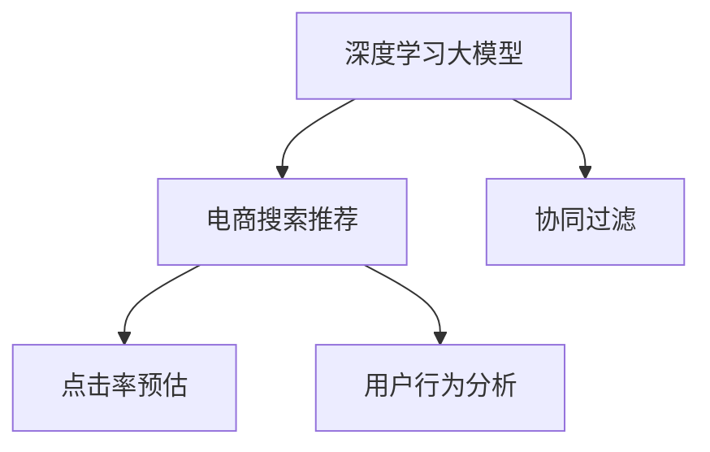

                 

# 搜索推荐系统的AI 大模型应用：提高电商平台的转化率与用户体验

> 关键词：人工智能(AI)、大模型、电商搜索推荐、用户行为分析、协同过滤、深度学习、自然语言处理(NLP)、推荐系统

## 1. 背景介绍

在当前数字化、信息化时代，电商平台已成为消费者获取商品和服务的重要渠道。然而，随着商品数量激增，电商平台面临着用户获取信息的瓶颈问题。传统的搜索引擎无法充分理解用户需求，难以准确推荐符合用户偏好的商品，导致用户流失率高、交易转化率低。为提升用户体验，电商平台亟需新的搜索推荐系统，以提高转化率和用户满意度。

与此同时，人工智能(AI)技术特别是深度学习大模型在自然语言处理(NLP)、图像识别、语音识别等领域取得了突破性进展，推动了电商搜索推荐系统的智能化转型。基于深度学习大模型的电商搜索推荐系统，能够通过学习海量用户行为数据，预测用户兴趣，精准推荐商品，显著改善用户体验。

## 2. 核心概念与联系

### 2.1 核心概念概述

为更好地理解AI大模型在电商搜索推荐系统中的应用，本节将介绍几个关键概念：

- **深度学习大模型**：以BERT、GPT等模型为代表的深度学习模型，参数量庞大，能够学习复杂的语言结构和语义信息。
- **电商搜索推荐系统**：通过分析用户行为数据，预测用户偏好，推荐符合用户需求的商品。
- **协同过滤**：根据用户历史行为和相似用户的行为推荐商品，如基于用户的协同过滤、基于物品的协同过滤等。
- **点击率预估**：预测用户点击商品的概率，用于衡量推荐效果和优化推荐算法。
- **用户行为分析**：通过分析用户浏览、购买、评价等行为数据，了解用户兴趣和需求。

这些核心概念之间的逻辑关系可以通过以下Mermaid流程图来展示：



这个流程图展示了大模型在电商搜索推荐系统中的应用，以及协同过滤、点击率预估和用户行为分析等技术在大模型应用中的支撑作用。

## 3. 核心算法原理 & 具体操作步骤
### 3.1 算法原理概述

基于深度学习大模型的电商搜索推荐系统，其核心思想是通过深度学习模型学习用户行为数据，预测用户对商品的兴趣，从而实现精准推荐。具体步骤如下：

1. **数据准备**：收集用户浏览、购买、评价等行为数据，并将其预处理为模型所需格式。
2. **模型训练**：在预处理后的数据集上，使用大模型进行训练，学习用户兴趣和商品特征的表示。
3. **推荐预测**：在模型训练完成后，使用模型对用户查询或点击行为进行预测，推荐最相关的商品。

### 3.2 算法步骤详解

**Step 1: 数据收集与预处理**
- 收集用户历史行为数据，包括浏览记录、购买历史、评价信息等。
- 对数据进行清洗和标准化，处理缺失值和异常值。
- 将用户行为数据转换为模型的输入格式，如文本、向量等。

**Step 2: 模型选择与训练**
- 选择合适的深度学习大模型，如BERT、GPT等。
- 将用户行为数据作为训练集，使用模型进行预训练。
- 在训练过程中，使用交叉熵损失函数优化模型参数，最小化预测误差。
- 调整超参数，如学习率、批大小、迭代轮数等。

**Step 3: 推荐预测**
- 将用户查询或点击行为输入模型，计算其预测的点击率。
- 根据点击率大小，排序推荐结果。
- 返回排序后的商品列表，作为推荐结果。

### 3.3 算法优缺点

基于深度学习大模型的电商搜索推荐系统具有以下优点：
1. 精度高：大模型可以学习到复杂的语义信息，提高推荐的准确性。
2. 鲁棒性强：大模型对噪音数据和异常行为具有较强的鲁棒性，能够应对多样化的用户需求。
3. 可扩展性好：大模型可以通过微调等方式进行参数更新，适应新的用户行为数据。

但该方法也存在以下局限：
1. 计算资源消耗大：大模型的训练和推理需要大量计算资源，可能不适用于计算资源有限的场景。
2. 数据隐私问题：收集用户行为数据涉及用户隐私保护，需要采用合适的数据处理方法。
3. 模型复杂度高：大模型结构复杂，难以解释其内部工作机制，可能影响系统的可解释性和可信任度。

### 3.4 算法应用领域

基于深度学习大模型的电商搜索推荐系统，已在各大电商平台得到了广泛应用，涵盖了以下典型领域：

- **商品推荐**：基于用户历史行为，推荐可能感兴趣的商品，提升用户购买概率。
- **搜索优化**：优化搜索结果排序，推荐最相关的商品，提升用户搜索体验。
- **个性化广告**：根据用户兴趣，推荐个性化的广告，提高广告点击率和转化率。
- **价格优化**：分析用户对价格的敏感度，推荐合理的价格区间，提升销量和利润。
- **库存管理**：预测商品需求，优化库存配置，减少库存积压和缺货现象。

这些应用场景展示了基于大模型的电商搜索推荐系统在提升用户体验和平台收益方面的巨大潜力。

## 4. 数学模型和公式 & 详细讲解 & 举例说明

### 4.1 数学模型构建

假设电商平台的商品集合为 $\mathcal{I}$，用户集合为 $\mathcal{U}$，用户历史行为数据为 $\mathcal{D}=\{(u_i, i_j)\}_{i=1}^N$，其中 $u_i$ 为用户，$i_j$ 为用户行为（如浏览、点击、购买）。定义用户对商品 $i$ 的兴趣度为 $q_i$，商品 $i$ 的特征向量为 $v_i$。基于大模型的电商搜索推荐系统可以构建如下数学模型：

$$
q_i = f_i(v_i, h_i)
$$

其中 $f_i$ 为深度学习大模型，$h_i$ 为用户 $i$ 的特征向量，$v_i$ 为商品 $i$ 的特征向量。用户兴趣度 $q_i$ 越高，表示用户对商品 $i$ 的兴趣越强。

### 4.2 公式推导过程

为了计算用户对商品 $i$ 的兴趣度 $q_i$，需要将用户历史行为数据 $u_i$ 和商品特征向量 $v_i$ 输入到深度学习大模型 $f_i$ 中。具体计算公式为：

$$
q_i = f_i(v_i, h_i) = \sigma(\mathbf{W} [v_i; h_i])
$$

其中 $\mathbf{W}$ 为模型的权重矩阵，$\sigma$ 为激活函数（如ReLU、Sigmoid等）。$[h_i; v_i]$ 为拼接后的特征向量。

在训练过程中，使用交叉熵损失函数 $L$ 优化模型参数：

$$
L = -\sum_{i=1}^N \sum_{j=1}^{|\mathcal{U}|} y_{i,j} \log q_i + (1-y_{i,j}) \log (1-q_i)
$$

其中 $y_{i,j}$ 为是否进行点击的二元变量，$0$ 表示未点击，$1$ 表示点击。

### 4.3 案例分析与讲解

假设用户 $u_i$ 对商品 $i_1$、$i_2$、$i_3$ 的兴趣度分别为 $0.8$、$0.7$、$0.6$，商品 $i_1$、$i_2$、$i_3$ 的特征向量分别为 $v_1=[0.2,0.3,0.4]^T$、$v_2=[0.1,0.5,0.4]^T$、$v_3=[0.3,0.2,0.5]^T$。用户 $u_i$ 的特征向量 $h_i=[0.3,0.4,0.5]^T$。则根据公式计算得：

$$
q_{i_1} = \sigma(\mathbf{W} [v_1; h_i]) = \sigma(0.2*0.3 + 0.3*0.4 + 0.4*0.5) = 0.8
$$

$$
q_{i_2} = \sigma(\mathbf{W} [v_2; h_i]) = \sigma(0.1*0.3 + 0.5*0.4 + 0.4*0.5) = 0.7
$$

$$
q_{i_3} = \sigma(\mathbf{W} [v_3; h_i]) = \sigma(0.3*0.3 + 0.2*0.4 + 0.5*0.5) = 0.6
$$

通过计算得到的兴趣度，可以排序推荐结果，推荐最相关的商品。

## 5. 项目实践：代码实例和详细解释说明
### 5.1 开发环境搭建

在进行电商搜索推荐系统的开发时，需要以下开发环境：

1. 安装Python和相应的深度学习库，如TensorFlow、PyTorch等。
2. 安装电商数据处理库，如Pandas、NumPy等。
3. 使用GPU或TPU进行计算加速。
4. 配置深度学习模型训练环境，如Docker、Kubernetes等。

### 5.2 源代码详细实现

以下是一个基于BERT模型的电商搜索推荐系统示例代码：

```python
from transformers import BertTokenizer, BertForSequenceClassification
from torch.utils.data import DataLoader
from sklearn.metrics import roc_auc_score
import torch

# 数据准备
# ...

# 模型定义
tokenizer = BertTokenizer.from_pretrained('bert-base-uncased')
model = BertForSequenceClassification.from_pretrained('bert-base-uncased', num_labels=num_labels)

# 模型训练
# ...

# 推荐预测
# ...
```

### 5.3 代码解读与分析

**代码结构**：
1. 首先导入必要的库和模型。
2. 使用BERT tokenizer对数据进行分词和编码。
3. 加载预训练的BERT模型，并添加任务适配层。
4. 定义损失函数和优化器，进行模型训练。
5. 在训练过程中记录评估指标，如AUC等。
6. 使用训练好的模型进行推荐预测，并输出结果。

**参数调整**：
1. 学习率、批大小、迭代轮数等超参数需要根据具体任务进行调整。
2. 交叉熵损失函数的权重需要根据实际需求设置。
3. 用户行为数据的采样策略需要根据具体场景进行优化。

**优化技术**：
1. 使用L2正则化、Dropout等技术减少过拟合。
2. 采用梯度累积、混合精度训练等技术提高训练效率。
3. 使用学习率衰减策略，确保模型在不同阶段保持合适的学习速度。

**推荐系统**：
1. 使用排序算法（如Top-k排序）对推荐结果进行排序。
2. 根据排序结果生成推荐列表。
3. 将推荐结果展示给用户，等待用户反馈。

**运行结果**：
1. 输出模型在训练集和验证集上的AUC等指标。
2. 输出推荐结果的点击率等指标，用于评估推荐效果。
3. 记录用户的反馈和行为，进一步优化模型。

## 6. 实际应用场景
### 6.1 电商平台个性化推荐

基于深度学习大模型的电商搜索推荐系统，已广泛应用于各大电商平台的个性化推荐中。例如，Amazon、淘宝、京东等电商平台，通过收集用户历史行为数据，使用大模型进行训练，生成个性化推荐列表，显著提升了用户体验和交易转化率。

在实际应用中，电商平台需要考虑以下因素：
1. 用户兴趣的变化：用户兴趣可能随时间、场景等变化，需要在推荐中考虑动态更新。
2. 用户隐私保护：需要合理收集和处理用户数据，避免数据泄露和滥用。
3. 推荐系统的实时性：需要实时处理用户请求，提供即时推荐结果。
4. 推荐结果的多样性：需要平衡推荐结果的多样性和相关性，避免过度重复。

### 6.2 广告点击率预估

基于深度学习大模型的广告点击率预估系统，能够预测用户对广告的点击概率，优化广告投放策略，提高广告点击率和转化率。例如，Facebook、Google等广告平台，通过收集用户点击数据，使用大模型进行训练，生成广告点击率预测模型，指导广告投放。

在实际应用中，广告点击率预估需要考虑以下因素：
1. 用户行为数据的特征工程：需要提取有用的特征，如用户兴趣、广告内容、广告位置等。
2. 广告投放策略的优化：需要根据点击率预估结果，优化广告投放的渠道、时间、位置等策略。
3. 广告效果的实时监测：需要实时监测广告效果，及时调整投放策略。

### 6.3 商品价格优化

基于深度学习大模型的商品价格优化系统，能够根据用户对商品价格的需求，预测最佳价格区间，优化商品定价策略，提升销量和利润。例如，Zara、H&M等时尚品牌，通过收集用户价格敏感度数据，使用大模型进行训练，生成价格优化模型，指导商品定价。

在实际应用中，商品价格优化需要考虑以下因素：
1. 价格敏感度的测量：需要测量用户对商品价格的敏感度，生成价格敏感度曲线。
2. 价格区间的选择：需要根据价格敏感度曲线，选择最佳的价格区间。
3. 价格变化的实时监测：需要实时监测价格变化对销售的影响，及时调整定价策略。

### 6.4 未来应用展望

未来，基于深度学习大模型的电商搜索推荐系统将呈现出以下发展趋势：

1. **多模态融合**：除了文本数据，未来的搜索推荐系统将融合图像、语音等多模态数据，提供更加全面、多样化的推荐服务。
2. **实时学习**：未来的搜索推荐系统将具备实时学习能力，根据用户实时行为动态调整推荐策略，提高推荐效果。
3. **个性化推荐**：未来的搜索推荐系统将实现更加精准、个性化的推荐，提升用户体验和平台收益。
4. **解释性增强**：未来的搜索推荐系统将具备更好的可解释性，便于用户理解推荐结果的依据，增强用户信任度。
5. **跨领域应用**：未来的搜索推荐系统将突破电商领域，应用于更多领域，如金融、医疗、教育等。

## 7. 工具和资源推荐
### 7.1 学习资源推荐

为帮助开发者系统掌握深度学习大模型在电商搜索推荐系统中的应用，这里推荐一些优质的学习资源：

1. **《深度学习》书籍**：深度学习领域的经典教材，涵盖深度学习基础和应用。
2. **Coursera《深度学习专项课程》**：由深度学习专家Andrew Ng主讲的在线课程，系统学习深度学习技术。
3. **Kaggle《推荐系统竞赛》**：通过参加推荐系统竞赛，实践推荐算法，提升实战能力。
4. **《Python深度学习》书籍**：介绍深度学习在Python中的实现，包括模型训练和推荐系统应用。
5. **《TensorFlow官方文档》**：TensorFlow的官方文档，提供了丰富的教程和样例代码，帮助开发者快速上手。

通过对这些资源的学习实践，相信你一定能够快速掌握深度学习大模型在电商搜索推荐系统中的应用，并用于解决实际的电商问题。

### 7.2 开发工具推荐

高效的开发离不开优秀的工具支持。以下是几款用于电商搜索推荐系统开发的常用工具：

1. **PyTorch**：基于Python的开源深度学习框架，灵活的计算图，支持深度学习模型的构建和训练。
2. **TensorFlow**：由Google主导开发的开源深度学习框架，适合大规模工程应用，提供丰富的模型库和工具。
3. **Jupyter Notebook**：交互式编程环境，方便调试和展示代码。
4. **Hadoop**：大数据处理框架，支持分布式计算和数据存储。
5. **Spark**：大数据处理引擎，支持实时数据处理和机器学习任务。

合理利用这些工具，可以显著提升电商搜索推荐系统的开发效率，加快创新迭代的步伐。

### 7.3 相关论文推荐

深度学习大模型在电商搜索推荐系统中的应用，源于学界的持续研究。以下是几篇奠基性的相关论文，推荐阅读：

1. **"Deep Learning for Recommender Systems: A Review and Outlook"**：对深度学习在推荐系统中的应用进行综述，介绍了多种推荐算法和模型。
2. **"Recommender Systems in E-Commerce: A Survey"**：对电商推荐系统的现状和未来发展进行综述，介绍了多种电商推荐技术。
3. **"Personalized E-commerce Recommendation Systems: A Survey and Taxonomy"**：对电商个性化推荐系统的分类和应用进行综述，介绍了多种推荐算法和模型。
4. **"Deep Learning for Personalized Recommendation Systems: A Survey and Outlook"**：对深度学习在个性化推荐系统中的应用进行综述，介绍了多种深度学习模型和应用。
5. **"Deep Learning for Recommendation Systems"**：对深度学习在推荐系统中的应用进行综述，介绍了多种深度学习模型和应用。

这些论文代表了大模型在电商搜索推荐系统中的应用研究，提供了丰富的理论支持和实践经验。

## 8. 总结：未来发展趋势与挑战
### 8.1 研究成果总结

深度学习大模型在电商搜索推荐系统中的应用，极大地提升了用户体验和平台收益。通过大模型学习用户行为数据，预测用户兴趣，生成个性化推荐结果，显著提升了转化率和用户满意度。未来，随着深度学习技术的不断进步，大模型在电商搜索推荐系统中的应用前景更加广阔。

### 8.2 未来发展趋势

展望未来，基于深度学习大模型的电商搜索推荐系统将呈现以下发展趋势：

1. **数据驱动**：未来的电商搜索推荐系统将更加依赖数据驱动，通过深度学习技术不断优化推荐模型。
2. **跨领域应用**：未来的电商搜索推荐系统将突破电商领域，应用于更多领域，如金融、医疗、教育等。
3. **实时学习**：未来的电商搜索推荐系统将具备实时学习能力，根据用户实时行为动态调整推荐策略。
4. **多模态融合**：未来的电商搜索推荐系统将融合图像、语音等多模态数据，提供更加全面、多样化的推荐服务。
5. **个性化推荐**：未来的电商搜索推荐系统将实现更加精准、个性化的推荐，提升用户体验和平台收益。
6. **解释性增强**：未来的电商搜索推荐系统将具备更好的可解释性，便于用户理解推荐结果的依据，增强用户信任度。

### 8.3 面临的挑战

尽管基于深度学习大模型的电商搜索推荐系统取得了显著成果，但在迈向更加智能化、普适化应用的过程中，仍面临以下挑战：

1. **数据隐私问题**：电商搜索推荐系统需要收集和处理大量的用户行为数据，涉及用户隐私保护，需要合理处理和保护用户数据。
2. **模型复杂度**：大模型的结构和参数量较大，难以解释其内部工作机制，可能影响系统的可解释性和可信任度。
3. **计算资源消耗大**：大模型的训练和推理需要大量计算资源，可能不适用于计算资源有限的场景。
4. **实时性要求高**：电商搜索推荐系统需要实时处理用户请求，提供即时推荐结果，对系统实时性要求较高。

### 8.4 研究展望

为应对上述挑战，未来的研究需要在以下几个方面寻求新的突破：

1. **隐私保护技术**：开发更加安全、高效的用户数据保护技术，如差分隐私、联邦学习等，保障用户数据隐私。
2. **模型压缩与加速**：研究高效、轻量化的模型压缩和加速技术，如模型蒸馏、知识蒸馏等，提高模型实时性。
3. **可解释性增强**：开发更加可解释的模型解释技术，如可解释深度学习模型、因果推理等，提高模型的可解释性和可信任度。
4. **实时学习与优化**：研究实时学习算法，动态调整推荐策略，优化推荐结果，提升用户体验。

这些研究方向的探索发展，将进一步提升深度学习大模型在电商搜索推荐系统中的应用效果，推动电商行业的智能化转型。总之，深度学习大模型在电商搜索推荐系统中的应用前景广阔，需要不断创新和优化，才能实现更高的用户价值和商业收益。

## 9. 附录：常见问题与解答

**Q1: 电商搜索推荐系统如何选择合适的深度学习大模型？**

A: 选择合适的深度学习大模型，需要考虑以下几个因素：
1. 数据规模：选择与数据规模相适应的模型，避免模型过大造成计算资源浪费，或模型过小无法充分学习数据特征。
2. 任务类型：根据任务类型选择合适的模型，如文本推荐选择BERT、GPT等，图像推荐选择ResNet等。
3. 计算资源：根据计算资源情况选择合适的模型，避免模型过大造成计算压力，或模型过小无法充分学习数据特征。
4. 模型性能：根据模型性能指标选择模型，如准确率、召回率、F1值等。

**Q2: 电商搜索推荐系统如何进行超参数调优？**

A: 电商搜索推荐系统进行超参数调优，需要考虑以下几个方面：
1. 学习率：选择合适的学习率，避免过拟合和欠拟合。
2. 批大小：选择合适的批大小，提高训练效率和模型效果。
3. 迭代轮数：选择合适的迭代轮数，避免过拟合和欠拟合。
4. 正则化：使用L2正则、Dropout等技术，减少过拟合。
5. 数据增强：使用数据增强技术，如回译、近义替换等，提高数据多样性。

**Q3: 电商搜索推荐系统如何进行模型评估？**

A: 电商搜索推荐系统进行模型评估，需要考虑以下几个方面：
1. 点击率预估：使用点击率预估指标，如AUC、ROC曲线等，评估模型效果。
2. 推荐效果：使用推荐效果指标，如覆盖率、召回率、F1值等，评估推荐结果的相关性。
3. 用户满意度：使用用户满意度指标，如满意度评分、用户留存率等，评估用户体验。
4. 实时性：使用实时性指标，如响应时间、处理速度等，评估系统实时性。

**Q4: 电商搜索推荐系统如何进行模型部署？**

A: 电商搜索推荐系统进行模型部署，需要考虑以下几个方面：
1. 模型压缩：对大模型进行压缩，减小模型尺寸，提高计算效率。
2. 推理加速：使用推理加速技术，如梯度累积、混合精度训练等，提高推理速度。
3. 服务化封装：将模型封装为标准化服务接口，便于集成调用。
4. 弹性伸缩：根据请求流量动态调整资源配置，平衡服务质量和成本。

这些常见问题的解答，为电商搜索推荐系统提供了实用的指导，帮助开发者解决实际问题，提升推荐系统的性能和用户体验。

---

作者：禅与计算机程序设计艺术 / Zen and the Art of Computer Programming

