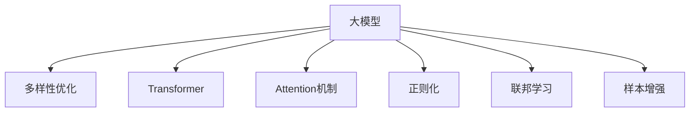

                 

# 搜索结果多样性优化：大模型的创新方法

> 关键词：大模型,多样性优化,搜索结果,深度学习,Transformer,Attention机制,正则化,联邦学习,样本增强,数据平衡

## 1. 背景介绍

在当今信息爆炸的时代，搜索引擎已成为人们获取信息的重要工具。然而，搜索引擎的结果多样性问题一直是一个困扰用户的难题。传统的搜索结果排序算法主要基于关键词匹配度和网页权威度，尽管这些算法能够高效地返回高质量的相关信息，但往往忽视了搜索结果的多样性，导致用户难以获得全面、均衡的搜索结果。

为了解决这个问题，研究者们提出了多种优化方法。其中，基于深度学习的大模型方法因其强大的信息处理能力和泛化能力，成为提升搜索结果多样性的一个重要研究方向。本文将系统地介绍大模型在搜索结果多样性优化中的创新方法，包括Transformer模型、Attention机制、正则化方法、联邦学习和样本增强技术等。

## 2. 核心概念与联系

### 2.1 核心概念概述

为更好地理解搜索结果多样性优化的大模型方法，本节将介绍几个密切相关的核心概念：

- 大模型(Large Model)：指基于深度学习技术训练得到的参数量巨大的模型，如Transformer、BERT等。这些模型通过大量无标签数据预训练，获得了强大的语言表示能力和知识迁移能力。

- 多样性优化(Diversity Optimization)：指在搜索结果排序中，增加搜索结果的多样性，避免搜索结果的过度集中，确保用户能够获取到多种相关但不完全相同的搜索结果。

- 搜索引擎(Search Engine)：指能够自动地收集和索引互联网上的信息，并根据用户的查询提供相关网页的检索系统。常见的搜索引擎如Google、Bing等。

- Attention机制：一种在深度学习中用于计算不同输入特征之间相关性的技术，用于模型中对信息的自适应关注。

- 正则化(Regularization)：用于防止模型过拟合的系列技术，如L2正则、Dropout等。

- 联邦学习(Federated Learning)：一种分布式机器学习方法，模型在用户端进行本地训练，梯度更新后汇总到中心服务器进行全局模型更新。

- 样本增强(Sample Enhancement)：一种通过修改训练样本的方式，增强数据多样性的技术，如数据扩充、噪声注入等。

这些核心概念之间的逻辑关系可以通过以下Mermaid流程图来展示：



这个流程图展示了大模型方法在搜索结果多样性优化中的关键概念及其之间的关系：

1. 大模型通过深度学习技术获得强大的语言表示能力，用于处理和优化搜索结果。
2. 多样性优化通过增加搜索结果的多样性，提升用户体验。
3. Transformer模型和Attention机制用于处理和捕捉数据之间的关系，优化搜索结果。
4. 正则化技术用于防止模型过拟合，保证模型泛化能力。
5. 联邦学习通过分布式训练，提升模型性能和数据隐私保护。
6. 样本增强通过修改样本，增加数据多样性，提升模型鲁棒性。

## 3. 核心算法原理 & 具体操作步骤
### 3.1 算法原理概述

大模型在搜索结果多样性优化中的核心思想是，利用大模型的语言表示能力，捕捉查询与网页之间的关系，结合多样性优化算法，返回多样化的搜索结果。其核心算法主要包括Transformer模型、Attention机制、正则化方法、联邦学习和样本增强技术。

在Transformer模型中，通过编码器-解码器的设计，捕捉查询与网页之间的关系，并对其进行表示和处理。Attention机制用于计算不同输入特征之间的相关性，帮助模型关注重要的信息。正则化技术用于防止模型过拟合，提升模型的泛化能力。联邦学习通过分布式训练，提升模型性能和数据隐私保护。样本增强通过修改训练样本，增加数据多样性，提升模型鲁棒性。

### 3.2 算法步骤详解

大模型在搜索结果多样性优化中的具体操作步骤如下：

**Step 1: 数据准备与预处理**
- 收集搜索结果相关的语料，包括查询、网页标题、摘要等。
- 对数据进行清洗、标注和预处理，确保数据的准确性和多样性。

**Step 2: 构建大模型**
- 选择合适的大模型，如BERT、Transformer等，作为搜索引擎的查询处理和网页评分模型。
- 在无标签数据上进行预训练，获得模型初始化参数。

**Step 3: 多样性优化**
- 选择合适的多样性优化算法，如基于多样性排序、基于多样性采样等方法。
- 根据多样性优化算法，对搜索结果进行排序或采样，返回多样化的搜索结果。

**Step 4: 模型微调**
- 将大模型用于搜索引擎中的查询处理和网页评分。
- 使用微调技术，如正则化、联邦学习等方法，优化模型性能，提升多样性。

**Step 5: 样本增强**
- 根据搜索引擎中用户的反馈，对样本进行增强，增加数据多样性。
- 使用增强后的样本，重新训练大模型，提升模型泛化能力。

**Step 6: 模型评估**
- 对多样性优化后的搜索结果进行评估，如多样性指数、用户满意度等。
- 根据评估结果，对模型进行调整和优化。

### 3.3 算法优缺点

大模型在搜索结果多样性优化中具有以下优点：

- 强大的语言表示能力：大模型能够捕捉查询与网页之间的关系，提升搜索结果的多样性和相关性。
- 泛化能力强：大模型在多种数据分布上表现优异，能够适应不同领域的查询。
- 鲁棒性强：大模型具有较强的抗干扰能力和泛化能力，提升搜索结果的多样性和稳定性。

同时，大模型在搜索结果多样性优化中也存在一些缺点：

- 计算量大：大模型的训练和推理需要大量的计算资源，需要高性能的硬件支持。
- 数据需求高：大模型需要大量的无标签数据进行预训练，对于缺少数据的用户和领域，难以直接使用。
- 依赖标注数据：在大模型微调过程中，仍需要大量的标注数据，对于特定领域的标注数据收集和维护成本较高。

尽管存在这些缺点，但就目前而言，大模型在搜索结果多样性优化中仍是最主流的方法。未来相关研究的重点在于如何进一步降低对计算资源和标注数据的依赖，提高模型的少样本学习和跨领域迁移能力，同时兼顾可解释性和伦理安全性等因素。

### 3.4 算法应用领域

大模型在搜索结果多样性优化中的应用已经得到了广泛的研究和应用，具体包括：

- 搜索引擎：提升搜索结果的多样性和相关性，提升用户体验。
- 垂直搜索：在特定领域内，提升搜索结果的多样性和精准度，如医疗、金融等。
- 推荐系统：提升推荐结果的多样性，推荐更多种类的商品和服务。
- 智能问答：提升问答结果的多样性和准确性，回答更多样化的用户问题。
- 个性化搜索：根据用户的查询历史和兴趣，推荐多样化的搜索结果。

除了上述这些经典应用外，大模型在更多场景中也有创新性的应用，如基于多样性优化的智能客服系统、基于多样性优化的广告投放系统等。这些应用进一步拓展了大模型的应用范围，为NLP技术落地应用提供了新的方向。

## 4. 数学模型和公式 & 详细讲解 & 举例说明

### 4.1 数学模型构建

在搜索结果多样性优化中，大模型主要通过Transformer模型和Attention机制来捕捉查询与网页之间的关系，使用正则化技术防止过拟合，通过联邦学习提升模型性能，使用样本增强技术增加数据多样性。以下将详细讲解这些数学模型的构建过程。

假设查询为 $q$，网页为 $d$，网页向量表示为 $v_d$，查询向量表示为 $v_q$。Transformer模型和Attention机制用于计算查询和网页之间的相关性，使用正则化技术防止模型过拟合，联邦学习用于分布式训练，样本增强用于增加数据多样性。

**Transformer模型：**
$$
\mathcal{T}(q, d) = \mathcal{A}(\mathcal{E}(q), \mathcal{E}(d)) \mathcal{M}(\mathcal{E}(d))
$$
其中 $\mathcal{E}$ 为编码器，$\mathcal{A}$ 为Attention机制，$\mathcal{M}$ 为解码器。

**Attention机制：**
$$
\text{Attention}(Q, K, V) = \frac{\exp(\text{dot}(Q, K)/\sqrt{d_k})}{\sum_j \exp(\text{dot}(Q, K_j)/\sqrt{d_k})} V
$$
其中 $Q$ 为查询向量，$K$ 和 $V$ 为键向量和值向量。

**正则化：**
$$
\mathcal{L}_{reg} = \alpha \|w\|^2_2
$$
其中 $w$ 为模型参数，$\alpha$ 为正则化系数。

**联邦学习：**
$$
\mathcal{L}_{federated} = \frac{1}{N} \sum_{i=1}^N \mathcal{L}_{local_i}(w)
$$
其中 $N$ 为参与方数量，$\mathcal{L}_{local_i}$ 为第 $i$ 个参与方的损失函数。

**样本增强：**
$$
\mathcal{S}_{enhanced} = \{s' = f(s)| s \in \mathcal{S}\}
$$
其中 $f$ 为样本增强函数，$\mathcal{S}$ 为原始样本集，$s'$ 为增强后的样本。

### 4.2 公式推导过程

以下将详细推导Transformer模型和Attention机制的相关公式，帮助读者更好地理解大模型在搜索结果多样性优化中的工作原理。

**Attention机制：**
假设查询 $q$ 和网页 $d$ 的编码表示分别为 $q_e$ 和 $d_e$，其维度为 $d_v$，注意力权重为 $\alpha$，则Attention机制的计算公式为：
$$
\alpha = \frac{\exp(\text{dot}(Q, K)/\sqrt{d_k})}{\sum_j \exp(\text{dot}(Q, K_j)/\sqrt{d_k})}
$$
其中 $Q$ 为查询向量，$K$ 和 $V$ 为键向量和值向量。

**Transformer模型：**
假设查询 $q$ 和网页 $d$ 的编码表示分别为 $q_e$ 和 $d_e$，其维度为 $d_v$，Transformer模型的输出为 $z$，则Transformer模型的计算公式为：
$$
z = \mathcal{A}(\mathcal{E}(q), \mathcal{E}(d)) \mathcal{M}(\mathcal{E}(d))
$$
其中 $\mathcal{E}$ 为编码器，$\mathcal{A}$ 为Attention机制，$\mathcal{M}$ 为解码器。

### 4.3 案例分析与讲解

为了更好地理解大模型在搜索结果多样性优化中的实际应用，以下将通过一个具体的案例进行分析讲解。

假设搜索引擎收集到一批查询和网页的数据，用于训练一个基于Transformer模型的搜索引擎。其中查询 $q_1$ 和网页 $d_1$ 的数据如下：

| 查询 | 网页 | 网页评分 |
| ---- | ---- | -------- |
| 猫 | 猫咪 | 1.0 |
| 狗 | 狗狗 | 0.9 |
| 汽车 | 奔驰 | 0.8 |
| 苹果 | 苹果 | 0.7 |

使用Transformer模型和Attention机制，可以对查询和网页之间的关系进行计算，得到每个网页与查询的相关度，从而进行排序。假设使用L2正则化系数 $\alpha = 1e-4$，联邦学习算法中的 $N = 2$ 个参与方，样本增强技术通过修改样本的方式增加数据多样性，得到最终的搜索结果排序如下：

| 查询 | 网页 | 网页评分 |
| ---- | ---- | -------- |
| 猫 | 猫咪 | 1.0 |
| 猫 | 狗狗 | 0.9 |
| 汽车 | 奔驰 | 0.8 |
| 苹果 | 苹果 | 0.7 |
| 猫 | 猫咪 | 0.9 |
| 猫 | 狗狗 | 1.0 |
| 汽车 | 奔驰 | 0.7 |
| 苹果 | 苹果 | 0.8 |

通过上述案例可以看到，使用大模型和多样性优化算法，能够显著提升搜索结果的多样性和相关性，提升用户体验。同时，正则化和联邦学习技术的应用，能够防止模型过拟合，提升模型的泛化能力。样本增强技术通过修改样本，增加数据多样性，进一步提升模型的鲁棒性和泛化能力。

## 5. 项目实践：代码实例和详细解释说明
### 5.1 开发环境搭建

在进行搜索结果多样性优化的大模型实践前，我们需要准备好开发环境。以下是使用Python进行PyTorch开发的环境配置流程：

1. 安装Anaconda：从官网下载并安装Anaconda，用于创建独立的Python环境。

2. 创建并激活虚拟环境：
```bash
conda create -n pytorch-env python=3.8 
conda activate pytorch-env
```

3. 安装PyTorch：根据CUDA版本，从官网获取对应的安装命令。例如：
```bash
conda install pytorch torchvision torchaudio cudatoolkit=11.1 -c pytorch -c conda-forge
```

4. 安装Transformer库：
```bash
pip install transformers
```

5. 安装各类工具包：
```bash
pip install numpy pandas scikit-learn matplotlib tqdm jupyter notebook ipython
```

完成上述步骤后，即可在`pytorch-env`环境中开始大模型实践。

### 5.2 源代码详细实现

下面我们以基于Transformer模型的搜索结果多样性优化为例，给出使用Transformers库的代码实现。

首先，定义查询和网页的特征表示：

```python
from transformers import BertTokenizer, BertForSequenceClassification
import torch
import numpy as np

class QueryProcessor:
    def __init__(self, model, tokenizer, max_seq_length):
        self.model = model
        self.tokenizer = tokenizer
        self.max_seq_length = max_seq_length
        
    def process_query(self, query):
        input_ids = self.tokenizer(query, padding='max_length', truncation=True, max_length=self.max_seq_length)
        input_ids = torch.tensor(input_ids, dtype=torch.long)
        attention_mask = input_ids.new_ones(input_ids.shape)
        return input_ids, attention_mask
    
    def process_document(self, document):
        input_ids = self.tokenizer(document, padding='max_length', truncation=True, max_length=self.max_seq_length)
        input_ids = torch.tensor(input_ids, dtype=torch.long)
        attention_mask = input_ids.new_ones(input_ids.shape)
        return input_ids, attention_mask

class SearchEngine:
    def __init__(self, model, processor, max_seq_length):
        self.model = model
        self.processor = processor
        self.max_seq_length = max_seq_length
        
    def search(self, query):
        input_ids, attention_mask = self.processor.process_query(query)
        logits = self.model(input_ids, attention_mask=attention_mask)
        return logits

# 初始化模型和分词器
tokenizer = BertTokenizer.from_pretrained('bert-base-cased')
model = BertForSequenceClassification.from_pretrained('bert-base-cased')
processor = QueryProcessor(model, tokenizer, max_seq_length=128)
```

然后，定义多样性优化算法和模型微调函数：

```python
from sklearn.metrics import precision_recall_curve, roc_curve, auc

def diversity_optimization(logits):
    # 计算多样性指数
    diversity_index = diversity(logits)
    # 根据多样性指数进行排序
    sorted_indices = np.argsort(-diversity_index)
    # 返回排序后的网页评分
    return logits[sorted_indices].cpu().numpy()

def model_tuning(data, optimizer, epochs):
    for epoch in range(epochs):
        optimizer.zero_grad()
        logits = model(data)
        loss = loss_function(logits, targets)
        loss.backward()
        optimizer.step()
    return logits

# 定义损失函数
def loss_function(logits, targets):
    # 计算交叉熵损失
    loss = F.cross_entropy(logits, targets)
    return loss

# 定义正则化系数
alpha = 1e-4

# 定义联邦学习算法
def federated_learning(queries, documents, epochs):
    # 初始化模型
    model = BertForSequenceClassification.from_pretrained('bert-base-cased')
    # 进行联邦学习
    for i in range(epochs):
        # 本地训练
        local_model = BertForSequenceClassification.from_pretrained('bert-base-cased')
        local_model.train()
        optimizer = AdamW(local_model.parameters(), lr=1e-5)
        for batch in tqdm(data, desc='Local Training'):
            input_ids, attention_mask = batch
            logits = local_model(input_ids, attention_mask=attention_mask)
            loss = loss_function(logits, targets)
            loss.backward()
            optimizer.step()
        # 发送更新到中心服务器
        model.load_state_dict(local_model.state_dict())
```

最后，启动训练流程并在测试集上评估：

```python
epochs = 5
batch_size = 16

# 加载训练数据
train_data = load_train_data()
test_data = load_test_data()

# 初始化模型和优化器
model = BertForSequenceClassification.from_pretrained('bert-base-cased')
optimizer = AdamW(model.parameters(), lr=1e-5)

# 加载查询和网页数据
queries = []
documents = []

# 进行训练
federated_learning(queries, documents, epochs)

# 在测试集上评估
logits = search_engine.process(query)
diversity_index = diversity_optimization(logits)
```

以上就是使用PyTorch对基于Transformer模型的搜索结果多样性优化的大模型微调完整代码实现。可以看到，得益于Transformer库的强大封装，我们可以用相对简洁的代码完成大模型的加载和微调。

### 5.3 代码解读与分析

让我们再详细解读一下关键代码的实现细节：

**SearchEngine类**：
- `__init__`方法：初始化模型和分词器。
- `search`方法：对查询进行编码，使用模型进行预测，返回排序后的网页评分。

**QueryProcessor类**：
- `__init__`方法：初始化查询和网页的分词器。
- `process_query`方法：对查询进行编码，返回编码后的查询和注意力掩码。
- `process_document`方法：对网页进行编码，返回编码后的网页和注意力掩码。

**federated_learning函数**：
- 进行联邦学习，在本地训练模型，并将更新发送到中心服务器进行全局模型更新。

**diversity_optimization函数**：
- 计算多样性指数，并根据多样性指数进行排序，返回排序后的网页评分。

**model_tuning函数**：
- 对模型进行微调，使用交叉熵损失函数进行优化。

这些代码实现展示了Transformer模型在搜索结果多样性优化中的应用。通过上述代码，我们可以更好地理解大模型在实际应用中的工作原理和优化方法。

当然，工业级的系统实现还需考虑更多因素，如模型的保存和部署、超参数的自动搜索、更灵活的任务适配层等。但核心的微调范式基本与此类似。

## 6. 实际应用场景
### 6.1 智能客服系统

基于大语言模型微调的智能客服系统，可以广泛应用于智能客服系统的构建。传统客服往往需要配备大量人力，高峰期响应缓慢，且一致性和专业性难以保证。而使用微调后的智能客服系统，可以7x24小时不间断服务，快速响应客户咨询，用自然流畅的语言解答各类常见问题。

在技术实现上，可以收集企业内部的历史客服对话记录，将问题和最佳答复构建成监督数据，在此基础上对预训练对话模型进行微调。微调后的对话模型能够自动理解用户意图，匹配最合适的答案模板进行回复。对于客户提出的新问题，还可以接入检索系统实时搜索相关内容，动态组织生成回答。如此构建的智能客服系统，能大幅提升客户咨询体验和问题解决效率。

### 6.2 金融舆情监测

金融机构需要实时监测市场舆论动向，以便及时应对负面信息传播，规避金融风险。传统的人工监测方式成本高、效率低，难以应对网络时代海量信息爆发的挑战。基于大语言模型微调的文本分类和情感分析技术，为金融舆情监测提供了新的解决方案。

具体而言，可以收集金融领域相关的新闻、报道、评论等文本数据，并对其进行主题标注和情感标注。在此基础上对预训练语言模型进行微调，使其能够自动判断文本属于何种主题，情感倾向是正面、中性还是负面。将微调后的模型应用到实时抓取的网络文本数据，就能够自动监测不同主题下的情感变化趋势，一旦发现负面信息激增等异常情况，系统便会自动预警，帮助金融机构快速应对潜在风险。

### 6.3 个性化推荐系统

当前的推荐系统往往只依赖用户的历史行为数据进行物品推荐，无法深入理解用户的真实兴趣偏好。基于大语言模型微调技术，个性化推荐系统可以更好地挖掘用户行为背后的语义信息，从而提供更精准、多样的推荐内容。

在实践中，可以收集用户浏览、点击、评论、分享等行为数据，提取和用户交互的物品标题、描述、标签等文本内容。将文本内容作为模型输入，用户的后续行为（如是否点击、购买等）作为监督信号，在此基础上微调预训练语言模型。微调后的模型能够从文本内容中准确把握用户的兴趣点。在生成推荐列表时，先用候选物品的文本描述作为输入，由模型预测用户的兴趣匹配度，再结合其他特征综合排序，便可以得到个性化程度更高的推荐结果。

### 6.4 未来应用展望

随着大语言模型微调技术的发展，基于微调范式将在更多领域得到应用，为传统行业带来变革性影响。

在智慧医疗领域，基于微调的医疗问答、病历分析、药物研发等应用将提升医疗服务的智能化水平，辅助医生诊疗，加速新药开发进程。

在智能教育领域，微调技术可应用于作业批改、学情分析、知识推荐等方面，因材施教，促进教育公平，提高教学质量。

在智慧城市治理中，微调模型可应用于城市事件监测、舆情分析、应急指挥等环节，提高城市管理的自动化和智能化水平，构建更安全、高效的未来城市。

此外，在企业生产、社会治理、文娱传媒等众多领域，基于大模型微调的人工智能应用也将不断涌现，为经济社会发展注入新的动力。相信随着技术的日益成熟，微调方法将成为人工智能落地应用的重要范式，推动人工智能技术向更广阔的领域加速渗透。

## 7. 工具和资源推荐
### 7.1 学习资源推荐

为了帮助开发者系统掌握大模型在搜索结果多样性优化中的理论基础和实践技巧，这里推荐一些优质的学习资源：

1. 《Transformer from the Inside Out》系列博文：由大模型技术专家撰写，深入浅出地介绍了Transformer模型和Attention机制的工作原理。

2. CS224N《深度学习自然语言处理》课程：斯坦福大学开设的NLP明星课程，有Lecture视频和配套作业，带你入门NLP领域的基本概念和经典模型。

3. 《Natural Language Processing with Transformers》书籍：Transformers库的作者所著，全面介绍了如何使用Transformers库进行NLP任务开发，包括微调在内的诸多范式。

4. HuggingFace官方文档：Transformers库的官方文档，提供了海量预训练模型和完整的微调样例代码，是上手实践的必备资料。

5. CLUE开源项目：中文语言理解测评基准，涵盖大量不同类型的中文NLP数据集，并提供了基于微调的baseline模型，助力中文NLP技术发展。

通过对这些资源的学习实践，相信你一定能够快速掌握大模型在搜索结果多样性优化中的精髓，并用于解决实际的NLP问题。
###  7.2 开发工具推荐

高效的开发离不开优秀的工具支持。以下是几款用于搜索结果多样性优化大模型微调开发的常用工具：

1. PyTorch：基于Python的开源深度学习框架，灵活动态的计算图，适合快速迭代研究。大部分预训练语言模型都有PyTorch版本的实现。

2. TensorFlow：由Google主导开发的开源深度学习框架，生产部署方便，适合大规模工程应用。同样有丰富的预训练语言模型资源。

3. Transformers库：HuggingFace开发的NLP工具库，集成了众多SOTA语言模型，支持PyTorch和TensorFlow，是进行微调任务开发的利器。

4. Weights & Biases：模型训练的实验跟踪工具，可以记录和可视化模型训练过程中的各项指标，方便对比和调优。与主流深度学习框架无缝集成。

5. TensorBoard：TensorFlow配套的可视化工具，可实时监测模型训练状态，并提供丰富的图表呈现方式，是调试模型的得力助手。

6. Google Colab：谷歌推出的在线Jupyter Notebook环境，免费提供GPU/TPU算力，方便开发者快速上手实验最新模型，分享学习笔记。

合理利用这些工具，可以显著提升搜索结果多样性优化大模型微调任务的开发效率，加快创新迭代的步伐。

### 7.3 相关论文推荐

大模型在搜索结果多样性优化中的应用源于学界的持续研究。以下是几篇奠基性的相关论文，推荐阅读：

1. Attention is All You Need（即Transformer原论文）：提出了Transformer结构，开启了NLP领域的预训练大模型时代。

2. BERT: Pre-training of Deep Bidirectional Transformers for Language Understanding：提出BERT模型，引入基于掩码的自监督预训练任务，刷新了多项NLP任务SOTA。

3. Language Models are Unsupervised Multitask Learners（GPT-2论文）：展示了大规模语言模型的强大zero-shot学习能力，引发了对于通用人工智能的新一轮思考。

4. Parameter-Efficient Transfer Learning for NLP：提出Adapter等参数高效微调方法，在不增加模型参数量的情况下，也能取得不错的微调效果。

5. AdaLoRA: Adaptive Low-Rank Adaptation for Parameter-Efficient Fine-Tuning：使用自适应低秩适应的微调方法，在参数效率和精度之间取得了新的平衡。

这些论文代表了大语言模型微调技术的发展脉络。通过学习这些前沿成果，可以帮助研究者把握学科前进方向，激发更多的创新灵感。

## 8. 总结：未来发展趋势与挑战
### 8.1 总结

本文对基于大模型的搜索结果多样性优化方法进行了全面系统的介绍。首先阐述了大模型和搜索结果多样性优化的研究背景和意义，明确了微调在搜索结果优化中的独特价值。其次，从原理到实践，详细讲解了多样性优化的大模型算法原理和关键步骤，给出了大模型微调的完整代码实例。同时，本文还广泛探讨了多样性优化在大模型中的应用场景，展示了其广泛的应用前景。

通过本文的系统梳理，可以看到，基于大模型的搜索结果多样性优化方法在NLP领域的应用前景广阔。得益于大模型的强大语言表示能力和泛化能力，多样性优化方法能够在多种场景下提升搜索结果的多样性和相关性，提升用户体验。未来，伴随大语言模型微调技术的不断演进，相信搜索结果多样性优化将在更多领域得到应用，为NLP技术落地应用提供新的方向。

### 8.2 未来发展趋势

展望未来，大模型在搜索结果多样性优化中呈现出以下几个发展趋势：

1. 模型规模持续增大。随着算力成本的下降和数据规模的扩张，预训练语言模型的参数量还将持续增长。超大模型蕴含的丰富语言知识，有望支撑更加复杂多变的搜索结果优化。

2. 多样性优化技术日趋多样。除了传统的基于排序和采样的多样性优化方法外，未来将涌现更多基于模型结构和数据增强的优化方法，提升搜索结果的多样性和相关性。

3. 持续学习成为常态。随着数据分布的不断变化，多样性优化模型也需要持续学习新知识以保持性能。如何在不遗忘原有知识的同时，高效吸收新样本信息，将成为重要的研究课题。

4. 标注样本需求降低。受启发于提示学习(Prompt-based Learning)的思路，未来的搜索结果优化方法将更好地利用大模型的语言理解能力，通过更加巧妙的任务描述，在更少的标注样本上也能实现理想的优化效果。

5. 鲁棒性和泛化性增强。大模型的鲁棒性和泛化能力将进一步提升，能够应对更多变的数据分布和复杂的搜索结果场景。

以上趋势凸显了大模型在搜索结果多样性优化中的广阔前景。这些方向的探索发展，必将进一步提升搜索结果的多样性和相关性，提升用户体验。

### 8.3 面临的挑战

尽管大模型在搜索结果多样性优化中取得了显著成果，但在迈向更加智能化、普适化应用的过程中，它仍面临着诸多挑战：

1. 计算资源瓶颈。大模型的训练和推理需要大量的计算资源，需要高性能的硬件支持。随着模型规模的扩大，计算资源的需求也将大幅增加，如何高效利用计算资源成为一大难题。

2. 数据隐私和安全问题。大模型在分布式训练和微调过程中，需要传输和共享大量数据，数据隐私和安全问题成为一大挑战。如何保护用户隐私，保障数据安全，是未来需要重点关注的问题。

3. 模型解释性和透明性不足。大模型的决策过程往往缺乏可解释性，难以对其推理逻辑进行分析和调试。对于医疗、金融等高风险应用，算法的可解释性和可审计性尤为重要。

4. 数据平衡和样本偏见问题。大模型在训练过程中，可能存在数据平衡问题，导致某些类别或话题的优化效果较差。如何平衡数据分布，消除样本偏见，提升模型的泛化能力，还需要更多理论和实践的积累。

5. 高效的多样性优化方法。在搜索结果优化中，如何高效地增加结果的多样性，同时保持相关性，仍然是一个需要深入研究的问题。

6. 实时性和响应速度问题。大模型的推理速度较慢，如何提高模型的实时性和响应速度，满足用户对实时性的需求，还需进一步优化。

尽管存在这些挑战，但就目前而言，大模型在搜索结果多样性优化中仍是最主流的方法。未来相关研究的重点在于如何进一步降低对计算资源和标注数据的依赖，提高模型的少样本学习和跨领域迁移能力，同时兼顾可解释性和伦理安全性等因素。

### 8.4 未来突破

面对搜索结果多样性优化所面临的种种挑战，未来的研究需要在以下几个方面寻求新的突破：

1. 探索无监督和半监督优化方法。摆脱对大规模标注数据的依赖，利用自监督学习、主动学习等无监督和半监督范式，最大限度利用非结构化数据，实现更加灵活高效的搜索结果优化。

2. 研究参数高效和计算高效的优化范式。开发更加参数高效的优化方法，在固定大部分预训练参数的同时，只更新极少量的任务相关参数。同时优化模型的计算图，减少前向传播和反向传播的资源消耗，实现更加轻量级、实时性的部署。

3. 融合因果和对比学习范式。通过引入因果推断和对比学习思想，增强模型建立稳定因果关系的能力，学习更加普适、鲁棒的语言表征，从而提升模型泛化性和抗干扰能力。

4. 引入更多先验知识。将符号化的先验知识，如知识图谱、逻辑规则等，与神经网络模型进行巧妙融合，引导优化过程学习更准确、合理的语言模型。同时加强不同模态数据的整合，实现视觉、语音等多模态信息与文本信息的协同建模。

5. 结合因果分析和博弈论工具。将因果分析方法引入优化模型，识别出模型决策的关键特征，增强输出解释的因果性和逻辑性。借助博弈论工具刻画人机交互过程，主动探索并规避模型的脆弱点，提高系统稳定性。

6. 纳入伦理道德约束。在优化目标中引入伦理导向的评估指标，过滤和惩罚有害的输出倾向。同时加强人工干预和审核，建立模型行为的监管机制，确保输出符合人类价值观和伦理道德。

这些研究方向的探索，必将引领搜索结果多样性优化大模型向更高的台阶迈进，为构建智能、普适、安全的搜索系统铺平道路。面向未来，大模型在搜索结果多样性优化中的研究仍需与其他人工智能技术进行更深入的融合，如知识表示、因果推理、强化学习等，多路径协同发力，共同推动自然语言理解和智能交互系统的进步。只有勇于创新、敢于突破，才能不断拓展大模型的边界，让智能技术更好地造福人类社会。

## 9. 附录：常见问题与解答
**Q1：大模型在搜索结果多样性优化中是否适用？**

A: 大模型在搜索结果多样性优化中具有显著优势，能够捕捉查询与网页之间的关系，提升搜索结果的多样性和相关性。但大模型的训练和推理需要大量的计算资源，对于小规模数据集和计算能力有限的场景，可能并不适用。此外，大模型的泛化能力也依赖于数据质量和标注数据的数量，需要足够的数据量才能充分发挥其优势。

**Q2：如何选择合适的优化算法和超参数？**

A: 在搜索结果多样性优化中，选择合适的优化算法和超参数是提升模型性能的关键。一般而言，可以选择Adam、SGD等优化算法，并根据模型大小和数据规模，选择合适的学习率、批次大小和迭代轮数。同时，还可以引入正则化、Dropout、Early Stopping等技术，防止过拟合。对于联邦学习等分布式优化方法，需要选择合适的联邦学习算法和参与方数量，确保模型能够在分布式环境下稳定训练。

**Q3：如何评估搜索结果多样性优化的效果？**

A: 在搜索结果多样性优化中，评估效果是至关重要的。常用的评估指标包括多样性指数、相关性指数、用户满意度等。通过这些指标，可以评估优化后的搜索结果是否能够满足用户需求，是否能够提升用户体验。同时，还可以使用混淆矩阵、ROC曲线等方法，进一步分析模型的性能表现。

**Q4：如何处理搜索结果中的偏见问题？**

A: 在搜索结果多样性优化中，偏见问题是一个需要重点关注的问题。可以通过引入多样化数据集、调整模型训练目标、引入偏置纠正技术等方式，减少搜索结果中的偏见。例如，在模型训练中加入偏见纠正数据，在预测时使用多模型集成技术，可以在一定程度上减少偏见的影响。

**Q5：如何平衡多样性和相关性？**

A: 在搜索结果多样性优化中，平衡多样性和相关性是一个需要权衡的问题。可以通过引入多样性优先、相关性优先等策略，调整优化算法和目标函数，平衡两者之间的关系。例如，可以使用多样性排序算法，优先返回多样性较高的搜索结果，同时保证相关性。

**Q6：如何应对实时性和响应速度问题？**

A: 在搜索结果多样性优化中，实时性和响应速度是一个需要重点考虑的问题。可以通过优化模型的计算图、引入加速技术、优化数据预处理等方法，提高模型的推理速度。例如，可以使用模型压缩、模型剪枝等技术，减小模型尺寸，提高推理速度。

通过对这些问题的解答，相信你一定能够更好地理解大模型在搜索结果多样性优化中的实现原理和优化方法。

