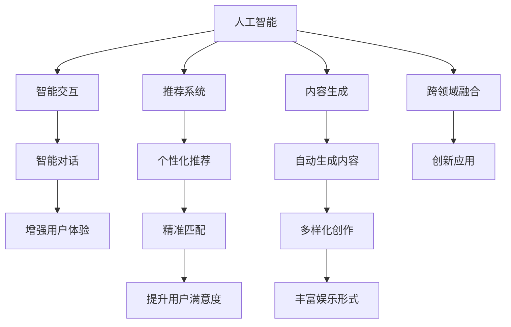

                 

# 数字化休闲：AI重塑娱乐方式

## 1. 背景介绍

### 1.1 问题由来
近年来，随着人工智能技术的快速发展，娱乐产业发生了深刻的变革。传统的娱乐方式，如电影、电视、游戏等，逐渐融入了AI技术，形成了新的数字化休闲模式。这些数字化休闲方式不仅改变了人们的娱乐习惯，也对文化、教育、健康等多个领域产生了深远影响。

### 1.2 问题核心关键点
当前，数字化休闲的核心在于如何利用AI技术，提升娱乐内容的个性化、互动性、沉浸式体验，并带来更为多样化的娱乐形式。AI技术在推荐系统、内容生成、智能交互等方面的应用，使得娱乐产业从简单的单向传播转向了双向互动，用户能够更加主动地参与和影响娱乐内容。

### 1.3 问题研究意义
研究AI在数字化休闲中的应用，对于探索新型的娱乐方式、提升用户体验、推动娱乐产业的数字化转型具有重要意义：

1. 提升娱乐内容的个性化和精准化。AI可以根据用户的行为和偏好，精准推荐个性化的娱乐内容，满足用户的多样化需求。
2. 增强互动性和沉浸式体验。AI技术能够实现更加自然和智能的交互，提升用户的沉浸感和参与感。
3. 创造新的娱乐形式。AI在内容生成和创作上的强大能力，为娱乐产业带来了新的创意和表现形式。
4. 推动娱乐产业的创新发展。AI技术的应用，能够提升娱乐产业的智能化水平，促进其向更高质量、更高效率的方向发展。
5. 促进跨领域融合。AI技术能够跨越娱乐、文化、教育、健康等多个领域，实现跨领域的融合创新。

## 2. 核心概念与联系

### 2.1 核心概念概述

为更好地理解AI在数字化休闲中的应用，本节将介绍几个关键概念及其相互关系：

- 人工智能(AI)：指利用计算机模拟人类智能的行为，通过机器学习、深度学习等算法，实现自主感知、学习、决策和交互等智能功能。
- 推荐系统：根据用户的历史行为和偏好，推荐个性化内容或产品。AI推荐系统利用深度学习模型，可以更准确地预测用户需求。
- 内容生成：通过AI技术，自动生成文本、音乐、图像等娱乐内容。AI在文本生成、图像生成、音乐创作等方面的应用，使得内容创作变得更加高效和多样。
- 智能交互：通过语音识别、自然语言处理、情感计算等技术，实现人与AI之间的智能对话和交互，提升用户体验。
- 跨领域融合：AI技术可以跨界应用于娱乐、文化、教育、健康等多个领域，实现不同领域的融合创新。

这些核心概念之间的逻辑关系可以通过以下Mermaid流程图来展示：



这个流程图展示了一些核心概念及其之间的相互关系：

1. 人工智能通过推荐系统、内容生成、智能交互等多种形式，应用于娱乐产业。
2. 推荐系统通过深度学习模型，可以精准推荐个性化内容，提升用户体验。
3. 内容生成技术可以自动生成多种娱乐内容，丰富娱乐形式。
4. 智能交互技术能够实现人与AI的智能对话，增强用户体验。
5. 跨领域融合可以将AI技术应用于多个领域，实现创新应用。

这些概念共同构成了AI在数字化休闲中的基本框架，使得AI技术在娱乐产业中得以广泛应用。通过理解这些核心概念，我们可以更好地把握AI在娱乐中的应用方向和优化目标。

## 3. 核心算法原理 & 具体操作步骤

### 3.1 算法原理概述

AI在数字化休闲中的应用，主要依赖于推荐系统和内容生成技术。这些技术通过深度学习模型，从用户行为数据中学习到用户偏好和内容特征，进而实现个性化推荐和内容生成。

具体来说，推荐系统通过以下步骤实现个性化推荐：

1. **数据收集**：收集用户的历史行为数据，如浏览记录、购买记录、评分数据等。
2. **特征提取**：从用户行为数据中提取特征，如用户兴趣、内容属性等。
3. **模型训练**：使用深度学习模型（如神经网络、矩阵分解等），根据用户特征和内容特征，预测用户对不同内容的评分或点击概率。
4. **推荐生成**：根据预测结果，生成个性化推荐列表，展示给用户。

内容生成技术则通过以下步骤实现自动内容创作：

1. **数据收集**：收集大量已有内容数据，如文本、图像、音乐等。
2. **特征提取**：从已有内容中提取特征，如词向量、颜色向量、音符向量等。
3. **模型训练**：使用生成模型（如循环神经网络、变分自编码器等），学习内容的生成规律。
4. **内容生成**：根据生成的特征向量，使用模型生成新的内容，如文本、图像、音乐等。

### 3.2 算法步骤详解

**推荐系统**：

1. **数据预处理**：对用户行为数据和内容数据进行清洗和预处理，去除噪声和无效数据。
2. **特征工程**：设计合适的特征工程策略，提取用户和内容的有用特征，如用户兴趣向量、内容属性向量等。
3. **模型训练**：选择合适的深度学习模型，如协同过滤、矩阵分解、神经网络等，使用训练集数据训练模型。
4. **模型评估**：在验证集上评估模型的性能，使用指标如精确率、召回率、F1值等评估模型的效果。
5. **推荐生成**：使用训练好的模型对测试集中的用户进行推荐，生成个性化推荐列表。

**内容生成**：

1. **数据收集**：收集大量已有的娱乐内容数据，如电影、音乐、书籍等。
2. **特征提取**：使用文本、图像、音频等预训练模型，将内容数据转化为高维特征向量。
3. **模型训练**：使用生成模型（如GAN、VAE等），学习内容的生成规律。
4. **内容生成**：使用训练好的模型生成新的内容，如生成新的文本、音乐、图像等。

### 3.3 算法优缺点

AI在数字化休闲中的应用，具有以下优点：

1. **个性化推荐**：AI推荐系统能够根据用户的历史行为和偏好，精准推荐个性化内容，提升用户体验。
2. **内容多样化**：内容生成技术可以自动生成多种娱乐内容，丰富娱乐形式。
3. **交互性增强**：智能交互技术能够实现人与AI的智能对话，提升用户体验。
4. **高效便捷**：AI技术可以自动化处理大量数据，提升内容推荐和内容生成的效率。

同时，这些技术也存在一定的局限性：

1. **数据隐私**：推荐系统和内容生成技术需要收集大量用户数据，可能涉及隐私问题。
2. **模型复杂度**：深度学习模型通常具有较高的复杂度，需要大量的计算资源和数据支持。
3. **过度依赖**：用户可能会过度依赖AI推荐的内容，缺乏主动探索的积极性。
4. **内容多样性**：过度依赖推荐系统可能导致内容多样性减少，用户体验可能变得单一。
5. **交互性局限**：当前的智能交互技术仍存在一定的局限性，难以完全替代人类交互。

尽管存在这些局限性，但AI技术在娱乐产业中的应用已经取得了显著效果，为未来数字化休闲的发展奠定了坚实基础。

### 3.4 算法应用领域

AI在数字化休闲中的应用领域广泛，涵盖以下多个方面：

- **个性化推荐**：如Netflix、Amazon Prime Video、Spotify等平台，通过AI推荐系统，为用户推荐个性化电影、电视剧、音乐等。
- **内容生成**：如DeepMind的AlphaStar、OpenAI的DALL·E等，使用AI技术自动生成高水平的娱乐内容。
- **智能交互**：如Siri、Alexa、Google Assistant等智能助手，通过自然语言处理和情感计算，实现人与AI的智能对话。
- **跨领域融合**：如谷歌的谷歌图书、微软的智能词典等，通过AI技术跨越娱乐、教育、文化等多个领域，实现融合创新。

## 4. 数学模型和公式 & 详细讲解 & 举例说明

### 4.1 数学模型构建

本节将使用数学语言对AI在数字化休闲中的应用进行更加严格的刻画。

设用户对内容的评分矩阵为 $R \in \mathbb{R}^{N \times M}$，其中 $N$ 为用户数，$M$ 为内容数。用户对内容的评分可以用 $R_{i,j}$ 表示，即用户 $i$ 对内容 $j$ 的评分。

推荐系统的目标是最小化预测误差，即：

$$
\min_{\theta} \frac{1}{N} \sum_{i=1}^N \sum_{j=1}^M (R_{i,j} - f_i(\text{Content}_j))^2
$$

其中 $f_i$ 为用户的评分预测函数，$\text{Content}_j$ 为内容 $j$ 的特征表示，$\theta$ 为模型的参数。

### 4.2 公式推导过程

以下我们以协同过滤为例，推导推荐系统的基本公式。

设用户 $i$ 对内容 $j$ 的评分矩阵 $R_{i,j}$ 为：

$$
R_{i,j} = f_i(\text{Content}_j) + \epsilon
$$

其中 $\epsilon$ 为误差项，假设误差服从均值为0，方差为 $\sigma^2$ 的高斯分布。

推荐系统通过最小化预测误差，即：

$$
\min_{\theta} \frac{1}{N} \sum_{i=1}^N \sum_{j=1}^M (R_{i,j} - f_i(\text{Content}_j))^2 = \min_{\theta} \frac{1}{N} \sum_{i=1}^N \sum_{j=1}^M \epsilon^2
$$

通过对误差项进行最小化，推荐系统可以学习到用户和内容的特征表示，从而实现个性化推荐。

### 4.3 案例分析与讲解

假设有一家在线音乐平台，希望利用AI技术为用户推荐个性化的音乐。平台收集了用户的历史听歌记录，并将每首歌曲的特征（如流派、风格、时长等）转化为特征向量。使用协同过滤算法，对用户和歌曲的评分矩阵进行训练，得到用户和歌曲的特征表示。在用户访问平台时，根据其特征表示和已训练的模型，生成个性化的音乐推荐列表。

## 5. 项目实践：代码实例和详细解释说明

### 5.1 开发环境搭建

在进行AI推荐系统开发前，我们需要准备好开发环境。以下是使用Python进行PyTorch开发的环境配置流程：

1. 安装Anaconda：从官网下载并安装Anaconda，用于创建独立的Python环境。

2. 创建并激活虚拟环境：
```bash
conda create -n pytorch-env python=3.8 
conda activate pytorch-env
```

3. 安装PyTorch：根据CUDA版本，从官网获取对应的安装命令。例如：
```bash
conda install pytorch torchvision torchaudio cudatoolkit=11.1 -c pytorch -c conda-forge
```

4. 安装其他库：
```bash
pip install numpy pandas scikit-learn torch nn sklearn.metrics
```

5. 安装相关依赖：
```bash
pip install catboost pytorch-lightning transformers 
```

完成上述步骤后，即可在`pytorch-env`环境中开始开发。

### 5.2 源代码详细实现

这里我们以一个简单的协同过滤推荐系统为例，使用PyTorch实现AI推荐系统的开发。

首先，定义推荐系统的主要类`Recommender`：

```python
from torch import nn
import torch.nn.functional as F

class Recommender(nn.Module):
    def __init__(self, n_users, n_items, emb_dim=10, device=None):
        super(Recommender, self).__init__()
        self.n_users = n_users
        self.n_items = n_items
        self.emb_dim = emb_dim
        
        # 用户嵌入层
        self.user_emb = nn.Embedding(n_users, emb_dim, device=device)
        # 物品嵌入层
        self.item_emb = nn.Embedding(n_items, emb_dim, device=device)
        
        # 用户-物品共现矩阵
        self.u2i = nn.Parameter(torch.randn(n_users, n_items), requires_grad=True)
        self.i2u = nn.Parameter(torch.randn(n_items, n_users), requires_grad=True)
        
    def forward(self, user_ids, item_ids):
        # 用户嵌入
        user_embs = self.user_emb(user_ids)
        # 物品嵌入
        item_embs = self.item_emb(item_ids)
        
        # 用户-物品共现矩阵
        user_item_matrix = user_embs @ self.u2i + item_embs @ self.i2u
        return user_item_matrix
```

然后，定义推荐系统的损失函数和优化器：

```python
from torch import Tensor

class RecommendationError(nn.Module):
    def __init__(self):
        super(RecommendationError, self).__init__()
    
    def forward(self, prediction, target):
        return ((prediction - target) ** 2).mean()

def train_recommender(recommender, train_data, batch_size, optimizer, num_epochs=100):
    recommender.train()
    criterion = RecommendationError()
    
    for epoch in range(num_epochs):
        for i, (user_ids, item_ids, targets) in enumerate(train_data):
            user_ids = Tensor(user_ids).long().to(device)
            item_ids = Tensor(item_ids).long().to(device)
            targets = Tensor(targets).to(device)
            
            optimizer.zero_grad()
            predictions = recommender(user_ids, item_ids)
            loss = criterion(predictions, targets)
            loss.backward()
            optimizer.step()
            
            if (i + 1) % 100 == 0:
                print(f"Epoch {epoch + 1}, Batch {i + 1}, Loss: {loss.item()}")
```

最后，训练推荐系统并在验证集上评估：

```python
from torch.utils.data import DataLoader
from sklearn.metrics import mean_squared_error
from sklearn.model_selection import train_test_split

# 假设train_data为已准备好的训练集数据
train_data, dev_data = train_test_split(train_data, test_size=0.2, random_state=42)

device = torch.device('cuda' if torch.cuda.is_available() else 'cpu')
recommender = Recommender(n_users, n_items, emb_dim=10, device=device)

train_loader = DataLoader(train_data, batch_size=64, shuffle=True)
optimizer = torch.optim.Adam(recommender.parameters(), lr=0.001)

train_recommender(recommender, train_loader, batch_size=64, optimizer=optimizer, num_epochs=100)

dev_loader = DataLoader(dev_data, batch_size=64, shuffle=True)
dev_loss = 0
for user_ids, item_ids, targets in dev_loader:
    user_ids = Tensor(user_ids).long().to(device)
    item_ids = Tensor(item_ids).long().to(device)
    targets = Tensor(targets).to(device)
    
    predictions = recommender(user_ids, item_ids)
    loss = criterion(predictions, targets)
    dev_loss += loss.item()
print(f"Validation Loss: {dev_loss / len(dev_loader):.4f}")
```

以上就是使用PyTorch进行AI推荐系统开发的完整代码实现。可以看到，使用PyTorch可以很方便地搭建推荐系统，并进行训练和评估。

### 5.3 代码解读与分析

让我们再详细解读一下关键代码的实现细节：

**Recommender类**：
- `__init__`方法：初始化用户和物品的嵌入层、用户-物品共现矩阵等关键组件。
- `forward`方法：对输入的用户ID和物品ID进行前向传播，计算用户-物品共现矩阵。

**RecommendationError类**：
- `forward`方法：计算预测值与真实值之间的误差，并求平均。

**train_recommender函数**：
- 在训练过程中，每个epoch循环遍历训练集，在每个批次上前向传播计算损失函数，并反向传播更新模型参数。
- 设置学习率、优化器等关键参数。

**train_loader和dev_loader**：
- 使用DataLoader对数据集进行批次化加载，供模型训练和推理使用。

**设备管理**：
- 判断GPU是否可用，并在训练过程中动态管理设备。

这些代码实现了基本的协同过滤推荐系统，展示了AI推荐系统的核心步骤和关键组件。在实际应用中，还需要根据具体任务进行优化设计，如改进模型结构、调整超参数、引入更多的正则化技术等，以进一步提升模型性能。

## 6. 实际应用场景

### 6.1 智能音乐推荐

基于AI的智能音乐推荐系统，已经在各大音乐平台广泛应用。如Spotify、Apple Music等平台，通过收集用户听歌历史和评分数据，训练推荐模型，实时生成个性化的音乐推荐列表。这些推荐系统不仅能够根据用户的历史行为和偏好推荐音乐，还能根据当前情感状态和环境变化进行推荐。

以Spotify为例，其推荐系统使用协同过滤和内容基推荐结合的方式，对用户和歌曲进行特征表示，学习用户和歌曲之间的关系，从而生成个性化的音乐推荐。Spotify的推荐系统还引入了情感计算和上下文感知，根据用户的情感状态和当前环境（如天气、时间等），生成更加贴合用户需求的推荐列表。

### 6.2 个性化电影推荐

Netflix和Amazon Prime Video等视频平台，通过AI技术为用户推荐个性化电影和电视剧。这些平台收集用户观看历史和评分数据，训练推荐模型，实时生成个性化的推荐列表。这些推荐系统不仅能够根据用户的历史行为和偏好推荐内容，还能根据用户当前的兴趣和需求进行推荐。

以Netflix为例，其推荐系统使用协同过滤和矩阵分解结合的方式，对用户和视频进行特征表示，学习用户和视频之间的关系，从而生成个性化的推荐列表。Netflix的推荐系统还引入了多目标优化和多臂老虎机算法，平衡多种推荐策略，提升推荐效果。

### 6.3 智能阅读推荐

基于AI的智能阅读推荐系统，已经在电子书和在线阅读平台广泛应用。如Kindle、Goodreads等平台，通过收集用户阅读历史和评分数据，训练推荐模型，实时生成个性化的书籍推荐列表。这些推荐系统不仅能够根据用户的历史行为和偏好推荐书籍，还能根据用户的当前需求和兴趣进行推荐。

以Kindle为例，其推荐系统使用协同过滤和内容基推荐结合的方式，对用户和书籍进行特征表示，学习用户和书籍之间的关系，从而生成个性化的阅读推荐。Kindle的推荐系统还引入了情感计算和上下文感知，根据用户的情感状态和当前需求（如天气、时间等），生成更加贴合用户需求的阅读推荐。

### 6.4 未来应用展望

随着AI技术的不断进步，数字化休闲的应用场景将更加丰富和多样。未来的数字化休闲可能包含以下几个方向：

1. **虚拟现实和增强现实**：结合VR/AR技术，创建沉浸式的娱乐体验，如虚拟旅游、虚拟演唱会等。
2. **社交网络**：利用AI技术，实现更加智能和高效的社交互动，如AI客服、虚拟助手等。
3. **个性化内容创作**：利用AI技术，自动生成多样化和高质量的娱乐内容，如自动作曲、自动绘画等。
4. **跨领域融合**：利用AI技术，实现跨领域的应用创新，如将娱乐与健康、教育等结合，提升娱乐体验的同时，提供更多的价值。
5. **智能家居**：结合AI技术，创建更加智能和便捷的家居环境，如智能音箱、智能电视等。

这些方向展示了数字化休闲的广阔前景，AI技术在娱乐产业的应用将为人们带来更加多样化和沉浸式的娱乐体验，推动娱乐产业的持续创新和发展。

## 7. 工具和资源推荐

### 7.1 学习资源推荐

为了帮助开发者系统掌握AI在数字化休闲中的应用，这里推荐一些优质的学习资源：

1. 《深度学习基础》课程：由斯坦福大学Andrew Ng教授主讲，介绍了深度学习的基本概念和常用技术。
2. 《机器学习实战》书籍：是一本实践性的机器学习入门书籍，介绍了机器学习算法和应用。
3. 《自然语言处理综论》书籍：是一本系统性的自然语言处理入门书籍，介绍了NLP的基本概念和技术。
4. 《深度学习与数据科学》课程：由DeepLearning.AI团队主讲，介绍了深度学习在各个领域的应用。
5. HuggingFace官方文档：提供了丰富的预训练语言模型和推荐系统资源，是进行AI推荐系统开发的必备资料。

通过对这些资源的学习实践，相信你一定能够快速掌握AI在数字化休闲中的应用，并用于解决实际的娱乐问题。

### 7.2 开发工具推荐

高效的开发离不开优秀的工具支持。以下是几款用于AI推荐系统开发的常用工具：

1. PyTorch：基于Python的开源深度学习框架，灵活的动态图计算，适合快速迭代研究。
2. TensorFlow：由Google主导开发的开源深度学习框架，生产部署方便，适合大规模工程应用。
3. PyTorch Lightning：基于PyTorch的轻量级深度学习框架，提供了丰富的模型组件和优化器，适合快速搭建和训练模型。
4. Scikit-learn：Python的机器学习库，提供了多种常用的机器学习算法和工具，适合进行模型评估和调参。
5. Keras：Python的深度学习库，提供了简单易用的接口和API，适合快速搭建和训练模型。

合理利用这些工具，可以显著提升AI推荐系统的开发效率，加快创新迭代的步伐。

### 7.3 相关论文推荐

AI在数字化休闲中的应用领域广泛，相关的研究论文也颇为丰富。以下是几篇奠基性的相关论文，推荐阅读：

1. "Collaborative Filtering for Recommender Systems"：介绍了协同过滤推荐系统的基本原理和应用。
2. "Neural Collaborative Filtering"：介绍了深度学习在推荐系统中的应用。
3. "Attention Is All You Need"：提出了Transformer模型，开创了自注意力机制在推荐系统中的应用。
4. "Generative Adversarial Nets"：介绍了生成对抗网络在内容生成中的应用。
5. "Semantic Search with Deep Learning"：介绍了AI在智能搜索中的应用，包括自然语言处理和知识图谱。

这些论文代表了AI在数字化休闲领域的研究进展，通过学习这些前沿成果，可以帮助研究者把握学科前进方向，激发更多的创新灵感。

## 8. 总结：未来发展趋势与挑战

### 8.1 总结

本文对AI在数字化休闲中的应用进行了全面系统的介绍。首先阐述了数字化休闲的背景和意义，明确了AI在提升用户体验、推动产业数字化转型方面的独特价值。其次，从原理到实践，详细讲解了AI推荐系统和内容生成技术的基本流程，给出了具体的代码实现。同时，本文还广泛探讨了AI在娱乐产业的应用前景，展示了AI技术在娱乐产业中的广阔前景。

通过本文的系统梳理，可以看到，AI在数字化休闲中的应用已经取得了显著效果，为未来的娱乐产业发展奠定了坚实基础。未来，伴随AI技术的不断进步，数字化休闲的应用场景将更加丰富和多样，为人们带来更加多样化和沉浸式的娱乐体验，推动娱乐产业的持续创新和发展。

### 8.2 未来发展趋势

展望未来，AI在数字化休闲中的应用将呈现以下几个发展趋势：

1. **技术创新**：AI推荐系统将继续进行技术创新，如引入深度学习、生成对抗网络等前沿技术，提升推荐效果和内容生成质量。
2. **跨领域融合**：AI技术将与文化、教育、健康等多个领域进行融合创新，实现跨领域的深度应用。
3. **个性化和定制化**：AI推荐系统将更加注重个性化和定制化，根据用户的独特需求和偏好，生成更加贴合用户的推荐内容。
4. **多模态融合**：AI推荐系统将融合文本、图像、音频等多模态数据，提供更加丰富和多样化的娱乐体验。
5. **智能交互**：AI推荐系统将进一步提升智能交互能力，实现更加自然和智能的对话和推荐。

这些趋势展示了AI在数字化休闲中的广阔前景，预示着未来的娱乐产业将变得更加智能化、个性化和多样化。

### 8.3 面临的挑战

尽管AI在数字化休闲中的应用已经取得了显著效果，但在迈向更加智能化、普适化应用的过程中，仍面临诸多挑战：

1. **数据隐私**：AI推荐系统需要收集大量用户数据，可能涉及隐私问题，如何保护用户数据隐私是重要的研究方向。
2. **模型复杂度**：深度学习模型通常具有较高的复杂度，需要大量的计算资源和数据支持，如何降低模型复杂度，提高计算效率，是重要的研究课题。
3. **内容多样性**：过度依赖推荐系统可能导致内容多样性减少，用户体验可能变得单一，如何丰富内容多样性，是重要的研究方向。
4. **交互性局限**：当前的智能交互技术仍存在一定的局限性，难以完全替代人类交互，如何提升智能交互体验，是重要的研究课题。
5. **技术普及**：如何使AI技术更加普及，减少技术壁垒，让更多人能够享受到AI带来的便利，是重要的研究方向。

尽管存在这些挑战，但AI技术在娱乐产业中的应用前景广阔，相信随着学界和产业界的共同努力，这些挑战终将一一被克服，AI推荐系统必将在未来的娱乐产业中发挥更加重要的作用。

### 8.4 研究展望

面对AI在数字化休闲中所面临的挑战，未来的研究需要在以下几个方面寻求新的突破：

1. **数据隐私保护**：引入联邦学习、差分隐私等技术，保护用户隐私。
2. **模型压缩和加速**：引入知识蒸馏、模型剪枝等技术，降低模型复杂度，提高计算效率。
3. **内容多样性增强**：引入多样化推荐算法，如标签嵌入、图嵌入等，丰富内容多样性。
4. **智能交互优化**：引入情感计算、上下文感知等技术，提升智能交互体验。
5. **技术普及推广**：通过开源社区、在线课程等途径，普及AI技术，降低技术壁垒。

这些研究方向的探索，必将引领AI在数字化休闲中的不断进步，为未来的娱乐产业带来更多的创新和发展。面向未来，AI推荐系统将更加智能化、个性化和多样化，成为推动娱乐产业数字化转型的重要引擎。

## 9. 附录：常见问题与解答

**Q1：AI在推荐系统中如何处理用户的多样化需求？**

A: AI推荐系统通过以下方式处理用户的多样化需求：

1. **个性化推荐**：AI推荐系统根据用户的历史行为和偏好，精准推荐个性化内容，满足用户的多样化需求。
2. **多目标优化**：AI推荐系统可以通过多目标优化，平衡多种推荐策略，提升推荐效果。
3. **内容生成**：AI内容生成技术可以自动生成多样化的娱乐内容，丰富推荐列表。
4. **跨领域融合**：AI推荐系统可以结合其他领域的知识，如知识图谱、逻辑规则等，提升推荐质量。

通过这些方式，AI推荐系统可以更好地满足用户的多样化需求，提升用户体验。

**Q2：AI推荐系统如何保护用户隐私？**

A: AI推荐系统可以通过以下方式保护用户隐私：

1. **差分隐私**：在数据收集和处理过程中，引入差分隐私技术，保护用户数据的隐私。
2. **联邦学习**：在分布式环境中，使用联邦学习技术，避免用户数据的集中存储和处理。
3. **数据脱敏**：在数据处理过程中，使用数据脱敏技术，去除敏感信息。
4. **匿名化处理**：在数据处理过程中，使用匿名化处理技术，保护用户数据的隐私。

通过这些方式，AI推荐系统可以更好地保护用户隐私，提升系统的可信度和安全性。

**Q3：AI推荐系统如何提高内容多样性？**

A: AI推荐系统可以通过以下方式提高内容多样性：

1. **多样化推荐算法**：引入多样化推荐算法，如标签嵌入、图嵌入等，丰富内容多样性。
2. **内容生成技术**：利用AI内容生成技术，自动生成多样化的娱乐内容，如自动作曲、自动绘画等。
3. **跨领域融合**：结合其他领域的知识，如知识图谱、逻辑规则等，提升推荐质量。
4. **多臂老虎机算法**：在多目标优化中，使用多臂老虎机算法，平衡多种推荐策略，提升推荐效果。

通过这些方式，AI推荐系统可以更好地提高内容多样性，提升用户体验。

**Q4：AI推荐系统如何提升智能交互体验？**

A: AI推荐系统可以通过以下方式提升智能交互体验：

1. **情感计算**：利用情感计算技术，识别用户的情感状态，提供更加贴合用户需求的推荐。
2. **上下文感知**：结合上下文信息，如天气、时间等，提供更加贴合用户需求的推荐。
3. **自然语言处理**：利用自然语言处理技术，实现更加自然和智能的对话和推荐。
4. **多模态融合**：融合文本、图像、音频等多模态数据，提供更加丰富和多样化的娱乐体验。

通过这些方式，AI推荐系统可以更好地提升智能交互体验，提升用户满意度。

**Q5：AI推荐系统如何在跨领域融合中发挥作用？**

A: AI推荐系统可以通过以下方式在跨领域融合中发挥作用：

1. **融合多模态数据**：结合文本、图像、音频等多模态数据，提供更加丰富和多样化的娱乐体验。
2. **结合专家知识**：结合知识图谱、逻辑规则等专家知识，提升推荐质量。
3. **跨领域推荐**：结合其他领域的知识，如健康、教育等，提升推荐效果。
4. **跨领域内容生成**：结合其他领域的知识，如知识图谱、逻辑规则等，提升内容生成质量。

通过这些方式，AI推荐系统可以更好地在跨领域融合中发挥作用，推动娱乐产业的持续创新和发展。

---

作者：禅与计算机程序设计艺术 / Zen and the Art of Computer Programming

