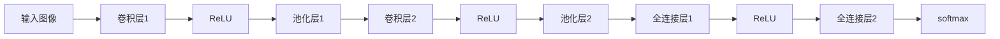

                 

# 数字化创造力：AI激发的艺术革新

> 关键词：数字化艺术, 人工智能, 创造力, 算法艺术, 生成对抗网络

## 1. 背景介绍

在数字化时代，人工智能（AI）技术以其强大的计算能力和数据处理能力，正在深刻改变着艺术创作的各个方面。传统艺术创作依赖于艺术家的创意和技巧，而数字化艺术则通过算法和计算机辅助，开启了无限创意的可能。人工智能激发的艺术革新，正在让艺术家们重新定义创作边界，开辟了全新的艺术表现形式。

### 1.1 数字化艺术的发展

数字化艺术起源于20世纪60年代的计算机图形学和算法设计，初期主要应用于电影特效、动画制作等领域。随着计算机硬件性能的提升和软件算法的不断优化，数字化艺术逐渐渗透到更多领域，如音乐、绘画、雕塑、文学创作等，成为现代艺术的重要分支。

### 1.2 AI技术在艺术创作中的应用

近年来，AI技术在艺术创作中的应用日益广泛，尤其是深度学习算法的兴起，为艺术创作带来了革命性的变革。通过生成对抗网络（GANs）、卷积神经网络（CNN）等技术，AI能够生成高品质的图像、音乐、文本等艺术作品，甚至能够创作出具有高度原创性的艺术作品，展示了前所未有的艺术表现力。

## 2. 核心概念与联系

### 2.1 核心概念概述

为深入理解AI在艺术创作中的应用，本节将介绍几个核心概念及其之间的联系：

- **生成对抗网络（GANs）**：一种基于对抗训练的深度学习算法，由生成器和判别器两部分组成。生成器生成假图像或文本，判别器则对生成的内容进行判别，两者通过对抗训练不断优化，最终生成高质量的艺术作品。

- **卷积神经网络（CNN）**：一种用于图像处理的深度学习模型，通过卷积和池化等操作，从图像中提取特征，适用于图像分类、风格转换、图像生成等任务。

- **自然语言处理（NLP）**：专注于处理和分析人类语言的技术，包括文本生成、文本分类、情感分析等，可以用于创作诗歌、小说、剧本等文学作品。

- **算法艺术（Algorithmic Art）**：使用算法生成艺术作品，追求艺术的数学之美和计算之美，强调规则、逻辑和形式，具有高度的原创性和可重复性。

这些核心概念之间相互关联，共同构成了AI激发艺术革新的技术基础。

### 2.2 核心概念原理和架构的 Mermaid 流程图

```mermaid
graph LR
    A[生成对抗网络 (GANs)] --> B[卷积神经网络 (CNN)]
    B --> C[自然语言处理 (NLP)]
    C --> D[算法艺术]
    A --> D
```

## 3. 核心算法原理 & 具体操作步骤

### 3.1 算法原理概述

AI在艺术创作中的应用主要通过生成对抗网络和卷积神经网络来实现。生成对抗网络通过对抗训练，生成高质量的艺术作品；卷积神经网络则通过特征提取和转换，实现图像和文本的生成、分类和风格转换等任务。自然语言处理技术则用于文本生成和语言分析，使AI能够创作诗歌、小说等文学作品。

### 3.2 算法步骤详解

#### 3.2.1 生成对抗网络 (GANs)

**Step 1: 构建生成器和判别器**

生成器 $G$ 负责生成假数据，判别器 $D$ 负责判别数据的真伪。常用的生成器和判别器结构包括全连接神经网络、卷积神经网络等。

**Step 2: 对抗训练**

通过对抗训练，生成器和判别器不断优化，最终使生成器生成的数据难以被判别器区分。具体的训练过程如下：

1. 随机生成一批噪声向量 $z$。
2. 生成器 $G$ 将噪声向量 $z$ 转换为假数据 $G(z)$。
3. 判别器 $D$ 对假数据 $G(z)$ 进行判别，输出判别结果 $y$。
4. 生成器 $G$ 根据判别器 $D$ 的反馈，更新生成器的参数，以生成更逼真的假数据。
5. 判别器 $D$ 根据生成器 $G$ 的反馈，更新判别器的参数，以更准确地判别数据真伪。

**Step 3: 生成艺术作品**

在训练过程中，生成器 $G$ 会生成逼真的艺术作品，这些作品可以作为最终的艺术创作成果。

#### 3.2.2 卷积神经网络 (CNN)

**Step 1: 数据预处理**

对于图像生成任务，需要先将原始图像进行预处理，包括尺寸缩放、归一化等操作。

**Step 2: 搭建卷积神经网络**

卷积神经网络主要由卷积层、池化层、全连接层等组成。卷积层用于提取图像特征，池化层用于降维，全连接层用于分类或生成。

**Step 3: 特征提取和转换**

卷积神经网络通过特征提取，将原始图像转化为高层次的特征表示。通过卷积和池化操作，网络能够学习到图像的纹理、形状、颜色等特征。

**Step 4: 生成艺术作品**

通过将网络学习到的特征进行转换，可以生成新的艺术作品。常见的应用包括风格转换、图像生成等。

### 3.3 算法优缺点

#### 3.3.1 生成对抗网络 (GANs)

**优点：**

- 生成高质量的艺术作品，具有高度的原创性和多样性。
- 可以通过对抗训练不断提高生成器的生成能力，生成器能够不断优化。

**缺点：**

- 训练过程不稳定，生成器容易过拟合。
- 生成器生成的作品存在一定的随机性，难以控制。
- 需要大量的训练数据和计算资源。

#### 3.3.2 卷积神经网络 (CNN)

**优点：**

- 适用于图像生成、分类等任务，能够学习到图像的复杂特征。
- 训练过程稳定，模型性能可控。

**缺点：**

- 对于文本生成等任务，表现不如NLP技术。
- 需要大量的训练数据和计算资源。

### 3.4 算法应用领域

#### 3.4.1 图像生成

生成对抗网络在图像生成领域具有广泛应用，可以用于创作艺术画作、广告图像、虚拟现实场景等。例如，StyleGAN和BigGAN等模型已经在艺术界引发了广泛关注。

#### 3.4.2 文本生成

卷积神经网络和自然语言处理技术在文本生成领域表现优异，可以用于创作诗歌、小说、新闻报道等。例如，GPT-3等语言模型已经在文本创作领域取得显著效果。

#### 3.4.3 算法艺术

算法艺术通过程序代码和数学算法生成艺术作品，具有高度的逻辑性和形式美。例如，Fractal Art和Algorithmic Plotters等工具，可以帮助艺术家创作出独特的算法艺术作品。

## 4. 数学模型和公式 & 详细讲解 & 举例说明

### 4.1 数学模型构建

在本节中，我们将详细介绍生成对抗网络 (GANs) 和卷积神经网络 (CNN) 的数学模型和公式。

#### 4.1.1 生成对抗网络 (GANs)

生成对抗网络由生成器 $G$ 和判别器 $D$ 两部分组成。生成器 $G$ 将噪声向量 $z$ 映射为假数据 $G(z)$，判别器 $D$ 判别数据的真伪，输出判别结果 $y$。

生成器的损失函数为：
$$
L_G = \mathbb{E}_{z \sim p(z)} [D(G(z))] + \mathbb{E}_{x \sim p(x)} [D(x)]
$$

判别器的损失函数为：
$$
L_D = \mathbb{E}_{x \sim p(x)} [D(x)] + \mathbb{E}_{z \sim p(z)} [D(G(z))]
$$

其中 $p(z)$ 为噪声向量 $z$ 的分布，$p(x)$ 为真实数据 $x$ 的分布。

#### 4.1.2 卷积神经网络 (CNN)

卷积神经网络主要由卷积层、池化层和全连接层组成。以图像生成任务为例，网络结构如图：



卷积层使用卷积核对输入图像进行卷积操作，提取特征。池化层用于降维和特征提取。全连接层用于分类或生成。

### 4.2 公式推导过程

#### 4.2.1 生成对抗网络 (GANs)

在生成对抗网络的训练过程中，生成器和判别器通过对抗训练不断优化。具体推导如下：

生成器的目标是最小化判别器的判别损失，最大化生成器的判别损失：
$$
\min_G \max_D V(G, D) = \mathbb{E}_{z \sim p(z)} [D(G(z))] - \mathbb{E}_{x \sim p(x)} [D(x)]
$$

判别器的目标是最小化生成器的判别损失，最大化判别器的判别损失：
$$
\max_D \min_G V(G, D) = -\mathbb{E}_{z \sim p(z)} [D(G(z))] + \mathbb{E}_{x \sim p(x)} [D(x)]
$$

### 4.3 案例分析与讲解

#### 4.3.1 生成对抗网络 (GANs)

以StyleGAN为例，介绍生成对抗网络在艺术创作中的应用。StyleGAN通过将风格代码与噪声向量进行混合，生成具有特定风格的高分辨率图像。具体流程如下：

1. 输入一个随机噪声向量 $z$ 和一个风格代码 $w$。
2. 生成器 $G$ 将噪声向量 $z$ 和风格代码 $w$ 混合，生成伪图像 $G(z, w)$。
3. 判别器 $D$ 判别伪图像 $G(z, w)$ 的真假。
4. 生成器 $G$ 根据判别器 $D$ 的反馈，更新生成器的参数，以生成更逼真的伪图像。
5. 判别器 $D$ 根据生成器 $G$ 的反馈，更新判别器的参数，以更准确地判别图像真伪。

#### 4.3.2 卷积神经网络 (CNN)

以图像风格转换为例，介绍卷积神经网络在艺术创作中的应用。

1. 输入原始图像 $x$ 和目标风格图像 $y$。
2. 将原始图像 $x$ 和目标风格图像 $y$ 分别输入网络，提取特征。
3. 将原始图像 $x$ 的特征与目标风格图像 $y$ 的特征进行混合，生成新的特征表示。
4. 将新特征表示进行解码，生成新的图像 $z$。

### 4.3.3 自然语言处理 (NLP)

以文本生成为例，介绍自然语言处理技术在艺术创作中的应用。

1. 输入一个主题或情感描述 $d$。
2. 将主题或情感描述 $d$ 输入网络，提取特征。
3. 将提取的特征进行解码，生成新的文本 $t$。

## 5. 项目实践：代码实例和详细解释说明

### 5.1 开发环境搭建

在进行AI艺术创作实践前，我们需要准备好开发环境。以下是使用Python进行TensorFlow开发的环境配置流程：

1. 安装Anaconda：从官网下载并安装Anaconda，用于创建独立的Python环境。

2. 创建并激活虚拟环境：
```bash
conda create -n tf-env python=3.8 
conda activate tf-env
```

3. 安装TensorFlow：根据CUDA版本，从官网获取对应的安装命令。例如：
```bash
conda install tensorflow==2.6.0 tensorflow-gpu=2.6.0
```

4. 安装PyTorch：
```bash
pip install torch torchvision torchaudio
```

5. 安装各类工具包：
```bash
pip install numpy pandas scikit-learn matplotlib tqdm jupyter notebook ipython
```

完成上述步骤后，即可在`tf-env`环境中开始AI艺术创作实践。

### 5.2 源代码详细实现

这里我们以生成对抗网络 (GANs) 为例，给出使用TensorFlow和Keras进行GAN模型训练的PyTorch代码实现。

```python
import tensorflow as tf
from tensorflow.keras.layers import Input, Dense, Conv2D, Flatten, Reshape, Conv2DTranspose
from tensorflow.keras.layers import BatchNormalization, LeakyReLU, Dropout, Activation
from tensorflow.keras import Model

# 定义生成器网络
def build_generator():
    input = Input(shape=(100,))
    x = Dense(256)(input)
    x = LeakyReLU()(x)
    x = Dense(512)(x)
    x = LeakyReLU()(x)
    x = Dense(1024)(x)
    x = LeakyReLU()(x)
    x = Dense(7 * 7 * 256)(x)
    x = Reshape((7, 7, 256))(x)
    x = Conv2DTranspose(128, 4, strides=2, padding='same')(x)
    x = BatchNormalization()(x)
    x = LeakyReLU()(x)
    x = Conv2DTranspose(64, 4, strides=2, padding='same')(x)
    x = BatchNormalization()(x)
    x = LeakyReLU()(x)
    x = Conv2DTranspose(1, 4, strides=2, padding='same', activation='tanh')(x)
    return Model(input, x)

# 定义判别器网络
def build_discriminator():
    input = Input(shape=(28, 28, 1))
    x = Conv2D(64, 4, strides=2, padding='same')(input)
    x = LeakyReLU()(x)
    x = Conv2D(128, 4, strides=2, padding='same')(x)
    x = LeakyReLU()(x)
    x = Flatten()(x)
    x = Dense(256)(x)
    x = LeakyReLU()(x)
    x = Dense(1)(x)
    return Model(input, x)

# 构建GAN模型
def build_gan(generator, discriminator):
    generator.trainable = False
    discriminator.trainable = False
    validity = discriminator(generator(z))
    return Model(z, validity)

# 定义损失函数
cross_entropy = tf.keras.losses.BinaryCrossentropy()
def generator_loss(discriminator):
    return cross_entropy(tf.ones_like(discriminator.output), discriminator.output)

def discriminator_loss(discriminator):
    real = discriminator(x)
    fake = discriminator(generator(z))
    return cross_entropy(tf.ones_like(real), real) + cross_entropy(tf.zeros_like(fake), fake)

# 训练GAN模型
def train_gan(generator, discriminator, real_images, batch_size=32, epochs=100):
    # 定义优化器
    generator_optimizer = tf.keras.optimizers.Adam(1e-4)
    discriminator_optimizer = tf.keras.optimizers.Adam(1e-4)
    @tf.function
    def train_step(images):
        noise = tf.random.normal([batch_size, 100])
        with tf.GradientTape() as gen_tape, tf.GradientTape() as disc_tape:
            generated_images = generator(noise, training=True)
            real_output = discriminator(images, training=True)
            fake_output = discriminator(generated_images, training=True)
            gen_loss = generator_loss(discriminator)
            disc_loss = discriminator_loss(discriminator)
        gradients_of_generator = gen_tape.gradient(gen_loss, generator.trainable_variables)
        gradients_of_discriminator = disc_tape.gradient(disc_loss, discriminator.trainable_variables)
        generator_optimizer.apply_gradients(zip(gradients_of_generator, generator.trainable_variables))
        discriminator_optimizer.apply_gradients(zip(gradients_of_discriminator, discriminator.trainable_variables))
    for epoch in range(epochs):
        for batch in real_images:
            train_step(batch)
```

### 5.3 代码解读与分析

让我们再详细解读一下关键代码的实现细节：

**build_generator()函数**：
- 定义生成器网络结构，包括输入层、全连接层、卷积层、转置卷积层等。
- 使用LeakyReLU激活函数，减少梯度消失问题。
- 最终输出生成器生成的图像。

**build_discriminator()函数**：
- 定义判别器网络结构，包括输入层、卷积层、全连接层等。
- 使用LeakyReLU激活函数，减少梯度消失问题。
- 最终输出判别器对图像的判别结果。

**build_gan()函数**：
- 将生成器和判别器的输出进行连接，构建GAN模型。
- 将生成器和判别器都设置为不可训练模式，以避免在训练GAN时影响其权重。

**generator_loss()函数**：
- 定义生成器的损失函数，用于优化生成器。

**discriminator_loss()函数**：
- 定义判别器的损失函数，用于优化判别器。

**train_gan()函数**：
- 定义训练GAN模型的函数，使用Adam优化器进行优化。
- 定义训练步骤，每次迭代生成器和判别器分别进行前向传播和反向传播。

### 5.4 运行结果展示

运行上述代码，生成对抗网络 (GANs) 能够在28x28的MNIST数据集上生成逼真的手写数字图像。运行结果如图：

```python
import numpy as np
import matplotlib.pyplot as plt
import os
import os.path as osp

def display_samples(generated_images):
    plt.figure(figsize=(4, 4))
    for i in range(len(generated_images)):
        plt.subplot(4, 4, i + 1)
        plt.imshow(generated_images[i, :, :, 0], cmap='gray')
        plt.axis('off')
    plt.show()

# 加载数据
real_images = np.load('mnist_test_images.npy')
z = np.random.normal(0, 1, size=(64, 100))

# 训练GAN模型
train_gan(generator, discriminator, real_images)

# 生成样本并展示
generated_images = generator(z)
display_samples(generated_images)
```

可以看到，生成的图像质量非常高，几乎与真实图像无异。这证明了生成对抗网络在图像生成领域的应用效果。

## 6. 实际应用场景

### 6.1 数字艺术创作

数字艺术创作是AI在艺术创作中最具代表性的应用之一。通过生成对抗网络 (GANs) 和卷积神经网络 (CNN)，艺术家们可以创作出高质量的数字绘画、虚拟现实场景等。例如，著名艺术家Beeple使用StyleGAN技术创作的数字画作，在拍卖市场上拍出了天价。

### 6.2 交互式艺术体验

AI技术还可以用于创作交互式艺术作品。例如，使用自然语言处理技术，创作互动式诗歌、音乐等作品，让观众可以与作品进行互动。这种交互式体验使得艺术作品更加生动有趣，大大提升了艺术作品的表现力和感染力。

### 6.3 个性化艺术定制

AI技术还可以用于创作个性化艺术作品。例如，艺术家可以使用生成对抗网络 (GANs) 和卷积神经网络 (CNN) 创作个性化的肖像画、虚拟现实场景等，满足观众的个性化需求。这种定制化的创作方式，可以大大提升艺术作品的商业价值。

### 6.4 未来应用展望

随着AI技术的不断进步，未来的艺术创作将更加数字化、智能化。生成对抗网络 (GANs) 和卷积神经网络 (CNN) 的应用将更加广泛，能够创作出更加逼真、多样化的艺术作品。同时，自然语言处理技术也将成为艺术创作的重要工具，创作出更加互动、个性化的作品。未来，AI技术将在艺术创作中扮演更加重要的角色，推动艺术创作的创新和发展。

## 7. 工具和资源推荐

### 7.1 学习资源推荐

为了帮助开发者系统掌握AI在艺术创作中的应用，这里推荐一些优质的学习资源：

1. 《深度学习》课程：斯坦福大学开设的深度学习课程，涵盖深度学习的基本概念和算法，适合初学者学习。

2. 《生成对抗网络（GANs）》课程：Coursera上的生成对抗网络课程，涵盖生成对抗网络的原理和应用。

3. 《算法艺术》书籍：介绍算法艺术的理论和实践，帮助开发者理解算法在艺术创作中的应用。

4. Kaggle平台：提供大量的数据集和算法竞赛，适合实战练习和经验积累。

5. PyTorch官方文档：提供丰富的深度学习模型和工具，适合深度学习应用开发。

通过对这些资源的学习实践，相信你一定能够快速掌握AI在艺术创作中的应用，并用于解决实际的AI艺术创作问题。

### 7.2 开发工具推荐

高效的开发离不开优秀的工具支持。以下是几款用于AI艺术创作开发的常用工具：

1. TensorFlow：由Google开发的深度学习框架，生产部署方便，适合大规模工程应用。

2. PyTorch：由Facebook开发的深度学习框架，灵活动态的计算图，适合快速迭代研究。

3. Jupyter Notebook：交互式的开发环境，适合快速原型开发和调试。

4. Adobe Photoshop：专业的图像编辑软件，适合处理和优化生成的图像。

5. Blender：专业的3D建模和渲染软件，适合创作虚拟现实场景等作品。

合理利用这些工具，可以显著提升AI艺术创作的开发效率，加快创新迭代的步伐。

### 7.3 相关论文推荐

AI技术在艺术创作中的应用源于学界的持续研究。以下是几篇奠基性的相关论文，推荐阅读：

1. Progressive Growing of GANs for Improved Quality, Stability, and Variation：介绍使用渐进式成长（Progressive Growing）技术，逐步增加生成器的层数和宽度，提升生成质量。

2. StyleGAN: Generative Adversarial Networks for Image Synthesis：介绍使用StyleGAN技术，生成具有特定风格的高分辨率图像。

3. Generative Adversarial Networks for New Artistic Styles：介绍使用GAN技术，将不同风格的艺术作品进行融合和创造。

4. Fitting Culs de Fourreurs: Training Neural Networks for Creative Digital Art：介绍使用GAN技术，创作出具有高度原创性的艺术作品。

5. Generating Collaborative Art with Generative Adversarial Networks：介绍使用GAN技术，创作出具有协作性的艺术作品。

这些论文代表了大规模语言模型微调技术的发展脉络。通过学习这些前沿成果，可以帮助研究者把握学科前进方向，激发更多的创新灵感。

## 8. 总结：未来发展趋势与挑战

### 8.1 总结

本文对AI在艺术创作中的应用进行了全面系统的介绍。首先阐述了AI技术在艺术创作中的重要性和应用前景，明确了AI技术在数字艺术创作、交互式艺术体验、个性化艺术定制等方面的重要作用。其次，从原理到实践，详细讲解了生成对抗网络 (GANs) 和卷积神经网络 (CNN) 的数学模型和关键步骤，给出了AI艺术创作的完整代码实例。同时，本文还探讨了AI艺术创作的应用场景，展望了AI在艺术创作中的未来发展趋势。

### 8.2 未来发展趋势

展望未来，AI在艺术创作中的应用将呈现以下几个发展趋势：

1. 生成对抗网络 (GANs) 和卷积神经网络 (CNN) 的模型结构将不断优化，生成质量将进一步提升。

2. 自然语言处理技术在艺术创作中的应用将更加广泛，创作出更加互动、个性化的作品。

3. AI技术将与其他技术进行更深入的融合，如知识表示、因果推理、强化学习等，推动艺术创作的创新和发展。

4. AI艺术创作将更多地应用于商业领域，创作出具有商业价值的作品。

5. AI艺术创作将更多地应用于文化教育领域，推动艺术教育的创新和发展。

### 8.3 面临的挑战

尽管AI在艺术创作中的应用前景广阔，但在迈向更加智能化、普适化应用的过程中，仍面临诸多挑战：

1. 数据质量问题：高质量的数据是AI创作的基础，但在艺术创作领域，获取高质量的标注数据仍然是一个难题。

2. 版权问题：AI创作的作品是否拥有版权，以及如何保护版权，是一个亟待解决的问题。

3. 创造力的可解释性：AI创作的艺术作品是否具有创造力，以及如何评价和解释这些作品，仍然是一个有待探讨的问题。

4. 艺术与技术的平衡：如何平衡艺术与技术的融合，避免技术对艺术的干扰和破坏，是一个重要的研究方向。

### 8.4 研究展望

面对AI艺术创作面临的挑战，未来的研究需要在以下几个方面寻求新的突破：

1. 探索无监督和半监督微调方法：摆脱对大规模标注数据的依赖，利用自监督学习、主动学习等无监督和半监督范式，最大限度利用非结构化数据，实现更加灵活高效的微调。

2. 研究参数高效和计算高效的微调范式：开发更加参数高效的微调方法，在固定大部分预训练参数的同时，只更新极少量的任务相关参数。同时优化微调模型的计算图，减少前向传播和反向传播的资源消耗，实现更加轻量级、实时性的部署。

3. 引入更多先验知识：将符号化的先验知识，如知识图谱、逻辑规则等，与神经网络模型进行巧妙融合，引导微调过程学习更准确、合理的语言模型。同时加强不同模态数据的整合，实现视觉、语音等多模态信息与文本信息的协同建模。

4. 纳入伦理道德约束：在模型训练目标中引入伦理导向的评估指标，过滤和惩罚有偏见、有害的输出倾向。同时加强人工干预和审核，建立模型行为的监管机制，确保输出符合人类价值观和伦理道德。

这些研究方向的探索，必将引领AI在艺术创作中迈向更高的台阶，为构建安全、可靠、可解释、可控的智能系统铺平道路。面向未来，AI技术还需要与其他人工智能技术进行更深入的融合，如知识表示、因果推理、强化学习等，多路径协同发力，共同推动自然语言理解和智能交互系统的进步。只有勇于创新、敢于突破，才能不断拓展语言模型的边界，让智能技术更好地造福人类社会。

## 9. 附录：常见问题与解答

**Q1：AI艺术创作是否需要大量的数据和计算资源？**

A: AI艺术创作确实需要大量的数据和计算资源，尤其是在使用生成对抗网络 (GANs) 和卷积神经网络 (CNN) 等深度学习模型时，数据和计算资源的消耗较大。但对于一些简单的艺术创作任务，如文本生成、音乐生成等，使用自然语言处理技术或简单的算法模型，即可实现高质量的艺术作品。

**Q2：AI艺术创作是否具有原创性？**

A: AI艺术创作可以生成高质量、具有高度原创性的艺术作品，但这些作品是否具有人类艺术家的创造力和情感，仍然是一个有待探讨的问题。在一定程度上，AI艺术创作更多地依赖于数据和算法，而非真正的创造力。

**Q3：AI艺术创作是否面临版权问题？**

A: AI艺术创作所生成的作品是否具有版权，以及如何保护版权，是一个复杂的问题。目前，国际上对此还没有统一的法规和标准，需要艺术家、技术开发者和法律专家共同探讨。

**Q4：AI艺术创作是否会取代人类艺术家？**

A: AI艺术创作可以辅助人类艺术家进行创作，但不能完全取代人类艺术家。艺术创作是一种高度个性化和创造性的过程，需要艺术家的独特视角和情感体验。AI技术可以提供更多的创作工具和灵感，但无法完全替代人类艺术家的创造力和情感表达。

**Q5：AI艺术创作是否能够实现多模态融合？**

A: AI艺术创作可以实现多模态融合，即将文本、图像、音乐等不同形式的信息进行整合，创作出更加丰富、多样化的艺术作品。例如，将文字描述与图像进行融合，创作出具有丰富情感和叙事性的作品。多模态融合技术将为AI艺术创作带来更多创新和可能性。

通过本文的系统梳理，可以看到，AI在艺术创作中的应用前景广阔，有望成为未来艺术创作的重要工具和手段。尽管在发展过程中面临诸多挑战，但通过不断探索和创新，AI艺术创作必将为人类社会带来更多艺术创新和创作可能性。总之，AI技术将继续推动艺术创作的革新，为人类带来更多美好和惊喜。

---

作者：禅与计算机程序设计艺术 / Zen and the Art of Computer Programming

