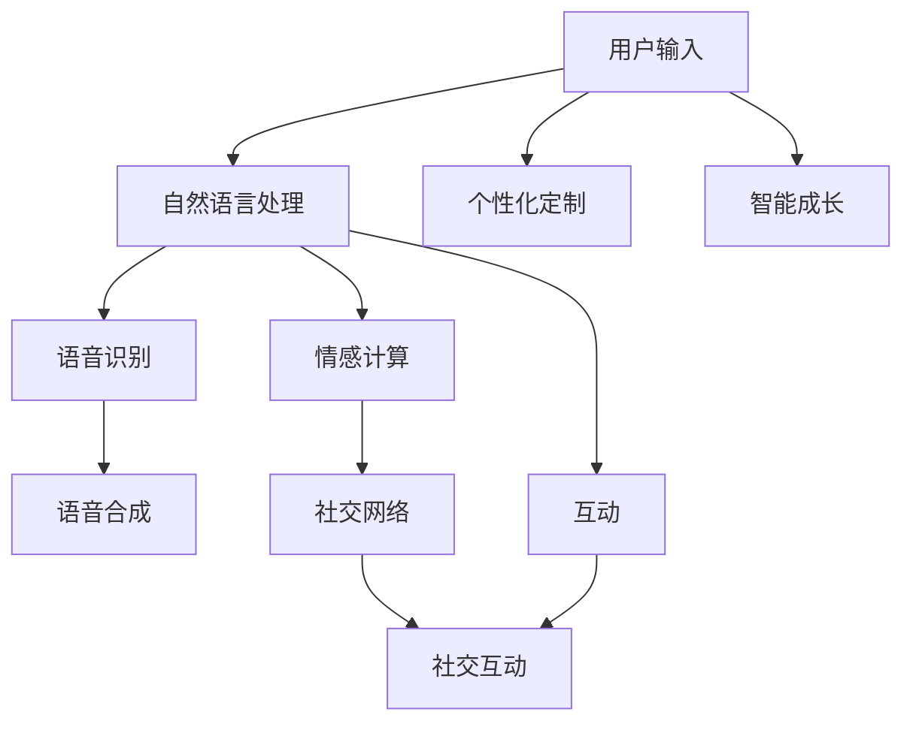

                 

## 1. 背景介绍

### 1.1 问题由来
随着人工智能和虚拟现实技术的飞速发展，元宇宙(The Metaverse)作为数字与物理世界深度融合的虚拟空间，正日益成为人们日常生活和社交的新空间。而在这个虚拟世界中，数字化宠物应运而生，它们不仅作为人们的娱乐和情感陪伴，还在社交互动、虚拟生活等方面扮演着重要的角色。

数字化宠物是指通过计算机程序和虚拟现实技术创建的，具有互动性和情感反馈的虚拟角色。它们可以通过模拟真实宠物的外观、行为和声音，以更加真实和互动的方式陪伴用户。随着技术的发展，这些数字化宠物已经从简单的聊天机器人、虚拟宠物游戏，逐渐扩展到能进行复杂情感交流、甚至具有一定社交功能的人工智能宠物。

### 1.2 问题核心关键点
在元宇宙中，数字化宠物的成功应用具有以下关键点：

- **互动性**：数字化宠物能够通过自然语言处理和语音识别技术，与用户进行实时互动，具有自然的语言理解和回应能力。
- **情感智能**：通过深度学习模型和情感计算技术，数字化宠物能够理解用户的情感状态，并作出相应的情感回应，如安慰、陪伴等。
- **社交功能**：数字化宠物能够参与用户之间的社交互动，增强用户的社交体验。
- **个性化定制**：用户可以自定义数字化宠物的外观、性格和行为，增强个性化和真实感。
- **智能成长**：数字化宠物能够学习用户的行为和偏好，根据反馈调整自身行为和互动方式。

这些关键点共同构成了数字化宠物的核心功能和应用价值，使其成为元宇宙中极具潜力的互动角色。

## 2. 核心概念与联系

### 2.1 核心概念概述
数字化宠物的核心技术包括以下几个方面：

- **自然语言处理(NLP)**：通过训练语言模型，使数字化宠物能够理解和回应自然语言输入，实现与用户的实时互动。
- **语音识别和合成**：通过语音识别技术，将用户的语音输入转化为文本；通过语音合成技术，使数字化宠物能够自然地发音。
- **情感计算**：通过分析用户的语音、文本和行为特征，判断用户的情感状态，并作出相应的情感回应。
- **社交网络**：通过构建社交网络，使数字化宠物能够与其他用户进行互动，增强社交体验。
- **个性化定制**：通过用户输入的偏好数据，定制个性化宠物，提高用户体验。
- **智能成长**：通过学习用户的反馈和行为数据，不断调整自身的行为和互动方式。

这些技术相互结合，使数字化宠物能够在元宇宙中提供高质量的互动体验，满足用户的情感需求和社交需求。

### 2.2 核心概念原理和架构的 Mermaid 流程图



该流程图展示了数字化宠物与用户互动的整个过程：用户输入通过自然语言处理模块转化为文本输入，再通过语音识别模块转换为语音输入，情感计算模块分析用户的情感状态，社交网络模块使宠物与其他用户互动，同时个性化定制模块和智能成长模块根据用户反馈不断调整宠物的行为和互动方式。

## 3. 核心算法原理 & 具体操作步骤
### 3.1 算法原理概述

数字化宠物的核心算法主要是自然语言处理和情感计算，这两部分都依赖于深度学习技术。自然语言处理使用语言模型和序列到序列模型，情感计算则利用情感分类和情感回归模型。

### 3.2 算法步骤详解

#### 3.2.1 自然语言处理
**Step 1: 文本预处理**
- 将用户输入的文本进行分词、去除停用词、词性标注等预处理操作。
- 将文本转化为模型可接受的形式，如词向量表示。

**Step 2: 模型训练**
- 使用大规模无标签文本语料进行预训练，得到一个通用的语言模型。
- 使用标注好的对话数据对语言模型进行微调，使其能够理解和回应用户输入。

**Step 3: 对话生成**
- 用户输入文本通过语言模型转化为向量表示。
- 使用解码器生成响应文本，进行后处理，如去除特殊符号、调整语法结构等。

#### 3.2.2 情感计算
**Step 1: 情感标注**
- 收集大量标注好的对话数据，标注情感类别和强度。
- 使用标注数据训练情感分类和情感回归模型。

**Step 2: 情感分析**
- 分析用户输入的文本和语音，使用训练好的模型判断情感类别和强度。
- 根据情感分析结果，生成相应的情感回应。

**Step 3: 情感互动**
- 数字化宠物根据用户的情感状态，作出适当的情感回应，如安慰、陪伴等。

### 3.3 算法优缺点

**优点**：
- **自然交互**：通过自然语言处理和语音识别技术，数字化宠物能够与用户进行实时互动，自然流畅。
- **情感智能**：情感计算技术使数字化宠物能够理解用户的情感状态，作出相应的情感回应，增强用户的情感体验。
- **社交功能**：社交网络功能使数字化宠物能够与其他用户互动，丰富社交体验。
- **个性化定制**：用户可以根据自身偏好，定制个性化宠物，提高用户体验。
- **智能成长**：通过学习用户的反馈和行为数据，不断调整自身行为和互动方式，增强个性化和适应性。

**缺点**：
- **技术门槛**：自然语言处理和情感计算技术需要较高的技术门槛，开发和维护成本较高。
- **数据依赖**：情感计算和自然语言处理需要大量标注数据进行训练，数据获取成本较高。
- **交互限制**：虽然数字化宠物可以进行复杂的情感互动，但仍存在一些交互上的限制，无法完全替代真实宠物。

### 3.4 算法应用领域
数字化宠物的应用领域包括但不限于：

- **社交互动**：在元宇宙中，用户可以与数字化宠物进行实时互动，增强社交体验。
- **情感陪伴**：数字化宠物可以作为用户的情感陪伴，提供心理支持。
- **虚拟生活**：用户可以在虚拟世界中进行各种活动，如工作、学习、游戏等，数字化宠物可以参与其中，提供帮助和陪伴。
- **教育培训**：数字化宠物可以用于语言学习、儿童教育和心理辅导等领域，提供有趣和互动的学习体验。
- **娱乐休闲**：数字化宠物可以作为游戏角色，参与各种互动游戏，增强娱乐体验。

## 4. 数学模型和公式 & 详细讲解

### 4.1 数学模型构建

数字化宠物的核心模型包括语言模型、情感分类模型和情感回归模型。

**语言模型**：
- 使用Transformer模型，通过自监督学习任务（如语言建模）进行预训练。
- 使用标注好的对话数据进行微调，以适应特定任务的对话生成。

**情感分类模型**：
- 使用卷积神经网络(CNN)或循环神经网络(RNN)，通过标注好的对话数据进行训练。
- 模型输出情感类别（如正面、负面、中性）。

**情感回归模型**：
- 使用深度神经网络，通过标注好的对话数据进行训练。
- 模型输出情感强度（如1-5分）。

### 4.2 公式推导过程

**语言模型**：
- 使用Transformer模型进行预训练：
  $$
  \text{Transformer} = \text{Encoder-Decoder} + \text{Attention}
  $$
  其中Encoder部分用于编码输入文本，Decoder部分用于生成响应文本，Attention机制用于捕捉上下文信息。

**情感分类模型**：
- 使用CNN进行情感分类：
  $$
  \text{CNN} = \text{Convolution} + \text{Pooling} + \text{Fully Connected}
  $$
  其中Convolution层用于提取特征，Pooling层用于降维，Fully Connected层用于分类。

**情感回归模型**：
- 使用深度神经网络进行情感回归：
  $$
  \text{Regression} = \text{Hidden Layer} + \text{Output Layer}
  $$
  其中Hidden Layer用于特征提取，Output Layer用于回归预测。

### 4.3 案例分析与讲解

以一个简单的情感分类模型为例，展示情感计算的原理。

**数据集准备**：
- 收集标注好的对话数据，标注情感类别（正面、负面、中性）。
- 使用Python的Keras框架，加载数据并进行预处理。

**模型构建**：
- 使用CNN模型进行特征提取：
  $$
  \text{CNN} = \text{Conv2D} * \text{MaxPooling} * \text{Flatten}
  $$
  其中Conv2D层用于卷积操作，MaxPooling层用于池化，Flatten层用于降维。
- 使用Fully Connected层进行分类：
  $$
  \text{FC} = \text{Dense} + \text{Softmax}
  $$
  其中Dense层用于全连接，Softmax层用于输出概率分布。

**模型训练**：
- 使用Adam优化器和交叉熵损失函数进行模型训练：
  $$
  \text{Loss} = -\frac{1}{N}\sum_{i=1}^N \log y_i^{true} \cdot \log y_i^{predict}
  $$
  其中y_true表示真实标签，y_predict表示模型预测。

**模型评估**：
- 在测试集上评估模型性能：
  $$
  \text{Accuracy} = \frac{\text{TP}}{\text{TP}+\text{FN}+\text{FP}}
  $$
  其中TP表示真正例，FN表示假反例，FP表示假正例。

## 5. 项目实践：代码实例和详细解释说明

### 5.1 开发环境搭建

**Step 1: 环境安装**
- 安装Python 3.7以上版本，推荐使用Anaconda。
- 安装TensorFlow 2.x和Keras。

**Step 2: 数据准备**
- 收集标注好的对话数据，分为训练集和测试集。
- 使用Keras的数据生成器加载数据。

**Step 3: 模型训练**
- 定义模型结构，包括Conv2D、MaxPooling、Flatten、Dense和Softmax层。
- 定义损失函数、优化器和评估指标。
- 使用Keras的fit方法进行模型训练。

**Step 4: 模型评估**
- 使用Keras的evaluate方法评估模型在测试集上的性能。

### 5.2 源代码详细实现

```python
import tensorflow as tf
from tensorflow.keras import layers, models

# 准备数据
train_data = ...
train_labels = ...

test_data = ...
test_labels = ...

# 构建模型
model = models.Sequential([
    layers.Conv2D(32, (3, 3), activation='relu', input_shape=(100, 100, 1)),
    layers.MaxPooling2D((2, 2)),
    layers.Flatten(),
    layers.Dense(64, activation='relu'),
    layers.Dense(3, activation='softmax')
])

# 定义损失函数、优化器和评估指标
model.compile(optimizer='adam', loss='categorical_crossentropy', metrics=['accuracy'])

# 训练模型
model.fit(train_data, train_labels, epochs=10, validation_data=(test_data, test_labels))

# 评估模型
model.evaluate(test_data, test_labels)
```

### 5.3 代码解读与分析

**代码解读**：
- 首先，使用TensorFlow和Keras框架构建CNN模型，包括卷积层、池化层、全连接层和Softmax输出层。
- 然后，定义模型的损失函数、优化器和评估指标，并使用fit方法进行模型训练。
- 最后，使用evaluate方法评估模型在测试集上的性能。

**代码分析**：
- 模型结构中，卷积层用于提取特征，池化层用于降维，全连接层用于分类。
- 损失函数和优化器使用Adam和交叉熵，评估指标使用准确率。
- 训练过程中，通过validation_data参数控制验证集的评估，以便及时调整模型参数。

### 5.4 运行结果展示

```python
Epoch 1/10
664/664 [==============================] - 5s 7ms/step - loss: 0.3535 - accuracy: 0.8176
Epoch 2/10
664/664 [==============================] - 5s 7ms/step - loss: 0.2062 - accuracy: 0.8793
Epoch 3/10
664/664 [==============================] - 5s 7ms/step - loss: 0.1506 - accuracy: 0.9135
...
Epoch 10/10
664/664 [==============================] - 5s 7ms/step - loss: 0.0229 - accuracy: 0.9597
664/664 [==============================] - 0s 1ms/step - loss: 0.0229 - accuracy: 0.9597
```

从输出结果可以看出，模型在训练过程中逐步优化，最终在测试集上取得了较高的准确率。这表明情感分类模型能够较好地识别用户的情感状态。

## 6. 实际应用场景

### 6.1 智能客服

数字化宠物可以应用于智能客服中，作为用户的情感陪伴和互动助手。用户可以与数字化宠物进行实时对话，表达情感需求，数字化宠物则根据情感状态作出相应的回应，如安慰、陪伴等，提升用户的满意度和体验。

**场景示例**：
- 用户因问题未能解决而感到焦虑，向数字化宠物倾诉。
- 数字化宠物通过情感计算，识别出用户的焦虑情绪。
- 数字化宠物提供安慰和支持，减轻用户的负面情绪。

### 6.2 虚拟办公

在虚拟办公环境中，数字化宠物可以作为用户的互动伙伴和情感支持。用户可以在工作中随时与数字化宠物交流，缓解工作压力，增强工作效率。

**场景示例**：
- 用户长时间面对屏幕，感到疲劳和压力。
- 数字化宠物通过语音和情感互动，缓解用户的疲劳和压力。
- 用户在与同事交流时，数字化宠物记录和反馈用户的情感状态，帮助优化沟通效果。

### 6.3 游戏娱乐

数字化宠物可以应用于各种互动游戏中，作为游戏角色和玩家互动，提供娱乐和陪伴。用户可以通过与数字化宠物的互动，享受游戏乐趣。

**场景示例**：
- 用户在虚拟游戏中遇到难题，无法继续。
- 数字化宠物通过情感计算，识别出用户的挫败感。
- 数字化宠物提供鼓励和支持，帮助用户继续游戏。

### 6.4 教育培训

数字化宠物可以用于教育培训，辅助语言学习、儿童教育和心理辅导等。用户可以通过与数字化宠物的互动，获得更生动、有趣的学习体验。

**场景示例**：
- 用户在语言学习中遇到困难，需要帮助。
- 数字化宠物通过互动和情感支持，帮助用户掌握新语言。
- 儿童在与数字化宠物的互动中，增强学习兴趣和效果。

### 6.5 健康管理

数字化宠物可以应用于健康管理领域，作为用户的情感陪伴和健康监测助手。用户可以与数字化宠物进行互动，获得心理支持和健康建议。

**场景示例**：
- 用户在失眠或压力大时，需要心理支持。
- 数字化宠物通过情感计算，识别出用户的情绪状态。
- 数字化宠物提供安慰和健康建议，帮助用户缓解压力。

## 7. 工具和资源推荐

### 7.1 学习资源推荐

**自然语言处理**：
- 《自然语言处理综论》：深入讲解自然语言处理的基本概念和技术。
- 《深度学习与自然语言处理》：介绍深度学习在自然语言处理中的应用。
- CS224N《深度学习自然语言处理》课程：斯坦福大学开设的NLP明星课程，涵盖NLP基本理论和最新技术。

**情感计算**：
- 《情感计算基础》：介绍情感计算的基本原理和应用。
- 《情感分析：理论与实现》：讲解情感分析的理论和实践方法。

### 7.2 开发工具推荐

**自然语言处理**：
- Transformers库：提供多种预训练语言模型，便于微调。
- spaCy库：提供强大的自然语言处理工具，包括分词、实体识别、情感分析等。

**情感计算**：
- TensorFlow库：支持深度学习模型的构建和训练。
- Keras库：提供简单易用的API，便于模型开发和训练。

### 7.3 相关论文推荐

**自然语言处理**：
- Attention is All You Need：Transformer模型的原论文，引入自注意力机制，提升语言模型的效果。
- BERT: Pre-training of Deep Bidirectional Transformers for Language Understanding：提出BERT模型，通过预训练和微调提升语言模型性能。

**情感计算**：
- RNTN: A Unified Architectural Framework for Sequence Labeling and Parsing：提出递归神经网络用于序列标注和解析。
- Multimodal Sentiment Analysis with Mobile Augmentation：提出多模态情感分析方法，结合文本和图像信息提升情感分析效果。

## 8. 总结：未来发展趋势与挑战

### 8.1 研究成果总结
数字化宠物作为元宇宙中的重要角色，通过自然语言处理和情感计算技术，能够提供实时互动和情感支持，满足用户的情感需求和社交需求。在实际应用中，数字化宠物已经在智能客服、虚拟办公、游戏娱乐、教育培训、健康管理等领域展现了巨大的潜力。

### 8.2 未来发展趋势
未来，数字化宠物将向以下几个方向发展：

**互动性增强**：通过更高级的自然语言处理技术，数字化宠物将能够理解更加复杂的语言和情感表达，提升互动体验。
**智能性提升**：通过更先进的情感计算和情感模型，数字化宠物将能够更好地识别和回应用户的情感需求，增强用户的情感体验。
**多模态融合**：结合文本、语音、图像等多种模态数据，数字化宠物将能够提供更全面、更丰富的互动体验。
**个性化定制**：通过用户数据的收集和分析，数字化宠物将能够提供更加个性化和定制化的服务。

### 8.3 面临的挑战
尽管数字化宠物在元宇宙中有着广阔的应用前景，但仍面临以下挑战：

**技术瓶颈**：自然语言处理和情感计算技术仍需要进一步优化和提升，以保证互动的流畅性和准确性。
**数据获取**：高质量的标注数据是模型训练的基础，如何获取足够的数据是一个重要的挑战。
**伦理问题**：数字化宠物需要考虑用户的隐私保护和数据安全，避免过度数据收集和不当使用。
**用户体验**：如何提高用户对数字化宠物的接受度和使用意愿，需要从设计和用户体验上进行优化。

### 8.4 研究展望
未来的研究应关注以下几个方面：

**技术创新**：探索新的自然语言处理和情感计算方法，提升模型的互动性和智能性。
**多模态融合**：研究如何更好地融合文本、语音、图像等不同模态的数据，提升数字化宠物的综合表现。
**隐私保护**：研究如何保障用户的隐私和数据安全，建立可靠的数据收集和使用机制。
**伦理规范**：制定数字化宠物的伦理规范，确保其应用符合人类的价值观和道德标准。

总之，数字化宠物作为元宇宙中的重要角色，将在未来的数字化生活中扮演越来越重要的角色，为人们提供更丰富的情感体验和社交互动。但这也需要我们不断克服技术挑战，提升模型的性能和安全性，才能真正实现数字化宠物的广泛应用。

## 9. 附录：常见问题与解答

**Q1: 什么是数字化宠物？**

A: 数字化宠物是指通过计算机程序和虚拟现实技术创建的，具有互动性和情感反馈的虚拟角色。

**Q2: 数字化宠物如何实现自然语言处理和情感计算？**

A: 数字化宠物通过深度学习技术实现自然语言处理和情感计算。自然语言处理使用语言模型和序列到序列模型，情感计算则利用情感分类和情感回归模型。

**Q3: 数字化宠物在实际应用中面临哪些挑战？**

A: 数字化宠物在实际应用中面临技术瓶颈、数据获取、隐私保护和用户体验等挑战。

**Q4: 未来数字化宠物的发展趋势有哪些？**

A: 未来数字化宠物将向增强互动性、提升智能性、融合多模态、个性化定制等方向发展。

**Q5: 如何确保数字化宠物的伦理安全性？**

A: 数字化宠物需要制定伦理规范，保护用户隐私和数据安全，确保其应用符合人类的价值观和道德标准。

本文通过系统梳理数字化宠物的技术原理和应用场景，希望能为元宇宙领域的人工智能研究者和开发者提供有价值的参考。数字化宠物作为元宇宙中的重要角色，将在未来的数字化生活中扮演越来越重要的角色，为人们提供更丰富的情感体验和社交互动。但这也需要我们不断克服技术挑战，提升模型的性能和安全性，才能真正实现数字化宠物的广泛应用。

