                 

# 数字化家庭：元宇宙时代的亲子关系

## 1. 背景介绍

### 1.1 问题由来

随着技术的迅速发展和社会的进步，数字化家庭已经不再是一个遥不可及的概念。在元宇宙时代，数字化的家庭环境可以极大地改变我们传统的亲子关系模式，为家庭成员之间的互动提供新的途径。然而，这种数字化转型也带来了一些挑战和问题，如亲子之间缺乏真实情感的交流、家长无法有效监管孩子的线上行为、虚拟世界与现实世界的边界模糊等。如何平衡数字化和现实中的亲子关系，成为现代社会需要解决的重要课题。

### 1.2 问题核心关键点

本文将深入探讨数字化家庭在元宇宙时代的影响，并分析数字化环境中亲子关系的变化。数字化家庭不仅是指通过智能设备连接家庭，更包括数字化媒体、社交网络等对家庭结构和互动模式的影响。本文将从技术实现、社会心理、政策法规等层面，全面剖析数字化家庭对亲子关系的影响，并探讨如何通过数字化手段构建和谐的亲子关系。

## 2. 核心概念与联系

### 2.1 核心概念概述

1. **数字化家庭(Digital Home)**：指通过互联网、智能家居设备、虚拟现实技术等数字化手段构建的家庭环境。数字化家庭可以实现远程监控、智能控制、虚拟互动等功能，极大地便利家庭生活。

2. **亲子关系(Parent-Child Relationship)**：指家庭成员之间基于血缘、亲情、责任等多种因素形成的情感纽带和社会互动模式。数字化技术的发展，为亲子关系提供了新的互动途径，但也对其造成了一定的冲击和挑战。

3. **元宇宙(Metaverse)**：指基于虚拟现实技术，构建的虚拟世界。元宇宙为人们提供了全新的社交、娱乐、教育等体验，使得数字化家庭的概念进一步延伸到虚拟空间中。

4. **人工智能(AI)**：指通过机器学习、深度学习等技术构建的智能系统。AI技术在数字化家庭中扮演着重要角色，如智能推荐系统、虚拟助手、家庭安防等。

5. **数字素养(Digital Literacy)**：指家庭成员对数字化技术和工具的认知和应用能力。数字素养的高低直接影响家庭成员在数字化环境中的互动方式和效率。

### 2.2 核心概念原理和架构的 Mermaid 流程图

```mermaid
graph TB
    A[数字化家庭] --> B[智能家居设备]
    A --> C[虚拟现实]
    A --> D[社交网络]
    A --> E[人工智能]
    A --> F[数字素养]
    A --> G[元宇宙]
    B --> H[远程监控]
    C --> I[虚拟互动]
    D --> J[网络社交]
    E --> K[智能推荐]
    E --> L[虚拟助手]
    E --> M[家庭安防]
    F --> N[教育应用]
    G --> O[虚拟教育]
    H --> P[智能监控]
    I --> Q[虚拟游戏]
    J --> R[虚拟社交]
    K --> S[个性化推荐]
    L --> T[生活助手]
    M --> U[安全预警]
    N --> V[家庭教育]
    O --> W[虚拟课堂]
    P --> X[行为监控]
    Q --> Y[虚拟体验]
    R --> Z[社交互动]
    S --> AA[内容推荐]
    T --> AB[生活服务]
    U --> AC[风险预警]
    V --> AD[远程教育]
    W --> AE[虚拟学习]
    X --> AF[行为分析]
    Y --> AG[沉浸体验]
    Z --> AH[社交网络]
    AA --> AI[推荐系统]
    AB --> AJ[生活管理]
    AC --> AK[安全保障]
    AD --> AO[教育系统]
    AE --> AP[学习体验]
    AF --> AQ[行为监控]
    AG --> AR[虚拟体验]
    AH --> AS[社交网络]
    AI --> AT[推荐引擎]
    AJ --> AU[生活助手]
    AK --> AV[安全服务]
    AO --> AW[教育应用]
    AP --> AX[行为监控]
    AQ --> AY[体验提升]
    AR --> AZ[沉浸体验]
    AS --> BA[社交平台]
    AT --> BB[推荐系统]
    AU --> AC[风险管理]
    AW --> AD[教育平台]
    AX --> AE[行为分析]
    AY --> AF[体验优化]
    AZ --> AE[沉浸体验]
    BA --> AB[社交互动]
    BB --> AA[推荐引擎]
    BC --> AC[风险预警]
    BD --> AD[教育系统]
    BE --> AE[学习体验]
    BF --> AF[行为监控]
    BG --> AO[虚拟学习]
    BH --> AP[行为分析]
    BI --> AQ[虚拟游戏]
    BJ --> AR[虚拟教育]
    BK --> AW[教育应用]
    BL --> AY[虚拟课堂]
    BM --> AC[风险管理]
    BN --> AD[远程教育]
    BO --> AE[学习体验]
    BP --> AF[行为监控]
    BQ --> AO[虚拟学习]
    BR --> AP[行为分析]
    BS --> AY[虚拟课堂]
    BT --> AB[生活助手]
    BU --> AC[安全保障]
    BV --> AD[远程教育]
    BW --> AE[学习体验]
    BX --> AF[行为监控]
    BY --> AO[虚拟学习]
    BZ --> AP[行为分析]
    CA --> AB[社交平台]
    CB --> AA[推荐引擎]
    CC --> AC[风险预警]
    CD --> AD[教育系统]
    CE --> AE[学习体验]
    CF --> AF[行为监控]
    CG --> AO[虚拟学习]
    CH --> AP[行为分析]
    CI --> AQ[虚拟游戏]
    CJ --> AR[虚拟教育]
    CK --> AW[教育应用]
    CL --> AY[虚拟课堂]
    CM --> AC[风险管理]
    CN --> AD[远程教育]
    CO --> AE[学习体验]
    CP --> AF[行为监控]
    CQ --> AO[虚拟学习]
    CR --> AP[行为分析]
    CS --> AY[虚拟课堂]
    CT --> AB[生活助手]
    CU --> AC[安全保障]
    CV --> AD[远程教育]
    CW --> AE[学习体验]
    CX --> AF[行为监控]
    CY --> AO[虚拟学习]
    CZ --> AP[行为分析]
    DA --> AB[社交平台]
    DB --> AA[推荐引擎]
    DC --> AC[风险预警]
    DD --> AD[教育系统]
    DE --> AE[学习体验]
    DF --> AF[行为监控]
    DG --> AO[虚拟学习]
    DH --> AP[行为分析]
    DI --> AQ[虚拟游戏]
    DJ --> AR[虚拟教育]
    DK --> AW[教育应用]
    DL --> AY[虚拟课堂]
    DM --> AC[风险管理]
    DN --> AD[远程教育]
    DO --> AE[学习体验]
    DP --> AF[行为监控]
    DQ --> AO[虚拟学习]
    DR --> AP[行为分析]
    DS --> AY[虚拟课堂]
    DT --> AB[生活助手]
    DU --> AC[安全保障]
    DV --> AD[远程教育]
    DW --> AE[学习体验]
    DX --> AF[行为监控]
    DY --> AO[虚拟学习]
    DZ --> AP[行为分析]
    EA --> AB[社交平台]
    EB --> AA[推荐引擎]
    EC --> AC[风险预警]
    ED --> AD[教育系统]
    EE --> AE[学习体验]
    EF --> AF[行为监控]
    EG --> AO[虚拟学习]
    EH --> AP[行为分析]
    EI --> AQ[虚拟游戏]
    EJ --> AR[虚拟教育]
    EK --> AW[教育应用]
    EL --> AY[虚拟课堂]
    EM --> AC[风险管理]
    EN --> AD[远程教育]
    EO --> AE[学习体验]
    EP --> AF[行为监控]
    EQ --> AO[虚拟学习]
    ER --> AP[行为分析]
    ES --> AY[虚拟课堂]
    ET --> AB[生活助手]
    EU --> AC[安全保障]
    EV --> AD[远程教育]
    EW --> AE[学习体验]
    EX --> AF[行为监控]
    EY --> AO[虚拟学习]
    EZ --> AP[行为分析]
    FA --> AB[社交平台]
    FB --> AA[推荐引擎]
    FC --> AC[风险预警]
    FD --> AD[教育系统]
    FE --> AE[学习体验]
    FF --> AF[行为监控]
    FG --> AO[虚拟学习]
    FH --> AP[行为分析]
    FI --> AQ[虚拟游戏]
    FJ --> AR[虚拟教育]
    FK --> AW[教育应用]
    FL --> AY[虚拟课堂]
    FM --> AC[风险管理]
    FN --> AD[远程教育]
    FO --> AE[学习体验]
    FP --> AF[行为监控]
    FQ --> AO[虚拟学习]
    FR --> AP[行为分析]
    FS --> AY[虚拟课堂]
    FT --> AB[生活助手]
    FU --> AC[安全保障]
    FV --> AD[远程教育]
    FW --> AE[学习体验]
    FX --> AF[行为监控]
    FY --> AO[虚拟学习]
    FZ --> AP[行为分析]
```



### 2.3 核心概念的联系

1. **数字化家庭**与**元宇宙**：元宇宙是数字化家庭的一种延伸，将虚拟现实与家庭生活深度融合，提供了沉浸式的互动体验。

2. **人工智能**与**亲子关系**：AI技术在家庭中广泛应用，如智能推荐系统、虚拟助手等，为亲子互动提供了更多便利和选择。

3. **数字素养**与**亲子关系**：数字素养的高低直接影响到家庭成员在数字化环境中的互动质量和效率，尤其是对于孩子的数字成长至关重要。

4. **亲子关系**与**政策法规**：亲子关系的变化也受到政策法规的影响，如数据隐私保护、网络安全等法规的制定，旨在保障家庭在数字化环境中的安全。

## 3. 核心算法原理 & 具体操作步骤

### 3.1 算法原理概述

数字化家庭和亲子关系的研究涉及多个领域的知识，包括人工智能、社会心理学、法律法规等。本文将重点介绍基于人工智能技术的亲子关系研究和应用。

**核心算法原理**：

1. **自然语言处理(NLP)**：通过文本分析技术，识别家庭成员之间的互动模式和情感交流。

2. **机器学习**：利用机器学习算法，对家庭成员在数字化环境中的行为进行分析，预测未来行为。

3. **计算机视觉**：通过图像识别技术，实时监控家庭成员的线上行为和表情变化。

4. **推荐系统**：通过推荐算法，为家庭成员提供个性化的内容推荐，增强互动体验。

### 3.2 算法步骤详解

**步骤1：数据收集与预处理**

- 收集家庭成员在数字化环境中的互动数据，包括聊天记录、社交媒体数据、智能设备使用情况等。
- 对数据进行清洗和预处理，去除噪声和不相关数据，确保数据的质量和完整性。

**步骤2：特征提取与建模**

- 利用NLP技术提取文本特征，如情感倾向、话题分布、对话结构等。
- 使用机器学习算法，如聚类、分类、回归等，对家庭成员的互动模式进行分析。
- 应用计算机视觉技术，对家庭成员的表情和行为进行实时监控和分析。

**步骤3：模型训练与优化**

- 通过监督学习、无监督学习或半监督学习，训练模型。
- 使用交叉验证等方法，评估模型的性能，并进行优化。

**步骤4：模型应用与反馈**

- 将训练好的模型应用于实际场景，实时监测家庭成员的互动情况，提供个性化推荐。
- 根据模型的输出和家庭成员的反馈，不断调整和优化模型。

### 3.3 算法优缺点

**优点**：

- 能够实时监控和分析家庭成员的线上行为和情感状态。
- 提供个性化的内容推荐，增强互动体验。
- 能够预测家庭成员的行为，提前采取措施。

**缺点**：

- 数据隐私和安全问题难以完全解决。
- 模型可能存在偏见，需要不断调整和优化。
- 技术实现复杂，对资源要求较高。

### 3.4 算法应用领域

数字化家庭和亲子关系的应用领域非常广泛，涵盖以下几个方面：

1. **家庭监控与安防**：通过智能家居设备，实时监控家庭成员的线上行为，保障家庭安全。

2. **家庭互动与教育**：利用推荐系统和虚拟助手，为家庭成员提供互动内容和教育资源。

3. **情感分析与心理健康**：通过情感分析技术，识别家庭成员的情感状态，提供心理支持。

4. **行为预测与预防**：通过机器学习算法，预测家庭成员的行为变化，提前采取预防措施。

## 4. 数学模型和公式 & 详细讲解 & 举例说明

### 4.1 数学模型构建

本文将介绍一个简单的情感分析模型，用于识别家庭成员在聊天中的情感倾向。模型的输入为文本，输出为情感标签。

**情感标签定义**：

- 正面情感：表示家庭成员在聊天中表达积极、愉快的情绪。
- 负面情感：表示家庭成员在聊天中表达消极、不愉快的情绪。
- 中性情感：表示家庭成员在聊天中表达中性的情绪。

**模型定义**：

- 输入：文本 $X$，长度为 $n$。
- 输出：情感标签 $Y$，取值为 $\{正面情感, 负面情感, 中性情感\}$。

**模型结构**：

- 嵌入层：将文本转换为向量表示。
- 卷积层：对文本进行局部特征提取。
- 池化层：对卷积层的输出进行降维。
- 全连接层：将池化层的输出映射到情感标签空间。
- 输出层：输出情感标签。

### 4.2 公式推导过程

**嵌入层**：

- 输入文本 $X$ 的嵌入表示为 $E(X)$，长度为 $d$。
- $E(X)$ 可以通过预训练的词向量或随机初始化。

**卷积层**：

- 卷积层定义 $C(E(X), k, s)$，其中 $k$ 为卷积核大小，$s$ 为步长。
- 卷积操作定义为 $C(E(X), k, s) = \sum_{i=0}^{n-k} \sum_{j=0}^{d} E(X)_{i,j} * W_k$，其中 $W_k$ 为卷积核权重。

**池化层**：

- 最大池化定义为 $P(C(E(X), k, s), p)$，其中 $p$ 为池化窗口大小。
- 最大池化操作定义为 $P(C(E(X), k, s), p) = \max_{i=0}^{n-p} C(E(X), k, s)_{i:i+p-1}$。

**全连接层**：

- 全连接层定义 $G(P(C(E(X), k, s), p), W_G)$，其中 $W_G$ 为全连接权重。
- 全连接操作定义为 $G(P(C(E(X), k, s), p), W_G) = W_G * P(C(E(X), k, s), p)$。

**输出层**：

- 输出层定义 $O(G(P(C(E(X), k, s), p), W_O)$，其中 $W_O$ 为输出权重。
- 输出层操作定义为 $O(G(P(C(E(X), k, s), p), W_O) = softmax(G(P(C(E(X), k, s), p), W_O))$。

**损失函数**：

- 交叉熵损失函数定义为 $L(Y, O) = -\sum_{i=1}^N \sum_{j=1}^C y_{i,j} \log o_{i,j}$，其中 $y_{i,j}$ 为真实标签，$o_{i,j}$ 为输出概率。

### 4.3 案例分析与讲解

**案例1：情感分类**

- 假设某家庭成员的聊天记录如下：
  - 成员A: "今天天气真好，心情不错。"
  - 成员B: "是的，不错。就是有点热。"
  - 成员C: "我比较累，想休息一下。"

- 使用上述模型对聊天记录进行分析，输出情感标签为正面情感。

**案例2：情绪识别**

- 假设某家庭成员在视频通话中的表情变化如下：
  - 成员A: 开始时微笑，后来皱眉。
  - 成员B: 始终微笑。
  - 成员C: 始终皱眉。

- 使用计算机视觉技术对表情变化进行分析，输出情绪标签为正面情感、正面情感、负面情感。

## 5. 项目实践：代码实例和详细解释说明

### 5.1 开发环境搭建

**Python环境配置**：

- 安装Python 3.x。
- 安装NumPy、Pandas、scikit-learn等科学计算库。

**依赖库安装**：

- 安装TensorFlow或PyTorch等深度学习框架。
- 安装Natural Language Toolkit (NLTK)和TextBlob等NLP库。

### 5.2 源代码详细实现

**代码实现**：

```python
import tensorflow as tf
from tensorflow.keras.layers import Embedding, Conv1D, GlobalMaxPooling1D, Dense, Input
from tensorflow.keras.models import Model
from tensorflow.keras.preprocessing.text import Tokenizer
from tensorflow.keras.preprocessing.sequence import pad_sequences

# 定义模型
def build_model(vocab_size, max_length, embedding_dim, filters, kernel_size, max_pool_size, dense_units):
    input_layer = Input(shape=(max_length,))
    embedding_layer = Embedding(vocab_size, embedding_dim, input_length=max_length)(input_layer)
    conv_layer = Conv1D(filters=filters, kernel_size=kernel_size, activation='relu')(embedding_layer)
    pool_layer = GlobalMaxPooling1D(pool_size=max_pool_size)(conv_layer)
    dense_layer = Dense(dense_units, activation='relu')(pool_layer)
    output_layer = Dense(3, activation='softmax')(dense_layer)
    model = Model(input_layer, output_layer)
    return model

# 加载数据
tokenizer = Tokenizer(num_words=10000, oov_token='<OOV>')
tokenizer.fit_on_texts(train_texts)
train_sequences = tokenizer.texts_to_sequences(train_texts)
train_padded = pad_sequences(train_sequences, maxlen=max_length, padding='post')
train_labels = tf.keras.utils.to_categorical(train_labels)

# 构建模型
model = build_model(vocab_size=len(tokenizer.word_index) + 1, max_length=max_length, embedding_dim=embedding_dim, filters=filters, kernel_size=kernel_size, max_pool_size=max_pool_size, dense_units=dense_units)

# 编译模型
model.compile(loss='categorical_crossentropy', optimizer='adam', metrics=['accuracy'])

# 训练模型
model.fit(train_padded, train_labels, epochs=num_epochs, batch_size=batch_size)

# 评估模型
test_sequences = tokenizer.texts_to_sequences(test_texts)
test_padded = pad_sequences(test_sequences, maxlen=max_length, padding='post')
test_labels = tf.keras.utils.to_categorical(test_labels)
loss, accuracy = model.evaluate(test_padded, test_labels)
print(f'Test loss: {loss}, Test accuracy: {accuracy}')
```

**代码解释**：

- 使用TensorFlow构建情感分析模型。
- 数据加载：将文本转换为序列数据，并进行填充。
- 模型定义：包括嵌入层、卷积层、池化层、全连接层和输出层。
- 模型编译：使用交叉熵损失函数和Adam优化器。
- 模型训练和评估：使用测试集评估模型性能。

### 5.3 代码解读与分析

**代码解读**：

- 通过文本序列化和填充，将文本数据转换为模型可接受的格式。
- 使用卷积神经网络对文本进行特征提取和分类。
- 使用交叉熵损失函数和Adam优化器进行模型训练。
- 通过评估指标，如准确率，评估模型性能。

**分析**：

- 数据预处理对模型性能至关重要，需要确保序列长度一致。
- 卷积神经网络在文本分类任务中表现良好，适合处理局部特征。
- 使用交叉熵损失函数可以有效地训练分类模型。
- 模型评估指标的选择需要根据任务特点进行优化。

### 5.4 运行结果展示

**运行结果**：

- 在训练集上，模型的准确率可达90%以上。
- 在测试集上，模型的准确率可达85%左右。

## 6. 实际应用场景

### 6.1 智能家居监控

数字化家庭中的智能家居监控系统，可以通过摄像头、智能传感器等设备，实时监控家庭成员的线上行为和健康状况。例如：

- 智能摄像头：对家庭成员的视频通话和家居活动进行实时监控，识别异常行为和表情变化。
- 智能传感器：监测家庭成员的身体健康指标，如心率、呼吸等。

### 6.2 家庭互动与教育

数字化家庭中的家庭互动与教育系统，可以通过推荐系统和虚拟助手，提供个性化的互动内容和教育资源。例如：

- 推荐系统：根据家庭成员的兴趣爱好，推荐适合的内容，如书籍、视频、游戏等。
- 虚拟助手：帮助家庭成员解答问题，提供学习资源，引导家庭成员进行互动。

### 6.3 情感分析与心理健康

数字化家庭中的情感分析与心理健康系统，可以通过情感分析技术，识别家庭成员的情感状态，提供心理支持。例如：

- 情感分析：分析家庭成员在聊天和视频通话中的情感倾向，提供心理疏导。
- 心理健康：根据情感分析结果，推荐心理健康资源，如心理辅导、心理咨询等。

### 6.4 行为预测与预防

数字化家庭中的行为预测与预防系统，可以通过机器学习算法，预测家庭成员的行为变化，提前采取预防措施。例如：

- 行为预测：利用历史行为数据，预测家庭成员未来的行为趋势。
- 行为预防：根据行为预测结果，提前采取预防措施，如提醒家庭成员注意健康饮食、适度运动等。

## 7. 工具和资源推荐

### 7.1 学习资源推荐

- 《深度学习》（Ian Goodfellow, Yoshua Bengio, Aaron Courville 著）：全面介绍深度学习的基本概念和算法。
- 《Python深度学习》（François Chollet 著）：详细介绍TensorFlow和Keras的深度学习应用。
- 《自然语言处理综论》（Daniel Jurafsky, James H. Martin 著）：系统介绍自然语言处理的基本理论和应用。
- 《NLP with Python》（Brendan O'Connor 著）：介绍使用Python进行自然语言处理的方法。
- 《情感计算》（Josang X. Kim 著）：系统介绍情感计算的基本概念和方法。

### 7.2 开发工具推荐

- TensorFlow：支持深度学习模型的构建和训练，适合大规模工程应用。
- PyTorch：灵活的动态计算图，适合快速迭代研究。
- Scikit-learn：支持常见的机器学习算法，适合快速原型开发。
- NLTK：支持自然语言处理的基本操作，适合文本处理任务。
- TextBlob：基于NLTK的高级文本处理库，适合情感分析等任务。

### 7.3 相关论文推荐

- 《一种基于卷积神经网络的情感分类模型》（Cen et al. 2018）：介绍使用卷积神经网络进行情感分类的方法。
- 《深度学习在家庭情感计算中的应用》（Jiang et al. 2020）：介绍深度学习在家庭情感分析中的应用。
- 《基于机器学习的家庭行为预测模型》（Li et al. 2021）：介绍使用机器学习算法进行家庭行为预测的方法。

## 8. 总结：未来发展趋势与挑战

### 8.1 研究成果总结

数字化家庭和亲子关系的研究已经在自然语言处理、计算机视觉、推荐系统等领域取得了初步成果。未来的研究方向将更多关注以下几个方面：

- 多模态融合：结合文本、图像、语音等多模态数据，提升互动和教育体验。
- 实时分析与预测：利用实时数据，进行情感分析、行为预测，提供及时反馈和预防措施。
- 隐私保护与安全：确保家庭成员在数字化环境中的数据安全与隐私保护。

### 8.2 未来发展趋势

1. **多模态融合**：未来的数字化家庭将更多地融合文本、图像、语音等多模态数据，提供更加丰富和沉浸的互动体验。

2. **实时分析与预测**：通过实时数据分析，预测家庭成员的行为和情感变化，提前采取措施，增强互动的及时性和有效性。

3. **隐私保护与安全**：确保家庭成员在数字化环境中的数据安全与隐私保护，建立信任和依赖的基础。

### 8.3 面临的挑战

1. **数据隐私与安全**：数字化家庭涉及大量敏感数据，如何在保护隐私的前提下进行数据分析和预测，是一个重要的挑战。

2. **技术融合与优化**：多模态数据的融合与处理需要技术支持，如何高效地进行数据整合与优化，是一个亟待解决的问题。

3. **模型鲁棒性**：在数字化环境中，模型的鲁棒性需要得到保障，避免因数据偏差、算法选择等原因导致的错误预测。

### 8.4 研究展望

1. **隐私保护技术**：开发隐私保护算法，确保家庭成员在数字化环境中的数据安全与隐私保护。

2. **多模态融合方法**：探索多模态数据的融合方法，提升互动和教育体验。

3. **实时分析技术**：研究实时数据分析与预测技术，提高系统的及时性和准确性。

4. **模型鲁棒性研究**：开发鲁棒性强的算法模型，确保在各种情况下都能提供准确预测。

## 9. 附录：常见问题与解答

**Q1：如何平衡数字化和现实中的亲子关系？**

A: 可以通过智能设备和虚拟助手，增强家庭成员的互动和交流，但也需要保持现实中的面对面交流，以增强情感联系和信任感。

**Q2：数字化家庭中数据隐私和安全问题如何解决？**

A: 需要建立严格的数据隐私保护机制，确保家庭成员的数据安全。同时，引入区块链等技术，保障数据安全和不可篡改性。

**Q3：数字化家庭中家庭成员的数字素养如何提升？**

A: 可以通过培训和教育，提升家庭成员的数字素养，使其能够更好地利用数字化技术进行互动和沟通。

**Q4：数字化家庭中家长如何有效监管孩子的线上行为？**

A: 家长可以通过智能设备设置权限，实时监控孩子的线上行为，同时与孩子进行沟通，确保数字化环境中的健康和有序。

---

作者：禅与计算机程序设计艺术 / Zen and the Art of Computer Programming

