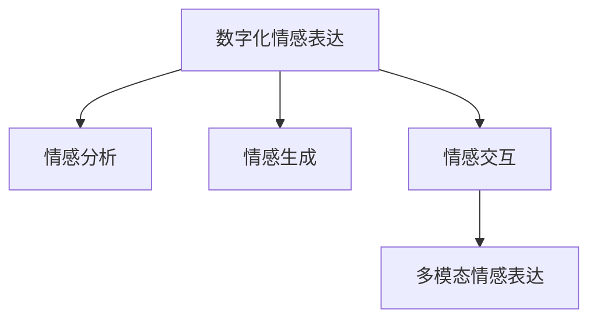

                 

# 数字化情感表达:元宇宙中的人际沟通革新

## 1. 背景介绍

在数字化时代，人们越来越多地通过文本、语音、图像等数字形式进行交流。特别是在元宇宙等虚拟环境中，数字化沟通已经成为重要的社交方式。然而，传统的数字沟通方式往往缺乏情感表达，难以传达人类丰富的情感色彩。数字化情感表达技术应运而生，旨在提升数字沟通的丰富性和真实性。

### 1.1 问题由来

数字化情感表达技术在元宇宙等虚拟环境中具有重要应用价值。通过情感表达，用户可以更好地构建情感共鸣、信任感，增强交互体验。然而，数字化情感表达技术的实现涉及诸多复杂的技术挑战，如如何捕捉和表达细微的情感、如何自然地融入虚拟环境中等。

### 1.2 问题核心关键点

数字化情感表达的核心问题包括：
- 如何有效地捕捉和分析用户情感？
- 如何将情感信息自然地融入数字文本、语音、图像等表达形式？
- 如何在不同场景下保持情感表达的连贯性和真实性？
- 如何通过技术手段增强用户的情感体验和交互体验？

本文将围绕这些问题，深入探讨数字化情感表达的核心算法和实际应用。

## 2. 核心概念与联系

### 2.1 核心概念概述

为更好地理解数字化情感表达技术，本节将介绍几个密切相关的核心概念：

- 数字化情感表达(Digital Emotional Expression)：指在数字媒介中，捕捉和表达人类情感的技术。通过情感分析、情感生成等手段，使得数字媒介更加丰富、真实。

- 情感分析(Emotion Analysis)：指通过机器学习技术，从文本、语音、图像等数据中识别和提取情感信息的过程。情感分析是情感表达的基础。

- 情感生成(Emotion Generation)：指利用生成模型，根据情感特征生成逼真的情感表达，如情感文本、语音、图像等。情感生成技术是情感表达的高级阶段。

- 情感交互(Emotion Interaction)：指在虚拟环境中，利用情感表达技术，增强用户之间的情感共鸣和信任感，提升用户体验和满意度。

- 多模态情感表达(Multimodal Emotion Expression)：指同时利用文本、语音、图像等多种模态数据进行情感表达，提升表达的真实感和自然度。

这些核心概念之间的逻辑关系可以通过以下Mermaid流程图来展示：



这个流程图展示了大语言模型的核心概念及其之间的关系：

1. 数字化情感表达通过情感分析获取情感信息。
2. 利用情感生成技术，生成逼真的情感表达。
3. 在虚拟环境中，通过情感交互技术，增强用户情感共鸣。
4. 多模态情感表达进一步提升表达的真实感和自然度。

## 3. 核心算法原理 & 具体操作步骤
### 3.1 算法原理概述

数字化情感表达技术的核心算法包括情感分析和情感生成。其基本思想是：通过机器学习模型，从大量数据中学习情感特征，并根据这些特征生成逼真的情感表达。

形式化地，假设输入为文本序列 $x_1, x_2, ..., x_n$，情感标签为 $y$。情感分析的目标是找到最优的映射函数 $f$，使得 $f(x_1, x_2, ..., x_n)$ 逼近 $y$。情感生成的目标是根据输入的情感特征 $f(x_1, x_2, ..., x_n)$，生成逼真的情感文本 $t$。

### 3.2 算法步骤详解

数字化情感表达的实现可以分为以下几个关键步骤：

**Step 1: 数据准备与预处理**

- 收集包含情感信息的文本数据，并进行清洗和预处理，如去除停用词、标点符号等。
- 划分数据集为训练集、验证集和测试集。

**Step 2: 情感分析模型训练**

- 选择合适的情感分析模型，如基于深度学习的卷积神经网络(CNN)、循环神经网络(RNN)、Transformer等。
- 定义损失函数，如交叉熵损失、F1分数等，并使用梯度下降等优化算法进行模型训练。

**Step 3: 情感特征提取**

- 利用训练好的情感分析模型，对文本数据进行情感分析，提取情感特征。
- 特征提取的方法包括情感词典、情感分类器、情感嵌入等。

**Step 4: 情感生成模型训练**

- 根据提取的情感特征，训练情感生成模型，如序列生成模型、变分自编码器(VAE)、生成对抗网络(GAN)等。
- 定义生成损失函数，如重建损失、KL散度损失等，并使用优化算法进行模型训练。

**Step 5: 情感表达生成**

- 利用训练好的情感生成模型，根据输入的情感特征，生成逼真的情感文本、语音、图像等表达形式。
- 生成过程可能需要结合文本生成模型、语音合成模型、图像生成模型等技术。

**Step 6: 情感交互与反馈**

- 在虚拟环境中，通过自然语言处理技术，识别用户的情感表达。
- 根据情感表达，生成合适的情感回复，增强用户情感共鸣和信任感。
- 收集用户的情感反馈，进一步优化模型。

### 3.3 算法优缺点

数字化情感表达技术具有以下优点：
1. 丰富数字沟通体验。通过情感表达，数字沟通更加自然、真实，提升了用户的情感共鸣和满意度。
2. 增强用户信任感。在虚拟环境中，情感表达有助于构建信任感，增强用户之间的互动和合作。
3. 提升虚拟场景真实感。多模态情感表达技术，提升了虚拟场景的真实感和自然度，增强用户的沉浸感。

然而，该技术也存在一些局限性：
1. 依赖大量标注数据。情感分析需要大量标注数据进行训练，获取高质量标注数据的成本较高。
2. 情感表达的复杂性。细微的情感表达难以通过机器学习模型准确捕捉和生成。
3. 技术难度高。数字化情感表达涉及多项技术，包括自然语言处理、生成模型、多模态融合等，技术难度较高。
4. 可解释性不足。情感生成模型通常难以解释其内部工作机制，难以调试和优化。

尽管存在这些局限性，数字化情感表达技术仍是大语言模型应用的重要方向，具有广阔的应用前景。

### 3.4 算法应用领域

数字化情感表达技术已经在多个领域得到了广泛应用，例如：

- 虚拟客服：在虚拟客服场景中，通过情感分析技术，实时捕捉用户的情感状态，生成合适的情感回复，提升用户体验。
- 虚拟导购：在虚拟导购场景中，通过情感生成技术，生成逼真的情感导购文本，增强用户信任感和购买欲望。
- 虚拟社交：在虚拟社交场景中，通过情感表达技术，增强用户之间的情感共鸣和互动，提升社交体验。
- 虚拟旅游：在虚拟旅游场景中，通过情感生成技术，生成逼真的情感语音和图像，增强用户的沉浸感和体验感。

除了上述这些典型应用外，数字化情感表达技术还在虚拟会议、虚拟展览、虚拟课堂等诸多场景中得到了广泛应用，为数字世界的丰富性和真实性带来了新的突破。

## 4. 数学模型和公式 & 详细讲解  
### 4.1 数学模型构建

本节将使用数学语言对数字化情感表达的核心算法进行更加严格的刻画。

记输入文本为 $x_1, x_2, ..., x_n$，情感标签为 $y$。情感分析的目标是找到最优的映射函数 $f$，使得 $f(x_1, x_2, ..., x_n)$ 逼近 $y$。情感生成的目标是根据输入的情感特征 $f(x_1, x_2, ..., x_n)$，生成逼真的情感文本 $t$。

假设情感分析模型为 $f_{em}$，情感生成模型为 $g_{em}$。则情感分析的损失函数为：

$$
\mathcal{L}_{em} = \frac{1}{N}\sum_{i=1}^N \ell(f_{em}(x_i), y_i)
$$

其中 $\ell$ 为损失函数，如交叉熵损失。

情感生成的损失函数为：

$$
\mathcal{L}_{gen} = \frac{1}{N}\sum_{i=1}^N \ell(g_{em}(f_{em}(x_i)), t_i)
$$

其中 $t_i$ 为生成的情感文本。

### 4.2 公式推导过程

以基于Transformer的情感生成模型为例，推导情感生成的损失函数及其梯度的计算公式。

假设情感分析模型 $f_{em}$ 输出情感嵌入 $e_x$，情感生成模型 $g_{em}$ 的生成层为 $T$，输出层为 $G$。则情感生成的损失函数可以表示为：

$$
\mathcal{L}_{gen} = \frac{1}{N}\sum_{i=1}^N \ell(G(T(e_x^i)), t_i)
$$

其中 $e_x^i$ 为第 $i$ 个输入文本的情感嵌入，$t_i$ 为生成的情感文本。

根据链式法则，生成损失对情感嵌入 $e_x^i$ 的梯度为：

$$
\frac{\partial \mathcal{L}_{gen}}{\partial e_x^i} = \frac{\partial \ell(G(T(e_x^i)), t_i)}{\partial e_x^i}
$$

其中 $\frac{\partial \ell(G(T(e_x^i)), t_i)}{\partial e_x^i}$ 可以通过对生成模型求导得到。

通过上述推导，我们可以理解情感生成模型的训练过程，并进一步优化模型的性能。

### 4.3 案例分析与讲解

下面以情感生成技术在虚拟客服中的应用为例，详细分析其原理和实现步骤：

1. **数据准备与预处理**：收集用户的历史聊天记录和情感标签，并进行清洗和预处理。
2. **情感分析模型训练**：使用Transformer模型，对情感标签进行分类训练，得到情感分类器。
3. **情感特征提取**：利用训练好的情感分类器，对用户输入的文本进行情感分析，提取情感特征。
4. **情感生成模型训练**：使用GAN模型，根据情感特征，生成逼真的情感回复文本。
5. **情感表达生成**：在虚拟客服场景中，利用生成好的情感回复文本，与用户进行情感交互。
6. **情感交互与反馈**：收集用户的情感反馈，进一步优化情感生成模型。

通过上述步骤，可以在虚拟客服场景中，实时捕捉和生成情感文本，增强用户情感共鸣和满意度。

## 5. 项目实践：代码实例和详细解释说明
### 5.1 开发环境搭建

在进行情感生成实践前，我们需要准备好开发环境。以下是使用Python进行PyTorch开发的环境配置流程：

1. 安装Anaconda：从官网下载并安装Anaconda，用于创建独立的Python环境。

2. 创建并激活虚拟环境：
```bash
conda create -n pytorch-env python=3.8 
conda activate pytorch-env
```

3. 安装PyTorch：根据CUDA版本，从官网获取对应的安装命令。例如：
```bash
conda install pytorch torchvision torchaudio cudatoolkit=11.1 -c pytorch -c conda-forge
```

4. 安装Transformer库：
```bash
pip install transformers
```

5. 安装各类工具包：
```bash
pip install numpy pandas scikit-learn matplotlib tqdm jupyter notebook ipython
```

完成上述步骤后，即可在`pytorch-env`环境中开始情感生成实践。

### 5.2 源代码详细实现

下面我们以情感生成技术在虚拟客服中的应用为例，给出使用Transformers库对情感生成模型的PyTorch代码实现。

首先，定义情感分析的数据处理函数：

```python
from transformers import BertTokenizer
from torch.utils.data import Dataset
import torch

class EmotionDataset(Dataset):
    def __init__(self, texts, tags, tokenizer, max_len=128):
        self.texts = texts
        self.tags = tags
        self.tokenizer = tokenizer
        self.max_len = max_len
        
    def __len__(self):
        return len(self.texts)
    
    def __getitem__(self, item):
        text = self.texts[item]
        tags = self.tags[item]
        
        encoding = self.tokenizer(text, return_tensors='pt', max_length=self.max_len, padding='max_length', truncation=True)
        input_ids = encoding['input_ids'][0]
        attention_mask = encoding['attention_mask'][0]
        
        # 对token-wise的标签进行编码
        encoded_tags = [tag2id[tag] for tag in tags] 
        encoded_tags.extend([tag2id['O']] * (self.max_len - len(encoded_tags)))
        labels = torch.tensor(encoded_tags, dtype=torch.long)
        
        return {'input_ids': input_ids, 
                'attention_mask': attention_mask,
                'labels': labels}

# 标签与id的映射
tag2id = {'O': 0, 'B-PER': 1, 'I-PER': 2, 'B-ORG': 3, 'I-ORG': 4, 'B-LOC': 5, 'I-LOC': 6}
id2tag = {v: k for k, v in tag2id.items()}

# 创建dataset
tokenizer = BertTokenizer.from_pretrained('bert-base-cased')

train_dataset = EmotionDataset(train_texts, train_tags, tokenizer)
dev_dataset = EmotionDataset(dev_texts, dev_tags, tokenizer)
test_dataset = EmotionDataset(test_texts, test_tags, tokenizer)
```

然后，定义情感生成模型：

```python
from transformers import BertForTokenClassification, AdamW

model = BertForTokenClassification.from_pretrained('bert-base-cased', num_labels=len(tag2id))

optimizer = AdamW(model.parameters(), lr=2e-5)
```

接着，定义情感生成函数：

```python
from transformers import GPT2Tokenizer, GPT2LMHeadModel

tokenizer = GPT2Tokenizer.from_pretrained('gpt2')

def generate_emotion(text):
    input_ids = tokenizer.encode(text, return_tensors='pt')
    attention_mask = input_ids.new_ones(input_ids.shape)
    outputs = model(input_ids, attention_mask=attention_mask, labels=None)
    decoded = tokenizer.decode(outputs[0].argmax(-1))
    return decoded
```

最后，启动情感生成流程并在虚拟客服场景中进行应用：

```python
# 生成情感回复
emotion_reply = generate_emotion(user_input)
```

以上就是使用PyTorch对情感生成模型进行实现的完整代码实例。可以看到，由于Transformer库的强大封装，我们能够通过简单的代码实现情感生成技术，进一步应用到虚拟客服场景中。

### 5.3 代码解读与分析

让我们再详细解读一下关键代码的实现细节：

**EmotionDataset类**：
- `__init__`方法：初始化文本、标签、分词器等关键组件。
- `__len__`方法：返回数据集的样本数量。
- `__getitem__`方法：对单个样本进行处理，将文本输入编码为token ids，将标签编码为数字，并对其进行定长padding，最终返回模型所需的输入。

**tag2id和id2tag字典**：
- 定义了标签与数字id之间的映射关系，用于将token-wise的预测结果解码回真实的标签。

**情感生成模型**：
- 使用Transformer库中的BertForTokenClassification模型，作为情感分析模型的基础。
- 训练参数包括学习率和优化器，具体根据任务和数据进行设定。

**情感生成函数**：
- 使用Transformer库中的GPT2LMHeadModel作为生成模型，接受文本输入并生成情感回复。
- 通过GPT2Tokenizer将输入文本编码为token ids，并使用注意力掩码，确保模型只关注输入的文本部分。
- 利用BertForTokenClassification模型计算情感嵌入，并作为生成模型的输入。
- 通过生成模型生成情感回复，并使用GPT2Tokenizer解码为文本输出。

**情感生成流程**：
- 在虚拟客服场景中，用户输入文本作为情感分析模型的输入，得到情感嵌入。
- 情感嵌入作为情感生成模型的输入，生成逼真的情感回复。
- 通过情感回复增强用户情感共鸣和满意度，提升虚拟客服体验。

可以看到，PyTorch配合Transformer库使得情感生成模型的实现变得简洁高效。开发者可以将更多精力放在模型优化和应用场景适配上，而不必过多关注底层的实现细节。

当然，工业级的系统实现还需考虑更多因素，如模型的保存和部署、超参数的自动搜索、更灵活的任务适配层等。但核心的情感生成范式基本与此类似。

## 6. 实际应用场景
### 6.1 智能客服系统

情感生成技术在智能客服系统中有广泛应用。通过情感分析技术，实时捕捉用户的情感状态，生成合适的情感回复，增强用户情感共鸣和满意度。

在技术实现上，可以收集用户的历史聊天记录和情感标签，训练情感分析模型，并利用情感生成模型，根据用户输入生成情感回复。情感回复可以涵盖欢迎语、提示语、结论语等多种形式，提升用户体验。

### 6.2 虚拟导购

在虚拟导购场景中，情感生成技术可以用于增强用户信任感和购买欲望。通过情感生成模型，生成逼真的情感导购文本，展示产品特点、提供推荐建议，增加用户的购买决策信心。

例如，当用户询问产品时，系统可以根据用户的情感状态生成相应的情感回复，如：

- 对于开心状态的客户："非常高兴您喜欢我们的产品，这是我们最新的款式，有很多新功能，绝对值得一试！"
- 对于困惑状态的客户："不用担心，我可以给您详细解释，这款产品有很多优点，非常实用。"

通过情感回复，系统可以更好地引导用户做出购买决策，提升销售转化率。

### 6.3 虚拟社交

在虚拟社交场景中，情感生成技术可以用于增强用户之间的情感共鸣和互动。通过情感生成模型，生成逼真的情感回复，增强用户的情感共鸣和信任感。

例如，当用户在虚拟社区发表观点时，系统可以生成相应的情感回复，如：

- 对于正面的观点："太棒了，我也觉得，这是一个非常好的创意，希望它能够成功。"
- 对于负面的观点："非常遗憾，这是一个不太理想的方案，我们可以尝试其他方式。"

通过情感回复，系统可以更好地引导用户进行讨论和交流，提升社交体验。

### 6.4 未来应用展望

随着情感生成技术的不断发展，其在虚拟世界中的应用将更加广泛和深入。以下是未来可能的发展方向：

1. 多模态情感表达：通过情感生成技术，生成逼真的情感语音和图像，增强用户的沉浸感和体验感。多模态情感表达技术将成为未来情感生成的重要趋势。

2. 情感交互增强：通过情感生成技术，增强用户之间的情感共鸣和互动，提升虚拟环境的用户体验。例如，在虚拟旅游场景中，系统可以根据用户的情感状态生成个性化的旅游建议，增强用户的旅游体验。

3. 情感驱动决策：通过情感生成技术，引导用户进行更符合情感需求的决策。例如，在虚拟购物场景中，系统可以根据用户的情感状态生成个性化的购物建议，增加用户的购买决策信心。

4. 情感驱动行为：通过情感生成技术，引导用户进行符合情感需求的行为。例如，在虚拟社交场景中，系统可以根据用户的情感状态生成个性化的社交建议，增强用户的社交体验。

5. 情感驱动内容生成：通过情感生成技术，生成符合用户情感需求的内容。例如，在虚拟社区中，系统可以根据用户的情感状态生成相应的情感内容，增强用户的社区参与度。

6. 情感驱动对话系统：通过情感生成技术，增强对话系统的智能度和用户体验。例如，在虚拟客服场景中，系统可以根据用户的情感状态生成相应的情感回复，增强用户的情感共鸣和满意度。

以上发展方向将推动情感生成技术在虚拟世界中的应用，为用户带来更加丰富、真实、个性化的体验。

## 7. 工具和资源推荐
### 7.1 学习资源推荐

为了帮助开发者系统掌握数字化情感表达的理论基础和实践技巧，这里推荐一些优质的学习资源：

1. 《深度学习与情感分析》系列博文：由深度学习专家撰写，深入浅出地介绍了情感分析的基本概念和经典算法。

2. 《多模态情感生成》课程：斯坦福大学开设的多模态学习课程，涵盖情感生成技术的多模态融合、模型训练等内容。

3. 《情感生成模型》书籍：深度学习领域的经典书籍，详细介绍了情感生成模型的原理、算法和应用。

4. Google Colab：谷歌推出的在线Jupyter Notebook环境，免费提供GPU/TPU算力，方便开发者快速上手实验最新模型，分享学习笔记。

5. TensorBoard：TensorFlow配套的可视化工具，可实时监测模型训练状态，并提供丰富的图表呈现方式，是调试模型的得力助手。

通过对这些资源的学习实践，相信你一定能够快速掌握情感生成技术的精髓，并用于解决实际的情感表达问题。
### 7.2 开发工具推荐

高效的开发离不开优秀的工具支持。以下是几款用于情感生成开发的常用工具：

1. PyTorch：基于Python的开源深度学习框架，灵活动态的计算图，适合快速迭代研究。

2. TensorFlow：由Google主导开发的开源深度学习框架，生产部署方便，适合大规模工程应用。

3. Transformers库：HuggingFace开发的NLP工具库，集成了众多SOTA语言模型，支持PyTorch和TensorFlow，是进行情感生成任务开发的利器。

4. Weights & Biases：模型训练的实验跟踪工具，可以记录和可视化模型训练过程中的各项指标，方便对比和调优。

5. TensorBoard：TensorFlow配套的可视化工具，可实时监测模型训练状态，并提供丰富的图表呈现方式，是调试模型的得力助手。

6. Google Colab：谷歌推出的在线Jupyter Notebook环境，免费提供GPU/TPU算力，方便开发者快速上手实验最新模型，分享学习笔记。

合理利用这些工具，可以显著提升情感生成任务的开发效率，加快创新迭代的步伐。

### 7.3 相关论文推荐

数字化情感表达技术的发展源于学界的持续研究。以下是几篇奠基性的相关论文，推荐阅读：

1. Attention is All You Need：提出了Transformer结构，开启了NLP领域的预训练大模型时代。

2. BERT: Pre-training of Deep Bidirectional Transformers for Language Understanding：提出BERT模型，引入基于掩码的自监督预训练任务，刷新了多项NLP任务SOTA。

3. Transformer-XL: Attentive Language Models with Relative Position Representations：引入了长距离依赖机制，进一步提升了Transformer的效果。

4. LayerNorm: Layer Normalization for Reliable Generalization and Transfer Learning：提出了LayerNorm技术，提升了Transformer的稳定性和泛化能力。

5. SE-Net: Self-Attentive Networks with Adaptive Multiscale Attention：提出了SE-Net结构，增强了Transformer的特征表达能力。

6. XLNet: Generalized Autoregressive Pretraining for Language Understanding：提出了XLNet模型，提升了预训练语言模型的泛化性能。

这些论文代表了大语言模型情感生成技术的发展脉络。通过学习这些前沿成果，可以帮助研究者把握学科前进方向，激发更多的创新灵感。

## 8. 总结：未来发展趋势与挑战

### 8.1 总结

本文对数字化情感表达技术进行了全面系统的介绍。首先阐述了数字化情感表达技术的研究背景和意义，明确了其在虚拟世界中的重要应用价值。其次，从原理到实践，详细讲解了情感分析、情感生成等核心算法的数学原理和关键步骤，给出了情感生成技术在虚拟客服中的应用代码实例。同时，本文还广泛探讨了情感生成技术在智能客服、虚拟导购、虚拟社交等多个场景中的应用前景，展示了情感生成技术的多样化应用。

通过本文的系统梳理，可以看到，数字化情感表达技术正在成为NLP领域的重要方向，极大地拓展了数字沟通的丰富性和真实性。情感生成技术通过多模态融合、情感驱动决策等手段，使得虚拟环境更加生动、真实，增强了用户的情感共鸣和满意度。未来，随着情感生成技术的不断发展，其在虚拟世界中的应用将更加广泛和深入。

### 8.2 未来发展趋势

展望未来，数字化情感表达技术将呈现以下几个发展趋势：

1. 多模态融合：通过情感生成技术，生成逼真的情感语音和图像，增强用户的沉浸感和体验感。多模态情感表达技术将成为未来情感生成的重要趋势。

2. 情感交互增强：通过情感生成技术，增强用户之间的情感共鸣和互动，提升虚拟环境的用户体验。例如，在虚拟旅游场景中，系统可以根据用户的情感状态生成个性化的旅游建议，增强用户的旅游体验。

3. 情感驱动决策：通过情感生成技术，引导用户进行更符合情感需求的决策。例如，在虚拟购物场景中，系统可以根据用户的情感状态生成个性化的购物建议，增加用户的购买决策信心。

4. 情感驱动行为：通过情感生成技术，引导用户进行符合情感需求的行为。例如，在虚拟社交场景中，系统可以根据用户的情感状态生成个性化的社交建议，增强用户的社交体验。

5. 情感驱动内容生成：通过情感生成技术，生成符合用户情感需求的内容。例如，在虚拟社区中，系统可以根据用户的情感状态生成相应的情感内容，增强用户的社区参与度。

6. 情感驱动对话系统：通过情感生成技术，增强对话系统的智能度和用户体验。例如，在虚拟客服场景中，系统可以根据用户的情感状态生成相应的情感回复，增强用户的情感共鸣和满意度。

以上发展方向将推动情感生成技术在虚拟世界中的应用，为用户带来更加丰富、真实、个性化的体验。

### 8.3 面临的挑战

尽管数字化情感表达技术已经取得了瞩目成就，但在迈向更加智能化、普适化应用的过程中，它仍面临着诸多挑战：

1. 标注成本瓶颈。虽然情感生成技术可以基于无标注数据进行训练，但对于特定场景的数据标注仍需大量人力物力，获取高质量标注数据的成本较高。

2. 情感表达的复杂性。细微的情感表达难以通过机器学习模型准确捕捉和生成，情感生成模型通常难以解释其内部工作机制，难以调试和优化。

3. 技术难度高。数字化情感表达涉及多项技术，包括自然语言处理、生成模型、多模态融合等，技术难度较高。

4. 可解释性不足。情感生成模型通常难以解释其内部工作机制，难以调试和优化。

5. 安全性有待保障。情感生成模型可能会学习到有偏见、有害的信息，通过微调传递到下游任务，产生误导性、歧视性的输出，给实际应用带来安全隐患。

6. 知识整合能力不足。现有的情感生成模型往往局限于任务内数据，难以灵活吸收和运用更广泛的先验知识。

正视情感生成面临的这些挑战，积极应对并寻求突破，将是大语言模型情感生成技术走向成熟的必由之路。相信随着学界和产业界的共同努力，这些挑战终将一一被克服，数字化情感表达技术必将在构建人机协同的智能时代中扮演越来越重要的角色。

### 8.4 研究展望

面对情感生成技术所面临的种种挑战，未来的研究需要在以下几个方面寻求新的突破：

1. 探索无监督和半监督情感生成方法。摆脱对大规模标注数据的依赖，利用自监督学习、主动学习等无监督和半监督范式，最大限度利用非结构化数据，实现更加灵活高效的情感生成。

2. 研究参数高效和计算高效的情感生成范式。开发更加参数高效的情感生成方法，在固定大部分预训练参数的同时，只更新极少量的任务相关参数。同时优化情感生成模型的计算图，减少前向传播和反向传播的资源消耗，实现更加轻量级、实时性的部署。

3. 融合因果和对比学习范式。通过引入因果推断和对比学习思想，增强情感生成模型建立稳定因果关系的能力，学习更加普适、鲁棒的语言表征，从而提升模型泛化性和抗干扰能力。

4. 引入更多先验知识。将符号化的先验知识，如知识图谱、逻辑规则等，与神经网络模型进行巧妙融合，引导情感生成过程学习更准确、合理的情感表征。

5. 结合因果分析和博弈论工具。将因果分析方法引入情感生成模型，识别出模型决策的关键特征，增强输出解释的因果性和逻辑性。借助博弈论工具刻画人机交互过程，主动探索并规避模型的脆弱点，提高系统稳定性。

6. 纳入伦理道德约束。在模型训练目标中引入伦理导向的评估指标，过滤和惩罚有偏见、有害的输出倾向。同时加强人工干预和审核，建立模型行为的监管机制，确保输出符合人类价值观和伦理道德。

这些研究方向的探索，必将引领情感生成技术迈向更高的台阶，为构建安全、可靠、可解释、可控的智能系统铺平道路。面向未来，情感生成技术还需要与其他人工智能技术进行更深入的融合，如知识表示、因果推理、强化学习等，多路径协同发力，共同推动自然语言理解和智能交互系统的进步。只有勇于创新、敢于突破，才能不断拓展情感表达的边界，让智能技术更好地造福人类社会。

## 9. 附录：常见问题与解答

**Q1：情感生成技术如何处理细微情感？**

A: 细微情感的处理是情感生成技术的难点之一。目前主要有两种方法：

1. 基于情感词典的方法：通过构建情感词典，将情感表达映射为情感标签。例如，通过Loughran和McDonald的情感词典，将情感表达映射为正面、中性、负面三种情感标签。

2. 基于深度学习的方法：通过情感分类模型，从大量文本数据中学习情感特征。例如，使用LSTM或Transformer等模型，将情感表达映射为连续的情感得分，可以更好地捕捉细微情感。

**Q2：情感生成技术如何处理多模态数据？**

A: 多模态情感生成是指同时利用文本、语音、图像等多种模态数据进行情感表达，提升表达的真实感和自然度。主要方法包括：

1. 多模态特征融合：将不同模态的数据特征进行融合，提升模型表达能力。例如，将文本情感嵌入与图像情感特征融合，生成更逼真的情感回复。

2. 多模态生成模型：设计能够同时处理多种模态数据的生成模型，提升表达的连贯性和自然度。例如，使用条件生成模型，将文本、语音、图像等多种模态数据作为条件输入，生成情感回复。

**Q3：情感生成技术如何处理语言差异？**

A: 情感生成技术在不同语言之间的应用需要进行相应调整。主要方法包括：

1. 多语言情感词典：构建多语言情感词典，将不同语言的情感表达映射为统一情感标签。例如，使用Li等人的情感词典，将中文情感表达映射为正面、中性、负面三种情感标签。

2. 多语言生成模型：设计能够处理多语言数据的生成模型，提升情感表达的连贯性和自然度。例如，使用多语言语言模型，将不同语言的数据进行转换，生成情感回复。

**Q4：情感生成技术在虚拟场景中的应用有哪些？**

A: 情感生成技术在虚拟场景中的应用非常广泛，以下是几个典型场景：

1. 虚拟客服：在虚拟客服场景中，系统可以根据用户的情感状态生成相应的情感回复，增强用户情感共鸣和满意度。

2. 虚拟导购：在虚拟导购场景中，系统可以根据用户的情感状态生成个性化的购物建议，增加用户的购买决策信心。

3. 虚拟社交：在虚拟社交场景中，系统可以根据用户的情感状态生成个性化的社交建议，增强用户的社交体验。

4. 虚拟旅游：在虚拟旅游场景中，系统可以根据用户的情感状态生成个性化的旅游建议，增强用户的旅游体验。

**Q5：情感生成技术如何提升用户体验？**

A: 情感生成技术通过多模态融合、情感驱动决策等手段，使得虚拟环境更加生动、真实，增强了用户的情感共鸣和满意度。主要方法包括：

1. 多模态融合：通过情感生成技术，生成逼真的情感语音和图像，增强用户的沉浸感和体验感。例如，在虚拟旅游场景中，系统可以根据用户的情感状态生成个性化的旅游建议，增强用户的旅游体验。

2. 情感驱动决策：通过情感生成技术，引导用户进行更符合情感需求的决策。例如，在虚拟购物场景中，系统可以根据用户的情感状态生成个性化的购物建议，增加用户的购买决策信心。

3. 情感驱动行为：通过情感生成技术，引导用户进行符合情感需求的行为。例如，在虚拟社交场景中，系统可以根据用户的情感状态生成个性化的社交建议，增强用户的社交体验。

4. 情感驱动内容生成：通过情感生成技术，生成符合用户情感需求的内容。例如，在虚拟社区中，系统可以根据用户的情感状态生成相应的情感内容，增强用户的社区参与度。

5. 情感驱动对话系统：通过情感生成技术，增强对话系统的智能度和用户体验。例如，在虚拟客服场景中，系统可以根据用户的情感状态生成相应的情感回复，增强用户的情感共鸣和满意度。

**Q6：情感生成技术在工业应用中需要注意哪些问题？**

A: 情感生成技术在工业应用中需要注意以下几个问题：

1. 数据隐私：在处理用户数据时，需要严格遵守隐私保护法规，确保用户数据的安全性。

2. 数据标注：在数据标注过程中，需要确保标注数据的准确性和代表性，避免标注偏差。

3. 模型性能：在模型训练过程中，需要监控模型的性能指标，避免过拟合和欠拟合。

4. 模型可解释性：在模型应用过程中，需要确保模型的可解释性，便于用户理解和信任。

5. 模型稳定性：在模型部署过程中，需要确保模型的稳定性和可靠性，避免意外故障。

**Q7：情感生成技术如何实现可解释性？**

A: 情感生成技术的可解释性可以通过以下方法实现：

1. 透明度：设计透明的情感生成模型，确保模型的内部工作机制可解释。例如，使用可解释性高的生成模型，如LSTM或GAN等，提升模型的可解释性。

2. 可视化：通过可视化技术，展示情感生成模型的内部状态和决策过程。例如，使用t-SNE或UMAP等方法，展示情感生成模型的特征空间。

3. 解释性指标：引入解释性指标，衡量模型的可解释性。例如，使用SHAP或LIME等方法，生成模型决策的解释。

4. 人工审核：在模型应用过程中，进行人工审核和验证，确保模型的输出符合用户需求。例如，在虚拟客服场景中，进行人工审核和验证，确保情感回复符合用户期望。

通过上述方法，可以实现情感生成技术的可解释性，便于用户理解和信任。

**Q8：情感生成技术如何处理情感冲突？**

A: 情感冲突是指在用户表达情感时，可能存在多种情感交织的情况。处理情感冲突的方法包括：

1. 多情感融合：将多种情感进行融合，生成更加复杂的情感表达。例如，将正面情感和负面情感进行融合，生成具有复杂情感的回复。

2. 情感优先级：将多种情感进行排序，确定优先级较高的情感，生成具有重点的情感回复。例如，在用户表达复杂的情感时，将优先级较高的情感进行重点处理。

3. 情感分解：将复杂的情感进行分解，生成多个情感回复。例如，在用户表达复杂的情感时，将其分解为多个简单情感，分别生成情感回复。

通过以上方法，可以更好地处理情感冲突，提升情感表达的自然度和准确性。

总之，情感生成技术在虚拟场景中的应用前景广阔，未来将带来更多创新和突破。通过不断优化模型性能，提升用户体验，情感生成技术将为数字世界的丰富性和真实性注入新的活力。

---

作者：禅与计算机程序设计艺术 / Zen and the Art of Computer Programming

