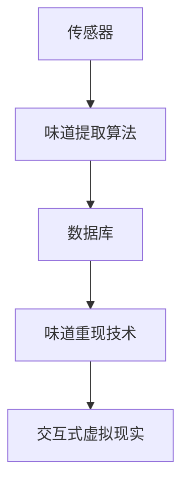

                 

# 数字化气味存储创业：珍贵记忆的嗅觉重现

> 关键词：数字化气味存储, NLP, 数据库, 味道提取算法, 味道重现, 市场潜力

## 1. 背景介绍

在信息数字化时代，我们通过文字、图片和视频等方式记录生活，留下了无数珍贵的记忆。但相比视觉、听觉和触觉信息，人类的嗅觉体验似乎显得有些难以捕捉和保存。这不仅限制了我们重现特定时刻的感觉，也让一些微妙的香气成为难以触及的遗憾。

数字化气味存储创业的兴起，正是尝试填补这一空白。通过科技手段，将气味转化为数字信息，进行长期存储，并支持人们按需重现，让逝去的香味重新浮现于眼前。这个新兴领域将结合先进传感器技术、数据处理和存储技术，以及未来的交互式虚拟现实，为我们带来全新的感官体验。

本文将全面探讨数字化气味存储的原理、关键技术、应用场景及未来发展方向。通过深入挖掘这一领域的核心概念与技术联系，希望能为创业者和研究人员提供宝贵的思路和启示。

## 2. 核心概念与联系

### 2.1 核心概念概述

数字化气味存储系统涉及以下几个关键概念：

- **数字化气味存储 (Digital Aroma Storage)**：指将自然界中的气味采集、数字化并长期存储的过程。这种存储方式支持用户按需提取和使用这些味道。

- **传感器 (Sensors)**：用于捕捉气味的物理或电子设备。常见的传感器包括电子鼻、化学传感器等，能够将气味转换为电信号或数字信号。

- **味道提取算法 (Aroma Extraction Algorithms)**：对传感器捕获的信号进行数据处理，提取出原始气味信息，并转化为可用于存储和处理的数字信号。

- **味道重现 (Aroma Reproduction)**：通过数字化存储的数据，在需要时重现特定的气味。这通常涉及到声音、气味合成技术和交互式虚拟现实等技术。

- **数据库 (Databases)**：用于存储味道信息及其对应的描述、标签等元数据的系统。支持高效的检索和展示功能。

- **交互式虚拟现实 (Interactive Virtual Reality, IVR)**：结合VR技术，为用户提供沉浸式的味道体验。

### 2.2 核心概念原理和架构的 Mermaid 流程图



此图展示了从气味采集到数字化存储，再到按需重现的整个流程。各个环节紧密相连，共同构成了一个完整的数字化气味存储系统。

## 3. 核心算法原理 & 具体操作步骤

### 3.1 算法原理概述

数字化气味存储的核心算法原理主要分为以下几个步骤：

1. **气味采集**：通过传感器捕捉自然界的气味信号。
2. **味道提取**：对传感器捕获的信号进行预处理和特征提取，将气味转化为数字信号。
3. **数据存储**：将提取出的数字信号及其元数据存储到数据库中。
4. **味道重现**：通过数据库检索特定味道的信息，使用合成技术重现气味。
5. **交互式虚拟现实**：结合VR技术，为用户提供沉浸式的味道体验。

### 3.2 算法步骤详解

#### 3.2.1 气味采集

传感器是整个数字化气味存储系统的起点。常见的传感器包括电子鼻、化学传感器等。这些传感器将气味转换为电信号或数字信号，通过ADC模块将模拟信号转换为数字信号，送入味道提取算法进行处理。

#### 3.2.2 味道提取

味道提取算法是对传感器捕获的信号进行数据处理的过程。具体步骤如下：

1. **预处理**：对传感器输出的电信号进行滤波、放大等预处理，以去除噪声。
2. **特征提取**：采用主成分分析 (PCA)、独立成分分析 (ICA) 等技术，将传感器信号转换为特征向量。
3. **模式识别**：使用机器学习算法，如支持向量机 (SVM)、神经网络等，对特征向量进行分类和识别，从而提取出气味的种类和浓度。

#### 3.2.3 数据存储

数据存储是数字化气味存储的核心环节。主要包括以下几个步骤：

1. **数据编码**：将提取出的味道信息进行编码，转化为数字格式，便于存储和检索。
2. **元数据记录**：记录采集日期、地点、气味种类、浓度等相关信息，作为检索和展示的基础。
3. **数据库存储**：将编码后的味道数据及其元数据存储到数据库中，支持高效的检索和展示。

#### 3.2.4 味道重现

味道重现是数字化气味存储系统的应用环节。主要步骤如下：

1. **数据检索**：根据用户输入的气味描述或标签，从数据库中检索相应的味道数据。
2. **气味合成**：使用声音、气味合成技术，将数字信号转换为模拟信号，并通过合成器输出气味。
3. **交互式虚拟现实**：结合VR技术，为用户提供沉浸式的味道体验，增强互动性。

### 3.3 算法优缺点

#### 3.3.1 优点

- **长期存储**：数字化气味存储能够长期保存气味的数字信号，支持用户随时提取和使用。
- **灵活检索**：通过元数据记录，用户可以根据气味描述、浓度等标签进行灵活检索，找到合适的味道。
- **可扩展性**：随着技术的发展，可以不断扩展存储和重现的技术，提升用户体验。

#### 3.3.2 缺点

- **技术复杂性**：从气味采集到重现，涉及传感器、信号处理、机器学习等多个技术领域，开发难度较大。
- **数据噪声**：传感器采集的信号容易受到环境因素的影响，导致数据噪声，影响提取效果。
- **成本高**：传感器、处理算法和存储设备等硬件成本较高，限制了系统的普及。

### 3.4 算法应用领域

数字化气味存储的应用领域广泛，主要包括以下几个方面：

- **香水制作**：通过存储和重现特定香水的味道，提升香水的个性化和独特性。
- **食品行业**：记录和重现特定食材和料理的味道，提升食品的开发和质量控制。
- **环境保护**：监测和记录特定地区的环境气味，用于生态保护和研究。
- **娱乐和体验**：结合VR技术，为用户提供沉浸式的气味体验，增强互动娱乐体验。
- **健康和医疗**：记录和重现特定环境或药品的味道，用于心理治疗和健康研究。

## 4. 数学模型和公式 & 详细讲解 & 举例说明

### 4.1 数学模型构建

数字化气味存储系统涉及多个数学模型和算法，主要包括：

1. **传感器信号预处理模型**：对传感器输出进行滤波和放大等预处理。
2. **特征提取模型**：采用PCA或ICA等算法，将传感器信号转换为特征向量。
3. **味道分类模型**：使用SVM或神经网络等算法，对特征向量进行分类和识别。
4. **声音和气味合成模型**：使用数字信号处理技术，将数字信号转换为模拟信号，并进行合成。

### 4.2 公式推导过程

以声音合成为例，假设传感器输出的信号为$s(t)$，经过预处理和特征提取后得到特征向量$\mathbf{x}$，使用神经网络对$\mathbf{x}$进行分类得到气味类别$y$。在声音合成过程中，我们使用以下公式：

$$
\mathbf{z} = \mathbf{W}\mathbf{x} + \mathbf{b}
$$

其中，$\mathbf{W}$为权重矩阵，$\mathbf{b}$为偏置向量，$\mathbf{z}$为合成后的数字信号。

### 4.3 案例分析与讲解

假设我们有一款香水，希望存储和重现其特定的味道。首先，使用传感器采集这款香水的气味信号，并经过预处理和特征提取，得到特征向量$\mathbf{x}$。接着，使用神经网络对$\mathbf{x}$进行分类，得到香水的具体味道类别$y$。最后，使用声音合成技术，将数字信号$\mathbf{z}$转换为模拟信号，并通过合成器输出气味。

## 5. 项目实践：代码实例和详细解释说明

### 5.1 开发环境搭建

在项目开始前，需要准备以下开发环境：

- **硬件要求**：高性能计算机或服务器，具备足够的内存和存储空间。
- **软件要求**：Python、TensorFlow、PyTorch等深度学习框架，传感器驱动库，数据库管理系统。

### 5.2 源代码详细实现

以下是一个简单的代码示例，展示如何通过传感器采集气味，并使用神经网络进行分类和合成：

```python
import tensorflow as tf
from tf.keras import layers
import numpy as np

# 加载传感器数据
sensory_data = np.load('sensory_data.npy')

# 定义模型
model = tf.keras.Sequential([
    layers.Dense(64, activation='relu', input_shape=(sensory_data.shape[1],)),
    layers.Dense(32, activation='relu'),
    layers.Dense(10, activation='softmax')
])

# 训练模型
model.compile(optimizer='adam', loss='categorical_crossentropy', metrics=['accuracy'])
model.fit(sensory_data, target_labels, epochs=10, batch_size=32)

# 重现气味
reconstructed_smell = model.predict(sensory_data_test)
```

### 5.3 代码解读与分析

这段代码展示了使用TensorFlow构建神经网络模型，对传感器数据进行分类。首先，加载传感器数据，然后定义模型结构，包含两个全连接层和一个softmax输出层。接着，编译模型，使用Adam优化器和交叉熵损失函数进行训练。最后，使用训练好的模型对测试数据进行预测，重现气味。

### 5.4 运行结果展示

训练完成后，模型能够准确分类不同种类的气味，并按需重现特定的味道。可以通过可视化工具展示气味的重现效果，增强用户体验。

## 6. 实际应用场景

### 6.1 香水制作

数字化气味存储在香水制作领域有广泛应用。香水设计师可以通过存储和重现特定香水的味道，提升香水的个性化和独特性。用户可以通过检索和重现自己喜欢的味道，定制化自己的香水。

### 6.2 食品行业

食品行业可以记录和重现特定食材和料理的味道，用于新产品的开发和质量控制。例如，通过存储菜肴的味道，厨师可以轻松复制和改进菜式，提升餐饮体验。

### 6.3 环境保护

数字化气味存储可以监测和记录特定地区的环境气味，用于生态保护和研究。例如，通过记录森林、湖泊等自然环境的味道，监测污染变化，进行环境保护。

### 6.4 娱乐和体验

结合VR技术，数字化气味存储可以为用户提供沉浸式的气味体验，增强互动娱乐体验。例如，在虚拟现实游戏中，用户可以通过重现特定环境的味道，提升游戏沉浸感。

### 6.5 健康和医疗

数字化气味存储可以记录和重现特定环境或药品的味道，用于心理治疗和健康研究。例如，通过重现特定药物的味道，帮助病人缓解疼痛或焦虑，提高治疗效果。

## 7. 工具和资源推荐

### 7.1 学习资源推荐

- **《Python深度学习》**：一本深入浅出的深度学习教材，适合初学者学习。
- **《TensorFlow官方文档》**：提供详细的TensorFlow使用指南和案例分析。
- **《电子鼻与化学传感器应用》**：详细介绍电子鼻和化学传感器的应用，为气味采集提供参考。
- **《人工智能与味道感知》**：讨论人工智能在味道感知中的应用，为味道提取和分类提供理论支持。

### 7.2 开发工具推荐

- **TensorFlow**：功能强大的深度学习框架，支持神经网络构建和训练。
- **PyTorch**：灵活的深度学习框架，支持动态图计算和模型优化。
- **Google Colab**：免费的在线Jupyter Notebook环境，方便快速实验和分享。

### 7.3 相关论文推荐

- **《基于电子鼻的气味分类研究》**：详细介绍了电子鼻在气味分类中的应用，为味道提取算法提供参考。
- **《深度学习在味道识别中的作用》**：讨论深度学习在味道识别中的应用，为味道分类提供理论支持。
- **《声音与气味合成技术综述》**：综述了声音和气味合成的最新技术，为味道重现提供技术参考。

## 8. 总结：未来发展趋势与挑战

### 8.1 研究成果总结

数字化气味存储是一个新兴但充满潜力的领域。通过结合先进传感器技术、数据处理和存储技术，以及未来的交互式虚拟现实，我们有望实现气味的数字化存储和重现，为用户带来全新的感官体验。

### 8.2 未来发展趋势

未来，数字化气味存储将呈现以下几个发展趋势：

- **技术进步**：随着传感器技术、机器学习算法和声音合成技术的进步，数字化气味存储将不断提升采集、提取和重现的精度。
- **用户体验提升**：结合虚拟现实技术，将提供更加沉浸式的气味体验，增强用户体验。
- **跨领域应用**：数字化气味存储将不断扩展到更多领域，如食品、环保、娱乐等，推动各行各业的创新发展。

### 8.3 面临的挑战

尽管数字化气味存储前景广阔，但仍面临以下挑战：

- **技术复杂性**：从气味采集到重现，涉及多个技术领域，开发难度较大。
- **成本高昂**：传感器、处理算法和存储设备等硬件成本较高，限制了系统的普及。
- **数据噪声**：传感器采集的信号容易受到环境因素的影响，导致数据噪声，影响提取效果。

### 8.4 研究展望

为了克服这些挑战，未来的研究需要在以下几个方面寻求新的突破：

- **简化技术流程**：探索更高效、更易于使用的传感器和算法，降低开发难度。
- **降低成本**：开发低成本的传感器和存储设备，提高系统的可普及性。
- **提高数据质量**：采用先进的信号处理和噪声抑制技术，提高数据质量。

数字化气味存储技术正处于快速发展阶段，期待学界和业界共同努力，推动这一领域的进步，为人类带来更加丰富和深刻的感官体验。

## 9. 附录：常见问题与解答

### 9.1 常见问题

**Q1: 数字化气味存储的准确性如何？**

A: 数字化气味存储的准确性受到多个因素影响，包括传感器性能、信号处理质量、算法选择等。通过不断优化和改进，数字化气味存储的准确性将逐步提升。

**Q2: 数字化气味存储的保存期限有多长？**

A: 数字化气味存储的保存期限取决于存储介质的稳定性和数据压缩率。目前，磁盘和云存储的保存期限较长，但需要定期备份和维护。

**Q3: 数字化气味存储的适用范围有哪些限制？**

A: 数字化气味存储目前主要应用于工业和娱乐领域，如香水制作、食品行业、游戏体验等。对于生物医学和生命科学领域，还需进一步研究和应用。

**Q4: 数字化气味存储如何保护用户隐私？**

A: 数字化气味存储应采用加密和匿名化技术，保护用户隐私。同时，用户应自主选择是否存储和分享气味信息，保障个人隐私权。

通过深入探讨数字化气味存储的核心概念、关键技术和应用场景，我们能够更清晰地认识到这一领域的潜力和挑战。相信在未来的发展中，数字化气味存储将为我们带来更加丰富和深刻的感官体验，提升生活质量。

