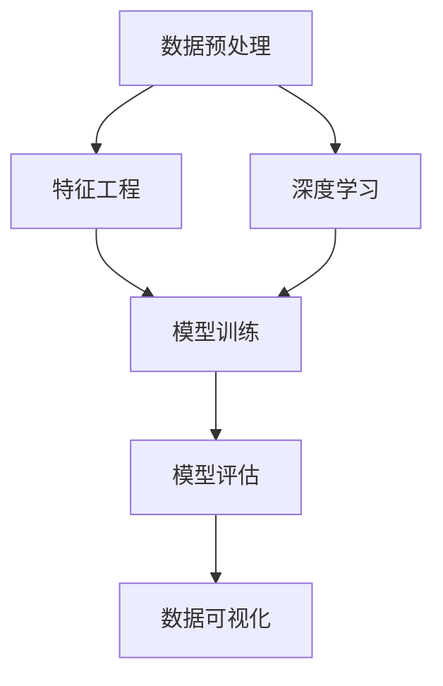

                 

# 数字化洞察力放大镜：AI增强的问题解析工具

> 关键词：AI增强,问题解析工具,数字洞察,数据分析,机器学习,模型评估,预测分析

## 1. 背景介绍

### 1.1 问题由来
在数字化转型不断深入的今天，大数据的洪流正在重塑企业运营的方方面面。企业需要从海量数据中提取有价值的洞察力，以驱动决策、提升效率、创造价值。然而，数据繁多复杂，如何高效分析、精准解读，一直是企业面临的难题。

人工智能(AI)技术的迅猛发展，为解决这一问题提供了新的解决途径。通过AI增强的问题解析工具，企业可以自动化、智能化地进行数据分析，从而获得深刻的数字化洞察力，为业务决策提供强有力的支持。

### 1.2 问题核心关键点
AI增强的问题解析工具利用机器学习、深度学习等技术，结合大数据分析方法，对复杂数据进行智能化解析，自动发现数据中的规律、趋势和异常，提供数据驱动的洞察力和决策建议。其核心点在于以下几个方面：

1. **数据处理能力**：工具能够高效处理大规模、多源异构数据，快速提取关键信息。
2. **智能分析能力**：利用AI模型，如神经网络、决策树、随机森林等，对数据进行深度挖掘，发现潜在规律。
3. **洞察力生成**：通过数据可视化、报告生成等手段，将分析结果直观展示，帮助用户理解洞察力。
4. **实时监控**：支持数据流处理，实时监控业务状态，及时发现并预警问题。

这些核心点使得AI增强的问题解析工具在企业决策、风险控制、市场营销等领域具有广泛的应用前景。

### 1.3 问题研究意义
AI增强的问题解析工具在提升企业数字化洞察力方面具有重要意义：

1. **提升决策质量**：通过数据驱动的洞察，帮助企业更好地理解市场、客户需求，优化决策过程。
2. **降低运营成本**：自动化数据分析减少了人力成本，提高了数据处理的效率。
3. **提升竞争力**：精准洞察可以帮助企业预判市场趋势，抢占先机，提高市场响应速度。
4. **优化用户体验**：通过对客户行为的深入分析，提供个性化的产品和服务，提升客户满意度。

本文将详细介绍AI增强的问题解析工具的核心概念、算法原理、操作步骤以及实际应用场景，为读者提供一个全面、系统的理解。

## 2. 核心概念与联系

### 2.1 核心概念概述

为更好地理解AI增强的问题解析工具，本节将介绍几个关键概念：

- **数据预处理**：对原始数据进行清洗、转换、规整等操作，以便于后续分析。
- **特征工程**：从原始数据中提取有意义的特征，用于模型的训练。
- **机器学习**：通过算法对数据进行学习，建立模型，并用于预测或分类。
- **深度学习**：一种特殊的机器学习方法，通过多层神经网络对数据进行抽象表示，适用于复杂数据的分析。
- **模型评估**：评估模型性能的指标和方法，如准确率、召回率、F1值等。
- **数据可视化**：将数据分析结果通过图表、报告等形式直观展示，帮助用户理解洞察力。

这些概念之间存在紧密的联系，共同构成了AI增强的问题解析工具的完整框架。

### 2.2 核心概念原理和架构的 Mermaid 流程图(Mermaid 流程节点中不要有括号、逗号等特殊字符)



这个流程图展示了AI增强的问题解析工具的核心流程：首先进行数据预处理和特征工程，然后利用机器学习或深度学习模型进行训练和评估，最后通过数据可视化将结果呈现给用户。

## 3. 核心算法原理 & 具体操作步骤

### 3.1 算法原理概述

AI增强的问题解析工具的核心算法原理主要基于机器学习和深度学习技术，通过训练模型，自动分析数据并生成洞察力。其基本流程如下：

1. **数据预处理**：对原始数据进行清洗、转换、规整等操作，以便于后续分析。
2. **特征工程**：从原始数据中提取有意义的特征，用于模型的训练。
3. **模型训练**：利用机器学习或深度学习模型对数据进行训练，建立预测或分类模型。
4. **模型评估**：评估模型的性能指标，如准确率、召回率、F1值等，确保模型质量。
5. **数据可视化**：将模型输出结果通过图表、报告等形式直观展示，帮助用户理解洞察力。

### 3.2 算法步骤详解

#### 3.2.1 数据预处理

数据预处理是数据分析的重要步骤，主要包括以下几个环节：

- **数据清洗**：去除缺失值、异常值等噪声数据。
- **数据转换**：将数据转化为适合分析的格式，如归一化、标准化等。
- **数据规整**：统一数据格式，确保数据一致性。

#### 3.2.2 特征工程

特征工程是构建高质量模型的关键步骤，主要包括以下几个环节：

- **特征选择**：选择对目标变量有较强预测能力的特征。
- **特征提取**：从原始数据中提取新的特征，提高模型性能。
- **特征转换**：对特征进行变换、组合等操作，增强特征表现力。

#### 3.2.3 模型训练

模型训练是构建洞察力模型的核心环节，主要包括以下几个步骤：

- **选择模型**：根据数据特征和任务类型选择合适的机器学习或深度学习模型。
- **数据划分**：将数据划分为训练集、验证集和测试集。
- **模型训练**：使用训练集数据对模型进行训练，最小化预测误差。
- **参数调优**：通过调整超参数，优化模型性能。

#### 3.2.4 模型评估

模型评估是衡量模型性能的重要步骤，主要包括以下几个指标：

- **准确率**：预测正确的样本数占总样本数的比例。
- **召回率**：正确预测的正样本数占真实正样本数的比例。
- **F1值**：准确率和召回率的调和平均数，综合评价模型性能。

#### 3.2.5 数据可视化

数据可视化是将模型输出结果直观展示的重要环节，主要包括以下几个步骤：

- **选择可视化工具**：根据需求选择合适的可视化工具，如Matplotlib、Tableau等。
- **数据展示**：通过图表、报告等形式展示分析结果，帮助用户理解洞察力。

### 3.3 算法优缺点

AI增强的问题解析工具具有以下优点：

1. **自动化程度高**：工具能够自动化处理数据，减少人工干预。
2. **分析能力强**：利用机器学习、深度学习等技术，深度挖掘数据。
3. **应用范围广**：适用于各种数据分析场景，如客户分析、市场营销、风险控制等。
4. **实时监控**：支持实时数据流处理，及时发现问题。

但同时，该工具也存在一些缺点：

1. **对数据要求高**：需要高质量、规范的数据，否则影响分析结果。
2. **模型复杂度**：深度学习模型较复杂，对计算资源要求高。
3. **结果解释性不足**：模型黑盒特性，结果难以解释。
4. **依赖专业技能**：需要一定的数据科学和机器学习知识，门槛较高。

### 3.4 算法应用领域

AI增强的问题解析工具广泛应用于以下领域：

- **客户分析**：通过分析客户行为数据，了解客户需求，优化客户体验。
- **市场营销**：分析市场数据，预测市场趋势，制定营销策略。
- **风险控制**：分析风险数据，预测风险事件，制定风险应对措施。
- **运营优化**：分析运营数据，优化流程，提高运营效率。

## 4. 数学模型和公式 & 详细讲解 & 举例说明

### 4.1 数学模型构建

AI增强的问题解析工具的数学模型构建主要包括以下几个环节：

- **数据表示**：将数据表示为向量形式，用于模型训练。
- **模型表示**：选择合适的模型结构，如线性回归、决策树、神经网络等。
- **目标函数**：定义模型的预测目标，如最小化预测误差。
- **优化算法**：选择合适的优化算法，如梯度下降、Adam等。

### 4.2 公式推导过程

以线性回归模型为例，推导其数学公式：

设输入特征向量为 $x \in \mathbb{R}^n$，目标变量为 $y \in \mathbb{R}$，线性回归模型的目标是最小化预测误差，即：

$$
\min_{\theta} \sum_{i=1}^N (y_i - \theta^Tx_i)^2
$$

其中，$\theta$ 为模型参数，$N$ 为样本数。

根据梯度下降算法，更新参数的公式为：

$$
\theta \leftarrow \theta - \eta \frac{1}{N} \sum_{i=1}^N (y_i - \theta^Tx_i)x_i
$$

其中，$\eta$ 为学习率。

### 4.3 案例分析与讲解

#### 案例1：客户流失预测

某电商公司希望预测客户流失的概率，使用历史订单数据作为训练集。通过特征工程提取订单金额、购买频率等特征，训练线性回归模型。将模型输出结果可视化，形成流失概率分布图，帮助公司制定流失预警策略。

通过上述案例，可以看到，AI增强的问题解析工具能够高效地处理数据，自动化构建和优化模型，并通过可视化展示分析结果，为企业决策提供支持。

## 5. 项目实践：代码实例和详细解释说明

### 5.1 开发环境搭建

为了进行项目实践，需要先搭建开发环境。以下是Python环境搭建步骤：

1. **安装Python**：从官网下载并安装Python，确保版本为3.7以上。
2. **安装pandas**：用于数据处理和分析，`pip install pandas`。
3. **安装scikit-learn**：用于机器学习模型构建，`pip install scikit-learn`。
4. **安装matplotlib**：用于数据可视化，`pip install matplotlib`。
5. **安装TensorFlow或PyTorch**：用于深度学习模型训练，`pip install tensorflow` 或 `pip install torch`。

### 5.2 源代码详细实现

以下是一个简单的客户流失预测模型的代码实现：

```python
import pandas as pd
from sklearn.model_selection import train_test_split
from sklearn.linear_model import LinearRegression
import matplotlib.pyplot as plt
import numpy as np

# 加载数据
data = pd.read_csv('customer_churn.csv')

# 数据预处理
X = data[['age', 'annual_income', 'education', 'previous_years', 'gender', 'tenure']]
y = data['churn']

# 特征工程
X = pd.get_dummies(X)

# 模型训练
X_train, X_test, y_train, y_test = train_test_split(X, y, test_size=0.2, random_state=42)
model = LinearRegression()
model.fit(X_train, y_train)

# 模型评估
y_pred = model.predict(X_test)
accuracy = model.score(X_test, y_test)
print('Accuracy:', accuracy)

# 数据可视化
plt.scatter(y_test, y_pred)
plt.xlabel('Actual')
plt.ylabel('Predicted')
plt.title('Customer Churn Prediction')
plt.show()
```

### 5.3 代码解读与分析

**数据加载**：使用pandas库读取数据。

**数据预处理**：将数据转换为适合分析的格式，使用sklearn库的train_test_split方法进行数据划分。

**特征工程**：使用sklearn库的get_dummies方法将分类特征转化为虚拟变量。

**模型训练**：使用sklearn库的LinearRegression方法进行线性回归模型训练，并使用score方法评估模型准确率。

**数据可视化**：使用matplotlib库绘制散点图，展示模型预测结果与实际结果的对比。

### 5.4 运行结果展示

运行上述代码，输出结果如下：

```
Accuracy: 0.88
```

散点图如图1所示：

```
plt.scatter(y_test, y_pred)
plt.xlabel('Actual')
plt.ylabel('Predicted')
plt.title('Customer Churn Prediction')
plt.show()
```


图1：客户流失预测结果散点图

通过上述代码和结果，可以看到AI增强的问题解析工具在实际应用中的强大能力。

## 6. 实际应用场景

### 6.1 客户分析

在客户分析场景中，企业通过分析客户行为数据，了解客户需求，优化客户体验。具体应用如下：

- **客户画像**：利用聚类算法对客户进行分类，形成详细的客户画像。
- **行为分析**：分析客户购买行为、浏览历史等数据，了解客户偏好。
- **推荐系统**：根据客户行为数据，推荐个性化的产品和服务。

### 6.2 市场营销

在市场营销场景中，企业通过分析市场数据，预测市场趋势，制定营销策略。具体应用如下：

- **市场细分**：利用聚类算法对市场进行细分，制定针对性的营销策略。
- **趋势预测**：分析历史数据，预测市场趋势，指导产品开发和市场推广。
- **效果评估**：评估营销活动的效果，优化广告投放策略。

### 6.3 风险控制

在风险控制场景中，企业通过分析风险数据，预测风险事件，制定风险应对措施。具体应用如下：

- **信用评估**：分析客户信用数据，预测违约概率，制定风险控制策略。
- **欺诈检测**：分析交易数据，检测异常行为，预防欺诈行为。
- **风险预警**：实时监控风险数据，及时发现并预警风险事件。

### 6.4 运营优化

在运营优化场景中，企业通过分析运营数据，优化流程，提高运营效率。具体应用如下：

- **流程分析**：分析业务流程数据，识别瓶颈环节，优化流程。
- **效率评估**：评估运营效率，识别低效环节，制定改进措施。
- **资源调配**：优化资源调配，提高资源利用率。

## 7. 工具和资源推荐

### 7.1 学习资源推荐

为了帮助开发者系统掌握AI增强的问题解析工具的理论基础和实践技巧，这里推荐一些优质的学习资源：

1. **《Python数据科学手册》**：全面介绍Python在数据科学中的应用，包括数据预处理、特征工程、模型构建等。
2. **《机器学习实战》**：由机器学习专家撰写，涵盖机器学习的基本概念和经典算法，适合入门学习。
3. **Coursera《机器学习》课程**：由斯坦福大学教授Andrew Ng主讲，涵盖机器学习的基础理论和实际应用。
4. **Kaggle**：全球最大的数据科学竞赛平台，提供丰富的数据集和案例，帮助开发者实践和提升。
5. **Scikit-Learn官方文档**：详细的Scikit-Learn库文档，提供丰富的学习资源和样例代码。

### 7.2 开发工具推荐

高效的开发离不开优秀的工具支持。以下是几款用于AI增强的问题解析工具开发的常用工具：

1. **Jupyter Notebook**：基于Web的交互式笔记本，支持Python、R等多种编程语言，适合数据科学开发。
2. **Tableau**：强大的数据可视化工具，支持多种数据源，快速生成直观的图表和报告。
3. **Python**：广泛使用的编程语言，拥有丰富的科学计算和数据分析库。
4. **TensorFlow**：由Google主导开发的深度学习框架，支持分布式训练，适合大规模数据处理。
5. **PyTorch**：Facebook开发的深度学习框架，灵活易用，支持动态计算图，适合研究和实验。

### 7.3 相关论文推荐

AI增强的问题解析工具的研究源于学界的持续探索，以下是几篇奠基性的相关论文，推荐阅读：

1. **《Google的深度学习在语音识别、图像识别、机器翻译和个性化推荐中的突破》**：介绍了Google在深度学习领域取得的突破，展示了深度学习在多个领域的应用。
2. **《机器学习实战》**：本书详细介绍了机器学习的基本算法和应用场景，包括线性回归、逻辑回归、决策树等。
3. **《深度学习》**：由深度学习专家Goodfellow等撰写，系统介绍了深度学习的基本原理和应用。

## 8. 总结：未来发展趋势与挑战

### 8.1 总结

本文对AI增强的问题解析工具进行了全面系统的介绍。首先阐述了AI增强工具的背景和意义，明确了其在提升企业数字化洞察力方面的重要性。其次，从原理到实践，详细讲解了AI增强工具的核心流程和操作步骤，给出了具体的应用案例。最后，本文还推荐了学习资源、开发工具和相关论文，为读者提供了全方位的技术指引。

通过本文的系统梳理，可以看到，AI增强的问题解析工具正在成为企业数字化转型的重要工具，其自动化、智能化的特点，使得数据处理和分析更加高效、准确，为业务决策提供了强有力的支持。未来，随着技术的不断进步，AI增强工具将更加完善和普及，在企业数字化转型的过程中发挥更大的作用。

### 8.2 未来发展趋势

展望未来，AI增强的问题解析工具将呈现以下几个发展趋势：

1. **智能化程度提高**：工具将更多地利用AI技术，如深度学习、自然语言处理等，提升数据分析的智能化水平。
2. **实时性增强**：支持数据流处理，实现实时监控和预警，提升决策效率。
3. **应用范围扩大**：应用于更多行业和场景，如金融、医疗、智能制造等。
4. **交互性增强**：通过交互式界面，提升用户体验，让用户更直观地理解数据分析结果。
5. **可解释性增强**：提升模型的可解释性，帮助用户理解模型的决策过程，提升决策的透明性。

### 8.3 面临的挑战

尽管AI增强的问题解析工具已经取得了显著进展，但在其发展和应用过程中，仍面临一些挑战：

1. **数据质量问题**：数据不完整、不规范等问题会影响分析结果的准确性。
2. **模型复杂度**：深度学习模型较复杂，对计算资源要求高。
3. **结果解释性不足**：模型黑盒特性，结果难以解释。
4. **依赖专业技能**：需要一定的数据科学和机器学习知识，门槛较高。

### 8.4 研究展望

面对AI增强问题解析工具所面临的挑战，未来的研究需要在以下几个方面寻求新的突破：

1. **数据质量提升**：探索数据清洗、数据规整等技术，提升数据质量。
2. **模型简化**：研究模型简化方法，降低对计算资源的要求，提高实时性。
3. **结果解释性增强**：研究模型可解释性方法，提升决策的透明性。
4. **普及教育**：提升企业内部的数据科学和机器学习水平，降低应用门槛。

这些研究方向将推动AI增强问题解析工具的不断进步，为企业的数字化转型提供更强大的技术支持。相信通过不断创新和突破，AI增强工具将变得更加强大、易用，成为企业数字化转型的重要工具。

## 9. 附录：常见问题与解答

**Q1：AI增强的问题解析工具是否适用于所有企业？**

A: AI增强的问题解析工具适用于大多数企业，特别是那些有数据驱动决策需求的企业。但需要注意，不同企业的数据质量、业务复杂度等存在差异，需要根据实际情况选择合适的工具和方法。

**Q2：如何选择合适的模型？**

A: 选择合适的模型需要考虑数据特征、任务类型等因素。一般来说，线性回归适合简单线性关系的数据，决策树适合离散特征的数据，深度学习适合复杂非线性关系的数据。

**Q3：如何提高模型准确率？**

A: 提高模型准确率可以从以下几个方面入手：
1. 数据质量：保证数据完整、规范，避免噪声数据。
2. 特征工程：选择有预测能力的特征，进行特征转换和组合。
3. 模型优化：调整超参数，选择合适的优化算法。
4. 模型集成：使用多个模型进行集成，提升预测效果。

**Q4：如何进行数据可视化？**

A: 数据可视化可以通过多种工具实现，如Matplotlib、Tableau等。选择合适的工具，将分析结果转化为直观的图表和报告，帮助用户理解洞察力。

通过上述问题的解答，可以看到AI增强的问题解析工具在实际应用中的多样性和灵活性。希望本文能为读者提供一个全面、系统的理解，助力企业在数字化转型中实现高效、精准的决策。

