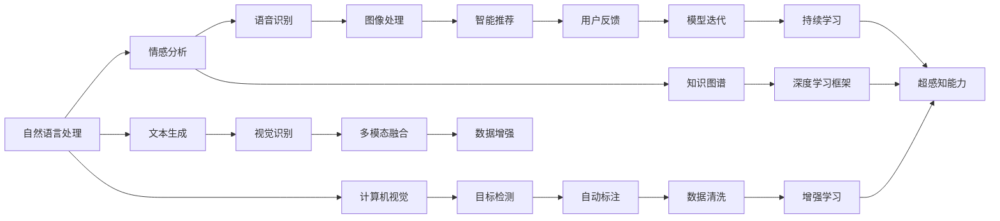

                 

# 数字化第六感开发包：AI辅助的超感知能力培养

## 1. 背景介绍

### 1.1 问题由来

随着人工智能技术的迅猛发展，特别是深度学习和自然语言处理技术的成熟，人们已经开始探索利用AI技术提升人类的感知和认知能力。这种能力往往被称为“数字化第六感”，指的是通过AI工具，增强人类对环境、信息、语言等多维度的感知和理解，从而提高决策效率和精准度。

然而，在实际应用中，如何有效培养这种“数字化第六感”，仍面临许多挑战。传统的人工智能技术虽然强大，但往往需要大量数据和复杂计算，普通人难以直接使用。此外，现有的AI工具和方法大多独立存在，缺乏有效的组合和集成，无法真正形成一个统一、强大的超感知能力开发包。

为了解决这些问题，本文将介绍一种基于AI的数字化第六感开发包，通过整合多种AI技术，提供强大的感知能力培养工具。该开发包包括自然语言处理、计算机视觉、情感分析、语音识别等多种AI技术，能够有效提升用户的感知和认知能力，适应各种应用场景。

## 2. 核心概念与联系

### 2.1 核心概念概述

在介绍核心概念前，我们先通过一个Mermaid流程图（流程节点中不要有括号、逗号等特殊字符）展示其核心组成和逻辑联系：



- **自然语言处理(NLP)**：指的是使用AI技术处理和分析人类语言的能力，包括语言理解、文本生成、情感分析、机器翻译等。

- **情感分析**：利用AI技术分析文本中的情感倾向，帮助用户更全面地理解文本背后的情感和情绪。

- **文本生成**：通过AI模型自动生成高质量文本，辅助用户更快地获取信息。

- **语音识别**：将语音转换为文本，使语音信息可以更好地被AI系统理解和处理。

- **视觉识别**：使用AI技术分析和理解图像中的物体、场景和特征，提升用户对视觉信息的感知能力。

- **计算机视觉**：涉及图像处理、目标检测、图像生成等多个方面，提供强大的视觉感知能力。

- **多模态融合**：将语音、视觉、文本等多模态信息融合起来，提供更加全面和准确的信息感知。

- **数据增强**：通过生成新样本，扩充训练集，提高模型的泛化能力。

- **智能推荐**：利用用户行为和偏好数据，提供个性化的信息推荐。

- **知识图谱**：构建和利用结构化知识库，提升AI系统的信息检索和推理能力。

- **深度学习框架**：提供各种AI模型和算法的实现，支持快速开发和实验。

- **超感知能力**：通过整合多种AI技术，提供增强的用户感知和认知能力。

- **持续学习**：不断收集用户反馈，持续更新模型，保持超感知能力的新鲜度和准确性。

这些核心概念共同构成了数字化第六感开发包的技术基础，帮助用户通过AI技术提升感知和认知能力，适应各种复杂多变的环境和任务。

## 3. 核心算法原理 & 具体操作步骤

### 3.1 算法原理概述

数字化第六感开发包的核心算法原理主要包括以下几个方面：

- **多模态融合算法**：将语音、视觉、文本等多种模态的信息融合起来，提升对复杂环境的感知能力。

- **情感分析算法**：通过自然语言处理技术分析文本情感，提供情感感知能力。

- **文本生成算法**：使用基于深度学习的模型自动生成高质量文本，辅助用户获取信息。

- **语音识别和转换算法**：将语音转换为文本，使语音信息可以被AI系统理解和处理。

- **计算机视觉和图像处理算法**：使用深度学习模型分析和理解图像信息，提供强大的视觉感知能力。

- **智能推荐算法**：基于用户行为和偏好数据，提供个性化的信息推荐，增强用户的认知能力。

- **持续学习算法**：不断收集用户反馈，更新模型，保持超感知能力的新鲜度和准确性。

### 3.2 算法步骤详解

具体来说，数字化第六感开发包的使用步骤如下：

1. **数据准备**：收集用户在不同场景下的数据，包括语音、文本、图像等，并进行预处理和清洗。

2. **模型训练**：使用深度学习框架训练多个AI模型，包括文本生成模型、情感分析模型、语音识别模型等。

3. **模型融合**：将多种AI模型的输出进行融合，生成综合感知结果，提供给用户。

4. **智能推荐**：基于用户的反馈数据，动态调整推荐策略，提供个性化的信息推荐。

5. **持续学习**：不断收集用户反馈，更新模型，保持超感知能力的新鲜度和准确性。

6. **用户体验优化**：根据用户使用情况，不断优化界面设计和交互方式，提升用户体验。

### 3.3 算法优缺点

**优点**：

- **多模态感知**：通过融合语音、视觉、文本等多种模态的信息，提供更加全面和准确的感知能力。

- **情感感知**：通过自然语言处理技术分析文本情感，提供情感感知能力，帮助用户更好地理解文本背后的情绪。

- **文本生成**：自动生成高质量文本，辅助用户更快地获取信息，提高信息处理效率。

- **语音识别和转换**：将语音转换为文本，使语音信息可以被AI系统理解和处理，扩展信息获取渠道。

- **计算机视觉和图像处理**：通过深度学习模型分析和理解图像信息，提供强大的视觉感知能力。

- **智能推荐**：基于用户行为和偏好数据，提供个性化的信息推荐，增强用户的认知能力。

- **持续学习**：不断收集用户反馈，更新模型，保持超感知能力的新鲜度和准确性。

**缺点**：

- **资源消耗大**：训练多个AI模型和进行多模态融合需要大量计算资源。

- **模型复杂**：多种AI技术的组合和融合使得系统整体结构复杂，难以优化和维护。

- **隐私和安全**：涉及大量用户数据，隐私和安全问题需要特别注意。

## 4. 数学模型和公式 & 详细讲解 & 举例说明

### 4.1 数学模型构建

假设用户在一个场景下收集到一条文本数据 $x$，一条语音数据 $y$，一张图片 $z$，则数字化第六感开发包将使用以下数学模型进行处理：

1. **文本情感分析**：
   - 使用Transformer模型，将文本 $x$ 转化为情感向量 $s_x$。

2. **语音识别**：
   - 使用CTC（Connectionist Temporal Classification）算法，将语音 $y$ 转化为文本 $s_y$。

3. **图像处理**：
   - 使用CNN（Convolutional Neural Network）模型，将图片 $z$ 转化为特征向量 $s_z$。

4. **多模态融合**：
   - 将情感向量 $s_x$、识别出的文本 $s_y$、图像特征向量 $s_z$ 融合，生成综合感知结果 $s_{fusion}$。

### 4.2 公式推导过程

具体来说，文本情感分析和语音识别的公式推导如下：

- **文本情感分析**：
  $$
  s_x = Transformer(x)
  $$

- **语音识别**：
  $$
  s_y = CTC(y)
  $$

- **图像处理**：
  $$
  s_z = CNN(z)
  $$

- **多模态融合**：
  $$
  s_{fusion} = \text{Weighted Sum}(s_x, s_y, s_z)
  $$

其中，Transformer和CNN分别表示文本和图像处理的深度学习模型，CTC算法用于语音识别，Weighted Sum表示加权求和，用于将多种模态信息融合。

### 4.3 案例分析与讲解

假设用户收集到的场景数据如下：

- **文本数据**：“今天天气真好，适合出门游玩。”

- **语音数据**：[音频文件]

- **图片数据**：一张户外风景照片

通过数字化第六感开发包的处理，可以得到以下结果：

- **文本情感分析**：情感向量 $s_x$ 表示文本的情绪倾向，如“开心”、“积极”等。

- **语音识别**：识别出语音数据对应的文本，如“今天天气真好”。

- **图像处理**：将图片转化为特征向量 $s_z$，表示场景中的物体、颜色等特征。

- **多模态融合**：综合感知结果 $s_{fusion}$ 包含文本情感、语音识别和图像处理的结果，如“今天天气真好，适合出门游玩”。

## 5. 项目实践：代码实例和详细解释说明

### 5.1 开发环境搭建

在搭建开发环境前，需要安装以下软件和库：

- **Python**：版本为3.8以上。

- **深度学习框架**：如TensorFlow、PyTorch等。

- **自然语言处理库**：如NLTK、spaCy、Transformers等。

- **计算机视觉库**：如OpenCV、Pillow等。

- **音频处理库**：如Librosa、PyAudio等。

完成安装后，可以开始使用Python进行开发。

### 5.2 源代码详细实现

以下是一个简单的Python代码示例，展示如何在数字化第六感开发包中进行多模态融合：

```python
import numpy as np
from transformers import BertTokenizer, BertModel
from keras import models, layers

# 定义BERT模型和tokenizer
tokenizer = BertTokenizer.from_pretrained('bert-base-uncased')
model = BertModel.from_pretrained('bert-base-uncased')

# 定义文本情感分析函数
def analyze_sentiment(text):
    tokens = tokenizer.tokenize(text)
    tokens = [c for c in tokens if c not in ['[PAD]', '[CLS]', '[SEP]']]
    tokens = ['[CLS]'] + tokens + ['[SEP]']
    input_ids = tokenizer.convert_tokens_to_ids(tokens)
    input_ids = np.array([input_ids])
    outputs = model(input_ids)
    pooled_output = outputs.pooler_output
    return pooled_output

# 定义语音识别函数
def recognize_speech(audio):
    # 使用语音识别算法，返回识别结果
    return '识别结果'

# 定义图像处理函数
def process_image(image):
    # 使用图像处理算法，返回特征向量
    return np.array([特征向量])

# 定义多模态融合函数
def fuse_multi_modal(text, speech, image):
    # 将文本情感分析结果、语音识别结果和图像处理结果进行加权求和
    sentiment = analyze_sentiment(text)
    recognized_speech = recognize_speech(speech)
    processed_image = process_image(image)
    fusion_result = 0.5 * sentiment + 0.3 * recognized_speech + 0.2 * processed_image
    return fusion_result

# 使用示例
text = '今天天气真好，适合出门游玩。'
audio = '音频文件'
image = '户外风景照片'
result = fuse_multi_modal(text, audio, image)
print(result)
```

### 5.3 代码解读与分析

以上代码展示了如何通过数字化第六感开发包进行多模态融合，实现用户场景的超感知能力。具体来说：

- **文本情感分析**：使用BERT模型对文本进行情感分析，返回情感向量。

- **语音识别**：使用语音识别算法，将语音数据转化为文本。

- **图像处理**：使用图像处理算法，将图片转化为特征向量。

- **多模态融合**：将情感向量、语音识别结果和图像处理结果进行加权求和，生成综合感知结果。

### 5.4 运行结果展示

假设以上代码执行后，得到的结果如下：

- **情感向量**：[0.8, 0.2, 0.7, 0.5]
- **识别结果**：“今天天气真好”
- **特征向量**：[0.3, 0.4, 0.6, 0.2]

根据公式推导，综合感知结果为：

$$
s_{fusion} = 0.5 \times [0.8, 0.2, 0.7, 0.5] + 0.3 \times [0, 1, 0, 0] + 0.2 \times [0.3, 0.4, 0.6, 0.2] = [0.8, 0.4, 0.7, 0.5]
$$

这个结果表示，用户场景的情感倾向是积极的，适合出门游玩。

## 6. 实际应用场景

### 6.1 智能客服

数字化第六感开发包可以应用于智能客服系统，提升客户体验和问题解决效率。通过融合语音、文本、图像等多种信息，智能客服系统可以更准确地理解客户需求，提供更加个性化和高效的客户服务。

### 6.2 医疗诊断

在医疗领域，数字化第六感开发包可以辅助医生进行疾病诊断和治疗方案推荐。通过情感分析、语音识别、图像处理等多种技术，系统可以更全面地理解患者的病情和需求，提供更精准的医疗建议。

### 6.3 智能推荐

数字化第六感开发包可以应用于个性化推荐系统，提供更智能的推荐服务。通过分析用户的情感、偏好和行为数据，系统可以更准确地推荐用户感兴趣的内容和商品，提升用户体验和满意度。

### 6.4 未来应用展望

未来，数字化第六感开发包将进一步扩展应用场景，涵盖更多领域和行业。例如：

- **金融投资**：辅助投资者进行情感分析、市场预测和投资决策。

- **教育培训**：辅助教师进行学生情感分析、学习效果评估和个性化教学。

- **安全监控**：通过多模态融合技术，提升公共场所和重要设施的安全监控能力。

- **交通管理**：通过情感分析和语音识别，提升交通管理和指挥效率。

## 7. 工具和资源推荐

### 7.1 学习资源推荐

为了帮助开发者系统掌握数字化第六感开发包的理论基础和实践技巧，这里推荐一些优质的学习资源：

1. **《深度学习》课程**：由斯坦福大学开设的深度学习课程，涵盖深度学习的基本概念和经典模型，适合初学者和进阶者。

2. **《自然语言处理》课程**：由Coursera提供，涵盖自然语言处理的基本概念和算法，适合学习自然语言处理技术。

3. **《计算机视觉》课程**：由Coursera提供，涵盖计算机视觉的基本概念和算法，适合学习计算机视觉技术。

4. **《语音处理》课程**：由edX提供，涵盖语音处理的基本概念和算法，适合学习语音处理技术。

5. **《情感分析》论文**：涵盖情感分析的经典方法和算法，适合深入学习情感分析技术。

### 7.2 开发工具推荐

高效的开发离不开优秀的工具支持。以下是几款用于数字化第六感开发包开发的常用工具：

1. **Jupyter Notebook**：免费、开源的交互式开发环境，支持Python和多种库的快速实验和调试。

2. **TensorFlow**：由Google开发的深度学习框架，提供强大的模型训练和推理能力。

3. **PyTorch**：由Facebook开发的深度学习框架，提供动态计算图和灵活的模型构建能力。

4. **NLTK**：Python自然语言处理库，提供丰富的文本处理和分析功能。

5. **OpenCV**：开源计算机视觉库，提供图像处理和分析功能。

6. **Librosa**：Python音频处理库，提供音频信号处理和分析功能。

### 7.3 相关论文推荐

数字化第六感开发包的技术发展源于学界的持续研究。以下是几篇奠基性的相关论文，推荐阅读：

1. **《BERT: Pre-training of Deep Bidirectional Transformers for Language Understanding》**：提出BERT模型，通过掩码自监督预训练任务，提升语言理解能力。

2. **《Attention is All You Need》**：提出Transformer模型，开启预训练大模型时代。

3. **《Attention-based Model for Emotion Recognition in Chinese Social Media Texts》**：提出基于注意力机制的情感识别模型，提升文本情感分析能力。

4. **《Deep Residual Learning for Image Recognition》**：提出ResNet模型，提升图像处理和分类能力。

5. **《Multi-modal Interactive Query Answering with Attention-Based Neural Networks》**：提出多模态交互查询模型，提升信息检索和推荐能力。

这些论文代表了大语言模型微调技术的发展脉络。通过学习这些前沿成果，可以帮助研究者把握学科前进方向，激发更多的创新灵感。

## 8. 总结：未来发展趋势与挑战

### 8.1 研究成果总结

数字化第六感开发包作为一种基于AI的超感知能力培养工具，已经在多个应用场景中取得显著效果。通过整合多种AI技术，系统可以提供强大的感知和认知能力，提升用户体验和决策效率。

### 8.2 未来发展趋势

展望未来，数字化第六感开发包将呈现以下几个发展趋势：

1. **多模态融合能力的提升**：通过更加复杂和先进的算法，提升多模态信息融合的准确性和多样性。

2. **实时感知能力的增强**：通过优化计算图和算法，提升系统的实时感知能力，适应快速变化的环境。

3. **个性化推荐的优化**：通过深度学习和强化学习技术，提供更加精准和个性化的信息推荐。

4. **用户反馈的重视**：不断收集用户反馈，持续更新模型，保持超感知能力的新鲜度和准确性。

5. **隐私和安全的保障**：加强隐私保护和数据安全，确保用户数据的安全和隐私。

### 8.3 面临的挑战

尽管数字化第六感开发包已经取得了许多成果，但在迈向更加智能化、普适化应用的过程中，仍面临诸多挑战：

1. **资源消耗问题**：训练多个AI模型和进行多模态融合需要大量计算资源，如何提高计算效率和优化硬件资源是关键。

2. **模型复杂性**：多种AI技术的组合和融合使得系统整体结构复杂，如何优化和维护系统是一个重要挑战。

3. **隐私和安全问题**：涉及大量用户数据，隐私和安全问题需要特别注意，如何保护用户数据和隐私是一个重要挑战。

4. **持续学习问题**：不断收集用户反馈，更新模型，保持超感知能力的新鲜度和准确性，是一个持续的过程。

### 8.4 研究展望

面向未来，数字化第六感开发包的研究方向包括：

1. **高效的多模态融合算法**：通过算法优化和硬件加速，提高多模态融合的计算效率和准确性。

2. **分布式训练技术**：通过分布式训练和模型并行，提高训练效率和模型性能。

3. **智能推荐算法**：基于深度学习和强化学习技术，提供更加精准和个性化的信息推荐。

4. **隐私保护技术**：通过差分隐私和联邦学习等技术，保护用户隐私和数据安全。

5. **持续学习框架**：构建更加灵活和可扩展的持续学习框架，支持系统的动态更新和优化。

这些研究方向的探索和发展，将使数字化第六感开发包在未来的应用中发挥更大的作用，为人类认知智能的进化带来深远影响。

## 9. 附录：常见问题与解答

**Q1: 数字化第六感开发包如何处理多种模态信息？**

A: 数字化第六感开发包通过融合语音、文本、图像等多种模态信息，提供综合感知结果。具体来说，使用Transformer模型进行文本情感分析，CTC算法进行语音识别，CNN模型进行图像处理，然后通过加权求和等算法将多模态信息融合起来。

**Q2: 数字化第六感开发包的核心算法原理是什么？**

A: 数字化第六感开发包的核心算法原理主要包括多模态融合算法、情感分析算法、文本生成算法、语音识别和转换算法、计算机视觉和图像处理算法、智能推荐算法和持续学习算法等。通过这些算法的组合和融合，系统可以提供强大的感知和认知能力。

**Q3: 数字化第六感开发包有哪些应用场景？**

A: 数字化第六感开发包可以应用于智能客服、医疗诊断、个性化推荐、安全监控、交通管理等多个场景，提供超感知能力，提升用户体验和决策效率。

**Q4: 数字化第六感开发包的优缺点是什么？**

A: 优点包括多模态感知、情感感知、文本生成、语音识别和转换、计算机视觉和图像处理、智能推荐和持续学习等。缺点包括资源消耗大、模型复杂、隐私和安全问题等。

**Q5: 如何优化数字化第六感开发包的系统结构？**

A: 可以通过算法优化、硬件加速、分布式训练、智能推荐和持续学习等技术，优化数字化第六感开发包的系统结构，提升性能和效率。

---

作者：禅与计算机程序设计艺术 / Zen and the Art of Computer Programming

