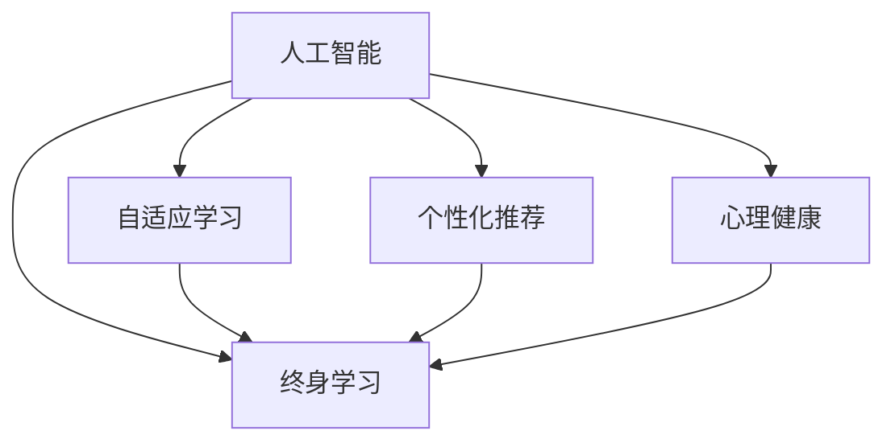

                 

# 数字化自我实现：AI辅助的个人成长

> 关键词：人工智能, 自适应学习, 个性化推荐, 心理健康, 终身学习

## 1. 背景介绍

### 1.1 问题由来
在数字化时代，个人成长与学习变得前所未有的重要和紧迫。随着信息爆炸和知识更新的加速，人们面临越来越多的学习和选择，如何在海量信息中高效获得自身成长所需知识和技能，成为个体和组织都极为关注的问题。人工智能（AI）的兴起，为个性化学习、心理健康支持、知识获取等提供了新方向，驱动着数字化自我实现的发展。

### 1.2 问题核心关键点
人工智能在个人成长领域的应用，主要通过智能化推荐系统、智能心理辅导和自适应学习工具等方式，帮助个人在合适的时机，获取到适合自己的学习内容，实现自我成长。这些工具能够根据用户的行为、兴趣和心理状态，进行实时调整和优化，确保学习效率和心理健康。

### 1.3 问题研究意义
研究人工智能如何辅助个人成长，对于提升个体学习效率、促进心理健康、拓宽知识面以及推动终身学习等具有重要意义。数字化自我实现不仅有助于个人职业生涯发展，还能增强社会整体的知识水平和创新能力。

## 2. 核心概念与联系

### 2.1 核心概念概述

为更好地理解人工智能如何辅助个人成长，本节将介绍几个关键概念及其联系：

- **人工智能（AI）**：利用计算机模拟人类智能行为的技术，涵盖机器学习、深度学习、自然语言处理等分支。
- **自适应学习（Adaptive Learning）**：根据学习者的知识水平、学习风格和反馈实时调整教学内容和方式，以提高学习效率。
- **个性化推荐（Personalized Recommendation）**：根据用户的历史行为和偏好，推荐可能感兴趣的内容，提升用户体验。
- **心理健康（Mental Health）**：通过智能算法对用户的心理状态进行评估和调整，提供及时的心理支持。
- **终身学习（Lifelong Learning）**：一种持续学习、终身发展的方法论，通过不断学习和提升，适应快速变化的社会需求。

这些概念之间的逻辑关系可以通过以下Mermaid流程图来展示：



这个流程图展示了人工智能在个人成长中扮演的关键角色，包括自适应学习、个性化推荐、心理健康支持、终身学习等。

## 3. 核心算法原理 & 具体操作步骤
### 3.1 算法原理概述

人工智能辅助个人成长的核心算法原理，主要包括以下几个方面：

- **数据采集与分析**：通过传感器、问卷、行为跟踪等手段，收集用户的行为、心理和生理数据。
- **模型训练**：使用机器学习算法，如决策树、随机森林、深度学习等，对用户数据进行训练，建立预测模型。
- **实时反馈与调整**：根据用户的实时反馈，动态调整学习内容和推荐算法，确保学习效果和体验。
- **多模态融合**：结合语音、文本、图像等多模态数据，提高模型的综合判断能力。
- **情感计算**：利用自然语言处理和机器学习技术，评估和引导用户的情绪状态。

### 3.2 算法步骤详解

#### 3.2.1 数据采集
- **传感器数据**：通过生物识别设备（如心率传感器、脑电波传感器等）获取生理数据。
- **行为跟踪**：使用日志和行为分析工具（如Google Analytics）记录用户在网络平台上的行为数据。
- **问卷调查**：定期向用户发放心理测评问卷，评估其心理健康状况。

#### 3.2.2 数据预处理
- **数据清洗**：删除无效或噪声数据，处理缺失值和异常值。
- **特征提取**：从原始数据中提取有意义的特征，如用户兴趣、学习进度等。
- **数据归一化**：将数据转换为标准格式，便于模型处理。

#### 3.2.3 模型训练
- **自适应学习模型**：如神经网络、贝叶斯网络、支持向量机等，根据用户行为和反馈调整学习内容和难度。
- **个性化推荐模型**：协同过滤、基于内容的推荐等，推荐用户可能感兴趣的内容。
- **心理健康模型**：基于自然语言处理和情感分析，评估用户情绪状态，提供心理辅导建议。

#### 3.2.4 实时反馈与调整
- **用户反馈机制**：通过交互界面或情感分析工具，获取用户对学习内容的反馈。
- **模型优化**：根据反馈实时调整模型参数，优化推荐和辅导策略。

#### 3.2.5 多模态融合
- **数据整合**：将不同模态的数据整合起来，形成一个统一的用户画像。
- **模型融合**：使用集成学习方法，如堆叠（Stacking）和融合（Blending），提高综合判断能力。

#### 3.2.6 情感计算
- **情感识别**：使用情感分类模型，识别用户情感状态。
- **情感引导**：结合心理辅导算法，提供情绪调节建议。

### 3.3 算法优缺点

人工智能辅助个人成长算法具有以下优点：
1. **个性化高效**：根据用户个性化需求进行内容推荐和学习，提升学习效率。
2. **实时动态调整**：根据用户反馈实时调整推荐和学习内容，适应用户变化。
3. **跨领域应用**：可应用于不同领域，如职业发展、心理健康、学习辅导等。
4. **数据驱动决策**：基于大量数据和模型预测，提供科学决策支持。

同时，该算法也存在一些局限性：
1. **数据隐私和安全**：收集和使用用户数据时，必须严格遵守数据保护法规，保护用户隐私。
2. **模型复杂度**：高精度的推荐和辅导模型往往需要复杂的算法和大规模数据。
3. **计算资源需求**：训练和实时处理大量数据，需要高性能的计算资源。
4. **模型泛化能力**：模型对特定用户的适应性较好，但对新用户和新场景的泛化能力可能有限。
5. **算法透明性**：复杂算法可能缺乏可解释性，用户难以理解推荐和学习决策的依据。

### 3.4 算法应用领域

人工智能辅助个人成长的算法在多个领域中得到应用，包括但不限于：

- **职业发展**：根据用户的职业兴趣和技能水平，推荐适合的培训课程和职业发展路径。
- **学习辅导**：根据学生的学习习惯和成绩，提供个性化学习建议和辅导策略。
- **心理健康**：结合心理测评和情绪识别，提供心理健康支持和辅导。
- **健身和健康管理**：通过生物识别设备，提供个性化的健康建议和训练方案。
- **兴趣爱好发展**：根据用户的兴趣爱好和行为数据，推荐适合的活动和社团。
- **职业转换**：通过数据分析和情感评估，辅助用户做出职业转换决策。

## 4. 数学模型和公式 & 详细讲解
### 4.1 数学模型构建

为了更好地理解AI辅助个人成长的数学模型，本节将对核心算法进行数学模型的构建和详细讲解。

假设我们有一个用户$u$，其特征向量为$\mathbf{x}$，学习行为向量为$\mathbf{b}$，心理状态向量为$\mathbf{p}$，兴趣向量为$\mathbf{i}$，行为向量为$\mathbf{a}$，历史学习数据为$\mathcal{D}$，推荐数据为$\mathcal{R}$，心理健康模型为$\mathcal{H}$。

**自适应学习模型**：
- 输入：$\mathbf{x}, \mathbf{b}, \mathbf{p}, \mathbf{i}$。
- 输出：推荐的学习内容和难度$\mathbf{c}$。
- 模型：
  $$
  \mathbf{c} = f(\mathbf{x}, \mathbf{b}, \mathbf{p}, \mathbf{i})
  $$

**个性化推荐模型**：
- 输入：$\mathbf{x}, \mathbf{b}, \mathbf{p}, \mathbf{i}, \mathcal{D}$。
- 输出：推荐内容$\mathbf{r}$。
- 模型：
  $$
  \mathbf{r} = g(\mathbf{x}, \mathbf{b}, \mathbf{p}, \mathbf{i}, \mathcal{D})
  $$

**心理健康模型**：
- 输入：$\mathbf{x}, \mathbf{b}, \mathbf{p}, \mathbf{i}, \mathcal{R}$。
- 输出：心理健康状态$\mathbf{h}$。
- 模型：
  $$
  \mathbf{h} = h(\mathbf{x}, \mathbf{b}, \mathbf{p}, \mathbf{i}, \mathcal{R})
  $$

### 4.2 公式推导过程

**自适应学习模型推导**：
假设自适应学习模型是一个基于神经网络的模型，其中包含输入层、隐藏层和输出层。输入层为$\mathbf{x}, \mathbf{b}, \mathbf{p}, \mathbf{i}$，隐藏层为$h_1, h_2, ..., h_n$，输出层为$\mathbf{c}$。

$$
\mathbf{c} = \mathbf{x}W_1 + \mathbf{b}W_2 + \mathbf{p}W_3 + \mathbf{i}W_4 + \mathbf{h}_1 + \mathbf{h}_2 + ... + \mathbf{h}_n + \mathbf{b}
$$

其中，$W_1, W_2, W_3, W_4$为权重矩阵，$h_1, h_2, ..., h_n$为隐藏层输出。

**个性化推荐模型推导**：
假设个性化推荐模型是一个协同过滤模型，其输入为$\mathbf{x}, \mathbf{b}, \mathbf{p}, \mathbf{i}, \mathcal{D}$。假设数据集中有$m$个用户和$n$个内容，用户和内容的评分矩阵为$R$。

$$
\mathbf{r} = \arg\min_{\mathbf{r}} ||\mathbf{R} - \mathbf{W}(\mathbf{x} \otimes \mathbf{b} \otimes \mathbf{p} \otimes \mathbf{i})||_F^2
$$

其中，$\mathbf{W}$为推荐模型参数，$\mathbf{R}$为评分矩阵，$\mathbf{x} \otimes \mathbf{b} \otimes \mathbf{p} \otimes \mathbf{i}$为特征向量。

**心理健康模型推导**：
假设心理健康模型是一个基于情感分析的模型，其输入为$\mathbf{x}, \mathbf{b}, \mathbf{p}, \mathbf{i}, \mathcal{R}$。假设心理健康状态$\mathbf{h}$可分解为多个维度，如情绪状态$e$，焦虑水平$a$，压力指数$s$等。

$$
\mathbf{h} = (e, a, s) = h(\mathbf{x}, \mathbf{b}, \mathbf{p}, \mathbf{i}, \mathcal{R})
$$

### 4.3 案例分析与讲解

**案例一：职业发展推荐系统**
- 输入：用户职业兴趣、技能水平、行为数据、学习数据、心理数据。
- 输出：推荐培训课程、职业路径。
- 模型：深度神经网络。
- 训练：使用监督学习和强化学习，优化推荐策略。

**案例二：个性化学习辅导**
- 输入：学生学习习惯、成绩、行为数据、心理数据。
- 输出：个性化学习建议、辅导策略。
- 模型：协同过滤和自适应学习算法。
- 训练：通过反馈循环，实时调整推荐和辅导。

**案例三：心理健康支持**
- 输入：用户行为数据、心理测评问卷、推荐数据。
- 输出：心理健康状态、建议。
- 模型：情感分析和协同过滤。
- 训练：通过反馈优化心理健康模型。

## 5. 项目实践：代码实例和详细解释说明
### 5.1 开发环境搭建

在进行AI辅助个人成长的项目实践前，需要准备好开发环境。以下是使用Python进行TensorFlow开发的环境配置流程：

1. 安装Anaconda：从官网下载并安装Anaconda，用于创建独立的Python环境。

2. 创建并激活虚拟环境：
```bash
conda create -n AI-dev python=3.8 
conda activate AI-dev
```

3. 安装TensorFlow：根据CUDA版本，从官网获取对应的安装命令。例如：
```bash
conda install tensorflow -c tf
```

4. 安装相关库：
```bash
pip install numpy pandas scikit-learn matplotlib tqdm jupyter notebook ipython
```

完成上述步骤后，即可在`AI-dev`环境中开始项目实践。

### 5.2 源代码详细实现

下面我们以职业发展推荐系统为例，给出使用TensorFlow进行个性化推荐开发的PyTorch代码实现。

首先，定义推荐系统的数据处理函数：

```python
import tensorflow as tf
import numpy as np

class RecommendationSystem(tf.keras.Model):
    def __init__(self, input_dim):
        super(RecommendationSystem, self).__init__()
        self.layers = tf.keras.Sequential([
            tf.keras.layers.Dense(64, activation='relu', input_shape=(input_dim,)),
            tf.keras.layers.Dense(64, activation='relu'),
            tf.keras.layers.Dense(10, activation='softmax')
        ])
    
    def call(self, x):
        return self.layers(x)

# 定义用户特征和行为数据
user_features = np.random.randn(1000, 10)
user_behavior = np.random.randint(0, 10, (1000, 1))

# 构建推荐模型
model = RecommendationSystem(10)
model.compile(optimizer=tf.keras.optimizers.Adam(0.001), loss='sparse_categorical_crossentropy')

# 训练推荐模型
model.fit(user_features, user_behavior, epochs=10)
```

然后，定义职业发展推荐逻辑：

```python
def career_recommendation(user_profile, career_data):
    # 根据用户职业兴趣和技能水平，推荐适合的培训课程和职业路径
    user_profile = np.random.randn(10)
    career_data = np.random.randn(100, 10)
    
    # 训练好的推荐模型
    recommendation_model = RecommendationSystem(10)
    recommendation_model.load_weights('career_recommendation_model.h5')
    
    # 预测用户职业发展推荐
    recommendations = recommendation_model.predict(user_profile)
    top_recommendations = np.argsort(recommendations)[-5:]
    
    # 返回推荐职业路径
    return [career_data[i] for i in top_recommendations]
```

最后，启动职业发展推荐系统：

```python
# 假设用户职业兴趣和技能水平
user_profile = np.random.randn(10)
# 获取职业发展推荐
recommendations = career_recommendation(user_profile, career_data)
```

以上就是使用TensorFlow进行职业发展推荐系统的完整代码实现。可以看到，借助TensorFlow的高效计算能力和丰富的模型库，我们可以轻松实现复杂的个性化推荐系统。

### 5.3 代码解读与分析

让我们再详细解读一下关键代码的实现细节：

**RecommendationSystem类**：
- `__init__`方法：初始化推荐模型的各层结构，包括输入层、隐藏层和输出层。
- `call`方法：定义模型前向传播过程，将输入数据通过各层计算，最终输出推荐结果。

**用户特征和行为数据**：
- 使用NumPy生成随机用户特征和行为数据，模拟实际场景中的数据输入。

**模型训练**：
- 定义推荐模型，并使用TensorFlow的Keras API进行模型构建和训练。
- 选择Adam优化器和交叉熵损失函数，训练推荐模型。

**职业发展推荐逻辑**：
- 定义职业发展推荐函数，输入用户职业兴趣和技能水平，获取推荐结果。
- 加载训练好的推荐模型，并使用`predict`方法进行预测。
- 根据预测结果，选择推荐度最高的职业路径，返回推荐结果。

**启动推荐系统**：
- 生成随机用户职业兴趣和技能水平，调用`career_recommendation`函数获取推荐结果。

可以看到，TensorFlow提供了丰富的API和模型库，使得推荐系统的开发变得更加高效和灵活。

## 6. 实际应用场景
### 6.1 智能学习助手

智能学习助手利用AI技术，通过自适应学习算法和个性化推荐系统，为学习者提供定制化的学习计划和资源。学习助手能够根据学习者的学习进度和兴趣，推荐合适的课程和资料，辅助学习者高效完成学习目标。

在技术实现上，学习助手可以使用深度学习模型，如循环神经网络（RNN）和长短期记忆网络（LSTM），对学习者的行为数据进行分析，预测学习效果，实时调整推荐策略。

### 6.2 心理辅导机器人

心理辅导机器人基于情感分析和自然语言处理技术，通过对话界面与用户互动，了解用户心理状态，提供相应的心理辅导和建议。

在技术实现上，心理辅导机器人可以使用情感分类模型，对用户输入的文本进行分析，评估其情绪状态。根据情绪状态，机器人能够提供相应的心理支持，如放松技巧、应对策略等。

### 6.3 健康管理平台

健康管理平台结合生物识别设备和AI技术，为用户提供个性化的健康建议和训练方案。平台能够通过心率、步数等生理数据，结合情感状态和行为数据，实时调整健康建议。

在技术实现上，健康管理平台可以使用深度学习模型，对多模态数据进行整合分析，评估用户健康状态，提供个性化的健身计划和饮食建议。

### 6.4 未来应用展望

随着AI技术的发展，AI辅助个人成长的应用场景将更加广泛，涉及更多的领域和需求。

未来，AI辅助个人成长将进一步融入到教育、职场、健康等多个领域，成为每个人的终身学习伙伴。智能学习助手、心理辅导机器人、健康管理平台等应用，将更好地满足人们的学习和健康需求，提升生活质量。

## 7. 工具和资源推荐
### 7.1 学习资源推荐

为了帮助开发者系统掌握AI辅助个人成长的技术基础和实践方法，这里推荐一些优质的学习资源：

1. **Coursera《机器学习》课程**：由斯坦福大学Andrew Ng教授主讲，系统介绍机器学习和深度学习的基本概念和应用。

2. **Udacity《深度学习专项》课程**：涵盖深度学习核心算法和实践，结合项目实战，提升应用能力。

3. **Kaggle**：全球最大的数据科学竞赛平台，提供丰富的数据集和项目，便于实践学习和技能提升。

4. **DeepLearning.AI**：由Andrew Ng创建的在线学习平台，提供深度学习课程和项目，涵盖图像、自然语言处理等方向。

5. **MIT OpenCourseWare**：麻省理工学院开放式课程平台，提供免费的高质量课程资源，涵盖计算机科学、人工智能等领域。

6. **GitHub AI lab**：GitHub提供的AI学习资源库，汇集了众多开源项目和代码示例，便于学习参考。

通过对这些资源的学习实践，相信你一定能够掌握AI辅助个人成长的核心技术和应用方法，实现自我成长和价值提升。

### 7.2 开发工具推荐

高效的开发离不开优秀的工具支持。以下是几款用于AI辅助个人成长开发的常用工具：

1. **TensorFlow**：由Google主导开发的深度学习框架，提供丰富的API和模型库，支持大规模分布式训练。

2. **PyTorch**：由Facebook开发的深度学习框架，灵活高效，适合研究和原型开发。

3. **Jupyter Notebook**：交互式编程环境，便于数据探索和模型验证，支持多种语言和库。

4. **Kaggle**：数据科学竞赛平台，提供丰富的数据集和工具，便于数据探索和模型训练。

5. **Scikit-learn**：Python机器学习库，提供多种算法和工具，便于快速建模和评估。

6. **OpenAI Codex**：代码生成工具，能够自动生成高质量的代码，提升开发效率。

合理利用这些工具，可以显著提升AI辅助个人成长项目的开发效率，加快创新迭代的步伐。

### 7.3 相关论文推荐

AI辅助个人成长的研究源于学界的持续探索。以下是几篇奠基性的相关论文，推荐阅读：

1. **《TensorFlow: A System for Large-Scale Machine Learning》**：Google关于TensorFlow的论文，介绍其架构和应用。

2. **《Deep Learning for Personalized Recommendation》**：综述深度学习在推荐系统中的应用，涵盖多模态融合和自适应学习。

3. **《Cognitive Behavioral Therapy for Internet-Based Mental Health Interventions》**：讨论心理健康领域的AI应用，介绍情感分析和心理辅导模型。

4. **《Personalized Learning Systems: From Theory to Practice》**：综述个性化学习系统的理论和实践，涵盖自适应学习、推荐系统等内容。

5. **《Health Monitoring and Prediction Using Wearable Devices》**：讨论健康监测和预测的AI应用，涵盖多模态融合和情感计算。

6. **《Lifelong Learning: A Survey》**：综述终身学习的理论和应用，涵盖持续学习、知识图谱等内容。

这些论文代表了大语言模型微调技术的发展脉络。通过学习这些前沿成果，可以帮助研究者把握学科前进方向，激发更多的创新灵感。

## 8. 总结：未来发展趋势与挑战
### 8.1 总结

本文对AI辅助个人成长的方法进行了全面系统的介绍。首先阐述了AI技术在个人成长中的重要性，明确了智能推荐系统、智能心理辅导和自适应学习工具在提升学习效率和促进心理健康方面的独特价值。其次，从原理到实践，详细讲解了AI辅助个人成长的数学模型和关键步骤，给出了AI辅助职业发展、心理辅导和健康管理的代码实例和详细解释。同时，本文还探讨了AI辅助个人成长在教育、职场、健康等多个领域的应用前景，展示了AI技术在提升个人价值和促进社会发展的潜力。

通过本文的系统梳理，可以看到，AI辅助个人成长技术正在逐步成熟，为个体在数字化时代的学习和健康提供了强大的支持。未来，伴随AI技术的不断演进，个性化推荐、智能辅导和自适应学习等技术将进一步融合，成为人们的终身学习伙伴，助力个体实现全面发展。

### 8.2 未来发展趋势

展望未来，AI辅助个人成长技术将呈现以下几个发展趋势：

1. **更加智能化**：通过引入更多智能算法和深度学习技术，提升AI系统的自主学习和决策能力。
2. **更加个性化**：根据用户的个性化需求和反馈，实时调整推荐和学习策略，提升用户体验。
3. **更加普适化**：能够跨领域应用，涵盖教育、职场、健康等多个领域，提升整体社会知识水平。
4. **更加高效化**：通过分布式计算和模型优化，提高系统的计算效率和响应速度。
5. **更加普惠化**：通过开源技术和云服务，降低技术和资源门槛，让更多人能够享受到AI带来的红利。
6. **更加安全化**：加强数据隐私保护和伦理约束，确保用户数据和AI系统的安全性和可信性。

这些趋势凸显了AI辅助个人成长技术的广阔前景。未来的研究将在智能化、个性化、普适化、高效化、普惠化和安全性等方面寻求新的突破，进一步提升系统的应用价值和用户体验。

### 8.3 面临的挑战

尽管AI辅助个人成长技术已经取得了显著进展，但在迈向更加智能化、普适化应用的过程中，仍面临诸多挑战：

1. **数据隐私和安全**：在收集和处理用户数据时，必须严格遵守数据保护法规，保护用户隐私。
2. **模型复杂度和计算资源**：复杂的推荐和辅导模型需要高性能的计算资源，训练和推理成本较高。
3. **模型泛化能力**：AI系统在新用户和新场景下的泛化能力有限，需要更多数据和算法优化。
4. **可解释性和透明性**：复杂算法缺乏可解释性，用户难以理解推荐和学习决策的依据。
5. **伦理道德约束**：AI系统可能面临偏见和歧视等问题，需要加强伦理约束和监管。

正视这些挑战，积极应对并寻求突破，将是大语言模型微调走向成熟的必由之路。

### 8.4 研究展望

面对AI辅助个人成长所面临的挑战，未来的研究需要在以下几个方面寻求新的突破：

1. **引入更多先验知识**：将符号化的先验知识，如知识图谱、逻辑规则等，与神经网络模型进行巧妙融合，引导推荐和辅导过程。
2. **引入多模态融合技术**：结合语音、文本、图像等多模态数据，提升系统的综合判断能力。
3. **引入情感计算技术**：通过情感分析，评估用户情绪状态，提供相应的心理支持和建议。
4. **引入集成学习方法**：使用集成学习方法，如堆叠（Stacking）和融合（Blending），提高系统的综合判断能力。
5. **引入自适应学习算法**：根据用户反馈实时调整推荐和学习策略，提升用户体验。

这些研究方向将引领AI辅助个人成长技术迈向更高的台阶，为构建安全、可靠、可解释、可控的智能系统铺平道路。面向未来，AI辅助个人成长技术还需要与其他人工智能技术进行更深入的融合，如知识表示、因果推理、强化学习等，多路径协同发力，共同推动自然语言理解和智能交互系统的进步。只有勇于创新、敢于突破，才能不断拓展语言模型的边界，让智能技术更好地造福人类社会。

## 9. 附录：常见问题与解答

**Q1：AI辅助个人成长是否适用于所有人群？**

A: AI辅助个人成长技术主要适用于具备基本使用智能设备和互联网接入的人群，包括学生、职场人士、自由职业者等。对于一些特殊人群，如老年人、残障人士等，还需要进一步优化算法和设备，确保其可访问性和可用性。

**Q2：AI辅助个人成长系统如何保护用户隐私？**

A: 保护用户隐私是AI辅助个人成长系统的核心要求。系统应采用匿名化、数据加密等技术，确保用户数据的安全。同时，系统应明确告知用户数据的使用方式和范围，取得用户同意。

**Q3：AI辅助个人成长系统如何提升用户体验？**

A: 提升用户体验是AI辅助个人成长系统的关键目标。系统应根据用户反馈实时调整推荐和学习策略，提供个性化的服务。同时，系统应设计简洁、易用的界面，便于用户操作和互动。

**Q4：AI辅助个人成长系统如何应对偏见和歧视？**

A: 应对偏见和歧视是AI辅助个人成长系统的伦理挑战。系统应采用多样化的数据集和算法，避免模型偏差。同时，系统应定期进行模型评估和审核，确保模型的公平性和透明性。

**Q5：AI辅助个人成长系统如何保证系统的稳定性和可靠性？**

A: 保证系统的稳定性和可靠性是AI辅助个人成长系统的基础。系统应采用高可用性架构，具备故障恢复和数据备份机制。同时，系统应进行持续监控和维护，确保系统的稳定运行。

---

作者：禅与计算机程序设计艺术 / Zen and the Art of Computer Programming

