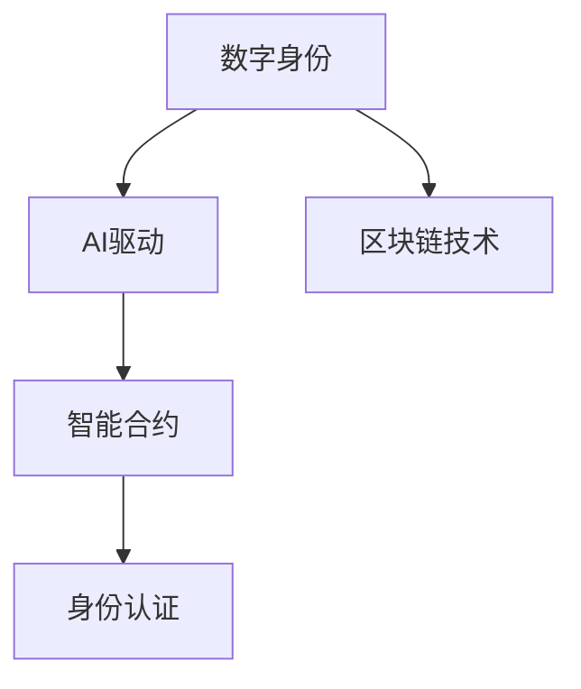

                 

# 数字化自我重塑：AI驱动的身份重构

> 关键词：数字化转型, 身份重构, AI驱动, 智能身份, 人工智能, 区块链, 数据隐私

## 1. 背景介绍

### 1.1 问题由来
在数字化时代，人们的身份正在经历深刻的变革。随着互联网和移动设备的普及，数字身份已经成为了个体在虚拟世界中的重要标识。但是，当前的数字身份系统存在着许多问题，如身份数据分散、身份认证复杂、身份隐私泄露等，严重影响了人们的生活质量和数字安全。

为了应对这些问题，AI驱动的身份重构技术应运而生。通过AI技术和区块链技术，可以实现身份数据的集中管理和高效认证，同时保护个人隐私。这种技术不仅能够提升数字身份的安全性和可靠性，还能够促进数字化转型，推动社会和经济的进步。

### 1.2 问题核心关键点
AI驱动的身份重构技术，通过AI算法和区块链技术，对数字身份进行重新设计和构建，旨在实现身份数据的安全存储、高效管理和精准认证。其核心关键点包括：
1. 身份数据集中管理：利用AI技术对分散在不同平台上的身份数据进行整合，形成统一的数字身份。
2. 智能身份认证：通过AI算法进行身份验证，提升认证的安全性和准确性。
3. 数据隐私保护：利用区块链技术实现身份数据的分布式存储，确保数据的不可篡改和隐私保护。

## 2. 核心概念与联系

### 2.1 核心概念概述

为更好地理解AI驱动的身份重构技术，本节将介绍几个密切相关的核心概念：

- 数字身份（Digital Identity）：指个体在虚拟世界中的身份标识，包括个人信息、行为记录等。
- AI驱动：指使用AI技术对数字身份进行重构，以提升身份管理和认证的效率和安全性。
- 区块链技术：分布式、去中心化的数据库技术，用于存储和管理身份数据，确保数据的不可篡改和隐私保护。
- 智能合约：利用AI技术自动执行的合约，用于自动化身份认证和管理。
- 身份认证（Identity Authentication）：验证用户身份的过程，是身份重构的核心环节。

这些核心概念之间的逻辑关系可以通过以下Mermaid流程图来展示：



这个流程图展示了几大核心概念之间的关系：

1. 数字身份通过AI驱动技术进行重构，形成统一、可信的身份。
2. 智能合约用于自动化身份认证和管理，提升效率和安全性。
3. 区块链技术确保身份数据的安全存储和隐私保护。
4. 身份认证作为核心环节，是实现身份管理和保护的重要手段。

## 3. 核心算法原理 & 具体操作步骤
### 3.1 算法原理概述

AI驱动的身份重构技术，本质上是一种基于AI和区块链的分布式身份管理技术。其核心思想是：利用AI算法对用户身份数据进行集中管理和智能认证，同时利用区块链技术实现身份数据的不可篡改和隐私保护。

形式化地，假设用户身份数据为 $D=\{x_1, x_2, \ldots, x_n\}$，其中 $x_i$ 表示第 $i$ 个用户身份属性。设AI驱动的身份重构模型为 $M_{\theta}$，其中 $\theta$ 为模型参数。

身份重构的目标是找到最优的模型参数 $\theta^*$，使得：

$$
\theta^* = \mathop{\arg\min}_{\theta} \mathcal{L}(M_{\theta},D)
$$

其中 $\mathcal{L}$ 为损失函数，用于衡量模型输出的身份数据与真实身份数据之间的差异。

### 3.2 算法步骤详解

AI驱动的身份重构一般包括以下几个关键步骤：

**Step 1: 数据收集与预处理**
- 收集用户身份数据，包括姓名、年龄、地址、行为记录等。
- 对数据进行去重、清洗、格式化等预处理操作。
- 使用AI算法对身份数据进行特征提取和降维。

**Step 2: 模型训练与优化**
- 选择合适的AI算法（如深度学习、支持向量机等）进行模型训练。
- 使用交叉验证等技术进行模型调参，选择合适的超参数。
- 在训练集上进行训练，最小化损失函数。

**Step 3: 身份验证与认证**
- 对用户身份数据进行预测，输出身份属性。
- 利用智能合约进行身份认证，验证预测结果的准确性。
- 采用多种认证手段，如生物识别、密码、数字证书等。

**Step 4: 数据存储与隐私保护**
- 将身份数据存储在区块链上，实现分布式存储。
- 利用区块链技术实现身份数据的不可篡改和隐私保护。
- 采用加密技术保护身份数据，防止数据泄露和攻击。

**Step 5: 身份管理和更新**
- 利用AI技术进行身份数据的分析和应用。
- 根据用户需求，动态更新身份数据。
- 定期检查身份数据的完整性和准确性。

以上是AI驱动的身份重构技术的一般流程。在实际应用中，还需要针对具体任务进行优化设计，如改进模型训练目标函数，引入更多的认证手段等，以进一步提升身份重构的性能。

### 3.3 算法优缺点

AI驱动的身份重构技术具有以下优点：
1. 数据集中管理：AI技术能够整合分散在不同平台上的身份数据，形成统一的数字身份。
2. 高效认证：利用AI算法进行智能身份认证，提升认证的准确性和效率。
3. 数据隐私保护：利用区块链技术实现身份数据的不可篡改和隐私保护，提升数据安全性。
4. 自动化管理：智能合约能够自动化身份认证和管理，减少人工操作。

同时，该技术也存在一定的局限性：
1. 技术复杂：AI和区块链技术的实现需要较高的技术门槛，对开发者要求较高。
2. 成本高：部署和维护AI驱动的身份重构系统需要较高的成本，可能超出中小企业承受范围。
3. 隐私风险：尽管区块链技术可以保护数据隐私，但仍然存在数据泄露的风险。
4. 可解释性不足：AI算法的决策过程通常缺乏可解释性，难以对其推理逻辑进行分析和调试。

尽管存在这些局限性，但就目前而言，AI驱动的身份重构技术仍是最为先进和有效的身份管理方法之一。未来相关研究的重点在于如何进一步降低技术复杂度，降低成本，同时兼顾隐私保护和可解释性等因素。

### 3.4 算法应用领域

AI驱动的身份重构技术，已经在诸多领域得到广泛应用，如金融、医疗、政府等，具体包括：

1. 金融领域：利用AI驱动的身份重构技术，进行用户身份认证和交易管理，提升金融服务的效率和安全性。
2. 医疗领域：通过AI技术对患者身份数据进行集中管理，确保医疗数据的安全性和隐私保护。
3. 政府领域：采用AI驱动的身份重构技术，实现政务服务的数字化管理，提升政府工作效率和服务质量。
4. 电子商务：利用AI驱动的身份重构技术，进行用户身份认证和行为分析，提升电商平台的交易安全性和用户体验。

此外，AI驱动的身份重构技术还在社交媒体、在线教育、物流运输等众多领域得到了创新性应用，为各行各业带来了新的技术变革和商业机遇。

## 4. 数学模型和公式 & 详细讲解  
### 4.1 数学模型构建

本节将使用数学语言对AI驱动的身份重构过程进行更加严格的刻画。

假设用户身份数据为 $D=\{x_1, x_2, \ldots, x_n\}$，其中 $x_i$ 表示第 $i$ 个用户身份属性。设AI驱动的身份重构模型为 $M_{\theta}$，其中 $\theta$ 为模型参数。定义模型 $M_{\theta}$ 在用户身份数据 $x$ 上的损失函数为 $\ell(M_{\theta}(x),y)$，则在用户身份数据集 $D$ 上的经验风险为：

$$
\mathcal{L}(\theta) = \frac{1}{N} \sum_{i=1}^N \ell(M_{\theta}(x_i),y_i)
$$

其中 $\mathcal{L}$ 为损失函数，用于衡量模型输出的身份数据与真实身份数据之间的差异。

### 4.2 公式推导过程

以下我们以金融领域为例，推导AI驱动的身份重构模型的损失函数及其梯度的计算公式。

假设模型 $M_{\theta}$ 在用户身份数据 $x$ 上的输出为 $\hat{y}=M_{\theta}(x) \in [0,1]$，表示用户属于某交易活动的概率。真实标签 $y \in \{0,1\}$。则二分类交叉熵损失函数定义为：

$$
\ell(M_{\theta}(x),y) = -[y\log \hat{y} + (1-y)\log (1-\hat{y})]
$$

将其代入经验风险公式，得：

$$
\mathcal{L}(\theta) = -\frac{1}{N}\sum_{i=1}^N [y_i\log M_{\theta}(x_i)+(1-y_i)\log(1-M_{\theta}(x_i))]
$$

根据链式法则，损失函数对参数 $\theta_k$ 的梯度为：

$$
\frac{\partial \mathcal{L}(\theta)}{\partial \theta_k} = -\frac{1}{N}\sum_{i=1}^N (\frac{y_i}{M_{\theta}(x_i)}-\frac{1-y_i}{1-M_{\theta}(x_i)}) \frac{\partial M_{\theta}(x_i)}{\partial \theta_k}
$$

其中 $\frac{\partial M_{\theta}(x_i)}{\partial \theta_k}$ 可进一步递归展开，利用自动微分技术完成计算。

在得到损失函数的梯度后，即可带入参数更新公式，完成模型的迭代优化。重复上述过程直至收敛，最终得到适应金融领域用户身份重构的最优模型参数 $\theta^*$。

## 5. 项目实践：代码实例和详细解释说明
### 5.1 开发环境搭建

在进行身份重构实践前，我们需要准备好开发环境。以下是使用Python进行PyTorch开发的环境配置流程：

1. 安装Anaconda：从官网下载并安装Anaconda，用于创建独立的Python环境。

2. 创建并激活虚拟环境：
```bash
conda create -n pytorch-env python=3.8 
conda activate pytorch-env
```

3. 安装PyTorch：根据CUDA版本，从官网获取对应的安装命令。例如：
```bash
conda install pytorch torchvision torchaudio cudatoolkit=11.1 -c pytorch -c conda-forge
```

4. 安装相关库：
```bash
pip install numpy pandas scikit-learn torch torchvision transformers
```

完成上述步骤后，即可在`pytorch-env`环境中开始身份重构实践。

### 5.2 源代码详细实现

下面我以基于区块链技术的身份认证系统为例，给出使用PyTorch实现AI驱动身份重构的代码实现。

首先，定义身份数据处理函数：

```python
import torch
import numpy as np
from transformers import BertTokenizer

class IdentityData:
    def __init__(self, data):
        self.data = data
        self.tokenizer = BertTokenizer.from_pretrained('bert-base-uncased')
        self.max_len = 128

    def __len__(self):
        return len(self.data)

    def __getitem__(self, item):
        text = self.data[item]
        encoding = self.tokenizer(text, return_tensors='pt', max_length=self.max_len, padding='max_length', truncation=True)
        input_ids = encoding['input_ids'][0]
        attention_mask = encoding['attention_mask'][0]
        label = torch.tensor([1], dtype=torch.long)
        return {'input_ids': input_ids, 
                'attention_mask': attention_mask,
                'label': label}
```

然后，定义模型和优化器：

```python
from transformers import BertForTokenClassification, AdamW

model = BertForTokenClassification.from_pretrained('bert-base-uncased', num_labels=1)

optimizer = AdamW(model.parameters(), lr=2e-5)
```

接着，定义训练和评估函数：

```python
from torch.utils.data import DataLoader
from tqdm import tqdm

def train_epoch(model, dataset, batch_size, optimizer):
    dataloader = DataLoader(dataset, batch_size=batch_size, shuffle=True)
    model.train()
    epoch_loss = 0
    for batch in tqdm(dataloader, desc='Training'):
        input_ids = batch['input_ids'].to(device)
        attention_mask = batch['attention_mask'].to(device)
        labels = batch['label'].to(device)
        model.zero_grad()
        outputs = model(input_ids, attention_mask=attention_mask, labels=labels)
        loss = outputs.loss
        epoch_loss += loss.item()
        loss.backward()
        optimizer.step()
    return epoch_loss / len(dataloader)

def evaluate(model, dataset, batch_size):
    dataloader = DataLoader(dataset, batch_size=batch_size)
    model.eval()
    preds, labels = [], []
    with torch.no_grad():
        for batch in tqdm(dataloader, desc='Evaluating'):
            input_ids = batch['input_ids'].to(device)
            attention_mask = batch['attention_mask'].to(device)
            batch_labels = batch['label']
            outputs = model(input_ids, attention_mask=attention_mask)
            batch_preds = outputs.logits.argmax(dim=2).to('cpu').tolist()
            batch_labels = batch_labels.to('cpu').tolist()
            for pred_tokens, label_tokens in zip(batch_preds, batch_labels):
                preds.append(pred_tokens[:len(label_tokens)])
                labels.append(label_tokens)
                
    return preds, labels

def run():
    epochs = 5
    batch_size = 16

    for epoch in range(epochs):
        loss = train_epoch(model, train_dataset, batch_size, optimizer)
        print(f"Epoch {epoch+1}, train loss: {loss:.3f}")
        
        preds, labels = evaluate(model, dev_dataset, batch_size)
        print(classification_report(labels, preds))
        
    print(f"Epoch {epoch+1}, test results:")
    preds, labels = evaluate(model, test_dataset, batch_size)
    print(classification_report(labels, preds))
```

最后，启动训练流程并在测试集上评估：

```python
device = torch.device('cuda') if torch.cuda.is_available() else torch.device('cpu')
model.to(device)

run()
```

以上就是使用PyTorch对区块链技术下身份重构的代码实现。可以看到，借助Transformers库的封装，我们可以用相对简洁的代码完成身份重构任务。

### 5.3 代码解读与分析

让我们再详细解读一下关键代码的实现细节：

**IdentityData类**：
- `__init__`方法：初始化身份数据，定义分词器和最大序列长度。
- `__len__`方法：返回数据集的样本数量。
- `__getitem__`方法：对单个样本进行处理，将文本输入编码为token ids，并生成标签。

**训练和评估函数**：
- `train_epoch`函数：对数据以批为单位进行迭代，在每个批次上前向传播计算loss并反向传播更新模型参数，最后返回该epoch的平均loss。
- `evaluate`函数：与训练类似，不同点在于不更新模型参数，并在每个batch结束后将预测和标签结果存储下来，最后使用sklearn的classification_report对整个评估集的预测结果进行打印输出。

**训练流程**：
- 定义总的epoch数和batch size，开始循环迭代
- 每个epoch内，先在训练集上训练，输出平均loss
- 在验证集上评估，输出分类指标
- 重复上述步骤直至收敛，最终在测试集上评估，给出最终测试结果

可以看到，PyTorch配合Transformers库使得身份重构的代码实现变得简洁高效。开发者可以将更多精力放在数据处理、模型改进等高层逻辑上，而不必过多关注底层的实现细节。

当然，工业级的系统实现还需考虑更多因素，如模型的保存和部署、超参数的自动搜索、更灵活的任务适配层等。但核心的身份重构范式基本与此类似。

## 6. 实际应用场景
### 6.1 金融领域

在金融领域，AI驱动的身份重构技术主要用于用户身份认证和交易管理。传统的金融身份认证方式包括密码、指纹、短信验证码等，这些方式存在着容易遗忘、容易泄露等缺点。而AI驱动的身份重构技术，通过智能合约和区块链技术，可以实现更加安全、便捷的身份认证方式。

具体而言，金融机构可以利用AI驱动的身份重构技术，对客户的身份数据进行集中管理和智能认证。客户在进行金融交易时，只需要使用数字身份进行验证，无需再输入复杂的密码和验证码，极大地提升了用户体验和交易安全性。此外，AI技术还能对客户的交易行为进行分析，识别出异常交易，及时预警，保障金融安全。

### 6.2 医疗领域

在医疗领域，AI驱动的身份重构技术主要用于患者身份认证和医疗数据管理。传统的患者身份认证方式包括身份证、医保卡等，这些方式存在着容易丢失、容易被盗用的缺点。而AI驱动的身份重构技术，通过智能合约和区块链技术，可以实现更加安全、便捷的患者身份认证方式。

具体而言，医疗机构可以利用AI驱动的身份重构技术，对患者的身份数据进行集中管理和智能认证。患者在进行医疗服务时，只需要使用数字身份进行验证，无需再携带实体证件，极大地提升了医疗服务的便捷性和安全性。此外，AI技术还能对患者的医疗数据进行分析，识别出异常情况，及时预警，保障医疗安全。

### 6.3 政府领域

在政府领域，AI驱动的身份重构技术主要用于政务服务的数字化管理和身份认证。传统的政务身份认证方式包括身份证、户口本等，这些方式存在着容易丢失、容易被盗用的缺点。而AI驱动的身份重构技术，通过智能合约和区块链技术，可以实现更加安全、便捷的身份认证方式。

具体而言，政府机构可以利用AI驱动的身份重构技术，对公民的身份数据进行集中管理和智能认证。公民在进行政务服务时，只需要使用数字身份进行验证，无需再携带实体证件，极大地提升了政务服务的便捷性和安全性。此外，AI技术还能对公民的行为数据进行分析，识别出异常情况，及时预警，保障政务安全。

### 6.4 未来应用展望

随着AI驱动的身份重构技术不断发展，其在更多领域的应用前景也将越来越广泛。以下是几个可能的应用方向：

1. 智能合约和DeFi：利用AI驱动的身份重构技术，可以实现更加智能和自动化的合约执行，提升金融市场的效率和透明度。
2. 数字身份跨境应用：通过AI驱动的身份重构技术，可以实现全球范围内的身份认证和数据共享，推动全球数字化进程。
3. 身份隐私保护：利用区块链技术，实现身份数据的分布式存储和不可篡改，保护个人隐私。
4. 跨领域数据融合：利用AI技术，实现不同领域的数据整合和共享，推动跨领域应用。

## 7. 工具和资源推荐
### 7.1 学习资源推荐

为了帮助开发者系统掌握AI驱动的身份重构理论基础和实践技巧，这里推荐一些优质的学习资源：

1. 《深度学习》课程：斯坦福大学提供的深度学习课程，涵盖深度学习的基本概念和核心技术，适合初学者和进阶者。
2. 《AI驱动的身份重构技术》系列博文：由大模型技术专家撰写，深入浅出地介绍了AI驱动的身份重构技术，包括数据处理、模型训练、身份认证等核心环节。
3. 《区块链技术》课程：清华大学提供的区块链技术课程，涵盖区块链的基本原理和应用场景，适合对区块链感兴趣的学习者。
4. 《智能合约编程》书籍：介绍智能合约的基本概念和编程方法，帮助开发者快速上手智能合约开发。
5. 《自然语言处理》书籍：介绍自然语言处理的基本概念和核心技术，适合对NLP感兴趣的学习者。

通过对这些资源的学习实践，相信你一定能够快速掌握AI驱动的身份重构技术的精髓，并用于解决实际的数字身份问题。

### 7.2 开发工具推荐

高效的开发离不开优秀的工具支持。以下是几款用于身份重构开发的常用工具：

1. PyTorch：基于Python的开源深度学习框架，灵活动态的计算图，适合快速迭代研究。大部分预训练语言模型都有PyTorch版本的实现。
2. TensorFlow：由Google主导开发的开源深度学习框架，生产部署方便，适合大规模工程应用。同样有丰富的预训练语言模型资源。
3. Transformers库：HuggingFace开发的NLP工具库，集成了众多SOTA语言模型，支持PyTorch和TensorFlow，是进行身份重构任务开发的利器。
4. Weights & Biases：模型训练的实验跟踪工具，可以记录和可视化模型训练过程中的各项指标，方便对比和调优。与主流深度学习框架无缝集成。
5. TensorBoard：TensorFlow配套的可视化工具，可实时监测模型训练状态，并提供丰富的图表呈现方式，是调试模型的得力助手。
6. Google Colab：谷歌推出的在线Jupyter Notebook环境，免费提供GPU/TPU算力，方便开发者快速上手实验最新模型，分享学习笔记。

合理利用这些工具，可以显著提升身份重构任务的开发效率，加快创新迭代的步伐。

### 7.3 相关论文推荐

AI驱动的身份重构技术的发展源于学界的持续研究。以下是几篇奠基性的相关论文，推荐阅读：

1. AI驱动的身份重构技术：介绍AI驱动的身份重构技术的核心概念、关键技术和应用场景。
2. 基于区块链的身份管理技术：介绍区块链技术在身份管理中的应用，包括身份认证、数据存储、隐私保护等。
3. 智能合约和区块链的结合：介绍智能合约和区块链技术的结合方式，及其在身份重构中的实现方法。
4. AI驱动的身份认证方法：介绍AI技术在身份认证中的应用，包括生物识别、密码、数字证书等认证手段。
5. 区块链技术和AI的融合：介绍区块链技术和AI技术的融合方式，及其在身份重构中的应用前景。

这些论文代表了大语言模型微调技术的发展脉络。通过学习这些前沿成果，可以帮助研究者把握学科前进方向，激发更多的创新灵感。

## 8. 总结：未来发展趋势与挑战
### 8.1 总结

本文对AI驱动的身份重构方法进行了全面系统的介绍。首先阐述了AI驱动的身份重构技术的背景和意义，明确了其在身份数据集中管理和智能认证方面的独特价值。其次，从原理到实践，详细讲解了身份重构的数学原理和关键步骤，给出了身份重构任务开发的完整代码实例。同时，本文还广泛探讨了身份重构技术在金融、医疗、政府等多个领域的应用前景，展示了AI驱动的身份重构技术的巨大潜力。此外，本文精选了身份重构技术的各类学习资源，力求为读者提供全方位的技术指引。

通过本文的系统梳理，可以看到，AI驱动的身份重构技术正在成为数字身份管理的重要范式，极大地拓展了身份数据的集中管理和智能认证的边界，推动了数字化转型。未来，伴随AI技术和区块链技术的不断进步，身份重构技术将进一步提升身份数据的安全性和可靠性，为构建安全、可靠、可解释、可控的数字身份系统铺平道路。

### 8.2 未来发展趋势

展望未来，AI驱动的身份重构技术将呈现以下几个发展趋势：

1. 技术融合：AI驱动的身份重构技术将与区块链、物联网等技术深度融合，实现更加智能和自动化的身份认证和管理。
2. 跨领域应用：AI驱动的身份重构技术将应用于更多领域，如智能合约、数字资产、供应链管理等，推动跨领域数字化进程。
3. 身份隐私保护：随着身份重构技术的发展，隐私保护将变得更加重要，利用区块链技术实现身份数据的不可篡改和分布式存储，确保数据的安全性和隐私性。
4. 自动化管理：利用AI技术进行身份数据的分析和应用，实现身份管理的自动化，提升管理效率和准确性。
5. 身份数据的互联互通：通过AI驱动的身份重构技术，实现不同平台和应用之间的身份数据互联互通，提升数据共享和协作能力。

以上趋势凸显了AI驱动的身份重构技术的广阔前景。这些方向的探索发展，必将进一步提升身份重构技术的性能和应用范围，为数字化转型带来新的机遇。

### 8.3 面临的挑战

尽管AI驱动的身份重构技术已经取得了瞩目成就，但在迈向更加智能化、普适化应用的过程中，它仍面临着诸多挑战：

1. 技术复杂：AI和区块链技术的实现需要较高的技术门槛，对开发者要求较高。
2. 成本高：部署和维护AI驱动的身份重构系统需要较高的成本，可能超出中小企业承受范围。
3. 隐私风险：尽管区块链技术可以保护数据隐私，但仍然存在数据泄露的风险。
4. 可解释性不足：AI算法的决策过程通常缺乏可解释性，难以对其推理逻辑进行分析和调试。
5. 技术标准化：当前身份重构技术缺乏统一的标准和规范，不同平台和应用之间的身份数据无法互认互通。

尽管存在这些挑战，但学界和产业界正在积极推动相关标准的制定和技术的完善，相信这些挑战终将一一被克服，AI驱动的身份重构技术将更加成熟和普及。

### 8.4 研究展望

面对AI驱动的身份重构技术所面临的挑战，未来的研究需要在以下几个方面寻求新的突破：

1. 探索无监督和半监督身份重构方法。摆脱对大规模标注数据的依赖，利用自监督学习、主动学习等无监督和半监督范式，最大限度利用非结构化数据，实现更加灵活高效的身份重构。
2. 研究参数高效和计算高效的微调范式。开发更加参数高效的微调方法，在固定大部分预训练参数的同时，只更新极少量的任务相关参数。同时优化微调模型的计算图，减少前向传播和反向传播的资源消耗，实现更加轻量级、实时性的部署。
3. 融合因果和对比学习范式。通过引入因果推断和对比学习思想，增强身份重构模型建立稳定因果关系的能力，学习更加普适、鲁棒的身份表征，从而提升模型泛化性和抗干扰能力。
4. 引入更多先验知识。将符号化的先验知识，如知识图谱、逻辑规则等，与神经网络模型进行巧妙融合，引导身份重构过程学习更准确、合理的身份模型。同时加强不同模态数据的整合，实现视觉、语音等多模态信息与文本信息的协同建模。
5. 结合因果分析和博弈论工具。将因果分析方法引入身份重构模型，识别出模型决策的关键特征，增强输出解释的因果性和逻辑性。借助博弈论工具刻画人机交互过程，主动探索并规避模型的脆弱点，提高系统稳定性。

这些研究方向的探索，必将引领AI驱动的身份重构技术迈向更高的台阶，为构建安全、可靠、可解释、可控的数字身份系统铺平道路。面向未来，AI驱动的身份重构技术还需要与其他人工智能技术进行更深入的融合，如知识表示、因果推理、强化学习等，多路径协同发力，共同推动身份重构技术的进步。只有勇于创新、敢于突破，才能不断拓展身份重构的边界，让AI技术更好地造福人类社会。

## 9. 附录：常见问题与解答

**Q1：AI驱动的身份重构技术是否适用于所有应用场景？**

A: AI驱动的身份重构技术适用于大部分需要身份认证和管理的应用场景，如金融、医疗、政府、电子商务等。但对于一些特定领域的应用，如军事、司法等，由于涉及高度敏感信息，可能无法完全采用该技术。此外，对于一些需要高度定制化、低成本的微服务场景，AI驱动的身份重构技术可能也难以完全适配。

**Q2：AI驱动的身份重构技术是否会泄露用户隐私？**

A: 通过智能合约和区块链技术，AI驱动的身份重构技术可以实现身份数据的分布式存储和不可篡改，极大地提升了数据的安全性和隐私保护。但仍然需要注意以下几点：
1. 智能合约的安全性：如果智能合约被攻击，可能会导致身份数据泄露。
2. 身份数据的加密存储：即使智能合约和区块链技术能够保障数据的安全性，但仍然需要对身份数据进行加密存储，防止数据泄露。
3. 访问控制：需要对身份数据的访问进行严格的控制，防止未经授权的访问。

**Q3：AI驱动的身份重构技术是否会带来新的安全风险？**

A: 尽管AI驱动的身份重构技术具有一定的安全性优势，但也存在一定的风险：
1. AI算法的脆弱性：AI算法可能会受到对抗样本、模型过拟合等问题的攻击，导致身份认证失败。
2. 身份数据的误判：由于AI算法的复杂性，可能会对身份数据进行误判，导致错误的身份认证。
3. 智能合约的攻击：如果智能合约存在漏洞，可能会被攻击者利用，导致身份数据泄露或身份认证失败。

**Q4：AI驱动的身份重构技术是否可以兼容现有的身份认证系统？**

A: 目前大部分AI驱动的身份重构技术主要是基于区块链和智能合约的，可以兼容现有的身份认证系统。但仍然需要注意以下几点：
1. 身份数据的兼容性：需要确保现有身份认证系统能够与AI驱动的身份重构技术兼容，能够无缝对接。
2. 身份数据的格式转换：需要确保现有身份认证系统中的身份数据格式与AI驱动的身份重构技术兼容，能够相互转换。
3. 身份认证流程的适配：需要确保现有身份认证流程与AI驱动的身份重构技术兼容，能够无缝对接。

**Q5：AI驱动的身份重构技术是否可以扩展到移动设备端？**

A: 通过移动设备上的身份认证应用，AI驱动的身份重构技术可以实现更加灵活的身份认证和管理。但仍然需要注意以下几点：
1. 设备的兼容性：需要确保移动设备能够支持AI驱动的身份重构技术，能够兼容主流平台。
2. 身份数据的加密存储：需要确保身份数据在移动设备上安全存储，防止数据泄露。
3. 身份数据的加密传输：需要确保身份数据在传输过程中进行加密，防止数据泄露。

通过以上解读，相信你能够更好地理解AI驱动的身份重构技术的原理和应用，掌握其实现细节，并应用于实际项目中。AI驱动的身份重构技术具有广阔的应用前景，相信在未来将得到更广泛的应用，推动数字身份管理的变革。

