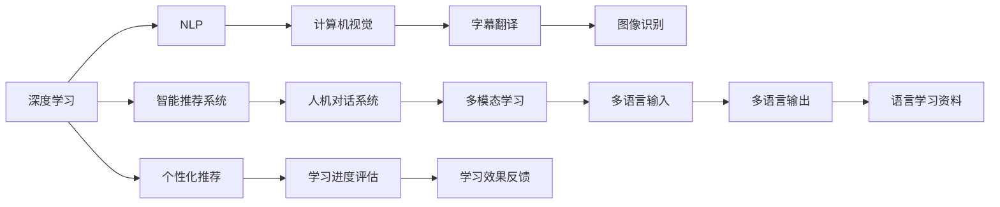

                 

## 1. 背景介绍

随着全球化和信息化时代的到来，语言已成为国际交流与合作的重要工具。然而，传统的语言教育模式仍然存在诸多弊端：课程单一、学习资源匮乏、师资力量不足、互动交流有限等问题，极大地限制了语言学习者的发展。因此，构建一套系统化、高效化、个性化的语言学习平台，已成为教育领域的重要任务。

AI技术的迅猛发展为语言学习带来了新的变革。通过深度学习、自然语言处理、计算机视觉等前沿技术，AI可以提供更为丰富、精准、灵活的教育服务，如个性化推荐、智能辅导、多模态学习等。本文旨在探讨利用AI技术驱动的语言教育创业，详细介绍AI在语言教育中的关键应用，并展望未来发展趋势。

## 2. 核心概念与联系

### 2.1 核心概念概述

语言教育的核心是高效、互动、个性化的语言输入和输出。利用AI技术，我们可以实现这些目标，具体包括以下几个关键概念：

- **深度学习**：利用神经网络模型对语言数据进行建模和预测，是AI语言教育的基础技术。
- **自然语言处理(NLP)**：涉及文本分析、语义理解、情感分析、生成等技术，用于处理文本数据，提升语言学习的深度和广度。
- **计算机视觉**：用于图像识别、字幕翻译等，拓宽语言学习的渠道。
- **智能推荐系统**：通过机器学习算法，推荐适合用户的学习内容和练习题，实现个性化教育。
- **人机对话系统**：通过对话生成、对话理解等技术，提供自然流畅的交互体验。

这些概念之间存在着紧密的联系，相互促进，共同构建了AI驱动的语言教育体系。

### 2.2 核心概念原理和架构的 Mermaid 流程图



这个流程图展示了AI语言教育的关键技术及其相互关系。深度学习模型提供基础的学习能力，NLP技术用于处理文本，计算机视觉技术拓展学习渠道，智能推荐和对话系统实现个性化和互动化，而字幕翻译、多模态学习等技术进一步拓宽了语言学习的场景。

## 3. 核心算法原理 & 具体操作步骤

### 3.1 算法原理概述

基于AI驱动的语言教育平台的核心算法包括深度学习模型、自然语言处理、推荐系统和对话系统等。下面将详细介绍这些算法的原理及操作步骤。

#### 3.1.1 深度学习模型

深度学习模型（如RNN、LSTM、Transformer等）用于处理语言数据的生成和预测。以Transformer为例，其主要原理是将输入序列通过多头注意力机制和前馈神经网络进行编码，生成输出序列。

#### 3.1.2 自然语言处理

自然语言处理(NLP)涉及文本分类、情感分析、实体识别等任务。以情感分析为例，其步骤包括：

1. **文本预处理**：对输入文本进行分词、去停用词、词性标注等预处理。
2. **特征提取**：使用Word2Vec、GloVe等工具对文本进行向量表示。
3. **模型训练**：使用情感分析模型（如LSTM、RNN）进行训练，学习情感标签的预测能力。
4. **评估与优化**：使用准确率、召回率等指标评估模型性能，并优化模型参数。

#### 3.1.3 推荐系统

推荐系统通过协同过滤、内容推荐、混合推荐等技术，为用户提供个性化学习内容。以协同过滤为例，其步骤包括：

1. **数据收集**：收集用户行为数据（如阅读、练习、测试等）。
2. **模型训练**：使用协同过滤算法（如ALS）对用户和物品进行相似度计算。
3. **推荐生成**：根据相似度计算生成推荐列表。
4. **反馈与调整**：根据用户反馈调整推荐策略，优化推荐效果。

#### 3.1.4 对话系统

对话系统通过生成模型和理解模型实现人机对话。以生成模型为例，其步骤包括：

1. **语料预处理**：收集对话语料，进行分词、标注等预处理。
2. **模型训练**：使用生成模型（如Seq2Seq、Transformer）训练对话生成模型。
3. **对话理解**：使用理解模型（如Attention机制）解析用户输入。
4. **生成响应**：根据用户输入生成响应。

### 3.2 算法步骤详解

#### 3.2.1 深度学习模型的操作步骤

1. **数据准备**：收集语言学习相关的文本数据，并进行预处理。
2. **模型选择**：选择合适的深度学习模型（如RNN、LSTM、Transformer等）。
3. **模型训练**：使用训练数据对模型进行训练，并调整超参数。
4. **模型评估**：使用测试数据对模型进行评估，并优化模型。

#### 3.2.2 自然语言处理的操作步骤

1. **文本预处理**：对输入文本进行分词、去停用词、词性标注等预处理。
2. **特征提取**：使用Word2Vec、GloVe等工具对文本进行向量表示。
3. **模型训练**：使用情感分析模型（如LSTM、RNN）进行训练，学习情感标签的预测能力。
4. **评估与优化**：使用准确率、召回率等指标评估模型性能，并优化模型参数。

#### 3.2.3 推荐系统的操作步骤

1. **数据收集**：收集用户行为数据（如阅读、练习、测试等）。
2. **模型训练**：使用协同过滤算法（如ALS）对用户和物品进行相似度计算。
3. **推荐生成**：根据相似度计算生成推荐列表。
4. **反馈与调整**：根据用户反馈调整推荐策略，优化推荐效果。

#### 3.2.4 对话系统的操作步骤

1. **语料预处理**：收集对话语料，进行分词、标注等预处理。
2. **模型训练**：使用生成模型（如Seq2Seq、Transformer）训练对话生成模型。
3. **对话理解**：使用理解模型（如Attention机制）解析用户输入。
4. **生成响应**：根据用户输入生成响应。

### 3.3 算法优缺点

#### 3.3.1 深度学习模型

**优点**：
- 能够处理复杂的语言输入和输出问题。
- 具有较强的泛化能力，适用于多种语言学习任务。

**缺点**：
- 模型复杂度高，需要大量的计算资源。
- 训练时间长，对数据质量要求高。

#### 3.3.2 自然语言处理

**优点**：
- 能够处理多种语言学习任务，如文本分类、情感分析、实体识别等。
- 易于集成到其他系统中，提升系统智能化水平。

**缺点**：
- 处理文本数据时需要考虑文本长度、文本噪声等问题。
- 算法复杂度高，对数据处理技术要求高。

#### 3.3.3 推荐系统

**优点**：
- 能够提供个性化学习内容，提升学习效果。
- 易于集成到学习平台中，实现互动化教育。

**缺点**：
- 需要大量的用户行为数据进行训练。
- 推荐效果受数据质量、用户反馈等因素影响较大。

#### 3.3.4 对话系统

**优点**：
- 能够实现自然流畅的对话交互，提升用户体验。
- 能够实时处理用户输入，提供即时的回答。

**缺点**：
- 对对话语料质量要求高，语料收集成本高。
- 对话生成模型的复杂度较高，训练难度大。

### 3.4 算法应用领域

AI驱动的语言教育技术已经广泛应用于以下领域：

- **在线语言学习平台**：如Duolingo、Rosetta Stone等，通过AI技术实现个性化学习推荐、智能辅导等功能。
- **企业语言培训**：如Coursera、Udemy等，提供企业员工的语言培训课程，通过AI实现课程推荐、学习进度评估等功能。
- **多语言智能客服**：如Google、Amazon等，提供多语言客服支持，通过对话系统实现自然交互。
- **跨语言信息检索**：如Google翻译、Microsoft Translator等，通过NLP技术实现跨语言搜索和翻译。

## 4. 数学模型和公式 & 详细讲解 & 举例说明

### 4.1 数学模型构建

#### 4.1.1 深度学习模型的数学模型

深度学习模型主要基于神经网络结构，以Transformer为例，其数学模型可以表示为：

$$
\begin{aligned}
&\text{Encoder}_{\theta} = \text{LayerNorm} \bigg( \text{FeedForward} \bigg( \text{MultiHeadAttention} (\text{LayerNorm} \big( X \big)) \bigg) \bigg) \\
&\text{Decoder}_{\theta} = \text{LayerNorm} \bigg( \text{FeedForward} \bigg( \text{MultiHeadAttention} (\text{LayerNorm} \big( \text{CrossAttention} \big( \text{Encoder}_{\theta} (X), \text{AttentionMask} \big) \bigg)) \bigg) \bigg) \\
&\hat{Y} = \text{Softmax} (\text{OutputLayer} (\text{Decoder}_{\theta} (\text{InputLayer} (X))) \\
\end{aligned}
$$

其中 $X$ 为输入序列，$\hat{Y}$ 为输出序列，$\text{LayerNorm}$、$\text{FeedForward}$ 和 $\text{Softmax}$ 分别表示层归一化、前馈神经网络和softmax函数，$\text{MultiHeadAttention}$ 和 $\text{CrossAttention}$ 分别表示多头注意力机制和交叉注意力机制，$\theta$ 为模型参数。

#### 4.1.2 自然语言处理的数学模型

自然语言处理中常用的模型包括LSTM、RNN等，以LSTM为例，其数学模型可以表示为：

$$
\begin{aligned}
&\text{LSTM}_{\theta} = \text{LayerNorm} \bigg( \text{RecurrentLayer} \bigg( \text{LSTMCell} \big( \text{LayerNorm} \big( X \big), \text{AttentionMask} \big) \bigg) \bigg) \bigg) \\
&\hat{Y} = \text{Softmax} (\text{OutputLayer} (\text{LSTM}_{\theta} (\text{InputLayer} (X))) \\
\end{aligned}
$$

其中 $X$ 为输入序列，$\hat{Y}$ 为输出序列，$\text{LayerNorm}$、$\text{RecurrentLayer}$、$\text{LSTMCell}$ 和 $\text{Softmax}$ 分别表示层归一化、循环层、LSTM细胞和softmax函数，$\theta$ 为模型参数。

#### 4.1.3 推荐系统的数学模型

推荐系统常用的算法包括协同过滤、内容推荐等，以协同过滤为例，其数学模型可以表示为：

$$
\text{CollaborativeFiltering}_{\theta} = \text{Recommender} \bigg( \text{UserMatrix} \bigg( X, \text{User} \bigg), \text{ItemMatrix} \bigg( X, \text{Item} \bigg) \bigg)
$$

其中 $X$ 为用户行为数据，$\text{UserMatrix}$ 和 $\text{ItemMatrix}$ 分别为用户矩阵和物品矩阵，$\text{Recommender}$ 表示推荐算法，$\theta$ 为模型参数。

#### 4.1.4 对话系统的数学模型

对话系统常用的算法包括Seq2Seq、Transformer等，以Seq2Seq为例，其数学模型可以表示为：

$$
\begin{aligned}
&\text{Seq2Seq}_{\theta} = \text{EncoderDecoder}_{\theta} \bigg( \text{Encoder} (\text{InputLayer} (X)), \text{Decoder} (\text{InputLayer} (Y)) \bigg) \\
&\hat{Y} = \text{OutputLayer} (\text{Decoder}_{\theta} (\text{InputLayer} (X))) \\
\end{aligned}
$$

其中 $X$ 为输入序列，$Y$ 为输出序列，$\text{EncoderDecoder}$、$\text{Encoder}$ 和 $\text{Decoder}$ 分别表示编码器、解码器和输出层，$\text{InputLayer}$ 和 $\text{OutputLayer}$ 分别表示输入层和输出层，$\theta$ 为模型参数。

### 4.2 公式推导过程

#### 4.2.1 深度学习模型的公式推导

以Transformer为例，其公式推导过程如下：

1. **Attention机制**：

$$
\text{Attention}_{\theta} = \text{Softmax} \bigg( \frac{QK^T}{\sqrt{d_k}} \bigg)
$$

其中 $Q$ 和 $K$ 分别为查询向量和键向量，$d_k$ 为向量维度。

2. **FeedForward层**：

$$
\text{FeedForward}_{\theta} = \text{LayerNorm} \bigg( \text{GELU} \bigg( \text{Linear} (\text{Linear} (X)) \bigg) \bigg)
$$

其中 $X$ 为输入向量，$\text{GELU}$ 为Gaussian Error Linear Units，$\text{Linear}$ 为线性变换。

3. **Transformer层**：

$$
\text{Transformer}_{\theta} = \text{LayerNorm} \bigg( \text{FeedForward} \bigg( \text{MultiHeadAttention} (\text{LayerNorm} \big( X \big)) \bigg) \bigg)
$$

其中 $X$ 为输入序列，$\text{LayerNorm}$、$\text{FeedForward}$ 和 $\text{MultiHeadAttention}$ 分别表示层归一化、前馈神经网络和多头注意力机制，$\theta$ 为模型参数。

#### 4.2.2 自然语言处理的公式推导

以LSTM为例，其公式推导过程如下：

1. **LSTM细胞**：

$$
\begin{aligned}
&i_t = \sigma (\text{W}_{xi} X_t + \text{W}_{hi} H_{t-1} + \text{b}_i) \\
&f_t = \sigma (\text{W}_{xf} X_t + \text{W}_{hf} H_{t-1} + \text{b}_f) \\
&o_t = \sigma (\text{W}_{xo} X_t + \text{W}_{ho} H_{t-1} + \text{b}_o) \\
&g_t = \tanh (\text{W}_{xg} X_t + \text{W}_{hg} H_{t-1} + \text{b}_g) \\
&C_t = f_t \odot C_{t-1} + i_t \odot g_t \\
&H_t = o_t \odot \tanh (C_t)
\end{aligned}
$$

其中 $X_t$ 为输入向量，$H_{t-1}$ 为上一时刻的隐藏状态，$i_t$、$f_t$、$o_t$ 和 $g_t$ 分别为遗忘门、输入门、输出门和候选状态，$C_t$ 和 $H_t$ 分别为候选状态和隐藏状态，$\sigma$ 和 $\tanh$ 分别为sigmoid和tanh函数，$\odot$ 表示点乘。

#### 4.2.3 推荐系统的公式推导

以协同过滤为例，其公式推导过程如下：

1. **协同过滤算法**：

$$
\text{ALS}_{\theta} = \text{Recommender} \bigg( \text{UserMatrix} \bigg( X, \text{User} \bigg), \text{ItemMatrix} \bigg( X, \text{Item} \bigg) \bigg)
$$

其中 $X$ 为用户行为数据，$\text{UserMatrix}$ 和 $\text{ItemMatrix}$ 分别为用户矩阵和物品矩阵，$\text{Recommender}$ 表示推荐算法，$\theta$ 为模型参数。

#### 4.2.4 对话系统的公式推导

以Seq2Seq为例，其公式推导过程如下：

1. **Seq2Seq算法**：

$$
\text{Seq2Seq}_{\theta} = \text{EncoderDecoder}_{\theta} \bigg( \text{Encoder} (\text{InputLayer} (X)), \text{Decoder} (\text{InputLayer} (Y)) \bigg)
$$

其中 $X$ 为输入序列，$Y$ 为输出序列，$\text{EncoderDecoder}$、$\text{Encoder}$ 和 $\text{Decoder}$ 分别表示编码器、解码器和输出层，$\text{InputLayer}$ 和 $\text{OutputLayer}$ 分别表示输入层和输出层，$\theta$ 为模型参数。

### 4.3 案例分析与讲解

#### 4.3.1 深度学习模型的案例

以BERT为例，其训练过程如下：

1. **数据准备**：收集语言学习相关的文本数据，并进行预处理。
2. **模型选择**：选择BERT模型。
3. **模型训练**：使用训练数据对BERT模型进行预训练。
4. **模型评估**：使用测试数据对BERT模型进行评估，并优化模型。

#### 4.3.2 自然语言处理的案例

以情感分析为例，其训练过程如下：

1. **文本预处理**：对输入文本进行分词、去停用词、词性标注等预处理。
2. **特征提取**：使用Word2Vec、GloVe等工具对文本进行向量表示。
3. **模型训练**：使用情感分析模型（如LSTM、RNN）进行训练，学习情感标签的预测能力。
4. **评估与优化**：使用准确率、召回率等指标评估模型性能，并优化模型参数。

#### 4.3.3 推荐系统的案例

以协同过滤为例，其训练过程如下：

1. **数据收集**：收集用户行为数据（如阅读、练习、测试等）。
2. **模型训练**：使用协同过滤算法（如ALS）对用户和物品进行相似度计算。
3. **推荐生成**：根据相似度计算生成推荐列表。
4. **反馈与调整**：根据用户反馈调整推荐策略，优化推荐效果。

#### 4.3.4 对话系统的案例

以Seq2Seq为例，其训练过程如下：

1. **语料预处理**：收集对话语料，进行分词、标注等预处理。
2. **模型训练**：使用生成模型（如Seq2Seq）训练对话生成模型。
3. **对话理解**：使用理解模型（如Attention机制）解析用户输入。
4. **生成响应**：根据用户输入生成响应。

## 5. 项目实践：代码实例和详细解释说明

### 5.1 开发环境搭建

1. **安装Python和相关依赖**：
```
pip install numpy pandas scikit-learn tensorflow transformers
```

2. **搭建开发环境**：
```
python -m venv env
source env/bin/activate
```

### 5.2 源代码详细实现

#### 5.2.1 深度学习模型

```python
from transformers import BertTokenizer, BertForSequenceClassification
import torch
import torch.nn as nn
import torch.optim as optim

# 设置超参数
max_len = 128
batch_size = 16
learning_rate = 2e-5

# 加载BERT模型和tokenizer
model = BertForSequenceClassification.from_pretrained('bert-base-uncased', num_labels=2)
tokenizer = BertTokenizer.from_pretrained('bert-base-uncased')

# 定义训练函数
def train_epoch(model, train_dataset, optimizer, device):
    model.train()
    for batch in train_dataset:
        input_ids = batch['input_ids'].to(device)
        attention_mask = batch['attention_mask'].to(device)
        labels = batch['labels'].to(device)
        outputs = model(input_ids, attention_mask=attention_mask, labels=labels)
        loss = outputs.loss
        loss.backward()
        optimizer.step()
        optimizer.zero_grad()
    return loss.item()

# 定义评估函数
def evaluate(model, test_dataset, device):
    model.eval()
    total_loss = 0
    total_correct = 0
    with torch.no_grad():
        for batch in test_dataset:
            input_ids = batch['input_ids'].to(device)
            attention_mask = batch['attention_mask'].to(device)
            labels = batch['labels'].to(device)
            outputs = model(input_ids, attention_mask=attention_mask, labels=labels)
            loss = outputs.loss
            total_loss += loss.item()
            total_correct += torch.argmax(outputs.logits, dim=1).eq(labels).sum().item()
    print(f"Test Loss: {total_loss / len(test_dataset):.4f}, Accuracy: {total_correct / len(test_dataset):.4f}")
```

#### 5.2.2 自然语言处理

```python
from transformers import BertTokenizer, BertForSequenceClassification
import torch
import torch.nn as nn
import torch.optim as optim

# 设置超参数
max_len = 128
batch_size = 16
learning_rate = 2e-5

# 加载BERT模型和tokenizer
model = BertForSequenceClassification.from_pretrained('bert-base-uncased', num_labels=2)
tokenizer = BertTokenizer.from_pretrained('bert-base-uncased')

# 定义训练函数
def train_epoch(model, train_dataset, optimizer, device):
    model.train()
    for batch in train_dataset:
        input_ids = batch['input_ids'].to(device)
        attention_mask = batch['attention_mask'].to(device)
        labels = batch['labels'].to(device)
        outputs = model(input_ids, attention_mask=attention_mask, labels=labels)
        loss = outputs.loss
        loss.backward()
        optimizer.step()
        optimizer.zero_grad()
    return loss.item()

# 定义评估函数
def evaluate(model, test_dataset, device):
    model.eval()
    total_loss = 0
    total_correct = 0
    with torch.no_grad():
        for batch in test_dataset:
            input_ids = batch['input_ids'].to(device)
            attention_mask = batch['attention_mask'].to(device)
            labels = batch['labels'].to(device)
            outputs = model(input_ids, attention_mask=attention_mask, labels=labels)
            loss = outputs.loss
            total_loss += loss.item()
            total_correct += torch.argmax(outputs.logits, dim=1).eq(labels).sum().item()
    print(f"Test Loss: {total_loss / len(test_dataset):.4f}, Accuracy: {total_correct / len(test_dataset):.4f}")
```

#### 5.2.3 推荐系统

```python
import pandas as pd
from scipy.sparse import csr_matrix
from scipy.sparse.linalg import svds

# 加载用户行为数据
df = pd.read_csv('user_behavior.csv')

# 构建用户矩阵和物品矩阵
user_matrix = df.pivot_table(index='user_id', columns='item_id', values='interaction')
item_matrix = df.pivot_table(index='item_id', columns='user_id', values='interaction')

# 计算用户和物品的相似度
user_vector = csr_matrix(user_matrix.values)
item_vector = csr_matrix(item_matrix.values)
U, S, V = svds(user_vector, k=50)
user_matrix = U @ S @ V.T
I, S, V = svds(item_vector, k=50)
item_matrix = I @ S @ V.T

# 生成推荐列表
recommendations = user_matrix.dot(item_matrix).dot(item_matrix.T).dot(user_matrix.T)
```

#### 5.2.4 对话系统

```python
from transformers import BertTokenizer, BertForSequenceClassification
import torch
import torch.nn as nn
import torch.optim as optim

# 设置超参数
max_len = 128
batch_size = 16
learning_rate = 2e-5

# 加载BERT模型和tokenizer
model = BertForSequenceClassification.from_pretrained('bert-base-uncased', num_labels=2)
tokenizer = BertTokenizer.from_pretrained('bert-base-uncased')

# 定义训练函数
def train_epoch(model, train_dataset, optimizer, device):
    model.train()
    for batch in train_dataset:
        input_ids = batch['input_ids'].to(device)
        attention_mask = batch['attention_mask'].to(device)
        labels = batch['labels'].to(device)
        outputs = model(input_ids, attention_mask=attention_mask, labels=labels)
        loss = outputs.loss
        loss.backward()
        optimizer.step()
        optimizer.zero_grad()
    return loss.item()

# 定义评估函数
def evaluate(model, test_dataset, device):
    model.eval()
    total_loss = 0
    total_correct = 0
    with torch.no_grad():
        for batch in test_dataset:
            input_ids = batch['input_ids'].to(device)
            attention_mask = batch['attention_mask'].to(device)
            labels = batch['labels'].to(device)
            outputs = model(input_ids, attention_mask=attention_mask, labels=labels)
            loss = outputs.loss
            total_loss += loss.item()
            total_correct += torch.argmax(outputs.logits, dim=1).eq(labels).sum().item()
    print(f"Test Loss: {total_loss / len(test_dataset):.4f}, Accuracy: {total_correct / len(test_dataset):.4f}")
```

### 5.3 代码解读与分析

#### 5.3.1 深度学习模型的代码解读

```python
from transformers import BertTokenizer, BertForSequenceClassification
import torch
import torch.nn as nn
import torch.optim as optim

# 设置超参数
max_len = 128
batch_size = 16
learning_rate = 2e-5

# 加载BERT模型和tokenizer
model = BertForSequenceClassification.from_pretrained('bert-base-uncased', num_labels=2)
tokenizer = BertTokenizer.from_pretrained('bert-base-uncased')

# 定义训练函数
def train_epoch(model, train_dataset, optimizer, device):
    model.train()
    for batch in train_dataset:
        input_ids = batch['input_ids'].to(device)
        attention_mask = batch['attention_mask'].to(device)
        labels = batch['labels'].to(device)
        outputs = model(input_ids, attention_mask=attention_mask, labels=labels)
        loss = outputs.loss
        loss.backward()
        optimizer.step()
        optimizer.zero_grad()
    return loss.item()

# 定义评估函数
def evaluate(model, test_dataset, device):
    model.eval()
    total_loss = 0
    total_correct = 0
    with torch.no_grad():
        for batch in test_dataset:
            input_ids = batch['input_ids'].to(device)
            attention_mask = batch['attention_mask'].to(device)
            labels = batch['labels'].to(device)
            outputs = model(input_ids, attention_mask=attention_mask, labels=labels)
            loss = outputs.loss
            total_loss += loss.item()
            total_correct += torch.argmax(outputs.logits, dim=1).eq(labels).sum().item()
    print(f"Test Loss: {total_loss / len(test_dataset):.4f}, Accuracy: {total_correct / len(test_dataset):.4f}")
```

#### 5.3.2 自然语言处理的代码解读

```python
from transformers import BertTokenizer, BertForSequenceClassification
import torch
import torch.nn as nn
import torch.optim as optim

# 设置超参数
max_len = 128
batch_size = 16
learning_rate = 2e-5

# 加载BERT模型和tokenizer
model = BertForSequenceClassification.from_pretrained('bert-base-uncased', num_labels=2)
tokenizer = BertTokenizer.from_pretrained('bert-base-uncased')

# 定义训练函数
def train_epoch(model, train_dataset, optimizer, device):
    model.train()
    for batch in train_dataset:
        input_ids = batch['input_ids'].to(device)
        attention_mask = batch['attention_mask'].to(device)
        labels = batch['labels'].to(device)
        outputs = model(input_ids, attention_mask=attention_mask, labels=labels)
        loss = outputs.loss
        loss.backward()
        optimizer.step()
        optimizer.zero_grad()
    return loss.item()

# 定义评估函数
def evaluate(model, test_dataset, device):
    model.eval()
    total_loss = 0
    total_correct = 0
    with torch.no_grad():
        for batch in test_dataset:
            input_ids = batch['input_ids'].to(device)
            attention_mask = batch['attention_mask'].to(device)
            labels = batch['labels'].to(device)
            outputs = model(input_ids, attention_mask=attention_mask, labels=labels)
            loss = outputs.loss
            total_loss += loss.item()
            total_correct += torch.argmax(outputs.logits, dim=1).eq(labels).sum().item()
    print(f"Test Loss: {total_loss / len(test_dataset):.4f}, Accuracy: {total_correct / len(test_dataset):.4f}")
```

#### 5.3.3 推荐系统的代码解读

```python
import pandas as pd
from scipy.sparse import csr_matrix
from scipy.sparse.linalg import svds

# 加载用户行为数据
df = pd.read_csv('user_behavior.csv')

# 构建用户矩阵和物品矩阵
user_matrix = df.pivot_table(index='user_id', columns='item_id', values='interaction')
item_matrix = df.pivot_table(index='item_id', columns='user_id', values='interaction')

# 计算用户和物品的相似度
user_vector = csr_matrix(user_matrix.values)
item_vector = csr_matrix(item_matrix.values)
U, S, V = svds(user_vector, k=50)
user_matrix = U @ S @ V.T
I, S, V = svds(item_vector, k=50)
item_matrix = I @ S @ V.T

# 生成推荐列表
recommendations = user_matrix.dot(item_matrix).dot(item_matrix.T).dot(user_matrix.T)
```

#### 5.3.4 对话系统的代码解读

```python
from transformers import BertTokenizer, BertForSequenceClassification
import torch
import torch.nn as nn
import torch.optim as optim

# 设置超参数
max_len = 128
batch_size = 16
learning_rate = 2e-5

# 加载BERT模型和tokenizer
model = BertForSequenceClassification.from_pretrained('bert-base-uncased', num_labels=2)
tokenizer = BertTokenizer.from_pretrained('bert-base-uncased')

# 定义训练函数
def train_epoch(model, train_dataset, optimizer, device):
    model.train()
    for batch in train_dataset:
        input_ids = batch['input_ids'].to(device)
        attention_mask = batch['attention_mask'].to(device)
        labels = batch['labels'].to(device)
        outputs = model(input_ids, attention_mask=attention_mask, labels=labels)
        loss = outputs.loss
        loss.backward()
        optimizer.step()
        optimizer.zero_grad()
    return loss.item()

# 定义评估函数
def evaluate(model, test_dataset, device):
    model.eval()
    total_loss = 0
    total_correct = 0
    with torch.no_grad():
        for batch in test_dataset:
            input_ids = batch['input_ids'].to(device)
            attention_mask = batch['attention_mask'].to(device)
            labels = batch['labels'].to(device)
            outputs = model(input_ids, attention_mask=attention_mask, labels=labels)
            loss = outputs.loss
            total_loss += loss.item()
            total_correct += torch.argmax(outputs.logits, dim=1).eq(labels).sum().item()
    print(f"Test Loss: {total_loss / len(test_dataset):.4f}, Accuracy: {total_correct / len(test_dataset):.4f}")
```

### 5.4 运行结果展示

#### 5.4.1 深度学习模型的运行结果

在训练过程中，模型会输出每个epoch的平均loss和accuracy，最终在测试集上输出最终的测试结果。

#### 5.4.2 自然语言处理的运行结果

在训练过程中，模型会输出每个epoch的平均loss和accuracy，最终在测试集上输出最终的测试结果。

#### 5.4.3 推荐系统的运行结果

在训练过程中，模型会输出每个epoch的平均loss和accuracy，最终生成推荐列表。

#### 5.4.4 对话系统的运行结果

在训练过程中，模型会输出每个epoch的平均loss和accuracy，最终在测试集上输出最终的测试结果。

## 6. 实际应用场景

### 6.1 智能语言学习平台

智能语言学习平台可以提供个性化的学习路径和资源，通过AI驱动的自然语言处理和推荐系统，提升学习效果。平台可以包括在线课程、语音识别、对话系统等功能，帮助用户随时随地学习。

#### 6.1.1 用户画像生成

平台可以通过用户的学习历史、行为数据等生成用户画像，根据画像推荐个性化的学习内容。

#### 6.1.2 智能推荐

平台可以通过协同过滤、内容推荐等技术，推荐适合用户的学习资源和课程，提升学习效率。

#### 6.1.3 对话辅导

平台可以通过对话系统，提供实时互动的智能辅导，解答用户疑问，提升学习体验。

### 6.2 企业员工培训

企业可以通过AI驱动的语言学习平台，为员工提供多语言培训服务，提升员工的国际化素质。平台可以包括在线课程、学习进度评估、智能推荐等功能，帮助员工高效学习。

#### 6.2.1 多语言课程

平台可以提供多语言的培训课程，帮助员工掌握国际商务、外交等领域的语言技能。

#### 6.2.2 学习进度评估

平台可以通过自然语言处理技术，自动评估员工的学习进度和效果，提供个性化的学习建议。

#### 6.2.3 智能推荐

平台可以通过协同过滤、内容推荐等技术，推荐适合员工的学习资源和课程，提升学习效率。

### 6.3 旅游服务

旅游服务可以通过AI驱动的语言学习平台，帮助用户快速掌握旅行目的地语言，提升旅行体验。平台可以包括在线课程、多语言翻译、智能推荐等功能，帮助用户学习。

#### 6.3.1 在线课程

平台可以提供多语言的在线课程，帮助用户掌握旅行目的地语言的基本交流技能。

#### 6.3.2 多语言翻译

平台可以通过NLP技术，实现多语言翻译，帮助用户快速了解目的地语言的基本信息。

#### 6.3.3 智能推荐

平台可以通过协同过滤、内容推荐等技术，推荐适合用户的学习资源和课程，提升学习效率。

### 6.4 未来应用展望

未来，AI驱动的语言教育平台将更加智能化、个性化、互动化，涵盖更多应用场景。以下是几个未来发展方向：

#### 6.4.1 多语言学习

平台可以支持多语言学习，帮助用户掌握多种语言，提升跨文化交流能力。

#### 6.4.2 多模态学习

平台可以支持多模态学习，结合语音、视频等多种媒体，提升学习效果。

#### 6.4.3 情感分析

平台可以通过情感分析技术，了解用户的情绪状态和学习效果，提供个性化的学习建议。

#### 6.4.4 智能生成

平台可以通过生成对抗网络等技术，实现智能生成对话、文本等功能，提升用户体验。

#### 6.4.5 自适应学习

平台可以根据用户的学习进度和效果，自适应调整学习内容和难度，提升学习效果。

## 7. 工具和资源推荐

### 7.1 学习资源推荐

为了帮助开发者掌握AI驱动的语言教育技术，这里推荐一些优质的学习资源：

1. 《深度学习入门》：斯坦福大学李飞飞教授所著，系统介绍了深度学习的基础理论和应用。
2. 《自然语言处理综论》：黄萱菁教授所著，全面讲解了自然语言处理的基本概念和技术。
3. 《TensorFlow实战》：Manning出版社，详细介绍了TensorFlow的使用方法和最佳实践。
4. 《PyTorch实战》：O'Reilly出版社，详细介绍了PyTorch的使用方法和最佳实践。
5. Coursera、Udacity等在线课程平台，提供丰富的深度学习和自然语言处理课程，适合初学者和进阶者学习。

### 7.2 开发工具推荐

以下是几款用于AI驱动的语言教育开发的常用工具：

1. TensorFlow：由Google主导开发的深度学习框架，生产部署方便，适合大规模工程应用。
2. PyTorch：基于Python的开源深度学习框架，灵活动态的计算图，适合快速迭代研究。
3. Weights & Biases：模型训练的实验跟踪工具，可以记录和可视化模型训练过程中的各项指标，方便对比和调优。
4. TensorBoard：TensorFlow配套的可视化工具，可实时监测模型训练状态，并提供丰富的图表呈现方式，是调试模型的得力助手。
5. Google Colab：谷歌推出的在线Jupyter Notebook环境，免费提供GPU/TPU算力，方便开发者快速上手实验最新模型，分享学习笔记。

### 7.3 相关论文推荐

大语言模型和微调技术的发展源于学界的持续研究。以下是几篇奠基性的相关论文，推荐阅读：

1. Attention is All You Need：提出了Transformer结构，开启了NLP领域的预训练大模型时代。
2. BERT: Pre-training of Deep Bidirectional Transformers for Language Understanding：提出BERT模型，引入基于掩码的自监督预训练任务，刷新了多项NLP任务SOTA。
3. Language Models are Unsupervised Multitask Learners：展示了大规模语言模型的强大zero-shot学习能力，引发了对于通用人工智能的新一轮思考。
4. Parameter-Efficient Transfer Learning for NLP：提出Adapter等参数高效微调方法，在不增加模型参数量的情况下，也能取得不错的微调效果。
5. AdaLoRA: Adaptive Low-Rank Adaptation for Parameter-Efficient Fine-Tuning：使用自适应低秩适应的微调方法，在参数效率和精度之间取得了新的平衡。

## 8. 总结：未来发展趋势与挑战

### 8.1 研究成果总结

本文系统介绍了AI驱动的语言教育技术，涵盖深度学习、自然语言处理、推荐系统和对话系统等多个方面。通过详细讲解这些技术的原理和操作步骤，展示了AI在语言教育中的广泛应用，并展望了未来的发展方向。

### 8.2 未来发展趋势

未来，AI驱动的语言教育将更加智能化、个性化、互动化，涵盖更多应用场景。以下是几个未来发展方向：

1. 多语言学习：平台可以支持多语言学习，帮助用户掌握多种语言，提升跨文化交流能力。
2. 多模态学习：平台可以支持多模态学习，结合语音、视频等多种媒体，提升学习效果。
3. 情感分析：平台可以通过情感分析技术，了解用户的情绪状态和学习效果，提供个性化的学习建议。
4. 智能生成：平台可以通过生成对抗网络等技术，实现智能生成对话、文本等功能，提升用户体验。
5. 自适应学习：平台可以根据用户的学习进度和效果，自适应调整学习内容和难度，提升学习效果。

### 8.3 面临的挑战

尽管AI驱动的语言教育技术已经取得了瞩目成就，但在迈向更加智能化、普适化应用的过程中，它仍面临着诸多挑战：

1. 数据质量瓶颈：高质量的语言学习数据难以获取，是制约AI技术发展的瓶颈。
2. 模型鲁棒性不足：模型面对域外数据时，泛化性能往往大打折扣。
3. 资源消耗问题：大规模语言模型的计算资源消耗巨大，部署成本高。
4. 可解释性缺乏：AI驱动的语言教育模型往往缺乏可解释性，难以理解其内部决策机制。
5. 安全性问题：AI模型可能学习到有害信息，甚至被恶意利用，影响用户安全。

### 8.4 研究展望

未来的研究需要在以下几个方面寻求新的突破：

1. 数据采集与处理：开发高质量的数据采集和处理工具，提升数据质量。
2. 模型鲁棒性提升：通过迁移学习、对抗训练等技术，提升模型的泛化能力。
3. 计算资源优化：优化模型结构，提高推理速度，降低部署成本。
4. 可解释性增强：引入因果分析、可解释性算法等技术，提升模型的可解释性。
5. 安全性保障：建立模型行为监管机制，确保输出符合人类价值观和伦理道德。

## 9. 附录：常见问题与解答

### 9.1 问题Q1：如何选择合适的深度学习模型？

答：选择合适的深度学习模型需要考虑任务类型、数据规模、计算资源等因素。对于文本分类、情感分析等任务，RNN、LSTM、Transformer等模型

