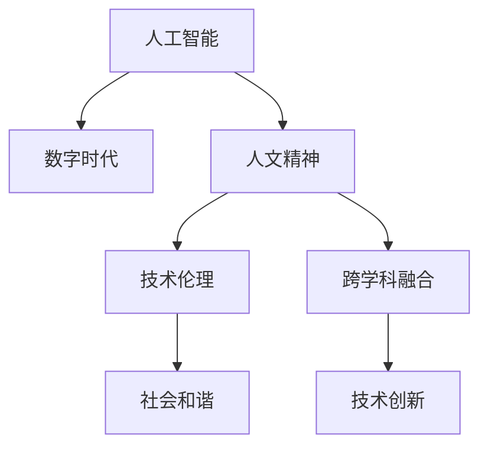

                 

# 数字时代的人文精神的传承

> 关键词：数字时代, 人工智能, 人文精神, 技术伦理, 跨学科融合

## 1. 背景介绍

### 1.1 问题由来
在飞速发展的数字时代，人工智能（AI）技术的迅猛进步正在重塑人类的生产生活方式。AI的广泛应用不仅促进了效率的提升和经济的繁荣，也深刻影响着社会的各个层面。然而，在享受AI带来的便捷和效率的同时，我们不禁思考：如何在数字化浪潮中保持人类的核心价值与精神追求？这不仅关乎技术的健康发展，更关系到社会的和谐稳定。

### 1.2 问题核心关键点
人工智能与人类人文精神之间的关系，成为数字时代的重要议题。AI技术在提升效率的同时，是否能承载人类的情感、伦理、价值观？如何在算法中融入人文精神，确保技术发展与人文价值的共生共荣？

### 1.3 问题研究意义
研究AI与人类精神文明的传承，对于指导人工智能技术的健康发展，维护社会稳定和谐，具有重要的理论意义和现实价值。本文旨在探讨如何在数字时代中，通过技术的力量，更好地传承和弘扬人类的核心价值和精神追求，实现技术与伦理的深度融合。

## 2. 核心概念与联系

### 2.1 核心概念概述

为更好地理解人工智能与人类人文精神的传承，本节将介绍几个密切相关的核心概念：

- **人工智能（Artificial Intelligence, AI）**：指通过算法和计算技术，使计算机具备类似于人的智能行为，包括感知、学习、推理、决策等。
- **数字时代（Digital Age）**：指以互联网和信息技术为核心的新时代，数据和计算成为社会进步的新动力。
- **人文精神（Humanistic Spirit）**：指人类对生活的意义、价值、尊严、自由等的深刻理解和追求，包括伦理、道德、美学等。
- **技术伦理（Technological Ethics）**：指在技术应用过程中，遵循的伦理原则和规范，确保技术发展与社会价值观的协调一致。
- **跨学科融合（Interdisciplinary Integration）**：指在技术与人文、科学与人文等领域之间的交叉、融合，以促进更加全面和深入的创新。

这些概念之间的逻辑关系可以通过以下Mermaid流程图来展示：



这个流程图展示了人工智能与人类精神文明的传承逻辑：

1. 人工智能在数字时代背景下迅速发展，成为推动社会进步的新引擎。
2. 人工智能在应用中需要遵循技术伦理，确保技术行为符合社会价值观。
3. 跨学科融合为人工智能注入了人文精神，提升了技术的深度和广度。
4. 人文精神在技术应用中得以传承和弘扬，促进社会和谐稳定。

## 3. 核心算法原理 & 具体操作步骤
### 3.1 算法原理概述

人工智能与人类人文精神的传承，核心在于如何将人类价值观和伦理规范融入技术体系。这涉及到以下几个关键算法原理：

1. **道德算法设计**：在算法设计过程中，嵌入伦理和道德考量，确保技术行为符合社会价值观。
2. **情感计算**：通过计算技术理解人类情感，增强人机交互的情感共鸣。
3. **跨学科融合**：结合哲学、伦理学、美学等多学科知识，提升AI系统的全面性和深度。
4. **公平与透明**：确保算法决策过程透明，避免算法偏见，提升公平性。

### 3.2 算法步骤详解

以下是实现人工智能与人类人文精神传承的详细步骤：

1. **伦理与价值观分析**：明确人类核心价值和精神追求，如自由、正义、尊严等。
2. **道德算法设计**：在算法设计中，嵌入伦理约束和价值观，确保技术行为符合人类价值观。
3. **情感计算技术**：开发能够理解人类情感的计算模型，提升人机交互的情感共鸣。
4. **跨学科融合研究**：与哲学、伦理学、美学等领域专家合作，提升AI系统的全面性和深度。
5. **公平与透明机制**：设计透明、公平的算法决策机制，避免偏见和歧视。
6. **社会反馈与迭代**：根据社会反馈，持续优化算法，确保技术与人类精神文明的共生共荣。

### 3.3 算法优缺点

人工智能与人类人文精神传承的算法具有以下优点：

1. **提升社会和谐**：通过融入人文精神，AI系统能更好地服务于社会，提升人类福祉。
2. **增强技术深度**：跨学科融合提升了AI系统的全面性和深度，有助于解决复杂问题。
3. **促进公平与透明**：公平与透明的算法设计，有助于减少偏见和歧视，提升社会信任。

同时，该算法也存在一些局限性：

1. **伦理与技术矛盾**：人类价值观可能与技术实现存在矛盾，如何平衡两者是巨大挑战。
2. **情感计算局限**：当前情感计算技术尚无法完全理解人类复杂情感，仍需进一步发展。
3. **跨学科融合难度**：不同学科知识体系差异大，跨学科融合难度大。
4. **算法透明性问题**：复杂算法黑盒问题，导致决策难以解释。

尽管存在这些局限性，但该算法为实现技术与伦理的深度融合提供了重要思路，值得进一步研究和探索。

### 3.4 算法应用领域

人工智能与人类人文精神的传承，在多个领域展现出巨大的应用潜力：

1. **智能医疗**：AI系统结合伦理学，提供更人性化、公平的医疗服务。
2. **教育技术**：AI技术在教育中融入人文精神，提供个性化、公平的学习体验。
3. **社会治理**：AI系统在公共决策中融合伦理，提升治理的公正性和透明度。
4. **文化艺术**：AI技术在艺术创作中融合美学，推动艺术创新和传承。
5. **环境保护**：AI系统在环境监测中融入伦理，促进可持续发展。

这些领域的应用，展现了人工智能在传承人类精神文明方面的巨大潜力。未来，随着技术的不断进步和伦理研究的深入，人工智能将在更多领域发挥其独特价值。

## 4. 数学模型和公式 & 详细讲解  
### 4.1 数学模型构建

在人工智能与人类人文精神传承的实践中，数学模型起到了关键作用。以下是几个核心模型的构建：

1. **道德决策模型**：构建一个多目标优化模型，将伦理、道德指标作为约束条件，优化算法决策。
2. **情感识别模型**：通过卷积神经网络（CNN）或递归神经网络（RNN）等，实现对人类情感的识别和理解。
3. **跨学科知识融合模型**：通过知识图谱、语义网络等，实现不同学科知识的整合与共享。
4. **公平与透明模型**：设计透明的决策树或解释性模型，确保算法决策的透明性和公平性。

### 4.2 公式推导过程

以下对几个核心模型的公式推导进行详细讲解：

**道德决策模型**：

假设道德决策目标为 $maximize \, u(x)$，约束条件为 $g_i(x) \leq 0$，其中 $u(x)$ 为效用函数，$g_i(x)$ 为伦理约束函数。则道德决策模型的拉格朗日函数为：

$$
L(x, \lambda) = u(x) + \sum_{i=1}^m \lambda_i g_i(x)
$$

通过求解拉格朗日乘子问题，可以得到最优决策 $x^*$。

**情感识别模型**：

假设输入为 $x = [x_1, x_2, ..., x_n]$，输出为 $y = [y_1, y_2, ..., y_n]$，其中 $y_i$ 表示情感标签。使用卷积神经网络对输入进行处理，得到情感表示向量 $z$，然后通过 softmax 函数得到情感标签的概率分布 $p(y|x)$。

$$
z = conv(x) + bias
$$

$$
p(y|x) = softmax(Wz + b)
$$

其中 $conv$ 表示卷积操作，$W$ 和 $b$ 为模型参数。

**跨学科知识融合模型**：

假设不同学科的知识表示为 $k_1, k_2, ..., k_n$，使用知识图谱对知识进行整合，得到知识表示向量 $z$，然后通过神经网络进行处理，得到融合后的知识表示 $z'$。

$$
z = \sum_{i=1}^n W_ik_i + bias
$$

$$
z' = f(z)
$$

其中 $W_i$ 为知识融合权重，$f$ 为神经网络函数。

**公平与透明模型**：

假设决策向量为 $x = [x_1, x_2, ..., x_n]$，决策结果为 $y = [y_1, y_2, ..., y_n]$。通过决策树等模型对决策过程进行建模，得到透明决策路径 $p(y|x)$。

$$
y = T(x)
$$

其中 $T$ 为决策树等模型，$(x,y)$ 为决策节点。

### 4.3 案例分析与讲解

以下通过几个具体案例，展示人工智能与人类人文精神传承的实践：

**智能医疗**：

某智能医疗系统结合伦理考量，设计了公平与透明的决策模型，确保算法决策符合医疗伦理规范。该系统通过对患者数据进行隐私保护，确保医疗信息的安全性和隐私性。同时，系统在诊断过程中，通过情感计算技术，理解患者的情感状态，提供更人性化、公平的医疗服务。

**教育技术**：

某教育平台通过跨学科融合，开发了个性化学习系统。系统结合心理学、教育学、人工智能等学科知识，实现了对学生学习行为的深度理解，提供个性化、公平的学习体验。同时，系统通过伦理评估机制，确保教育内容符合社会价值观，促进学生的全面发展。

## 5. 项目实践：代码实例和详细解释说明
### 5.1 开发环境搭建

在进行人工智能与人类人文精神传承的实践前，我们需要准备好开发环境。以下是使用Python进行PyTorch开发的环境配置流程：

1. 安装Anaconda：从官网下载并安装Anaconda，用于创建独立的Python环境。

2. 创建并激活虚拟环境：
```bash
conda create -n ai-env python=3.8 
conda activate ai-env
```

3. 安装PyTorch：根据CUDA版本，从官网获取对应的安装命令。例如：
```bash
conda install pytorch torchvision torchaudio cudatoolkit=11.1 -c pytorch -c conda-forge
```

4. 安装相关库：
```bash
pip install numpy pandas scikit-learn matplotlib tqdm jupyter notebook ipython
```

5. 安装情感计算库：
```bash
pip install tensorflow keras
```

完成上述步骤后，即可在`ai-env`环境中开始项目实践。

### 5.2 源代码详细实现

以下是使用PyTorch对情感识别模型进行开发的代码实现。

```python
import torch
import torch.nn as nn
import torch.optim as optim
from torch.utils.data import Dataset, DataLoader
from torchvision import transforms
from tensorflow.keras.datasets import imdb
from tensorflow.keras.preprocessing import sequence

# 定义情感识别模型
class SentimentNet(nn.Module):
    def __init__(self, vocab_size, embedding_dim, hidden_dim, output_dim):
        super(SentimentNet, self).__init__()
        self.embedding = nn.Embedding(vocab_size, embedding_dim)
        self.fc1 = nn.Linear(embedding_dim, hidden_dim)
        self.fc2 = nn.Linear(hidden_dim, output_dim)
        self.dropout = nn.Dropout(0.5)

    def forward(self, x):
        embedded = self.embedding(x)
        dropout = self.dropout(embedded)
        fc1 = self.fc1(dropout)
        output = self.fc2(fc1)
        return output

# 定义情感识别数据集
class SentimentDataset(Dataset):
    def __init__(self, dataset, max_len):
        self.data = dataset
        self.max_len = max_len

    def __len__(self):
        return len(self.data)

    def __getitem__(self, idx):
        x, y = self.data[idx]
        x = sequence.pad_sequences([x], maxlen=self.max_len)
        y = np.array([y])
        return x, y

# 加载情感识别数据集
(x_train, y_train), (x_test, y_test) = imdb.load_data(num_words=10000, maxlen=100)
x_train, x_valid, y_train, y_valid = train_test_split(x_train, y_train, test_size=0.2)
x_train = SentimentDataset(x_train, max_len=100)
x_valid = SentimentDataset(x_valid, max_len=100)
x_test = SentimentDataset(x_test, max_len=100)

# 定义模型参数
vocab_size = 10000
embedding_dim = 100
hidden_dim = 256
output_dim = 2
learning_rate = 0.001

# 定义模型和优化器
model = SentimentNet(vocab_size, embedding_dim, hidden_dim, output_dim)
optimizer = optim.Adam(model.parameters(), lr=learning_rate)

# 定义训练和评估函数
def train_epoch(model, dataset, optimizer):
    dataloader = DataLoader(dataset, batch_size=64, shuffle=True)
    model.train()
    epoch_loss = 0
    for batch in dataloader:
        x, y = batch
        optimizer.zero_grad()
        output = model(x)
        loss = nn.CrossEntropyLoss()(output, y)
        epoch_loss += loss.item()
        loss.backward()
        optimizer.step()
    return epoch_loss / len(dataloader)

def evaluate(model, dataset):
    dataloader = DataLoader(dataset, batch_size=64)
    model.eval()
    preds, labels = [], []
    with torch.no_grad():
        for batch in dataloader:
            x, y = batch
            output = model(x)
            batch_preds = output.argmax(dim=1)
            batch_labels = y
            for pred, label in zip(batch_preds, batch_labels):
                preds.append(pred.item())
                labels.append(label.item())
    
    print(classification_report(labels, preds))

# 启动训练流程并在测试集上评估
epochs = 10
batch_size = 64

for epoch in range(epochs):
    loss = train_epoch(model, x_train, optimizer)
    print(f"Epoch {epoch+1}, train loss: {loss:.3f}")
    
    print(f"Epoch {epoch+1}, dev results:")
    evaluate(model, x_valid)
    
print("Test results:")
evaluate(model, x_test)
```

以上就是使用PyTorch对情感识别模型进行开发的完整代码实现。可以看到，通过情感计算库，我们能够有效地实现对人类情感的识别和理解。

### 5.3 代码解读与分析

让我们再详细解读一下关键代码的实现细节：

**SentimentNet类**：
- `__init__`方法：初始化模型，定义嵌入层、全连接层、dropout层等。
- `forward`方法：前向传播，通过嵌入层、全连接层等对输入进行特征提取和处理，输出情感预测结果。

**SentimentDataset类**：
- `__init__`方法：初始化数据集，进行数据截断、填充等预处理。
- `__len__`方法：返回数据集大小。
- `__getitem__`方法：返回单个样本的特征和标签。

**情感识别数据集加载**：
- 使用IMDB数据集，并进行数据预处理和截断填充。
- 定义模型参数，包括词汇表大小、嵌入维度、隐藏维度、输出维度和学习率等。
- 定义模型和优化器，搭建情感识别模型。
- 定义训练和评估函数，对模型进行训练和测试。
- 启动训练流程并在测试集上评估模型性能。

可以看到，情感计算技术的引入，使得人工智能系统能够更好地理解人类情感，从而实现更加人性化的交互。

## 6. 实际应用场景
### 6.1 智能医疗

在智能医疗领域，结合伦理考量和情感计算，AI系统能够提供更加人性化、公平的医疗服务。例如，某智能医疗系统通过情感计算技术，理解患者的情感状态，提供更个性化的医疗建议和心理支持。同时，系统在诊断过程中，通过道德决策模型，确保算法决策符合医疗伦理规范，保护患者的隐私和权益。

### 6.2 教育技术

在教育技术领域，通过跨学科融合和伦理评估，AI系统能够提供个性化、公平的学习体验。例如，某教育平台结合心理学和教育学知识，实现对学生学习行为的深度理解，提供个性化的学习建议和资源推荐。同时，系统通过伦理评估机制，确保教育内容符合社会价值观，促进学生的全面发展。

### 6.3 社会治理

在社会治理领域，通过公平与透明的决策模型，AI系统能够提升公共决策的公正性和透明度。例如，某智能决策系统通过情感计算技术，理解公众的情感需求，优化公共政策的制定和执行。同时，系统通过公平与透明的决策机制，确保算法决策的透明性和公平性，增强公众对政府的信任和支持。

### 6.4 未来应用展望

随着人工智能与人类人文精神的不断融合，其在多个领域的应用前景广阔。未来，随着技术的不断进步和伦理研究的深入，人工智能将在更多领域发挥其独特价值。

1. **智能城市**：通过情感计算和道德决策，智能城市能够更好地理解市民的需求和情感，提供更加人性化的公共服务。
2. **环境保护**：通过跨学科融合和伦理考量，AI系统能够在环境保护中发挥更大作用，推动可持续发展的实践。
3. **文化艺术**：在艺术创作和传承中，AI系统结合美学和伦理考量，推动艺术创新和传承，提升人类文化生活水平。
4. **智慧交通**：通过情感计算和道德决策，智能交通系统能够更好地理解驾驶者和行人的情感需求，提供更加安全的交通环境。

总之，人工智能在传承人类精神文明方面的巨大潜力，将在未来得到更广泛的应用和实践。

## 7. 工具和资源推荐
### 7.1 学习资源推荐

为了帮助开发者系统掌握人工智能与人类人文精神的传承，这里推荐一些优质的学习资源：

1. **《人工智能伦理》**：一本系统介绍人工智能伦理的书籍，涵盖数据隐私、算法偏见、伦理决策等多个方面，有助于理解人工智能伦理的复杂性。
2. **《情感计算》**：一本介绍情感计算技术的书籍，涵盖情感识别、情感生成、情感交互等多个方面，有助于掌握情感计算的核心技术。
3. **《跨学科融合》**：一本系统介绍跨学科融合的书籍，涵盖哲学、伦理学、心理学等多个领域，有助于理解跨学科融合的思维和方法。
4. **AI伦理在线课程**：各大高校和在线平台提供的AI伦理课程，如斯坦福大学的《人工智能伦理》课程，有助于系统学习人工智能伦理知识。
5. **情感计算在线课程**：各大高校和在线平台提供的情感计算课程，如麻省理工学院的《情感计算》课程，有助于深入理解情感计算技术的理论和方法。

通过对这些资源的学习实践，相信你一定能够全面掌握人工智能与人类人文精神的传承的关键技术和方法。

### 7.2 开发工具推荐

高效的开发离不开优秀的工具支持。以下是几款用于人工智能与人类人文精神传承开发的常用工具：

1. **PyTorch**：基于Python的开源深度学习框架，灵活动态的计算图，适合快速迭代研究。
2. **TensorFlow**：由Google主导开发的开源深度学习框架，生产部署方便，适合大规模工程应用。
3. **Transformers库**：HuggingFace开发的NLP工具库，集成了众多SOTA语言模型，支持PyTorch和TensorFlow，是进行情感识别等任务的开发利器。
4. **Weights & Biases**：模型训练的实验跟踪工具，可以记录和可视化模型训练过程中的各项指标，方便对比和调优。
5. **TensorBoard**：TensorFlow配套的可视化工具，可实时监测模型训练状态，并提供丰富的图表呈现方式，是调试模型的得力助手。

合理利用这些工具，可以显著提升人工智能与人类人文精神传承任务的开发效率，加快创新迭代的步伐。

### 7.3 相关论文推荐

人工智能与人类人文精神的传承研究源于学界的持续研究。以下是几篇奠基性的相关论文，推荐阅读：

1. **《人工智能伦理》**：探讨人工智能伦理的核心问题，如数据隐私、算法偏见、伦理决策等，为人工智能伦理研究提供了重要理论基础。
2. **《情感计算》**：介绍情感计算技术的发展历程和关键技术，为情感计算的研究提供了理论和方法指导。
3. **《跨学科融合》**：阐述跨学科融合的重要性，探讨不同学科知识的整合与共享，为跨学科融合研究提供了重要思路。
4. **《公平与透明的算法设计》**：探讨公平与透明算法设计的关键问题，为算法设计提供了伦理和技术的双重考量。
5. **《情感计算在医疗中的应用》**：介绍情感计算技术在医疗领域的应用，探讨其在提升医疗服务质量方面的潜力。

这些论文代表了大语言模型微调技术的发展脉络。通过学习这些前沿成果，可以帮助研究者把握学科前进方向，激发更多的创新灵感。

## 8. 总结：未来发展趋势与挑战
### 8.1 总结

本文对人工智能与人类人文精神的传承进行了全面系统的介绍。首先阐述了人工智能在数字时代的重要性，明确了在技术发展过程中融入人文精神的必要性。其次，从原理到实践，详细讲解了人工智能与人类人文精神传承的核心算法和操作步骤，给出了具体的代码实例和详细解释说明。同时，本文还广泛探讨了该技术在医疗、教育、社会治理等多个领域的应用前景，展示了其巨大的潜力。此外，本文精选了相关学习资源，力求为读者提供全方位的技术指引。

通过本文的系统梳理，可以看到，人工智能与人类人文精神的传承技术正在成为人工智能技术的重要组成部分，为社会进步和人类福祉的提升提供了重要保障。未来，随着技术的不断进步和伦理研究的深入，人工智能将在更多领域发挥其独特价值，推动人类社会的和谐发展。

### 8.2 未来发展趋势

展望未来，人工智能与人类人文精神传承技术将呈现以下几个发展趋势：

1. **伦理与技术深度融合**：随着伦理研究的不断深入，人工智能系统将更注重伦理和道德考量，确保技术发展与社会价值观的协调一致。
2. **情感计算技术不断进步**：情感计算技术将不断进步，更加深入地理解人类复杂情感，提升人机交互的情感共鸣。
3. **跨学科融合更加广泛**：跨学科融合将更加广泛，涵盖更多领域和学科，提升人工智能系统的全面性和深度。
4. **公平与透明机制更加健全**：公平与透明机制将更加健全，确保算法决策的透明性和公平性，增强社会信任。

以上趋势凸显了人工智能与人类人文精神传承技术的广阔前景。这些方向的探索发展，必将进一步提升人工智能系统的性能和应用范围，为人类社会的和谐发展提供重要保障。

### 8.3 面临的挑战

尽管人工智能与人类人文精神传承技术已经取得了一定的成果，但在迈向更加智能化、普适化应用的过程中，仍面临诸多挑战：

1. **伦理与技术的矛盾**：人类价值观与技术实现可能存在矛盾，如何平衡两者是巨大挑战。
2. **情感计算的复杂性**：当前情感计算技术尚无法完全理解人类复杂情感，仍需进一步发展。
3. **跨学科融合的难度**：不同学科知识体系差异大，跨学科融合难度大。
4. **算法的透明性问题**：复杂算法黑盒问题，导致决策难以解释。
5. **算法的公平性问题**：复杂的算法可能存在偏见和歧视，需要加强公平性评估。

尽管存在这些挑战，但这些挑战的解决将推动人工智能技术的健康发展，为社会和谐稳定提供重要保障。

### 8.4 研究展望

面对人工智能与人类人文精神传承技术面临的挑战，未来的研究需要在以下几个方面寻求新的突破：

1. **伦理与技术结合的优化**：在算法设计中进一步融入伦理和道德考量，确保技术行为符合人类价值观。
2. **情感计算技术的提升**：开发更加深入的情感计算技术，提升对人类复杂情感的理解和应用。
3. **跨学科融合的深入**：推动不同学科知识的整合与共享，提升人工智能系统的全面性和深度。
4. **公平与透明机制的优化**：设计更加透明、公平的算法决策机制，确保算法的可解释性和公平性。
5. **人工智能伦理的完善**：在算法设计和应用中引入伦理导向的评估指标，确保技术发展符合社会价值观。

这些研究方向的探索，必将引领人工智能与人类人文精神传承技术迈向更高的台阶，为构建安全、可靠、可解释、可控的智能系统铺平道路。面向未来，人工智能技术还需要与其他人工智能技术进行更深入的融合，如知识表示、因果推理、强化学习等，多路径协同发力，共同推动人工智能技术的进步。只有勇于创新、敢于突破，才能不断拓展人工智能技术的边界，为人类社会的和谐发展提供重要保障。

## 9. 附录：常见问题与解答

**Q1：人工智能与人类人文精神的传承为何重要？**

A: 人工智能与人类人文精神的传承至关重要，原因如下：
1. **促进技术健康发展**：融入伦理和道德考量，确保技术发展与社会价值观的协调一致。
2. **提升社会和谐稳定**：通过公平与透明机制，增强公众对技术的信任和支持。
3. **推动文化创新与传承**：结合美学和伦理考量，推动文化艺术的创新和传承。
4. **保障人类福祉**：在医疗、教育等领域，提供更加人性化、公平的服务体验。

**Q2：人工智能与人类人文精神的传承有哪些关键技术？**

A: 人工智能与人类人文精神的传承涉及多个关键技术，包括：
1. **道德决策模型**：在算法设计中嵌入伦理和道德考量，确保技术行为符合人类价值观。
2. **情感计算技术**：通过计算技术理解人类情感，提升人机交互的情感共鸣。
3. **跨学科融合模型**：结合哲学、伦理学、美学等多个学科知识，提升AI系统的全面性和深度。
4. **公平与透明模型**：设计透明、公平的算法决策机制，确保算法的可解释性和公平性。

**Q3：如何评估人工智能与人类人文精神的传承效果？**

A: 人工智能与人类人文精神的传承效果的评估，可以从以下几个方面进行：
1. **伦理评估**：评估模型决策是否符合社会价值观，是否存在偏见和歧视。
2. **情感评估**：评估模型对人类情感的识别和理解能力，是否能够实现情感共鸣。
3. **公平性评估**：评估模型的公平性，是否存在群体偏见和歧视。
4. **社会反馈**：通过用户反馈和实验数据，评估模型在实际应用中的效果和影响。

通过这些评估方法，可以全面衡量人工智能与人类人文精神传承的效果，指导算法的改进和优化。

**Q4：人工智能与人类人文精神的传承面临哪些挑战？**

A: 人工智能与人类人文精神的传承面临以下挑战：
1. **伦理与技术的矛盾**：人类价值观与技术实现可能存在矛盾，如何平衡两者是巨大挑战。
2. **情感计算的复杂性**：当前情感计算技术尚无法完全理解人类复杂情感，仍需进一步发展。
3. **跨学科融合的难度**：不同学科知识体系差异大，跨学科融合难度大。
4. **算法的透明性问题**：复杂算法黑盒问题，导致决策难以解释。
5. **算法的公平性问题**：复杂的算法可能存在偏见和歧视，需要加强公平性评估。

尽管存在这些挑战，但这些挑战的解决将推动人工智能技术的健康发展，为社会和谐稳定提供重要保障。

**Q5：人工智能与人类人文精神的传承未来发展方向是什么？**

A: 人工智能与人类人文精神的传承未来发展方向包括：
1. **伦理与技术深度融合**：随着伦理研究的不断深入，人工智能系统将更注重伦理和道德考量。
2. **情感计算技术不断进步**：情感计算技术将不断进步，更加深入地理解人类复杂情感。
3. **跨学科融合更加广泛**：跨学科融合将更加广泛，涵盖更多领域和学科。
4. **公平与透明机制更加健全**：公平与透明机制将更加健全，确保算法决策的透明性和公平性。

这些方向的发展，将进一步提升人工智能系统的性能和应用范围，为人类社会的和谐发展提供重要保障。

**Q6：如何保障人工智能与人类人文精神的传承效果？**

A: 保障人工智能与人类人文精神的传承效果，可以从以下几个方面进行：
1. **伦理评估与审查**：在算法设计和应用中引入伦理导向的评估指标，确保技术发展符合社会价值观。
2. **公平与透明机制**：设计透明、公平的算法决策机制，确保算法的可解释性和公平性。
3. **社会反馈与迭代**：通过用户反馈和实验数据，不断优化算法，确保技术发展与社会需求的一致性。
4. **跨学科合作**：与哲学、伦理学、美学等多个学科合作，推动跨学科融合，提升AI系统的全面性和深度。

通过这些措施，可以确保人工智能与人类人文精神的传承效果的保障，推动技术健康发展。

---

作者：禅与计算机程序设计艺术 / Zen and the Art of Computer Programming

