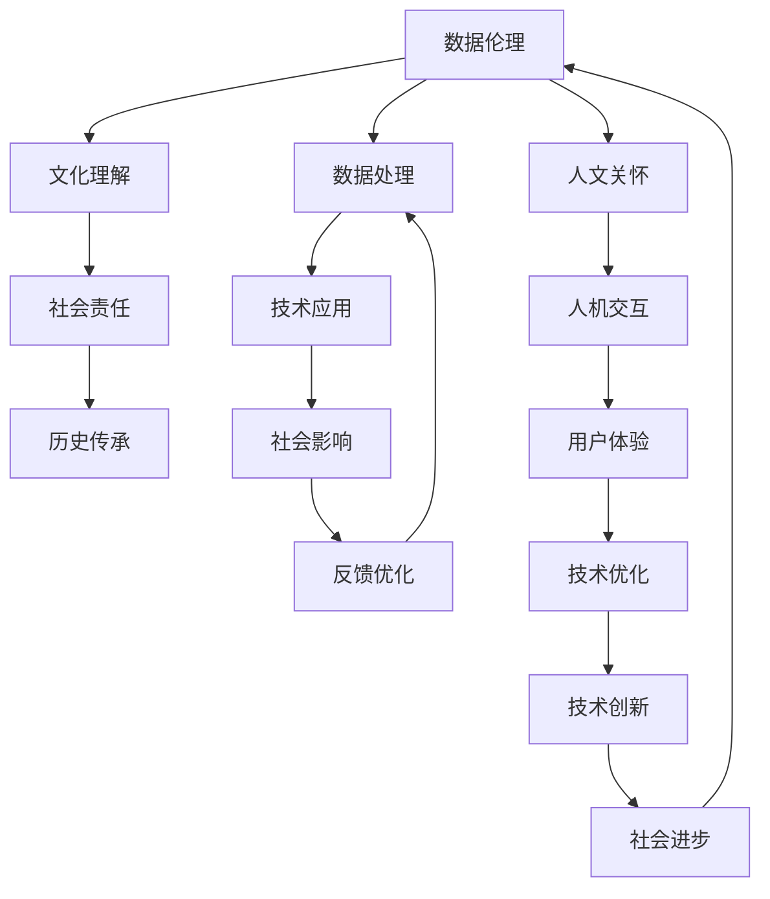

                 

## 数字时代的人文精神的传承

### 1. 背景介绍

数字时代的来临，引发了人类社会生产生活方式的深刻变革。人工智能（AI）技术的飞速发展，特别是深度学习、自然语言处理（NLP）、计算机视觉（CV）等技术的突破，极大拓展了人类感知、理解和智能决策的能力。然而，技术发展的背后，如何传承和弘扬人文精神，成为摆在我们面前的重大课题。本文将探讨数字时代人文精神的传承，通过技术与人文的深度融合，为AI的创新发展提供新的思考和方向。

### 2. 核心概念与联系

在数字时代，人文精神主要体现在对人类价值、伦理、文化、历史的传承与弘扬上。具体而言，包括但不限于：

- **数据伦理**：如何在使用和处理数据时，保障个人隐私、数据安全、数据公正等伦理问题。
- **文化理解**：如何在AI系统中体现不同文化、语言和价值观的尊重和理解。
- **社会责任**：如何在AI应用中，促进社会公平、提高社会福祉，避免技术滥用。
- **历史传承**：如何在AI系统中，保留和传承人类智慧、历史经验和文化遗产。
- **人文关怀**：如何在AI技术的设计和应用中，体现对人的情感、心理、伦理等关怀。

以下是一个Mermaid流程图，展示了数字时代人文精神的传承与AI技术的关联：



该流程图表明，数据伦理是基础，文化理解和社会责任是中坚，历史传承与人文关怀是延伸，最终通过技术应用影响社会，形成正反馈循环，促进技术创新和社会进步。

### 3. 核心算法原理 & 具体操作步骤

数字时代的人文精神传承，离不开数据伦理、文化理解、社会责任、历史传承与人文关怀等核心概念的融合。以下以数据伦理为例，探讨如何在AI系统中实现这一目标。

#### 3.1 算法原理概述

数据伦理的实现，通常需要构建一个以数据为核心的伦理框架，包括以下步骤：

1. **数据采集**：在数据采集阶段，需要遵循隐私保护、数据透明等伦理原则，确保数据来源合法、透明。
2. **数据处理**：在数据处理阶段，需要进行数据清洗、数据匿名化、数据最小化等操作，保障数据安全和个人隐私。
3. **数据利用**：在数据利用阶段，需要确保数据使用的公正、透明，避免数据偏见和歧视。
4. **数据反馈**：在数据反馈阶段，需要建立反馈机制，对数据利用效果进行评估，持续优化数据伦理模型。

#### 3.2 算法步骤详解

以下是数据伦理实现的详细步骤：

1. **隐私保护**：采用差分隐私技术，如高斯噪声、拉普拉斯噪声等，确保数据采集过程中的隐私保护。
2. **数据匿名化**：使用数据去标识化技术，如k-匿名化、t-私密性等，保障数据匿名性。
3. **数据最小化**：遵循数据最小化原则，仅收集和使用必要的数据，避免过度收集。
4. **公平性保障**：通过构建公平性评估模型，识别和消除数据中的偏见和歧视。
5. **透明度建立**：建立数据使用透明机制，确保数据使用的透明性和可解释性。
6. **伦理审查**：引入伦理审查机制，对数据使用和处理进行监督和评估。
7. **用户同意**：确保用户对数据收集和使用的知情权和同意权。

#### 3.3 算法优缺点

数据伦理的实现，具有以下优点：

1. **增强用户信任**：通过保障数据隐私和公平性，增强用户对AI系统的信任。
2. **避免偏见歧视**：通过消除数据偏见和歧视，确保AI系统的公正性和透明性。
3. **提高数据质量**：通过数据清洗和匿名化，提高数据质量和数据利用效率。

同时，也存在以下缺点：

1. **技术复杂度**：隐私保护、数据匿名化等技术需要较高的技术复杂度。
2. **数据处理成本**：数据最小化、公平性保障等操作，可能增加数据处理成本。
3. **伦理争议**：数据伦理的实现可能引发伦理争议，需要持续的伦理审查和监督。

#### 3.4 算法应用领域

数据伦理的应用领域广泛，涉及医疗、金融、教育、政府等多个领域：

- **医疗领域**：在医疗数据使用中，保障患者隐私，避免医疗歧视。
- **金融领域**：在金融数据分析中，确保数据公正，防止金融歧视。
- **教育领域**：在教育数据使用中，保障学生隐私，促进教育公平。
- **政府领域**：在公共数据使用中，保障数据透明，提高政府决策的透明度和公正性。

### 4. 数学模型和公式 & 详细讲解 & 举例说明

数据伦理的实现，需要构建数学模型和算法，以下以公平性保障为例，详细讲解。

#### 4.1 数学模型构建

公平性保障的数学模型，通常基于统计学和机器学习的方法，如：

1. **独立性检验**：使用卡方检验、t检验等方法，检测数据中的独立性。
2. **均值差异检验**：使用t检验、Mann-Whitney U检验等方法，检测不同群体之间的均值差异。
3. **公平性评估**：使用公平性指标，如Disparate Impact、Equalized Odds等，评估数据公平性。
4. **数据优化**：使用优化算法，如对抗性训练、公平性约束等，优化数据分布。

#### 4.2 公式推导过程

以均值差异检验为例，假设我们有$n$个样本，分为两组$A$和$B$，每组有$m$个样本。使用t检验检测两组均值差异，其公式为：

$$
t = \frac{\bar{x}_A - \bar{x}_B}{\sqrt{\frac{s_A^2}{m} + \frac{s_B^2}{n}}}
$$

其中，$\bar{x}_A$和$\bar{x}_B$为两组样本的均值，$s_A^2$和$s_B^2$为两组样本的方差，$n$为总样本数。计算得到的$t$值，与t分布的临界值比较，确定是否存在显著性差异。

#### 4.3 案例分析与讲解

假设某金融公司使用AI系统进行信用评分，数据集中存在性别偏见。使用均值差异检验，检测不同性别的信用评分是否存在差异。通过计算得出性别在信用评分中的均值差异，若存在显著性差异，则引入公平性约束，重新训练模型，消除性别偏见。

### 5. 项目实践：代码实例和详细解释说明

为了更好地理解数据伦理的实现，以下给出使用Python实现均值差异检验的代码实例：

```python
import numpy as np
from scipy.stats import ttest_ind

# 构造两组样本数据
A = np.array([2, 4, 6, 8, 10])
B = np.array([1, 3, 5, 7, 9])

# 进行均值差异检验
t_stat, p_val = ttest_ind(A, B)

# 输出结果
print(f"t统计量：{t_stat}")
print(f"p值：{p_val}")
```

运行上述代码，将输出t统计量和p值，用于判断两组数据是否存在显著性差异。

### 6. 实际应用场景

数字时代的人文精神传承，在实际应用场景中有着广泛的应用，以下列举几个典型案例：

#### 6.1 医疗数据保护

在医疗数据保护中，AI系统需要确保患者隐私，避免数据滥用。例如，某医疗AI系统使用患者病历数据进行疾病预测，采用差分隐私技术，确保患者隐私保护。

#### 6.2 金融公平贷款

在金融公平贷款中，AI系统需要确保贷款申请人的公平性，避免金融歧视。例如，某金融AI系统使用AI进行信用评分，通过公平性评估模型，识别并消除性别、种族等因素带来的偏见。

#### 6.3 教育公平评估

在教育公平评估中，AI系统需要确保教育公平，避免教育歧视。例如，某教育AI系统使用AI进行学生表现评估，通过均值差异检验，检测不同群体之间的评估结果是否存在差异，若存在显著性差异，则调整评估模型，确保教育公平。

#### 6.4 政府数据透明

在政府数据透明中，AI系统需要确保数据透明，提高政府决策的透明度和公正性。例如，某政府AI系统使用AI进行政策制定，通过数据匿名化、数据最小化等技术，保障数据透明和数据安全。

### 7. 工具和资源推荐

为了更好地实现数据伦理和人文精神的传承，以下推荐一些工具和资源：

#### 7.1 学习资源推荐

1. **《数据伦理：AI时代的新挑战》**：该书深入探讨了数据伦理的理论基础和实践案例，有助于理解数据伦理的重要性。
2. **《AI与伦理：技术与人文的交锋》**：该书从技术和人文学科的角度，探讨AI技术对伦理的影响，有助于理解技术与人文的深度融合。
3. **《Python数据伦理与隐私保护》**：该书介绍了Python在数据伦理和隐私保护中的应用，提供了具体的代码实现和案例分析。

#### 7.2 开发工具推荐

1. **TensorFlow**：开源深度学习框架，提供了丰富的数据处理和隐私保护工具。
2. **PyTorch**：开源深度学习框架，提供了丰富的公平性评估和数据优化工具。
3. **Scikit-learn**：开源机器学习库，提供了丰富的统计学和机器学习算法，如独立性检验、均值差异检验等。

#### 7.3 相关论文推荐

1. **《数据伦理：AI系统的关键要素》**：该论文探讨了数据伦理在AI系统中的重要性和实现方法。
2. **《公平性评估：AI系统中的关键技术》**：该论文介绍了公平性评估的算法和技术，如独立性检验、均值差异检验等。
3. **《隐私保护技术综述》**：该论文综述了隐私保护的各种技术和算法，如差分隐私、数据匿名化等。

### 8. 总结：未来发展趋势与挑战

#### 8.1 研究成果总结

数字时代的人文精神传承，已经取得了一定的成果，主要体现在以下几个方面：

1. **技术与人文的融合**：通过技术手段，如数据伦理、文化理解、社会责任等，实现了技术与人类价值的深度融合。
2. **伦理意识的增强**：在AI系统的设计和应用中，逐步增强了伦理意识，避免了技术滥用。
3. **社会效益的提升**：通过数据伦理的实现，提高了社会公平和数据安全，提升了社会效益。

#### 8.2 未来发展趋势

未来，数字时代人文精神的传承，将呈现以下趋势：

1. **技术与人文的深度融合**：通过技术手段，实现文化理解、社会责任、历史传承等人文价值在AI系统中的充分体现。
2. **数据伦理的普及应用**：数据伦理将成为AI系统设计的标配，广泛应用于各个领域。
3. **伦理审查机制的完善**：建立健全伦理审查机制，对AI系统的设计和应用进行持续监督和评估。
4. **人机交互的情感化**：在AI系统设计中，引入情感化元素，增强人机交互的自然性和人性化。
5. **跨文化交流的促进**：通过AI技术，促进不同文化、语言之间的交流和理解，提升全球文化多样性的包容性。

#### 8.3 面临的挑战

尽管数据伦理和人文精神的传承取得了一定成果，但仍面临以下挑战：

1. **技术复杂度**：隐私保护、数据匿名化等技术需要较高的技术复杂度。
2. **数据处理成本**：数据最小化、公平性保障等操作，可能增加数据处理成本。
3. **伦理争议**：数据伦理的实现可能引发伦理争议，需要持续的伦理审查和监督。
4. **跨文化差异**：不同文化背景下，AI系统的设计和使用需要考虑文化差异，避免文化冲突。
5. **社会公平性**：AI系统的设计和应用需要考虑社会公平性，避免加剧社会不公。

#### 8.4 研究展望

未来，数字时代人文精神的传承，需要在以下几个方面进行深入研究：

1. **跨文化交流**：在AI系统的设计中，考虑不同文化背景下的需求和期望，实现跨文化交流的促进。
2. **伦理模型优化**：优化伦理模型的设计，确保数据伦理在AI系统中的充分体现和实现。
3. **社会公平性**：在AI系统的设计和应用中，确保社会公平性，避免技术滥用。
4. **情感化设计**：在AI系统的设计中，引入情感化元素，增强人机交互的自然性和人性化。
5. **跨学科研究**：结合人工智能、伦理学、社会学等多学科知识，实现技术与人类价值的深度融合。

总之，数字时代的人文精神的传承，需要技术与人文的深度融合，确保技术的安全性、公正性、透明性和可持续性，为AI技术的创新发展提供新的思考和方向。通过持续的研究和创新，AI技术将更好地服务于人类社会，实现技术与人文的和谐共存。

---

作者：禅与计算机程序设计艺术 / Zen and the Art of Computer Programming

