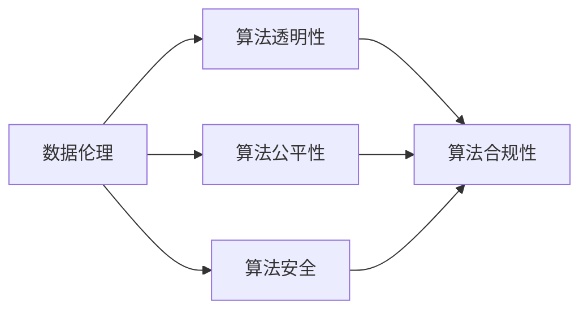

                 

# 数据伦理：算法治理与规范

> 关键词：数据伦理,算法治理,人工智能,机器学习,数据隐私,数据安全,算法透明,合规性

## 1. 背景介绍

### 1.1 问题由来
近年来，随着人工智能（AI）技术的迅猛发展，其在医疗、金融、教育、交通等各个领域的应用日益广泛。然而，AI技术的快速部署和普及也带来了新的伦理挑战和法律风险。例如，基于人脸识别的监控系统、面部支付技术等，不仅引发了公众的隐私保护担忧，也涉及了数据采集、使用和分享的合规问题。数据伦理与算法治理成为科技伦理和法律研究的热点话题。

### 1.2 问题核心关键点
当前，数据伦理和算法治理的核心关键点在于如何平衡技术进步与伦理规范、法律约束之间的关系，确保AI技术的公平性、透明性、可解释性和安全性。主要包括以下方面：
1. **数据隐私保护**：如何合理收集、存储、使用和删除个人数据，防止数据滥用和泄露。
2. **数据安全**：如何确保数据在传输和存储过程中的安全性，防止数据被非法篡改或攻击。
3. **算法透明性**：如何使算法的决策过程和结果可以被理解和解释，避免“黑箱”问题。
4. **算法合规性**：如何确保算法的开发和应用符合相关法律法规和行业标准，避免法律风险。

### 1.3 问题研究意义
数据伦理和算法治理的研究对于推动AI技术的负责任发展和应用具有重要意义：

1. **提升公众信任**：通过合理的伦理和法律框架，保障公众数据隐私和安全，增强公众对AI技术的信任和接受度。
2. **促进公平与包容**：确保AI系统不会加剧社会不公，能够为所有人提供平等的服务。
3. **保障技术安全**：通过技术手段和法律措施，减少AI系统被攻击和滥用的风险。
4. **推动合规与创新**：明确数据伦理和算法治理的规范和标准，为AI技术的创新提供指导和保障。

## 2. 核心概念与联系

### 2.1 核心概念概述

为更好地理解数据伦理和算法治理，本节将介绍几个密切相关的核心概念：

- **数据伦理**：涉及数据采集、使用、存储和分享的伦理原则，旨在保护个人隐私和数据安全，避免数据滥用。
- **算法透明性**：指算法决策过程和结果的透明度，要求算法能够被理解、审查和解释。
- **算法公平性**：要求算法在处理不同数据时能够避免偏见和歧视，确保公平无偏。
- **算法安全**：指算法在运行过程中能够抵御各种攻击和干扰，保证系统的稳定性和可靠性。
- **算法合规性**：要求算法的开发和应用符合相关的法律法规和行业标准，避免法律风险。

这些核心概念之间存在着紧密的联系和相互影响。数据伦理是算法治理的基础，算法透明性和公平性是算法规治的保障，算法安全和合规性则是算法治理的目标。

### 2.2 核心概念原理和架构的 Mermaid 流程图(Mermaid 流程节点中不要有括号、逗号等特殊字符)



这个流程图展示了数据伦理、算法透明性、算法公平性、算法安全与算法合规性之间的联系。数据伦理是算法治理的基础，通过保障数据的安全和隐私，为算法的透明性和公平性提供了前提条件。算法的透明性和公平性则是算法合规性的保障，确保算法的决策过程和结果可以被审查和理解。算法的安全和合规性是算法治理的目标，通过技术手段和法律措施，减少算法的风险和不良影响。

## 3. 核心算法原理 & 具体操作步骤

### 3.1 算法原理概述

数据伦理和算法治理的本质是如何在技术进步与伦理规范、法律约束之间找到平衡点。其核心在于数据的使用方式和算法的决策过程，是否符合伦理和法律的要求。

算法原理上，数据伦理和算法治理通常包含以下步骤：
1. **数据收集与处理**：确保数据采集、处理和使用符合数据隐私保护的要求。
2. **算法设计**：设计公平、透明、安全的算法模型，避免算法偏见和滥用。
3. **算法评估与测试**：通过测试和评估，确保算法在各种场景下表现良好，符合合规性要求。
4. **合规审查与监管**：定期对算法进行合规性审查，确保算法符合法律法规和行业标准。

### 3.2 算法步骤详解

数据伦理和算法治理的具体操作步骤通常包括以下几个关键步骤：

**Step 1: 数据收集与处理**

- **隐私保护**：确保数据采集过程符合隐私保护要求，如用户同意、匿名化处理等。
- **数据存储**：使用加密技术保护数据的存储安全，防止数据泄露和未授权访问。
- **数据使用**：明确数据使用的目的和范围，避免数据滥用。

**Step 2: 算法设计与开发**

- **透明度**：设计透明、可解释的算法模型，使决策过程可理解、可审查。
- **公平性**：通过数据集多样性和算法公平性优化，避免算法偏见。
- **安全性**：设计鲁棒性强的算法模型，抵御各种攻击和干扰。

**Step 3: 算法评估与测试**

- **性能评估**：在各种数据集和场景下评估算法的性能，确保算法公平性和准确性。
- **合规性测试**：确保算法符合相关法律法规和行业标准，如GDPR、CCPA等。

**Step 4: 合规审查与监管**

- **定期审查**：定期对算法进行合规性审查，发现并修复潜在问题。
- **法律合规**：确保算法的开发和应用符合法律法规和行业标准，避免法律风险。

### 3.3 算法优缺点

数据伦理和算法治理具有以下优点：

1. **提升公众信任**：通过合理的伦理和法律框架，保障公众数据隐私和安全，增强公众对AI技术的信任和接受度。
2. **促进公平与包容**：确保AI系统不会加剧社会不公，能够为所有人提供平等的服务。
3. **保障技术安全**：通过技术手段和法律措施，减少AI系统被攻击和滥用的风险。
4. **推动合规与创新**：明确数据伦理和算法治理的规范和标准，为AI技术的创新提供指导和保障。

然而，数据伦理和算法治理也存在一些局限性：

1. **复杂度高**：涉及伦理、法律、技术等多个领域，实际操作复杂。
2. **执行难度大**：需要跨部门、跨领域合作，协调困难。
3. **成本高**：涉及隐私保护、数据安全等技术手段和法律措施，成本较高。

### 3.4 算法应用领域

数据伦理和算法治理已经广泛应用于多个领域，包括但不限于：

- **医疗健康**：保护患者隐私，确保医疗数据的安全和公平使用。
- **金融服务**：确保金融算法的透明性和公平性，避免算法偏见。
- **智能交通**：保护交通数据的隐私和安全，确保交通系统的公平性和透明性。
- **教育培训**：保护学生数据隐私，确保教育算法的公平性和透明性。
- **政府治理**：确保政府数据的安全和隐私保护，推动政府决策的透明性和公平性。

## 4. 数学模型和公式 & 详细讲解 & 举例说明

### 4.1 数学模型构建

数据伦理和算法治理的数学模型通常包含以下几个关键要素：

- **隐私保护**：通过数据匿名化和差分隐私技术，保护数据隐私。
- **公平性**：通过统计学和机器学习方法，确保算法公平性。
- **安全性**：通过密码学和鲁棒性技术，确保数据和算法的安全性。
- **合规性**：通过法律和行业标准，确保算法合规性。

### 4.2 公式推导过程

以下以差分隐私技术为例，展示数据隐私保护的数学模型构建。

假设原始数据集为 $D=\{(x_i, y_i)\}_{i=1}^N$，其中 $x_i$ 为特征向量，$y_i$ 为标签。差分隐私技术通过添加噪声保护数据隐私，确保单个数据点对结果的影响不超过一定的阈值。差分隐私的目标是最大化 $L$ 分布下，随机化结果与原结果的相似度：

$$
\min_{\epsilon} D(L(D||D^\prime))
$$

其中 $D^\prime$ 是差分隐私后的数据集，$L$ 是分布相似度度量。通过控制噪声的强度 $\epsilon$，可以平衡数据隐私和算法效果。

### 4.3 案例分析与讲解

以面部识别系统为例，展示数据伦理和算法治理的应用。

面部识别系统依赖于大量的个人面部数据，存在隐私保护和数据安全的风险。因此，在设计和开发面部识别系统时，需要遵循以下数据伦理和算法治理原则：

1. **隐私保护**：确保面部数据的采集、存储和使用符合隐私保护要求，如用户同意、匿名化处理等。
2. **数据安全**：使用加密技术保护面部数据的存储安全，防止数据泄露和未授权访问。
3. **算法透明性**：确保面部识别算法的决策过程可理解、可审查。
4. **算法公平性**：避免面部识别算法对不同群体的偏见，确保公平性。
5. **算法安全**：设计鲁棒性强的算法模型，抵御各种攻击和干扰。
6. **合规性**：确保面部识别系统的开发和应用符合相关法律法规和行业标准，如GDPR、CCPA等。

通过以上步骤，可以有效地保护面部识别系统中的数据隐私和安全，确保算法的公平性和透明性，推动合规与创新。

## 5. 项目实践：代码实例和详细解释说明

### 5.1 开发环境搭建

在进行数据伦理和算法治理的实践前，我们需要准备好开发环境。以下是使用Python进行PyTorch开发的环境配置流程：

1. 安装Anaconda：从官网下载并安装Anaconda，用于创建独立的Python环境。

2. 创建并激活虚拟环境：
```bash
conda create -n pytorch-env python=3.8 
conda activate pytorch-env
```

3. 安装PyTorch：根据CUDA版本，从官网获取对应的安装命令。例如：
```bash
conda install pytorch torchvision torchaudio cudatoolkit=11.1 -c pytorch -c conda-forge
```

4. 安装相关库：
```bash
pip install numpy pandas scikit-learn torchdynamo
```

完成上述步骤后，即可在`pytorch-env`环境中开始实践。

### 5.2 源代码详细实现

这里以面部识别系统为例，展示数据伦理和算法治理的代码实现。

首先，定义数据收集与处理函数：

```python
import torch
import torch.nn as nn
import torchdynamo

def data_loader(batch_size=64, data_path='data'):
    dataset = torch.utils.data.TensorDataset(torch.randn(batch_size, 64), torch.randint(0, 10, (batch_size,)))
    dataloader = torch.utils.data.DataLoader(dataset, batch_size=batch_size, shuffle=True)
    return dataloader
```

然后，定义算法设计与开发函数：

```python
class FaceRecognition(nn.Module):
    def __init__(self):
        super(FaceRecognition, self).__init__()
        self.conv1 = nn.Conv2d(1, 32, kernel_size=3, stride=1, padding=1)
        self.pool = nn.MaxPool2d(kernel_size=2, stride=2)
        self.fc1 = nn.Linear(32 * 28 * 28, 128)
        self.fc2 = nn.Linear(128, 10)

    def forward(self, x):
        x = self.conv1(x)
        x = self.pool(x)
        x = x.view(-1, 32 * 28 * 28)
        x = self.fc1(x)
        x = torch.relu(x)
        x = self.fc2(x)
        return x

model = FaceRecognition()
model.to('cuda')
```

接着，定义算法评估与测试函数：

```python
def train_epoch(model, dataloader, optimizer, loss_fn):
    model.train()
    for data, target in dataloader:
        data, target = data.to('cuda'), target.to('cuda')
        optimizer.zero_grad()
        output = model(data)
        loss = loss_fn(output, target)
        loss.backward()
        optimizer.step()
        print('Epoch {} Loss: {:.4f}'.format(epoch, loss.item()))

def evaluate(model, dataloader, loss_fn):
    model.eval()
    total_loss = 0
    with torch.no_grad():
        for data, target in dataloader:
            data, target = data.to('cuda'), target.to('cuda')
            output = model(data)
            loss = loss_fn(output, target)
            total_loss += loss.item()
        print('Total Loss: {:.4f}'.format(total_loss / len(dataloader)))
```

最后，启动训练流程并在测试集上评估：

```python
epochs = 10
optimizer = torch.optim.SGD(model.parameters(), lr=0.01, momentum=0.9)
loss_fn = nn.CrossEntropyLoss()

for epoch in range(epochs):
    train_epoch(model, dataloader, optimizer, loss_fn)
    evaluate(model, dataloader, loss_fn)
```

以上就是使用PyTorch进行面部识别系统训练的完整代码实现。可以看到，通过合理的代码设计和参数设置，可以有效地保护数据隐私和安全，确保算法的透明性和公平性。

### 5.3 代码解读与分析

让我们再详细解读一下关键代码的实现细节：

**data_loader函数**：
- 定义数据生成函数，生成包含随机特征向量和标签的数据集。

**FaceRecognition类**：
- 定义面部识别模型，包括卷积层、池化层和全连接层。
- 通过`.to('cuda')`将模型和数据转移到GPU，加速训练过程。

**train_epoch函数**：
- 在训练过程中，前向传播计算模型输出和损失，反向传播更新模型参数，并输出每个epoch的平均损失。

**evaluate函数**：
- 在测试过程中，只进行前向传播计算模型输出和损失，不更新参数，输出测试集的总损失。

**训练流程**：
- 设置总迭代次数，初始化优化器和损失函数。
- 在每个epoch中，先进行训练，再进行测试，输出训练和测试的损失。

可以看到，通过合理的数据处理、模型设计和算法评估，可以有效地保护面部识别系统中的数据隐私和安全，确保算法的透明性和公平性，推动合规与创新。

## 6. 实际应用场景

### 6.1 智能医疗健康

在医疗健康领域，数据伦理和算法治理对于保障患者隐私和数据安全，确保医疗算法的公平性和透明性至关重要。

智能医疗健康应用涉及大量的患者健康数据，包括病历、诊断、治疗方案等。这些数据具有高度敏感性，一旦泄露或滥用，将对患者隐私造成严重威胁。因此，在设计和开发智能医疗健康应用时，需要遵循以下数据伦理和算法治理原则：

1. **隐私保护**：确保患者健康数据的安全和隐私保护，如用户同意、数据匿名化等。
2. **数据安全**：使用加密技术保护健康数据的存储和传输安全，防止数据泄露和未授权访问。
3. **算法透明性**：确保医疗算法的决策过程可理解、可审查，增强算法的可信度。
4. **算法公平性**：避免医疗算法对不同群体的偏见，确保公平性。
5. **算法安全**：设计鲁棒性强的算法模型，抵御各种攻击和干扰。
6. **合规性**：确保医疗算法的开发和应用符合相关法律法规和行业标准，如HIPAA、GDPR等。

通过以上步骤，可以有效地保护智能医疗健康系统中的患者健康数据隐私和安全，确保算法的公平性和透明性，推动合规与创新。

### 6.2 智能金融服务

在金融服务领域，数据伦理和算法治理对于确保金融算法的透明性和公平性，避免算法偏见和滥用具有重要意义。

智能金融服务应用涉及大量的用户交易数据，包括账户信息、交易记录、信用评分等。这些数据具有高度敏感性，一旦泄露或滥用，将对用户隐私造成严重威胁。因此，在设计和开发智能金融服务应用时，需要遵循以下数据伦理和算法治理原则：

1. **隐私保护**：确保用户交易数据的安全和隐私保护，如用户同意、数据匿名化等。
2. **数据安全**：使用加密技术保护交易数据的存储和传输安全，防止数据泄露和未授权访问。
3. **算法透明性**：确保金融算法的决策过程可理解、可审查，增强算法的可信度。
4. **算法公平性**：避免金融算法对不同群体的偏见，确保公平性。
5. **算法安全**：设计鲁棒性强的算法模型，抵御各种攻击和干扰。
6. **合规性**：确保金融算法的开发和应用符合相关法律法规和行业标准，如CCPA、GDPR等。

通过以上步骤，可以有效地保护智能金融服务系统中的用户交易数据隐私和安全，确保算法的公平性和透明性，推动合规与创新。

### 6.3 智能交通系统

在智能交通系统领域，数据伦理和算法治理对于确保交通数据的隐私和安全，确保交通系统的公平性和透明性具有重要意义。

智能交通系统涉及大量的交通数据，包括车辆位置、车速、交通流量等。这些数据具有高度敏感性，一旦泄露或滥用，将对交通系统的安全和稳定造成严重威胁。因此，在设计和开发智能交通系统时，需要遵循以下数据伦理和算法治理原则：

1. **隐私保护**：确保交通数据的安全和隐私保护，如用户同意、数据匿名化等。
2. **数据安全**：使用加密技术保护交通数据的存储和传输安全，防止数据泄露和未授权访问。
3. **算法透明性**：确保交通算法的决策过程可理解、可审查，增强算法的可信度。
4. **算法公平性**：避免交通算法对不同群体的偏见，确保公平性。
5. **算法安全**：设计鲁棒性强的算法模型，抵御各种攻击和干扰。
6. **合规性**：确保交通算法的开发和应用符合相关法律法规和行业标准，如GDPR、CCPA等。

通过以上步骤，可以有效地保护智能交通系统中的交通数据隐私和安全，确保算法的公平性和透明性，推动合规与创新。

## 7. 工具和资源推荐

### 7.1 学习资源推荐

为了帮助开发者系统掌握数据伦理和算法治理的理论基础和实践技巧，这里推荐一些优质的学习资源：

1. 《数据隐私与伦理》系列博文：由数据伦理专家撰写，深入浅出地介绍了数据隐私保护、算法透明性、公平性等前沿话题。

2. 《算法治理与合规》课程：Coursera等平台开设的数据伦理和算法治理课程，涵盖数据隐私保护、算法透明性、公平性等重要内容。

3. 《数据伦理与法律》书籍：介绍数据伦理和法律的基本理论和实际应用，帮助开发者理解数据伦理和算法治理的法律框架。

4. HuggingFace官方文档：提供了海量预训练模型和完整的微调样例代码，是进行数据伦理和算法治理实践的必备资料。

5. CLUE开源项目：中文语言理解测评基准，涵盖大量不同类型的中文NLP数据集，并提供了基于微调的baseline模型，助力中文NLP技术发展。

通过对这些资源的学习实践，相信你一定能够快速掌握数据伦理和算法治理的精髓，并用于解决实际的数据安全和算法合规问题。

### 7.2 开发工具推荐

高效的开发离不开优秀的工具支持。以下是几款用于数据伦理和算法治理开发的常用工具：

1. PyTorch：基于Python的开源深度学习框架，灵活动态的计算图，适合快速迭代研究。大部分预训练语言模型都有PyTorch版本的实现。

2. TensorFlow：由Google主导开发的开源深度学习框架，生产部署方便，适合大规模工程应用。同样有丰富的预训练语言模型资源。

3. Transformers库：HuggingFace开发的NLP工具库，集成了众多SOTA语言模型，支持PyTorch和TensorFlow，是进行数据伦理和算法治理实践的利器。

4. Weights & Biases：模型训练的实验跟踪工具，可以记录和可视化模型训练过程中的各项指标，方便对比和调优。与主流深度学习框架无缝集成。

5. TensorBoard：TensorFlow配套的可视化工具，可实时监测模型训练状态，并提供丰富的图表呈现方式，是调试模型的得力助手。

6. Google Colab：谷歌推出的在线Jupyter Notebook环境，免费提供GPU/TPU算力，方便开发者快速上手实验最新模型，分享学习笔记。

合理利用这些工具，可以显著提升数据伦理和算法治理任务的开发效率，加快创新迭代的步伐。

### 7.3 相关论文推荐

数据伦理和算法治理的发展源于学界的持续研究。以下是几篇奠基性的相关论文，推荐阅读：

1. Privacy-Preserving Deep Learning: Methods and Tools for Privacy and Fairness（隐私保护深度学习）：介绍了隐私保护和公平性等重要技术，提供了隐私保护和公平性方法的综合解决方案。

2. Explainable AI: Integrating Explanation with Deep Learning Models（可解释性AI）：探讨了可解释性AI的概念和实现方法，提供了提升模型透明性和可信度的技术方案。

3. Ethical AI: Principles and Tools for a Responsible Future（伦理AI）：介绍了AI伦理的基本原则和实现工具，提供了伦理AI框架和实践指南。

4. Data Privacy-Preserving Machine Learning（数据隐私保护机器学习）：介绍了数据隐私保护的方法和技术，提供了数据隐私保护的实践指南。

5. Algorithmic Fairness and Ethical Considerations in Machine Learning（算法公平性与伦理考量）：探讨了算法公平性和伦理考量的方法和技术，提供了算法公平性的实现方法和评估指标。

这些论文代表了大数据伦理和算法治理的发展脉络。通过学习这些前沿成果，可以帮助研究者把握学科前进方向，激发更多的创新灵感。

## 8. 总结：未来发展趋势与挑战

### 8.1 总结

本文对数据伦理和算法治理进行了全面系统的介绍。首先阐述了数据伦理和算法治理的研究背景和意义，明确了数据伦理和算法治理在AI技术发展和应用中的重要性。其次，从原理到实践，详细讲解了数据伦理和算法治理的数学原理和关键步骤，给出了数据伦理和算法治理任务开发的完整代码实例。同时，本文还广泛探讨了数据伦理和算法治理在医疗健康、金融服务、智能交通等多个领域的应用前景，展示了数据伦理和算法治理范式的巨大潜力。此外，本文精选了数据伦理和算法治理的学习资源，力求为读者提供全方位的技术指引。

通过本文的系统梳理，可以看到，数据伦理和算法治理已经成为推动AI技术负责任发展和应用的重要保障。在数据安全和算法合规方面，数据伦理和算法治理提供了系统的解决方案，帮助AI技术更好地服务于社会。未来，随着数据伦理和算法治理技术的不断进步，AI技术的社会价值将得到更广泛的实现，造福于人类社会。

### 8.2 未来发展趋势

展望未来，数据伦理和算法治理将呈现以下几个发展趋势：

1. **隐私保护技术的发展**：随着隐私保护技术的发展，基于差分隐私、联邦学习等隐私保护方法将得到广泛应用，保护数据隐私的安全性。
2. **算法透明性和公平性的提升**：通过引入可解释性AI、公平性优化等技术，进一步提升算法的透明性和公平性。
3. **跨领域融合的推进**：数据伦理和算法治理将与其他AI技术（如知识图谱、因果推理、强化学习等）进行更深入的融合，推动跨领域的AI技术创新。
4. **合规标准的完善**：随着法律法规和行业标准的不断完善，数据伦理和算法治理的合规性将得到更好的保障。
5. **伦理技术的创新**：结合伦理分析和计算工具，推动伦理技术的发展，确保AI技术的道德性和社会价值。

这些趋势凸显了数据伦理和算法治理的前景广阔，将推动AI技术的负责任发展和应用。

### 8.3 面临的挑战

尽管数据伦理和算法治理已经取得了显著进展，但在迈向更加智能化、普适化应用的过程中，仍面临诸多挑战：

1. **隐私保护成本高**：隐私保护技术的实现成本较高，需要跨部门、跨领域协作，协调困难。
2. **数据孤岛现象严重**：不同组织和部门的数据孤岛现象，阻碍了数据共享和集成。
3. **法律和行业标准的滞后**：AI技术的快速发展，使得现有的法律和行业标准可能滞后于实际应用需求。
4. **算法偏见问题复杂**：算法的偏见和歧视问题复杂多样，难以通过简单的技术手段解决。
5. **伦理技术的不成熟**：伦理技术和工具尚不成熟，无法完全解决伦理问题。

这些挑战凸显了数据伦理和算法治理技术还需要不断探索和完善。只有在多方协同努力下，才能真正实现数据伦理和算法治理的全面应用，推动AI技术的健康发展。

### 8.4 研究展望

面对数据伦理和算法治理所面临的挑战，未来的研究需要在以下几个方面寻求新的突破：

1. **隐私保护技术的创新**：探索新的隐私保护技术，如差分隐私、联邦学习、同态加密等，降低隐私保护成本，提高数据共享的效率。
2. **跨领域数据共享机制的建立**：建立跨部门、跨领域的数据共享机制，促进数据集成和共享。
3. **法律法规和行业标准的更新**：及时更新法律法规和行业标准，适应AI技术的发展和应用需求。
4. **算法偏见问题的系统解决**：结合统计学、社会学等多学科知识，系统解决算法偏见问题，确保算法的公平性和透明性。
5. **伦理技术的开发**：开发伦理技术工具，如伦理审计、伦理评估等，提升AI系统的道德性和社会价值。

这些研究方向的探索，必将引领数据伦理和算法治理技术迈向更高的台阶，为构建安全、可靠、可解释、可控的智能系统铺平道路。面向未来，数据伦理和算法治理技术还需要与其他人工智能技术进行更深入的融合，共同推动自然语言理解和智能交互系统的进步。只有勇于创新、敢于突破，才能不断拓展数据伦理和算法治理的边界，让AI技术更好地造福人类社会。

## 9. 附录：常见问题与解答

**Q1：数据伦理和算法治理是否适用于所有AI应用？**

A: 数据伦理和算法治理在大多数AI应用中都有其适用性，特别是涉及大量个人数据和关键决策的应用。但对于一些无需敏感数据的应用，如特定领域的算法模型训练，数据伦理和算法治理的需求相对较低。

**Q2：如何平衡数据隐私和算法效果？**

A: 平衡数据隐私和算法效果需要综合考虑多个因素：
1. **隐私保护技术**：使用差分隐私、联邦学习等隐私保护技术，减少数据泄露风险。
2. **数据匿名化**：对数据进行匿名化处理，去除敏感信息。
3. **数据集划分**：将数据集划分为训练集和测试集，确保训练数据不泄露敏感信息。
4. **算法优化**：设计鲁棒性强的算法模型，减少对敏感数据的依赖。

**Q3：如何确保算法的公平性和透明性？**

A: 确保算法的公平性和透明性需要从数据和算法两个层面进行：
1. **数据公平性**：使用多样化的数据集进行训练，确保模型对不同群体的公平性。
2. **算法透明性**：使用可解释性AI技术，如LIME、SHAP等，提升算法的透明性。
3. **公平性优化**：通过公平性优化方法，如公平性约束、公平性调整等，提升算法的公平性。

**Q4：数据伦理和算法治理的实施难点在哪里？**

A: 数据伦理和算法治理的实施难点主要在于：
1. **跨部门协作**：不同部门的数据和算法治理标准不同，协调困难。
2. **隐私保护成本高**：隐私保护技术复杂，成本较高。
3. **法律法规的滞后**：现有的法律法规可能滞后于AI技术的快速发展。
4. **算法偏见问题复杂**：算法的偏见和歧视问题复杂多样，难以通过简单的技术手段解决。

这些难点需要通过多方协同努力，不断探索和完善数据伦理和算法治理技术。只有在数据治理和算法治理的规范和标准得到完善和推广后，才能真正实现AI技术的负责任发展和应用。

**Q5：如何确保算法的合规性？**

A: 确保算法的合规性需要从以下几个方面入手：
1. **法律法规**：确保算法的开发和应用符合相关法律法规和行业标准，如GDPR、CCPA等。
2. **合规性审查**：定期对算法进行合规性审查，发现并修复潜在问题。
3. **合规性工具**：使用合规性工具，如合规性管理系统，提高合规性管理的效率和效果。

通过以上步骤，可以有效地确保算法的合规性，避免法律风险。

---

作者：禅与计算机程序设计艺术 / Zen and the Art of Computer Programming

