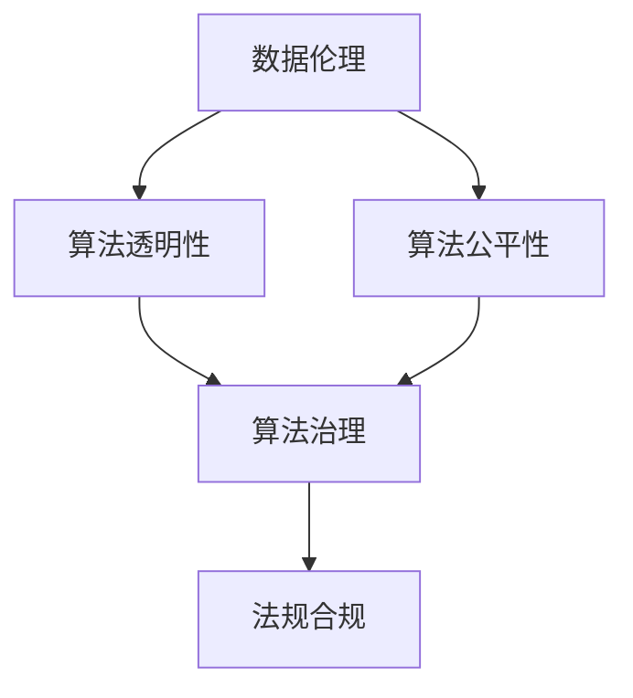
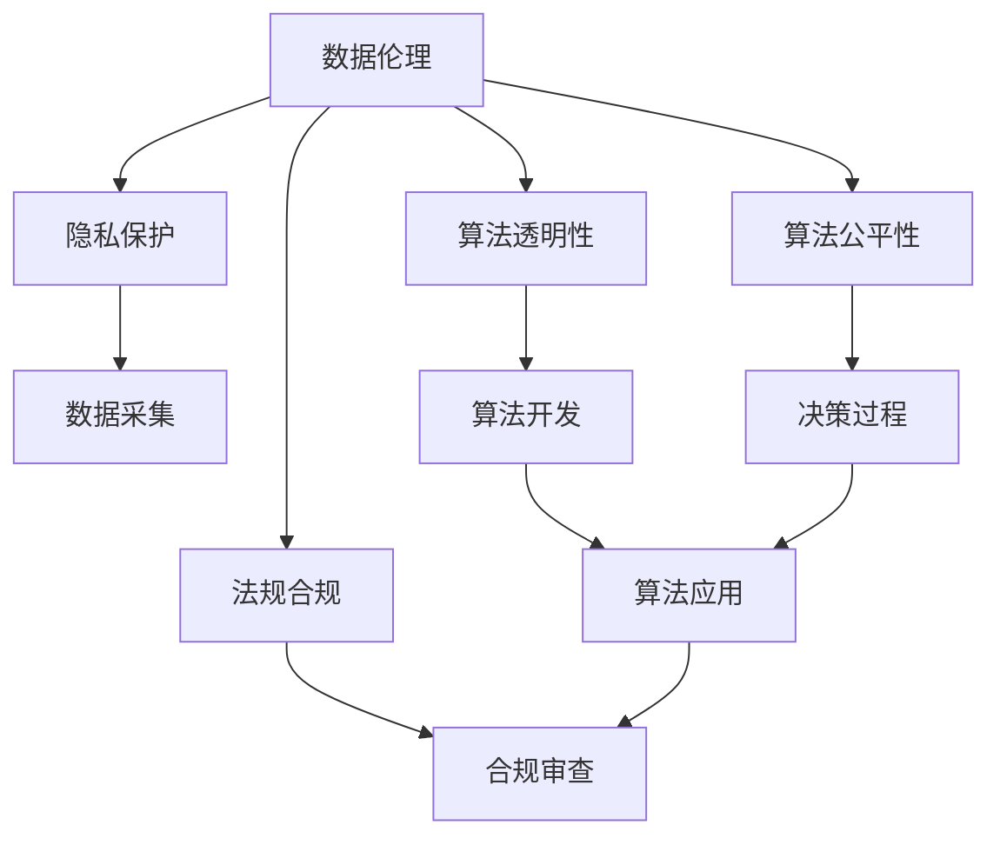

                 

# 数据伦理：算法治理与规范

> 关键词：数据伦理, 算法治理, 数据安全, 隐私保护, 透明性, 可解释性, 公平性, 法规合规

## 1. 背景介绍

### 1.1 问题由来
随着人工智能技术的快速发展，尤其是深度学习和大数据技术的广泛应用，数据驱动型算法在众多领域取得了显著成效。然而，数据伦理和算法治理问题也随之而来，成为制约其发展的重要因素。

一方面，算法的决策过程依赖于大量数据，而数据的质量和完整性直接影响算法的效果。数据来源的合法性、数据的隐私保护、数据的公开透明等问题，成为算法应用过程中必须面对的挑战。

另一方面，算法的公平性、可解释性、可控性等伦理问题，也是公众和企业关注的焦点。算法结果可能会对个人隐私、职业机会、社会公平等方面产生重大影响，其决策过程缺乏透明性和可解释性，也可能引发信任危机和法律风险。

因此，如何在保护数据隐私和伦理的前提下，提升算法的效果和公平性，已成为当前数据驱动型技术研究的重要方向。

## 2. 核心概念与联系

### 2.1 核心概念概述

为了更好地理解数据伦理和算法治理，本节将介绍几个核心概念：

- 数据伦理(Data Ethics)：涉及数据的收集、存储、使用过程中应遵守的伦理原则，包括隐私保护、公平性、透明性、责任归属等方面。

- 算法治理(Algorithm Governance)：指对算法开发、应用和管理的规范和监管，确保算法在道德、法律和技术的各个维度上符合伦理要求。

- 数据隐私(Data Privacy)：指在数据收集、处理、存储和使用过程中，保障个人数据不被滥用或泄露，保护个人隐私权。

- 算法透明性(Algorithm Transparency)：指算法决策过程的可理解性和可解释性，使决策依据公开透明，接受公众监督。

- 算法公平性(Algorithm Fairness)：指算法在处理不同群体时，应确保无歧视性，避免对特定群体的偏见。

- 法规合规(Regulatory Compliance)：指算法开发和应用过程中，遵守相关法律法规和行业规范，避免法律风险。

这些核心概念之间的逻辑关系可以通过以下Mermaid流程图来展示：



这个流程图展示了数据伦理和算法治理各要素之间的内在联系：

1. 数据伦理是算法治理的出发点和依据，通过设定数据使用的原则，确保算法的透明性和公平性。
2. 算法透明性是数据伦理和算法治理的重要支撑，保障算法决策过程的公开透明，增强公众信任。
3. 算法公平性是算法治理的重要目标，确保算法在处理不同群体时不产生歧视。
4. 法规合规是算法治理的基础，确保算法开发和应用符合法律法规，避免法律风险。

### 2.2 核心概念原理和架构的 Mermaid 流程图


这个流程图详细展示了数据伦理和算法治理在算法全生命周期中的作用：

1. 在数据采集阶段，隐私保护措施确保个人数据不被滥用。
2. 在算法开发过程中，透明性原则保障决策过程的公开透明。
3. 在算法应用阶段，公平性保障算法无歧视性，合规性确保算法符合法律法规。

这些核心概念共同构成了数据伦理和算法治理的理论框架，确保算法在技术、伦理和法律等多个维度上得到规范和监督。

## 3. 核心算法原理 & 具体操作步骤
### 3.1 算法原理概述

数据伦理和算法治理的核心在于平衡数据利用与伦理道德之间的关系。基于数据驱动的算法开发和应用，需要在保证数据隐私和伦理道德的前提下，提升算法的透明度、公平性和可解释性。

具体而言，算法治理的主要任务包括：

1. 数据隐私保护：在数据收集、存储、处理和使用过程中，采取措施确保数据的安全和隐私保护。
2. 算法透明性：在算法设计和使用过程中，保证算法的决策过程透明、可解释，便于公众监督和理解。
3. 算法公平性：在算法设计和评估过程中，确保算法不带有歧视，公平对待不同群体。
4. 法规合规：在算法开发和应用过程中，遵守相关法律法规和行业规范，避免法律风险。

这些任务通常通过一系列的技术手段和政策措施来实现，如隐私保护技术、透明性框架、公平性评估、合规审查等。

### 3.2 算法步骤详解

基于数据伦理和算法治理的算法开发和应用，通常包括以下几个关键步骤：

**Step 1: 数据采集与处理**
- 收集所需数据，并进行预处理、清洗和标注。
- 采取隐私保护措施，确保数据采集过程中不侵犯个人隐私。
- 数据存储和处理过程中，采取安全措施，防止数据泄露。

**Step 2: 算法设计**
- 设计透明的算法架构，确保算法决策过程的公开透明。
- 引入公平性约束，避免算法偏见，确保不同群体被公平对待。
- 选择符合法规合规要求的算法框架和工具，避免法律风险。

**Step 3: 算法训练与优化**
- 使用隐私保护技术，如差分隐私、同态加密等，在数据训练过程中保护隐私。
- 采用可解释性技术，如模型可视化、特征重要性分析等，提升算法透明性。
- 进行公平性评估，确保算法无歧视性。

**Step 4: 算法应用与评估**
- 在实际应用过程中，持续监测算法性能和公平性。
- 定期进行合规审查，确保算法符合法律法规和行业规范。
- 接受公众监督，及时调整算法策略，提升算法效果和公平性。

### 3.3 算法优缺点

基于数据伦理和算法治理的算法开发和应用，具有以下优点：

1. 提升算法透明度：通过透明性措施，使算法决策过程公开透明，增强公众信任。
2. 保障数据隐私：通过隐私保护技术，确保数据的安全和隐私，避免数据滥用。
3. 确保算法公平性：通过公平性评估和约束，避免算法偏见，确保不同群体被公平对待。
4. 符合法规合规要求：通过合规审查，确保算法开发和应用符合法律法规，避免法律风险。

然而，这种算法治理范式也存在一些缺点：

1. 技术复杂度高：需要在算法设计、数据处理、模型训练等多个环节引入隐私保护、透明性、公平性等技术措施，增加了开发难度和成本。
2. 数据处理限制：隐私保护技术可能会对数据处理和分析精度产生影响，需要平衡隐私保护和数据利用之间的关系。
3. 法律风险：法规合规审查需要持续进行，确保算法符合法律法规，增加了合规成本。
4. 公众监督难度：算法的透明性和可解释性虽然有助于公众监督，但实际执行过程中可能面临复杂的技术和法律挑战。

尽管存在这些缺点，基于数据伦理和算法治理的算法开发和应用，仍是当前算法治理的主流范式，得到广泛的应用和认可。

### 3.4 算法应用领域

基于数据伦理和算法治理的算法开发和应用，已经在多个领域得到了广泛应用：

1. 金融科技：在金融风控、信用评分、客户服务等场景中，应用算法治理确保算法的公平性、透明性和隐私保护，提升金融服务的质量和安全性。

2. 医疗健康：在电子病历分析、临床决策支持、健康管理等领域，应用算法治理确保算法的准确性和公平性，提升医疗服务的质量和可及性。

3. 教育科技：在智能教育、在线学习、教育推荐等领域，应用算法治理确保算法的公平性和透明性，提升教育资源的利用效率和教育公平性。

4. 智能交通：在交通流量预测、自动驾驶、智慧城市管理等领域，应用算法治理确保算法的安全和公平性，提升交通管理和公共服务的智能化水平。

5. 环境监测：在空气质量监测、气候变化预测、生态保护等领域，应用算法治理确保算法的准确性和合规性，提升环境监测和治理的科学性和精准性。

6. 公共安全：在犯罪预测、社会稳定监测、公共卫生等领域，应用算法治理确保算法的透明性和公平性，提升公共安全的预防和应对能力。

## 4. 数学模型和公式 & 详细讲解  
### 4.1 数学模型构建

为了更好地理解基于数据伦理和算法治理的算法开发和应用，本节将使用数学语言对核心算法进行更加严格的刻画。

假设我们有一组数据 $D=\{(x_i,y_i)\}_{i=1}^N$，其中 $x_i$ 为输入特征，$y_i$ 为对应的标签。我们的目标是为该数据集构建一个透明的、公平的、符合法规的算法模型 $M(x)$。

定义算法模型的损失函数为 $\ell(M(x),y_i)$，表示模型预测输出 $M(x)$ 与真实标签 $y_i$ 之间的差异。在数据伦理和算法治理的框架下，模型训练的目标可以表示为：

$$
\hat{M} = \mathop{\arg\min}_{M} \mathcal{L}(M,D) + \text{隐私保护惩罚} + \text{透明性惩罚} + \text{公平性惩罚} + \text{合规性惩罚}
$$

其中，隐私保护惩罚、透明性惩罚、公平性惩罚和合规性惩罚分别表示对数据隐私、算法透明性、算法公平性和法规合规的约束。这些惩罚项的设计和实现，需要结合具体的算法应用场景和法律法规要求。

### 4.2 公式推导过程

以下我们以分类任务为例，推导公平性惩罚的计算公式。

假设我们有一个二分类任务，模型 $M(x)$ 的预测输出为 $\hat{y}=M(x)$，真实标签 $y \in \{0,1\}$。公平性惩罚可以表示为：

$$
\text{Fairness Penalty} = \sum_{i=1}^N \text{FairnessLoss}(M(x_i),y_i)
$$

其中，$\text{FairnessLoss}(M(x_i),y_i)$ 表示模型 $M(x_i)$ 在输入 $x_i$ 上的公平性损失。该损失可以定义为模型在不同群体中的准确率差异，例如：

$$
\text{FairnessLoss}(M(x_i),y_i) = \max\{\hat{y_i} - P(y_i=1|M(x_i)), P(y_i=1|M(x_i)) - \hat{y_i}\}
$$

该定义确保模型在不同群体中的预测准确率差不超过一个阈值 $\epsilon$，即：

$$
|\hat{y_i} - P(y_i=1|M(x_i))| \leq \epsilon
$$

在得到公平性惩罚的计算公式后，即可带入算法训练的总体损失函数中，通过梯度下降等优化算法进行模型训练。重复上述过程直至收敛，最终得到适应数据伦理和算法治理要求的模型参数 $\hat{M}$。

## 5. 项目实践：代码实例和详细解释说明
### 5.1 开发环境搭建

在进行数据伦理和算法治理的算法开发和应用实践前，我们需要准备好开发环境。以下是使用Python进行PyTorch开发的环境配置流程：

1. 安装Anaconda：从官网下载并安装Anaconda，用于创建独立的Python环境。

2. 创建并激活虚拟环境：
```bash
conda create -n pytorch-env python=3.8 
conda activate pytorch-env
```

3. 安装PyTorch：根据CUDA版本，从官网获取对应的安装命令。例如：
```bash
conda install pytorch torchvision torchaudio cudatoolkit=11.1 -c pytorch -c conda-forge
```

4. 安装各类工具包：
```bash
pip install numpy pandas scikit-learn matplotlib tqdm jupyter notebook ipython
```

完成上述步骤后，即可在`pytorch-env`环境中开始算法开发实践。

### 5.2 源代码详细实现

下面我们以公平性约束的算法实现为例，给出使用PyTorch进行算法开发的PyTorch代码实现。

首先，定义公平性约束的损失函数：

```python
import torch.nn as nn

class FairnessLoss(nn.Module):
    def __init__(self, epsilon):
        super(FairnessLoss, self).__init__()
        self.epsilon = epsilon
    
    def forward(self, y_pred, y_true):
        loss = torch.max(torch.abs(y_pred - y_true) - self.epsilon, torch.zeros_like(y_pred))
        return loss.mean()
```

然后，定义公平性约束的优化器：

```python
from transformers import AdamW

optimizer = AdamW(model.parameters(), lr=2e-5)
```

接着，定义训练和评估函数：

```python
from torch.utils.data import DataLoader
from tqdm import tqdm
from sklearn.metrics import accuracy_score

device = torch.device('cuda') if torch.cuda.is_available() else torch.device('cpu')
model.to(device)

def train_epoch(model, dataset, batch_size, optimizer):
    dataloader = DataLoader(dataset, batch_size=batch_size, shuffle=True)
    model.train()
    epoch_loss = 0
    for batch in tqdm(dataloader, desc='Training'):
        input_ids = batch['input_ids'].to(device)
        attention_mask = batch['attention_mask'].to(device)
        labels = batch['labels'].to(device)
        model.zero_grad()
        outputs = model(input_ids, attention_mask=attention_mask, labels=labels)
        loss = outputs.loss
        epoch_loss += loss.item()
        loss.backward()
        optimizer.step()
    return epoch_loss / len(dataloader)

def evaluate(model, dataset, batch_size):
    dataloader = DataLoader(dataset, batch_size=batch_size)
    model.eval()
    preds, labels = [], []
    with torch.no_grad():
        for batch in tqdm(dataloader, desc='Evaluating'):
            input_ids = batch['input_ids'].to(device)
            attention_mask = batch['attention_mask'].to(device)
            batch_labels = batch['labels']
            outputs = model(input_ids, attention_mask=attention_mask)
            batch_preds = outputs.logits.argmax(dim=2).to('cpu').tolist()
            batch_labels = batch_labels.to('cpu').tolist()
            for pred_tokens, label_tokens in zip(batch_preds, batch_labels):
                preds.append(pred_tokens[:len(label_tokens)])
                labels.append(label_tokens)
                
    print("Accuracy:", accuracy_score(labels, preds))
```

最后，启动训练流程并在测试集上评估：

```python
epochs = 5
batch_size = 16

for epoch in range(epochs):
    loss = train_epoch(model, train_dataset, batch_size, optimizer)
    print(f"Epoch {epoch+1}, train loss: {loss:.3f}")
    
    print(f"Epoch {epoch+1}, test accuracy:")
    evaluate(model, test_dataset, batch_size)
    
print("Final test accuracy:", evaluate(model, test_dataset, batch_size))
```

以上就是使用PyTorch对公平性约束的算法进行开发的完整代码实现。可以看到，通过引入公平性约束的损失函数和优化器，可以在模型训练过程中实现公平性惩罚，从而提升算法的公平性。

### 5.3 代码解读与分析

让我们再详细解读一下关键代码的实现细节：

**FairnessLoss类**：
- `__init__`方法：初始化公平性约束的阈值 $\epsilon$。
- `forward`方法：定义公平性损失的计算公式，确保模型在不同群体中的预测准确率差不超过 $\epsilon$。

**train_epoch函数**：
- 使用PyTorch的DataLoader对数据集进行批次化加载，供模型训练使用。
- 在每个批次上前向传播计算损失函数。
- 反向传播计算参数梯度，根据设定的优化算法和学习率更新模型参数。
- 周期性在验证集上评估模型性能，根据性能指标决定是否触发Early Stopping。
- 重复上述步骤直到满足预设的迭代轮数或Early Stopping条件。

**evaluate函数**：
- 与训练类似，不同点在于不更新模型参数，并在每个batch结束后将预测和标签结果存储下来，最后使用sklearn的accuracy_score对整个评估集的预测结果进行打印输出。

**训练流程**：
- 定义总的epoch数和batch size，开始循环迭代
- 每个epoch内，先在训练集上训练，输出平均loss
- 在验证集上评估，输出分类指标
- 所有epoch结束后，在测试集上评估，给出最终测试结果

可以看到，通过引入公平性约束的损失函数和优化器，可以在模型训练过程中实现公平性惩罚，从而提升算法的公平性。

当然，工业级的系统实现还需考虑更多因素，如模型的保存和部署、超参数的自动搜索、更灵活的任务适配层等。但核心的公平性约束范式基本与此类似。

## 6. 实际应用场景
### 6.1 智能招聘

基于数据伦理和算法治理的算法开发和应用，在智能招聘系统中得到了广泛应用。传统的招聘流程往往存在性别、年龄等歧视性偏见，而使用算法治理的招聘系统，可以更好地保障公平性。

具体而言，招聘企业可以收集大量的历史招聘数据，使用公平性约束的算法训练模型，对简历进行筛选和评估。该模型能够在处理不同性别人群、不同年龄段人群的简历时，不产生歧视，确保招聘过程的公平性。

### 6.2 医疗诊断

在医疗诊断领域，基于数据伦理和算法治理的算法可以帮助提升诊断的准确性和公平性。传统医疗诊断依赖医生的经验和直觉，存在主观偏差和个体差异。使用算法治理的诊断系统，可以更客观、全面地分析患者数据，提升诊断的精准性和公平性。

在实际应用中，医疗系统可以收集大量的患者病历数据，使用算法治理的模型进行疾病预测和诊断。该模型能够在处理不同群体、不同疾病的患者数据时，不产生偏见，确保诊断的公平性。同时，模型还可以通过持续学习和积累新数据，不断提升诊断的准确性。

### 6.3 智能推荐

基于数据伦理和算法治理的算法在智能推荐系统中也有广泛应用。传统的推荐系统往往只考虑用户的历史行为数据，难以充分挖掘用户的潜在兴趣。使用算法治理的推荐系统，可以更好地平衡用户隐私和个性化需求，提升推荐的准确性和公平性。

在实际应用中，推荐系统可以收集用户的行为数据和兴趣标签，使用算法治理的模型进行推荐。该模型能够在处理不同用户群体的数据时，不产生歧视，确保推荐过程的公平性。同时，模型还可以通过隐私保护技术，确保用户数据的隐私安全。

## 7. 工具和资源推荐
### 7.1 学习资源推荐

为了帮助开发者系统掌握数据伦理和算法治理的理论基础和实践技巧，这里推荐一些优质的学习资源：

1. 《Data Ethics and AI Governance》系列博文：由AI伦理专家撰写，深入浅出地介绍了数据伦理和算法治理的关键概念和前沿话题。

2. 《Algorithms of Fairness and Bias》课程：由斯坦福大学开设的AI伦理课程，详细讲解了公平性、透明性、隐私保护等伦理问题，结合案例分析。

3. 《AI Governance and Ethics》书籍：AI伦理专家合著的书籍，全面介绍了AI伦理和算法治理的理论基础和实践指南。

4. IEEE Global Initiative for Ethics of Autonomous and Intelligent Systems：IEEE全球AI伦理倡议组织，发布了多份AI伦理和算法治理的行业标准和指南，供开发者参考。

5. Fairness Indicators：公平性评估工具包，包含多种公平性度量指标和算法实现，帮助开发者进行公平性评估。

通过对这些资源的学习实践，相信你一定能够快速掌握数据伦理和算法治理的精髓，并用于解决实际的AI伦理问题。
### 7.2 开发工具推荐

高效的开发离不开优秀的工具支持。以下是几款用于数据伦理和算法治理开发的常用工具：

1. PyTorch：基于Python的开源深度学习框架，灵活动态的计算图，适合快速迭代研究。

2. TensorFlow：由Google主导开发的开源深度学习框架，生产部署方便，适合大规模工程应用。

3. Transformers库：HuggingFace开发的NLP工具库，集成了SOTA语言模型，支持公平性约束等特性。

4. Weights & Biases：模型训练的实验跟踪工具，可以记录和可视化模型训练过程中的各项指标，方便对比和调优。

5. TensorBoard：TensorFlow配套的可视化工具，可实时监测模型训练状态，并提供丰富的图表呈现方式。

6. Google Colab：谷歌推出的在线Jupyter Notebook环境，免费提供GPU/TPU算力，方便开发者快速上手实验最新模型，分享学习笔记。

合理利用这些工具，可以显著提升数据伦理和算法治理的开发效率，加快创新迭代的步伐。

### 7.3 相关论文推荐

数据伦理和算法治理的发展源于学界的持续研究。以下是几篇奠基性的相关论文，推荐阅读：

1. "Algorithmic Fairness Through Prejudice Elimination"：提出了公平性约束的算法框架，通过消除偏见，确保算法无歧视性。

2. "Algorithmic Accountability"：探讨了算法责任归属的问题，提出了算法透明性和可解释性的要求，确保算法决策的公平性和透明性。

3. "The Ethical and Legal Framework of Big Data"：讨论了大数据时代下的数据伦理问题，提出了数据隐私保护和公平性约束的策略。

4. "Fairness in Algorithmic Decision-Making"：综述了公平性约束的多种技术手段，包括差分隐私、公平性度量、公平性约束等，帮助开发者选择合适的方法。

5. "Privacy-Preserving Machine Learning"：介绍了隐私保护技术的多样性，包括差分隐私、同态加密、多方安全计算等，确保数据隐私安全。

这些论文代表了大数据和人工智能领域的研究方向，通过学习这些前沿成果，可以帮助研究者把握学科前进方向，激发更多的创新灵感。

## 8. 总结：未来发展趋势与挑战

### 8.1 研究成果总结

本文对数据伦理和算法治理进行了全面系统的介绍。首先阐述了数据伦理和算法治理的研究背景和意义，明确了其在保障算法公平性、透明性、隐私保护等方面的重要作用。其次，从原理到实践，详细讲解了数据伦理和算法治理的数学模型和操作步骤，给出了公平性约束的代码实现。同时，本文还广泛探讨了数据伦理和算法治理在智能招聘、医疗诊断、智能推荐等多个行业领域的应用前景，展示了数据伦理和算法治理的广泛应用价值。

通过本文的系统梳理，可以看到，数据伦理和算法治理已经成为人工智能领域的重要研究课题，其理论框架和技术手段在保障算法公平性、透明性和隐私保护方面具有重要的实践意义。未来，伴随着AI技术的不断演进，数据伦理和算法治理将成为构建可信、公平、透明的AI系统的关键。

### 8.2 未来发展趋势

展望未来，数据伦理和算法治理将呈现以下几个发展趋势：

1. 隐私保护技术不断发展。随着数据隐私保护需求日益增加，未来隐私保护技术将更加多样和高效，确保数据在采集、存储、处理和使用过程中的安全。

2. 公平性约束技术成熟。随着公平性约束的需求日益增加，未来公平性约束技术将更加深入和广泛，确保算法在处理不同群体时不产生歧视。

3. 算法透明性提升。随着算法透明性需求的日益增加，未来算法透明性技术将更加深入和广泛，确保算法的决策过程公开透明，增强公众信任。

4. 法规合规要求严格。随着法规合规的需求日益增加，未来法规合规技术将更加严格和细致，确保算法开发和应用符合法律法规，避免法律风险。

5. 数据治理工具完善。未来，更多数据治理工具将涌现，帮助开发者在数据采集、处理、分析和应用过程中，确保数据的安全、公平和透明。

6. 智能治理框架普及。未来，更多智能治理框架将出现，帮助企业在算法开发、应用和管理的各个环节，实现数据伦理和算法治理的自动化和规范化。

这些趋势展示了数据伦理和算法治理的广阔前景，预示着其在未来将发挥更大的作用，成为人工智能系统开发和应用的重要保障。

### 8.3 面临的挑战

尽管数据伦理和算法治理在保障算法公平性、透明性和隐私保护方面具有重要的实践意义，但在推进其广泛应用的过程中，仍然面临诸多挑战：

1. 隐私保护技术复杂。隐私保护技术通常需要在数据利用和隐私保护之间找到平衡，确保数据的可用性和隐私性，增加了技术实现难度。

2. 公平性约束困难。公平性约束需要在算法设计、数据处理和模型评估等多个环节进行，确保算法在不同群体中的公平性，增加了实现复杂性。

3. 法规合规复杂。法规合规需要了解多国法律法规，确保算法开发和应用符合不同国家和地区的法律要求，增加了合规成本。

4. 公众监督难度。算法的透明性和可解释性虽然有助于公众监督，但实际执行过程中可能面临复杂的技术和法律挑战，增加监督难度。

5. 法律风险高。算法的公平性和透明性问题，如果处理不当，可能引发法律诉讼和声誉损失，增加法律风险。

6. 数据质量影响。数据的质量和完整性直接影响算法的性能，数据质量差可能导致算法效果的下降。

尽管存在这些挑战，数据伦理和算法治理仍然是当前AI研究的重要方向，通过学界和产业界的共同努力，这些挑战有望得到逐步解决，数据伦理和算法治理将在未来发挥更大的作用。

### 8.4 研究展望

面对数据伦理和算法治理所面临的挑战，未来的研究需要在以下几个方面寻求新的突破：

1. 研究隐私保护技术的融合。探索隐私保护技术和机器学习技术的深度融合，实现隐私保护和数据利用的双赢。

2. 开发公平性约束的自动化工具。开发更加自动化、高效的公平性约束工具，降低开发者在公平性约束上的技术门槛。

3. 提升算法透明性的技术手段。研究更加自动化、高效化的算法透明性技术，提高算法的可解释性和可理解性。

4. 引入法律和伦理的指导原则。在算法设计和开发过程中，引入法律和伦理的指导原则，确保算法开发和应用符合社会道德规范。

5. 发展智能治理框架。开发智能治理框架，帮助企业在算法开发、应用和管理的各个环节，实现数据伦理和算法治理的自动化和规范化。

6. 强化数据治理工具的普及和应用。推广数据治理工具的普及和应用，帮助开发者在数据采集、处理、分析和应用过程中，实现数据伦理和算法治理的目标。

这些研究方向将进一步推动数据伦理和算法治理的进步，为构建可信、公平、透明的AI系统提供坚实的理论和技术基础。面向未来，数据伦理和算法治理需要与AI技术的不断演进相结合，共同推动AI技术的发展和应用，实现数据的最大价值和社会的最大福祉。

## 9. 附录：常见问题与解答

**Q1：数据伦理和算法治理如何平衡数据利用和隐私保护？**

A: 数据伦理和算法治理的核心在于平衡数据利用和隐私保护，通常采用以下几种策略：

1. 差分隐私：在数据处理过程中加入噪声，确保数据统计结果的准确性，同时保护个人隐私。

2. 同态加密：在数据处理过程中对数据进行加密，确保数据处理的隐私性，同时保留数据的可用性。

3. 联邦学习：在分布式环境中，各参与方在本地数据上进行模型训练，通过聚合结果的方式，实现数据共享和模型更新，保护数据隐私。

4. 匿名化处理：对数据进行去标识化处理，确保数据无法追踪到个人身份，保护个人隐私。

这些策略可以根据具体应用场景进行选择和组合，在数据利用和隐私保护之间找到最佳平衡点。

**Q2：如何评估算法的公平性？**

A: 评估算法的公平性通常采用以下几种指标：

1. 均方误差（Mean Squared Error, MSE）：衡量模型预测值与真实值之间的误差，通常用于回归任务。

2. 平均绝对误差（Mean Absolute Error, MAE）：衡量模型预测值与真实值之间的绝对误差，与MSE类似。

3. 准确率（Accuracy）：衡量模型预测结果的正确率，通常用于分类任务。

4. 精确率（Precision）和召回率（Recall）：衡量模型在不同类别上的性能，用于评估模型在不同群体中的公平性。

5. ROC曲线和AUC值：衡量模型在不同阈值下的分类性能，用于评估模型在不同群体中的公平性。

6. 公平性度量指标：如Demographic Parity、Equalized Odds、Equal Opportunity等，用于评估模型在不同群体中的公平性。

这些指标可以根据具体任务进行选择和组合，评估算法的公平性和透明性。

**Q3：如何实现算法的透明性？**

A: 实现算法的透明性通常采用以下几种策略：

1. 模型可视化：使用可视化工具展示模型的决策过程和特征重要性，帮助开发者理解模型的内部工作机制。

2. 可解释性技术：如LIME、SHAP等，通过生成局部解释，帮助开发者理解模型在不同数据点上的预测结果。

3. 特征重要性分析：通过特征选择和重要性评估，帮助开发者理解模型对哪些特征最敏感，从而提升模型的可解释性。

4. 决策树和规则模型：使用决策树、规则模型等可解释性较强的模型，提高模型的透明性。

这些策略可以根据具体应用场景进行选择和组合，提升算法的透明性和可解释性。

**Q4：如何处理数据隐私和公平性之间的矛盾？**

A: 数据隐私和公平性之间的矛盾，通常采用以下几种策略：

1. 隐私保护技术：通过差分隐私、同态加密等技术，保护数据的隐私，同时保留数据的可用性。

2. 公平性约束：在模型训练过程中引入公平性约束，确保模型在不同群体中的公平性。

3. 多目标优化：在模型优化过程中，同时考虑隐私保护和公平性，通过多目标优化算法，找到最佳平衡点。

4. 数据分割：将数据分为公开数据和隐私数据，公开数据用于训练和模型评估，隐私数据用于保护隐私。

5. 隐私保护机制：通过差分隐私、同态加密等技术，在数据处理过程中保护隐私，同时保留数据的公平性。

这些策略可以根据具体应用场景进行选择和组合，在数据隐私和公平性之间找到最佳平衡点。

**Q5：数据伦理和算法治理在实际应用中如何落地？**

A: 数据伦理和算法治理在实际应用中的落地，通常需要以下步骤：

1. 数据收集：收集所需数据，并进行预处理、清洗和标注。

2. 隐私保护：采取隐私保护措施，确保数据在采集、存储、处理和使用过程中的安全。

3. 算法设计：设计透明的算法架构，引入公平性约束，确保算法在不同群体中的公平性。

4. 模型训练：使用隐私保护技术，如差分隐私、同态加密等，在数据训练过程中保护隐私。

5. 公平性评估：进行公平性评估，确保算法无歧视性。

6. 合规审查：定期进行合规审查，确保算法符合法律法规和行业规范。

7. 模型部署：在实际应用过程中，持续监测算法性能和公平性。

8. 公众监督：接受公众监督，及时调整算法策略，提升算法效果和公平性。

这些步骤需要开发者根据具体任务，进行灵活设计和优化，方能得到理想的效果。

---

作者：禅与计算机程序设计艺术 / Zen and the Art of Computer Programming

