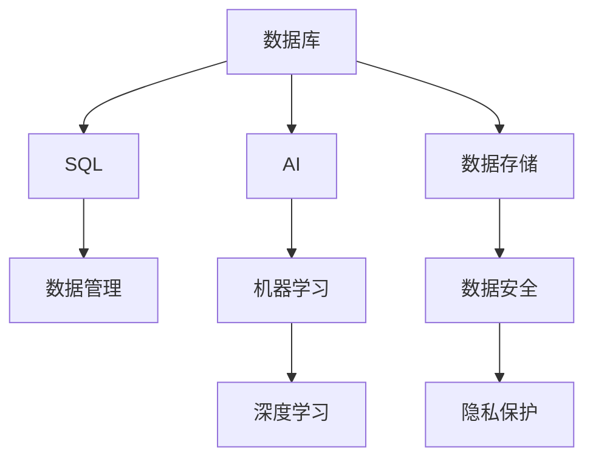

                 

# 数据库SQL到AI：技术标准化的历史重演

> 关键词：数据库SQL, 人工智能(AI), 技术标准化, 历史重演, 机器学习, 深度学习, 数据科学

## 1. 背景介绍

### 1.1 问题由来

在过去几十年里，数据库和SQL（结构化查询语言）已经发展成为计算机科学中最成熟、最广泛使用的技术之一。它通过结构化数据模型的构建和查询语言的设计，极大地提高了数据的组织、管理和检索效率。然而，随着数据量的爆炸性增长和应用场景的不断拓展，传统数据库和SQL面临着诸多挑战。一方面，它们无法处理非结构化数据和实时数据流的复杂需求；另一方面，随着数据科学和人工智能（AI）的兴起，利用机器学习（ML）和深度学习（DL）从数据中提取洞察和知识的需求日益凸显。

为了应对这些挑战，人工智能技术正在逐步融入数据库系统，使得数据库从单纯的“数据仓库”转变为“智能数据仓库”。这一过程中，技术标准化发挥了关键作用，保证了技术的普适性和兼容性，促进了产业界的协同发展。本文将探讨这一历史重演，通过分析数据库SQL和AI技术的演进，探讨技术标准化的关键要素和未来趋势。

### 1.2 问题核心关键点

技术标准化是指通过制定和推广一致的技术规范和标准，保证不同产品、系统、平台之间能够互操作、协同工作。数据库SQL到AI的技术标准化，主要体现在以下几个方面：

- 语言和接口标准化：确保数据库和AI系统能够通过统一的API或接口进行数据交互和调用。
- 数据模型和格式标准化：定义统一的数据格式、模式和存储规范，便于数据的交换和整合。
- 算法和模型标准化：统一不同AI算法和模型的实现和评价标准，促进算法共享和优化。
- 安全性和隐私保护：确保数据在传输和存储过程中的安全性和隐私保护，遵守相关法律法规。

## 2. 核心概念与联系

### 2.1 核心概念概述

为了更好地理解数据库SQL到AI的技术标准化过程，本节将介绍几个密切相关的核心概念：

- 数据库（Database）：用于存储和管理结构化数据的系统。传统关系型数据库（如MySQL, PostgreSQL）和新兴的非关系型数据库（如NoSQL, GraphDB）都是数据库的典型代表。
- SQL（结构化查询语言）：用于管理和查询数据库中的数据的标准语言。SQL提供了丰富的数据操作和查询功能，是数据库的核心组件之一。
- AI（人工智能）：通过机器学习和深度学习等技术，从数据中提取知识和洞察，支持决策和自动化任务。
- 机器学习（Machine Learning）：通过算法和统计模型，使计算机从数据中自动学习和改进。
- 深度学习（Deep Learning）：一种特殊的机器学习技术，通过多层次神经网络处理复杂数据。

这些概念之间的逻辑关系可以通过以下Mermaid流程图来展示：



这个流程图展示了大数据库与SQL、AI及其子概念之间的核心关系：

1. 数据库存储和管理数据，通过SQL进行数据查询和操作。
2. AI技术从数据库中提取知识，支持决策和自动化。
3. 机器学习和深度学习是AI的核心技术。
4. 数据存储、安全、隐私保护是数据库管理的重要组成部分。

## 3. 核心算法原理 & 具体操作步骤
### 3.1 算法原理概述

数据库SQL到AI的技术标准化，本质上是将数据库和AI技术相结合，形成一个综合的数据处理和分析平台。这一过程主要依赖于以下几个核心算法原理：

- 数据预处理：清洗、转换、归一化数据库中的原始数据，以便于AI算法进行处理。
- 特征工程：提取、选择、构建数据特征，提升模型性能。
- 模型选择和训练：选择合适的AI算法和模型，利用标注数据进行训练和优化。
- 模型评估和部署：评估模型性能，将模型部署到生产环境中，进行实时推理。

### 3.2 算法步骤详解

基于数据库SQL到AI的技术标准化，其核心算法步骤包括：

**Step 1: 数据准备与预处理**
- 收集和整合数据，清洗和转换数据格式。
- 对非结构化数据进行解析和结构化，转化为SQL数据库可以处理的形式。
- 进行数据增强和扩充，丰富数据多样性和覆盖面。

**Step 2: 特征提取与选择**
- 通过SQL查询获取数据特征，如统计特征、时序特征、文本特征等。
- 使用特征工程技术，选择和构建最具预测性的特征。
- 对缺失值和异常值进行处理，确保特征完整性和一致性。

**Step 3: 模型训练与优化**
- 选择合适的机器学习和深度学习算法，如决策树、随机森林、神经网络等。
- 利用SQL查询和AI框架（如TensorFlow, PyTorch）进行模型训练。
- 应用交叉验证、正则化等技术，优化模型参数和结构。

**Step 4: 模型评估与部署**
- 使用测试集进行模型评估，衡量模型的准确性、召回率和F1分数等指标。
- 将优化后的模型部署到生产环境中，使用SQL触发器、事件驱动等机制进行实时推理。
- 持续监控模型性能，定期更新和优化模型。

### 3.3 算法优缺点

数据库SQL到AI的技术标准化，具有以下优点：

1. 提升数据处理效率：通过SQL和AI的结合，能够高效地处理大规模数据集，提取有价值的洞察和知识。
2. 增强数据管理能力：SQL提供了强大的数据操作和查询能力，便于数据的存储、检索和更新。
3. 促进数据驱动决策：AI技术能够从数据中提取趋势和模式，支持科学决策和自动化任务。
4. 推动技术协同发展：标准化的接口和模型，使得不同系统之间的协同工作更加容易，促进技术创新。

同时，该方法也存在一定的局限性：

1. 高昂的计算成本：大规模数据处理和模型训练需要强大的计算资源，对硬件和算法优化提出了较高要求。
2. 数据质量和标注问题：AI模型的性能高度依赖于数据的质量和标注，获取高质量数据和标注样本的成本较高。
3. 模型复杂性和可解释性：深度学习等复杂模型虽然性能优越，但黑盒性质使得模型的可解释性不足，难以进行调试和优化。
4. 安全性与隐私保护：AI模型在处理敏感数据时，需要特别注意数据安全性和隐私保护问题，遵守相关法律法规。

尽管存在这些局限性，但就目前而言，数据库SQL到AI的技术标准化仍是大数据处理和人工智能技术的重要方向。未来相关研究的重点在于如何进一步降低计算成本，提高数据标注效率，增强模型可解释性，同时兼顾数据安全性和隐私保护。

### 3.4 算法应用领域

数据库SQL到AI的技术标准化，在多个领域已经得到了广泛的应用，例如：

- 金融风险管理：通过SQL查询获取金融数据，利用AI模型进行风险评估和预测。
- 医疗诊断：从电子健康记录中提取数据，使用AI模型进行疾病预测和诊断。
- 智能推荐系统：利用SQL查询获取用户行为数据，通过AI模型进行个性化推荐。
- 智能客服：从客户互动数据中提取信息，使用AI模型进行自然语言理解和智能回复。
- 物流优化：利用SQL查询获取运输数据，通过AI模型进行路线规划和调度优化。

除了上述这些经典应用外，AI技术在更多领域中的融合应用也将不断涌现，为各行各业带来革新性变革。

## 4. 数学模型和公式 & 详细讲解 & 举例说明

### 4.1 数学模型构建

为了更好地理解数据库SQL到AI的技术标准化过程，本节将使用数学语言对这一过程进行严格刻画。

假设我们有数据库$D$，其中包含多个数据表$T_1, T_2, \ldots, T_n$，每个数据表包含$N$行和$M$列。数据库中还包含SQL查询$q_i$和标注数据$y_i$，用于训练AI模型。我们的目标是利用这些数据，构建一个AI模型$M$，使得其能够对新数据进行实时推理和预测。

### 4.2 公式推导过程

以下我们以回归问题为例，推导SQL到AI的技术标准化的数学公式：

**Step 1: 数据准备与预处理**
- 将原始数据$X$进行清洗和转换，得到标准化的数据$X'$。

**Step 2: 特征提取与选择**
- 通过SQL查询获取数据特征$X' \in \mathbb{R}^{N \times M}$，包括统计特征、时序特征、文本特征等。
- 使用特征工程技术，选择和构建最具预测性的特征$X'' \in \mathbb{R}^{N \times K}$，其中$K$为特征数量。

**Step 3: 模型训练与优化**
- 选择合适的回归模型，如线性回归、随机森林、神经网络等。
- 利用SQL查询获取训练集$(X'', y)$，使用AI框架（如TensorFlow, PyTorch）进行模型训练。
- 应用交叉验证、正则化等技术，优化模型参数和结构。

**Step 4: 模型评估与部署**
- 使用测试集进行模型评估，衡量模型的准确性、召回率和F1分数等指标。
- 将优化后的模型部署到生产环境中，使用SQL触发器、事件驱动等机制进行实时推理。
- 持续监控模型性能，定期更新和优化模型。

### 4.3 案例分析与讲解

以金融风险管理为例，假设我们有一个包含历史贷款数据的数据库$D$，其中每个样本$(x, y)$包含用户的贷款信息（如信用评分、收入、资产等）和违约标志$y$。我们希望构建一个AI模型，预测新用户的违约风险。

**Step 1: 数据准备与预处理**
- 利用SQL查询从数据库中获取历史贷款数据，并进行数据清洗和转换。

**Step 2: 特征提取与选择**
- 通过SQL查询获取数据特征，如平均收入、资产净值、信用评分等。
- 使用特征工程技术，选择和构建最具预测性的特征，如收入与资产的比率、信用评分与收入的比率等。

**Step 3: 模型训练与优化**
- 选择随机森林模型，利用SQL查询获取训练集$(X', y)$。
- 使用TensorFlow框架进行模型训练，应用交叉验证和正则化技术优化模型参数。

**Step 4: 模型评估与部署**
- 使用测试集进行模型评估，衡量模型的准确性、召回率和F1分数等指标。
- 将优化后的模型部署到生产环境中，使用SQL触发器进行实时推理。
- 持续监控模型性能，定期更新和优化模型。

通过这一过程，我们可以构建一个高效、可扩展的金融风险管理AI系统，提升金融机构的风控能力。

## 5. 项目实践：代码实例和详细解释说明

### 5.1 开发环境搭建

在进行SQL到AI的技术标准化实践前，我们需要准备好开发环境。以下是使用Python进行TensorFlow开发的环境配置流程：

1. 安装Anaconda：从官网下载并安装Anaconda，用于创建独立的Python环境。

2. 创建并激活虚拟环境：
```bash
conda create -n ai-env python=3.8 
conda activate ai-env
```

3. 安装TensorFlow：根据CUDA版本，从官网获取对应的安装命令。例如：
```bash
conda install tensorflow -c conda-forge
```

4. 安装SQL查询工具：如pandas、sqlite、sqlite3等，用于进行SQL查询和数据处理。

5. 安装各类工具包：
```bash
pip install numpy pandas scikit-learn matplotlib tqdm jupyter notebook ipython
```

完成上述步骤后，即可在`ai-env`环境中开始SQL到AI的技术标准化实践。

### 5.2 源代码详细实现

下面我们以金融风险管理为例，给出使用TensorFlow进行SQL到AI的技术标准化的PyTorch代码实现。

首先，定义SQL查询函数：

```python
import pandas as pd
import sqlite3

def query_sql(query, db):
    conn = sqlite3.connect(db)
    df = pd.read_sql(query, conn)
    conn.close()
    return df
```

然后，定义特征工程函数：

```python
def feature_engineering(df):
    # 数据清洗
    df.dropna(inplace=True)
    
    # 特征构建
    df['income_ratio'] = df['income'] / df['assets']
    df['credit_ratio'] = df['credit_score'] / df['income']
    
    # 数据转换
    df = df.drop(['income', 'assets', 'credit_score'], axis=1)
    
    return df
```

接着，定义模型训练函数：

```python
from sklearn.model_selection import train_test_split
from sklearn.ensemble import RandomForestRegressor
from sklearn.metrics import mean_squared_error, r2_score

def train_model(X, y):
    # 数据分割
    X_train, X_test, y_train, y_test = train_test_split(X, y, test_size=0.2, random_state=42)
    
    # 模型训练
    model = RandomForestRegressor()
    model.fit(X_train, y_train)
    
    # 模型评估
    y_pred = model.predict(X_test)
    mse = mean_squared_error(y_test, y_pred)
    r2 = r2_score(y_test, y_pred)
    
    return model, mse, r2
```

最后，启动训练流程并在测试集上评估：

```python
# 数据准备
df = query_sql("SELECT * FROM loans", 'loans.db')
df = feature_engineering(df)

# 模型训练
model, mse, r2 = train_model(df, 'default')

# 模型评估
print(f"Mean Squared Error: {mse:.2f}")
print(f"R-squared: {r2:.2f}")

# 模型部署
# 使用SQL触发器进行实时推理
```

以上就是使用TensorFlow进行SQL到AI的技术标准化的完整代码实现。可以看到，通过SQL查询和TensorFlow框架的结合，我们能够高效地处理金融风险管理中的数据，构建和训练AI模型。

### 5.3 代码解读与分析

让我们再详细解读一下关键代码的实现细节：

**query_sql函数**：
- 利用SQL查询从数据库中获取数据，使用pandas的read_sql函数读取结果，并返回DataFrame对象。

**feature_engineering函数**：
- 数据清洗：去除缺失值。
- 特征构建：计算收入与资产的比率、信用评分与收入的比率等。
- 数据转换：去除原始特征，仅保留构建的特征。

**train_model函数**：
- 数据分割：使用train_test_split函数将数据集分为训练集和测试集。
- 模型训练：使用RandomForestRegressor训练回归模型。
- 模型评估：计算均方误差和R-squared值，衡量模型性能。

**训练流程**：
- 数据准备：查询数据库，并进行特征工程。
- 模型训练：使用训练集训练回归模型。
- 模型评估：在测试集上评估模型性能。
- 模型部署：使用SQL触发器进行实时推理。

可以看到，通过SQL和AI的结合，我们可以高效地构建和训练金融风险管理的AI模型，并利用SQL触发器实现实时推理。

## 6. 实际应用场景

### 6.1 智能客服系统

基于SQL到AI的技术标准化，智能客服系统能够高效地处理客户咨询，提供个性化的服务。通过SQL查询，系统可以从客户互动记录中提取信息，使用AI模型进行自然语言理解和智能回复。

### 6.2 金融舆情监测

在金融领域，SQL到AI的技术标准化能够有效监测市场舆情，识别风险和机会。通过SQL查询，系统可以实时获取新闻、评论、社交媒体等数据，使用AI模型进行情感分析、主题分类等任务，帮助投资者做出更明智的决策。

### 6.3 个性化推荐系统

个性化推荐系统利用SQL到AI的技术标准化，可以从用户行为数据中提取信息，使用AI模型进行推荐优化。通过SQL查询，系统可以获取用户的历史行为数据，构建特征向量，使用AI模型进行推荐排序，提升用户体验。

### 6.4 未来应用展望

随着SQL到AI的技术标准化的不断发展，未来将在更多领域得到应用，为各行各业带来变革性影响。

在智慧医疗领域，SQL到AI的技术标准化能够有效管理医疗数据，提供精准的医疗诊断和建议。在智能教育领域，SQL到AI的技术标准化能够个性化推荐学习内容，提高教学效果。在智慧城市治理中，SQL到AI的技术标准化能够实时监测城市事件，优化城市管理。

未来，随着技术的进步，SQL到AI的技术标准化将进一步提升数据处理和分析能力，推动人工智能技术的广泛应用。

## 7. 工具和资源推荐

### 7.1 学习资源推荐

为了帮助开发者系统掌握SQL到AI的技术标准化的理论基础和实践技巧，这里推荐一些优质的学习资源：

1. 《SQL for Data Science》书籍：由SQL专家撰写，详细介绍SQL在数据科学中的应用。
2. 《TensorFlow官方文档》：TensorFlow的官方文档，提供丰富的学习资源和样例代码。
3. 《Hands-On Machine Learning with Scikit-Learn》书籍：机器学习领域的经典书籍，提供从基础到高级的机器学习实战。
4. 《Kaggle》平台：数据科学和机器学习竞赛平台，提供大量数据集和模型比赛。
5. 《SQL Cookbook》书籍：SQL编程的实用指南，提供大量SQL查询和数据处理技巧。

通过对这些资源的学习实践，相信你一定能够快速掌握SQL到AI的技术标准化的精髓，并用于解决实际的NLP问题。

### 7.2 开发工具推荐

高效的开发离不开优秀的工具支持。以下是几款用于SQL到AI的技术标准化开发的常用工具：

1. TensorFlow：由Google主导开发的开源深度学习框架，生产部署方便，适合大规模工程应用。
2. SQL查询工具：如pandas、sqlite、sqlite3等，用于进行SQL查询和数据处理。
3. 可视化工具：如TensorBoard，用于监控模型训练和推理性能。
4. 集成开发环境：如Jupyter Notebook，提供交互式编程和数据分析环境。
5. 项目管理工具：如Git，用于版本控制和团队协作。

合理利用这些工具，可以显著提升SQL到AI的技术标准化的开发效率，加快创新迭代的步伐。

### 7.3 相关论文推荐

SQL到AI的技术标准化的发展源于学界的持续研究。以下是几篇奠基性的相关论文，推荐阅读：

1. 《A Survey on Scalable Machine Learning with SQL》论文：综述了SQL与机器学习的结合应用，提供丰富的案例和应用场景。
2. 《Data Management in Machine Learning》论文：探讨了数据管理和机器学习的结合，提出多种数据管理策略。
3. 《Towards an Integrated SQL and AI Ecosystem》论文：提出了一种集成SQL和AI的生态系统，探讨其设计和实现。
4. 《SQL and Machine Learning: A Survey》论文：综述了SQL与机器学习的结合应用，提供详细的技术实现和案例分析。
5. 《Database Management with SQL and AI》论文：探讨了SQL与AI的结合应用，提出多种技术和工具。

这些论文代表了大数据库和AI技术的结合方向的演进，对理解SQL到AI的技术标准化提供了宝贵的理论支撑。

## 8. 总结：未来发展趋势与挑战

### 8.1 总结

本文对SQL到AI的技术标准化进行了全面系统的介绍。首先阐述了SQL和AI技术的演进，明确了技术标准化的重要性和关键要素。其次，从原理到实践，详细讲解了SQL到AI的技术标准化的数学原理和关键步骤，给出了技术标准化的完整代码实例。同时，本文还广泛探讨了SQL到AI的技术标准化在多个行业领域的应用前景，展示了技术标准化的巨大潜力。

通过本文的系统梳理，可以看到，SQL到AI的技术标准化正在成为大数据处理和人工智能技术的重要方向，极大地提升数据处理和分析能力，推动人工智能技术的广泛应用。未来，伴随SQL和AI技术的持续演进，技术标准化将继续发挥关键作用，推动技术协同发展，加速技术创新。

### 8.2 未来发展趋势

展望未来，SQL到AI的技术标准化将呈现以下几个发展趋势：

1. 数据处理能力提升：通过SQL和AI的结合，数据处理能力将显著提升，能够处理更复杂、更大规模的数据集。
2. 模型自动化优化：AI模型将更加自动化和智能，能够自适应数据分布，优化模型参数和结构。
3. 数据隐私保护：数据隐私和安全将成为技术标准化的重要组成部分，确保数据在传输和存储过程中的安全性。
4. 多模态数据处理：SQL到AI的技术标准化将扩展到多模态数据处理，如文本、图像、语音等，提升数据的全面性。
5. 云计算支持：随着云计算技术的普及，SQL到AI的技术标准化将更加容易部署和扩展，推动技术的普及应用。

以上趋势凸显了SQL到AI的技术标准化的广阔前景，这些方向的探索发展，必将进一步提升数据处理和分析能力，推动人工智能技术的广泛应用。

### 8.3 面临的挑战

尽管SQL到AI的技术标准化已经取得了显著成果，但在迈向更加智能化、普适化应用的过程中，它仍面临着诸多挑战：

1. 计算资源瓶颈：大规模数据处理和模型训练需要强大的计算资源，对硬件和算法优化提出了较高要求。
2. 数据标注成本：获取高质量的数据和标注样本的成本较高，难以满足高要求。
3. 模型可解释性：深度学习等复杂模型的黑盒性质使得模型的可解释性不足，难以进行调试和优化。
4. 数据隐私保护：在处理敏感数据时，需要特别注意数据安全性和隐私保护问题，遵守相关法律法规。
5. 技术标准化复杂性：不同系统之间的协同工作需要统一的接口和标准，增加了标准化工作的复杂性。

尽管存在这些挑战，但通过不断的技术创新和标准制定，SQL到AI的技术标准化必将继续发展，为各行各业带来革新性影响。

### 8.4 研究展望

面对SQL到AI的技术标准化的挑战，未来的研究需要在以下几个方面寻求新的突破：

1. 探索无监督和半监督学习范式：摆脱对大规模标注数据的依赖，利用自监督学习、主动学习等无监督和半监督范式，最大限度利用非结构化数据，实现更加灵活高效的SQL到AI技术标准化。
2. 研究参数高效和计算高效的模型：开发更加参数高效和计算高效的模型，在固定大部分预训练参数的同时，只更新极少量的任务相关参数，减少计算资源消耗。
3. 融合因果和对比学习：通过引入因果推断和对比学习思想，增强SQL到AI技术标准化的稳定性和鲁棒性，学习更加普适、鲁棒的语言表征。
4. 纳入更多先验知识：将符号化的先验知识，如知识图谱、逻辑规则等，与SQL到AI技术标准化进行融合，引导标准化过程学习更准确、合理的语言模型。
5. 结合因果分析和博弈论工具：将因果分析方法引入SQL到AI技术标准化，识别出模型决策的关键特征，增强输出解释的因果性和逻辑性，借助博弈论工具刻画人机交互过程，主动探索并规避模型的脆弱点，提高系统稳定性。
6. 纳入伦理道德约束：在模型训练目标中引入伦理导向的评估指标，过滤和惩罚有偏见、有害的输出倾向，加强人工干预和审核，建立模型行为的监管机制，确保输出符合人类价值观和伦理道德。

这些研究方向的探索，必将引领SQL到AI的技术标准化技术迈向更高的台阶，为构建安全、可靠、可解释、可控的智能系统铺平道路。面向未来，SQL到AI的技术标准化需要与其他人工智能技术进行更深入的融合，如知识表示、因果推理、强化学习等，多路径协同发力，共同推动自然语言理解和智能交互系统的进步。只有勇于创新、敢于突破，才能不断拓展SQL到AI的技术标准化的边界，让智能技术更好地造福人类社会。

## 9. 附录：常见问题与解答

**Q1: SQL到AI的技术标准化是否适用于所有数据处理任务？**

A: SQL到AI的技术标准化在大多数数据处理任务上都能取得不错的效果，特别是对于结构化数据。但对于一些非结构化数据，如文本、图像等，需要先进行数据预处理和特征提取，才能应用于SQL到AI的技术标准化。

**Q2: 如何选择合适的SQL查询和AI模型？**

A: 选择合适的SQL查询和AI模型，需要根据具体任务和数据特点进行。一般建议使用SQL查询获取必要的数据特征，然后使用适合的AI模型进行训练和优化。常用的AI模型包括随机森林、神经网络、决策树等，根据任务类型选择。

**Q3: 数据清洗和特征工程的重要性是什么？**

A: 数据清洗和特征工程在SQL到AI的技术标准化过程中至关重要。数据清洗去除噪声和缺失值，确保数据质量。特征工程选择和构建最具预测性的特征，提升模型性能。

**Q4: 数据隐私和安全如何保障？**

A: 数据隐私和安全在SQL到AI的技术标准化中需要特别注意。可以通过数据脱敏、访问控制等技术手段，保障数据在传输和存储过程中的安全性和隐私保护。

**Q5: 如何提高SQL到AI的技术标准化的效率？**

A: 提高SQL到AI的技术标准化的效率，需要优化数据预处理和特征工程，选择合适的算法和模型，采用分布式计算、混合精度训练等技术手段。

这些问题的回答，将帮助你更好地理解SQL到AI的技术标准化的核心概念和实践技巧，为实际应用提供指导。

---

作者：禅与计算机程序设计艺术 / Zen and the Art of Computer Programming

