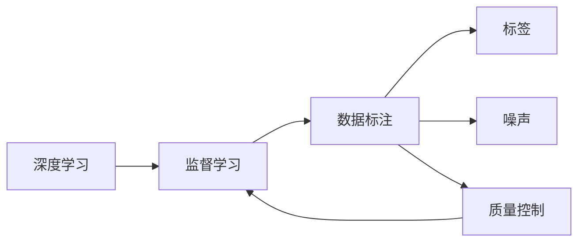
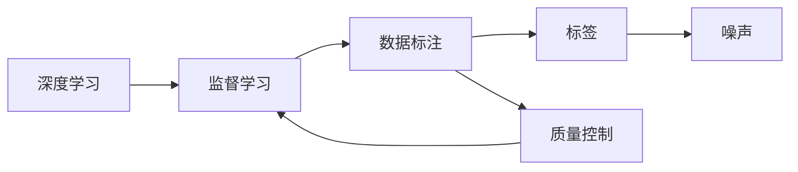

                 

# 数据标注：人工智能背后的无名英雄

> 关键词：数据标注, 人工智能, 深度学习, 计算机视觉, 自然语言处理, 监督学习, 标签, 噪声, 质量控制

## 1. 背景介绍

在人工智能(AI)领域，深度学习算法被誉为最具革命性的创新，并已经在图像识别、语音识别、自然语言处理等众多领域取得了突破性的进展。然而，任何先进算法的背后，都离不开大量高质量的标注数据。数据标注，即通过人工对数据集中的样本进行标记和注释，为深度学习算法提供监督信号，使其能够从大量数据中学习到泛化性强的模型。尽管数据标注看似简单，但却是一个耗时耗力、成本巨大的工作，常常被忽视，但却是确保算法性能的关键环节。本文将深入探讨数据标注的重要性，以及其在人工智能领域的具体应用。

## 2. 核心概念与联系

### 2.1 核心概念概述

为了更好地理解数据标注在AI中的应用，本节将介绍几个关键概念及其相互关系：

- **深度学习(Deep Learning)**：基于人工神经网络的机器学习方法，通过多层非线性变换，自动从数据中学习特征表示，从而进行分类、回归等任务。

- **监督学习(Supervised Learning)**：通过带有标签的训练数据进行模型训练的机器学习范式。标注数据为模型提供了监督信号，指导其学习目标任务的特征表示。

- **数据标注(Data Annotation)**：人工对数据集中的样本进行标记和注释，以形成训练集，供模型学习。标签可以是分类、回归、边界框、关键点等形式。

- **标签(Label)**：数据标注的核心对象，指代对样本的分类、分类概率、数值等属性的描述。标签的质量直接影响深度学习的学习效果。

- **噪声(Noise)**：数据标注中的错误或不完整信息，可能导致模型学习到错误的特征表示。

- **质量控制(Quality Control)**：对数据标注进行审核、校验和修正，以确保标注数据的准确性和一致性。

这些概念之间的关系可以通过以下Mermaid流程图来展示：



这个流程图展示了深度学习、监督学习、数据标注、标签、噪声和质量控制之间的逻辑关系：

1. 深度学习算法通过监督学习来训练模型，而监督学习的核心是标注数据。
2. 数据标注是生成标注数据的过程，标签是标注数据的关键部分。
3. 噪声和质量控制是数据标注过程中需要考虑的重要因素。
4. 质量控制确保标注数据的准确性和一致性，间接影响监督学习的效果。

### 2.2 核心概念原理和架构的 Mermaid 流程图



这个流程图帮助理解深度学习和数据标注之间的依赖关系，以及噪声和质量控制在数据标注中的重要性。

## 3. 核心算法原理 & 具体操作步骤

### 3.1 算法原理概述

在深度学习中，标注数据是确保模型泛化能力的关键。数据标注的过程，本质上是对样本的特征进行分类或标注，形成二元组$(x, y)$，其中$x$表示样本的特征向量，$y$表示对应的标签。模型通过最小化损失函数$\mathcal{L}(\theta, x, y)$来优化参数$\theta$，使其能够准确预测标签$y$。

基于监督学习的深度学习模型通常使用交叉熵损失函数来计算预测值与真实标签之间的差异，其形式为：

$$
\mathcal{L}(\theta, x, y) = -\sum_{i=1}^{n}y_i \log \hat{y}_i
$$

其中$n$为输出层的大小，$y_i$为真实标签，$\hat{y}_i$为模型预测的概率值。

### 3.2 算法步骤详解

深度学习模型通常通过以下几个步骤进行数据标注：

**Step 1: 数据收集和准备**
- 收集与任务相关的数据，包括图像、文本、语音等。
- 对数据进行清洗、去重、扩充等预处理，确保数据的质量和多样性。

**Step 2: 数据标注**
- 根据任务需求，定义标签的类别和表示方式。
- 对数据集中的每个样本进行人工标注，生成标注数据。
- 使用标注工具和平台，提高标注效率和质量。

**Step 3: 质量控制**
- 对标注数据进行审核和校验，检查标注的准确性和一致性。
- 使用质量控制工具，如统计抽样、自动检测等，发现和修正标注中的错误。
- 根据质量控制结果，对标注数据进行修正或重新标注。

**Step 4: 模型训练和验证**
- 将标注数据划分为训练集、验证集和测试集。
- 使用训练集训练深度学习模型。
- 在验证集上评估模型性能，优化模型参数。
- 在测试集上评估模型泛化能力。

### 3.3 算法优缺点

深度学习模型的数据标注过程，既有其优势，也存在一些不足：

**优点**：
- 提高模型泛化能力：标注数据为模型提供了监督信号，使其能够学习到更准确的特征表示。
- 促进知识共享：标注数据可以作为公共数据集，供多个研究团队共享和使用。
- 提高算法可靠性：通过严格的标注和质量控制，可以减少算法中的噪声和错误。

**缺点**：
- 成本高：数据标注需要大量人工，成本较高，且耗时较长。
- 依赖标注质量：标注数据中的错误和噪声可能导致模型学习到错误的特征，影响性能。
- 数据隐私问题：标注数据中可能包含敏感信息，需要严格保护和匿名化。

尽管存在这些缺点，但数据标注在深度学习中的应用仍然是必不可少的，只有高质量的标注数据，才能确保算法的可靠性和性能。

### 3.4 算法应用领域

数据标注技术广泛应用于各种AI应用场景，包括但不限于：

- **计算机视觉**：图像分类、目标检测、人脸识别、图像分割等。
- **自然语言处理**：文本分类、命名实体识别、情感分析、机器翻译等。
- **语音识别**：语音转文本、说话人识别、情感识别等。
- **生物信息学**：基因序列标注、蛋白质结构预测、医学影像分析等。
- **推荐系统**：商品推荐、新闻推荐、个性化搜索等。

## 4. 数学模型和公式 & 详细讲解 & 举例说明

### 4.1 数学模型构建

数据标注的数学模型通常包括以下几个部分：

- **样本空间**：$x \in \mathcal{X}$，表示样本的特征向量。
- **标签空间**：$y \in \mathcal{Y}$，表示样本的标签。
- **损失函数**：$\mathcal{L}(\theta, x, y)$，表示模型预测值与真实标签之间的差异。
- **优化目标**：$\min_{\theta} \mathcal{L}(\theta, x, y)$，表示最小化损失函数以优化模型参数$\theta$。

### 4.2 公式推导过程

以二分类问题为例，假设模型预测值$\hat{y}$和真实标签$y$的关系为$\hat{y} = f_{\theta}(x)$，其中$f_{\theta}$为模型的参数化函数，则交叉熵损失函数可表示为：

$$
\mathcal{L}(\theta, x, y) = -y \log \hat{y} - (1-y) \log (1-\hat{y})
$$

通过最小化该损失函数，模型能够学习到更准确的预测概率。在实践中，通常使用梯度下降等优化算法来求解该优化问题。

### 4.3 案例分析与讲解

以目标检测为例，假设标签为边界框，标注数据的形式为$(x, y, b)$，其中$x$为图像位置，$y$为类别标签，$b$为边界框坐标。假设模型预测值为$\hat{b}$，则目标检测模型的损失函数可表示为：

$$
\mathcal{L}(\theta, x, y, b) = \sum_{i=1}^{n} \mathbb{1}(y_i = b_i) \cdot \mathcal{L}_{box}(\theta, x, y, b)
$$

其中$\mathbb{1}$表示示性函数，$\mathcal{L}_{box}$为边界框回归损失函数。通过最小化该损失函数，模型能够学习到更准确的边界框位置和大小。

## 5. 项目实践：代码实例和详细解释说明

### 5.1 开发环境搭建

在进行数据标注的开发实践前，我们需要准备好开发环境。以下是使用Python进行深度学习开发的环境配置流程：

1. 安装Anaconda：从官网下载并安装Anaconda，用于创建独立的Python环境。

2. 创建并激活虚拟环境：
```bash
conda create -n pytorch-env python=3.8 
conda activate pytorch-env
```

3. 安装PyTorch：根据CUDA版本，从官网获取对应的安装命令。例如：
```bash
conda install pytorch torchvision torchaudio cudatoolkit=11.1 -c pytorch -c conda-forge
```

4. 安装TensorFlow：
```bash
pip install tensorflow
```

5. 安装PIL：
```bash
pip install Pillow
```

6. 安装matplotlib：
```bash
pip install matplotlib
```

完成上述步骤后，即可在`pytorch-env`环境中开始数据标注的实践。

### 5.2 源代码详细实现

下面以目标检测为例，给出使用TensorFlow进行目标检测数据标注的Python代码实现。

```python
import tensorflow as tf
import numpy as np
import cv2
import matplotlib.pyplot as plt

class TargetDetection:
    def __init__(self, model, num_classes):
        self.model = model
        self.num_classes = num_classes

    def preprocess_image(self, image):
        image = cv2.resize(image, (640, 640))
        image = tf.image.convert_image_dtype(image, tf.float32)
        image = np.expand_dims(image, axis=0)
        return image

    def predict(self, image):
        image = self.preprocess_image(image)
        predictions = self.model.predict(image)
        return predictions

    def display_results(self, image, predictions):
        predictions = np.argmax(predictions, axis=1).flatten()
        for i in range(len(predictions)):
            if predictions[i] != 0:
                ymin, xmin, ymax, xmax = predictions[i]
                plt.rectangle((xmin, ymin), (xmax, ymax), fill=False, color='red')
        plt.imshow(cv2.cvtColor(image, cv2.COLOR_BGR2RGB))
        plt.show()

# 加载模型
model = tf.keras.models.load_model('target_detection_model.h5')

# 加载数据集
data = np.load('target_detection_data.npy')

# 循环遍历数据集
for i in range(len(data)):
    image = data[i]
    predictions = self.predict(image)
    self.display_results(image, predictions)
```

这段代码实现了使用TensorFlow进行目标检测数据标注的完整流程。

### 5.3 代码解读与分析

让我们再详细解读一下关键代码的实现细节：

**TargetDetection类**：
- `__init__`方法：初始化模型和类别数量。
- `preprocess_image`方法：对图像进行预处理，包括缩放、归一化和转置等操作，准备好输入模型的格式。
- `predict`方法：使用模型进行预测，并返回预测结果。
- `display_results`方法：对预测结果进行可视化，展示检测框和标注结果。

**预处理和预测流程**：
- 对输入图像进行预处理，包括缩放和归一化，使其符合模型输入要求。
- 使用模型进行预测，返回预测结果。
- 将预测结果可视化，展示检测框和标注结果。

**数据标注流程**：
- 加载预训练的模型和数据集。
- 循环遍历数据集中的每张图像，进行预测并展示结果。
- 该代码中使用了简单的可视化方法，展示了目标检测的实时效果。

### 5.4 运行结果展示

运行上述代码后，可以在图像上直观地看到目标检测的实时结果，如图像中的检测框和标注类别。这有助于标注员检查和修正检测结果，提高数据标注的质量。

## 6. 实际应用场景

### 6.1 计算机视觉

数据标注在计算机视觉领域的应用非常广泛，如目标检测、人脸识别、图像分割等。在这些任务中，标注数据的质量直接影响模型的性能。例如，在目标检测中，标注数据需要包含详细的边界框信息和类别标签，以确保模型能够准确地定位和识别目标。

### 6.2 自然语言处理

自然语言处理(NLP)领域也离不开高质量的标注数据。如文本分类、命名实体识别、情感分析等任务，都需要对文本进行细致的标注。标注员需要理解文本的上下文，准确地标注出文本的分类、实体和情感等信息。

### 6.3 语音识别

在语音识别领域，标注数据通常包括语音转文本的文本和语音的标签。标注员需要听取录音，并准确地识别出文本和语音之间的对应关系。这要求标注员具备一定的语音处理和文本处理能力。

### 6.4 生物信息学

生物信息学领域的数据标注任务通常涉及基因序列、蛋白质结构等信息的标注。这些任务的标注数据往往需要专业知识和丰富的经验，标注员需要具备相应的生物背景和技能。

### 6.5 推荐系统

在推荐系统领域，数据标注主要涉及商品标签的标注。标注员需要理解商品的属性和特点，准确地标注出商品的类型和分类，以帮助推荐算法更好地理解用户需求。

## 7. 工具和资源推荐

### 7.1 学习资源推荐

为了帮助开发者系统掌握数据标注的理论基础和实践技巧，这里推荐一些优质的学习资源：

1. **《深度学习入门：基于Python的理论与实现》**：该书详细介绍了深度学习的基本原理和实践技巧，包括数据标注、模型训练、优化方法等内容。

2. **Kaggle平台**：Kaggle是一个数据科学竞赛平台，提供了大量标注数据集和数据标注工具，是学习和实践数据标注的好地方。

3. **《数据标注的理论与实践》**：该书详细介绍了数据标注的基本概念和实践方法，包括标注数据的质量控制、标注工具和平台等。

4. **Labelbox平台**：Labelbox是一个数据标注平台，提供了丰富的标注工具和协作机制，帮助标注员高效地完成数据标注任务。

5. **COCO数据集**：COCO是一个大规模计算机视觉数据集，提供了详细的标注规范和标注工具，是计算机视觉领域的数据标注标准。

通过对这些资源的学习实践，相信你一定能够快速掌握数据标注的精髓，并用于解决实际的AI问题。

### 7.2 开发工具推荐

高效的开发离不开优秀的工具支持。以下是几款用于数据标注开发的常用工具：

1. **Labelbox**：提供丰富的标注工具和协作机制，支持多种数据格式和标注任务，适合团队协作和数据标注。
2. **VGG Image Annotator (VIA)**：一个基于GUI的图像标注工具，支持绘制边界框、标注类别等多种标注方式。
3. **RectLabel**：一个开源的图像标注工具，支持多种标注任务和数据格式，适合小规模数据标注。
4. **LabelImg**：一个基于GUI的图像标注工具，支持标注边界框、多边形等多种标注方式，支持多标签标注。
5. **Labelbox Python SDK**：提供Python API接口，方便在代码中集成标注功能。

合理利用这些工具，可以显著提升数据标注的效率，减少人工成本，确保标注数据的质量。

### 7.3 相关论文推荐

数据标注技术的发展源于学界的持续研究。以下是几篇奠基性的相关论文，推荐阅读：

1. **《ImageNet Large Scale Visual Recognition Challenge》**：介绍ImageNet大规模视觉识别竞赛，强调标注数据对模型性能的重要性。

2. **《Data Augmentation for Deep Learning: A Review》**：详细介绍了数据增强和扩充的方法，帮助提高数据标注的效率和质量。

3. **《Quality Evaluation and Control in Annotated Datasets》**：讨论了标注数据的质量控制方法，提出了多种评估指标和修正策略。

4. **《Efficient and Effective Data Augmentation for Deep Learning》**：介绍了一系列高效的数据增强技术，帮助提高数据标注的质量和效率。

5. **《Object Detection with ROI Pooling》**：讨论了目标检测中的区域池化方法，提高了模型的检测精度和效率。

这些论文代表了大数据标注技术的发展脉络，是理解数据标注方法和应用场景的重要参考资料。

## 8. 总结：未来发展趋势与挑战

### 8.1 总结

本文对数据标注在AI中的应用进行了全面系统的介绍。首先阐述了数据标注的重要性，明确了其在深度学习中的关键作用。其次，从原理到实践，详细讲解了数据标注的数学模型和操作步骤，给出了数据标注任务开发的完整代码实例。同时，本文还广泛探讨了数据标注在计算机视觉、自然语言处理、语音识别、生物信息学和推荐系统等众多领域的具体应用，展示了数据标注技术的广阔前景。此外，本文精选了数据标注技术的各类学习资源，力求为读者提供全方位的技术指引。

通过本文的系统梳理，可以看到，数据标注在AI中的应用场景非常广泛，是确保算法性能和可靠性的关键环节。未来，伴随深度学习算法的不断发展，数据标注技术也将迎来更多的创新和突破，推动AI技术在更多领域落地应用。

### 8.2 未来发展趋势

展望未来，数据标注技术将呈现以下几个发展趋势：

1. **自动化标注**：通过引入AI技术，如深度学习、生成对抗网络等，实现部分标注任务的自动化，减少人工成本和错误率。
2. **众包标注**：利用众包平台，将标注任务分散到全球各地的标注员手中，提高标注数据的多样性和覆盖率。
3. **半监督标注**：结合无标注数据和少量有标注数据，利用半监督学习技术，提高标注数据的覆盖率和质量。
4. **多模态标注**：将图像、文本、语音等多种数据格式结合起来，进行联合标注，提高标注数据的多样性和准确性。
5. **数据生成和增强**：通过数据生成和增强技术，如GAN、VAE等，生成更多的标注数据，提高数据标注的效率和质量。
6. **标签语义关联**：将标注数据与外部知识库、规则库等专家知识结合起来，进行联合标注，提高标注数据的准确性和一致性。

这些趋势凸显了数据标注技术的不断进步，将为AI技术的落地应用提供更强大的数据支持。

### 8.3 面临的挑战

尽管数据标注技术已经取得了显著进展，但在迈向更加智能化、普适化应用的过程中，仍面临以下挑战：

1. **标注成本高**：高质量的标注数据需要大量的人工和时间成本，随着数据量的增加，成本将进一步提高。
2. **数据质量不稳定**：标注数据中的错误和不一致性可能影响模型的性能，需要严格的审核和修正。
3. **数据隐私问题**：标注数据中可能包含敏感信息，需要严格的保护和匿名化措施。
4. **标注数据分布不均**：不同领域的标注数据分布不均，可能导致模型在不同领域上的表现不一致。
5. **标注工具和技术不足**：现有的标注工具和技术可能难以满足复杂、多样化的标注需求。

这些挑战需要业界共同努力，探索更加高效、可靠的数据标注方法和技术，推动AI技术的进一步发展。

### 8.4 研究展望

面对数据标注所面临的挑战，未来的研究需要在以下几个方面寻求新的突破：

1. **引入AI技术**：通过引入深度学习、生成对抗网络等AI技术，实现部分标注任务的自动化，提高标注效率和准确性。
2. **利用无监督和半监督学习**：结合无标注数据和少量有标注数据，利用半监督学习技术，提高标注数据的覆盖率和质量。
3. **多模态联合标注**：将图像、文本、语音等多种数据格式结合起来，进行联合标注，提高标注数据的多样性和准确性。
4. **数据生成和增强**：通过数据生成和增强技术，如GAN、VAE等，生成更多的标注数据，提高数据标注的效率和质量。
5. **数据隐私保护**：利用隐私保护技术，如差分隐私、联邦学习等，保护标注数据中的敏感信息。
6. **标注工具和平台**：开发更加灵活、高效、易用的标注工具和平台，支持多样化的标注任务和数据格式。

这些研究方向的探索，将推动数据标注技术向更高的水平迈进，为AI技术的落地应用提供更加坚实的数据基础。

## 9. 附录：常见问题与解答

**Q1：数据标注过程中如何确保标注数据的质量？**

A: 确保标注数据的质量需要从多个方面入手：
1. 标注工具：选择高质量的标注工具，如Labelbox、VIA等，提高标注效率和准确性。
2. 标注员培训：对标注员进行专业培训，提高其标注能力和一致性。
3. 质量控制：建立严格的质量控制机制，对标注数据进行审核和校验，发现和修正标注中的错误。
4. 多轮审核：多次审核标注数据，确保标注的准确性和一致性。

**Q2：如何优化标注数据的多样性和覆盖率？**

A: 优化标注数据的多样性和覆盖率可以通过以下方法：
1. 数据收集：尽可能收集多样化的数据，覆盖不同的场景和应用。
2. 数据增强：利用数据增强技术，如旋转、缩放、随机噪声等，生成更多的标注数据。
3. 众包标注：利用众包平台，将标注任务分散到全球各地的标注员手中，提高标注数据的多样性和覆盖率。
4. 多模态联合标注：将图像、文本、语音等多种数据格式结合起来，进行联合标注，提高标注数据的多样性和准确性。

**Q3：数据标注过程中需要注意哪些隐私保护措施？**

A: 数据标注过程中需要注意以下隐私保护措施：
1. 数据匿名化：对标注数据进行匿名化处理，保护标注员的身份和隐私。
2. 数据加密：对标注数据进行加密处理，防止数据泄露和非法访问。
3. 差分隐私：利用差分隐私技术，保护标注数据中的敏感信息。
4. 数据分割：将标注数据分割成不同的数据集，防止单一数据集被滥用。

**Q4：数据标注过程中如何引入AI技术？**

A: 引入AI技术可以通过以下方法：
1. 深度学习：利用深度学习技术，如CNN、RNN等，自动标注图像、文本等数据。
2. 生成对抗网络：利用生成对抗网络，生成更多的标注数据，提高数据标注的效率和质量。
3. 半监督学习：结合无标注数据和少量有标注数据，利用半监督学习技术，提高标注数据的覆盖率和质量。

这些措施可以帮助提高数据标注的效率和准确性，推动AI技术的进一步发展。

