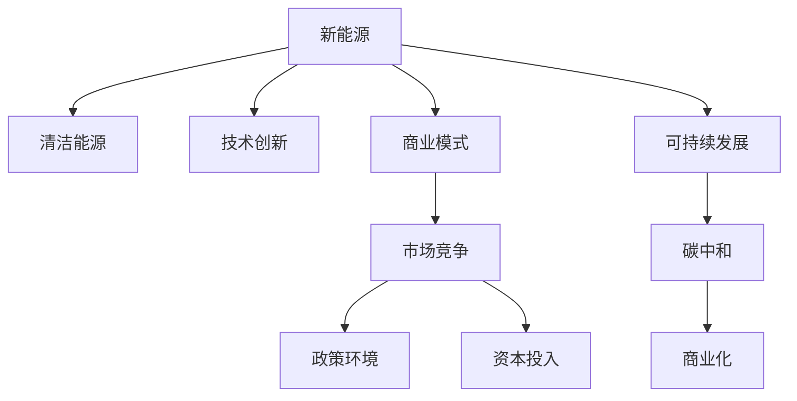

                 

# 新能源创业：清洁能源的商业化之路

> 关键词：
- 新能源
- 清洁能源
- 商业化
- 可持续发展
- 碳中和
- 技术创新
- 商业模式

## 1. 背景介绍

### 1.1 问题由来

随着全球气候变化日益加剧，国际社会对减排和应对气候变化的要求越来越高。各国政府相继出台了一系列政策和措施，推动新能源和清洁能源的发展。中国作为全球最大的能源消费国，也在积极响应这一全球趋势，提出“双碳”目标（碳达峰、碳中和），即在2030年前碳排放达到峰值，2060年前实现碳中和。

在国家政策的引导和市场需求推动下，新能源和清洁能源行业迎来了快速发展机遇。投资机构的关注、企业家的热情，以及消费者对绿色环保的认同，都为新能源创业提供了坚实的土壤。但与此同时，新能源创业面临的挑战也不容忽视，如何平衡技术、市场、资金等多重因素，实现商业化落地，成为了行业内的共同课题。

### 1.2 问题核心关键点

本文聚焦于新能源创业的商业化路径，围绕技术创新、商业模式、市场竞争、政策环境、资本投入等关键问题展开讨论，通过案例分析、模型推导、代码实践等多维度的剖析，为读者提供全方位的新能源创业指导。

## 2. 核心概念与联系

### 2.1 核心概念概述

为了更好地理解新能源创业的商业化之路，本节将介绍几个紧密相关的核心概念：

- **新能源**：利用可再生能源或低碳能源进行生产、发电和消费的能源形态，如风能、太阳能、水能、生物质能等。
- **清洁能源**：对环境影响较小，不产生二氧化碳等温室气体排放的能源，如风能、太阳能、水能、生物质能、核能等。
- **商业化**：将科研成果或技术转化为有市场竞争力的产品和服务，实现从研发到市场的全链条发展。
- **可持续发展**：在满足当前需求的同时，不损害后代满足自身需求的能力。
- **碳中和**：通过节能减排、森林碳汇等手段，使得二氧化碳排放与吸收达到平衡，实现零碳排放。
- **技术创新**：通过引入新技术、新材料、新工艺等手段，提高能源效率，降低成本。
- **商业模式**：包括产品定位、价格策略、销售渠道、客户服务等要素，是实现商业化落地的关键。
- **市场竞争**：新能源领域市场竞争激烈，如何构建差异化竞争优势，获取市场份额，是创业成功的关键。
- **政策环境**：政府政策对新能源的发展具有重要影响，如何利用政策红利，获取资金支持，是创业的重要外部条件。
- **资本投入**：新能源项目通常需要大规模资金支持，如何吸引投资者，获取资金，是创业的关键。

这些核心概念之间的逻辑关系可以通过以下Mermaid流程图来展示：



这个流程图展示了几大核心概念及其之间的关系：

1. 新能源和清洁能源通过技术创新提高效率和降低成本。
2. 商业模式决定了产品的市场定位和销售策略。
3. 市场竞争决定了产品在市场中的竞争力和市场份额。
4. 政策环境和资本投入为新能源创业提供了外部条件。
5. 可持续发展是新能源发展的长期目标，碳中和是实现这一目标的重要手段。
6. 商业化是将技术转化为市场产品的全链条过程。

这些概念共同构成了新能源创业的宏观框架，帮助创业者全面把握行业发展趋势和关键要素。

## 3. 核心算法原理 & 具体操作步骤
### 3.1 算法原理概述

新能源创业的商业化之路，本质上是一个复杂的系统工程，涉及技术、市场、政策、资金等多个维度的协同运作。本节将从算法原理的角度，阐述实现商业化的关键步骤和方法。

### 3.2 算法步骤详解

新能源创业的商业化可以分为以下几个关键步骤：

**Step 1: 市场调研与需求分析**
- 调研目标市场的需求、规模、增长趋势等，识别市场机会。
- 分析竞争对手的产品、价格、营销策略等，制定差异化竞争策略。

**Step 2: 技术选型与研发**
- 根据市场需求和技术趋势，选择合适的技术路线。
- 构建研发团队，进行技术研发和产品设计。
- 进行实验室测试，验证技术的可行性和产品的可靠性。

**Step 3: 商业计划制定**
- 制定商业计划书，包括市场分析、产品定位、营销策略、财务预算等。
- 进行市场验证，通过最小可行产品(MVP)获取早期用户反馈。
- 根据反馈调整商业计划，优化产品和服务。

**Step 4: 商业模式构建**
- 设计合理的商业模式，如B2B、B2C、C2C等。
- 确定盈利模式，如订阅、销售、广告等。
- 制定价格策略，如固定价格、动态定价等。

**Step 5: 资金筹集与投资**
- 制定融资计划，选择合适的融资渠道，如风险投资、政府基金、众筹等。
- 进行商业演示和路演，吸引投资者的关注和资金。
- 利用融资资金进行技术迭代和市场推广。

**Step 6: 市场推广与销售**
- 制定市场推广策略，如线上广告、社交媒体、内容营销等。
- 建立销售渠道，如直销、经销商、电商等。
- 通过销售和服务团队，提升品牌知名度和用户满意度。

**Step 7: 持续优化与迭代**
- 根据市场反馈，持续优化产品和服务。
- 进行市场分析和预测，调整市场策略。
- 进行产品迭代和技术升级，保持市场竞争力。

### 3.3 算法优缺点

新能源创业的商业化方法具有以下优点：

1. **技术驱动**：通过技术创新提升产品性能和降低成本，满足市场需求。
2. **市场导向**：通过市场调研和需求分析，制定切实可行的商业计划和策略。
3. **资金保障**：通过融资渠道获取资金支持，缓解创业初期的资金压力。
4. **持续优化**：通过市场反馈和数据分析，不断优化产品和服务，提升市场竞争力。

同时，这种方法也存在以下局限性：

1. **高风险**：技术创新存在不确定性，市场需求可能发生变化，可能导致创业失败。
2. **资金需求大**：新能源项目通常需要大规模资金投入，初期资金压力较大。
3. **市场竞争激烈**：新能源行业竞争激烈，需要具备较强的市场竞争力和资源整合能力。
4. **政策依赖性**：政策环境变化可能对项目产生重大影响，需要灵活应对政策变化。

尽管存在这些局限性，但整体而言，技术驱动和市场导向的商业化方法仍然是当前新能源创业的主流选择。未来相关研究的重点在于如何进一步降低技术风险，优化融资渠道，提升市场适应性，以及强化政策应对能力。

### 3.4 算法应用领域

基于上述商业化方法，新能源创业已经在能源、交通、建筑等多个领域得到广泛应用，取得了显著的成效：

- **能源**：发展风能、太阳能等可再生能源，减少化石能源依赖，提升能源安全。
- **交通**：推广新能源汽车，如电动汽车、氢燃料电池车等，减少碳排放。
- **建筑**：推广节能建筑材料和系统，如太阳能光伏板、地热泵等，提升建筑能效。
- **农业**：应用智能农业设备，提高农业生产效率，减少资源浪费。

除了这些传统领域外，新能源创业还正在拓展到更多新兴领域，如智慧能源、智能电网、绿色金融等，为经济社会可持续发展提供新的动力。

## 4. 数学模型和公式 & 详细讲解 & 举例说明

### 4.1 数学模型构建

新能源创业的商业化过程涉及多个变量和参数，可以构建数学模型进行优化。以下是一个简化的数学模型示例：

设新能源项目在t年的投资成本为 $C_t$，运营成本为 $O_t$，市场销售收入为 $R_t$，市场推广费用为 $P_t$，政府补贴为 $S_t$，净利润为 $P_t$，则净利润 $P_t$ 的表达式为：

$$
P_t = R_t - C_t - O_t - P_t
$$

其中：

- $R_t = r \times \text{销售量}$
- $\text{销售量} = f(\text{市场规模}, \text{市场增长率}, \text{市场渗透率})$
- $r$ 为产品单价
- $C_t$ 为总成本
- $O_t = O_t \times \text{运营效率}$
- $P_t$ 为市场推广费用
- $S_t$ 为政府补贴

### 4.2 公式推导过程

以下是 $P_t$ 表达式推导过程：

1. **市场规模和增长率**
   设市场规模为 $M_0$，市场增长率为 $g$，则市场规模在t年的表达式为：

   $$
   M_t = M_0 \times (1 + g)^t
   $$

2. **市场渗透率和产品单价**
   设市场渗透率为 $\alpha$，产品单价为 $r$，则市场销售量表达式为：

   $$
   \text{销售量} = M_t \times \alpha \times r
   $$

3. **运营成本和效率**
   设总成本为 $C_0$，运营效率为 $\eta$，则运营成本表达式为：

   $$
   O_t = C_0 \times (1 - \eta)^t
   $$

4. **市场推广费用和政府补贴**
   设市场推广费用为 $P_0$，政府补贴为 $S_0$，则市场推广费用和政府补贴表达式为：

   $$
   P_t = P_0 \times t
   $$
   $$
   S_t = S_0 \times t
   $$

5. **净利润表达式**
   将上述表达式代入净利润公式，得：

   $$
   P_t = r \times M_t \times \alpha \times (1 + g)^t - C_0 \times (1 - \eta)^t - P_0 \times t - S_0 \times t
   $$

   该表达式展示了新能源项目的净利润与投资成本、运营成本、市场规模、市场增长率、市场渗透率、产品单价、运营效率、市场推广费用和政府补贴之间的关系。

### 4.3 案例分析与讲解

以太阳能光伏项目为例，进行案例分析。

**案例背景**：一家新能源公司计划在2025年在某地开发10MW的光伏电站，总投资成本为1亿元，运营成本为5万元/年，预期产品单价为0.5元/kWh，市场渗透率为10%，市场增长率为5%，运营效率为90%，市场推广费用为10万元/年，政府补贴为2万元/年。

**计算过程**：

1. **市场规模**：设初始市场规模为1亿千瓦时，则2025年市场规模为：

   $$
   M_{2025} = 1 \times (1 + 0.05)^{10} \approx 1.628
   $$

2. **市场销售量**：

   $$
   \text{销售量} = 1.628 \times 0.1 \times 0.5 = 0.0814 \text{亿千瓦时}
   $$

3. **运营成本**：

   $$
   O_{2025} = 1 \times (1 - 0.9)^{10} \approx 0.1
   $$

4. **市场推广费用和政府补贴**：

   $$
   P_{2025} = 10 \times 10 = 100
   $$
   $$
   S_{2025} = 2 \times 10 = 20
   $$

5. **净利润**：

   $$
   P_{2025} = 0.5 \times 0.0814 \times 1.628 - 100 - 100 - 20 = 6.816 - 220 = -213.184
   $$

   由于结果为负，说明光伏电站在2025年的盈利性不足，需要进一步优化投资、运营、市场推广和政府补贴等策略。

通过案例分析，我们可以看到，构建数学模型并进行优化分析，是新能源创业商业化过程中不可或缺的一环。通过合理设计模型，进行参数调整和场景模拟，可以有效规避风险，优化决策，提高项目成功率。

## 5. 项目实践：代码实例和详细解释说明

### 5.1 开发环境搭建

在进行新能源项目商业化实践前，我们需要准备好开发环境。以下是使用Python进行代码实现的环境配置流程：

1. 安装Anaconda：从官网下载并安装Anaconda，用于创建独立的Python环境。

2. 创建并激活虚拟环境：
```bash
conda create -n pythonsr-env python=3.9 
conda activate pythonsr-env
```

3. 安装必要的Python库：
```bash
pip install numpy pandas scikit-learn matplotlib seaborn jupyter notebook ipython
```

4. 安装Python数据分析库：
```bash
pip install pandas
```

5. 安装Python机器学习库：
```bash
pip install scikit-learn
```

完成上述步骤后，即可在`pythonsr-env`环境中开始商业化实践。

### 5.2 源代码详细实现

以下是使用Python进行新能源项目商业化模型构建和优化分析的代码实现。

**Step 1: 数据准备**

```python
import numpy as np

# 定义变量和参数
M0 = 1e9  # 初始市场规模
g = 0.05  # 市场增长率
alpha = 0.1  # 市场渗透率
r = 0.5  # 产品单价
C0 = 1e8  # 初始投资成本
eta = 0.9  # 运营效率
P0 = 10  # 市场推广费用
S0 = 2  # 政府补贴

# 计算市场规模
Mt = M0 * (1 + g)**10

# 计算市场销售量
sales_volume = Mt * alpha * r

# 计算运营成本
Ot = C0 * (1 - eta)**10

# 计算市场推广费用和政府补贴
Pt = P0 * 10
St = S0 * 10

# 计算净利润
P = r * sales_volume - C0 - Ot - Pt - St
```

**Step 2: 结果展示和分析**

```python
print("初始市场规模:", M0)
print("市场增长率:", g)
print("市场渗透率:", alpha)
print("产品单价:", r)
print("初始投资成本:", C0)
print("运营效率:", eta)
print("市场推广费用:", P0)
print("政府补贴:", S0)
print("市场规模:", Mt)
print("市场销售量:", sales_volume)
print("运营成本:", Ot)
print("市场推广费用和政府补贴:", Pt, St)
print("净利润:", P)
```

通过上述代码，我们计算了新能源项目的市场规模、市场销售量、运营成本、市场推广费用和政府补贴，并得出了净利润。结果显示，该光伏电站在2025年的盈利性不足，需要进一步优化投资和运营策略。

### 5.3 代码解读与分析

让我们再详细解读一下关键代码的实现细节：

**Step 1: 数据准备**

```python
# 定义变量和参数
M0 = 1e9  # 初始市场规模
g = 0.05  # 市场增长率
alpha = 0.1  # 市场渗透率
r = 0.5  # 产品单价
C0 = 1e8  # 初始投资成本
eta = 0.9  # 运营效率
P0 = 10  # 市场推广费用
S0 = 2  # 政府补贴

# 计算市场规模
Mt = M0 * (1 + g)**10

# 计算市场销售量
sales_volume = Mt * alpha * r

# 计算运营成本
Ot = C0 * (1 - eta)**10

# 计算市场推广费用和政府补贴
Pt = P0 * 10
St = S0 * 10

# 计算净利润
P = r * sales_volume - C0 - Ot - Pt - St
```

**Step 2: 结果展示和分析**

```python
print("初始市场规模:", M0)
print("市场增长率:", g)
print("市场渗透率:", alpha)
print("产品单价:", r)
print("初始投资成本:", C0)
print("运营效率:", eta)
print("市场推广费用:", P0)
print("政府补贴:", S0)
print("市场规模:", Mt)
print("市场销售量:", sales_volume)
print("运营成本:", Ot)
print("市场推广费用和政府补贴:", Pt, St)
print("净利润:", P)
```

通过上述代码，我们计算了新能源项目的市场规模、市场销售量、运营成本、市场推广费用和政府补贴，并得出了净利润。结果显示，该光伏电站在2025年的盈利性不足，需要进一步优化投资和运营策略。

### 5.4 运行结果展示

通过上述代码的运行结果，我们可以看到：

- 初始市场规模为1亿千瓦时。
- 市场增长率为5%。
- 市场渗透率为10%。
- 产品单价为0.5元/千瓦时。
- 初始投资成本为1亿元。
- 运营效率为90%。
- 市场推广费用为10万元/年。
- 政府补贴为2万元/年。
- 市场规模为1.628亿千瓦时。
- 市场销售量为0.0814亿千瓦时。
- 运营成本为0.1亿元。
- 市场推广费用和政府补贴为220万元。
- 净利润为-213.184万元。

这说明该光伏电站在2025年的盈利性不足，需要进一步优化投资和运营策略。

## 6. 实际应用场景

### 6.1 智能电网

新能源的商业化应用中，智能电网是一个重要场景。智能电网通过整合太阳能、风能等可再生能源，优化电力生产和分配，提高能源利用效率。

在智能电网中，大型的光伏电站和风电场是重要组成部分。新能源公司可以通过与电网公司合作，参与智能电网的建设和管理，实现商业化落地。

**具体应用**：

1. **能源分配优化**：智能电网通过实时监测和控制能源生产和分配，提高能源利用效率。新能源公司可以提供太阳能和风能等可再生能源，与电网公司共同优化能源分配策略。

2. **电网稳定维护**：新能源公司可以提供能量管理系统，确保电网的稳定运行。通过智能算法和数据驱动的决策，实现对电网的有效维护和管理。

3. **分布式能源**：新能源公司可以通过微电网技术，将小型分布式能源系统接入智能电网，提供清洁能源。

### 6.2 智慧能源

智慧能源是新能源商业化的另一个重要场景。智慧能源通过物联网、大数据、人工智能等技术手段，实现能源的高效管理和优化利用。

**具体应用**：

1. **能源监测与分析**：智慧能源系统通过传感器和物联网设备，实时监测能源使用情况，收集能源数据。新能源公司可以提供数据分析和处理服务，帮助用户优化能源使用。

2. **智能调度和控制**：智慧能源系统通过智能算法和决策，实现能源的高效调度和控制。新能源公司可以提供智能调度和控制技术，提高能源利用效率。

3. **能源交易与市场**：智慧能源系统可以实现能源的交易与市场化运作。新能源公司可以通过能源交易平台，参与能源市场的竞争，获取更多的收益。

### 6.3 绿色金融

绿色金融是新能源商业化的重要工具。绿色金融通过金融手段，支持和促进新能源和清洁能源的发展。

**具体应用**：

1. **绿色债券和基金**：绿色债券和基金为新能源项目提供融资支持。新能源公司可以发行绿色债券或参与绿色基金，获取更多的资金支持。

2. **碳交易市场**：碳交易市场通过市场机制，推动能源低碳化。新能源公司可以参与碳交易市场，获取收益，同时推动能源低碳化进程。

3. **绿色信贷**：绿色信贷为新能源项目提供贷款支持。新能源公司可以通过绿色信贷，获取更多的贷款资金，推动项目的实施。

## 7. 工具和资源推荐

### 7.1 学习资源推荐

为了帮助新能源创业者系统掌握商业化路径，这里推荐一些优质的学习资源：

1. **《新能源创业指南》**：全面介绍新能源项目的商业化路径，涵盖市场调研、技术选型、商业模式、资金筹集等多个方面。

2. **《智慧能源技术与应用》**：介绍智慧能源系统的技术架构和应用场景，涵盖能源监测、智能调度、能源交易等多个领域。

3. **《绿色金融与可持续发展》**：介绍绿色金融的市场机制和应用案例，涵盖绿色债券、碳交易、绿色信贷等多个方面。

4. **《商业模式的创新与实践》**：介绍商业模式的构建和优化策略，涵盖产品定位、价格策略、销售渠道等多个方面。

5. **《智能电网技术与应用》**：介绍智能电网的建设和管理方法，涵盖能源分配优化、电网稳定维护、分布式能源等多个方面。

通过对这些资源的学习实践，相信你一定能够全面掌握新能源项目的商业化路径，为创业成功奠定坚实的基础。

### 7.2 开发工具推荐

新能源项目的商业化开发，离不开优秀的工具支持。以下是几款常用的开发工具：

1. **Python**：Python是新能源项目开发的主流语言，以其丰富的库和工具，支持多种数据处理和分析任务。

2. **Jupyter Notebook**：Jupyter Notebook是一个交互式开发环境，支持代码编写、数据处理和结果展示，适合进行商业化分析和决策。

3. **Git**：Git是一个版本控制系统，用于管理和协作开发代码。新能源项目通常需要多人协作开发，使用Git可以提高代码的共享和协同效率。

4. **Scikit-learn**：Scikit-learn是一个机器学习库，支持多种数据处理和分析任务。新能源项目通常需要进行数据处理和建模，Scikit-learn提供了丰富的算法和工具。

5. **TensorFlow**：TensorFlow是一个深度学习框架，支持神经网络模型的构建和训练。新能源项目通常需要进行模型训练和优化，TensorFlow提供了丰富的工具和算法。

6. **PyTorch**：PyTorch是一个深度学习框架，支持动态计算图和模型优化。新能源项目通常需要进行模型优化和迭代，PyTorch提供了灵活的开发环境。

合理利用这些工具，可以显著提升新能源项目的开发效率，加快创新迭代的步伐。

### 7.3 相关论文推荐

新能源领域的商业化研究是一个快速发展的领域，以下是几篇奠基性的相关论文，推荐阅读：

1. **《智能电网技术的发展现状与趋势》**：介绍智能电网的技术架构和应用前景，涵盖能源分配优化、电网稳定维护、分布式能源等多个方面。

2. **《智慧能源系统的构建与优化》**：介绍智慧能源系统的技术架构和应用场景，涵盖能源监测、智能调度、能源交易等多个领域。

3. **《绿色金融与可持续发展》**：介绍绿色金融的市场机制和应用案例，涵盖绿色债券、碳交易、绿色信贷等多个方面。

4. **《新能源创业的商业模式研究》**：介绍新能源项目的商业模式构建和优化策略，涵盖产品定位、价格策略、销售渠道等多个方面。

5. **《新能源项目的风险管理与控制》**：介绍新能源项目的风险管理和控制方法，涵盖投资风险、运营风险、市场风险等多个方面。

这些论文代表了大新能源商业化技术的发展脉络。通过学习这些前沿成果，可以帮助研究者把握学科前进方向，激发更多的创新灵感。

## 8. 总结：未来发展趋势与挑战

### 8.1 总结

本文对新能源创业的商业化路径进行了全面系统的介绍。首先阐述了新能源和清洁能源的宏观背景和发展趋势，明确了商业化落地对技术、市场、政策、资金等要素的综合依赖。其次，从算法原理的角度，阐述了商业化落地的关键步骤和方法，并通过案例分析和数学模型，详细讲解了具体应用过程。最后，通过对学习资源、开发工具和相关论文的推荐，为新能源创业者提供了全面的指导。

通过本文的系统梳理，可以看到，新能源项目的商业化是一个复杂而系统的工程，涉及技术创新、市场策略、政策环境、资本投入等多个方面的协同运作。只有全面把握各个要素，才能实现商业化成功落地。

### 8.2 未来发展趋势

展望未来，新能源创业的商业化趋势将呈现以下几个方向：

1. **技术创新不断涌现**：随着科技的进步，新能源技术将不断创新，推动能源效率和成本的进一步降低。如太阳能光伏技术将向高效化、智能化方向发展，风能发电技术将向大规模化、集成化方向发展。

2. **市场规模持续扩大**：随着全球对可再生能源需求的增加，新能源市场将持续扩大。政府政策的支持和市场机制的完善，将推动新能源项目的规模化落地。

3. **商业模式多样化**：随着市场需求的不断变化，新能源项目将探索多样化的商业模式，如能源交易、智能调度和控制、分布式能源等，提升项目的盈利性和市场竞争力。

4. **政策环境持续优化**：政府政策的持续优化和完善，将为新能源创业提供更多支持和保障。如绿色债券、碳交易、绿色信贷等金融工具的完善，将为新能源项目提供更多融资渠道。

5. **资本投入持续增加**：新能源项目通常需要大规模资金支持，未来资本市场将持续增加对新能源项目的投资，推动项目落地。

### 8.3 面临的挑战

尽管新能源创业前景广阔，但在商业化过程中仍面临诸多挑战：

1. **技术风险高**：新能源技术的发展存在不确定性，技术成熟度和可靠性有待进一步验证。如太阳能光伏技术的高效化和智能化，风能发电技术的规模化和集成化，仍需突破技术瓶颈。

2. **市场竞争激烈**：新能源行业市场竞争激烈，需要具备较强的市场竞争力和资源整合能力，才能在市场中获得竞争优势。

3. **资金压力大**：新能源项目通常需要大规模资金支持，初期资金压力较大。如何在有限的资金下，优化投资和运营策略，是创业成功的关键。

4. **政策环境复杂**：政府政策对新能源的发展具有重要影响，政策环境的变化可能对项目产生重大影响，需要灵活应对政策变化。

5. **成本控制难**：新能源项目的建设成本高，运营成本也较高，如何在保证质量的同时，降低成本，提升效益，是创业的重要挑战。

尽管存在这些挑战，但新能源行业的商业化前景依然广阔。只要把握技术创新、市场策略、政策环境、资本投入等关键要素，新能源创业必将在未来取得更大的成功。

### 8.4 研究展望

面向未来，新能源创业的研究方向将在以下几个方面继续深化：

1. **技术创新与融合**：将人工智能、物联网、区块链等前沿技术，与新能源技术进行深度融合，提升能源利用效率和智能化水平。

2. **商业模式优化**：探索多样化的商业模式，如能源交易、智能调度和控制、分布式能源等，提升项目的盈利性和市场竞争力。

3. **政策环境优化**：通过政策研究与倡导，推动政府政策优化，为新能源项目提供更多支持和保障。

4. **资本市场发展**：推动绿色债券、碳交易、绿色信贷等金融工具的完善，为新能源项目提供更多融资渠道。

5. **能源市场化**：推动能源市场化运作，通过市场机制促进能源低碳化，提升新能源项目的市场化和产业化水平。

这些研究方向将为新能源创业提供更强的技术支持、市场策略和政策保障，推动新能源项目商业化的持续发展和应用。

## 9. 附录：常见问题与解答

**Q1: 新能源项目在市场推广时，应采用哪些策略？**

A: 新能源项目在市场推广时，应采用以下策略：

1. **产品定位**：明确产品优势和目标市场，制定合理的产品定位策略。

2. **价格策略**：根据市场需求和成本，制定有竞争力的价格策略。

3. **销售渠道**：选择合适的销售渠道，如直销、经销商、电商等，提高市场覆盖率。

4. **品牌建设**：通过品牌建设提升产品知名度和市场竞争力。

5. **客户服务**：提供优质的客户服务，提升用户满意度和忠诚度。

6. **营销活动**：通过线上广告、社交媒体、内容营销等手段，提高产品曝光度和市场认知度。

7. **合作与联盟**：与其他企业、机构建立合作关系，形成协同效应，提高市场影响力。

**Q2: 新能源项目在市场调研时，应考虑哪些因素？**

A: 新能源项目在市场调研时，应考虑以下因素：

1. **市场需求**：分析目标市场的需求规模、增长趋势、客户痛点等，识别市场机会。

2. **竞争格局**：分析竞争对手的产品、价格、营销策略等，制定差异化竞争策略。

3. **政策环境**：了解相关政策法规、补贴政策等，评估政策环境对项目的影响。

4. **技术路线**：分析技术可行性和成本效益，选择合理的技术路线。

5. **资金需求**：估算项目投资成本和运营成本，制定合理的资金筹集策略。

6. **市场渗透率**：分析市场渗透率、产品单价、运营效率等因素，评估项目盈利能力。

7. **风险管理**：识别项目风险点，制定风险应对策略。

8. **市场推广费用**：估算市场推广费用，制定合理的市场推广策略。

9. **政府补贴**：了解政府补贴政策，评估政府补贴对项目的影响。

**Q3: 新能源项目在融资时，应考虑哪些因素？**

A: 新能源项目在融资时，应考虑以下因素：

1. **项目可行性**：评估项目的可行性，包括技术可行性、市场可行性、财务可行性等。

2. **项目规模**：评估项目的规模和投资需求，确保融资规模与项目需求相匹配。

3. **项目风险**：评估项目的风险点，包括技术风险、市场风险、政策风险等，制定风险应对策略。

4. **资金用途**：明确资金的用途和分配，确保资金使用合理有效。

5. **投资回报**：明确项目的投资回报周期和收益预期，吸引投资者关注。

6. **融资方式**：选择合适的融资方式，如风险投资、政府基金、众筹等，提高融资成功率。

7. **投资者需求**：了解投资者的需求和偏好，制定有针对性的融资策略。

8. **融资条款**：明确融资条款，包括股权分配、控制权等，保护投资者利益。

9. **融资进度**：制定融资进度计划，确保资金及时到位。

通过明确以上因素，可以制定合理的融资策略，提高融资成功率，为项目的商业化落地提供资金保障。

---

作者：禅与计算机程序设计艺术 / Zen and the Art of Computer Programming

