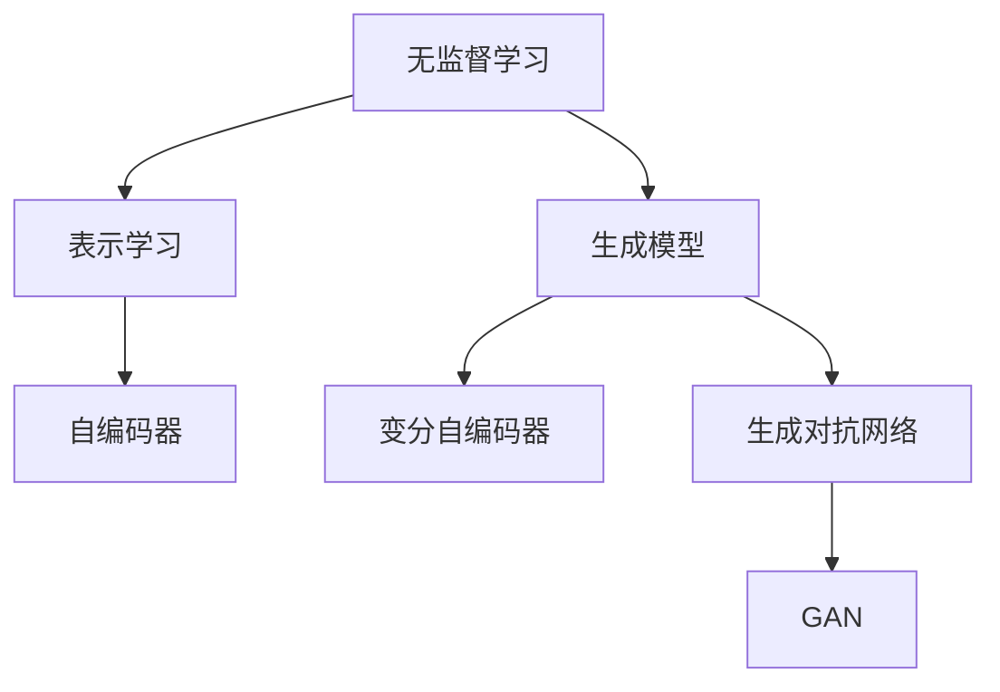

                 

# 无监督学习的理论进展:表示学习和生成模型

> 关键词：无监督学习, 表示学习, 生成模型, 深度学习, 自然语言处理, 数据降维, 降维算法, 自动编码器

## 1. 背景介绍

### 1.1 问题由来
在深度学习时代，特别是神经网络模型在图像、语音、自然语言处理等领域取得显著突破的背景下，无监督学习逐渐成为人工智能研究的重要组成部分。传统的监督学习方法需要大量标注数据，而标注成本高昂，且存在数据分布偏差等问题，限制了其在某些领域的应用。无监督学习通过从未标注数据中学习到的结构化表示，能够实现数据自动降维、特征提取等任务，成为数据预处理和增强的重要工具。

近年来，基于神经网络的无监督学习方法，尤其是表示学习和生成模型，取得了一系列重要的理论进展和实际应用，推动了人工智能技术的快速发展。通过构建高效的神经网络结构，从大规模未标注数据中提取有用信息，这些方法在图像处理、语音识别、自然语言理解等多个领域展现出巨大的潜力。

### 1.2 问题核心关键点
无监督学习的核心问题是如何从未标注数据中学习到有用的结构化表示。一般而言，无监督学习方法可以分为两大类：表示学习和生成模型。其中：

- 表示学习通过学习数据的内在表示，对数据进行降维、特征提取等操作，其典型任务包括降维算法（如PCA, t-SNE）、特征生成（如AE, VAE）等。
- 生成模型则试图从数据中学习到生成模型，实现对数据的生成与重构。其典型任务包括自编码器（AE）、变分自编码器（VAE）、生成对抗网络（GAN）等。

### 1.3 问题研究意义
无监督学习在人工智能中的应用，不仅有助于解决数据标注困难、提升模型泛化性能，还能够探索数据内在规律，为后续的有监督学习提供更好的数据预处理和增强手段。通过深入研究表示学习和生成模型，可以揭示数据本质的结构化特性，提高机器学习算法的可解释性和鲁棒性，加速人工智能技术在更多领域的应用。

此外，无监督学习还广泛应用于数据清洗、数据增强、自动标注等预处理阶段，为高成本、数据稀缺的领域提供了经济、高效的解决方案。探索无监督学习在数据生成和重构方面的应用，能够提升数据利用效率，降低标注成本，加速人工智能技术的普及和应用。

## 2. 核心概念与联系

### 2.1 核心概念概述

为了更好地理解无监督学习的核心概念，本节将介绍几个关键概念及其相互联系：

- **无监督学习(Unsupervised Learning)**：一种不需要标注数据，直接从数据中学习到的学习方法。常见的无监督学习任务包括降维、聚类、异常检测等。
- **表示学习(Representation Learning)**：从数据中学习到低维表示的过程，目的是提取数据的结构化特征，进行数据降维或特征增强。常见的表示学习算法包括PCA、AE、t-SNE等。
- **生成模型(Generative Modeling)**：试图通过学习生成模型，实现数据的生成与重构。常见的生成模型包括AE、VAE、GAN等。
- **自编码器(Autocoder)**：一种生成模型，通过将输入数据压缩为低维编码，再通过解码器还原为原始数据。自编码器广泛应用于特征提取和降维。
- **变分自编码器(Variational Autoencoder, VAE)**：一种生成模型，通过引入变分推断技术，实现对数据分布的建模和生成。VAE适用于连续型数据的生成和重构。
- **生成对抗网络(Generative Adversarial Network, GAN)**：一种生成模型，通过对抗训练的方式，提升生成器的生成效果。GAN在图像生成、语音生成等方面表现优异。

这些核心概念之间的逻辑关系可以通过以下Mermaid流程图来展示：



这个流程图展示出了无监督学习的核心概念及其相互联系：

1. 无监督学习通过数据本身的内在结构进行学习，包括降维和聚类。
2. 表示学习通过学习数据的低维表示，实现数据降维和特征增强。
3. 生成模型通过学习生成模型，实现数据的生成与重构。
4. 自编码器是一种生成模型，用于特征提取和降维。
5. 变分自编码器是另一种生成模型，用于连续型数据的生成和重构。
6. 生成对抗网络是一种生成模型，通过对抗训练提升生成效果。

## 3. 核心算法原理 & 具体操作步骤
### 3.1 算法原理概述

无监督学习中，表示学习和生成模型是两种主要的研究范式。其核心思想是通过从未标注数据中学习到数据的低维表示或生成模型，实现数据的降维、特征提取和生成等任务。

对于表示学习，常见的方法包括降维算法（如PCA, t-SNE）和特征生成算法（如自编码器、变分自编码器）。降维算法通过将高维数据映射到低维空间，实现数据可视化和降维。特征生成算法通过学习数据的低维表示，用于数据增强和特征提取。

对于生成模型，常见的方法包括自编码器、变分自编码器和生成对抗网络。自编码器通过编码器将输入数据映射到低维编码，解码器将低维编码映射回原始数据。变分自编码器通过引入变分推断技术，学习数据分布，用于数据的生成和重构。生成对抗网络通过对抗训练，提升生成器的生成效果，实现数据的生成与重构。

### 3.2 算法步骤详解

以下以自编码器和变分自编码器为例，详细介绍这两种生成模型的详细步骤：

**自编码器(Autoencoder)**：

1. **数据预处理**：对原始数据进行标准化、归一化等预处理，消除噪声和异常值。
2. **编码器(Encoder)**：通过多层神经网络将数据映射到低维编码空间。
3. **解码器(Decoder)**：通过多层神经网络将低维编码映射回原始数据空间。
4. **损失函数定义**：通常使用均方误差损失函数，衡量解码器输出与原始数据之间的差异。
5. **模型训练**：通过优化损失函数，更新编码器和解码器的权重，最小化重构误差。

**变分自编码器(Variational Autoencoder, VAE)**：

1. **数据预处理**：同自编码器。
2. **编码器(Encoder)**：通过多层神经网络将数据映射到低维潜在空间。
3. **解码器(Decoder)**：通过多层神经网络将潜在空间映射回原始数据空间。
4. **潜在变量分布定义**：引入潜在变量，定义潜在变量分布。
5. **损失函数定义**：定义重构损失和潜在变量分布的KL散度损失，最小化整体损失。
6. **模型训练**：通过优化损失函数，更新编码器和解码器的权重，最大化潜在变量分布的拟合程度和生成数据的重构质量。

### 3.3 算法优缺点

无监督学习中的表示学习和生成模型各有优缺点：

**表示学习的优点**：
- 无需标注数据，减少了标注成本。
- 可以对大规模未标注数据进行有效处理，提升数据利用率。
- 可以用于数据降维和特征提取，降低模型复杂度。

**表示学习的缺点**：
- 对数据分布假设较为严格，可能不适用于复杂数据结构。
- 表示学习结果难以解释，无法提供数据的生成机制。

**生成模型的优点**：
- 可以生成新的数据样本，弥补数据稀缺问题。
- 可以学习到数据的生成机制，提供数据的生成过程。

**生成模型的缺点**：
- 训练过程较为复杂，需要大量的计算资源。
- 生成的数据质量取决于模型的复杂度和训练参数。

### 3.4 算法应用领域

无监督学习中的表示学习和生成模型广泛应用于以下几个领域：

- **计算机视觉**：用于图像降维、特征提取和生成等任务，如图像生成、图像压缩等。
- **自然语言处理**：用于文本降维、语义表示和生成等任务，如文本生成、情感分析等。
- **语音识别**：用于语音降维和特征提取，提升语音识别的准确率。
- **生物信息学**：用于基因序列降维和特征提取，发现基因表达模式。
- **推荐系统**：用于用户兴趣建模和推荐，提升推荐效果。

此外，表示学习和生成模型还在社交网络分析、行为分析、异常检测等领域展现出广泛的应用前景。

## 4. 数学模型和公式 & 详细讲解
### 4.1 数学模型构建

以下以变分自编码器（VAE）为例，详细介绍其数学模型的构建。

**VAE模型**：

设输入数据 $x$ 为连续型变量，潜在变量 $z$ 为离散变量。VAE的目标是学习到潜在变量 $z$ 的分布，并生成与训练数据 $x$ 相似的样本。VAE的模型可以表示为：

$$
p(x|z) = \mathcal{N}(x|\mu(z), \sigma(z)^2)
$$

$$
p(z) = \mathcal{N}(0, I)
$$

其中，$p(x|z)$ 表示生成条件下的数据分布，$p(z)$ 表示潜在变量 $z$ 的先验分布。

**VAE的编码器和解码器**：

编码器将输入数据 $x$ 映射到潜在变量 $z$，解码器将潜在变量 $z$ 映射回原始数据 $x$：

$$
\mu(z) = \mathcal{W}_\mu z + b_\mu
$$

$$
\sigma(z) = \mathcal{W}_\sigma z + b_\sigma
$$

$$
x = \mathcal{V} z + c
$$

其中，$\mathcal{W}_\mu, \mathcal{W}_\sigma, \mathcal{V}, c$ 分别为编码器、解码器的权重和偏置。

### 4.2 公式推导过程

以下推导VAE的损失函数及其梯度计算过程：

**VAE的损失函数**：

VAE的损失函数由重构损失和潜在变量分布的KL散度损失组成：

$$
\mathcal{L}_{VAE} = \mathbb{E}_{p(z)}[\mathbb{E}_{p(x|z)}[-\log p(x|z)] + \mathbb{E}_{q(z|x)}[D_{KL}(q(z|x)||p(z))]
$$

其中，$D_{KL}$ 为KL散度，$q(z|x)$ 为数据条件下的潜在变量分布。

**重构损失的梯度计算**：

重构损失的梯度可以通过反向传播算法计算：

$$
\frac{\partial \mathbb{E}_{p(x|z)}[-\log p(x|z)]}{\partial z} = -\mathbb{E}_{q(z|x)}[\frac{\partial \log p(x|z)}{\partial z}]
$$

**潜在变量分布的KL散度损失的梯度计算**：

潜在变量分布的KL散度损失可以通过反向传播算法计算：

$$
\frac{\partial \mathbb{E}_{q(z|x)}[D_{KL}(q(z|x)||p(z))]}{\partial z} = -\mathbb{E}_{q(z|x)}[\frac{\partial \log q(z|x)}{\partial z} + \frac{\partial \log p(z)}{\partial z}]
$$

通过上述公式，可以完整地定义VAE模型的损失函数，并通过反向传播算法计算梯度，更新模型参数。

### 4.3 案例分析与讲解

以下以图像降维和生成为例，详细介绍VAE的应用案例：

**图像降维**：

通过VAE对图像数据进行降维，可以得到一组低维编码向量。这些编码向量可以用于图像检索、图像分类等任务。具体步骤如下：

1. 将图像数据标准化。
2. 通过编码器将图像数据映射到低维编码向量。
3. 训练VAE模型，优化重构损失和潜在变量分布的KL散度损失。
4. 使用训练好的VAE对新图像数据进行编码，得到低维编码向量。

**图像生成**：

通过VAE生成新图像数据，可以弥补数据稀缺问题。具体步骤如下：

1. 在潜在变量空间中采样，得到潜在变量 $z$。
2. 通过解码器将潜在变量 $z$ 映射回原始数据 $x$。
3. 训练VAE模型，优化重构损失和潜在变量分布的KL散度损失。
4. 使用训练好的VAE生成新图像数据。

通过VAE，可以从高维图像数据中提取低维编码向量，并生成新的图像数据，广泛应用于计算机视觉领域。

## 5. 项目实践：代码实例和详细解释说明
### 5.1 开发环境搭建

在进行无监督学习项目实践前，我们需要准备好开发环境。以下是使用Python进行TensorFlow开发的环境配置流程：

1. 安装Anaconda：从官网下载并安装Anaconda，用于创建独立的Python环境。

2. 创建并激活虚拟环境：
```bash
conda create -n tf-env python=3.8 
conda activate tf-env
```

3. 安装TensorFlow：根据CUDA版本，从官网获取对应的安装命令。例如：
```bash
conda install tensorflow=2.7
```

4. 安装Keras：
```bash
pip install keras
```

5. 安装各类工具包：
```bash
pip install numpy pandas scikit-learn matplotlib tqdm jupyter notebook ipython
```

完成上述步骤后，即可在`tf-env`环境中开始无监督学习实践。

### 5.2 源代码详细实现

下面我们以变分自编码器（VAE）为例，给出使用TensorFlow和Keras库对图像数据进行降维和生成的PyTorch代码实现。

首先，定义VAE模型：

```python
import tensorflow as tf
from tensorflow import keras

class VAE(keras.Model):
    def __init__(self, latent_dim):
        super(VAE, self).__init__()
        self.latent_dim = latent_dim
        self.encoder = keras.Sequential([
            keras.layers.InputLayer(input_shape=(28, 28)),
            keras.layers.Dense(256),
            keras.layers.Dense(256),
            keras.layers.Dense(latent_dim),
            keras.layers.Dense(latent_dim),
        ])
        self.decoder = keras.Sequential([
            keras.layers.InputLayer(input_shape=(latent_dim,)),
            keras.layers.Dense(256),
            keras.layers.Dense(256),
            keras.layers.Dense(784),
        ])
        self.z_mean = None
        self.z_log_var = None

    def encode(self, x):
        z_mean = self.encoder(x)
        z_log_var = self.encoder(x)
        return z_mean, z_log_var

    def reparameterize(self, z_mean, z_log_var):
        eps = tf.random.normal(shape=(None, z_log_var.shape[1]))
        return z_mean + tf.exp(z_log_var/2) * eps

    def decode(self, z):
        x_mean = self.decoder(z)
        return x_mean

    def call(self, x):
        z_mean, z_log_var = self.encode(x)
        z = self.reparameterize(z_mean, z_log_var)
        x_mean = self.decode(z)
        return x_mean, z
```

然后，定义训练函数：

```python
def train_vae(model, data, epochs, batch_size):
    dataset = tf.data.Dataset.from_tensor_slices(data)
    dataset = dataset.shuffle(5000).batch(batch_size)
    for epoch in range(epochs):
        for batch in dataset:
            x = batch[0]
            with tf.GradientTape() as tape:
                x_mean, z = model(x)
                loss = tf.reduce_mean(tf.reduce_sum(-0.5 * (x_mean**2 + tf.exp(z_log_var) - z_mean - z_log_var), axis=1))
            grads = tape.gradient(loss, model.trainable_variables)
            optimizer.apply_gradients(zip(grads, model.trainable_variables))
            if epoch % 100 == 0:
                print(f"Epoch {epoch+1}, Loss: {loss.numpy().mean()}")
```

最后，启动训练流程：

```python
latent_dim = 16
epochs = 100
batch_size = 32

data = mnist.load_data()
data = data[1000:]
data = data.reshape(-1, 28*28).astype("float32") / 255.0

model = VAE(latent_dim)
optimizer = tf.keras.optimizers.Adam()

train_vae(model, data, epochs, batch_size)

# 编码器测试
test_image = data[0].reshape(1, 784)
z_mean, z_log_var = model.encode(test_image)
z = model.reparameterize(z_mean, z_log_var)
x_mean = model.decode(z)
print(x_mean.numpy().shape)
```

以上代码展示了使用TensorFlow和Keras库实现VAE模型的完整过程，包括定义模型、训练模型和测试模型。可以看到，TensorFlow和Keras提供了丰富的API和工具，可以方便地实现复杂的无监督学习任务。

### 5.3 代码解读与分析

让我们再详细解读一下关键代码的实现细节：

**VAE模型类**：
- `__init__`方法：定义VAE模型的编码器和解码器，并设置隐变量维度。
- `encode`方法：将输入数据编码到隐变量空间，返回隐变量的均值和方差。
- `reparameterize`方法：对隐变量进行重参数化，保证模型可微。
- `decode`方法：将隐变量解码回原始数据空间。
- `call`方法：模型前向传播的方法，将输入数据通过编码器、隐变量空间和解码器，最终输出原始数据和隐变量的均值。

**训练函数**：
- 通过TensorFlow的DataLoader对数据集进行批次化加载，供模型训练使用。
- 在每个批次上前向传播计算损失函数，并使用TensorFlow的GradientTape计算梯度，更新模型参数。
- 每100个epoch打印一次损失值，用于监测训练进度。

**测试函数**：
- 通过测试图像计算编码器输出，并对其进行重参数化和解码，最终输出重构图像。
- 打印重构图像的维度，验证模型输出是否与原始图像维度一致。

## 6. 实际应用场景
### 6.1 图像降维

通过VAE等生成模型，可以将高维图像数据降维，得到低维编码向量，用于图像检索、图像分类等任务。以下是实际应用中的降维示例：

**图像检索**：
1. 将高维图像数据编码到低维编码空间。
2. 计算输入图像和数据库中所有图像的编码向量之间的欧氏距离。
3. 找到距离最近的图像，作为检索结果。

**图像分类**：
1. 将高维图像数据编码到低维编码空间。
2. 使用分类器对低维编码向量进行分类，得到图像的分类标签。

### 6.2 图像生成

通过VAE等生成模型，可以生成新的图像数据，弥补数据稀缺问题。以下是实际应用中的生成示例：

**图像生成**：
1. 在潜在变量空间中采样，得到潜在变量 $z$。
2. 将潜在变量 $z$ 通过解码器映射回原始数据 $x$。
3. 生成新的图像数据。

### 6.3 未来应用展望

随着无监督学习技术的发展，其在数据降维、特征提取和生成等方面的应用前景将更加广泛。未来，基于VAE和GAN等生成模型，可以实现更加复杂和高效的数据生成和重构，提升数据利用率，推动更多领域的创新应用。

## 7. 工具和资源推荐
### 7.1 学习资源推荐

为了帮助开发者系统掌握无监督学习的理论基础和实践技巧，这里推荐一些优质的学习资源：

1. 《深度学习》系列书籍：Ian Goodfellow等著，深入浅出地介绍了深度学习的基础理论和经典算法。

2. 《TensorFlow官方文档》：TensorFlow的官方文档，提供了丰富的API和教程，帮助开发者快速上手TensorFlow框架。

3. 《PyTorch官方文档》：PyTorch的官方文档，提供了丰富的API和教程，帮助开发者快速上手PyTorch框架。

4. 《Keras官方文档》：Keras的官方文档，提供了丰富的API和教程，帮助开发者快速上手Keras框架。

5. 《Autoencoder: Theory, Architectures, and Applications》书籍：Glorot等著，全面介绍了自编码器的理论和应用，包括PCA、VAE等算法。

6. 《Generative Adversarial Nets》论文：Goodfellow等著，介绍生成对抗网络的基本思想和算法。

通过对这些资源的学习实践，相信你一定能够快速掌握无监督学习的精髓，并用于解决实际的NLP问题。
###  7.2 开发工具推荐

高效的开发离不开优秀的工具支持。以下是几款用于无监督学习开发的常用工具：

1. TensorFlow：由Google主导开发的开源深度学习框架，生产部署方便，适合大规模工程应用。

2. PyTorch：基于Python的开源深度学习框架，灵活动态的计算图，适合快速迭代研究。

3. Keras：高级神经网络API，提供了丰富的API和模型实现，适合快速原型开发。

4. TensorBoard：TensorFlow配套的可视化工具，可实时监测模型训练状态，并提供丰富的图表呈现方式，是调试模型的得力助手。

5. Weights & Biases：模型训练的实验跟踪工具，可以记录和可视化模型训练过程中的各项指标，方便对比和调优。

6. Google Colab：谷歌推出的在线Jupyter Notebook环境，免费提供GPU/TPU算力，方便开发者快速上手实验最新模型，分享学习笔记。

合理利用这些工具，可以显著提升无监督学习任务的开发效率，加快创新迭代的步伐。

### 7.3 相关论文推荐

无监督学习在人工智能中的应用，源于学界的持续研究。以下是几篇奠基性的相关论文，推荐阅读：

1. Autoencoder: Theory, Architectures, and Applications：Glorot等著，全面介绍了自编码器的理论和应用，包括PCA、VAE等算法。

2. Generative Adversarial Nets：Goodfellow等著，介绍生成对抗网络的基本思想和算法。

3. Variational Inference for Deep Belief Networks：Wainwright等著，介绍变分推断技术，并应用于深度信念网络中。

4. The Variational Fair Autoencoder：Ganbat等著，介绍公平生成模型的设计和实现。

5. Deep Structure Learning with Causal Units：Sang等著，介绍因果推断模型在深度学习中的应用。

这些论文代表了大规模无监督学习技术的发展脉络。通过学习这些前沿成果，可以帮助研究者把握学科前进方向，激发更多的创新灵感。

## 8. 总结：未来发展趋势与挑战
### 8.1 总结

本文对无监督学习的核心算法表示学习和生成模型进行了全面系统的介绍。首先阐述了无监督学习的背景和意义，明确了表示学习和生成模型在数据降维、特征提取和生成等方面的重要作用。其次，从原理到实践，详细讲解了VAE和GAN等生成模型的详细步骤，给出了无监督学习任务开发的完整代码实例。同时，本文还探讨了无监督学习在计算机视觉、自然语言处理等多个领域的应用前景，展示了无监督学习的广阔应用空间。

通过本文的系统梳理，可以看到，无监督学习在人工智能中的应用不仅有助于解决数据标注困难、提升模型泛化性能，还能够探索数据内在规律，为后续的有监督学习提供更好的数据预处理和增强手段。通过深入研究表示学习和生成模型，可以揭示数据本质的结构化特性，提高机器学习算法的可解释性和鲁棒性，加速人工智能技术在更多领域的应用。

### 8.2 未来发展趋势

展望未来，无监督学习中的表示学习和生成模型将呈现以下几个发展趋势：

1. 模型复杂度不断提升。随着算力成本的下降和数据规模的扩张，无监督学习模型的复杂度将不断提升，能够处理更复杂的数据结构和任务。

2. 深度学习架构不断创新。新的深度学习架构，如卷积神经网络、残差网络等，将推动无监督学习在图像处理、语音识别等领域的进一步发展。

3. 生成模型应用拓展。基于GAN和VAE等生成模型的应用将进一步扩展，如图像生成、语音生成、视频生成等，提升数据生成和重构的效果。

4. 混合学习范式。结合无监督学习和有监督学习，利用无监督学习获取数据表示，再用有监督学习进行任务微调，提升模型的泛化性能。

5. 弱监督学习发展。结合少量标注数据和大量未标注数据，提升模型的泛化能力和鲁棒性，推动弱监督学习技术的突破。

6. 多模态学习融合。结合文本、图像、语音等多模态数据，提升无监督学习模型的性能和应用范围。

以上趋势凸显了无监督学习技术的广阔前景。这些方向的探索发展，必将进一步提升无监督学习模型的性能和应用范围，为构建人机协同的智能系统提供新的技术路径。

### 8.3 面临的挑战

尽管无监督学习技术已经取得了一系列重要进展，但在迈向更加智能化、普适化应用的过程中，仍面临诸多挑战：

1. 数据分布偏差。无监督学习模型的泛化性能很大程度上取决于数据分布，一旦数据分布发生显著变化，模型性能可能会大幅下降。

2. 模型复杂度高。随着模型复杂度的提升，训练和推理的计算成本也随之增加，如何优化模型结构、提升计算效率，是需要解决的重要问题。

3. 可解释性不足。无监督学习模型的决策过程通常缺乏可解释性，难以对其推理逻辑进行分析和调试。

4. 安全性问题。无监督学习模型可能会学习到有害的生成样本，影响应用系统的安全性。

5. 公平性和伦理性问题。无监督学习模型可能会学习到有害的偏见和歧视，对社会造成负面影响。

6. 数据隐私问题。无监督学习模型在处理大量数据时，需要严格遵守数据隐私法规，保护用户隐私。

以上挑战凸显了无监督学习技术的复杂性和不确定性。唯有通过持续的技术创新和制度完善，才能解决这些问题，推动无监督学习技术迈向成熟和实用。

### 8.4 研究展望

面对无监督学习所面临的种种挑战，未来的研究需要在以下几个方面寻求新的突破：

1. 探索更高效的无监督学习算法。结合深度学习、多模态学习等技术，设计高效的无监督学习算法，提升模型的泛化能力和鲁棒性。

2. 引入更多先验知识。结合符号化的先验知识，如知识图谱、逻辑规则等，指导无监督学习模型的训练，提升模型的可解释性和鲁棒性。

3. 提升生成模型的质量和效率。结合对抗训练、变分推断等技术，提升生成模型的生成效果和训练效率。

4. 探索混合学习范式。结合无监督学习和有监督学习，提升模型的泛化能力和鲁棒性，推动弱监督学习技术的突破。

5. 引入因果推断技术。结合因果推断技术，提升模型的可解释性和鲁棒性，推动因果推理技术在无监督学习中的应用。

6. 纳入伦理道德约束。在模型训练目标中引入伦理导向的评估指标，过滤和惩罚有害的生成样本，确保模型的安全性。

这些研究方向的探索，必将引领无监督学习技术迈向更高的台阶，为构建安全、可靠、可解释、可控的智能系统提供新的技术路径。

## 9. 附录：常见问题与解答

**Q1：无监督学习是否适用于所有数据集？**

A: 无监督学习在数据标注困难、数据稀缺的场景中具有优势，但在某些特定领域的数据集上可能表现不佳。如文本分类任务，通常需要标注数据进行监督学习，而无监督学习难以充分发挥其优势。因此，需要根据具体应用场景，选择合适的无监督学习算法。

**Q2：如何选择合适的无监督学习算法？**

A: 选择合适的无监督学习算法需要考虑以下因素：
1. 数据类型：不同类型的数据适合不同的无监督学习算法。例如，文本数据适合使用降维算法，图像数据适合使用生成模型。
2. 任务类型：根据任务类型选择合适的无监督学习算法。例如，特征提取适合使用PCA，图像生成适合使用GAN。
3. 数据规模：数据规模较小的情况下，选择简单有效的无监督学习算法；数据规模较大的情况下，选择复杂高效的算法。
4. 计算资源：计算资源有限的情况下，选择计算复杂度较低的算法。

**Q3：无监督学习模型的性能如何评估？**

A: 无监督学习模型的性能通常通过以下指标进行评估：
1. 重构误差：生成模型如VAE、GAN等的重构误差可以衡量模型的生成效果。
2. 潜在变量分布的拟合程度：VAE、GAN等生成模型通过拟合潜在变量分布的均值和方差，来衡量模型生成数据的质量。
3. 数据降维效果：降维算法如PCA、t-SNE等通过计算降维前后的数据分布差异，来衡量模型的降维效果。
4. 聚类效果：聚类算法如K-means、DBSCAN等通过计算聚类结果与真实标签的一致性，来衡量模型的聚类效果。

**Q4：无监督学习在实际应用中需要注意哪些问题？**

A: 在实际应用中，无监督学习模型需要注意以下问题：
1. 数据预处理：数据预处理对模型性能影响较大，需要进行标准化、归一化等预处理。
2. 模型调参：无监督学习模型需要调整超参数，如学习率、迭代轮数、隐变量维度等。
3. 模型评估：无监督学习模型的评估需要考虑生成数据的质量和分布一致性。
4. 模型部署：无监督学习模型需要考虑模型裁剪、量化加速等问题，以适应实际应用场景。
5. 数据隐私：无监督学习模型在处理大量数据时，需要严格遵守数据隐私法规，保护用户隐私。

通过合理选择和调整无监督学习模型，可以有效解决实际应用中的问题，提升模型的性能和应用范围。

