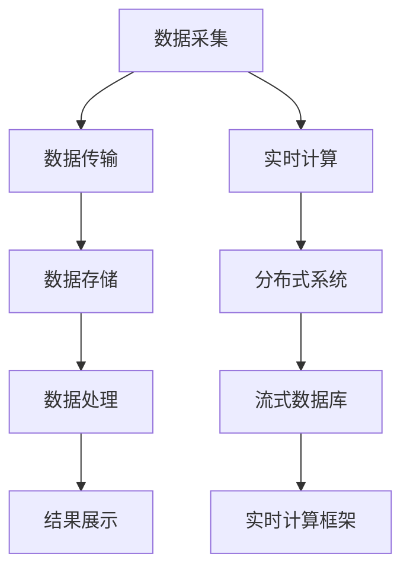

                 

# 时效性信息处理：AI的实时性

> 关键词：实时计算,数据流处理,分布式系统,流式数据库,端到端实时性,实时计算框架

## 1. 背景介绍

### 1.1 问题由来

在数字化转型和人工智能应用的浪潮下，实时性数据处理成为了企业的核心竞争力之一。无论是电商平台的交易系统、金融市场的交易监控系统，还是智能医疗的实时诊断系统，实时性信息处理已经深入到各行各业的核心应用中。传统的数据处理方式如批处理、周期性更新数据等，已经无法满足现代业务的快速变化和实时决策需求。

AI技术在提升实时性信息处理能力方面表现出色。尤其是在深度学习技术的推动下，实时计算和流式数据处理技术得到了快速发展和广泛应用，成为现代企业信息化建设的重要支柱。实时性信息处理，是AI技术落地应用的核心方向之一。

### 1.2 问题核心关键点

实时性信息处理的核心关键点在于如何高效、可靠、安全地处理海量的数据流，并将计算结果及时传递给各业务系统。这其中涉及了数据采集、数据传输、数据存储、数据处理和结果展示等环节。

1. **数据采集**：从各类数据源中实时获取数据，并进行清洗、解析、转换等预处理。
2. **数据传输**：将处理后的数据流传输至目标系统，保证数据传输的速度和稳定性。
3. **数据存储**：将数据流存入高效的分布式数据库系统，以支持大规模的数据存储和快速查询。
4. **数据处理**：利用先进的AI算法和计算框架，对实时数据流进行高效处理。
5. **结果展示**：将处理结果以实时报告、仪表盘、警报等方式展示给相关决策者，帮助其快速做出响应。

### 1.3 问题研究意义

实时性信息处理的研究，对于提升企业的信息化水平，提高决策效率，增强市场竞争力具有重要意义。

1. **提升决策效率**：实时数据处理能够快速响应市场变化，为企业提供即时的业务洞察，帮助决策者做出更准确、及时的决策。
2. **降低成本**：实时计算可以避免大量数据存储和周期性数据更新带来的存储和计算成本。
3. **增强市场竞争力**：通过快速响应市场变化，企业能够更好地满足用户需求，提升用户体验和满意度。
4. **促进数据驱动决策**：实时数据处理使得企业能够更好地利用大数据技术，实现数据驱动的决策模式。

## 2. 核心概念与联系

### 2.1 核心概念概述

为更好地理解实时性信息处理的核心概念和架构，本节将介绍几个密切相关的核心概念：

- **实时计算(Real-time Computing)**：指对实时数据流进行高效处理的计算过程，能够快速响应用户需求。
- **数据流处理(Stream Processing)**：指对数据流进行实时处理和分析，能够满足数据的实时性和流量的高并发性要求。
- **分布式系统(Distributed System)**：指由多台计算机组成的系统，通过分布式计算、数据共享、故障容忍等机制，提高系统的可扩展性和可靠性。
- **流式数据库(Stream Database)**：指能够高效存储、处理和查询实时数据流的分布式数据库系统，如Apache Kafka、Apache Flink等。
- **端到端实时性(End-to-End Real-time)**：指从数据采集到结果展示的整个过程，每个环节都应保证数据的实时性和处理效率。
- **实时计算框架(Real-time Computing Framework)**：指用于支持实时计算和数据流处理的计算框架，如Apache Spark Streaming、Apache Storm等。

这些核心概念之间的逻辑关系可以通过以下Mermaid流程图来展示：



这个流程图展示了实时性信息处理的关键组件和它们之间的逻辑关系：

1. 数据从各数据源被采集，经过传输和存储后，通过计算框架进行实时处理。
2. 计算框架将处理结果展示给业务系统，最终呈现在用户界面。
3. 数据流处理系统通过分布式计算和流式数据库，保证数据的实时性和高并发性。
4. 实时计算框架通过高效的数据处理算法和分布式计算机制，提升处理效率和系统可扩展性。

## 3. 核心算法原理 & 具体操作步骤
### 3.1 算法原理概述

实时性信息处理的算法原理，主要基于流式计算和大规模分布式计算。其核心思想是：将数据流切分为若干小窗口，对每个小窗口内的数据流进行实时处理，并将处理结果输出到目标系统。

形式化地，假设实时数据流为 $D(t)$，$T=[t_0, t_1, t_2, ..., t_n]$ 为数据流的窗口序列。实时计算的目标是找到最优的算法 $A$ 和参数 $\theta$，使得损失函数 $\mathcal{L}(A, T)$ 最小化，即：

$$
\theta^* = \mathop{\arg\min}_{\theta} \mathcal{L}(A, T)
$$

其中 $\mathcal{L}$ 为损失函数，通常使用数据处理的延迟、精度、吞吐量等指标来衡量。常见的损失函数包括平均延迟、标准差、吞吐量等。

### 3.2 算法步骤详解

实时性信息处理的一般步骤包括：

**Step 1: 数据采集与预处理**
- 使用爬虫、传感器、API等手段，从各类数据源中实时采集数据。
- 对采集到的原始数据进行清洗、去重、解析等预处理操作，去除噪声和无效数据。

**Step 2: 数据传输**
- 将预处理后的数据流通过网络传输至目标系统，确保数据传输的实时性和稳定性。
- 使用消息队列或流式数据库系统作为中间件，保证数据传输的高吞吐量和低延迟。

**Step 3: 数据存储**
- 将数据流存入高效的分布式数据库系统，如Apache Kafka、Apache Flink等。
- 根据数据特点选择合适的存储引擎，如列式存储、分布式存储、流式存储等。

**Step 4: 数据处理**
- 利用先进的AI算法和实时计算框架，对数据流进行高效处理。
- 使用机器学习、深度学习等算法，对数据流进行特征提取、模式识别、预测等处理。

**Step 5: 结果展示**
- 将处理结果以实时报告、仪表盘、警报等方式展示给相关决策者。
- 使用图形化界面工具，如Tableau、Grafana等，帮助用户直观理解处理结果。

### 3.3 算法优缺点

实时性信息处理的算法具有以下优点：
1. 实时响应：能够快速响应市场变化，提供即时的业务洞察。
2. 高效处理：通过分布式计算和流式处理，能够处理大规模的数据流。
3. 灵活性高：支持多数据源、多算法、多业务系统的灵活集成。

同时，该算法也存在一定的局限性：
1. 数据量大：需要处理的数据流规模往往很大，对计算资源的要求较高。
2. 复杂度高：实时计算系统需要设计复杂的架构，保证系统稳定性和高效性。
3. 数据延迟：数据传输和处理过程中可能存在一定的延迟，影响结果的时效性。
4. 精度要求高：实时计算需要保证处理结果的精度和可靠性，避免因数据处理错误导致的误决策。

尽管存在这些局限性，但就目前而言，实时性信息处理仍然是数据处理的核心方向之一。未来相关研究的重点在于如何进一步降低数据延迟，提高系统的可扩展性和鲁棒性，同时兼顾处理精度和效率。

### 3.4 算法应用领域

实时性信息处理在各行各业的应用已经十分广泛，以下是几个典型的应用场景：

- **电商平台的交易系统**：实时监控用户交易行为，实时推送个性化推荐和促销信息。
- **金融市场的交易监控系统**：实时监测市场波动，快速响应交易异常，及时调整交易策略。
- **智能医疗的实时诊断系统**：实时获取患者数据，快速做出诊断，提供个性化治疗方案。
- **智能交通的实时监控系统**：实时监控交通流量，快速响应交通事故，优化交通管理。
- **社交媒体的实时舆情分析**：实时监控社交媒体数据，快速响应舆情变化，引导舆论方向。

除了这些经典场景外，实时性信息处理还被创新性地应用于更多领域，如智能制造、智慧城市、智能物流等，为各行各业带来了新的变革。

## 4. 数学模型和公式 & 详细讲解
### 4.1 数学模型构建

实时性信息处理的数学模型，主要基于流式计算和大规模分布式计算。

假设实时数据流为 $D(t)$，$T=[t_0, t_1, t_2, ..., t_n]$ 为数据流的窗口序列。假设使用机器学习算法 $A$ 对窗口内的数据流进行处理，得到结果 $R(t)$。则实时处理的损失函数可以表示为：

$$
\mathcal{L}(A, T) = \frac{1}{N} \sum_{i=1}^N \ell(R(t_i), y_i)
$$

其中 $N$ 为窗口数量，$\ell$ 为损失函数，如均方误差损失、交叉熵损失等。

在实际应用中，实时处理的损失函数可以根据具体业务需求进行定义和优化。常见的损失函数包括平均延迟、标准差、吞吐量等。

### 4.2 公式推导过程

以下我们以金融市场交易监控系统为例，推导实时处理的损失函数。

假设实时数据流 $D(t)$ 包含交易价格和交易量等数据，机器学习算法 $A$ 能够实时预测交易异常。将数据流切分为若干小窗口 $T=[t_0, t_1, t_2, ..., t_n]$，每轮窗口内的数据流 $D_i(t)$ 作为输入，经过算法 $A$ 处理后得到结果 $R_i(t)$，与真实标签 $y_i$ 进行比较，计算损失函数 $\ell(R_i(t), y_i)$。则整体损失函数为：

$$
\mathcal{L}(A, T) = \frac{1}{N} \sum_{i=1}^N \ell(R_i(t_i), y_i)
$$

将 $R_i(t_i)$ 表示为 $A$ 模型的预测结果，$y_i$ 表示真实标签，$\ell$ 表示损失函数，如均方误差损失。

在得到损失函数后，即可带入优化算法进行迭代优化。常用的优化算法包括随机梯度下降、Adam、Adagrad等。

### 4.3 案例分析与讲解

**案例：金融市场的交易监控系统**

假设某金融市场监控系统需要实时检测股票价格的异常波动。将历史交易数据作为训练集，使用机器学习算法 $A$ 对实时数据流进行训练和预测。训练过程中，数据流被切分为若干小窗口 $T=[t_0, t_1, t_2, ..., t_n]$，每轮窗口内的数据流 $D_i(t)$ 作为输入，经过算法 $A$ 处理后得到结果 $R_i(t)$，与真实标签 $y_i$ 进行比较，计算损失函数 $\ell(R_i(t), y_i)$。则整体损失函数为：

$$
\mathcal{L}(A, T) = \frac{1}{N} \sum_{i=1}^N \ell(R_i(t_i), y_i)
$$

在得到损失函数后，即可使用梯度下降等优化算法进行迭代优化，更新模型参数，最小化损失函数。最终得到适应实时数据流的预测模型 $A$，能够实时监控市场波动，快速响应交易异常。

## 5. 项目实践：代码实例和详细解释说明
### 5.1 开发环境搭建

在进行实时性信息处理实践前，我们需要准备好开发环境。以下是使用Python进行Apache Flink开发的环境配置流程：

1. 安装Anaconda：从官网下载并安装Anaconda，用于创建独立的Python环境。

2. 创建并激活虚拟环境：
```bash
conda create -n flink-env python=3.8 
conda activate flink-env
```

3. 安装Flink：根据CUDA版本，从官网获取对应的安装命令。例如：
```bash
conda install flink
```

4. 安装Flume和Kafka：
```bash
conda install flume kafka
```

5. 安装各类工具包：
```bash
pip install numpy pandas scikit-learn matplotlib tqdm jupyter notebook ipython
```

完成上述步骤后，即可在`flink-env`环境中开始实时性信息处理的实践。

### 5.2 源代码详细实现

下面我们以金融市场的交易监控系统为例，给出使用Apache Flink对实时数据流进行处理的PyTorch代码实现。

首先，定义数据流处理函数：

```python
from flink import StreamExecutionEnvironment
from flink.operators import FilterOperator, MapOperator
from flink import StreamExecutionEnvironment
from flink.operators import FilterOperator, MapOperator
from flink.types import Tuple2

class TradePriceMonitorPipeline:
    def __init__(self, args):
        self.args = args
        self.exec = StreamExecutionEnvironment.get_execution_environment()
        self.stream = self.exec.add_source(KafkaSource(params=self.args))
        self.window = self.stream.window(5).apply(MapOperator(lambda x: (x[0], x[1])))

    def run(self):
        self.window.apply(FilterOperator(lambda x: x[1] > 10000))
        self.window.apply(MapOperator(lambda x: x[1] - x[0]))
        self.exec.add_sink(KafkaSink(params=self.args))
        self.exec.execute("Trade Price Monitor")

def main():
    args = get_args()
    monitor = TradePriceMonitorPipeline(args)
    monitor.run()
```

然后，定义数据源和数据沉：

```python
from flink.types import Tuple2
from flink.functions import KafkaSource
from flink.functions import KafkaSink

class KafkaSource:
    def __init__(self, params):
        self.params = params

    def get_producer(self, kafka):
        return kafka.producer(**self.params)

class KafkaSink:
    def __init__(self, params):
        self.params = params

    def get_consumer(self, kafka):
        return kafka.consumer(**self.params)

params = {"bootstrap.servers": "localhost:9092", 
         "key.deserializer": lambda s: s.decode('utf-8'),
         "value.deserializer": lambda s: s.decode('utf-8')}
```

接着，定义数据处理和输出函数：

```python
from flink.types import Tuple2
from flink.functions import KafkaSource
from flink.functions import KafkaSink

class TradePriceMonitorPipeline:
    def __init__(self, args):
        self.args = args
        self.exec = StreamExecutionEnvironment.get_execution_environment()
        self.stream = self.exec.add_source(KafkaSource(params=self.args))
        self.window = self.stream.window(5).apply(MapOperator(lambda x: (x[0], x[1])))

    def run(self):
        self.window.apply(FilterOperator(lambda x: x[1] > 10000))
        self.window.apply(MapOperator(lambda x: x[1] - x[0]))
        self.exec.add_sink(KafkaSink(params=self.args))
        self.exec.execute("Trade Price Monitor")

def main():
    args = get_args()
    monitor = TradePriceMonitorPipeline(args)
    monitor.run()
```

最后，启动数据流处理流程：

```python
if __name__ == "__main__":
    main()
```

以上就是使用Apache Flink对金融市场交易监控系统进行实时数据流处理的完整代码实现。可以看到，通过Apache Flink的强大功能和丰富的API，可以方便地对实时数据流进行高效处理和分析。

### 5.3 代码解读与分析

让我们再详细解读一下关键代码的实现细节：

**TradePriceMonitorPipeline类**：
- `__init__`方法：初始化数据流环境和输入输出接口。
- `run`方法：定义数据流的处理流程，包括窗口划分、数据过滤、差值计算和数据输出。

**KafkaSource和KafkaSink类**：
- `__init__`方法：初始化Kafka源和Kafka沉的配置参数。
- `get_producer`和`get_consumer`方法：使用Kafka API创建Kafka生产者和消费者。

**数据处理流程**：
- 数据流通过Kafka源输入，经过窗口划分和过滤后，计算价格变化量，最终通过Kafka沉输出。
- 在`run`方法中，`self.window`表示对数据流进行5秒的窗口划分，`self.window.apply(FilterOperator(lambda x: x[1] > 10000))`表示只保留价格大于10000的记录，`self.window.apply(MapOperator(lambda x: x[1] - x[0]))`表示计算价格变化量。

**代码执行**：
- 在`main`方法中，创建`TradePriceMonitorPipeline`实例，并调用`run`方法启动数据流处理流程。
- 在数据流处理过程中，实时计算价格变化量，并通过Kafka沉输出结果。

可以看出，Apache Flink提供了高效、灵活的数据流处理能力，可以轻松应对大规模、高并发的实时数据流。

## 6. 实际应用场景
### 6.1 智能交通的实时监控系统

智能交通的实时监控系统，可以实时监控交通流量，快速响应交通事故，优化交通管理。例如，在城市道路上安装传感器，实时采集车辆速度、位置等数据，通过数据流处理系统进行分析，生成交通监控报告。

在技术实现上，可以收集道路传感器数据，并将数据流输入Apache Flink系统进行实时处理。利用机器学习算法，对数据流进行特征提取、模式识别、预测等处理，生成交通监控报告。交通监控报告可以展示在控制室的大屏幕或者手机App上，帮助交通管理部门及时响应交通事故，优化交通流量。

### 6.2 电商平台的实时推荐系统

电商平台实时推荐系统，可以实时监控用户行为，快速响应用户需求，提供个性化推荐。例如，在用户浏览商品时，实时获取用户行为数据，经过数据流处理系统分析，生成推荐列表。

在技术实现上，可以收集用户浏览、点击、购买等行为数据，并将数据流输入Apache Flink系统进行实时处理。利用机器学习算法，对数据流进行特征提取、模式识别、预测等处理，生成个性化推荐列表。推荐列表可以展示在电商平台的界面上，帮助用户快速找到感兴趣的商品。

### 6.3 智能制造的实时监控系统

智能制造的实时监控系统，可以实时监控生产设备和生产过程，快速响应异常，优化生产管理。例如，在生产线上安装传感器，实时采集设备运行数据，通过数据流处理系统进行分析，生成设备监控报告。

在技术实现上，可以收集设备运行数据，并将数据流输入Apache Flink系统进行实时处理。利用机器学习算法，对数据流进行特征提取、模式识别、预测等处理，生成设备监控报告。设备监控报告可以展示在生产管理系统的界面中，帮助生产管理人员及时响应设备异常，优化生产过程。

### 6.4 未来应用展望

随着实时性信息处理技术的不断发展，其应用场景将更加广泛。未来，实时性信息处理将成为企业信息化建设的重要支柱，以下是几个可能的未来应用方向：

1. **实时视频分析**：利用实时性信息处理技术，对视频流进行实时分析，识别异常行为，提高公共安全。例如，实时监控视频流，检测异常行为，快速响应安全事件。

2. **实时语音识别**：利用实时性信息处理技术，对语音流进行实时处理，实现实时语音识别和翻译。例如，实时处理语音流，识别用户语音指令，实现语音控制。

3. **实时图像识别**：利用实时性信息处理技术，对图像流进行实时处理，实现实时图像识别和分析。例如，实时处理图像流，检测异常物体，实时警报。

4. **实时流媒体处理**：利用实时性信息处理技术，对流媒体流进行实时处理，实现实时流媒体分析。例如，实时处理流媒体流，分析用户行为，实现个性化推荐。

5. **实时物联网数据处理**：利用实时性信息处理技术，对物联网设备数据进行实时处理，实现实时监控和管理。例如，实时处理物联网设备数据，优化设备性能，提高设备利用率。

## 7. 工具和资源推荐
### 7.1 学习资源推荐

为了帮助开发者系统掌握实时性信息处理的技术基础和实践技巧，这里推荐一些优质的学习资源：

1. **《Apache Flink官方文档》**：Apache Flink的官方文档，提供了详细的API和使用方法，是初学者入门的好资料。
2. **《实时数据处理技术》**：一本讲解实时性信息处理技术的书籍，涵盖了数据采集、数据传输、数据存储、数据处理和结果展示等环节。
3. **《机器学习实战》**：一本讲解机器学习算法的书籍，提供了大量的实例代码，帮助开发者理解算法原理和实现方法。
4. **《流式数据库实战》**：一本讲解流式数据库的书籍，涵盖了Apache Kafka、Apache Flink等工具的使用方法。
5. **《分布式系统基础》**：一本讲解分布式系统的书籍，帮助开发者理解分布式计算和数据共享的原理和方法。

通过学习这些资源，相信你一定能够掌握实时性信息处理的核心技术，并应用于实际项目中。

### 7.2 开发工具推荐

高效的开发离不开优秀的工具支持。以下是几款用于实时性信息处理开发的常用工具：

1. **Apache Flink**：Apache Flink是Apache软件基金会的一个开源分布式流式数据处理框架，支持多种数据源和数据沉，适用于大规模实时数据流处理。
2. **Apache Kafka**：Apache Kafka是Apache软件基金会的一个分布式消息系统，支持高吞吐量的数据流传输，适用于实时数据采集和传输。
3. **Apache Spark**：Apache Spark是Apache软件基金会的一个开源分布式大数据处理框架，支持批处理和流式处理，适用于大规模数据存储和分析。
4. **Tableau**：Tableau是一款数据可视化工具，支持大规模数据的实时分析，适用于实时数据展示和监控。
5. **Grafana**：Grafana是一款开源开源的仪表盘和报警系统，支持多种数据源和数据沉，适用于实时数据展示和监控。

合理利用这些工具，可以显著提升实时性信息处理任务的开发效率，加快创新迭代的步伐。

### 7.3 相关论文推荐

实时性信息处理的研究源于学界的持续研究。以下是几篇奠基性的相关论文，推荐阅读：

1. **Stream Processing Systems: Architectures, Algorithms, Experiments**：这篇论文介绍了流式处理系统的架构和算法，是实时性信息处理的经典之作。
2. **Real-Time Streaming Data Processing: A Tutorial**：这篇论文介绍了实时数据流处理的原理和实现方法，是初学者的入门必读。
3. **End-to-End Event Stream Processing**：这篇论文介绍了端到端的实时数据处理系统，是实时性信息处理的高级篇。
4. **Apache Flink: A Framework for Distributed Stream and Batch Data Processing**：这篇论文介绍了Apache Flink的架构和实现方法，是Apache Flink的官方文档。
5. **Apache Kafka: The Portable Stream Processing Platform**：这篇论文介绍了Apache Kafka的架构和实现方法，是Apache Kafka的官方文档。

这些论文代表了大语言模型微调技术的发展脉络。通过学习这些前沿成果，可以帮助研究者把握学科前进方向，激发更多的创新灵感。

## 8. 总结：未来发展趋势与挑战
### 8.1 总结

本文对实时性信息处理技术进行了全面系统的介绍。首先阐述了实时性信息处理的研究背景和意义，明确了实时性信息处理在提升企业信息化水平、提高决策效率方面的独特价值。其次，从原理到实践，详细讲解了实时性信息处理的数学原理和关键步骤，给出了实时性信息处理的完整代码实现。同时，本文还广泛探讨了实时性信息处理在智能交通、电商平台、智能制造等多个行业领域的应用前景，展示了实时性信息处理技术的广泛应用。

通过本文的系统梳理，可以看到，实时性信息处理技术已经成为企业信息化建设的重要支柱，极大地提升了企业的决策效率和市场竞争力。未来，随着技术的不断进步和应用场景的不断拓展，实时性信息处理技术必将带来更多的创新和突破。

### 8.2 未来发展趋势

实时性信息处理技术的未来发展趋势包括以下几个方面：

1. **实时数据处理的规模化和高效化**：随着技术的不断发展，实时数据处理的规模化和高效化将得到进一步提升。通过更先进的数据处理框架和算法，可以处理更大规模、更高并发的数据流。

2. **流式数据库和实时计算框架的进一步发展**：Apache Kafka、Apache Flink等流式数据库和实时计算框架将继续得到广泛应用，并不断优化性能和扩展能力。

3. **实时数据处理技术的融合与创新**：实时性信息处理将与物联网、区块链、边缘计算等新兴技术进一步融合，推动更多创新应用场景的出现。

4. **实时数据处理的个性化与定制化**：实时数据处理将更加注重个性化和定制化，满足不同业务场景的需求。通过数据定制化处理，可以更好地适配特定领域的业务需求。

5. **实时数据处理的自动化与智能化**：实时数据处理将引入更多自动化和智能化技术，如AI算法、机器学习、深度学习等，提升数据处理的效果和精度。

以上趋势凸显了实时性信息处理技术的广阔前景。这些方向的探索发展，必将进一步提升实时性信息处理系统的性能和应用范围，为数字化转型带来更多的创新和突破。

### 8.3 面临的挑战

尽管实时性信息处理技术已经取得了不小的进展，但在迈向更加智能化、普适化应用的过程中，仍然面临诸多挑战：

1. **数据量巨大的问题**：实时数据处理需要处理的数据量往往很大，对计算资源的要求较高。如何提高数据处理效率，降低资源消耗，是未来面临的主要挑战之一。

2. **数据质量不稳定的问题**：实时数据流的质量往往不稳定，存在数据丢失、噪声等问题。如何提高数据质量，保证数据处理的准确性，是未来面临的主要挑战之一。

3. **数据处理延迟的问题**：实时数据处理需要保证数据的低延迟，否则会影响结果的时效性和可靠性。如何降低数据处理延迟，提高数据处理效率，是未来面临的主要挑战之一。

4. **数据处理安全性的问题**：实时数据处理需要保证数据的安全性和隐私性，避免数据泄露和滥用。如何保障数据安全，提升系统可靠性，是未来面临的主要挑战之一。

5. **数据处理透明性的问题**：实时数据处理需要保证算法的透明性和可解释性，避免黑盒模型的使用。如何提高算法的透明性和可解释性，是未来面临的主要挑战之一。

6. **数据处理复杂性的问题**：实时数据处理需要处理复杂的业务场景，如何提高系统的灵活性和可扩展性，是未来面临的主要挑战之一。

这些挑战凸显了实时性信息处理技术的应用难度和复杂性。唯有不断探索和突破，才能将实时性信息处理技术更好地应用于实际场景中。

### 8.4 研究展望

面对实时性信息处理所面临的种种挑战，未来的研究需要在以下几个方面寻求新的突破：

1. **数据处理效率的提升**：开发更加高效的数据处理算法和框架，提高数据处理效率，降低资源消耗。例如，引入异步计算、内存计算等技术，提升数据处理效率。

2. **数据质量保障的提升**：改进数据采集、清洗、过滤等预处理环节，提升数据质量。例如，引入数据校验、异常检测等技术，提高数据处理准确性。

3. **数据处理延迟的降低**：优化数据传输和处理流程，降低数据处理延迟。例如，引入数据分片、负载均衡等技术，提高数据处理效率。

4. **数据处理安全性的提升**：引入数据加密、访问控制等技术，保障数据安全。例如，引入数据加密、访问控制等技术，提高数据处理安全性。

5. **数据处理透明性的提升**：引入数据可视化和可解释性技术，提高算法的透明性和可解释性。例如，引入数据可视化和可解释性技术，提高算法的透明性和可解释性。

6. **数据处理复杂性的降低**：引入自动化和智能化技术，提高系统的灵活性和可扩展性。例如，引入自动化和智能化技术，提高系统的灵活性和可扩展性。

这些研究方向的探索，必将引领实时性信息处理技术迈向更高的台阶，为构建安全、可靠、高效、灵活的实时数据处理系统铺平道路。面向未来，实时性信息处理技术还需要与其他人工智能技术进行更深入的融合，如知识表示、因果推理、强化学习等，多路径协同发力，共同推动实时数据处理系统的进步。

## 9. 附录：常见问题与解答

**Q1：实时性信息处理是否适用于所有业务场景？**

A: 实时性信息处理在大多数业务场景中都能取得良好的效果，特别是在需要快速响应用户需求和市场变化的场景中表现突出。但对于一些实时性要求不高的场景，如历史数据分析等，批处理等传统数据处理方法仍然是更好的选择。

**Q2：实时性信息处理中如何保证数据质量？**

A: 实时性信息处理中，数据质量对数据处理的效果和可靠性至关重要。可以采用以下方法保证数据质量：
1. 数据校验：在数据流处理系统中引入数据校验机制，检测数据格式、内容等错误。
2. 异常检测：使用机器学习算法，检测数据流中的异常数据，及时排除异常数据。
3. 数据清洗：对数据流进行清洗、去重、过滤等预处理操作，去除噪声和无效数据。
4. 数据校准：在数据流处理系统中引入数据校准机制，确保数据的准确性和一致性。

**Q3：实时性信息处理中如何保证数据安全？**

A: 实时性信息处理中，数据安全是一个重要的问题。可以采用以下方法保证数据安全：
1. 数据加密：对数据流进行加密处理，确保数据传输过程中的安全性。
2. 访问控制：使用访问控制机制，限制数据访问权限，避免数据泄露和滥用。
3. 数据脱敏：对敏感数据进行脱敏处理，避免敏感数据泄露。
4. 安全审计：建立数据安全审计机制，实时监控数据处理过程中的安全性问题。

**Q4：实时性信息处理中如何提高数据处理效率？**

A: 实时性信息处理中，数据处理效率是一个重要的性能指标。可以采用以下方法提高数据处理效率：
1. 分布式计算：利用分布式计算框架，将数据处理任务分配到多台计算机上进行并行处理，提高数据处理效率。
2. 异步计算：引入异步计算机制，将数据处理任务异步执行，提高数据处理效率。
3. 内存计算：使用内存计算技术，减少数据存储和读写开销，提高数据处理效率。
4. 数据压缩：对数据流进行压缩处理，减少数据存储和传输开销，提高数据处理效率。

**Q5：实时性信息处理中如何降低数据处理延迟？**

A: 实时性信息处理中，数据处理延迟是一个重要的性能指标。可以采用以下方法降低数据处理延迟：
1. 数据分片：将数据流进行分片处理，减少数据传输和处理开销，提高数据处理效率。
2. 负载均衡：使用负载均衡机制，将数据处理任务均衡分配到多台计算机上，提高数据处理效率。
3. 数据缓存：使用数据缓存技术，将频繁使用的数据存入缓存中，减少数据读取开销，提高数据处理效率。
4. 优化算法：使用高效的算法和数据结构，提高数据处理效率，降低数据处理延迟。

**Q6：实时性信息处理中如何保证算法的透明性和可解释性？**

A: 实时性信息处理中，算法的透明性和可解释性是一个重要的性能指标。可以采用以下方法保证算法的透明性和可解释性：
1. 可解释性算法：使用可解释性强的算法，例如决策树、线性回归等，提高算法的透明性和可解释性。
2. 可视化技术：使用数据可视化和可解释性技术，将算法的决策过程和结果可视化展示，提高算法的透明性和可解释性。
3. 模型解释器：使用模型解释器，对算法模型进行解释和分析，提高算法的透明性和可解释性。
4. 人工干预：引入人工干预机制，对算法的决策过程进行审查和调整，提高算法的透明性和可解释性。

这些方法可以帮助实时性信息处理系统更好地保障算法的透明性和可解释性，提升系统的可靠性和稳定性。

---

作者：禅与计算机程序设计艺术 / Zen and the Art of Computer Programming

