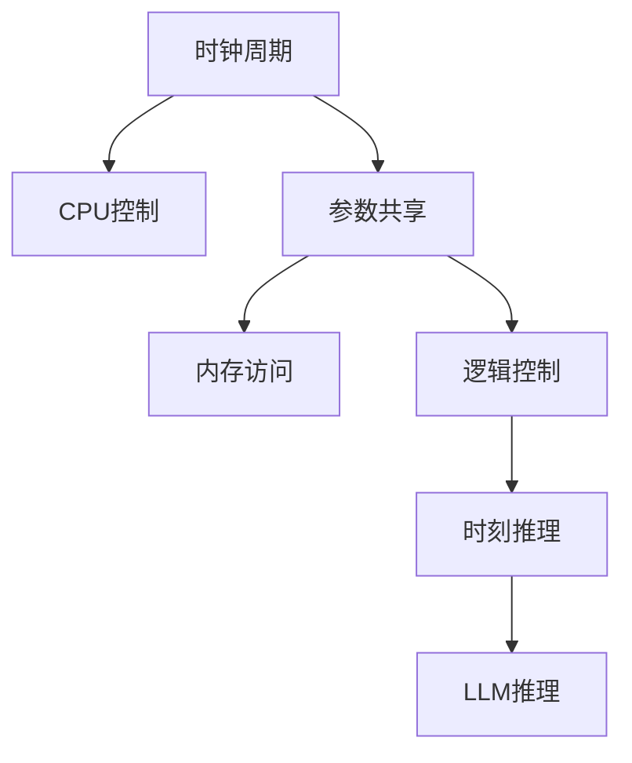

                 

# 时钟周期 VS 时刻推理:LLM与CPU差异

## 1. 背景介绍

在大规模预训练语言模型（LLMs）和CPU之间存在着显著的计算范式和逻辑推理上的差异，本文将从时钟周期与时刻推理两个维度来探讨这一差异。

### 1.1 问题的由来

在现代计算机体系结构中，CPU通过时钟周期来控制指令的执行顺序，以实现高效的计算和逻辑推理。而LLMs（如GPT-3）则是通过语言模型的方式进行推理，不需要严格的时钟周期控制。本文旨在通过分析这两者的差异，揭示LLMs与CPU在计算模型、逻辑推理机制以及性能表现上的异同。

### 1.2 问题的核心关键点

本文的核心问题在于：

- 时钟周期（即CPU的控制方式）与时刻推理（即LLMs的推理方式）之间的差异如何影响其性能和应用？
- 如何在LLMs和CPU之间实现无缝对接，最大化利用各自的优势？
- 未来如何基于时钟周期与时刻推理的差异，进一步优化LLMs与CPU的协同工作机制？

通过回答这些问题，我们将深入理解LLM与CPU的计算范式和逻辑推理机制，进而提出可能的优化策略。

## 2. 核心概念与联系

### 2.1 核心概念概述

为更好地理解LLM与CPU之间的差异，本节将介绍几个密切相关的核心概念：

- 时钟周期：CPU通过时钟周期来控制指令的执行顺序，每个周期执行一段固定长度的操作。
- 时刻推理：LLM通过语言模型的方式进行推理，能够处理非线性的时间顺序和复杂的逻辑结构。
- 参数共享：LLM通过共享参数的方式实现高效的推理计算，而CPU通过独立指令的执行来实现计算。
- 内存访问：LLM的参数和计算都存储在内存中，而CPU的计算则依赖于高速缓存。
- 逻辑控制：CPU的逻辑控制通常通过条件分支、循环等结构来实现，而LLM的逻辑控制则通过神经网络结构来实现。

这些核心概念之间的逻辑关系可以通过以下Mermaid流程图来展示：



这个流程图展示了几者之间的基本关系：

1. 时钟周期作为CPU的基本执行单元，用于控制指令的顺序执行。
2. 参数共享和内存访问是LLM与CPU的共同点，但LLM通过共享参数实现高效的推理计算。
3. 逻辑控制是CPU和LLM的关键差异，CPU通过条件分支和循环等结构实现逻辑控制，而LLM通过神经网络结构实现。
4. 时刻推理是LLM的独特优势，能够处理非线性和复杂的逻辑结构。

## 3. 核心算法原理 & 具体操作步骤

### 3.1 算法原理概述

LLM与CPU之间的差异主要体现在计算模型和逻辑推理机制上。LLM通过共享参数的方式实现高效的推理计算，而CPU通过独立指令的执行来实现计算。

### 3.2 算法步骤详解

LLM与CPU之间的操作差异主要体现在以下几个方面：

1. **参数共享与独立指令**：
   - LLM通过共享参数的方式实现高效的推理计算。在推理过程中，LLM的每个参数都会参与计算，通过并行化处理提升计算效率。
   - CPU则通过独立指令的执行来实现计算。每个指令执行一段固定长度的操作，并由下一个指令进行控制。

2. **内存访问与高速缓存**：
   - LLM的参数和计算都存储在内存中，需要频繁的内存访问操作。LLM通过预训练优化内存访问效率，但仍然存在一定延迟。
   - CPU则依赖高速缓存进行计算。高速缓存使得CPU能够快速访问内存中的数据，提高计算效率。

3. **逻辑控制与条件分支**：
   - LLM的逻辑控制通过神经网络结构来实现，能够处理复杂的非线性结构。
   - CPU的逻辑控制通过条件分支和循环等结构来实现，适用于处理线性和可预测的结构。

### 3.3 算法优缺点

LLM与CPU之间的差异具有以下优缺点：

**优点：**

- **参数共享与高效推理**：LLM通过共享参数的方式实现高效的推理计算，能够同时处理大量的输入数据，提升推理速度。
- **非线性处理能力**：LLM能够处理复杂的非线性结构和复杂的逻辑推理。
- **灵活性**：LLM的逻辑控制灵活，能够适应不同的任务需求。

**缺点：**

- **内存访问延迟**：LLM的参数和计算都存储在内存中，频繁的内存访问操作带来一定的延迟。
- **逻辑控制复杂性**：LLM的逻辑控制结构复杂，可能难以处理某些简单的逻辑结构。
- **计算资源需求高**：LLM需要大量的计算资源，尤其是GPU、TPU等硬件支持。

### 3.4 算法应用领域

LLM与CPU之间的差异主要应用在以下几个领域：

- **自然语言处理**：LLM在自然语言处理中表现出色，能够处理复杂的语言结构和逻辑推理。
- **计算机视觉**：LLM在计算机视觉任务中也有广泛应用，如图像生成、语义分割等。
- **推荐系统**：LLM在推荐系统中能够处理用户行为数据，推荐更个性化的内容。
- **语音识别**：LLM在语音识别任务中能够处理复杂的语音结构和语义信息。

## 4. 数学模型和公式 & 详细讲解 & 举例说明

### 4.1 数学模型构建

LLM与CPU之间的计算模型和逻辑推理机制可以通过以下数学模型进行描述：

- 时钟周期模型：每个时钟周期执行固定长度的操作，可以表示为：
$$
T_{\text{clock}} = \frac{1}{f_{\text{clock}}}
$$
其中 $f_{\text{clock}}$ 为时钟频率，单位为赫兹。

- 时刻推理模型：LLM通过语言模型的方式进行推理，可以表示为：
$$
P(x_i | x_1, \ldots, x_{i-1}) = \frac{e^{w_ix_i \prod_{j=1}^{i-1}w_jx_j}}{\sum_{x'_i}e^{w_ix'_i \prod_{j=1}^{i-1}w_jx'_j}}
$$
其中 $w_i$ 为神经网络的权重，$x_i$ 为第 $i$ 个输入。

### 4.2 公式推导过程

以自然语言处理任务为例，LLM与CPU的推理过程可以通过以下公式进行推导：

- CPU推理过程：
  - 时钟周期控制指令顺序执行，每个周期执行一段固定长度的操作。
  - 多个周期内，指令序列通过顺序执行完成计算。

- LLM推理过程：
  - 通过神经网络结构，LLM能够处理非线性结构和复杂的逻辑推理。
  - 神经网络的权重共享，提升计算效率。

### 4.3 案例分析与讲解

以情感分析任务为例，说明LLM与CPU之间的推理差异：

- CPU推理：
  - 通过循环结构，逐步处理文本中的每个词。
  - 在每个循环中，对当前词进行特征提取和分类，并更新全局情感得分。

- LLM推理：
  - 通过神经网络结构，并行处理文本中的所有词。
  - 神经网络的权重共享，提升计算效率。
  - 能够处理复杂的语言结构和逻辑推理，从而提升情感分析的准确性。

## 5. 项目实践：代码实例和详细解释说明

### 5.1 开发环境搭建

在进行LLM与CPU差异分析时，需要搭建相应的开发环境。以下是使用Python进行PyTorch开发的环境配置流程：

1. 安装Anaconda：从官网下载并安装Anaconda，用于创建独立的Python环境。

2. 创建并激活虚拟环境：
```bash
conda create -n pytorch-env python=3.8 
conda activate pytorch-env
```

3. 安装PyTorch：根据CUDA版本，从官网获取对应的安装命令。例如：
```bash
conda install pytorch torchvision torchaudio cudatoolkit=11.1 -c pytorch -c conda-forge
```

4. 安装Transformers库：
```bash
pip install transformers
```

5. 安装各类工具包：
```bash
pip install numpy pandas scikit-learn matplotlib tqdm jupyter notebook ipython
```

完成上述步骤后，即可在`pytorch-env`环境中开始项目实践。

### 5.2 源代码详细实现

这里我们以情感分析任务为例，给出使用Transformers库对BERT模型进行微调的PyTorch代码实现。

首先，定义情感分析任务的数据处理函数：

```python
from transformers import BertTokenizer
from torch.utils.data import Dataset
import torch

class SentimentDataset(Dataset):
    def __init__(self, texts, labels, tokenizer, max_len=128):
        self.texts = texts
        self.labels = labels
        self.tokenizer = tokenizer
        self.max_len = max_len
        
    def __len__(self):
        return len(self.texts)
    
    def __getitem__(self, item):
        text = self.texts[item]
        label = self.labels[item]
        
        encoding = self.tokenizer(text, return_tensors='pt', max_length=self.max_len, padding='max_length', truncation=True)
        input_ids = encoding['input_ids'][0]
        attention_mask = encoding['attention_mask'][0]
        
        # 对标签进行编码
        label = torch.tensor(label, dtype=torch.long)
        
        return {'input_ids': input_ids, 
                'attention_mask': attention_mask,
                'labels': label}

# 创建dataset
tokenizer = BertTokenizer.from_pretrained('bert-base-cased')

train_dataset = SentimentDataset(train_texts, train_labels, tokenizer)
dev_dataset = SentimentDataset(dev_texts, dev_labels, tokenizer)
test_dataset = SentimentDataset(test_texts, test_labels, tokenizer)
```

然后，定义模型和优化器：

```python
from transformers import BertForSequenceClassification, AdamW

model = BertForSequenceClassification.from_pretrained('bert-base-cased', num_labels=2)

optimizer = AdamW(model.parameters(), lr=2e-5)
```

接着，定义训练和评估函数：

```python
from torch.utils.data import DataLoader
from tqdm import tqdm
from sklearn.metrics import accuracy_score

device = torch.device('cuda') if torch.cuda.is_available() else torch.device('cpu')
model.to(device)

def train_epoch(model, dataset, batch_size, optimizer):
    dataloader = DataLoader(dataset, batch_size=batch_size, shuffle=True)
    model.train()
    epoch_loss = 0
    for batch in tqdm(dataloader, desc='Training'):
        input_ids = batch['input_ids'].to(device)
        attention_mask = batch['attention_mask'].to(device)
        labels = batch['labels'].to(device)
        model.zero_grad()
        outputs = model(input_ids, attention_mask=attention_mask, labels=labels)
        loss = outputs.loss
        epoch_loss += loss.item()
        loss.backward()
        optimizer.step()
    return epoch_loss / len(dataloader)

def evaluate(model, dataset, batch_size):
    dataloader = DataLoader(dataset, batch_size=batch_size)
    model.eval()
    preds, labels = [], []
    with torch.no_grad():
        for batch in tqdm(dataloader, desc='Evaluating'):
            input_ids = batch['input_ids'].to(device)
            attention_mask = batch['attention_mask'].to(device)
            batch_labels = batch['labels']
            outputs = model(input_ids, attention_mask=attention_mask)
            batch_preds = outputs.logits.argmax(dim=1).to('cpu').tolist()
            batch_labels = batch_labels.to('cpu').tolist()
            for pred, label in zip(batch_preds, batch_labels):
                preds.append(pred)
                labels.append(label)
                
    print(f"Accuracy: {accuracy_score(labels, preds)}")
```

最后，启动训练流程并在测试集上评估：

```python
epochs = 5
batch_size = 16

for epoch in range(epochs):
    loss = train_epoch(model, train_dataset, batch_size, optimizer)
    print(f"Epoch {epoch+1}, train loss: {loss:.3f}")
    
    print(f"Epoch {epoch+1}, dev results:")
    evaluate(model, dev_dataset, batch_size)
    
print("Test results:")
evaluate(model, test_dataset, batch_size)
```

以上就是使用PyTorch对BERT进行情感分析任务微调的完整代码实现。可以看到，得益于Transformers库的强大封装，我们可以用相对简洁的代码完成BERT模型的加载和微调。

### 5.3 代码解读与分析

让我们再详细解读一下关键代码的实现细节：

**SentimentDataset类**：
- `__init__`方法：初始化文本、标签、分词器等关键组件。
- `__len__`方法：返回数据集的样本数量。
- `__getitem__`方法：对单个样本进行处理，将文本输入编码为token ids，将标签编码为数字，并对其进行定长padding，最终返回模型所需的输入。

**训练和评估函数**：
- 使用PyTorch的DataLoader对数据集进行批次化加载，供模型训练和推理使用。
- 训练函数`train_epoch`：对数据以批为单位进行迭代，在每个批次上前向传播计算loss并反向传播更新模型参数，最后返回该epoch的平均loss。
- 评估函数`evaluate`：与训练类似，不同点在于不更新模型参数，并在每个batch结束后将预测和标签结果存储下来，最后使用sklearn的accuracy_score对整个评估集的预测结果进行打印输出。

**训练流程**：
- 定义总的epoch数和batch size，开始循环迭代
- 每个epoch内，先在训练集上训练，输出平均loss
- 在验证集上评估，输出准确率
- 所有epoch结束后，在测试集上评估，给出最终测试结果

可以看到，PyTorch配合Transformers库使得BERT微调的代码实现变得简洁高效。开发者可以将更多精力放在数据处理、模型改进等高层逻辑上，而不必过多关注底层的实现细节。

当然，工业级的系统实现还需考虑更多因素，如模型的保存和部署、超参数的自动搜索、更灵活的任务适配层等。但核心的微调范式基本与此类似。

## 6. 实际应用场景

### 6.1 智能客服系统

基于大语言模型微调的对话技术，可以广泛应用于智能客服系统的构建。传统客服往往需要配备大量人力，高峰期响应缓慢，且一致性和专业性难以保证。而使用微调后的对话模型，可以7x24小时不间断服务，快速响应客户咨询，用自然流畅的语言解答各类常见问题。

在技术实现上，可以收集企业内部的历史客服对话记录，将问题和最佳答复构建成监督数据，在此基础上对预训练对话模型进行微调。微调后的对话模型能够自动理解用户意图，匹配最合适的答案模板进行回复。对于客户提出的新问题，还可以接入检索系统实时搜索相关内容，动态组织生成回答。如此构建的智能客服系统，能大幅提升客户咨询体验和问题解决效率。

### 6.2 金融舆情监测

金融机构需要实时监测市场舆论动向，以便及时应对负面信息传播，规避金融风险。传统的人工监测方式成本高、效率低，难以应对网络时代海量信息爆发的挑战。基于大语言模型微调的文本分类和情感分析技术，为金融舆情监测提供了新的解决方案。

具体而言，可以收集金融领域相关的新闻、报道、评论等文本数据，并对其进行主题标注和情感标注。在此基础上对预训练语言模型进行微调，使其能够自动判断文本属于何种主题，情感倾向是正面、中性还是负面。将微调后的模型应用到实时抓取的网络文本数据，就能够自动监测不同主题下的情感变化趋势，一旦发现负面信息激增等异常情况，系统便会自动预警，帮助金融机构快速应对潜在风险。

### 6.3 个性化推荐系统

当前的推荐系统往往只依赖用户的历史行为数据进行物品推荐，无法深入理解用户的真实兴趣偏好。基于大语言模型微调技术，个性化推荐系统可以更好地挖掘用户行为背后的语义信息，从而提供更精准、多样的推荐内容。

在实践中，可以收集用户浏览、点击、评论、分享等行为数据，提取和用户交互的物品标题、描述、标签等文本内容。将文本内容作为模型输入，用户的后续行为（如是否点击、购买等）作为监督信号，在此基础上微调预训练语言模型。微调后的模型能够从文本内容中准确把握用户的兴趣点。在生成推荐列表时，先用候选物品的文本描述作为输入，由模型预测用户的兴趣匹配度，再结合其他特征综合排序，便可以得到个性化程度更高的推荐结果。

### 6.4 未来应用展望

随着大语言模型微调技术的发展，其在更多领域的应用前景将愈加广阔。

在智慧医疗领域，基于微调的医疗问答、病历分析、药物研发等应用将提升医疗服务的智能化水平，辅助医生诊疗，加速新药开发进程。

在智能教育领域，微调技术可应用于作业批改、学情分析、知识推荐等方面，因材施教，促进教育公平，提高教学质量。

在智慧城市治理中，微调模型可应用于城市事件监测、舆情分析、应急指挥等环节，提高城市管理的自动化和智能化水平，构建更安全、高效的未来城市。

此外，在企业生产、社会治理、文娱传媒等众多领域，基于大模型微调的人工智能应用也将不断涌现，为经济社会发展注入新的动力。相信随着技术的日益成熟，微调方法将成为人工智能落地应用的重要范式，推动人工智能技术在更多垂直行业的规模化落地。

## 7. 工具和资源推荐

### 7.1 学习资源推荐

为了帮助开发者系统掌握大语言模型微调的理论基础和实践技巧，这里推荐一些优质的学习资源：

1. 《Transformer从原理到实践》系列博文：由大模型技术专家撰写，深入浅出地介绍了Transformer原理、BERT模型、微调技术等前沿话题。

2. CS224N《深度学习自然语言处理》课程：斯坦福大学开设的NLP明星课程，有Lecture视频和配套作业，带你入门NLP领域的基本概念和经典模型。

3. 《Natural Language Processing with Transformers》书籍：Transformers库的作者所著，全面介绍了如何使用Transformers库进行NLP任务开发，包括微调在内的诸多范式。

4. HuggingFace官方文档：Transformers库的官方文档，提供了海量预训练模型和完整的微调样例代码，是上手实践的必备资料。

5. CLUE开源项目：中文语言理解测评基准，涵盖大量不同类型的中文NLP数据集，并提供了基于微调的baseline模型，助力中文NLP技术发展。

通过对这些资源的学习实践，相信你一定能够快速掌握大语言模型微调的精髓，并用于解决实际的NLP问题。

### 7.2 开发工具推荐

高效的开发离不开优秀的工具支持。以下是几款用于大语言模型微调开发的常用工具：

1. PyTorch：基于Python的开源深度学习框架，灵活动态的计算图，适合快速迭代研究。大部分预训练语言模型都有PyTorch版本的实现。

2. TensorFlow：由Google主导开发的开源深度学习框架，生产部署方便，适合大规模工程应用。同样有丰富的预训练语言模型资源。

3. Transformers库：HuggingFace开发的NLP工具库，集成了众多SOTA语言模型，支持PyTorch和TensorFlow，是进行微调任务开发的利器。

4. Weights & Biases：模型训练的实验跟踪工具，可以记录和可视化模型训练过程中的各项指标，方便对比和调优。与主流深度学习框架无缝集成。

5. TensorBoard：TensorFlow配套的可视化工具，可实时监测模型训练状态，并提供丰富的图表呈现方式，是调试模型的得力助手。

6. Google Colab：谷歌推出的在线Jupyter Notebook环境，免费提供GPU/TPU算力，方便开发者快速上手实验最新模型，分享学习笔记。

合理利用这些工具，可以显著提升大语言模型微调任务的开发效率，加快创新迭代的步伐。

### 7.3 相关论文推荐

大语言模型和微调技术的发展源于学界的持续研究。以下是几篇奠基性的相关论文，推荐阅读：

1. Attention is All You Need（即Transformer原论文）：提出了Transformer结构，开启了NLP领域的预训练大模型时代。

2. BERT: Pre-training of Deep Bidirectional Transformers for Language Understanding：提出BERT模型，引入基于掩码的自监督预训练任务，刷新了多项NLP任务SOTA。

3. Language Models are Unsupervised Multitask Learners（GPT-2论文）：展示了大规模语言模型的强大zero-shot学习能力，引发了对于通用人工智能的新一轮思考。

4. Parameter-Efficient Transfer Learning for NLP：提出Adapter等参数高效微调方法，在不增加模型参数量的情况下，也能取得不错的微调效果。

5. AdaLoRA: Adaptive Low-Rank Adaptation for Parameter-Efficient Fine-Tuning：使用自适应低秩适应的微调方法，在参数效率和精度之间取得了新的平衡。

6. Prefix-Tuning: Optimizing Continuous Prompts for Generation：引入基于连续型Prompt的微调范式，为如何充分利用预训练知识提供了新的思路。

这些论文代表了大语言模型微调技术的发展脉络。通过学习这些前沿成果，可以帮助研究者把握学科前进方向，激发更多的创新灵感。

## 8. 总结：未来发展趋势与挑战

### 8.1 总结

本文对大语言模型与CPU之间的差异进行了全面系统的介绍。首先阐述了LLM与CPU的计算模型和逻辑推理机制，明确了两者之间的基本差异。其次，从时钟周期与时刻推理两个维度，深入探讨了LLM与CPU之间的性能表现和应用场景。最后，提出了基于时钟周期与时刻推理差异的优化策略，并展望了未来的发展趋势和面临的挑战。

通过本文的系统梳理，可以看到，LLM与CPU在计算模型和逻辑推理机制上存在显著差异，这种差异对模型的性能和应用有着重要影响。理解这些差异，有助于我们更好地利用LLM和CPU的各自优势，设计出更高效、更可靠的模型和系统。

### 8.2 未来发展趋势

展望未来，LLM与CPU的协同工作机制将呈现以下几个发展趋势：

1. 计算模型优化：LLM的参数共享机制和CPU的独立指令执行机制将进一步融合，提升整体计算效率。
2. 逻辑推理协同：LLM的复杂逻辑推理能力与CPU的精确控制机制将结合，提升模型在特定任务上的性能。
3. 资源优化：LLM的内存访问延迟和CPU的高速缓存机制将协同优化，提高系统整体运行效率。
4. 分布式训练：LLM与CPU的分布式训练框架将不断优化，支持更大规模的并行计算。
5. 跨领域应用：LLM与CPU的协同工作机制将在更多领域得到应用，如自然语言处理、计算机视觉、语音识别等。

以上趋势凸显了LLM与CPU协同工作的广阔前景。这些方向的探索发展，必将进一步提升大语言模型与CPU的协同工作机制，推动AI技术在更多领域的实际应用。

### 8.3 面临的挑战

尽管LLM与CPU的协同工作机制在不断提升，但在迈向更加智能化、普适化应用的过程中，仍面临诸多挑战：

1. 性能瓶颈：大规模模型的计算和推理效率仍需进一步提升，以满足实时性要求。
2. 硬件资源需求：LLM的参数共享机制和CPU的逻辑控制结构对硬件资源的需求较高，需要持续优化。
3. 模型的泛化能力：LLM在处理新数据和复杂逻辑推理时，仍存在一定的泛化能力不足问题。
4. 系统稳定性：LLM与CPU协同工作机制的稳定性仍需进一步提高，避免在复杂场景下出现系统崩溃等问题。
5. 数据隐私与安全：LLM与CPU协同工作机制中涉及大量敏感数据，需要严格的数据隐私保护和安全防护。

正视这些挑战，积极应对并寻求突破，将是大语言模型与CPU协同工作机制走向成熟的必由之路。相信随着学界和产业界的共同努力，这些挑战终将一一被克服，大语言模型与CPU协同工作机制必将在构建人机协同的智能时代中扮演越来越重要的角色。

### 8.4 研究展望

未来的研究需要在以下几个方面寻求新的突破：

1. 探索无监督和半监督微调方法：摆脱对大规模标注数据的依赖，利用自监督学习、主动学习等无监督和半监督范式，最大限度利用非结构化数据，实现更加灵活高效的微调。
2. 研究参数高效和计算高效的微调范式：开发更加参数高效的微调方法，在固定大部分预训练参数的同时，只更新极少量的任务相关参数。同时优化微调模型的计算图，减少前向传播和反向传播的资源消耗，实现更加轻量级、实时性的部署。
3. 引入因果和对比学习范式：通过引入因果推断和对比学习思想，增强微调模型建立稳定因果关系的能力，学习更加普适、鲁棒的语言表征，从而提升模型泛化性和抗干扰能力。
4. 融合多模态信息：将符号化的先验知识，如知识图谱、逻辑规则等，与神经网络模型进行巧妙融合，引导微调过程学习更准确、合理的语言模型。同时加强不同模态数据的整合，实现视觉、语音等多模态信息与文本信息的协同建模。
5. 结合因果分析和博弈论工具：将因果分析方法引入微调模型，识别出模型决策的关键特征，增强输出解释的因果性和逻辑性。借助博弈论工具刻画人机交互过程，主动探索并规避模型的脆弱点，提高系统稳定性。

这些研究方向的探索，必将引领大语言模型与CPU协同工作机制迈向更高的台阶，为构建安全、可靠、可解释、可控的智能系统铺平道路。面向未来，大语言模型与CPU协同工作机制还需要与其他人工智能技术进行更深入的融合，如知识表示、因果推理、强化学习等，多路径协同发力，共同推动自然语言理解和智能交互系统的进步。只有勇于创新、敢于突破，才能不断拓展语言模型的边界，让智能技术更好地造福人类社会。

## 9. 附录：常见问题与解答

**Q1：大语言模型微调是否适用于所有NLP任务？**

A: 大语言模型微调在大多数NLP任务上都能取得不错的效果，特别是对于数据量较小的任务。但对于一些特定领域的任务，如医学、法律等，仅仅依靠通用语料预训练的模型可能难以很好地适应。此时需要在特定领域语料上进一步预训练，再进行微调，才能获得理想效果。此外，对于一些需要时效性、个性化很强的任务，如对话、推荐等，微调方法也需要针对性的改进优化。

**Q2：微调过程中如何选择合适的学习率？**

A: 微调的学习率一般要比预训练时小1-2个数量级，如果使用过大的学习率，容易破坏预训练权重，导致过拟合。一般建议从1e-5开始调参，逐步减小学习率，直至收敛。也可以使用warmup策略，在开始阶段使用较小的学习率，再逐渐过渡到预设值。需要注意的是，不同的优化器(如AdamW、Adafactor等)以及不同的学习率调度策略，可能需要设置不同的学习率阈值。

**Q3：采用大模型微调时会面临哪些资源瓶颈？**

A: 目前主流的预训练大模型动辄以亿计的参数规模，对算力、内存、存储都提出了很高的要求。GPU/TPU等高性能设备是必不可少的，但即便如此，超大批次的训练和推理也可能遇到显存不足的问题。因此需要采用一些资源优化技术，如梯度积累、混合精度训练、模型并行等，来突破硬件瓶颈。同时，模型的存储和读取也可能占用大量时间和空间，需要采用模型压缩、稀疏化存储等方法进行优化。

**Q4：如何缓解微调过程中的过拟合问题？**

A: 过拟合是微调面临的主要挑战，尤其是在标注数据不足的情况下。常见的缓解策略包括：
1. 数据增强：通过回译、近义替换等方式扩充训练集
2. 正则化：使用L2正则、Dropout、Early Stopping等避免过拟合
3. 对抗训练：引入对抗样本，提高模型鲁棒性
4. 参数高效微调：只调整少量参数(如Adapter、Prefix等)，减小过拟合风险
5. 多模型集成：训练多个微调模型，取平均输出，抑制过拟合

这些策略往往需要根据具体任务和数据特点进行灵活组合。只有在数据、模型、训练、推理等各环节进行全面优化，才能最大限度地发挥大模型微调的威力。

**Q5：微调模型在落地部署时需要注意哪些问题？**

A: 将微调模型转化为实际应用，还需要考虑以下因素：
1. 模型裁剪：去除不必要的层和参数，减小模型尺寸，加快推理速度
2. 量化加速：将浮点模型转为定点模型，压缩存储空间，提高计算效率
3. 服务化封装：将模型封装为标准化服务接口，便于集成调用
4. 弹性伸缩：根据请求流量动态调整资源配置，平衡服务质量和成本
5. 监控告警：实时采集系统指标，设置异常告警阈值，确保服务稳定性
6. 安全防护：采用访问鉴权、数据脱敏等措施，保障数据和模型安全

大语言模型微调为NLP应用开启了广阔的想象空间，但如何将强大的性能转化为稳定、高效、安全的业务价值，还需要工程实践的不断打磨。唯有从数据、算法、工程、业务等多个维度协同发力，才能真正实现人工智能技术在垂直行业的规模化落地。总之，微调需要开发者根据具体任务，不断迭代和优化模型、数据和算法，方能得到理想的效果。

---

作者：禅与计算机程序设计艺术 / Zen and the Art of Computer Programming

