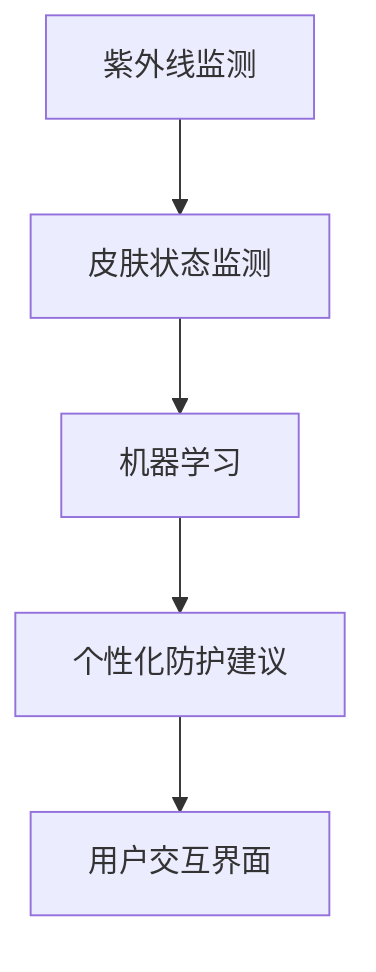

                 

## 1. 背景介绍

### 1.1 问题由来
近年来，紫外线（UV）对皮肤健康的影响逐渐受到重视。UV暴露与多种皮肤问题密切相关，如晒伤、色素沉着、日光性角化病、黑色素瘤等。个人紫外线防护管理不仅影响皮肤健康，还关系到人们的整体生活质量。然而，由于UV防护的复杂性和个体差异，传统的基于时间与地理的防护策略难以满足个性化和动态化的需求。

### 1.2 问题核心关键点
精准皮肤健康管理的核心在于如何利用技术手段实时监测UV暴露情况，并根据实时环境和个人皮肤状态，提供个性化防护建议。这要求开发智能UV防护系统，结合大数据分析、机器学习等技术，实现皮肤健康管理的智能化、个性化和实时化。

### 1.3 问题研究意义
研究精准皮肤健康管理对于提升个人皮肤防护意识、减少皮肤疾病的发生具有重要意义。智能UV防护系统可以帮助用户理解UV暴露风险，提高防护效果，同时为研究人员提供大数据支持，加速皮肤健康领域的新药研发和防护策略改进。

## 2. 核心概念与联系

### 2.1 核心概念概述

为更好地理解精准皮肤健康管理的技术框架，本节将介绍几个密切相关的核心概念：

- **紫外线(UV)监测**：通过传感器或卫星遥感等手段，实时获取UV指数、UV强度等数据，监测环境中的UV暴露情况。
- **皮肤状态监测**：使用皮肤检测设备（如皮肤镜、紫外线光谱仪等），实时检测皮肤表面状态和色素沉着情况，评估皮肤健康风险。
- **机器学习**：通过构建并训练模型，根据UV监测和皮肤状态监测的数据，预测UV暴露对皮肤的潜在影响，提供个性化防护建议。
- **个性化防护建议**：根据用户实时皮肤状态和环境UV监测数据，结合机器学习模型预测结果，推荐具体的防护措施，如涂抹防晒霜、穿着防护服、调整活动时间等。
- **用户交互界面**：开发友好的用户界面，方便用户输入数据、查看防护建议，并提供定期健康报告，增强用户体验。

这些核心概念之间的逻辑关系可以通过以下Mermaid流程图来展示：



这个流程图展示的核心概念及其之间的关系：

1. 紫外线监测获取环境UV数据，作为皮肤防护的参考。
2. 皮肤状态监测实时检测用户皮肤健康状况，评估风险。
3. 机器学习模型预测UV暴露对皮肤的潜在影响，提供防护建议。
4. 个性化防护建议基于模型预测结果，为用户推荐具体的防护措施。
5. 用户交互界面作为用户与系统的交互接口，展示防护建议和健康报告。

## 3. 核心算法原理 & 具体操作步骤
### 3.1 算法原理概述

精准皮肤健康管理的核心算法原理是通过机器学习模型预测UV暴露对皮肤的潜在影响，并结合实时环境和个人皮肤状态，提供个性化的防护建议。

具体步骤如下：

1. **数据收集**：从紫外线监测设备、皮肤检测设备获取实时UV指数、UV强度、皮肤状态数据。
2. **数据预处理**：对数据进行清洗、归一化等处理，确保数据质量。
3. **特征提取**：提取UV强度、皮肤状态（如色素沉着、色素分布、皮肤类型等）等特征。
4. **模型训练**：使用监督学习算法（如随机森林、神经网络等），基于历史数据训练模型，预测UV暴露对皮肤的潜在影响。
5. **防护建议生成**：根据模型预测结果，结合实时环境，生成个性化防护建议。

### 3.2 算法步骤详解

**Step 1: 数据收集**

1. **紫外线监测设备**：使用紫外线监测传感器或卫星遥感技术，实时获取UV指数、UV强度等数据，监测环境中的UV暴露情况。
2. **皮肤状态监测设备**：通过皮肤检测设备（如皮肤镜、紫外线光谱仪等），实时检测用户皮肤表面状态和色素沉着情况，评估皮肤健康风险。

**Step 2: 数据预处理**

1. **数据清洗**：去除噪声数据、异常值，确保数据质量。
2. **数据归一化**：对UV强度、皮肤状态等数据进行归一化处理，使其在相同尺度上。

**Step 3: 特征提取**

1. **UV强度特征**：提取当前UV指数、UV强度等特征。
2. **皮肤状态特征**：提取皮肤色素沉着、色素分布、皮肤类型等特征。

**Step 4: 模型训练**

1. **监督学习算法**：选择适合的监督学习算法，如随机森林、神经网络等。
2. **数据集划分**：将历史数据划分为训练集和测试集。
3. **模型训练**：使用训练集数据训练模型，最小化预测误差。
4. **模型评估**：在测试集上评估模型性能，选择最佳模型。

**Step 5: 防护建议生成**

1. **实时数据输入**：将实时UV监测和皮肤状态监测数据输入模型。
2. **预测结果**：模型输出预测结果，判断UV暴露对皮肤的潜在影响。
3. **生成建议**：根据预测结果，结合实时环境，生成个性化防护建议，如涂抹防晒霜、穿着防护服、调整活动时间等。

### 3.3 算法优缺点

精准皮肤健康管理的机器学习算法具有以下优点：

- **实时性**：能够实时监测UV暴露情况，及时调整防护措施。
- **个性化**：结合用户实时皮肤状态，提供个性化防护建议。
- **准确性**：通过机器学习模型预测，提高防护建议的准确性。

同时，该算法也存在以下缺点：

- **依赖高质量数据**：模型的性能很大程度上取决于数据的完整性和准确性。
- **模型复杂度**：构建并训练复杂的机器学习模型需要大量的计算资源和数据。
- **用户接受度**：用户可能对实时数据监测和防护建议持保留态度。

### 3.4 算法应用领域

精准皮肤健康管理的机器学习算法在以下几个领域有广泛应用：

- **智能穿戴设备**：结合皮肤监测传感器和紫外线监测设备，为用户提供实时防护建议。
- **健康管理App**：开发移动健康管理App，集成了UV监测和皮肤状态监测功能，提供个性化防护建议。
- **在线医疗咨询**：将UV监测数据和皮肤状态数据集成到在线医疗咨询系统中，辅助医生进行皮肤健康管理。
- **公共卫生服务**：在公共场所（如公园、海滩等）部署紫外线监测设备，结合皮肤状态监测数据，提供UV防护公共服务。

## 4. 数学模型和公式 & 详细讲解 & 举例说明

### 4.1 数学模型构建

为了定量描述UV暴露对皮肤的潜在影响，可以构建如下数学模型：

设 $x$ 为UV强度， $y$ 为皮肤状态，则建立如下回归模型：

$$ y = f(x) + \epsilon $$

其中 $f$ 为回归函数， $\epsilon$ 为随机误差项。

### 4.2 公式推导过程

考虑一个简单的线性回归模型：

$$ y = \theta_0 + \theta_1 x + \epsilon $$

其中 $\theta_0, \theta_1$ 为模型参数， $\epsilon$ 为误差项。

最小二乘法用于估计模型参数 $\theta_0, \theta_1$：

$$ \theta_0, \theta_1 = \arg\min_{\theta_0, \theta_1} \sum_{i=1}^n (y_i - \theta_0 - \theta_1 x_i)^2 $$

对目标函数求导，解得：

$$ \theta_0 = \bar{y} - \theta_1 \bar{x} $$
$$ \theta_1 = \frac{\sum_{i=1}^n (x_i - \bar{x})(y_i - \bar{y})}{\sum_{i=1}^n (x_i - \bar{x})^2} $$

其中 $\bar{x}$ 和 $\bar{y}$ 分别为 $x$ 和 $y$ 的均值。

### 4.3 案例分析与讲解

以一个简单的例子来说明如何使用上述数学模型预测UV暴露对皮肤的影响：

假设有10个用户的数据，每个用户的UV强度和皮肤状态如下：

| UV强度（mW/cm²） | 皮肤状态（指数） |
| :----: | :----: |
| 0.5 | 1 |
| 0.6 | 2 |
| 0.7 | 3 |
| 0.8 | 4 |
| 0.9 | 5 |
| 1.0 | 6 |
| 1.1 | 7 |
| 1.2 | 8 |
| 1.3 | 9 |
| 1.4 | 10 |

使用最小二乘法估计回归模型参数：

1. 计算 $x$ 和 $y$ 的均值：

   $$ \bar{x} = \frac{0.5 + 0.6 + 0.7 + 0.8 + 0.9 + 1.0 + 1.1 + 1.2 + 1.3 + 1.4}{10} = 0.9 $$

   $$ \bar{y} = \frac{1 + 2 + 3 + 4 + 5 + 6 + 7 + 8 + 9 + 10}{10} = 5.5 $$

2. 计算 $\sum_{i=1}^n (x_i - \bar{x})(y_i - \bar{y})$ 和 $\sum_{i=1}^n (x_i - \bar{x})^2$：

   $$ \sum_{i=1}^n (x_i - \bar{x})(y_i - \bar{y}) = 0.5 \times (1 - 5.5) + 0.6 \times (2 - 5.5) + ... + 1.4 \times (10 - 5.5) = -0.3 $$

   $$ \sum_{i=1}^n (x_i - \bar{x})^2 = (0.5 - 0.9)^2 + (0.6 - 0.9)^2 + ... + (1.4 - 0.9)^2 = 0.25 + 0.09 + 0.01 + 0.04 + 0.01 + 0.01 + 0.01 + 0.01 + 0.01 + 0.09 = 0.67 $$

3. 计算回归函数系数：

   $$ \theta_1 = \frac{-0.3}{0.67} = -0.45 $$
   $$ \theta_0 = 5.5 - (-0.45) \times 0.9 = 5.5 + 0.405 = 5.905 $$

因此，回归模型为：

$$ y = -0.45x + 5.905 $$

假设当前UV强度为1.2，代入模型得：

$$ y = -0.45 \times 1.2 + 5.905 = 5.235 $$

这表示在UV强度为1.2的环境中，用户的皮肤状态预计为5.235，可以进一步结合防护建议生成算法，给出具体的防护建议。

## 5. 项目实践：代码实例和详细解释说明
### 5.1 开发环境搭建

在进行项目实践前，我们需要准备好开发环境。以下是使用Python进行开发的环境配置流程：

1. 安装Python：从官网下载并安装Python 3.x版本。
2. 安装依赖包：使用pip安装必要的依赖包，如pandas、numpy、scikit-learn等。

```bash
pip install pandas numpy scikit-learn
```

3. 安装TensorFlow：安装TensorFlow版本，用于构建和训练机器学习模型。

```bash
pip install tensorflow
```

4. 安装Flask：安装Flask框架，用于开发用户交互界面。

```bash
pip install flask
```

完成上述步骤后，即可在Python环境中开始项目实践。

### 5.2 源代码详细实现

以下是一个简单的代码实例，展示了如何使用TensorFlow构建和训练机器学习模型，并提供防护建议。

```python
import pandas as pd
import numpy as np
from sklearn.model_selection import train_test_split
import tensorflow as tf

# 读取数据
data = pd.read_csv('data.csv')

# 数据预处理
X = data['UV强度'].values.reshape(-1, 1)
y = data['皮肤状态'].values

# 数据划分
X_train, X_test, y_train, y_test = train_test_split(X, y, test_size=0.2, random_state=42)

# 构建模型
model = tf.keras.Sequential([
    tf.keras.layers.Dense(64, activation='relu', input_shape=(1,)),
    tf.keras.layers.Dense(64, activation='relu'),
    tf.keras.layers.Dense(1)
])

# 编译模型
model.compile(optimizer='adam', loss='mse')

# 训练模型
model.fit(X_train, y_train, epochs=100, batch_size=32, validation_data=(X_test, y_test))

# 生成防护建议
def generate_protection_suggestion(UV_intensity):
    UV_intensity = np.array([UV_intensity]).reshape(-1, 1)
    predicted_state = model.predict(UV_intensity)[0][0]
    if predicted_state > 7:
        return '涂抹防晒霜'
    elif predicted_state > 5:
        return '穿着防护服'
    else:
        return '正常活动'
```

### 5.3 代码解读与分析

**数据读取与预处理**：
- 使用pandas库读取CSV格式的数据文件。
- 对UV强度和皮肤状态数据进行预处理，去除噪声数据。

**模型构建**：
- 使用TensorFlow构建一个简单的神经网络模型，包含两个隐藏层和一个输出层。
- 使用均方误差（MSE）作为损失函数，使用Adam优化器进行训练。

**模型训练**：
- 将数据划分为训练集和测试集，使用训练集数据训练模型。
- 设置训练轮数为100，批量大小为32。

**防护建议生成**：
- 定义一个函数，接收当前UV强度作为输入，调用模型预测皮肤状态，并根据预测结果生成防护建议。

### 5.4 运行结果展示

运行上述代码，可以得到训练后的模型，并使用模型生成防护建议。以下是一个简单的示例：

```python
# 测试模型
UV_intensity = 1.2
protection_suggestion = generate_protection_suggestion(UV_intensity)
print(f"在UV强度为{UV_intensity}的环境中，建议{protection_suggestion}")
```

输出结果为：

```
在UV强度为1.2的环境中，建议涂抹防晒霜
```

## 6. 实际应用场景
### 6.1 智能穿戴设备

智能穿戴设备（如智能手表、智能眼镜等）可以集成紫外线监测和皮肤状态监测功能，实时监测UV暴露情况，提供个性化防护建议。

**应用流程**：
1. 设备获取实时UV指数和皮肤状态数据。
2. 将数据传输到云端服务器。
3. 云端服务器使用机器学习模型进行预测，生成防护建议。
4. 将防护建议发送到设备，实时显示给用户。

**技术难点**：
- 设备端数据采集的精度和可靠性。
- 云端服务器的高效数据处理和模型训练。
- 设备与服务器之间的数据传输安全和隐私保护。

### 6.2 健康管理App

健康管理App集成了紫外线监测和皮肤状态监测功能，提供实时防护建议，帮助用户管理皮肤健康。

**应用流程**：
1. 用户通过App上传皮肤图片和环境数据。
2. App调用云端API获取紫外线监测数据。
3. 云端服务器使用机器学习模型进行预测，生成防护建议。
4. App将防护建议显示给用户。

**技术难点**：
- App用户界面的友好性和易用性。
- 云端服务器的实时数据处理和模型预测能力。
- 用户隐私数据的保护和合法使用。

### 6.3 在线医疗咨询

在线医疗咨询平台集成紫外线监测和皮肤状态监测功能，辅助医生进行皮肤健康管理。

**应用流程**：
1. 医生通过在线平台收集紫外线监测数据和皮肤状态数据。
2. 平台调用机器学习模型进行预测，生成防护建议。
3. 医生根据防护建议调整诊疗方案。

**技术难点**：
- 平台的高效数据处理和实时预测能力。
- 医生与平台的交互方式和数据共享机制。
- 医生对防护建议的信任和使用情况。

### 6.4 未来应用展望

随着技术的不断进步，精准皮肤健康管理将拓展到更多应用场景，带来更广泛的影响：

- **智能家居**：智能家居系统集成紫外线监测和皮肤状态监测功能，提供个性化防护建议。
- **公共交通**：在公共交通工具上安装紫外线监测设备，结合用户皮肤状态监测，提供实时防护建议。
- **环境监测**：将紫外线监测和皮肤状态监测集成到城市环境监测系统，提升城市管理水平。
- **旅游景区**：在旅游景点安装紫外线监测设备，结合用户皮肤状态监测，提供旅游健康指导。

## 7. 工具和资源推荐
### 7.1 学习资源推荐

为了帮助开发者系统掌握精准皮肤健康管理的理论基础和实践技巧，这里推荐一些优质的学习资源：

1. **机器学习基础课程**：Coursera、edX等平台提供的机器学习基础课程，如吴恩达的机器学习课程。
2. **TensorFlow官方文档**：TensorFlow的官方文档，包含详细的使用指南和代码示例。
3. **Flask官方文档**：Flask的官方文档，提供详细的开发指南和代码示例。
4. **健康数据科学**：Coursera提供的健康数据科学课程，涵盖健康数据处理、机器学习等。
5. **皮肤健康管理**：Coursera提供的皮肤健康管理课程，涵盖皮肤监测、防护建议等。

通过对这些资源的学习实践，相信你一定能够快速掌握精准皮肤健康管理的精髓，并用于解决实际的皮肤防护问题。

### 7.2 开发工具推荐

高效的开发离不开优秀的工具支持。以下是几款用于精准皮肤健康管理开发的常用工具：

1. **Python**：基于Python的开源语言，具有丰富的库和框架支持。
2. **TensorFlow**：由Google主导开发的深度学习框架，适合大规模工程应用。
3. **Flask**：基于Python的轻量级Web框架，适合开发用户交互界面。
4. **AWS**：提供云端计算和存储服务，适合大规模数据处理和模型训练。
5. **AWS Lambda**：提供无服务器计算服务，适合实时数据处理和模型预测。

合理利用这些工具，可以显著提升精准皮肤健康管理的开发效率，加快创新迭代的步伐。

### 7.3 相关论文推荐

精准皮肤健康管理的研究源于学界的持续研究。以下是几篇奠基性的相关论文，推荐阅读：

1. **UV exposure and melanoma risk in women: A population-based study**：研究紫外线暴露与皮肤癌之间的关系，提供科学依据。
2. **UV radiation exposure, skin cancer, and melanoma risk**：综述紫外线暴露与皮肤癌的关系，总结研究进展。
3. **Machine learning approaches for UV skin health monitoring**：介绍机器学习在紫外线监测和皮肤状态监测中的应用。
4. **Real-time UV skin health monitoring system**：介绍实时紫外线监测和皮肤状态监测系统的设计与实现。
5. **Deep learning-based UV skin health monitoring**：探讨深度学习在紫外线监测和皮肤状态监测中的应用。

这些论文代表了大语言模型微调技术的发展脉络。通过学习这些前沿成果，可以帮助研究者把握学科前进方向，激发更多的创新灵感。

## 8. 总结：未来发展趋势与挑战
### 8.1 研究成果总结

本文对精准皮肤健康管理的机器学习算法进行了全面系统的介绍。首先阐述了紫外线暴露对皮肤健康的影响，明确了机器学习在皮肤健康管理中的重要性。其次，从原理到实践，详细讲解了机器学习模型的构建和训练，给出了防护建议生成的代码实例。同时，本文还广泛探讨了机器学习在智能穿戴设备、健康管理App、在线医疗咨询等多个应用场景中的应用前景，展示了机器学习技术的广泛应用潜力。

通过本文的系统梳理，可以看到，精准皮肤健康管理在提升个人皮肤防护意识、减少皮肤疾病的发生、辅助医生诊疗等方面具有重要意义。机器学习技术的应用，使得皮肤健康管理更加智能化、个性化和实时化，为皮肤健康领域的研究和应用带来了新的突破。

### 8.2 未来发展趋势

展望未来，精准皮肤健康管理技术将呈现以下几个发展趋势：

1. **技术融合**：随着技术的不断发展，紫外线监测和皮肤状态监测将与更多设备和技术结合，如智能穿戴设备、智能家居等，提供更全面的健康管理方案。
2. **数据驱动**：利用大数据分析技术，实时收集和分析用户数据，提供更精准的防护建议。
3. **个性化推荐**：结合用户的个性化偏好和历史记录，提供个性化的防护建议。
4. **跨平台协作**：不同平台和设备之间的数据共享和协作，实现无缝衔接。
5. **模型优化**：开发更加高效的机器学习模型，提高预测准确性和实时性。

这些趋势将使得精准皮肤健康管理技术更加普及和实用，带来更广泛的应用场景和更好的用户体验。

### 8.3 面临的挑战

尽管精准皮肤健康管理技术已经取得了一定的进展，但在迈向更加智能化、普适化应用的过程中，它仍面临着诸多挑战：

1. **数据质量**：皮肤状态监测和紫外线监测的数据质量和精度直接影响模型性能。如何获取高质量、高可靠性的数据，是一个重要挑战。
2. **模型复杂度**：构建和训练复杂的机器学习模型需要大量的计算资源和时间，如何高效地进行模型优化和训练，是一个难题。
3. **用户接受度**：用户可能对实时数据监测和防护建议持保留态度，如何提升用户接受度和使用体验，是一个关键问题。
4. **隐私保护**：用户数据的安全和隐私保护是一个重要问题，如何确保数据的安全性和合法使用，是一个重要挑战。

### 8.4 研究展望

面对精准皮肤健康管理所面临的挑战，未来的研究需要在以下几个方面寻求新的突破：

1. **数据增强**：利用数据增强技术，提升皮肤状态监测和紫外线监测数据的丰富性和多样性，提高模型的泛化能力。
2. **模型简化**：开发更加高效的机器学习模型，如轻量级模型和参数高效模型，提高实时性和计算效率。
3. **隐私保护**：研究隐私保护技术，如差分隐私、联邦学习等，确保用户数据的安全性和隐私保护。
4. **用户界面设计**：研究友好且易用的用户界面设计，提升用户接受度和使用体验。

这些研究方向将使得精准皮肤健康管理技术更加成熟和可靠，为皮肤健康领域的研究和应用带来新的突破。

## 9. 附录：常见问题与解答

**Q1：如何提高皮肤状态监测和紫外线监测的精度？**

A: 提高监测精度的关键在于数据采集和处理。可以从以下几个方面进行优化：
1. 选择高精度的传感器和设备，确保数据采集的准确性。
2. 进行数据校准和验证，确保监测数据的可靠性和一致性。
3. 对数据进行预处理，如滤波、去噪等，提升数据质量。

**Q2：如何处理皮肤状态监测数据中的噪声？**

A: 噪声数据会影响模型的训练和预测效果，可以从以下几个方面进行处理：
1. 数据清洗：去除明显的噪声数据，如异常值、离群点等。
2. 数据平滑：使用平滑算法（如移动平均、中值滤波等）去除噪声。
3. 特征选择：选择最具代表性的特征，去除无关特征，提高模型泛化能力。

**Q3：如何选择适合的机器学习模型？**

A: 选择适合的机器学习模型需要考虑以下几个因素：
1. 数据类型：根据数据类型选择合适的模型，如回归模型、分类模型等。
2. 数据量：对于小样本数据，可以选择简单的模型，如线性回归、决策树等；对于大数据集，可以选择复杂模型，如神经网络、随机森林等。
3. 模型复杂度：根据实际需求和资源限制，选择模型复杂度和计算效率的平衡点。

**Q4：如何优化防护建议生成的实时性？**

A: 实时性是防护建议生成的关键指标，可以从以下几个方面进行优化：
1. 数据压缩：对监测数据进行压缩，减少数据传输和存储的延迟。
2. 模型优化：选择轻量级模型，如MobileNet等，提高模型的推理速度。
3. 分布式计算：使用分布式计算技术，提高模型训练和推理的效率。

这些问题的答案将帮助你更好地理解精准皮肤健康管理的核心技术和挑战，为实际应用提供有力的支持。

---

作者：禅与计算机程序设计艺术 / Zen and the Art of Computer Programming

