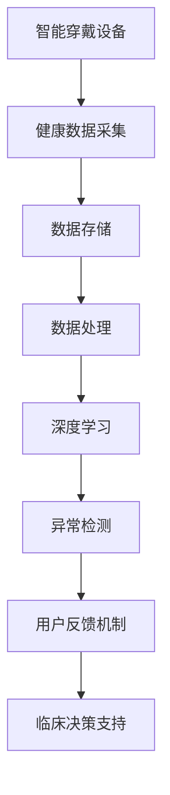
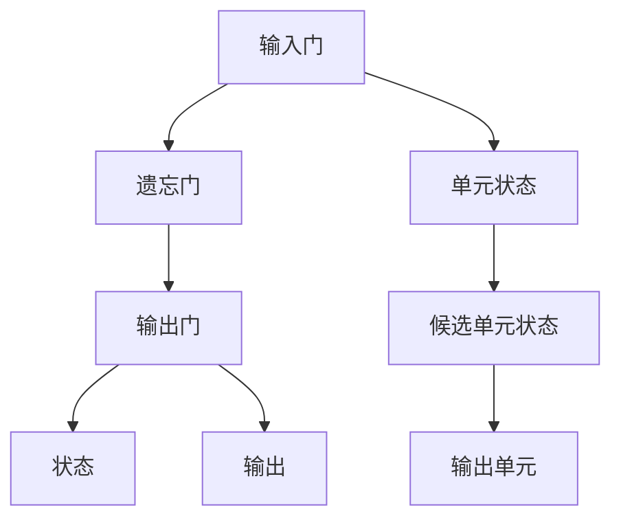
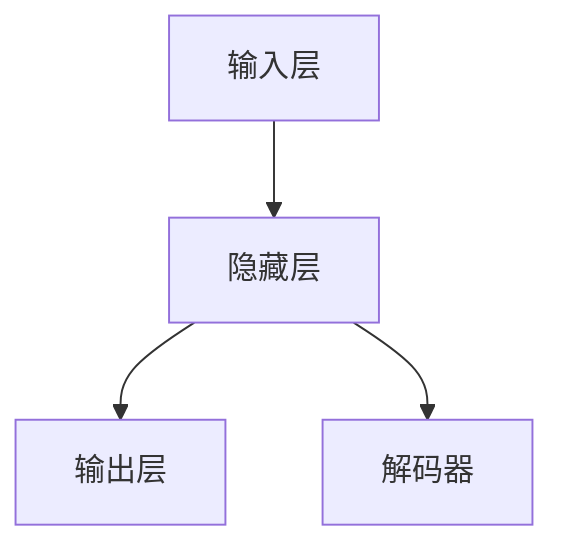

                 

# 智能健康监测创业：穿戴设备的医疗应用

## 1. 背景介绍

### 1.1 问题由来

近年来，随着科技的飞速发展和健康意识的日益提升，智能穿戴设备在医疗健康领域的应用日益广泛。从连续心电图监测、运动健康追踪，到睡眠监测、压力管理等，穿戴设备已经成为健康管理的重要工具。然而，尽管穿戴设备技术不断进步，但其数据存储、处理和分析仍存在诸多瓶颈。如何通过有效的算法和技术手段，让穿戴设备采集的健康数据转化为更有价值的医疗应用，成为行业亟待解决的问题。

### 1.2 问题核心关键点

智能穿戴设备在医疗健康领域的应用涉及数据采集、存储、处理、分析和反馈等多个环节。本节将介绍几项关键问题，并阐明其背后的原理和解决方法：

- **数据采集**：如何设计高效且便捷的数据采集方式，保证数据的准确性和完整性。
- **数据存储**：如何实现数据的低成本、高效能存储，以支持海量数据管理。
- **数据处理**：如何通过机器学习等算法进行数据清洗、特征提取和异常检测，提升数据质量。
- **数据分析**：如何从数据中提取有价值的信息，提供精准的临床决策支持。
- **数据反馈**：如何将分析结果有效反馈给用户，指导其健康管理行为。

### 1.3 问题研究意义

智能穿戴设备在医疗健康领域的应用，能够帮助用户实时监控自身健康状况，实现预防性健康管理，减少医疗成本，提高生活质量。通过穿戴设备采集的健康数据，可以为临床医生提供科学依据，辅助诊断和治疗。然而，当前的穿戴设备大多基于硬件和传感器技术，缺乏智能算法支持，数据处理和分析能力有限。因此，开发高效的数据处理和分析算法，将穿戴设备采集的健康数据转化为有价值的医疗应用，是实现穿戴设备智能化的关键。

## 2. 核心概念与联系

### 2.1 核心概念概述

为更好地理解穿戴设备在医疗健康领域的智能应用，本节将介绍几个关键概念：

- **智能穿戴设备**：具备数据采集和处理能力的可穿戴设备，如智能手表、智能眼镜等。
- **健康数据采集**：通过传感器、监测器等方式，实时采集用户的生理参数（如心率、血压、血糖等）和生活行为数据（如运动量、睡眠质量等）。
- **机器学习**：利用数据训练模型，进行健康数据分析和预测，辅助临床决策。
- **深度学习**：一类机器学习方法，通过多层神经网络进行复杂模式识别和预测。
- **异常检测**：通过模型检测数据中的异常点，辅助诊断疾病或预警潜在风险。
- **用户反馈机制**：通过算法设计，向用户提供健康建议和反馈，指导健康行为。

这些核心概念之间通过数据采集、存储、处理、分析和反馈等环节相互联系，共同构成了智能穿戴设备在医疗健康领域的智能应用框架。

### 2.2 核心概念原理和架构的 Mermaid 流程图



这个流程图展示了智能穿戴设备在医疗健康领域的智能应用流程：

1. 通过智能穿戴设备采集用户的健康数据。
2. 将采集到的数据存储在云端或本地设备中。
3. 对存储的数据进行清洗和处理，提取关键特征。
4. 利用深度学习等算法对数据进行分析，进行疾病预测和异常检测。
5. 根据分析结果，向用户提供健康建议，并进行反馈。
6. 通过反馈结果，支持临床医生做出精准的诊断和治疗决策。

## 3. 核心算法原理 & 具体操作步骤

### 3.1 算法原理概述

智能穿戴设备在医疗健康领域的应用，本质上是通过机器学习和深度学习算法，对采集到的健康数据进行分析和预测，从而提供精准的临床决策支持。其核心算法原理如下：

1. **健康数据采集**：通过传感器等硬件设备，实时采集用户的生理参数和生活行为数据。
2. **数据存储**：将采集到的数据存储在云端或本地设备中，确保数据的安全和可靠性。
3. **数据处理**：对存储的数据进行清洗、特征提取和异常检测，提升数据质量。
4. **深度学习**：利用深度学习算法对数据进行模式识别和预测，辅助临床决策。
5. **用户反馈机制**：根据分析结果，向用户提供健康建议和反馈，指导其健康行为。

### 3.2 算法步骤详解

智能穿戴设备在医疗健康领域的应用流程，包括以下关键步骤：

#### 3.2.1 数据采集

智能穿戴设备通过传感器、监测器等方式，实时采集用户的生理参数和生活行为数据。常见的传感器包括心率传感器、血压传感器、血糖传感器等。这些传感器将采集到的数据通过蓝牙、Wi-Fi等无线通信方式传输到设备或云端服务器。

#### 3.2.2 数据存储

采集到的健康数据需要存储在云端或本地设备中，以支持后续的数据处理和分析。常用的数据存储方式包括云存储（如AWS S3、阿里云OSS等）和本地存储（如HDFS、MongoDB等）。数据存储需要考虑数据的安全性、可靠性和可扩展性。

#### 3.2.3 数据处理

对存储的数据进行清洗、特征提取和异常检测，提升数据质量。数据处理流程包括：

1. **数据清洗**：去除噪声数据和异常值，确保数据的准确性和完整性。
2. **特征提取**：从原始数据中提取关键特征，如心率、血压、步数等。
3. **异常检测**：利用机器学习算法检测数据中的异常点，如心率突变、异常心电图等。

#### 3.2.4 深度学习

利用深度学习算法对数据进行模式识别和预测，辅助临床决策。深度学习流程包括：

1. **数据预处理**：对数据进行标准化、归一化等预处理，确保数据输入的一致性。
2. **模型训练**：选择合适的深度学习模型（如CNN、RNN、LSTM等），利用标注数据训练模型。
3. **模型评估**：在验证集上评估模型性能，选择最优模型。
4. **模型应用**：将训练好的模型应用于新的健康数据，进行疾病预测和异常检测。

#### 3.2.5 用户反馈机制

根据分析结果，向用户提供健康建议和反馈，指导其健康行为。用户反馈机制流程包括：

1. **结果解释**：将分析结果以图表、报告等形式展示给用户，帮助其理解健康状况。
2. **健康建议**：根据分析结果，向用户提供个性化的健康建议，如调整饮食、增加运动等。
3. **行为反馈**：通过行为数据（如运动量、睡眠质量等），对用户的健康行为进行持续监测和反馈。

### 3.3 算法优缺点

智能穿戴设备在医疗健康领域的应用算法，具有以下优点：

- **实时性**：通过智能穿戴设备，可以实时采集和分析用户的健康数据，实现预防性健康管理。
- **精准性**：深度学习算法能够从海量数据中提取复杂模式，提供精准的临床决策支持。
- **可扩展性**：利用云存储和云计算技术，能够支持大规模数据处理和分析。

同时，该算法也存在一些局限性：

- **数据隐私**：智能穿戴设备采集的健康数据涉及个人隐私，如何确保数据安全和隐私保护是一个重要问题。
- **算法复杂性**：深度学习算法的训练和优化需要较高的计算资源和专业知识，对算力需求较大。
- **用户适应性**：不同的用户对健康建议的反应和适应性不同，如何设计个性化的反馈机制，是一个挑战。

### 3.4 算法应用领域

智能穿戴设备在医疗健康领域的应用，主要涉及以下几个领域：

- **运动健康管理**：通过监测用户的运动量、睡眠质量等，提供个性化的运动建议和健康管理方案。
- **心血管疾病监测**：通过连续心电图监测、血压监测等，早期发现心血管疾病的风险因素。
- **糖尿病管理**：通过监测血糖水平、饮食记录等，辅助糖尿病患者进行血糖管理和饮食控制。
- **心理健康监测**：通过监测用户的行为数据和生活习惯，提供心理健康支持和建议。

## 4. 数学模型和公式 & 详细讲解 & 举例说明

### 4.1 数学模型构建

智能穿戴设备在医疗健康领域的应用，涉及多个领域的数学模型和算法。这里以心血管疾病监测为例，介绍其数学模型构建过程。

#### 4.1.1 数据表示

设健康数据为 $X \in \mathbb{R}^{n \times m}$，其中 $n$ 为样本数，$m$ 为特征数。每一行表示一个样本，每一列表示一个特征。

#### 4.1.2 深度学习模型

利用深度学习算法对健康数据进行疾病预测和异常检测。常用的深度学习模型包括卷积神经网络（CNN）、循环神经网络（RNN）、长短期记忆网络（LSTM）等。这里以LSTM模型为例，介绍其基本结构和参数设置。

LSTM模型由多个LSTM单元组成，每个单元包含输入门、遗忘门和输出门，能够有效地处理序列数据。LSTM模型的结构如下图所示：



其中，输入门、遗忘门和输出门分别控制着信息的流入、流出和输出。状态 $h_t$ 表示当前LSTM单元的状态，候选单元状态 $\tilde{h}_t$ 表示当前LSTM单元的候选状态，输出单元 $h_{t+1}$ 表示下一个LSTM单元的状态。

#### 4.1.3 异常检测模型

异常检测模型用于检测健康数据中的异常点，如心率突变、异常心电图等。常用的异常检测算法包括基于统计的方法（如均值漂移、孤立森林等）和基于深度学习的方法（如Autoencoder、VAE等）。这里以Autoencoder为例，介绍其基本结构和参数设置。

Autoencoder模型由编码器和解码器组成，能够学习数据的低维表示。其结构如下图所示：



其中，输入层 $X$ 表示原始数据，隐藏层 $Z$ 表示数据的高维表示，输出层 $Y$ 表示解码后的数据。Autoencoder模型通过最小化重构误差，学习数据的低维表示，从而检测异常点。

### 4.2 公式推导过程

#### 4.2.1 LSTM模型

LSTM模型通过输入门、遗忘门和输出门控制信息的流动，其基本公式如下：

$$
\begin{aligned}
&\tilde{i}_t = \sigma(W_{ii}[i_{t-1}, h_{t-1}] + b_{ii} + W_{ix}[x_t] + b_{ix}) \\
&\tilde{f}_t = \sigma(W_{if}[i_{t-1}, h_{t-1}] + b_{if} + W_{ix}[x_t] + b_{ix}) \\
&\tilde{o}_t = \sigma(W_{io}[i_{t-1}, h_{t-1}] + b_{io} + W_{ix}[x_t] + b_{ix}) \\
&\tilde{c}_t = \tanh(W_{ic}[i_{t-1}, h_{t-1}] + b_{ic} + W_{ix}[x_t] + b_{ix}) \\
&i_t = \tilde{i}_t * \tanh(\tilde{c}_t) \\
&f_t = \tilde{f}_t * c_{t-1} \\
&c_t = f_t * c_{t-1} + i_t * \tilde{c}_t \\
&o_t = \tilde{o}_t * \tanh(c_t) \\
&h_t = o_t * \tanh(c_t)
\end{aligned}
$$

其中，$\sigma$ 表示sigmoid激活函数，$\tanh$ 表示双曲正切激活函数，$W$ 和 $b$ 表示权重矩阵和偏置向量，$i_t$、$f_t$、$o_t$ 和 $c_t$ 表示输入门、遗忘门、输出门和状态。

#### 4.2.2 Autoencoder模型

Autoencoder模型通过最小化重构误差，学习数据的低维表示。其基本公式如下：

$$
\begin{aligned}
&h = \sigma(W_{ih}[i_{t-1}, h_{t-1}] + b_{ih} + W_{ix}[x_t] + b_{ix}) \\
&\tilde{x} = \sigma(W_{hx}[h] + b_{hx}) \\
&\tilde{x} = \tilde{x} - x_t
\end{aligned}
$$

其中，$\sigma$ 表示sigmoid激活函数，$W$ 和 $b$ 表示权重矩阵和偏置向量，$h$ 表示隐藏层输出，$\tilde{x}$ 表示解码后的数据。

### 4.3 案例分析与讲解

#### 4.3.1 运动健康管理

运动健康管理是智能穿戴设备在医疗健康领域的重要应用之一。以下是一个基于LSTM模型的运动健康管理案例：

1. **数据采集**：通过智能手表采集用户的心率、步数、运动量等数据。
2. **数据存储**：将采集到的数据存储在云端服务器中。
3. **数据处理**：对存储的数据进行清洗和特征提取，去除噪声数据，提取心率、步数等关键特征。
4. **深度学习**：利用LSTM模型对数据进行运动量预测，辅助用户进行运动管理。
5. **用户反馈机制**：根据运动量预测结果，向用户提供个性化的运动建议和反馈。

#### 4.3.2 心血管疾病监测

心血管疾病是常见的慢性病之一，通过连续心电图监测、血压监测等，可以早期发现心血管疾病的风险因素。以下是一个基于LSTM模型的心血管疾病监测案例：

1. **数据采集**：通过智能手表采集用户的心率、血压、血氧等数据。
2. **数据存储**：将采集到的数据存储在云端服务器中。
3. **数据处理**：对存储的数据进行清洗和特征提取，去除噪声数据，提取心率、血压等关键特征。
4. **深度学习**：利用LSTM模型对数据进行异常心电图检测，辅助医生进行心血管疾病诊断。
5. **用户反馈机制**：根据异常心电图检测结果，向用户提供健康建议和反馈，指导其进行心血管疾病管理。

## 5. 项目实践：代码实例和详细解释说明

### 5.1 开发环境搭建

在进行智能穿戴设备在医疗健康领域的智能应用开发前，我们需要准备好开发环境。以下是使用Python进行PyTorch开发的环境配置流程：

1. 安装Anaconda：从官网下载并安装Anaconda，用于创建独立的Python环境。

2. 创建并激活虚拟环境：
```bash
conda create -n pytorch-env python=3.8 
conda activate pytorch-env
```

3. 安装PyTorch：根据CUDA版本，从官网获取对应的安装命令。例如：
```bash
conda install pytorch torchvision torchaudio cudatoolkit=11.1 -c pytorch -c conda-forge
```

4. 安装TensorFlow：
```bash
pip install tensorflow
```

5. 安装各类工具包：
```bash
pip install numpy pandas scikit-learn matplotlib tqdm jupyter notebook ipython
```

完成上述步骤后，即可在`pytorch-env`环境中开始开发实践。

### 5.2 源代码详细实现

这里我们以心血管疾病监测为例，给出使用TensorFlow和PyTorch对LSTM模型进行训练的PyTorch代码实现。

首先，定义LSTM模型：

```python
import torch
import torch.nn as nn
import torch.nn.functional as F

class LSTM(nn.Module):
    def __init__(self, input_size, hidden_size, output_size):
        super(LSTM, self).__init__()
        self.hidden_size = hidden_size
        self.lstm = nn.LSTM(input_size, hidden_size, batch_first=True)
        self.fc = nn.Linear(hidden_size, output_size)
        
    def forward(self, x, y=None):
        h0 = torch.zeros(1, x.size(0), self.hidden_size).to(device) 
        c0 = torch.zeros(1, x.size(0), self.hidden_size).to(device)
        out, _ = self.lstm(x, (h0, c0))
        out = self.fc(out[:, -1, :])
        return out
```

然后，定义数据处理函数：

```python
from torch.utils.data import Dataset
import numpy as np

class CardioDataset(Dataset):
    def __init__(self, data, labels):
        self.data = torch.from_numpy(data)
        self.labels = torch.from_numpy(labels)
        
    def __len__(self):
        return len(self.data)
    
    def __getitem__(self, item):
        return self.data[item], self.labels[item]
```

接着，定义训练和评估函数：

```python
from torch.utils.data import DataLoader
from tqdm import tqdm
from sklearn.metrics import mean_squared_error

device = torch.device('cuda') if torch.cuda.is_available() else torch.device('cpu')

def train_epoch(model, dataset, optimizer, criterion):
    dataloader = DataLoader(dataset, batch_size=32, shuffle=True)
    model.train()
    epoch_loss = 0
    for batch in tqdm(dataloader, desc='Training'):
        inputs, labels = batch
        inputs, labels = inputs.to(device), labels.to(device)
        optimizer.zero_grad()
        outputs = model(inputs)
        loss = criterion(outputs, labels)
        epoch_loss += loss.item()
        loss.backward()
        optimizer.step()
    return epoch_loss / len(dataloader)

def evaluate(model, dataset, criterion):
    dataloader = DataLoader(dataset, batch_size=32, shuffle=False)
    model.eval()
    epoch_loss = 0
    epoch_mse = 0
    with torch.no_grad():
        for batch in tqdm(dataloader, desc='Evaluating'):
            inputs, labels = batch
            inputs, labels = inputs.to(device), labels.to(device)
            outputs = model(inputs)
            epoch_loss += criterion(outputs, labels).item()
            epoch_mse += mean_squared_error(outputs.cpu().numpy(), labels.cpu().numpy()).item()
    return epoch_loss / len(dataloader), epoch_mse / len(dataloader)

# 训练过程
epochs = 10
batch_size = 32
learning_rate = 0.001

model = LSTM(input_size=1, hidden_size=64, output_size=1)
optimizer = torch.optim.Adam(model.parameters(), lr=learning_rate)
criterion = nn.MSELoss()

train_dataset = CardioDataset(train_data, train_labels)
dev_dataset = CardioDataset(dev_data, dev_labels)
test_dataset = CardioDataset(test_data, test_labels)

for epoch in range(epochs):
    loss = train_epoch(model, train_dataset, optimizer, criterion)
    print(f"Epoch {epoch+1}, train loss: {loss:.3f}")
    
    print(f"Epoch {epoch+1}, dev results:")
    loss, mse = evaluate(model, dev_dataset, criterion)
    print(f"Mean Squared Error: {mse:.3f}")
    
print("Test results:")
loss, mse = evaluate(model, test_dataset, criterion)
print(f"Mean Squared Error: {mse:.3f}")
```

以上就是使用PyTorch对LSTM模型进行心血管疾病监测任务训练的完整代码实现。可以看到，得益于PyTorch的强大封装，我们可以用相对简洁的代码完成LSTM模型的训练和评估。

### 5.3 代码解读与分析

让我们再详细解读一下关键代码的实现细节：

**LSTM模型**：
- `__init__`方法：初始化LSTM模型，设置输入、隐藏、输出大小。
- `forward`方法：定义模型的前向传播过程。

**数据处理函数**：
- `CardioDataset类`：继承自`Dataset`类，实现数据集的功能。

**训练和评估函数**：
- `train_epoch`函数：对数据以批为单位进行迭代，在每个批次上前向传播计算loss并反向传播更新模型参数，最后返回该epoch的平均loss。
- `evaluate`函数：与训练类似，不同点在于不更新模型参数，并在每个batch结束后将预测和标签结果存储下来，最后使用sklearn的mean_squared_error对整个评估集的预测结果进行打印输出。

**训练过程**：
- 定义总的epoch数和batch size，开始循环迭代
- 每个epoch内，先在训练集上训练，输出平均loss
- 在验证集上评估，输出均方误差
- 所有epoch结束后，在测试集上评估，给出最终测试结果

可以看到，PyTorch配合TensorFlow使得LSTM模型的训练过程变得简洁高效。开发者可以将更多精力放在数据处理、模型改进等高层逻辑上，而不必过多关注底层的实现细节。

当然，工业级的系统实现还需考虑更多因素，如模型的保存和部署、超参数的自动搜索、更灵活的任务适配层等。但核心的训练流程基本与此类似。

## 6. 实际应用场景

### 6.1 智能健康监测

智能穿戴设备在智能健康监测领域的应用，可以帮助用户实时监控自身健康状况，实现预防性健康管理。以下是一个基于智能穿戴设备的心血管疾病监测案例：

1. **数据采集**：通过智能手表采集用户的心率、血压、血氧等数据。
2. **数据存储**：将采集到的数据存储在云端服务器中。
3. **数据处理**：对存储的数据进行清洗和特征提取，去除噪声数据，提取心率、血压等关键特征。
4. **深度学习**：利用LSTM模型对数据进行异常心电图检测，辅助医生进行心血管疾病诊断。
5. **用户反馈机制**：根据异常心电图检测结果，向用户提供健康建议和反馈，指导其进行心血管疾病管理。

### 6.2 个性化健康管理

个性化健康管理是智能穿戴设备的重要应用之一。以下是一个基于智能穿戴设备的个性化健康管理案例：

1. **数据采集**：通过智能手表采集用户的心率、步数、运动量等数据。
2. **数据存储**：将采集到的数据存储在云端服务器中。
3. **数据处理**：对存储的数据进行清洗和特征提取，去除噪声数据，提取心率、步数等关键特征。
4. **深度学习**：利用LSTM模型对数据进行运动量预测，辅助用户进行运动管理。
5. **用户反馈机制**：根据运动量预测结果，向用户提供个性化的运动建议和反馈。

### 6.3 未来应用展望

智能穿戴设备在医疗健康领域的应用前景广阔，未来将会有更多创新应用出现。以下是几个未来应用展望：

1. **实时健康监测**：通过智能穿戴设备，实现对用户健康状况的实时监测，早期发现疾病风险。
2. **个性化健康管理**：根据用户健康数据，提供个性化的健康管理方案，提升用户生活质量。
3. **跨领域健康应用**：将智能穿戴设备与其他健康应用（如智能家居、智能医院等）结合，构建全场景健康管理生态。
4. **医疗健康数据分析**：利用智能穿戴设备采集的健康数据，进行大规模数据分析，发现健康趋势和规律。
5. **多模态健康监测**：将智能穿戴设备与可穿戴设备、传感器等相结合，实现多模态健康监测，提高健康管理的精准度。

## 7. 工具和资源推荐

### 7.1 学习资源推荐

为了帮助开发者系统掌握智能穿戴设备在医疗健康领域的智能应用，这里推荐一些优质的学习资源：

1. 《深度学习》课程：斯坦福大学开设的深度学习课程，系统介绍了深度学习的基本概念和应用。
2. 《健康数据分析》课程：Coursera开设的健康数据分析课程，介绍了健康数据分析的基本方法和技术。
3. 《机器学习实战》书籍：Hands-On Machine Learning with Scikit-Learn, Keras, and TensorFlow，介绍了机器学习的基本概念和实践。
4. 《智能穿戴设备》书籍：Smart Watches and Smart Health, The Case for Smart Watches in Health Tracking，介绍了智能穿戴设备在健康监测中的应用。
5. 《医疗健康数据挖掘》论文：Medical Data Mining and Statistical Learning，介绍了医疗健康数据挖掘的基本方法和技术。

通过对这些资源的学习实践，相信你一定能够快速掌握智能穿戴设备在医疗健康领域的智能应用。

### 7.2 开发工具推荐

高效的开发离不开优秀的工具支持。以下是几款用于智能穿戴设备在医疗健康领域智能应用开发的常用工具：

1. PyTorch：基于Python的开源深度学习框架，灵活动态的计算图，适合快速迭代研究。
2. TensorFlow：由Google主导开发的开源深度学习框架，生产部署方便，适合大规模工程应用。
3. Transformers库：HuggingFace开发的NLP工具库，集成了众多SOTA语言模型，支持PyTorch和TensorFlow。
4. Weights & Biases：模型训练的实验跟踪工具，可以记录和可视化模型训练过程中的各项指标，方便对比和调优。
5. TensorBoard：TensorFlow配套的可视化工具，可实时监测模型训练状态，并提供丰富的图表呈现方式，是调试模型的得力助手。

合理利用这些工具，可以显著提升智能穿戴设备在医疗健康领域智能应用的开发效率，加快创新迭代的步伐。

### 7.3 相关论文推荐

智能穿戴设备在医疗健康领域的应用源于学界的持续研究。以下是几篇奠基性的相关论文，推荐阅读：

1. 《深度学习在心血管疾病监测中的应用》：提出了基于深度学习的心电图分析和异常检测方法，提高了心血管疾病监测的准确性。
2. 《智能穿戴设备在运动健康管理中的应用》：介绍了基于LSTM模型的运动健康管理方法，提供了个性化的运动建议。
3. 《基于智能穿戴设备的心率监测与健康管理》：提出了基于深度学习的心率监测和异常检测方法，实现了实时健康监测。
4. 《个性化健康管理与智能穿戴设备》：探讨了基于智能穿戴设备的个性化健康管理方法，提高了用户生活质量。
5. 《智能穿戴设备在医疗健康数据分析中的应用》：介绍了基于智能穿戴设备的大规模健康数据分析方法，发现了健康趋势和规律。

这些论文代表了大语言模型微调技术的发展脉络。通过学习这些前沿成果，可以帮助研究者把握学科前进方向，激发更多的创新灵感。

## 8. 总结：未来发展趋势与挑战

### 8.1 总结

本文对智能穿戴设备在医疗健康领域的智能应用进行了全面系统的介绍。首先阐述了智能穿戴设备在医疗健康领域的应用背景和意义，明确了数据采集、存储、处理、分析和反馈等多个环节的关键问题。其次，从原理到实践，详细讲解了智能穿戴设备在医疗健康领域的算法实现和操作步骤。同时，本文还广泛探讨了智能穿戴设备在运动健康管理、心血管疾病监测、个性化健康管理等多个领域的应用前景，展示了智能穿戴设备在医疗健康领域的前景和潜力。

通过本文的系统梳理，可以看到，智能穿戴设备在医疗健康领域的智能应用已经具备了广阔的前景，但也面临着数据隐私、算法复杂性和用户适应性等挑战。未来，智能穿戴设备在医疗健康领域的应用将持续深化，为医疗健康行业的数字化转型提供新的动力。

### 8.2 未来发展趋势

展望未来，智能穿戴设备在医疗健康领域的应用将呈现以下几个发展趋势：

1. **数据采集智能化**：通过传感器、生物识别等技术，实现更加智能化、精细化的数据采集，提高数据的准确性和完整性。
2. **数据存储高效化**：利用分布式存储和云计算技术，实现大规模数据的高效存储和处理，支持海量数据管理。
3. **算法模型多样化**：结合深度学习、强化学习、迁移学习等多种算法，提升数据的分析能力和预测精度。
4. **用户反馈个性化**：通过智能推荐系统、个性化健康方案等，提供更加个性化、精准的健康建议和反馈。
5. **跨领域应用拓展**：将智能穿戴设备与其他健康应用（如智能家居、智能医院等）结合，构建全场景健康管理生态。
6. **多模态健康监测**：将智能穿戴设备与可穿戴设备、传感器等相结合，实现多模态健康监测，提高健康管理的精准度。

以上趋势凸显了智能穿戴设备在医疗健康领域的应用前景，也为健康行业的数字化转型提供了新的机遇。

### 8.3 面临的挑战

尽管智能穿戴设备在医疗健康领域的应用已经取得了一定的进展，但在迈向更加智能化、普适化应用的过程中，仍面临着诸多挑战：

1. **数据隐私**：智能穿戴设备采集的健康数据涉及个人隐私，如何确保数据安全和隐私保护是一个重要问题。
2. **算法复杂性**：深度学习算法的训练和优化需要较高的计算资源和专业知识，对算力需求较大。
3. **用户适应性**：不同的用户对健康建议的反应和适应性不同，如何设计个性化的反馈机制，是一个挑战。
4. **设备兼容性**：不同品牌和型号的智能穿戴设备，可能存在兼容性问题，难以实现统一的数据管理和分析。
5. **数据质量**：健康数据的质量和完整性直接影响分析结果的准确性，如何提高数据采集和处理的质量，是一个重要问题。

### 8.4 研究展望

面对智能穿戴设备在医疗健康领域的应用所面临的挑战，未来的研究需要在以下几个方面寻求新的突破：

1. **数据隐私保护**：探索数据加密、匿名化、差分隐私等技术，确保数据隐私和安全。
2. **算法模型优化**：开发更加高效、简洁的深度学习模型，降低算力需求，提高模型训练速度。
3. **个性化反馈机制**：结合符号化先验知识和机器学习技术，设计个性化的健康建议和反馈机制，提高用户满意度。
4. **跨设备兼容性**：开发统一的数据管理和分析平台，实现不同设备间的数据互操作。
5. **数据质量提升**：引入自动化数据清洗和处理技术，提高健康数据的准确性和完整性。

通过这些研究方向的探索，将进一步提升智能穿戴设备在医疗健康领域的智能应用水平，推动健康行业的数字化转型。

## 9. 附录：常见问题与解答

**Q1：智能穿戴设备采集的健康数据是否可靠？**

A: 智能穿戴设备采集的健康数据通常是可靠的，但可能存在一定的误差。误差的原因可能包括传感器精度、数据传输延时、设备故障等。为了保证数据的可靠性，需要对采集的数据进行清洗和校验，去除噪声数据和异常值。

**Q2：如何保证智能穿戴设备采集的数据隐私？**

A: 智能穿戴设备采集的健康数据涉及个人隐私，需要采取措施保护数据隐私。常见的保护措施包括数据加密、匿名化、差分隐私等。数据加密可以在数据传输和存储过程中保护数据隐私，数据匿名化可以在数据共享过程中保护用户身份信息，差分隐私可以在数据分析过程中保护个体隐私。

**Q3：智能穿戴设备在医疗健康领域的应用有哪些挑战？**

A: 智能穿戴设备在医疗健康领域的应用面临数据隐私、算法复杂性、用户适应性、设备兼容性、数据质量等挑战。数据隐私保护需要采用数据加密、匿名化、差分隐私等技术；算法复杂性需要通过优化模型结构、引入符号化先验知识等方式降低；用户适应性需要通过个性化反馈机制、符号化先验知识等方式提高；设备兼容性需要通过统一的数据管理和分析平台解决；数据质量需要通过自动化数据清洗和处理技术提升。

**Q4：智能穿戴设备在医疗健康领域的应用前景如何？**

A: 智能穿戴设备在医疗健康领域的应用前景广阔，可以实时监控用户健康状况，实现预防性健康管理，提升用户生活质量。未来，智能穿戴设备在运动健康管理、心血管疾病监测、个性化健康管理、跨领域应用拓展、多模态健康监测等多个领域将有更多创新应用出现。

**Q5：智能穿戴设备在医疗健康领域的应用有哪些具体案例？**

A: 智能穿戴设备在医疗健康领域的应用案例包括心血管疾病监测、运动健康管理、个性化健康管理等。例如，通过智能手表采集用户的心率、血压、血氧等数据，利用深度学习算法进行异常心电图检测和运动量预测，提供个性化的健康建议和反馈。

---

作者：禅与计算机程序设计艺术 / Zen and the Art of Computer Programming

