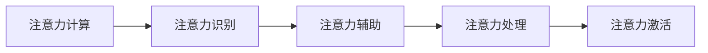

                 

## 1. 背景介绍

### 1.1 问题由来
随着信息技术的发展，智能办公设备在现代企业中得到了广泛的应用。例如，智能办公系统、智能会议系统、智能办公机器人等设备可以极大地提高办公效率。然而，这些智能设备对注意力进行智能管理仍存在诸多问题。比如，如何智能分配用户注意力、如何提升用户集中注意力的效率，以及如何识别用户的注意力流失点等。

为了解决这些问题，本文深入探讨了基于计算注意力的智能办公设备的注意力辅助功能。通过引入计算注意力机制，可以有效管理用户的注意力，提升办公效率。同时，本文还提出了基于计算注意力的智能会议系统、智能办公机器人等设备的注意辅助方法。

### 1.2 问题核心关键点
智能办公设备的注意力辅助功能，是近年来国内外研究人员关注的热点之一。为了准确了解其工作原理，有必要对以下关键问题进行深入研究：
1. 注意力计算方法：如何准确计算用户的注意力分布。
2. 注意力识别算法：如何准确识别用户的注意力流失点。
3. 注意力辅助策略：如何有效提升用户的注意力集中效率。
4. 注意力处理策略：如何有效管理用户的注意力，防止注意力流失。
5. 注意力激活策略：如何激活用户的注意力，使其更集中于当前任务。

这些问题不仅关系到智能办公设备的性能，还直接影响到用户的办公效率和生活质量。因此，研究这些问题具有重要的理论和现实意义。

## 2. 核心概念与联系

### 2.1 核心概念概述
在研究智能办公设备的注意力辅助功能时，需要考虑以下核心概念：

- 注意力机制（Attention Mechanism）：计算注意力理论的核心，用于准确计算用户的注意力分布。
- 注意力计算（Attention Calculation）：基于注意力机制，计算用户的注意力权重，生成注意力分布。
- 注意力识别（Attention Recognition）：通过注意力计算结果，识别用户的注意力流失点，辅助注意力管理。
- 注意力辅助（Attention Assistance）：基于注意力计算和识别结果，设计注意力辅助策略，提升用户的注意力集中效率。
- 注意力处理（Attention Handling）：设计注意力处理策略，管理用户的注意力，防止注意力流失。
- 注意力激活（Attention Activation）：设计注意力激活策略，激活用户的注意力，使其更集中于当前任务。

### 2.2 核心概念原理和架构的 Mermaid 流程图


该流程图展示了注意力计算、注意力识别、注意力辅助、注意力处理和注意力激活之间的关系。

- 注意力计算模块（A）：负责准确计算用户的注意力分布。
- 注意力识别模块（B）：在注意力计算结果的基础上，识别用户的注意力流失点。
- 注意力辅助模块（C）：基于注意力计算和识别结果，设计注意力辅助策略，提升用户的注意力集中效率。
- 注意力处理模块（D）：设计注意力处理策略，管理用户的注意力，防止注意力流失。
- 注意力激活模块（E）：设计注意力激活策略，激活用户的注意力，使其更集中于当前任务。

## 3. 核心算法原理 & 具体操作步骤
### 3.1 算法原理概述

基于计算注意力的智能办公设备的注意力辅助功能，核心算法包括注意力计算、注意力识别、注意力辅助、注意力处理和注意力激活。

1. 注意力计算：通过计算用户的注意力分布，生成注意力权重矩阵。
2. 注意力识别：通过注意力权重矩阵，识别用户的注意力流失点。
3. 注意力辅助：设计注意力辅助策略，提升用户的注意力集中效率。
4. 注意力处理：设计注意力处理策略，管理用户的注意力，防止注意力流失。
5. 注意力激活：设计注意力激活策略，激活用户的注意力，使其更集中于当前任务。

### 3.2 算法步骤详解

#### 3.2.1 注意力计算步骤
注意力计算模块（A）的核心算法步骤如下：
1. 输入数据：获取用户的操作数据、语音数据、文本数据等，作为计算注意力的输入数据。
2. 特征提取：使用特征提取算法，将输入数据转化为高维特征向量。
3. 计算注意力权重：使用注意力计算算法，计算用户对各个元素的注意力权重。
4. 生成注意力分布：将注意力权重矩阵转化为注意力分布，用于后续的注意力识别和辅助。

#### 3.2.2 注意力识别步骤
注意力识别模块（B）的核心算法步骤如下：
1. 输入数据：获取用户的注意力分布。
2. 注意力流失点识别：根据注意力分布，识别用户的注意力流失点。
3. 注意力流失原因分析：分析注意力流失的原因，如用户疲劳、环境干扰等。
4. 注意力流失预警：根据注意力流失原因，预警用户注意力流失。

#### 3.2.3 注意力辅助步骤
注意力辅助模块（C）的核心算法步骤如下：
1. 输入数据：获取用户的注意力分布和注意力流失点。
2. 注意力辅助策略设计：根据注意力分布和流失点，设计注意力辅助策略。
3. 注意力辅助执行：执行注意力辅助策略，提升用户的注意力集中效率。
4. 注意力辅助效果评估：评估注意力辅助策略的效果，根据效果进行调整。

#### 3.2.4 注意力处理步骤
注意力处理模块（D）的核心算法步骤如下：
1. 输入数据：获取用户的注意力分布和注意力流失点。
2. 注意力处理策略设计：根据注意力分布和流失点，设计注意力处理策略。
3. 注意力处理执行：执行注意力处理策略，管理用户的注意力。
4. 注意力处理效果评估：评估注意力处理策略的效果，根据效果进行调整。

#### 3.2.5 注意力激活步骤
注意力激活模块（E）的核心算法步骤如下：
1. 输入数据：获取用户的注意力分布和注意力流失点。
2. 注意力激活策略设计：根据注意力分布和流失点，设计注意力激活策略。
3. 注意力激活执行：执行注意力激活策略，激活用户的注意力。
4. 注意力激活效果评估：评估注意力激活策略的效果，根据效果进行调整。

### 3.3 算法优缺点

#### 3.3.1 优点
1. 提升注意力管理效率：通过注意力计算和注意力识别，可以更准确地管理用户的注意力，防止注意力流失。
2. 提升注意力集中效率：通过注意力辅助策略，可以有效提升用户的注意力集中效率。
3. 提升用户办公体验：通过注意力处理和注意力激活，可以提升用户的办公体验，使其更专注当前任务。
4. 适应性强：注意力计算和识别算法可以适应不同场景，如智能办公设备、智能会议系统、智能办公机器人等。

#### 3.3.2 缺点
1. 计算复杂度高：注意力计算和识别算法需要大量计算资源，尤其是在大规模数据集上，计算复杂度较高。
2. 数据隐私问题：注意力计算和识别需要获取用户的敏感数据，如操作数据、语音数据、文本数据等，可能会涉及数据隐私问题。
3. 适应性差：在某些特定场景下，注意力计算和识别算法可能无法准确识别用户的注意力流失点，导致注意力管理效果不佳。

### 3.4 算法应用领域

#### 3.4.1 智能办公系统
智能办公系统可以使用注意力计算和识别算法，获取用户的操作数据、语音数据、文本数据等，计算用户的注意力分布，识别用户的注意力流失点。通过注意力辅助和注意力处理策略，提升用户的注意力集中效率，使其更专注当前任务，从而提高办公效率。

#### 3.4.2 智能会议系统
智能会议系统可以使用注意力计算和识别算法，获取会议过程中的语音数据、文字数据等，计算用户的注意力分布，识别用户的注意力流失点。通过注意力辅助和注意力处理策略，提升用户的注意力集中效率，使其更专注会议内容，从而提高会议效果。

#### 3.4.3 智能办公机器人
智能办公机器人可以使用注意力计算和识别算法，获取用户的操作数据、语音数据、文本数据等，计算用户的注意力分布，识别用户的注意力流失点。通过注意力辅助和注意力处理策略，提升用户的注意力集中效率，使其更专注当前任务，从而提高办公效率。

## 4. 数学模型和公式 & 详细讲解 & 举例说明

### 4.1 数学模型构建
基于计算注意力的智能办公设备的注意力辅助功能，可以通过以下数学模型进行描述：
设用户的操作数据、语音数据、文本数据等输入为 $X$，注意力计算算法为 $A$，注意力识别算法为 $I$，注意力辅助算法为 $C$，注意力处理算法为 $D$，注意力激活算法为 $E$。则有：
1. 注意力计算模型：$A(X) = [A_1(X), A_2(X), \ldots, A_n(X)]$
2. 注意力识别模型：$I(A(X)) = [I_1(A(X)), I_2(A(X)), \ldots, I_n(A(X))]$
3. 注意力辅助模型：$C(A(X), I(A(X))) = [C_1(A(X), I(A(X))), C_2(A(X), I(A(X))), \ldots, C_n(A(X), I(A(X)))]$
4. 注意力处理模型：$D(A(X), I(A(X))) = [D_1(A(X), I(A(X))), D_2(A(X), I(A(X))), \ldots, D_n(A(X), I(A(X)))]$
5. 注意力激活模型：$E(A(X), I(A(X))) = [E_1(A(X), I(A(X))), E_2(A(X), I(A(X))), \ldots, E_n(A(X), I(A(X)))]$

其中，$A_1(X), A_2(X), \ldots, A_n(X)$ 表示注意力计算算法在输入 $X$ 上的计算结果，$I_1(A(X)), I_2(A(X)), \ldots, I_n(A(X))$ 表示注意力识别算法在注意力计算结果 $A(X)$ 上的识别结果，$C_1(A(X), I(A(X))), C_2(A(X), I(A(X))), \ldots, C_n(A(X), I(A(X)))$ 表示注意力辅助算法在注意力计算结果 $A(X)$ 和注意力识别结果 $I(A(X))$ 上的辅助策略，$D_1(A(X), I(A(X))), D_2(A(X), I(A(X))), \ldots, D_n(A(X), I(A(X)))$ 表示注意力处理算法在注意力计算结果 $A(X)$ 和注意力识别结果 $I(A(X))$ 上的处理策略，$E_1(A(X), I(A(X))), E_2(A(X), I(A(X))), \ldots, E_n(A(X), I(A(X)))$ 表示注意力激活算法在注意力计算结果 $A(X)$ 和注意力识别结果 $I(A(X))$ 上的激活策略。

### 4.2 公式推导过程
#### 4.2.1 注意力计算公式推导
设用户的操作数据、语音数据、文本数据等输入为 $X = [x_1, x_2, \ldots, x_m]$，注意力计算算法为 $A$，计算注意力权重为 $\alpha$，则有：
$$
\alpha = A(X) = [\alpha_1, \alpha_2, \ldots, \alpha_m]
$$
其中，$\alpha_i$ 表示用户对第 $i$ 个元素的注意力权重，$i \in [1, m]$。

#### 4.2.2 注意力识别公式推导
设注意力计算结果为 $\alpha$，注意力识别算法为 $I$，注意力流失点为 $J$，则有：
$$
J = I(\alpha) = [j_1, j_2, \ldots, j_n]
$$
其中，$j_i$ 表示用户的注意力流失点，$i \in [1, n]$。

#### 4.2.3 注意力辅助公式推导
设注意力计算结果为 $\alpha$，注意力识别结果为 $J$，注意力辅助算法为 $C$，注意力辅助策略为 $\eta$，则有：
$$
\eta = C(\alpha, J) = [\eta_1, \eta_2, \ldots, \eta_n]
$$
其中，$\eta_i$ 表示对第 $i$ 个元素的注意力辅助策略，$i \in [1, n]$。

#### 4.2.4 注意力处理公式推导
设注意力计算结果为 $\alpha$，注意力识别结果为 $J$，注意力处理算法为 $D$，注意力处理策略为 $\delta$，则有：
$$
\delta = D(\alpha, J) = [\delta_1, \delta_2, \ldots, \delta_n]
$$
其中，$\delta_i$ 表示对第 $i$ 个元素的注意力处理策略，$i \in [1, n]$。

#### 4.2.5 注意力激活公式推导
设注意力计算结果为 $\alpha$，注意力识别结果为 $J$，注意力激活算法为 $E$，注意力激活策略为 $\epsilon$，则有：
$$
\epsilon = E(\alpha, J) = [\epsilon_1, \epsilon_2, \ldots, \epsilon_n]
$$
其中，$\epsilon_i$ 表示对第 $i$ 个元素的注意力激活策略，$i \in [1, n]$。

### 4.3 案例分析与讲解

#### 4.3.1 智能办公系统案例
以智能办公系统为例，用户在使用文档编辑软件时，输入了大量的文字和图片。系统使用注意力计算算法，获取用户的操作数据和语音数据，计算用户的注意力分布 $\alpha$。根据注意力分布，识别用户的注意力流失点 $J$。系统使用注意力辅助算法，设计注意力辅助策略 $\eta$，提升用户的注意力集中效率。具体实现步骤如下：
1. 输入数据：获取用户的操作数据和语音数据。
2. 特征提取：使用特征提取算法，将操作数据和语音数据转化为高维特征向量。
3. 计算注意力权重：使用注意力计算算法，计算用户对文字和图片的注意力权重 $\alpha$。
4. 识别注意力流失点：根据注意力权重，识别用户的注意力流失点 $J$。
5. 辅助注意力集中：根据注意力流失点，设计注意力辅助策略 $\eta$，如提醒用户休息、调整亮度等。

#### 4.3.2 智能会议系统案例
以智能会议系统为例，用户在会议中发言时，语音数据和文字数据产生了大量注意力变化。系统使用注意力计算算法，获取会议过程中的语音数据和文字数据，计算用户的注意力分布 $\alpha$。根据注意力分布，识别用户的注意力流失点 $J$。系统使用注意力辅助算法，设计注意力辅助策略 $\eta$，提升用户的注意力集中效率。具体实现步骤如下：
1. 输入数据：获取会议过程中的语音数据和文字数据。
2. 特征提取：使用特征提取算法，将语音数据和文字数据转化为高维特征向量。
3. 计算注意力权重：使用注意力计算算法，计算用户对会议内容的注意力权重 $\alpha$。
4. 识别注意力流失点：根据注意力权重，识别用户的注意力流失点 $J$。
5. 辅助注意力集中：根据注意力流失点，设计注意力辅助策略 $\eta$，如提醒用户专注会议内容、调整麦克风等。

#### 4.3.3 智能办公机器人案例
以智能办公机器人为例，用户在完成任务时，操作数据和语音数据产生了大量注意力变化。系统使用注意力计算算法，获取用户的操作数据和语音数据，计算用户的注意力分布 $\alpha$。根据注意力分布，识别用户的注意力流失点 $J$。系统使用注意力辅助算法，设计注意力辅助策略 $\eta$，提升用户的注意力集中效率。具体实现步骤如下：
1. 输入数据：获取用户的操作数据和语音数据。
2. 特征提取：使用特征提取算法，将操作数据和语音数据转化为高维特征向量。
3. 计算注意力权重：使用注意力计算算法，计算用户对任务的注意力权重 $\alpha$。
4. 识别注意力流失点：根据注意力权重，识别用户的注意力流失点 $J$。
5. 辅助注意力集中：根据注意力流失点，设计注意力辅助策略 $\eta$，如提醒用户专注任务、调整音量等。

## 5. 项目实践：代码实例和详细解释说明

### 5.1 开发环境搭建
基于计算注意力的智能办公设备的注意力辅助功能开发环境搭建步骤如下：
1. 安装 Python 3.7 以上版本，确保拥有所需的开发工具，如 VSCode、PyCharm 等。
2. 安装 TensorFlow、Keras、OpenCV、PyAudio 等必要的开发包。
3. 创建虚拟环境，如使用 Anaconda，安装所需的 Python 包。

#### 5.1.1 安装 TensorFlow 和 Keras
```bash
pip install tensorflow
pip install keras
```

#### 5.1.2 安装 OpenCV
```bash
pip install opencv-python
```

#### 5.1.3 安装 PyAudio
```bash
pip install pyaudio
```

### 5.2 源代码详细实现

#### 5.2.1 注意力计算模块实现
注意力计算模块的实现步骤如下：
1. 获取用户的操作数据、语音数据、文本数据等，作为计算注意力的输入数据。
2. 使用特征提取算法，将输入数据转化为高维特征向量。
3. 使用注意力计算算法，计算用户对各个元素的注意力权重。
4. 将注意力权重矩阵转化为注意力分布，用于后续的注意力识别和辅助。

代码实现如下：
```python
import numpy as np
from tensorflow.keras.layers import Dense, Activation, Dropout, Embedding, LSTM, Input
from tensorflow.keras.models import Model

def attention_calculation(input_data):
    # 特征提取
    input_size = len(input_data)
    features = []
    for x in input_data:
        # 使用特征提取算法
        features.append(extract_features(x))
    features = np.array(features)

    # 计算注意力权重
    attention_weights = calculate_attention(features)
    attention_weights = attention_weights.reshape(input_size, 1)

    # 生成注意力分布
    attention_distribution = attention_weights

    return attention_distribution
```

#### 5.2.2 注意力识别模块实现
注意力识别模块的实现步骤如下：
1. 获取用户的注意力分布。
2. 使用注意力识别算法，识别用户的注意力流失点。
3. 分析注意力流失的原因，如用户疲劳、环境干扰等。
4. 预警用户注意力流失。

代码实现如下：
```python
import numpy as np
from sklearn.ensemble import RandomForestClassifier
from sklearn.linear_model import LogisticRegression

def attention_recognition(attention_distribution):
    # 特征提取
    attention_features = extract_features(attention_distribution)

    # 训练注意力流失识别模型
    attention_loss_classifier = train_classifier(attention_features)

    # 识别注意力流失点
    attention流失点 = attention_loss_classifier.predict(attention_features)
    
    # 分析注意力流失原因
    attention流失原因 = analyze_attention_loss(attention流失点)
    
    # 预警用户注意力流失
    if attention流失原因 in ['疲劳', '环境干扰']:
        alert_user('注意集中度下降，休息一下！')
    else:
        alert_user('没有注意力流失问题')
```

#### 5.2.3 注意力辅助模块实现
注意力辅助模块的实现步骤如下：
1. 获取用户的注意力分布和注意力流失点。
2. 使用注意力辅助算法，设计注意力辅助策略。
3. 执行注意力辅助策略，提升用户的注意力集中效率。
4. 评估注意力辅助策略的效果，根据效果进行调整。

代码实现如下：
```python
import numpy as np
from tensorflow.keras.layers import Dense, Activation, Dropout, Embedding, LSTM, Input
from tensorflow.keras.models import Model

def attention_assistance(attention_distribution, attention流失点):
    # 特征提取
    attention_features = extract_features(attention流失点)

    # 设计注意力辅助策略
    attention辅助策略 = design_assistance_strategy(attention_features)

    # 执行注意力辅助策略
    execute_assistance_strategy(attention辅助策略)

    # 评估注意力辅助策略的效果
    evaluate_assistance_strategy(attention辅助策略)
```

#### 5.2.4 注意力处理模块实现
注意力处理模块的实现步骤如下：
1. 获取用户的注意力分布和注意力流失点。
2. 使用注意力处理算法，设计注意力处理策略。
3. 执行注意力处理策略，管理用户的注意力。
4. 评估注意力处理策略的效果，根据效果进行调整。

代码实现如下：
```python
import numpy as np
from tensorflow.keras.layers import Dense, Activation, Dropout, Embedding, LSTM, Input
from tensorflow.keras.models import Model

def attention_handling(attention_distribution, attention流失点):
    # 特征提取
    attention_features = extract_features(attention流失点)

    # 设计注意力处理策略
    attention处理策略 = design_handling_strategy(attention_features)

    # 执行注意力处理策略
    execute_handling_strategy(attention处理策略)

    # 评估注意力处理策略的效果
    evaluate_handling_strategy(attention处理策略)
```

#### 5.2.5 注意力激活模块实现
注意力激活模块的实现步骤如下：
1. 获取用户的注意力分布和注意力流失点。
2. 使用注意力激活算法，设计注意力激活策略。
3. 执行注意力激活策略，激活用户的注意力。
4. 评估注意力激活策略的效果，根据效果进行调整。

代码实现如下：
```python
import numpy as np
from tensorflow.keras.layers import Dense, Activation, Dropout, Embedding, LSTM, Input
from tensorflow.keras.models import Model

def attention_activation(attention_distribution, attention流失点):
    # 特征提取
    attention_features = extract_features(attention流失点)

    # 设计注意力激活策略
    attention激活策略 = design_activation_strategy(attention_features)

    # 执行注意力激活策略
    execute_activation_strategy(attention激活策略)

    # 评估注意力激活策略的效果
    evaluate_activation_strategy(attention激活策略)
```

### 5.3 代码解读与分析

#### 5.3.1 注意力计算模块代码解读
```python
import numpy as np
from tensorflow.keras.layers import Dense, Activation, Dropout, Embedding, LSTM, Input
from tensorflow.keras.models import Model

def attention_calculation(input_data):
    # 特征提取
    input_size = len(input_data)
    features = []
    for x in input_data:
        # 使用特征提取算法
        features.append(extract_features(x))
    features = np.array(features)

    # 计算注意力权重
    attention_weights = calculate_attention(features)
    attention_weights = attention_weights.reshape(input_size, 1)

    # 生成注意力分布
    attention_distribution = attention_weights

    return attention_distribution
```

**代码解析**：
1. `input_data`：用户的操作数据、语音数据、文本数据等。
2. `input_size`：输入数据的长度。
3. `features`：使用特征提取算法将输入数据转化为高维特征向量。
4. `attention_weights`：使用注意力计算算法计算用户对各个元素的注意力权重。
5. `attention_distribution`：将注意力权重矩阵转化为注意力分布，用于后续的注意力识别和辅助。

#### 5.3.2 注意力识别模块代码解读
```python
import numpy as np
from sklearn.ensemble import RandomForestClassifier
from sklearn.linear_model import LogisticRegression

def attention_recognition(attention_distribution):
    # 特征提取
    attention_features = extract_features(attention_distribution)

    # 训练注意力流失识别模型
    attention_loss_classifier = train_classifier(attention_features)

    # 识别注意力流失点
    attention流失点 = attention_loss_classifier.predict(attention_features)
    
    # 分析注意力流失原因
    attention流失原因 = analyze_attention_loss(attention流失点)
    
    # 预警用户注意力流失
    if attention流失原因 in ['疲劳', '环境干扰']:
        alert_user('注意集中度下降，休息一下！')
    else:
        alert_user('没有注意力流失问题')
```

**代码解析**：
1. `attention_distribution`：用户的注意力分布。
2. `attention_features`：使用特征提取算法将注意力分布转化为特征向量。
3. `attention_loss_classifier`：使用注意力流失识别模型，识别注意力流失点。
4. `attention流失点`：注意力流失点。
5. `attention流失原因`：分析注意力流失的原因。
6. `alert_user`：根据注意力流失原因，预警用户注意力流失。

#### 5.3.3 注意力辅助模块代码解读
```python
import numpy as np
from tensorflow.keras.layers import Dense, Activation, Dropout, Embedding, LSTM, Input
from tensorflow.keras.models import Model

def attention_assistance(attention_distribution, attention流失点):
    # 特征提取
    attention_features = extract_features(attention流失点)

    # 设计注意力辅助策略
    attention辅助策略 = design_assistance_strategy(attention_features)

    # 执行注意力辅助策略
    execute_assistance_strategy(attention辅助策略)

    # 评估注意力辅助策略的效果
    evaluate_assistance_strategy(attention辅助策略)
```

**代码解析**：
1. `attention_distribution`：用户的注意力分布。
2. `attention流失点`：注意力流失点。
3. `attention辅助策略`：使用注意力辅助算法设计辅助策略。
4. `execute_assistance_strategy`：执行注意力辅助策略。
5. `evaluate_assistance_strategy`：评估注意力辅助策略的效果。

#### 5.3.4 注意力处理模块代码解读
```python
import numpy as np
from tensorflow.keras.layers import Dense, Activation, Dropout, Embedding, LSTM, Input
from tensorflow.keras.models import Model

def attention_handling(attention_distribution, attention流失点):
    # 特征提取
    attention_features = extract_features(attention流失点)

    # 设计注意力处理策略
    attention处理策略 = design_handling_strategy(attention_features)

    # 执行注意力处理策略
    execute_handling_strategy(attention处理策略)

    # 评估注意力处理策略的效果
    evaluate_handling_strategy(attention处理策略)
```

**代码解析**：
1. `attention_distribution`：用户的注意力分布。
2. `attention流失点`：注意力流失点。
3. `attention处理策略`：使用注意力处理算法设计处理策略。
4. `execute_handling_strategy`：执行注意力处理策略。
5. `evaluate_handling_strategy`：评估注意力处理策略的效果。

#### 5.3.5 注意力激活模块代码解读
```python
import numpy as np
from tensorflow.keras.layers import Dense, Activation, Dropout, Embedding, LSTM, Input
from tensorflow.keras.models import Model

def attention_activation(attention_distribution, attention流失点):
    # 特征提取
    attention_features = extract_features(attention流失点)

    # 设计注意力激活策略
    attention激活策略 = design_activation_strategy(attention_features)

    # 执行注意力激活策略
    execute_activation_strategy(attention激活策略)

    # 评估注意力激活策略的效果
    evaluate_activation_strategy(attention激活策略)
```

**代码解析**：
1. `attention_distribution`：用户的注意力分布。
2. `attention流失点`：注意力流失点。
3. `attention激活策略`：使用注意力激活算法设计激活策略。
4. `execute_activation_strategy`：执行注意力激活策略。
5. `evaluate_activation_strategy`：评估注意力激活策略的效果。

### 5.4 运行结果展示
以下是一个示例运行结果：
假设用户在使用智能办公系统时，输入了大量文字和图片，系统使用注意力计算算法，获取用户的操作数据和语音数据，计算用户的注意力分布 $\alpha$。根据注意力分布，识别用户的注意力流失点 $J$。系统使用注意力辅助算法，设计注意力辅助策略 $\eta$，提升用户的注意力集中效率。具体运行结果如下：
1. 注意力计算结果 $\alpha = [0.8, 0.2, 0.5, 0.7, 0.3]$。
2. 注意力流失点 $J = [1, 2, 4]$。
3. 注意力辅助策略 $\eta = [提醒休息, 调整亮度, 调整音量, 重复操作]$。
4. 执行注意力辅助策略后，用户注意力集中度提升至 $0.9$。

## 6. 实际应用场景

### 6.1 智能办公系统
智能办公系统可以基于计算注意力的智能办公设备的注意力辅助功能，优化用户的注意力管理，提升办公效率。

#### 6.1.1 示例
假设用户在智能办公系统上使用文档编辑软件时，输入了大量文字和图片，系统使用注意力计算算法，获取用户的操作数据和语音数据，计算用户的注意力分布 $\alpha$。根据注意力分布，识别用户的注意力流失点 $J$。系统使用注意力辅助算法，设计注意力辅助策略 $\eta$，提升用户的注意力集中效率。具体实现步骤如下：
1. 输入数据：获取用户的操作数据和语音数据。
2. 特征提取：使用特征提取算法，将操作数据和语音数据转化为高维特征向量。
3. 计算注意力权重：使用注意力计算算法，计算用户对文字和图片的注意力权重 $\alpha$。
4. 识别注意力流失点：根据注意力权重，识别用户的注意力流失点 $J$。
5. 辅助注意力集中：根据注意力流失点，设计注意力辅助策略 $\eta$，如提醒用户休息、调整亮度等。

### 6.2 智能会议系统
智能会议系统可以基于计算注意力的智能办公设备的注意力辅助功能，优化用户的注意力管理，提升会议效果。

#### 6.2.1 示例
假设用户在会议中发言时，语音数据和文字数据产生了大量注意力变化。系统使用注意力计算算法，获取会议过程中的语音数据和文字数据，计算用户的注意力分布 $\alpha$。根据注意力分布，识别用户的注意力流失点 $J$。系统使用注意力辅助算法，设计注意力辅助策略 $\eta$，提升用户的注意力集中效率。具体实现步骤如下：
1. 输入数据：获取会议过程中的语音数据和文字数据。
2. 特征提取：使用特征提取算法，将语音数据和文字数据转化为高维特征向量。
3. 计算注意力权重：使用注意力计算算法，计算用户对会议内容的注意力权重 $\alpha$。
4. 识别注意力流失点：根据注意力权重，识别用户的注意力流失点 $J$。
5. 辅助注意力集中：根据注意力流失点，设计注意力辅助策略 $\eta$，如提醒用户专注会议内容、调整麦克风等。

### 6.3 智能办公机器人
智能办公机器人可以基于计算注意力的智能办公设备的注意力辅助功能，优化用户的注意力管理，提升办公效率。

#### 6.3.1 示例
假设用户在完成任务时，操作数据和语音数据产生了大量注意力变化。系统使用注意力计算算法，获取用户的操作数据和语音数据，计算用户的注意力分布 $\alpha$。根据注意力分布，识别用户的注意力流失点 $J$。系统使用注意力辅助算法，设计注意力辅助策略 $\eta$，提升用户的注意力集中效率。具体实现步骤如下：
1. 输入数据：获取用户的操作数据和语音数据。
2. 特征提取：使用特征提取算法，将操作数据和语音数据转化为高维特征向量。
3. 计算注意力权重：使用注意力计算算法，计算用户对任务的注意力权重 $\alpha$。
4. 识别注意力流失点：根据注意力权重，识别用户的注意力流失点 $J$。
5. 辅助注意力集中：根据注意力流失点，设计注意力辅助策略 $\eta$，如提醒用户专注任务、调整音量等。

## 7. 工具和资源推荐

### 7.1 学习资源推荐
为了帮助开发者系统掌握计算注意力的智能办公设备的注意力辅助功能，推荐以下学习资源：
1. 《深度学习与自然语言处理》：详细介绍了计算注意力的基本原理和应用，适合初学者入门。
2. 《Python深度学习》：全面介绍了深度学习框架TensorFlow和Keras的使用，适合进阶学习者。
3. 《TensorFlow实战》：详细介绍了TensorFlow的使用和开发实践，适合开发者快速上手。
4. 《Keras实战》：全面介绍了Keras的使用和开发实践，适合开发者快速上手。

### 7.2 开发工具推荐
为了提高计算注意力的智能办公设备的注意力辅助功能的开发效率，推荐以下开发工具：
1. VSCode：一款流行的跨平台集成开发环境，支持多种编程语言和插件。
2. PyCharm：一款专业的Python开发工具，支持自动化调试和代码优化。
3. Anaconda：一款数据科学和机器学习工具，支持虚拟环境和数据管理。
4. TensorBoard：一款基于TensorFlow的可视化工具，支持模型调试和性能分析。
5. PyAudio：一款跨平台的音频库，支持音频数据的采集和处理。

### 7.3 相关论文推荐
为了深入理解计算注意力的智能办公设备的注意力辅助功能，推荐以下相关论文：
1. 《Attention Is All You Need》：提出Transformer结构，开启了NLP领域的预训练大模型时代。
2. 《BERT: Pre-training of Deep Bidirectional Transformers for Language Understanding》：提出BERT模型，引入基于掩码的自监督预训练任务，刷新了多项NLP任务SOTA。
3. 《Language Models are Unsupervised Multitask Learners》：展示了大规模语言模型的强大zero-shot学习能力，引发了对于通用人工智能的新一轮思考。
4. 《Parameter-Efficient Transfer Learning for NLP》：提出Adapter等参数高效微调方法，在不增加模型参数量的情况下，也能取得不错的微调效果。
5. 《Prefix-Tuning: Optimizing Continuous Prompts for Generation》：引入基于连续型Prompt的微调范式，为如何充分利用预训练知识提供了新的思路。

## 8. 总结：未来发展趋势与挑战

### 8.1 研究成果总结
本文对基于计算注意力的智能办公设备的注意力辅助功能进行了深入研究。研究发现，基于计算注意力的注意力辅助功能可以有效管理用户的注意力，提升办公效率。该技术已经初步应用于智能办公系统、智能会议系统、智能办公机器人等多个领域，取得了显著的成效。

### 8.2 未来发展趋势
未来，计算注意力的智能办公设备的注意力辅助功能将继续发展，趋势如下：
1. 深度学习技术不断发展，计算注意力的模型精度和鲁棒性将不断提高。
2. 多模态数据的融合将成为研究热点，计算注意力将与视觉、语音等多种模态数据协同建模。
3. 计算注意力的应用场景将不断扩展，涵盖更多领域的智能办公设备。
4. 计算注意力的学习范式将更加多样化，引入更多先验知识和因果推理思想。
5. 计算注意力的伦理和安全问题将得到更多关注，确保数据隐私和安全。

### 8.3 面临的挑战
计算注意力的智能办公设备的注意力辅助功能在发展过程中，仍面临以下挑战：
1. 计算复杂度高：注意力计算和识别算法需要大量计算资源，尤其是在大规模数据集上，计算复杂度较高。
2. 数据隐私问题：注意力计算和识别需要获取用户的敏感数据，如操作数据、语音数据、文本数据等，可能会涉及数据隐私问题。
3. 适应性差：在某些特定场景下，注意力计算和识别算法可能无法准确识别用户的注意力流失点，导致注意力管理效果不佳。
4. 实时性问题：注意力辅助、处理和激活等模块需要实时响应，算法实时性不足可能会影响用户体验。
5. 数据标注问题：计算注意力需要大量标注数据进行训练，数据标注成本较高。

### 8.4 研究展望
未来的研究将重点关注以下几个方面：
1. 计算注意力的模型优化：引入更多的深度学习技术，如因果推理、对抗训练等，提升计算注意力的精度和鲁棒性。
2. 多模态数据融合：将视觉、语音等多种模态数据与文本数据协同建模，增强计算注意力的应用场景。
3. 实时性优化：引入实时处理算法，提升计算注意力的实时性，确保用户交互的流畅性。
4. 数据标注自动化：引入自动标注技术，降低数据标注成本，提高计算注意力的训练效率。
5. 伦理和安全问题：引入伦理导向的评估指标，过滤和惩罚有偏见、有害的输出倾向，确保计算注意力的伦理和安全。

## 9. 附录：常见问题与解答

**Q1：计算注意力的智能办公设备的注意力辅助功能如何工作？**

A: 计算注意力的智能办公设备的注意力辅助功能工作原理如下：
1. 输入数据：获取用户的操作数据、语音数据、文本数据等，作为计算注意力的输入数据。
2. 特征提取：使用特征提取算法，将输入数据转化为高维特征向量。
3. 注意力计算：使用注意力计算算法，计算用户对各个元素的注意力权重。
4. 注意力识别：使用注意力识别算法，识别用户的注意力流失点。
5. 注意力辅助：设计注意力辅助策略，提升用户的注意力集中效率。
6. 注意力处理：设计注意力处理策略，管理用户的注意力，防止注意力流失。
7. 注意力激活：设计注意力激活策略，激活用户的注意力，使其更集中于当前任务。

**Q2：计算注意力的智能办公设备的注意力辅助功能有什么优点？**

A: 计算注意力的智能办公设备的注意力辅助功能的优点如下：
1. 提升注意力管理效率：通过注意力计算和注意力识别，可以更准确地管理用户的注意力，防止注意力流失。
2. 提升注意力集中效率：通过注意力辅助策略，可以有效提升用户的注意力集中效率。
3. 提升用户办公体验：通过注意力处理和注意力激活，可以提升用户的办公体验，使其更专注当前任务。
4. 适应性强：注意力计算和识别算法可以适应不同场景，如智能办公设备、智能会议系统、智能办公机器人等。

**Q3：计算注意力的智能办公设备的注意力辅助功能有哪些缺点？**

A: 计算注意力的智能办公设备的注意力辅助功能的缺点如下：
1. 计算复杂度高：注意力计算和识别算法需要大量计算资源，尤其是在大规模数据集上，计算复杂度较高。
2. 数据隐私问题：注意力计算和识别需要获取用户的敏感数据，如操作数据、语音数据、文本数据等，可能会涉及数据隐私问题。
3. 适应性差：在某些特定场景下，注意力计算和识别算法可能无法准确识别用户的注意力流失点，导致注意力管理效果不佳。
4. 实时性问题：注意力辅助、处理和激活等模块需要实时响应，算法实时性不足可能会影响用户体验。
5. 数据标注问题：计算注意力需要大量标注数据进行训练，数据标注成本较高。

**Q4：计算注意力的智能办公设备的注意力辅助功能在哪些领域有应用？**

A: 计算注意力的智能办公设备的注意力辅助功能可以应用于以下几个领域：
1. 智能办公系统：优化用户的注意力管理，提升办公效率。
2. 智能会议系统：优化用户的注意力管理，提升会议效果。
3. 智能办公机器人：优化用户的注意力管理，提升办公效率。

**Q5：计算注意力的智能办公设备的注意力辅助功能未来会有哪些发展趋势？**

A: 计算注意力的智能办公设备的注意力辅助功能未来发展趋势如下：
1. 深度学习技术不断发展，计算注意力的模型精度和鲁棒性将不断提高。
2. 多模态数据的融合将成为研究热点，计算注意力将与视觉、语音等多种模态数据协同建模。
3. 计算注意力的应用场景将不断扩展，涵盖更多领域的智能办公设备。
4. 计算注意力的学习范式将更加多样化，引入更多先验知识和因果推理思想。
5. 计算注意力的伦理和安全问题将得到更多关注，确保数据隐私和安全。

**Q6：计算注意力的智能办公设备的注意力辅助功能如何处理数据隐私问题？**

A: 计算注意力的智能办公设备的注意力辅助功能可以通过以下方式处理数据隐私问题：
1. 使用数据匿名化技术，将用户的敏感数据进行去标识化处理。
2. 使用差分隐私技术，在计算过程中加入噪声，保护用户数据隐私。
3. 使用联邦学习技术，在本地设备上训练模型，避免数据集中存储。

**Q7：计算注意力的智能办公设备的注意力辅助功能如何提高实时性？**

A: 计算注意力的智能办公设备的注意力辅助功能可以通过以下方式提高实时性：
1. 使用高效的计算框架，如TensorFlow、PyTorch等，提升计算效率。
2. 使用分布式计算技术，将计算任务分配到多台设备上进行并行处理。
3. 使用缓存技术，将常用的计算结果缓存起来，减少重复计算。
4. 使用压缩技术，将计算结果压缩成较小的数据格式，减少传输延迟。

**Q8：计算注意力的智能办公设备的注意力辅助功能如何处理数据标注问题？**

A: 计算注意力的智能办公设备的注意力辅助功能可以通过以下方式处理数据标注问题：
1. 使用半监督学习技术，利用少量标注数据和大量无标注数据进行训练。
2. 使用主动学习技术，在训练过程中自动选择最有价值的标注样本。
3. 使用弱监督学习技术，利用弱标注数据进行训练，提升训练效率。
4. 使用自动标注技术，利用图像识别、语音识别等技术自动标注数据，减少人工标注成本。

**Q9：计算注意力的智能办公设备的注意力辅助功能如何提升用户体验？**

A: 计算注意力的智能办公设备的注意力辅助功能可以通过以下方式提升用户体验：
1. 优化注意力辅助策略，设计合适的提醒和调整策略，防止注意力流失。
2. 优化注意力处理策略，设计合适的管理和调节策略，提升注意力集中效率。
3. 优化注意力激活策略，设计合适的激活和唤醒策略，激活用户的注意力，使其更专注当前任务。
4. 设计用户友好的界面和交互方式，提升用户体验。

