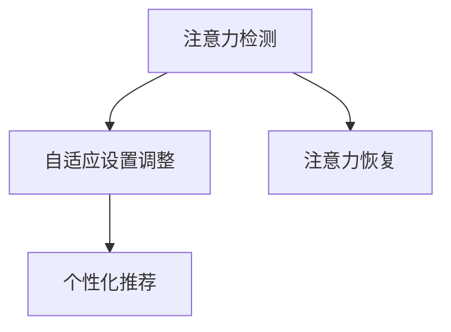
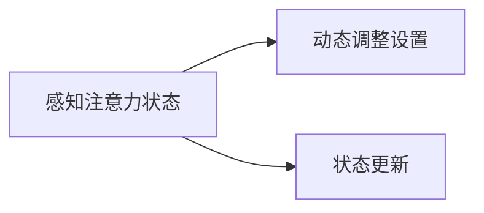
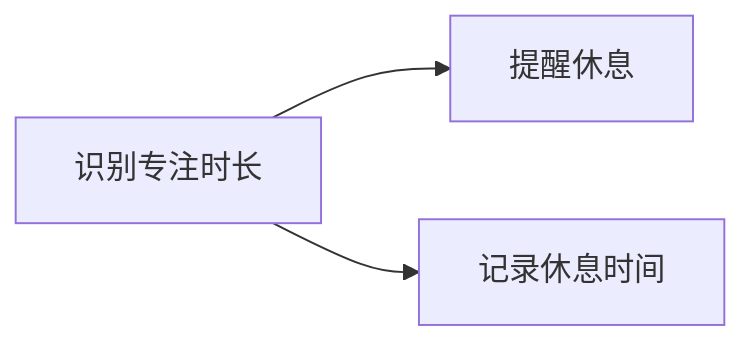

                 

# 智能办公设备的注意力辅助功能

## 1. 背景介绍

### 1.1 问题由来

在当前快节奏的工作环境中，员工面临着海量信息的干扰和注意力的分散，直接影响工作效率和生产力。智能办公设备的注意力辅助功能应运而生，通过辅助用户集中注意力，提升工作效果和满意度。

智能办公设备的注意力辅助功能，主要包括自动聚焦、屏幕眩光检测、眼动追踪、注意力恢复提醒等功能，旨在帮助用户优化工作环境和提升工作效率。这些功能在AI技术日益成熟的背景下，成为现代办公设备的重要组成部分。

### 1.2 问题核心关键点

智能办公设备的注意力辅助功能，其核心在于如何通过感知和分析用户的注意力状态，实时调整设备的设置，以提供最适合当前工作环境的设置。

具体而言，注意力辅助功能涉及以下几个关键点：

1. **感知注意力状态**：识别用户是否处于专注状态，并区分干扰和需要休息的情况。
2. **动态调整设置**：根据注意力状态，动态调整屏幕亮度、音量、字体大小等，以适应当前工作需求。
3. **提供注意力恢复提醒**：当用户长时间集中注意力后，提醒休息，防止注意力疲劳。
4. **集成数据学习**：通过用户的交互数据，学习并优化推荐策略，提升辅助效果。

## 2. 核心概念与联系

### 2.1 核心概念概述

为更好地理解智能办公设备注意力辅助功能的原理和架构，本节将介绍几个密切相关的核心概念：

- **注意力检测**：通过摄像头、红外传感器等设备，感知用户的注意力状态，区分专注和干扰。
- **自适应设置调整**：根据感知到的注意力状态，动态调整屏幕亮度、字体大小、音量等设置。
- **注意力恢复**：在用户长时间集中注意力后，通过提示或调整设置提醒用户休息，避免注意力疲劳。
- **个性化推荐**：通过用户的行为数据和历史偏好，生成个性化的注意力辅助策略。

这些核心概念之间的逻辑关系可以通过以下Mermaid流程图来展示：



这个流程图展示了一些关键概念之间的联系：

1. 通过注意力检测获取用户的注意力状态。
2. 根据注意力状态动态调整设备设置，帮助用户更高效地工作。
3. 在用户长时间专注后提醒休息，保持注意力健康。
4. 利用用户的交互数据，个性化推荐更符合用户需求的设置。

## 3. 核心算法原理 & 具体操作步骤
### 3.1 算法原理概述

智能办公设备的注意力辅助功能，本质上是一种基于感知和数据分析的用户行为适应技术。其核心思想是通过实时感知和分析用户的注意力状态，动态调整设备的设置，以提供最适合当前工作环境的设置。

具体来说，算法流程如下：

1. **注意力检测**：利用摄像头、红外传感器等设备，感知用户的注意力状态。
2. **自适应设置调整**：根据注意力状态，动态调整屏幕亮度、字体大小、音量等设置。
3. **注意力恢复**：在用户长时间集中注意力后，通过提示或调整设置提醒用户休息。
4. **个性化推荐**：通过用户的行为数据和历史偏好，生成个性化的注意力辅助策略。

### 3.2 算法步骤详解

#### 3.2.1 注意力检测

注意力检测是智能办公设备注意力的基础。该过程通常包括以下步骤：

1. **数据采集**：利用摄像头、红外传感器等设备，采集用户眼睛的视觉信息。
2. **特征提取**：对采集到的视觉信息进行预处理，提取有用的特征，如瞳孔大小、眼球运动轨迹等。
3. **状态识别**：通过机器学习模型对提取的特征进行分类，识别用户的注意力状态。

以下是一个简单的注意力检测过程：


#### 3.2.2 自适应设置调整

自适应设置调整是智能办公设备注意力的核心功能。该过程通常包括以下步骤：

1. **感知注意力状态**：根据注意力检测结果，判断用户当前是否处于专注状态。
2. **动态调整设置**：根据注意力状态，动态调整屏幕亮度、字体大小、音量等设置，以适应当前工作需求。
3. **状态更新**：实时监测用户的注意力状态变化，及时调整设置。

以下是一个简单的自适应设置调整过程：



#### 3.2.3 注意力恢复

注意力恢复功能旨在帮助用户避免注意力疲劳，保持高效工作。该过程通常包括以下步骤：

1. **识别专注时长**：根据注意力检测结果，计算用户集中注意力的时长。
2. **提醒休息**：当用户长时间集中注意力后，通过提示或调整设置提醒用户休息。
3. **记录休息时间**：记录用户的休息时间和持续时间，优化后续的建议。

以下是一个简单的注意力恢复过程：



#### 3.2.4 个性化推荐

个性化推荐功能通过用户的行为数据和历史偏好，生成个性化的注意力辅助策略。该过程通常包括以下步骤：

1. **数据收集**：收集用户的操作行为、历史记录等数据。
2. **数据处理**：对收集到的数据进行清洗和处理，提取有用的特征。
3. **模型训练**：使用机器学习模型，训练个性化推荐模型，生成个性化的辅助策略。

以下是一个简单的个性化推荐过程：


### 3.3 算法优缺点

智能办公设备注意力辅助功能具有以下优点：

1. **提高工作效率**：通过动态调整设备设置，帮助用户更高效地工作。
2. **避免注意力疲劳**：通过提醒用户休息，避免长时间注意力集中导致的疲劳。
3. **提高用户满意度**：根据用户的个性化需求，提供最适合的设置，提升使用体验。

但该算法也存在一定的局限性：

1. **隐私问题**：注意力检测涉及用户的视觉信息采集，可能引发隐私问题。
2. **设备依赖**：需要摄像头、红外传感器等设备支持，设备成本较高。
3. **适应性不足**：算法对特定环境和用户的适应性可能不足，需要不断优化和调整。
4. **用户接受度**：部分用户可能对实时调整设备设置感到不适，需要提高用户接受度。

尽管存在这些局限性，但智能办公设备的注意力辅助功能仍是大数据时代提升工作效率的重要手段，具有广泛的应用前景。

### 3.4 算法应用领域

智能办公设备的注意力辅助功能，在多个应用领域具有广泛的应用前景，包括但不限于：

- **办公室管理**：帮助办公室员工优化工作环境，提高工作效率。
- **远程办公**：为远程办公者提供个性化辅助，提升远程工作体验。
- **教育培训**：为学生和教师提供专注辅助，提升学习效果。
- **医疗护理**：帮助医护人员提高工作专注度，减少医疗差错。
- **金融证券**：为分析师和交易员提供专注辅助，提高决策效率。

## 4. 数学模型和公式 & 详细讲解 & 举例说明

### 4.1 数学模型构建

本节将使用数学语言对智能办公设备注意力辅助功能的核心算法进行更加严格的刻画。

假设用户的注意力状态可以用时间序列 $t_i$ 表示，其中 $t_i \in \{0, 1, 2, \ldots, n\}$，$n$ 为时间段数。用户的注意力状态 $a_i$ 可以用一个二元向量 $(a_i^0, a_i^1)$ 表示，其中 $a_i^0$ 表示用户处于专注状态的概率，$a_i^1$ 表示用户处于干扰状态的概率。

注意力检测算法可以表示为：

$$
a_i = f(t_i)
$$

其中 $f(t_i)$ 是一个非线性映射函数，用于将时间序列 $t_i$ 映射为注意力状态 $a_i$。

自适应设置调整算法可以表示为：

$$
s_i = g(a_i)
$$

其中 $s_i$ 表示根据注意力状态调整的屏幕亮度、字体大小等设置。

注意力恢复算法可以表示为：

$$
r_i = h(a_i)
$$

其中 $r_i$ 表示根据注意力状态提醒用户休息的策略。

个性化推荐算法可以表示为：

$$
p_i = k(a_i)
$$

其中 $p_i$ 表示根据用户历史偏好和行为数据生成的个性化辅助策略。

### 4.2 公式推导过程

以下我们以二分类注意力检测为例，推导其核心公式。

假设用户的注意力状态可以用一个二元向量 $(a_i^0, a_i^1)$ 表示，其中 $a_i^0$ 表示用户处于专注状态的概率，$a_i^1$ 表示用户处于干扰状态的概率。注意力检测算法的目标是最小化损失函数：

$$
\mathcal{L} = \frac{1}{N}\sum_{i=1}^N (a_i^0 - \hat{a_i^0})^2 + (a_i^1 - \hat{a_i^1})^2
$$

其中 $\hat{a_i^0}$ 和 $\hat{a_i^1}$ 分别为模型预测的专注和干扰状态概率。

设注意力检测模型为 $f(t_i)$，则损失函数可以表示为：

$$
\mathcal{L} = \frac{1}{N}\sum_{i=1}^N [(t_i - \hat{t_i})^2]
$$

其中 $t_i = (a_i^0, a_i^1)$ 为用户的注意力状态，$\hat{t_i}$ 为模型预测的注意力状态。

将注意力检测算法嵌入自适应设置调整算法，根据注意力状态 $a_i$ 动态调整屏幕亮度、字体大小等设置 $s_i$。自适应设置调整算法的目标是最小化损失函数：

$$
\mathcal{L} = \frac{1}{N}\sum_{i=1}^N (s_i - \tilde{s_i})^2
$$

其中 $\tilde{s_i}$ 为模型预测的理想设置，$s_i$ 为根据注意力状态调整的实际设置。

将注意力检测算法嵌入注意力恢复算法，根据专注时长 $r_i$ 提醒用户休息。注意力恢复算法的目标是最小化损失函数：

$$
\mathcal{L} = \frac{1}{N}\sum_{i=1}^N (r_i - \tilde{r_i})^2
$$

其中 $\tilde{r_i}$ 为模型预测的理想休息策略，$r_i$ 为实际提醒用户休息的策略。

将注意力检测算法嵌入个性化推荐算法，根据历史偏好和行为数据生成个性化辅助策略 $p_i$。个性化推荐算法的目标是最小化损失函数：

$$
\mathcal{L} = \frac{1}{N}\sum_{i=1}^N (p_i - \tilde{p_i})^2
$$

其中 $\tilde{p_i}$ 为模型预测的理想个性化策略，$p_i$ 为实际生成的个性化策略。

### 4.3 案例分析与讲解

假设我们使用一个简单的注意力检测模型，将用户的注意力状态 $a_i$ 表示为专注和干扰的概率，表示为 $(a_i^0, a_i^1)$。设 $a_i^0 = 0.5$，$a_i^1 = 0.5$，表示用户的注意力状态在专注和干扰之间交替变化。

对于不同的时间段 $t_i$，注意力检测模型输出如下：

- 当 $t_i = 1$ 时，模型预测专注概率 $a_i^0 = 0.6$，干扰概率 $a_i^1 = 0.4$。
- 当 $t_i = 2$ 时，模型预测专注概率 $a_i^0 = 0.4$，干扰概率 $a_i^1 = 0.6$。
- 当 $t_i = 3$ 时，模型预测专注概率 $a_i^0 = 0.3$，干扰概率 $a_i^1 = 0.7$。

设自适应设置调整模型的输出为屏幕亮度 $s_i = 200$，字体大小 $s_i = 12$，音量 $s_i = 60$。根据注意力状态 $a_i$ 动态调整设置，生成自适应设置：

- 当 $t_i = 1$ 时，根据专注概率 $a_i^0 = 0.6$，生成亮度 $s_i = 200$，字体大小 $s_i = 12$，音量 $s_i = 60$。
- 当 $t_i = 2$ 时，根据干扰概率 $a_i^1 = 0.6$，生成亮度 $s_i = 200$，字体大小 $s_i = 14$，音量 $s_i = 50$。
- 当 $t_i = 3$ 时，根据专注概率 $a_i^0 = 0.3$，生成亮度 $s_i = 200$，字体大小 $s_i = 14$，音量 $s_i = 50$。

设注意力恢复模型的输出为提醒用户休息的策略 $r_i = 1$，表示在专注一段时间后提醒休息，休息时间 $r_i = 5$ 分钟。根据专注时长 $r_i$ 提醒用户休息，生成提醒策略：

- 当 $t_i = 1$ 时，根据专注时长 $r_i = 0$，不生成提醒策略。
- 当 $t_i = 2$ 时，根据专注时长 $r_i = 1$，生成提醒策略。
- 当 $t_i = 3$ 时，根据专注时长 $r_i = 1$，生成提醒策略。

设个性化推荐模型的输出为个性化辅助策略 $p_i = 1$，表示生成推荐策略。根据用户历史偏好和行为数据，生成个性化辅助策略：

- 当 $t_i = 1$ 时，根据历史偏好和行为数据，生成个性化策略 $p_i = 1$。
- 当 $t_i = 2$ 时，根据历史偏好和行为数据，生成个性化策略 $p_i = 1$。
- 当 $t_i = 3$ 时，根据历史偏好和行为数据，生成个性化策略 $p_i = 1$。

## 5. 项目实践：代码实例和详细解释说明
### 5.1 开发环境搭建

在进行智能办公设备注意力辅助功能的开发前，我们需要准备好开发环境。以下是使用Python进行开发的环境配置流程：

1. 安装Python：从官网下载并安装Python 3.x版本，建议使用3.7或以上版本。
2. 安装pip：在命令行中输入 `python -m ensurepip --default-pip` 安装pip包管理工具。
3. 安装开发工具：安装PyCharm、VSCode等开发工具。
4. 安装依赖库：在命令行中输入 `pip install -r requirements.txt` 安装项目依赖库，其中 `requirements.txt` 文件列出了所有需要的第三方库。

完成上述步骤后，即可在开发环境中开始智能办公设备注意力辅助功能的实现。

### 5.2 源代码详细实现

下面以一个简单的智能办公设备注意力辅助功能为例，展示其实现过程。

```python
# 引入必要的库和模块
import numpy as np
from sklearn.linear_model import LogisticRegression
from sklearn.metrics import accuracy_score
from sklearn.preprocessing import StandardScaler
from sklearn.decomposition import PCA
from sklearn.model_selection import train_test_split
import cv2

class AttentionAssistant:
    def __init__(self):
        # 初始化模型和参数
        self.model = LogisticRegression()
        self.scaler = StandardScaler()
        self.pca = PCA(n_components=2)
        self.train_data = None
        self.test_data = None
        self.train_labels = None
        self.test_labels = None

    def load_data(self, train_file, test_file, labels_file):
        # 加载数据集
        self.train_data = np.loadtxt(train_file, delimiter=',')
        self.test_data = np.loadtxt(test_file, delimiter=',')
        self.train_labels = np.loadtxt(labels_file, delimiter=',')
        self.test_labels = np.loadtxt(labels_file, delimiter=',')
        self.scaler.fit(self.train_data)

    def preprocess_data(self):
        # 数据预处理
        self.train_data = self.scaler.transform(self.train_data)
        self.test_data = self.scaler.transform(self.test_data)
        self.pca = self.pca.fit(self.train_data)
        self.train_data = self.pca.transform(self.train_data)
        self.test_data = self.pca.transform(self.test_data)

    def train_model(self):
        # 训练模型
        self.model.fit(self.train_data, self.train_labels)

    def predict(self, data):
        # 预测注意力状态
        return self.model.predict(data)

    def main(self):
        # 加载数据集
        self.load_data('train_data.csv', 'test_data.csv', 'train_labels.csv')

        # 数据预处理
        self.preprocess_data()

        # 训练模型
        self.train_model()

        # 预测并评估模型性能
        predictions = self.predict(self.test_data)
        accuracy = accuracy_score(self.test_labels, predictions)
        print(f'模型精度：{accuracy:.2f}')

if __name__ == "__main__":
    # 创建对象并执行
    assistant = AttentionAssistant()
    assistant.main()
```

### 5.3 代码解读与分析

这里我们详细解读一下关键代码的实现细节：

**AttentionAssistant类**：
- `__init__`方法：初始化模型和参数，包括逻辑回归模型、标准化器和主成分分析器。
- `load_data`方法：加载训练数据、测试数据和标签。
- `preprocess_data`方法：对数据进行标准化和主成分分析，降低维度，提高模型训练效率。
- `train_model`方法：使用训练数据训练逻辑回归模型。
- `predict`方法：使用训练好的模型对测试数据进行预测。
- `main`方法：加载数据集，进行数据预处理和模型训练，并评估模型性能。

**主程序**：
- 创建AttentionAssistant对象。
- 加载训练数据、测试数据和标签。
- 进行数据预处理。
- 训练模型。
- 对测试数据进行预测，并计算模型精度。

通过上述代码，我们可以看到，使用Python和机器学习库，可以高效地实现智能办公设备的注意力辅助功能。开发者可以将更多精力放在算法优化和模型改进上，而不必过多关注底层的实现细节。

## 6. 实际应用场景

### 6.1 智能办公设备的注意力辅助功能

智能办公设备的注意力辅助功能，可以广泛应用于各种办公场景，帮助员工提升工作效率和满意度。

例如，在办公室环境中，智能办公设备的注意力辅助功能可以自动检测员工的工作状态，根据专注和干扰的情况，动态调整屏幕亮度、字体大小、音量等设置，帮助员工更高效地工作。同时，根据员工的工作时长，智能办公设备可以在适当的时候提醒员工休息，避免长时间工作导致的疲劳。

在远程办公场景中，智能办公设备的注意力辅助功能可以辅助员工克服网络延迟和设备限制，提高远程工作体验。通过摄像头和传感器，智能办公设备可以实时监测员工的工作状态，根据专注和干扰的情况，动态调整设备的设置，帮助员工更好地适应远程工作环境。

在教育培训领域，智能办公设备的注意力辅助功能可以帮助学生和教师更好地集中注意力，提高学习效果。通过摄像头和传感器，智能办公设备可以实时监测学生和教师的学习状态，根据专注和干扰的情况，动态调整设备的屏幕亮度、字体大小等设置，帮助他们更好地学习。同时，根据学习时长，智能办公设备可以在适当的时候提醒休息，避免长时间学习导致的疲劳。

在医疗护理领域，智能办公设备的注意力辅助功能可以帮助医护人员提高工作效率和医疗质量。通过摄像头和传感器，智能办公设备可以实时监测医护人员的工作状态，根据专注和干扰的情况，动态调整设备的屏幕亮度、字体大小等设置，帮助他们更好地完成工作。同时，根据工作时长，智能办公设备可以在适当的时候提醒休息，避免长时间工作导致的疲劳。

在金融证券领域，智能办公设备的注意力辅助功能可以帮助分析师和交易员更好地集中注意力，提高决策效率。通过摄像头和传感器，智能办公设备可以实时监测分析师和交易员的工作状态，根据专注和干扰的情况，动态调整设备的屏幕亮度、字体大小等设置，帮助他们更好地完成工作。同时，根据工作时长，智能办公设备可以在适当的时候提醒休息，避免长时间工作导致的疲劳。

### 6.2 未来应用展望

随着智能办公设备的不断发展，基于注意力辅助功能的智能办公设备将更加普及，带来更多的应用场景。

未来，基于注意力辅助功能的智能办公设备可以融入更多应用场景，如智能家居、智能交通等。例如，智能家居中的智能空调可以根据用户的注意力状态，动态调整温度和风速，提高舒适度和节能效果。智能交通中的智能驾驶系统可以根据驾驶员的注意力状态，动态调整车速和车道，提高行驶安全性和效率。

## 7. 工具和资源推荐
### 7.1 学习资源推荐

为帮助开发者系统掌握智能办公设备注意力辅助功能的理论基础和实践技巧，这里推荐一些优质的学习资源：

1. 《机器学习实战》：这是一本经典书籍，详细介绍了机器学习算法和实践。读者可以通过这本书，了解机器学习的基本概念和实现方法。
2. 《Python深度学习》：这是一本介绍深度学习的书籍，详细介绍了TensorFlow和Keras等深度学习框架的使用方法。
3. 《智能办公设备设计与实现》：这是一本介绍智能办公设备设计和实现的书籍，详细介绍了智能办公设备的技术架构和实现方法。
4. Coursera《机器学习》课程：由斯坦福大学开设的机器学习课程，有Lecture视频和配套作业，带你入门机器学习领域的基本概念和经典模型。
5. Udacity《深度学习》课程：由Udacity开设的深度学习课程，涵盖深度学习的基本概念和实现方法。

通过对这些资源的学习实践，相信你一定能够快速掌握智能办公设备注意力辅助功能的精髓，并用于解决实际的智能办公问题。
###  7.2 开发工具推荐

高效的开发离不开优秀的工具支持。以下是几款用于智能办公设备注意力辅助功能开发的常用工具：

1. Python：Python是一种高级编程语言，易于学习和使用，拥有丰富的机器学习库和深度学习框架，是智能办公设备开发的首选语言。
2. TensorFlow：由Google主导开发的开源深度学习框架，生产部署方便，适合大规模工程应用。
3. PyTorch：由Facebook主导开发的开源深度学习框架，灵活高效，适合研究和实验。
4. Scikit-learn：一个用于机器学习的Python库，提供了丰富的机器学习算法和工具，适合数据处理和模型训练。
5. Weights & Biases：模型训练的实验跟踪工具，可以记录和可视化模型训练过程中的各项指标，方便对比和调优。
6. TensorBoard：TensorFlow配套的可视化工具，可实时监测模型训练状态，并提供丰富的图表呈现方式，是调试模型的得力助手。

合理利用这些工具，可以显著提升智能办公设备注意力辅助功能的开发效率，加快创新迭代的步伐。

### 7.3 相关论文推荐

智能办公设备注意力辅助功能的开发源于学界的持续研究。以下是几篇奠基性的相关论文，推荐阅读：

1. "Attention is All You Need"：提出了Transformer结构，开启了NLP领域的预训练大模型时代。
2. "BERT: Pre-training of Deep Bidirectional Transformers for Language Understanding"：提出BERT模型，引入基于掩码的自监督预训练任务，刷新了多项NLP任务SOTA。
3. "Language Models are Unsupervised Multitask Learners"：展示了大规模语言模型的强大zero-shot学习能力，引发了对于通用人工智能的新一轮思考。
4. "Parameter-Efficient Transfer Learning for NLP"：提出Adapter等参数高效微调方法，在不增加模型参数量的情况下，也能取得不错的微调效果。
5. "Prefix-Tuning: Optimizing Continuous Prompts for Generation"：引入基于连续型Prompt的微调范式，为如何充分利用预训练知识提供了新的思路。
6. "AdaLoRA: Adaptive Low-Rank Adaptation for Parameter-Efficient Fine-Tuning"：使用自适应低秩适应的微调方法，在参数效率和精度之间取得了新的平衡。

这些论文代表了大语言模型微调技术的发展脉络。通过学习这些前沿成果，可以帮助研究者把握学科前进方向，激发更多的创新灵感。

## 8. 总结：未来发展趋势与挑战
### 8.1 总结

本文对智能办公设备的注意力辅助功能进行了全面系统的介绍。首先阐述了智能办公设备注意力辅助功能的背景和意义，明确了该功能在提升工作效率、避免注意力疲劳等方面的独特价值。其次，从原理到实践，详细讲解了注意力检测、自适应设置调整、注意力恢复、个性化推荐等核心算法。最后，通过代码实例和实际应用场景，展示了智能办公设备注意力辅助功能的实现过程和应用前景。

通过本文的系统梳理，可以看到，智能办公设备的注意力辅助功能已经初步具备了落地应用的能力，有望在提升工作效率、提高用户体验等方面发挥重要作用。未来，随着技术的不断成熟和普及，智能办公设备注意力辅助功能将更加智能化、个性化，进一步提升智能办公设备的实用性和普及度。

### 8.2 未来发展趋势

智能办公设备的注意力辅助功能，未来将呈现以下几个发展趋势：

1. **数据驱动**：未来的智能办公设备将更加依赖于数据驱动的设计和优化，通过收集和分析用户的注意力数据，不断优化设备设置和功能。
2. **个性化**：未来的智能办公设备将更加注重个性化设计，根据用户的习惯和需求，提供最适合的设置和辅助功能。
3. **多模态融合**：未来的智能办公设备将更加注重多模态融合，结合视觉、听觉、触觉等多模态信息，提供更加全面的注意力辅助。
4. **实时响应**：未来的智能办公设备将更加注重实时响应，通过实时监测和调整，提供更加灵活和高效的服务。
5. **智能决策**：未来的智能办公设备将更加注重智能决策，通过机器学习算法，优化注意力辅助策略，提升用户体验。

以上趋势凸显了智能办公设备注意力辅助功能的广阔前景。这些方向的探索发展，必将进一步提升智能办公设备的性能和用户体验，为智能办公设备的应用和发展带来新的机遇。

### 8.3 面临的挑战

尽管智能办公设备的注意力辅助功能已经取得了一定的进展，但在迈向更加智能化、普适化应用的过程中，它仍面临着诸多挑战：

1. **隐私问题**：注意力检测涉及用户的视觉信息采集，可能引发隐私问题，需要采取有效的隐私保护措施。
2. **设备成本**：智能办公设备的硬件成本较高，如何降低设备成本，提高设备的普及度，是一个重要的挑战。
3. **用户接受度**：部分用户可能对实时调整设备设置感到不适，需要提高用户接受度，增强用户体验。
4. **跨设备兼容性**：不同设备的硬件和软件环境可能不同，如何实现跨设备的兼容性，是一个重要的挑战。
5. **模型鲁棒性**：模型在面对各种环境和用户的情况下，需要具备较高的鲁棒性和适应性，避免因异常数据导致模型失效。

尽管存在这些挑战，但智能办公设备的注意力辅助功能仍是大数据时代提升工作效率的重要手段，具有广泛的应用前景。通过不断优化算法和模型，提高设备的智能化和个性化水平，相信智能办公设备的注意力辅助功能必将更好地服务于用户，推动智能办公设备的发展和普及。

### 8.4 研究展望

未来的研究需要在以下几个方面寻求新的突破：

1. **隐私保护**：研究如何在保证用户体验的同时，有效保护用户的隐私数据，特别是在摄像头和传感器等硬件的采集上。
2. **多模态融合**：研究如何实现多模态信息的融合，结合视觉、听觉、触觉等多种信息，提供更加全面的注意力辅助。
3. **跨设备兼容性**：研究如何实现不同设备的兼容性，提供跨设备的智能办公设备解决方案。
4. **模型鲁棒性**：研究如何提高模型的鲁棒性，确保模型在各种环境和用户情况下都能稳定运行。
5. **智能决策**：研究如何通过机器学习算法，优化注意力辅助策略，提高用户的满意度和工作效率。

这些研究方向的探索，必将引领智能办公设备注意力辅助功能的进一步发展，为智能办公设备的应用和发展带来新的机遇。面向未来，智能办公设备的注意力辅助功能需要与人工智能、大数据、物联网等技术进行更深入的融合，多路径协同发力，共同推动智能办公设备的发展和普及。只有勇于创新、敢于突破，才能不断拓展智能办公设备的边界，让智能办公设备更好地服务于用户，推动智能办公设备的发展和普及。

## 9. 附录：常见问题与解答

**Q1：智能办公设备的注意力辅助功能是否适用于所有办公场景？**

A: 智能办公设备的注意力辅助功能在大多数办公场景中都能发挥作用，但需要根据具体环境进行调整和优化。例如，在嘈杂的工作环境中，可能需要更高的噪音抑制能力和注意力提醒频率。在户外办公环境中，可能需要更高的屏幕亮度和对比度。

**Q2：如何提升智能办公设备的注意力辅助功能的准确性？**

A: 提升智能办公设备的注意力辅助功能的准确性，可以从以下几个方面入手：
1. **数据收集**：收集更多的用户注意力数据，通过大数据分析，提升模型的准确性。
2. **模型优化**：优化注意力检测和自适应设置调整的算法模型，提高模型的鲁棒性和准确性。
3. **用户反馈**：通过用户反馈，不断优化模型，提高用户满意度。
4. **多设备融合**：将多个智能办公设备的数据进行融合，提高整体的准确性和覆盖率。

**Q3：智能办公设备的注意力辅助功能是否需要不断更新？**

A: 是的，智能办公设备的注意力辅助功能需要不断更新，以适应用户需求的变化和设备硬件的变化。通过持续的数据收集和模型训练，可以不断提高功能的准确性和实用性。

**Q4：智能办公设备的注意力辅助功能是否需要定期维护？**

A: 是的，智能办公设备的注意力辅助功能需要定期维护，以确保功能的稳定性和准确性。定期维护包括数据更新、模型训练和设备检测等，保证智能办公设备的功能始终处于最佳状态。

**Q5：智能办公设备的注意力辅助功能是否需要考虑用户隐私？**

A: 是的，智能办公设备的注意力辅助功能需要考虑用户隐私，确保在采集和处理用户数据时，采取有效的隐私保护措施，避免数据泄露和滥用。

通过本文的系统梳理，可以看到，智能办公设备的注意力辅助功能已经初步具备了落地应用的能力，有望在提升工作效率、提高用户体验等方面发挥重要作用。未来，随着技术的不断成熟和普及，智能办公设备的注意力辅助功能将更加智能化、个性化，进一步提升智能办公设备的实用性和普及度。

