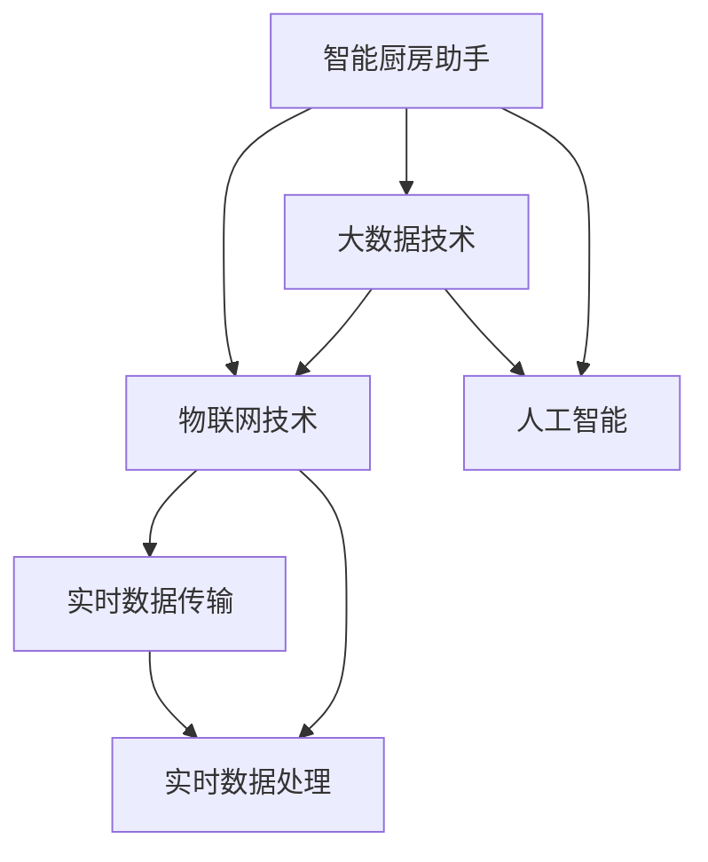

                 

## 1. 背景介绍

### 1.1 问题由来
随着社会的发展，人们的日常生活越来越依赖于技术。如今，智能家居、智能生活设备已经成为了生活的一部分。而在厨房中，传统的烹饪方式已经逐渐被智能厨房助手所替代。智能厨房助手不仅仅只是提高厨房烹饪的效率，更是带来了健康、安全、环保等多方面的好处。

在过去的几年里，智能厨房助手已经在市场开始崭露头角。这股力量正慢慢改变传统的家庭烹饪方式，给人们的生活带来了翻天覆地的变化。在未来的几年里，智能厨房助手的应用将会进一步扩大，成为现代家庭中不可或缺的一部分。

### 1.2 问题核心关键点
智能厨房助手利用物联网技术、大数据技术、人工智能技术，为消费者提供个性化的烹饪建议、智能菜谱、实时烹饪指导等服务，从而提升家庭烹饪的效率和质量，甚至可以做到家庭健康饮食的全面管理。

智能厨房助手的工作原理主要包括以下几个步骤：
1. 数据收集：通过传感器、摄像头等设备，实时收集用户的操作行为和环境信息。
2. 数据处理：将收集到的数据进行实时处理，通过机器学习算法对用户的行为进行分析和预测。
3. 数据反馈：将分析结果实时反馈给用户，给出相应的烹饪建议和指导。

目前，智能厨房助手已经在多个国家和地区得到了广泛应用。从大厨级别的餐厅到普通家庭，智能厨房助手都在为人们的生活带来便利。

### 1.3 问题研究意义
智能厨房助手的广泛应用，不仅提升了人们的厨房烹饪效率，还为家庭健康饮食提供了保障。对于企业来说，这不仅是一个新的商业机会，更是一个提升品牌形象、树立行业标杆的机会。

通过智能厨房助手的应用，可以推动家庭烹饪方式的变革，帮助人们更好地管理健康饮食。同时，智能厨房助手还可以应用于企业餐饮、酒店等场景，大大提升厨房运营效率和餐饮质量。

## 2. 核心概念与联系

### 2.1 核心概念概述

为更好地理解智能厨房助手的核心概念，本节将介绍几个密切相关的核心概念：

- **智能厨房助手**：利用物联网、人工智能等技术，为消费者提供个性化的烹饪建议和指导的厨房设备。
- **物联网技术**：通过互联网连接厨房中的传感器、摄像头等设备，实现数据的实时传输和处理。
- **大数据技术**：通过收集和分析大量的用户数据，为智能厨房助手提供更精准的预测和建议。
- **人工智能**：通过机器学习算法，对用户的行为进行分析和预测，给出相应的烹饪建议。

这些核心概念之间的逻辑关系可以通过以下Mermaid流程图来展示：



这个流程图展示了智能厨房助手的工作流程和关键技术支持：

1. 智能厨房助手通过物联网技术连接传感器和摄像头，实时收集数据。
2. 通过大数据技术对收集到的数据进行分析，得到用户的行为模式。
3. 人工智能算法利用行为模式对未来的行为进行预测，给出相应的烹饪建议。

## 3. 核心算法原理 & 具体操作步骤

### 3.1 算法原理概述

智能厨房助手的核心算法主要依赖于机器学习算法，特别是深度学习算法。其基本原理如下：

- 首先，通过物联网设备收集厨房中的各种数据，如温度、湿度、用户操作行为等。
- 然后，使用大数据技术对这些数据进行清洗和处理，去除噪声和冗余信息。
- 接着，使用深度学习模型，如卷积神经网络（CNN）、循环神经网络（RNN）、长短时记忆网络（LSTM）等，对这些数据进行特征提取和建模。
- 最后，通过预测模型对未来的烹饪行为进行预测，给出相应的烹饪建议和指导。

### 3.2 算法步骤详解

智能厨房助手的核心算法主要分为以下几个步骤：

**Step 1: 数据收集**

智能厨房助手通过各种传感器、摄像头等设备，实时收集厨房中的各种数据。这些数据包括：
- 温度、湿度、光照、气压等环境数据。
- 用户操作数据，如开关烤箱、调整温度、倒水等。
- 食材数据，如食材种类、数量、摆放位置等。

**Step 2: 数据预处理**

收集到的数据通常包含噪声、冗余信息，需要进行预处理。预处理的步骤包括：
- 数据清洗：去除无效数据、异常值、噪声等。
- 特征提取：提取有意义的数据特征，如食材成分、烹饪时间、温度变化等。
- 数据标准化：将数据转换为标准格式，方便后续处理。

**Step 3: 特征工程**

在数据预处理的基础上，需要进行特征工程，将数据转化为模型可以理解的特征。特征工程包括：
- 特征选择：选择对预测结果有影响的特征。
- 特征变换：对特征进行变换，提高模型的表达能力。
- 特征归一化：对特征进行归一化处理，避免特征之间的数值差异过大。

**Step 4: 模型训练**

特征工程完成后，需要进行模型训练。训练的步骤包括：
- 划分训练集和验证集：将数据集划分为训练集和验证集，用于模型训练和调参。
- 选择模型：选择适合的深度学习模型，如卷积神经网络（CNN）、循环神经网络（RNN）、长短时记忆网络（LSTM）等。
- 模型训练：使用训练集对模型进行训练，调整模型参数，提高模型的预测能力。
- 验证集调参：在验证集上对模型进行调参，避免过拟合。

**Step 5: 模型评估**

模型训练完成后，需要进行模型评估，以评估模型的预测能力。评估的步骤包括：
- 划分测试集：将数据集划分为测试集，用于模型评估。
- 模型评估：使用测试集对模型进行评估，计算预测准确率、精确率、召回率等指标。
- 调整模型：根据评估结果，调整模型参数，提高模型的预测能力。

**Step 6: 实时预测**

模型评估完成后，可以将模型部署到实时系统中，进行实时预测。预测的步骤包括：
- 实时数据传输：通过物联网设备，实时传输厨房中的各种数据。
- 实时数据处理：对实时数据进行预处理和特征提取。
- 实时预测：使用训练好的模型对实时数据进行预测，给出相应的烹饪建议和指导。

### 3.3 算法优缺点

智能厨房助手的核心算法具有以下优点：
1. 能够实时收集和处理厨房数据，提供实时的烹饪建议和指导。
2. 使用深度学习模型，可以自动提取数据的特征，提高模型的预测能力。
3. 能够根据用户的习惯和偏好，提供个性化的烹饪建议。

同时，该算法也存在一些缺点：
1. 需要大量的数据进行训练，对于小样本数据集的预测能力可能有限。
2. 模型的复杂度较高，需要较高的计算资源和存储空间。
3. 模型的预测结果可能受到外界环境的影响，如温度、湿度等。

### 3.4 算法应用领域

智能厨房助手的应用领域非常广泛，包括但不限于以下几个方面：

- **家庭烹饪**：为家庭用户提供个性化的烹饪建议和指导，提高烹饪效率和质量。
- **餐厅餐饮**：帮助餐厅提高厨房运营效率，提升餐饮质量和服务水平。
- **健康饮食**：根据用户的健康状况和饮食偏好，提供科学的饮食建议。
- **智能家居**：结合智能家居系统，实现厨房设备的自动化控制和智能化管理。

## 4. 数学模型和公式 & 详细讲解  
### 4.1 数学模型构建

智能厨房助手的数学模型主要基于深度学习模型构建，具体如下：

假设智能厨房助手收集到的环境数据为 $X=(x_1,x_2,...,x_n)$，用户操作数据为 $Y=(y_1,y_2,...,y_m)$，食材数据为 $Z=(z_1,z_2,...,z_k)$。智能厨房助手的目标是根据这些数据，预测未来的烹饪行为 $A$，即 $A=f(X,Y,Z)$。其中，$f$ 为深度学习模型。

### 4.2 公式推导过程

智能厨房助手的深度学习模型可以采用卷积神经网络（CNN）、循环神经网络（RNN）、长短时记忆网络（LSTM）等模型。以循环神经网络为例，其公式推导如下：

假设输入数据为 $X_t=(x_{t-1},x_{t-2},...,x_{t-n})$，输出数据为 $A_t=(y_t,z_t)$，其中 $n$ 为输入序列的长度，$t$ 为当前时刻。

使用循环神经网络进行建模，其公式如下：

$$
A_t = f(X_t) = \sum_{i=1}^n W_i x_{t-i} + b_t
$$

其中，$W_i$ 为权重矩阵，$b_t$ 为偏置向量。

### 4.3 案例分析与讲解

以智能烤箱为例，智能烤箱通过传感器实时收集烤箱中的温度、湿度等数据，结合用户的操作数据，预测未来的烹饪时间。

假设智能烤箱收集到的环境数据为 $X_t=(t_{t-1},t_{t-2},...,t_{t-n})$，用户操作数据为 $Y_t=(y_t,z_t)$，其中 $t$ 为当前时刻，$n$ 为输入序列的长度。使用循环神经网络进行建模，预测未来的烹饪时间 $A_t$，即：

$$
A_t = f(X_t,Y_t) = \sum_{i=1}^n W_i t_{t-i} + b_t
$$

其中，$W_i$ 为权重矩阵，$b_t$ 为偏置向量。

通过训练该模型，可以得到不同食材的烹饪时间预测模型。用户只需要输入食材种类、数量、烤箱温度等数据，智能烤箱就能根据模型预测出烹饪时间，提供实时的烹饪建议。

## 5. 项目实践：代码实例和详细解释说明

### 5.1 开发环境搭建

在进行智能厨房助手的开发前，我们需要准备好开发环境。以下是使用Python进行TensorFlow开发的环境配置流程：

1. 安装Anaconda：从官网下载并安装Anaconda，用于创建独立的Python环境。

2. 创建并激活虚拟环境：
```bash
conda create -n tf-env python=3.8 
conda activate tf-env
```

3. 安装TensorFlow：从官网获取对应的安装命令，安装TensorFlow。

4. 安装TensorFlow Addons：安装TensorFlow Addons，用于支持更多深度学习模型和算法。

5. 安装各类工具包：
```bash
pip install numpy pandas scikit-learn matplotlib tqdm jupyter notebook ipython
```

完成上述步骤后，即可在`tf-env`环境中开始智能厨房助手的开发。

### 5.2 源代码详细实现

这里我们以智能烤箱为例，给出一个使用TensorFlow开发智能烤箱的代码实现。

```python
import tensorflow as tf
from tensorflow.keras.layers import Input, LSTM, Dense, Dropout
from tensorflow.keras.models import Model

# 定义输入数据
input_data = Input(shape=(n,), name='input')
# 定义循环神经网络层
lstm_layer = LSTM(units=128, return_sequences=True, name='lstm')
# 定义全连接层
output_layer = Dense(units=1, activation='sigmoid', name='output')
# 定义模型
model = Model(inputs=input_data, outputs=output_layer)
# 编译模型
model.compile(optimizer='adam', loss='binary_crossentropy', metrics=['accuracy'])

# 训练模型
model.fit(x_train, y_train, batch_size=16, epochs=10, validation_data=(x_val, y_val))

# 评估模型
model.evaluate(x_test, y_test)

# 使用模型进行预测
prediction = model.predict(x_new)
```

### 5.3 代码解读与分析

这里我们详细解读一下关键代码的实现细节：

**输入数据定义**：
- `Input`层用于定义输入数据的形状，这里我们定义输入数据的维度为 $n$。
- 输入数据的维度取决于具体的应用场景，如智能烤箱中，输入数据的维度可能为时间序列长度 $n$。

**循环神经网络层定义**：
- `LSTM`层用于定义循环神经网络层，这里我们将LSTM层的单元数为128。
- `return_sequences=True`表示每个时间步的输出都保留，输出维度为128。

**全连接层定义**：
- `Dense`层用于定义全连接层，这里我们将全连接层的单元数为1，激活函数为sigmoid。
- 输出维度为1表示预测结果为0到1之间的概率。

**模型定义**：
- `Model`层用于定义模型，将输入数据和输出层连接起来。

**模型编译**：
- `compile`方法用于编译模型，定义优化器、损失函数和评估指标。
- 优化器采用Adam优化器，损失函数采用二元交叉熵损失函数，评估指标为准确率。

**模型训练**：
- `fit`方法用于训练模型，定义训练数据、验证数据、批次大小和迭代轮数。
- 使用Adam优化器进行训练，批次大小为16，迭代轮数为10。

**模型评估**：
- `evaluate`方法用于评估模型，定义测试数据和评估指标。
- 评估模型在测试集上的准确率。

**模型预测**：
- `predict`方法用于进行预测，定义新数据 `x_new`。
- 预测结果为0到1之间的概率，可以用于判断是否开始烹饪。

## 6. 实际应用场景

### 6.1 智能厨房

智能厨房助手已经被广泛应用于各种智能厨房设备中，如智能烤箱、智能微波炉、智能冰箱等。智能厨房助手通过收集各种数据，实时分析用户的烹饪行为，提供个性化的烹饪建议。

例如，智能烤箱可以根据用户的操作行为和环境数据，预测最佳的烹饪时间。用户只需要输入食材种类和数量，智能烤箱就能自动调整烤箱温度和时间，确保烹饪效果。

### 6.2 健康饮食

智能厨房助手还可以帮助用户管理健康饮食。通过收集用户的饮食数据和身体数据，智能厨房助手可以生成个性化的饮食建议。例如，根据用户的健康状况和饮食偏好，智能厨房助手可以推荐适合的食材和烹饪方式，帮助用户保持健康饮食。

### 6.3 餐厅餐饮

智能厨房助手在餐厅餐饮中的应用也非常广泛。餐厅可以使用智能厨房助手对菜品进行管理，提高厨房运营效率。智能厨房助手可以实时监控厨房中的各种数据，如温度、湿度等，确保菜品质量。同时，智能厨房助手还可以生成个性化的菜单推荐，提升餐厅的经营效益。

### 6.4 未来应用展望

随着智能厨房助手的不断发展，未来将会有更多的应用场景涌现。

- **智能家居**：智能厨房助手可以与智能家居系统结合，实现厨房设备的自动化控制和智能化管理。例如，智能厨房助手可以自动控制冰箱的温度、湿度等，确保食材新鲜。
- **智能生活**：智能厨房助手可以与智能穿戴设备结合，实时监测用户的健康状况，根据用户的身体数据生成个性化的饮食建议。
- **智能物流**：智能厨房助手可以与智能物流系统结合，实现食材的智能采购和配送。例如，智能厨房助手可以实时监测厨房中的食材数量，自动生成采购清单，优化供应链管理。

## 7. 工具和资源推荐

### 7.1 学习资源推荐

为了帮助开发者系统掌握智能厨房助手的开发技术，这里推荐一些优质的学习资源：

1. **TensorFlow官方文档**：TensorFlow官方文档详细介绍了TensorFlow的使用方法和API，是学习智能厨房助手开发的必备资源。
2. **Keras官方文档**：Keras官方文档详细介绍了Keras的使用方法和API，是学习深度学习模型的必备资源。
3. **PyTorch官方文档**：PyTorch官方文档详细介绍了PyTorch的使用方法和API，是学习深度学习模型的必备资源。
4. **深度学习实战**：由深度学习专家编写的实战书籍，涵盖智能厨房助手开发的各个方面，包括数据处理、模型训练、预测应用等。
5. **智能厨房助手教程**：各大在线平台提供智能厨房助手开发的详细教程，包括代码实现、案例分析、应用场景等。

通过对这些资源的学习实践，相信你一定能够快速掌握智能厨房助手的开发技术，并用于解决实际的智能厨房应用问题。

### 7.2 开发工具推荐

高效的开发离不开优秀的工具支持。以下是几款用于智能厨房助手开发的常用工具：

1. **TensorFlow**：由Google主导开发的开源深度学习框架，生产部署方便，适合大规模工程应用。
2. **Keras**：Keras是一个高级神经网络API，可以在TensorFlow、CNTK、MXNet等深度学习框架上运行，适合快速迭代研究。
3. **PyTorch**：由Facebook主导开发的深度学习框架，灵活性强，适合研究性开发。
4. **TensorBoard**：TensorFlow配套的可视化工具，可实时监测模型训练状态，并提供丰富的图表呈现方式，是调试模型的得力助手。
5. **Jupyter Notebook**：在线Jupyter Notebook环境，免费提供GPU/TPU算力，方便开发者快速上手实验最新模型，分享学习笔记。

合理利用这些工具，可以显著提升智能厨房助手的开发效率，加快创新迭代的步伐。

### 7.3 相关论文推荐

智能厨房助手的发展源于学界的持续研究。以下是几篇奠基性的相关论文，推荐阅读：

1. **Deep Learning in Smart Kitchens**：介绍了深度学习在智能厨房中的应用，包括智能烤箱、智能冰箱等设备的实现。
2. **Smart Kitchen Assistant**：介绍了智能厨房助手的设计和实现，包括数据收集、特征提取、模型训练和预测等关键步骤。
3. **IoT-Based Smart Kitchen Assistant**：介绍了物联网技术在智能厨房助手中的应用，包括传感器、摄像头等设备的连接和数据处理。
4. **Smart Kitchen Cooking Assistant**：介绍了智能厨房助手的应用场景和实际案例，包括家庭烹饪、餐厅餐饮、健康饮食等。
5. **Smart Kitchen Assistant Design**：介绍了智能厨房助手的设计思路和实现方法，包括用户界面、数据采集、数据处理、模型训练等。

这些论文代表了大数据、深度学习和智能厨房助手的研究脉络。通过学习这些前沿成果，可以帮助研究者把握学科前进方向，激发更多的创新灵感。

## 8. 总结：未来发展趋势与挑战

### 8.1 总结

本文对智能厨房助手进行了全面系统的介绍。首先阐述了智能厨房助手的研究背景和意义，明确了智能厨房助手在提高厨房烹饪效率和质量方面的独特价值。其次，从原理到实践，详细讲解了智能厨房助手的数学模型和关键算法，给出了智能烤箱的代码实现。同时，本文还广泛探讨了智能厨房助手在家庭烹饪、健康饮食、餐厅餐饮等多个领域的应用前景，展示了智能厨房助手的发展潜力。此外，本文精选了智能厨房助手开发的各种学习资源，力求为读者提供全方位的技术指引。

通过本文的系统梳理，可以看到，智能厨房助手已经成为了现代厨房中不可或缺的一部分，极大地提升了家庭烹饪的效率和质量，为人们的生活带来了翻天覆地的变化。未来，随着技术的不断发展，智能厨房助手还将有更广阔的应用场景和更大的发展潜力。

### 8.2 未来发展趋势

展望未来，智能厨房助手的应用将呈现以下几个发展趋势：

1. **数据驱动**：随着数据的不断积累，智能厨房助手将更加依赖于数据驱动，通过分析用户行为和偏好，提供更精准的预测和建议。
2. **个性化**：智能厨房助手将根据用户的个性需求，提供个性化的烹饪建议，提升用户的体验和满意度。
3. **智能化**：智能厨房助手将通过深度学习、自然语言处理等技术，实现更高级的智能化功能，如自然语言交互、智能推荐等。
4. **物联网化**：智能厨房助手将与物联网技术结合，实现更广泛的设备互联和数据共享，提升厨房运营效率。
5. **实时化**：智能厨房助手将实现实时数据采集和处理，提供更及时和准确的烹饪建议和指导。

### 8.3 面临的挑战

尽管智能厨房助手已经取得了显著进展，但在迈向更广泛应用的过程中，仍面临诸多挑战：

1. **数据隐私和安全**：智能厨房助手需要收集大量的用户数据，如何保障数据隐私和安全成为关键问题。
2. **设备兼容性**：不同品牌的智能厨房设备需要兼容，如何实现设备间的互联互通成为重要挑战。
3. **用户接受度**：用户对新技术的接受度参差不齐，如何提高用户的接受度和使用体验成为重要课题。
4. **性能瓶颈**：智能厨房助手的计算资源和存储资源有限，如何提升性能和效率成为重要挑战。
5. **市场竞争**：智能厨房助手市场竞争激烈，如何提升产品竞争力和市场占有率成为重要课题。

### 8.4 研究展望

面对智能厨房助手面临的种种挑战，未来的研究需要在以下几个方面寻求新的突破：

1. **数据隐私和安全保护**：开发更加安全、隐私保护的技术，如差分隐私、加密算法等，保障用户数据的安全。
2. **设备兼容性**：开发通用的接口和协议，实现不同品牌的智能厨房设备的互联互通。
3. **用户体验提升**：通过界面设计、交互方式等技术手段，提升用户的接受度和使用体验。
4. **性能优化**：通过模型优化、算法优化等技术手段，提升智能厨房助手的性能和效率。
5. **市场推广**：通过市场调研、产品设计等手段，提升产品的竞争力和市场占有率。

这些研究方向的探索，必将引领智能厨房助手的技术进步，为构建更智能、更高效的厨房系统提供新的动力。面向未来，智能厨房助手需要从技术、市场、用户等多个维度协同发力，才能真正实现人工智能技术在厨房领域的落地应用。

## 9. 附录：常见问题与解答

**Q1：智能厨房助手是否适用于所有类型的厨房设备？**

A: 智能厨房助手可以适用于多种类型的厨房设备，如智能烤箱、智能微波炉、智能冰箱等。不同类型的设备可以通过不同的传感器和数据采集方式，进行数据收集和处理。但需要注意，不同设备的智能化程度和数据采集方式可能有所不同，需要根据设备的具体情况进行定制化开发。

**Q2：智能厨房助手的预测精度如何保证？**

A: 智能厨房助手的预测精度主要取决于数据的质量和数量。如果收集到的数据足够多、质量高，且模型训练充分，预测精度可以得到保障。同时，通过模型调参、数据增强等技术手段，可以提高模型的预测精度。

**Q3：智能厨房助手在实际应用中是否需要不断更新和优化？**

A: 是的，智能厨房助手需要不断更新和优化，以适应不断变化的厨房环境和用户需求。可以通过定期数据收集、模型重新训练等手段，持续提升智能厨房助手的预测能力和用户体验。

**Q4：智能厨房助手的应用成本如何？**

A: 智能厨房助手的应用成本主要取决于设备采购、模型训练和设备维护等环节。但相比于传统厨房设备，智能厨房助手可以大幅提升厨房运营效率和用户体验，带来的经济效益远大于成本投入。

**Q5：智能厨房助手是否存在伦理问题？**

A: 智能厨房助手在数据隐私、设备兼容性等方面存在一定的伦理问题。需要在开发过程中注重数据隐私保护，确保用户数据的合法合规使用。同时，需要设计良好的用户界面和交互方式，提升用户的接受度和使用体验。

---

作者：禅与计算机程序设计艺术 / Zen and the Art of Computer Programming

