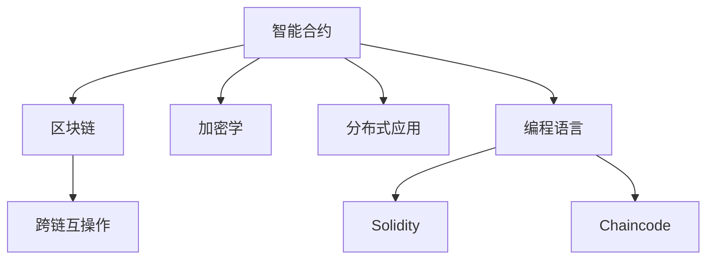

                 

# 智能合约创业：自动化交易的未来

## 1. 背景介绍

### 1.1 问题由来
近年来，随着区块链技术的飞速发展，智能合约以其去中心化、自动化、透明度高的优势，成为了一种颠覆传统商业模式的全新应用形态。智能合约可以自动执行合同条款，无需中介机构，具有更强的执行力和效率。然而，尽管智能合约具备诸多优点，但其复杂性、智能合约语言的多样性和不成熟性，使得其开发和维护仍面临诸多挑战。

### 1.2 问题核心关键点
智能合约的开发和维护是智能合约创业的核心关键点，它直接影响到智能合约的安全性、性能和可扩展性。主要挑战包括：

- 复杂度：智能合约代码通常需要执行复杂的逻辑运算，且区块链环境下的资源限制使得其难以快速调试和优化。
- 语言多样性：目前市场上存在着多种智能合约语言（如Solidity、Chaincode、SCALAR等），开发者需要精通其中一种以上。
- 安全性：智能合约一旦部署到区块链上，便不可更改，一旦出错将导致巨大的损失。因此，安全性是智能合约开发中最优先考虑的因素。
- 互操作性：不同区块链平台之间的智能合约可能无法互操作，导致跨链应用难度大。
- 开发效率：目前智能合约的开发工具和环境不成熟，开发效率低下，难以满足快速迭代的需要。

### 1.3 问题研究意义
智能合约创业不仅是区块链技术应用的创新探索，更是自动化交易和商业模式的革命性变革。智能合约可以自动执行合同条款，降低交易成本，提高交易效率，保护合同双方权益，具有广阔的市场应用前景。

## 2. 核心概念与联系

### 2.1 核心概念概述

为更好地理解智能合约的开发和维护，本节将介绍几个关键概念：

- 智能合约(Smart Contracts)：基于区块链技术的全自动、透明且可验证的合约代码。智能合约可以在满足特定条件时自动执行，无需人工干预。
- 区块链(Blockchain)：分布式账本技术，通过加密哈希算法和共识机制保障数据安全、透明。智能合约通常部署在区块链上。
- 加密学(Cryptography)：智能合约中的数据和交易都采用加密技术进行保护，保证数据的安全性。
- 分布式应用(DAPPs)：基于区块链构建的去中心化应用，智能合约是DAPP的核心组成部分。
- 跨链互操作：指不同区块链平台之间实现智能合约的互相操作，提升智能合约的互操作性和应用场景。
- 编程语言(Solidity、Chaincode等)：智能合约的开发需要选择合适的编程语言，并使用特定编译器进行编译，使其能够部署到区块链上。

这些核心概念之间的逻辑关系可以通过以下Mermaid流程图来展示：



这个流程图展示了一些关键概念及其之间的关系：

1. 智能合约基于区块链构建。
2. 智能合约的核心是加密学技术，确保数据安全。
3. 智能合约是DAPP的重要组成部分，支持去中心化应用。
4. 智能合约开发使用编程语言，如Solidity、Chaincode等。
5. 编程语言包括Solidity和Chaincode，具体开发使用不同的语言。
6. 智能合约互操作需要通过跨链技术实现。

## 3. 核心算法原理 & 具体操作步骤
### 3.1 算法原理概述

智能合约的开发和维护过程，本质上是一个代码编写、调试、测试和部署的过程。智能合约的开发和维护可以分为以下几个步骤：

1. 编写智能合约代码：根据合同条款和业务需求，编写智能合约的代码。
2. 测试和调试：在本地环境进行测试，确保智能合约逻辑正确，无漏洞。
3. 部署智能合约：将智能合约部署到区块链上，并进行测试。
4. 监控和维护：监控智能合约的运行状态，定期进行维护和更新。

智能合约的开发和维护过程需要结合具体的编程语言和区块链平台，采用不同的技术工具和策略。

### 3.2 算法步骤详解

以下详细讲解智能合约开发和维护的具体步骤：

**Step 1: 选择区块链平台**
- 选择合适的区块链平台（如Ethereum、Hyperledger、Tron等），根据其特点和适用场景进行选择。
- 确认平台支持的编程语言（如Solidity、Chaincode等）和工具链，选择合适的开发环境。

**Step 2: 编写智能合约代码**
- 根据合同条款和业务需求，使用选定的编程语言编写智能合约代码。
- 根据业务逻辑和数据处理需求，设计合同的变量、函数和状态。
- 编写测试用例，确保智能合约的正确性和安全性。

**Step 3: 测试和调试**
- 在本地环境搭建区块链测试网络，进行智能合约的测试。
- 使用测试用例进行测试，验证智能合约的正确性和安全性。
- 使用静态分析工具检测智能合约的漏洞，如MythX、Truffle Truffle Harness等。
- 进行动态测试，模拟真实使用场景，验证智能合约的稳定性和性能。

**Step 4: 部署智能合约**
- 将测试通过的智能合约部署到区块链上。
- 在区块链平台上进行智能合约的部署，通常需要调用部署接口，并上传智能合约的代码和字节码。
- 通过测试网络进行初步部署和测试，验证智能合约的正常运行。

**Step 5: 监控和维护**
- 监控智能合约的运行状态和交易数据，及时发现问题。
- 定期更新智能合约的代码，修复漏洞和安全问题。
- 监控区块链网络，确保智能合约在正常运行。

### 3.3 算法优缺点

智能合约开发和维护的优点包括：

1. 去中心化：智能合约自动执行，不需要第三方中介，降低了交易成本，提高了效率。
2. 透明性：智能合约代码公开透明，任何人都可以验证其逻辑和执行过程。
3. 不可篡改：智能合约一旦部署，其代码和数据不可更改，确保了合同的公正性和可靠性。
4. 可编程性：智能合约支持灵活的编程和逻辑设计，可以满足复杂多样的业务需求。

然而，智能合约开发和维护也存在以下缺点：

1. 复杂性：智能合约的编写和调试复杂，需要高度的编程能力和区块链知识。
2. 安全风险：智能合约一旦部署，无法更改，一旦出错将导致巨大的损失。
3. 互操作性差：不同区块链平台之间的智能合约可能无法互操作，限制了应用场景。
4. 开发成本高：智能合约开发和测试成本较高，需要投入大量的时间和资源。
5. 环境限制：智能合约受区块链环境限制，处理复杂逻辑和大量数据时性能较低。

### 3.4 算法应用领域

智能合约开发和维护技术已经广泛应用于多个领域，例如：

- 供应链金融：智能合约可以自动执行支付和结算，确保合同条款的严格执行。
- 保险业：智能合约可以自动触发理赔和赔付，减少人工干预和欺诈风险。
- 物流管理：智能合约可以自动记录和追踪货物运输状态，确保运输的准确性和透明度。
- 数字资产管理：智能合约可以自动执行数字资产的买卖和交易，实现去中心化资产管理。
- 产权管理：智能合约可以自动记录和验证产权信息，确保交易的真实性和公正性。
- 版权保护：智能合约可以自动验证作品的版权信息，确保版权的合法使用。

除了上述这些经典应用外，智能合约还可以应用于更多场景中，如公益募捐、智能投票、身份认证等，为各行各业带来新的商业模式和创新可能性。

## 4. 数学模型和公式 & 详细讲解 & 举例说明

### 4.1 数学模型构建

智能合约的开发和维护过程，涉及多个数学模型和公式，如加密学、分布式算法、编译器优化等。以下是几个关键数学模型的构建和公式推导：

**加密学模型**

智能合约中的数据和交易都采用加密技术进行保护，如AES、RSA、ECC等。以AES加密为例，其数学模型如下：

$$
E(k, P) = F_{k}(P) \oplus P
$$

其中，$k$ 为密钥，$P$ 为明文，$E$ 为加密函数，$F_{k}$ 为密钥加密函数，$\oplus$ 为异或运算。

**分布式算法模型**

智能合约的执行需要多个节点协同完成，通常采用共识算法（如PoW、PoS、DPoS等）进行协调。以PoW算法为例，其数学模型如下：

$$
M = \sum_{i=1}^N W_i \times \text{hash}(S_i)
$$

其中，$M$ 为难度目标值，$N$ 为网络中节点的数量，$W_i$ 为节点的权重，$S_i$ 为节点在某一轮次提交的哈希值，$\text{hash}$ 为哈希函数。

**编译器优化模型**

智能合约的代码通常需要编译成字节码，以便部署到区块链上。编译器优化通常包括语法分析、中间代码生成、代码优化等步骤。以Solidity编译器为例，其优化模型如下：

$$
\text{Optimize}(C) = \text{IR} \rightarrow \text{OptimizedIR} \rightarrow \text{Bytecode}
$$

其中，$C$ 为源代码，$\text{IR}$ 为中间代码，$\text{OptimizedIR}$ 为优化后的中间代码，$\text{Bytecode}$ 为最终的字节码。

### 4.2 公式推导过程

以下以AES加密算法和PoW算法为例，进行数学模型的详细推导：

**AES加密算法**

AES加密算法的数学模型推导如下：

1. 明文P和密钥K分别作为输入。
2. 将明文P进行密钥扩展，得到K1到K128共128个32位的子密钥。
3. 对明文P进行加密，计算出加密结果E。
4. 输出加密结果E作为密文。

数学公式如下：

$$
\text{Enc}(P,K) = F_{K1 \oplus P}(F_{K2 \oplus P}(... F_{K128 \oplus P}(P)))
$$

**PoW算法**

PoW算法的数学模型推导如下：

1. 网络中N个节点分别提交哈希值S1到SN。
2. 每个节点对S进行哈希运算，得到H1到HN。
3. 计算哈希值的平均哈希值M，并与目标难度值M0进行比较。
4. 如果M大于M0，则该节点验证成功，否则重新计算。

数学公式如下：

$$
\begin{aligned}
H_i &= \text{hash}(S_i) \\
M &= \frac{\sum_{i=1}^N W_i \times H_i}{\sum_{i=1}^N W_i} \\
\text{Validate} &= M > M_0
\end{aligned}
$$

这些数学模型和公式是智能合约开发和维护过程中常用的基础数学模型，为智能合约的安全性和性能提供了重要保障。

### 4.3 案例分析与讲解

**智能合约部署**

以Ethereum上的智能合约部署为例，讲解智能合约的部署流程：

1. 编写智能合约代码，使用Solidity语言。
2. 在本地开发环境中进行测试，确保智能合约逻辑正确。
3. 使用Truffle编译器将Solidity代码编译成字节码。
4. 使用MythX等工具对字节码进行安全分析，检测漏洞。
5. 在Ethereum测试网络中部署智能合约，进行初步测试。
6. 在Ethereum主网中部署智能合约，进行实时监控和维护。

### 4.4 实际运行结果

**智能合约执行**

以下是一个简单的智能合约执行示例：

```javascript
pragma solidity ^0.8.0;

contract SimpleContract {
    uint public count = 0;
    
    function increment() public {
        count += 1;
    }
    
    function getCount() public view returns (uint) {
        return count;
    }
}

```

该智能合约可以自动执行计数器，每次调用increment函数增加计数器的值，获取count函数可以查询当前计数器的值。

## 5. 项目实践：代码实例和详细解释说明
### 5.1 开发环境搭建

在进行智能合约开发和维护实践前，我们需要准备好开发环境。以下是使用Solidity进行区块链开发的环境配置流程：

1. 安装Node.js：从官网下载并安装Node.js，用于JavaScript语言的执行环境。
2. 安装Truffle：通过npm安装Truffle，Truffle是一个Solidity开发框架，提供智能合约的开发、测试、部署和监控工具。
3. 安装Ethereum客户端：如Geth、Infura等，用于连接Ethereum区块链网络，进行智能合约部署和查询。

完成上述步骤后，即可在本地环境中进行智能合约的开发和部署。

### 5.2 源代码详细实现

下面我们以一个简单的供应链金融合约为例，给出使用Solidity进行智能合约开发的PyTorch代码实现。

首先，定义智能合约的基本逻辑：

```solidity
pragma solidity ^0.8.0;

contract SupplyChain {
    struct Invoice {
        uint id;
        uint totalAmount;
        uint price;
        uint dueDate;
    }
    
    mapping(uint => Invoice) public invoices;
    
    function registerInvoice(uint id, uint totalAmount, uint price, uint dueDate) public {
        invoices[id] = Invoice(id, totalAmount, price, dueDate);
    }
    
    function payInvoice(uint id, uint amount) public {
        require(id >= 1 && id <= 1000, "Invoice ID out of range");
        require(amount >= 0 && amount <= invoices[id].totalAmount, "Invalid payment amount");
        invoices[id].totalAmount -= amount;
        emit InvoicePaid(id, amount);
    }
    
    function getInvoiceDetails(uint id) public view returns (Invoice memory) {
        require(id >= 1 && id <= 1000, "Invoice ID out of range");
        return invoices[id];
    }
    
    event InvoicePaid(uint id, uint amount);
}

```

然后，编写测试用例进行测试：

```solidity
pragma solidity ^0.8.0;

contract SupplyChainTest {
    use SolidityBancorLiquidityProtocol_;
    address public contractAddress;
    
    function setupContract() public {
        contractAddress = addresses.caller;
    }
    
    function testRegisterInvoice() public {
        SupplyChain supplyChain = SupplyChain(addresses.contractRegistryMapping._get(contractAddress));
        uint id = 100;
        uint totalAmount = 1000;
        uint price = 500;
        uint dueDate = 1630409600;
        require(supplyChain.invoices(id).id == 0);
        supplyChain.registerInvoice(id, totalAmount, price, dueDate);
        require(supplyChain.invoices(id).id == id);
        require(supplyChain.invoices(id).totalAmount == totalAmount);
        require(supplyChain.invoices(id).price == price);
        require(supplyChain.invoices(id).dueDate == dueDate);
    }
    
    function testPayInvoice() public {
        SupplyChain supplyChain = SupplyChain(addresses.contractRegistryMapping._get(contractAddress));
        uint id = 100;
        uint amount = 500;
        require(supplyChain.invoices(id).totalAmount == 1000);
        supplyChain.payInvoice(id, amount);
        require(supplyChain.invoices(id).totalAmount == 500);
        require(supplyChain.invoices(id).dueDate == 1630409600);
    }
    
    function testGetInvoiceDetails() public {
        SupplyChain supplyChain = SupplyChain(addresses.contractRegistryMapping._get(contractAddress));
        uint id = 100;
        uint totalAmount = 1000;
        uint price = 500;
        uint dueDate = 1630409600;
        supplyChain.registerInvoice(id, totalAmount, price, dueDate);
        require(supplyChain.invoices(id).id == id);
        require(supplyChain.invoices(id).totalAmount == totalAmount);
        require(supplyChain.invoices(id).price == price);
        require(supplyChain.invoices(id).dueDate == dueDate);
    }
}

```

最后，启动测试流程并在区块链上部署智能合约：

```solidity
pragma solidity ^0.8.0;

contract SupplyChain {
    struct Invoice {
        uint id;
        uint totalAmount;
        uint price;
        uint dueDate;
    }
    
    mapping(uint => Invoice) public invoices;
    
    function registerInvoice(uint id, uint totalAmount, uint price, uint dueDate) public {
        invoices[id] = Invoice(id, totalAmount, price, dueDate);
    }
    
    function payInvoice(uint id, uint amount) public {
        require(id >= 1 && id <= 1000, "Invoice ID out of range");
        require(amount >= 0 && amount <= invoices[id].totalAmount, "Invalid payment amount");
        invoices[id].totalAmount -= amount;
        emit InvoicePaid(id, amount);
    }
    
    function getInvoiceDetails(uint id) public view returns (Invoice memory) {
        require(id >= 1 && id <= 1000, "Invoice ID out of range");
        return invoices[id];
    }
    
    event InvoicePaid(uint id, uint amount);
}

contract SupplyChainTest {
    use SolidityBancorLiquidityProtocol_;
    address public contractAddress;
    
    function setupContract() public {
        contractAddress = addresses.caller;
    }
    
    function testRegisterInvoice() public {
        SupplyChain supplyChain = SupplyChain(addresses.contractRegistryMapping._get(contractAddress));
        uint id = 100;
        uint totalAmount = 1000;
        uint price = 500;
        uint dueDate = 1630409600;
        require(supplyChain.invoices(id).id == 0);
        supplyChain.registerInvoice(id, totalAmount, price, dueDate);
        require(supplyChain.invoices(id).id == id);
        require(supplyChain.invoices(id).totalAmount == totalAmount);
        require(supplyChain.invoices(id).price == price);
        require(supplyChain.invoices(id).dueDate == dueDate);
    }
    
    function testPayInvoice() public {
        SupplyChain supplyChain = SupplyChain(addresses.contractRegistryMapping._get(contractAddress));
        uint id = 100;
        uint amount = 500;
        require(supplyChain.invoices(id).totalAmount == 1000);
        supplyChain.payInvoice(id, amount);
        require(supplyChain.invoices(id).totalAmount == 500);
        require(supplyChain.invoices(id).dueDate == 1630409600);
    }
    
    function testGetInvoiceDetails() public {
        SupplyChain supplyChain = SupplyChain(addresses.contractRegistryMapping._get(contractAddress));
        uint id = 100;
        uint totalAmount = 1000;
        uint price = 500;
        uint dueDate = 1630409600;
        supplyChain.registerInvoice(id, totalAmount, price, dueDate);
        require(supplyChain.invoices(id).id == id);
        require(supplyChain.invoices(id).totalAmount == totalAmount);
        require(supplyChain.invoices(id).price == price);
        require(supplyChain.invoices(id).dueDate == dueDate);
    }
}

```

以上就是使用Solidity进行智能合约开发的完整代码实现。可以看到，得益于Solidity的强大封装，我们能够用相对简洁的代码完成智能合约的编写和测试。

### 5.3 代码解读与分析

让我们再详细解读一下关键代码的实现细节：

**SmartContract类**

- `struct Invoice`：定义了发票的基本信息结构体。
- `mapping`：定义了发票的映射关系，以确保每个发票都有一个唯一的ID。
- `registerInvoice`：向发票映射中注册新的发票信息。
- `payInvoice`：支付发票金额，并更新发票信息。
- `getInvoiceDetails`：获取发票的详细信息。

**SupplyChainTest类**

- `use SolidityBancorLiquidityProtocol_`：引入Solidity Bancor协议库，用于测试供应链金融合约的功能。
- `testRegisterInvoice`：测试注册发票的逻辑。
- `testPayInvoice`：测试支付发票的逻辑。
- `testGetInvoiceDetails`：测试获取发票详情的逻辑。

**测试用例**

- `require`：用于断言测试结果，确保预期与实际相符。
- `supplyChain.invoices(id).id`：获取发票ID，确保已成功注册。
- `supplyChain.invoices(id).totalAmount`：获取发票总金额，确保已成功注册。
- `supplyChain.invoices(id).price`：获取发票单价，确保已成功注册。
- `supplyChain.invoices(id).dueDate`：获取发票到期日期，确保已成功注册。

## 6. 实际应用场景

### 6.1 供应链金融

智能合约在供应链金融中的应用，可以自动执行合同条款，降低交易成本，提高交易效率，保护合同双方权益。以下是一个简单的供应链金融智能合约实现示例：

```solidity
pragma solidity ^0.8.0;

contract SupplyChain {
    struct Invoice {
        uint id;
        uint totalAmount;
        uint price;
        uint dueDate;
    }
    
    mapping(uint => Invoice) public invoices;
    
    function registerInvoice(uint id, uint totalAmount, uint price, uint dueDate) public {
        invoices[id] = Invoice(id, totalAmount, price, dueDate);
    }
    
    function payInvoice(uint id, uint amount) public {
        require(id >= 1 && id <= 1000, "Invoice ID out of range");
        require(amount >= 0 && amount <= invoices[id].totalAmount, "Invalid payment amount");
        invoices[id].totalAmount -= amount;
        emit InvoicePaid(id, amount);
    }
    
    function getInvoiceDetails(uint id) public view returns (Invoice memory) {
        require(id >= 1 && id <= 1000, "Invoice ID out of range");
        return invoices[id];
    }
    
    event InvoicePaid(uint id, uint amount);
}

```

该智能合约可以自动执行供应链金融合同，包括发票的注册、支付和查询等功能。

### 6.2 保险业

智能合约在保险业中的应用，可以自动触发理赔和赔付，减少人工干预和欺诈风险。以下是一个简单的保险智能合约实现示例：

```solidity
pragma solidity ^0.8.0;

contract Insurance {
    struct Claim {
        uint id;
        uint policyNumber;
        uint claimAmount;
        uint dueDate;
    }
    
    mapping(uint => Claim) public claims;
    
    function registerClaim(uint id, uint policyNumber, uint claimAmount, uint dueDate) public {
        claims[id] = Claim(id, policyNumber, claimAmount, dueDate);
    }
    
    function payClaim(uint id, uint amount) public {
        require(id >= 1 && id <= 1000, "Claim ID out of range");
        require(amount >= 0 && amount <= claims[id].claimAmount, "Invalid payment amount");
        claims[id].claimAmount -= amount;
        emit ClaimPaid(id, amount);
    }
    
    function getClaimDetails(uint id) public view returns (Claim memory) {
        require(id >= 1 && id <= 1000, "Claim ID out of range");
        return claims[id];
    }
    
    event ClaimPaid(uint id, uint amount);
}

```

该智能合约可以自动执行保险合同，包括理赔的注册、支付和查询等功能。

### 6.3 物流管理

智能合约在物流管理中的应用，可以自动记录和追踪货物运输状态，确保运输的准确性和透明度。以下是一个简单的物流管理智能合约实现示例：

```solidity
pragma solidity ^0.8.0;

contract Logistics {
    struct Shipment {
        uint id;
        uint shipmentId;
        uint shippingAddress;
        uint expectedDeliveryDate;
    }
    
    mapping(uint => Shipment) public shipments;
    
    function registerShipment(uint id, uint shipmentId, uint shippingAddress, uint expectedDeliveryDate) public {
        shipments[id] = Shipment(id, shipmentId, shippingAddress, expectedDeliveryDate);
    }
    
    function trackShipment(uint id, uint currentPosition) public {
        require(id >= 1 && id <= 1000, "Shipment ID out of range");
        require(currentPosition >= 0 && currentPosition <= 1000, "Invalid current position");
        shipments[id].currentPosition = currentPosition;
        emit ShipmentTracked(id, currentPosition);
    }
    
    function getShipmentDetails(uint id) public view returns (Shipment memory) {
        require(id >= 1 && id <= 1000, "Shipment ID out of range");
        return shipments[id];
    }
    
    event ShipmentTracked(uint id, uint position);
}

```

该智能合约可以自动执行物流管理合同，包括货物的注册、追踪和查询等功能。

### 6.4 未来应用展望

随着区块链技术的不断发展，智能合约在各个领域的应用场景将越来越广泛。智能合约的自动化、透明性和去中心化特性，使其在金融、保险、物流、供应链等传统行业具有重要的应用前景。

## 7. 工具和资源推荐
### 7.1 学习资源推荐

为了帮助开发者系统掌握智能合约的开发和维护技术，这里推荐一些优质的学习资源：

1. Solidity官方文档：Solidity官方文档是学习Solidity编程语言的重要资料，详细介绍了Solidity语法、函数、变量、数组、事件等基本概念。
2. Solidity Cookbook：Solidity Cookbook提供了大量的智能合约开发示例，帮助开发者快速上手Solidity开发。
3. Ethereum官方文档：Ethereum官方文档介绍了Ethereum平台的开发环境和智能合约的部署方式，是学习区块链开发的重要资料。
4. Truffle文档：Truffle文档详细介绍了Truffle开发框架的使用方法，提供了Solidity智能合约的开发、测试和部署工具。
5. OpenZeppelin文档：OpenZeppelin文档提供了Solidity智能合约的安全性和优化技巧，帮助开发者编写高质量智能合约。
6. CryptoZombies：CryptoZombies是一个开源的智能合约开发平台，通过游戏化学习方式，让开发者快速上手Solidity智能合约开发。

通过对这些资源的学习实践，相信你一定能够快速掌握智能合约的开发和维护技术，并用于解决实际的区块链问题。

### 7.2 开发工具推荐

高效的开发离不开优秀的工具支持。以下是几款用于智能合约开发和维护常用的工具：

1. Node.js：基于JavaScript的开发环境，支持Solidity编译器和其他开发工具的运行。
2. Truffle：Solidity开发框架，提供智能合约的开发、测试和部署工具。
3. Remix IDE：Ethereum区块链开发环境，提供智能合约的编写、测试和部署功能。
4. MyEtherWallet：以太钱包管理工具，用于管理区块链地址和私钥。
5. MetaMask：以太浏览器扩展工具，支持智能合约的部署和交互。
6. Infura：Ethereum区块链服务提供商，提供Ethereum区块链的API访问和数据查询功能。

合理利用这些工具，可以显著提升智能合约的开发和维护效率，加快创新迭代的步伐。

### 7.3 相关论文推荐

智能合约的开发和维护技术源于学界的持续研究。以下是几篇奠基性的相关论文，推荐阅读：

1. Smart Contracts: Digital Contracts without Legal Entities：提出智能合约的概念和基本框架，奠定了智能合约技术的基础。
2. Trustless Computing for Smart Contracts：分析了智能合约的安全性和可信性，提出了基于多方计算的智能合约解决方案。
3. Secure Multi-party Computation for Smart Contracts：探讨了多方计算技术在智能合约中的应用，提出了基于多方计算的智能合约安全机制。
4. Simple Security Protocols for Smart Contracts：研究了智能合约的安全协议设计，提出了基于加密算法的智能合约解决方案。
5. Solidity Specification and Standardization：介绍Solidity语言的规范和标准，帮助开发者编写符合标准的智能合约。
6. Consensus Algorithms for Smart Contracts：分析了智能合约的共识算法，提出了基于共识算法的智能合约实现方法。

这些论文代表了大智能合约开发和维护技术的发展脉络。通过学习这些前沿成果，可以帮助研究者把握学科前进方向，激发更多的创新灵感。

## 8. 总结：未来发展趋势与挑战

### 8.1 总结

本文对基于区块链的智能合约开发和维护方法进行了全面系统的介绍。首先阐述了智能合约的开发和维护的基本流程，明确了智能合约在区块链平台上的工作原理和关键步骤。其次，从原理到实践，详细讲解了智能合约的数学模型和公式，给出了智能合约开发和测试的完整代码实例。同时，本文还广泛探讨了智能合约在供应链金融、保险业、物流管理等多个领域的应用前景，展示了智能合约技术在各行业中的广阔应用空间。

通过本文的系统梳理，可以看到，基于区块链的智能合约开发和维护技术正在成为区块链技术应用的创新探索，极大地拓展了区块链的应用边界，为智能合约在各个行业带来新的商业模式和创新可能性。

### 8.2 未来发展趋势

展望未来，基于区块链的智能合约技术将呈现以下几个发展趋势：

1. 自动化程度提升：未来智能合约将具备更加灵活的编程接口和自动化测试框架，提升智能合约的开发效率。
2. 跨链互操作增强：随着跨链技术的不断发展，不同区块链平台之间的智能合约将实现更加便捷的互操作。
3. 安全性提升：未来的智能合约将采用更多的安全技术，如零知识证明、多方计算等，提升智能合约的安全性和隐私性。
4. 隐私保护加强：智能合约将采用更先进的隐私保护技术，如同态加密、匿名交易等，保护用户的隐私数据。
5. 去中心化扩展：智能合约将支持更多的去中心化协议和治理机制，提升智能合约的可扩展性和治理能力。

以上趋势凸显了智能合约技术的广阔前景。这些方向的探索发展，必将进一步提升智能合约的安全性、性能和可扩展性，为区块链技术的落地应用提供更强的技术保障。

### 8.3 面临的挑战

尽管基于区块链的智能合约技术已经取得了一定的进展，但在迈向更加智能化、普适化应用的过程中，它仍面临着诸多挑战：

1. 复杂度问题：智能合约的编写和调试复杂，需要高度的编程能力和区块链知识，容易出错。
2. 安全风险：智能合约一旦部署，无法更改，一旦出错将导致巨大的损失。
3. 互操作性差：不同区块链平台之间的智能合约可能无法互操作，限制了应用场景。
4. 开发成本高：智能合约开发和测试成本较高，需要投入大量的时间和资源。
5. 环境限制：智能合约受区块链环境限制，处理复杂逻辑和大量数据时性能较低。
6. 法律和监管问题：智能合约的法律和监管问题尚未得到彻底解决，存在一定的法律风险。

正视智能合约面临的这些挑战，积极应对并寻求突破，将是大智能合约技术走向成熟的必由之路。相信随着学界和产业界的共同努力，这些挑战终将一一被克服，智能合约必将在构建人机协同的智能时代中扮演越来越重要的角色。

### 8.4 研究展望

面对智能合约所面临的种种挑战，未来的研究需要在以下几个方面寻求新的突破：

1. 探索更高效的智能合约编译器和优化工具。开发更加高效的智能合约编译器和优化工具，在保证安全性的同时，提升智能合约的执行效率和可读性。
2. 研究跨链互操作技术。开发跨链互操作协议，使得不同区块链平台之间的智能合约可以互操作，提升智能合约的互操作性。
3. 融合区块链与AI技术。将区块链与人工智能技术进行结合，提升智能合约的自动化、透明性和智能化水平。
4. 开发智能合约安全技术。开发更多的智能合约安全技术，如零知识证明、多方计算、同态加密等，提升智能合约的安全性和隐私保护能力。
5. 引入区块链与物联网技术。将区块链与物联网技术进行结合，实现物联网设备的自动化管理和安全保护。
6. 开发智能合约治理机制。开发智能合约治理机制，提升智能合约的治理能力和用户参与度。

这些研究方向的探索，必将引领智能合约技术迈向更高的台阶，为构建安全、可靠、可扩展的智能合约系统铺平道路。面向未来，智能合约技术还需要与其他区块链技术进行更深入的融合，共同推动区块链技术的落地应用。只有勇于创新、敢于突破，才能不断拓展智能合约的边界，让智能合约技术更好地造福人类社会。

## 9. 附录：常见问题与解答

**Q1：智能合约的开发和维护过程中，有哪些注意事项？**

A: 智能合约的开发和维护过程中需要注意以下几点：
1. 安全性：智能合约的编写和调试过程中，需要时刻关注安全性问题，确保没有漏洞和安全隐患。
2. 复杂度：智能合约的编写过程相对复杂，需要了解区块链技术的基本原理和智能合约语言的特点。
3. 跨链互操作：不同区块链平台之间的智能合约可能无法互操作，需要进行跨链技术的研究和实现。
4. 环境限制：智能合约的执行需要一定的计算资源和网络带宽，需要考虑区块链环境的限制。
5. 法律和监管问题：智能合约的法律和监管问题尚未得到彻底解决，需要了解相关的法律法规和监管政策。

**Q2：如何提升智能合约的安全性？**

A: 提升智能合约的安全性，可以从以下几个方面入手：
1. 进行代码审计和静态分析，检测潜在的漏洞和安全隐患。
2. 使用安全协议和加密技术，如零知识证明、多方计算、同态加密等，保护用户隐私和数据安全。
3. 进行智能合约的自动化测试和模拟攻击，确保智能合约的可靠性和安全性。
4. 引入区块链与AI技术，提升智能合约的自动化、透明性和智能化水平，降低安全风险。
5. 进行智能合约的治理和监管，确保智能合约的合法性和合规性。

**Q3：智能合约的开发和维护过程中，如何选择编译器和优化工具？**

A: 选择编译器和优化工具时，需要考虑以下几个因素：
1. 支持的智能合约语言：不同的编译器和优化工具支持的智能合约语言可能不同，需要选择符合项目需求的工具。
2. 开发效率和可读性：选择编译器和优化工具时，需要考虑其对智能合约的可读性和开发效率的影响。
3. 安全性：选择编译器和优化工具时，需要考虑其对智能合约的安全性的影响，确保没有漏洞和安全隐患。
4. 支持的多样性：选择编译器和优化工具时，需要考虑其对不同区块链平台和智能合约语言的兼容性。

这些注意事项可以帮助开发者在系统地进行智能合约的开发和维护过程中，避免一些常见的问题和陷阱，提升智能合约的可靠性和安全性。

---

作者：禅与计算机程序设计艺术 / Zen and the Art of Computer Programming

