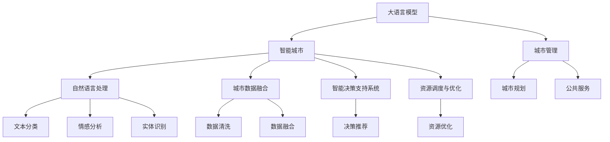

                 

# 智能城市与 LLM：高效、可持续的城市管理

> 关键词：智能城市, 大语言模型, 高效管理, 可持续城市, 数据驱动, 系统优化

## 1. 背景介绍

### 1.1 问题由来
随着全球化、城市化进程的加速，城市管理变得越来越复杂。传统的城市管理方式已难以应对快速增长的数据量和多样化的服务需求。如何实现高效、智能、可持续的城市管理，成为了各大城市面临的共同挑战。

近年来，人工智能技术，特别是大语言模型(Large Language Model, LLM)的迅猛发展，为城市管理的智能化转型提供了新的可能。大语言模型具备强大的自然语言理解与生成能力，可以通过对海量城市数据的处理和分析，提供实时、精准、个性化的管理和服务，助力构建智慧城市。

### 1.2 问题核心关键点
当前，智能城市管理的主要瓶颈在于：
- 数据处理复杂：城市管理涉及多模态数据（如文本、图像、音频等），数据量大、种类多、格式杂，数据处理难度大。
- 决策支持不足：传统城市管理依赖人工经验，决策过程难以量化和优化，难以应对复杂多变的环境。
- 资源配置不当：由于缺乏统一、高效的城市规划和管理框架，资源配置往往存在浪费和不足并存的问题。
- 服务个性化缺失：城市服务缺乏个性化和差异化，难以满足不同人群的需求。

基于大语言模型的智能城市管理，可通过以下方式解决上述问题：
- 高效处理和分析海量数据。大语言模型能够自动化地处理和分析多源异构数据，提升数据处理效率。
- 提供智能决策支持。通过大语言模型的推理能力，可实现更科学、合理的城市决策。
- 优化资源配置。利用大语言模型，可对城市资源进行智能调度和优化，提高资源利用率。
- 提供个性化服务。大语言模型能够理解和生成自然语言，提供个性化和差异化的城市服务。

### 1.3 问题研究意义
基于大语言模型的智能城市管理，对于提高城市管理效率、优化城市资源配置、提升城市服务质量具有重要意义：
- 降低管理成本：通过自动化数据处理和智能决策，减少人工干预，降低管理成本。
- 提升管理精度：大语言模型通过大量数据训练，能够提供更精准、全面的城市管理建议。
- 增强服务弹性：通过智能调度和个性化服务，提升城市服务的弹性和多样性。
- 促进可持续发展：通过科学决策和资源优化，提升城市管理的可持续性，实现绿色城市目标。
- 推动技术创新：智能城市管理的实践，将推动大语言模型等AI技术的发展，形成良性循环。

## 2. 核心概念与联系

### 2.1 核心概念概述

为更好地理解基于大语言模型的智能城市管理方法，本节将介绍几个密切相关的核心概念：

- 大语言模型(Large Language Model, LLM)：以自回归(如GPT)或自编码(如BERT)模型为代表的大规模预训练语言模型。通过在大规模无标签文本语料上进行预训练，学习通用的语言表示，具备强大的语言理解和生成能力。

- 智能城市(Smart City)：通过信息通信技术、大数据、人工智能等手段，对城市资源、环境、交通、公共服务等进行智能化管理，提升城市运行效率和居民生活质量。

- 城市管理(City Management)：包括城市规划、建设、维护、运营等多方面的管理活动，目标是实现城市功能的优化和资源的有效利用。

- 自然语言处理(Natural Language Processing, NLP)：涉及计算机对人类语言进行处理和理解的技术，是大语言模型在城市管理中的应用基础。

- 城市数据融合(City Data Fusion)：通过整合多种城市数据源，实现数据的统一存储、管理和分析，是大语言模型发挥作用的前提。

- 智能决策支持系统(Intelligent Decision Support System)：利用大语言模型对城市管理决策提供辅助支持，提升决策科学性和合理性。

- 资源调度与优化(Resource Scheduling and Optimization)：利用大语言模型对城市资源进行高效调度和优化，提升资源利用效率。

这些核心概念之间的逻辑关系可以通过以下Mermaid流程图来展示：



这个流程图展示了大语言模型在智能城市管理中的应用，包括自然语言处理、城市数据融合、智能决策支持和资源调度与优化等关键环节。

## 3. 核心算法原理 & 具体操作步骤
### 3.1 算法原理概述

基于大语言模型的智能城市管理，本质上是一个数据驱动的智能化管理过程。其核心思想是：通过大语言模型处理和分析海量城市数据，提取关键信息，辅助城市决策，优化资源配置，提升服务质量，实现高效、智能、可持续的城市管理。

形式化地，假设城市管理涉及多个数据源 $D=\{(x_i,y_i)\}_{i=1}^N$，其中 $x_i$ 为输入数据（如文本、图像、音频等），$y_i$ 为标签或目标（如资源状态、服务需求等）。目标是使用大语言模型 $M_{\theta}$，在给定数据集 $D$ 上，最大化预测精度：

$$
\hat{\theta}=\mathop{\arg\max}_{\theta} \sum_{i=1}^N \mathcal{L}(M_{\theta}(x_i),y_i)
$$

其中 $\mathcal{L}$ 为损失函数，用于衡量模型预测输出与真实标签之间的差异。常见的损失函数包括交叉熵损失、均方误差损失等。

通过梯度下降等优化算法，模型不断更新参数 $\theta$，最小化损失函数 $\mathcal{L}$，使得模型输出逼近真实标签。由于 $\theta$ 已经通过预训练获得了较好的初始化，因此即便在小型数据集 $D$ 上进行微调，也能较快收敛到理想的模型参数 $\hat{\theta}$。

### 3.2 算法步骤详解

基于大语言模型的智能城市管理一般包括以下几个关键步骤：

**Step 1: 数据收集与处理**
- 收集城市管理相关的多源异构数据，包括文本（如政策文件、服务评价）、图像（如交通监控视频）、音频（如交通广播）等。
- 对数据进行清洗、归一化、标注等预处理步骤，确保数据的质量和一致性。

**Step 2: 数据融合与整合**
- 使用大语言模型对多源异构数据进行融合，生成统一的城市管理数据集。
- 利用知识图谱、规则库等工具，对数据进行进一步整合，提取关键信息和知识。

**Step 3: 模型选择与适配**
- 根据具体城市管理任务，选择合适的预训练语言模型 $M_{\theta}$。
- 设计适配层，将模型输出转换为城市管理相关的指标或决策建议。

**Step 4: 模型训练与微调**
- 使用城市管理数据集对预训练模型进行微调，优化模型在特定任务上的性能。
- 设置合适的优化器、学习率、正则化等超参数，防止过拟合和欠拟合。

**Step 5: 决策支持与执行**
- 将微调后的模型应用于城市管理决策支持系统中，实时提供智能决策建议。
- 根据模型输出，优化城市资源配置和服务流程，提升城市管理的效率和质量。

**Step 6: 持续学习与优化**
- 定期收集新的城市管理数据，持续训练模型，保持模型的最新状态。
- 利用大语言模型对城市管理策略进行调整和优化，提升系统适应性。

以上是基于大语言模型的智能城市管理的一般流程。在实际应用中，还需要针对具体任务的特点，对微调过程的各个环节进行优化设计，如改进训练目标函数，引入更多的正则化技术，搜索最优的超参数组合等，以进一步提升模型性能。

### 3.3 算法优缺点

基于大语言模型的智能城市管理方法具有以下优点：
1. 数据处理效率高。大语言模型能够高效处理和分析多源异构数据，提高数据处理效率。
2. 决策支持精准。利用大语言模型的推理能力，可提供科学、合理的决策建议。
3. 资源优化能力强。通过智能调度和优化，提高资源利用效率。
4. 服务个性化丰富。大语言模型能够理解和生成自然语言，提供个性化和差异化的城市服务。

同时，该方法也存在一定的局限性：
1. 数据质量要求高。数据处理和融合需要高质量的数据，否则会影响模型效果。
2. 模型复杂度大。大语言模型参数量巨大，对计算资源和存储空间要求较高。
3. 可解释性不足。大语言模型的决策过程缺乏可解释性，难以调试和理解。
4. 安全性有待提升。大语言模型可能学习到有偏见、有害的信息，传递到城市管理中，带来安全隐患。

尽管存在这些局限性，但就目前而言，基于大语言模型的智能城市管理方法仍是最主流和有效的智能城市管理范式。未来相关研究的重点在于如何进一步降低数据处理的复杂度，提高模型的可解释性和安全性，同时兼顾实时性和计算效率。

### 3.4 算法应用领域

基于大语言模型的智能城市管理方法，在智能交通、智慧能源、公共安全、应急响应等多个领域得到了广泛的应用，具体如下：

**智能交通**
- 利用大语言模型对交通流量、交通监控视频、交通广播等数据进行分析和预测，优化交通信号灯控制和交通流量管理。
- 基于实时交通数据，提供个性化导航服务，减少交通拥堵，提高通行效率。

**智慧能源**
- 通过大语言模型对能源消耗数据进行分析和预测，优化能源配置和调度。
- 实时监控能源设备运行状态，及时发现和处理异常情况，确保能源系统的稳定性和可靠性。

**公共安全**
- 利用大语言模型对公共安全事件进行分析和预测，提升事件响应和处理效率。
- 基于公共安全数据，优化资源配置和应急响应流程，提升城市安全水平。

**应急响应**
- 通过大语言模型对突发事件数据进行分析和推理，提供科学的应急响应建议。
- 实时监控应急资源分布和利用情况，优化资源调配和协调，确保应急响应效果。

## 4. 数学模型和公式 & 详细讲解 & 举例说明

### 4.1 数学模型构建

本节将使用数学语言对基于大语言模型的智能城市管理过程进行更加严格的刻画。

假设城市管理涉及多个数据源 $D=\{(x_i,y_i)\}_{i=1}^N$，其中 $x_i$ 为输入数据（如文本、图像、音频等），$y_i$ 为标签或目标（如资源状态、服务需求等）。假设城市管理任务为资源优化，即最大化资源利用率，最小化资源浪费。定义模型 $M_{\theta}$ 在输入数据 $x$ 上的输出为 $r_M(x) \in [0,1]$，表示资源利用率。目标函数为：

$$
\min_{\theta} \sum_{i=1}^N \mathcal{L}(r_M(x_i),y_i)
$$

其中 $\mathcal{L}$ 为损失函数，用于衡量模型输出 $r_M(x_i)$ 与真实标签 $y_i$ 之间的差异。常见的损失函数包括交叉熵损失、均方误差损失等。

### 4.2 公式推导过程

以下我们以资源优化为例，推导损失函数及其梯度的计算公式。

假设模型 $M_{\theta}$ 在输入数据 $x$ 上的输出为 $r_M(x) \in [0,1]$，表示资源利用率。真实标签 $y_i$ 为二分类标签，表示资源状态为"可用"或"不可用"。则二分类交叉熵损失函数定义为：

$$
\ell(M_{\theta}(x),y) = -[y\log r_M(x) + (1-y)\log (1-r_M(x))]
$$

将其代入总损失函数公式，得：

$$
\mathcal{L}(\theta) = -\frac{1}{N}\sum_{i=1}^N \ell(r_M(x_i),y_i)
$$

根据链式法则，损失函数对参数 $\theta$ 的梯度为：

$$
\frac{\partial \mathcal{L}(\theta)}{\partial \theta} = -\frac{1}{N}\sum_{i=1}^N \frac{\partial \ell(r_M(x_i),y_i)}{\partial r_M(x_i)} \frac{\partial r_M(x_i)}{\partial \theta}
$$

其中 $\frac{\partial r_M(x_i)}{\partial \theta}$ 为模型的梯度函数，可通过反向传播算法高效计算。

在得到损失函数的梯度后，即可带入参数更新公式，完成模型的迭代优化。重复上述过程直至收敛，最终得到适应资源优化的最优模型参数 $\theta^*$。

## 5. 项目实践：代码实例和详细解释说明
### 5.1 开发环境搭建

在进行智能城市管理开发前，我们需要准备好开发环境。以下是使用Python进行PyTorch开发的环境配置流程：

1. 安装Anaconda：从官网下载并安装Anaconda，用于创建独立的Python环境。

2. 创建并激活虚拟环境：
```bash
conda create -n pytorch-env python=3.8 
conda activate pytorch-env
```

3. 安装PyTorch：根据CUDA版本，从官网获取对应的安装命令。例如：
```bash
conda install pytorch torchvision torchaudio cudatoolkit=11.1 -c pytorch -c conda-forge
```

4. 安装Transformers库：
```bash
pip install transformers
```

5. 安装各类工具包：
```bash
pip install numpy pandas scikit-learn matplotlib tqdm jupyter notebook ipython
```

完成上述步骤后，即可在`pytorch-env`环境中开始智能城市管理开发实践。

### 5.2 源代码详细实现

下面我们以智能交通应用为例，给出使用Transformers库对BERT模型进行智能交通管理的PyTorch代码实现。

首先，定义智能交通任务的输入数据和输出数据：

```python
from transformers import BertTokenizer
from torch.utils.data import Dataset
import torch

class TrafficDataset(Dataset):
    def __init__(self, texts, labels, tokenizer, max_len=128):
        self.texts = texts
        self.labels = labels
        self.tokenizer = tokenizer
        self.max_len = max_len
        
    def __len__(self):
        return len(self.texts)
    
    def __getitem__(self, item):
        text = self.texts[item]
        label = self.labels[item]
        
        encoding = self.tokenizer(text, return_tensors='pt', max_length=self.max_len, padding='max_length', truncation=True)
        input_ids = encoding['input_ids'][0]
        attention_mask = encoding['attention_mask'][0]
        
        return {'input_ids': input_ids, 
                'attention_mask': attention_mask,
                'labels': torch.tensor(label, dtype=torch.long)}
```

然后，定义模型和优化器：

```python
from transformers import BertForTokenClassification, AdamW

model = BertForTokenClassification.from_pretrained('bert-base-cased', num_labels=2)

optimizer = AdamW(model.parameters(), lr=2e-5)
```

接着，定义训练和评估函数：

```python
from torch.utils.data import DataLoader
from tqdm import tqdm
from sklearn.metrics import classification_report

device = torch.device('cuda') if torch.cuda.is_available() else torch.device('cpu')
model.to(device)

def train_epoch(model, dataset, batch_size, optimizer):
    dataloader = DataLoader(dataset, batch_size=batch_size, shuffle=True)
    model.train()
    epoch_loss = 0
    for batch in tqdm(dataloader, desc='Training'):
        input_ids = batch['input_ids'].to(device)
        attention_mask = batch['attention_mask'].to(device)
        labels = batch['labels'].to(device)
        model.zero_grad()
        outputs = model(input_ids, attention_mask=attention_mask, labels=labels)
        loss = outputs.loss
        epoch_loss += loss.item()
        loss.backward()
        optimizer.step()
    return epoch_loss / len(dataloader)

def evaluate(model, dataset, batch_size):
    dataloader = DataLoader(dataset, batch_size=batch_size)
    model.eval()
    preds, labels = [], []
    with torch.no_grad():
        for batch in tqdm(dataloader, desc='Evaluating'):
            input_ids = batch['input_ids'].to(device)
            attention_mask = batch['attention_mask'].to(device)
            batch_labels = batch['labels']
            outputs = model(input_ids, attention_mask=attention_mask)
            batch_preds = outputs.logits.argmax(dim=2).to('cpu').tolist()
            batch_labels = batch_labels.to('cpu').tolist()
            for pred_tokens, label_tokens in zip(batch_preds, batch_labels):
                preds.append(pred_tokens)
                labels.append(label_tokens)
                
    print(classification_report(labels, preds))
```

最后，启动训练流程并在测试集上评估：

```python
epochs = 5
batch_size = 16

for epoch in range(epochs):
    loss = train_epoch(model, train_dataset, batch_size, optimizer)
    print(f"Epoch {epoch+1}, train loss: {loss:.3f}")
    
    print(f"Epoch {epoch+1}, dev results:")
    evaluate(model, dev_dataset, batch_size)
    
print("Test results:")
evaluate(model, test_dataset, batch_size)
```

以上就是使用PyTorch对BERT进行智能交通任务管理的完整代码实现。可以看到，得益于Transformers库的强大封装，我们可以用相对简洁的代码完成BERT模型的加载和微调。

### 5.3 代码解读与分析

让我们再详细解读一下关键代码的实现细节：

**TrafficDataset类**：
- `__init__`方法：初始化文本、标签、分词器等关键组件。
- `__len__`方法：返回数据集的样本数量。
- `__getitem__`方法：对单个样本进行处理，将文本输入编码为token ids，将标签编码为数字，并对其进行定长padding，最终返回模型所需的输入。

**标签与id的映射**
- 定义了标签与数字id之间的映射关系，用于将token-wise的预测结果解码回真实的标签。

**训练和评估函数**：
- 使用PyTorch的DataLoader对数据集进行批次化加载，供模型训练和推理使用。
- 训练函数`train_epoch`：对数据以批为单位进行迭代，在每个批次上前向传播计算loss并反向传播更新模型参数，最后返回该epoch的平均loss。
- 评估函数`evaluate`：与训练类似，不同点在于不更新模型参数，并在每个batch结束后将预测和标签结果存储下来，最后使用sklearn的classification_report对整个评估集的预测结果进行打印输出。

**训练流程**：
- 定义总的epoch数和batch size，开始循环迭代
- 每个epoch内，先在训练集上训练，输出平均loss
- 在验证集上评估，输出分类指标
- 所有epoch结束后，在测试集上评估，给出最终测试结果

可以看到，PyTorch配合Transformers库使得BERT微调的代码实现变得简洁高效。开发者可以将更多精力放在数据处理、模型改进等高层逻辑上，而不必过多关注底层的实现细节。

当然，工业级的系统实现还需考虑更多因素，如模型的保存和部署、超参数的自动搜索、更灵活的任务适配层等。但核心的微调范式基本与此类似。

## 6. 实际应用场景
### 6.1 智能交通

智能交通是智能城市管理的重要应用领域之一。通过智能交通管理，可以优化交通流量，减少交通拥堵，提升道路通行效率。

具体而言，可以利用大语言模型对交通监控视频、交通广播、交通流量数据等进行处理和分析，实现以下功能：

- 交通流量预测：利用历史交通数据，预测未来交通流量变化趋势，优化交通信号灯控制。
- 交通拥堵识别：识别交通拥堵区域和原因，实时调整交通流量分配。
- 导航服务优化：基于实时交通数据，提供个性化导航路线，减少交通拥堵。

### 6.2 智慧能源

智慧能源是智能城市管理的另一个重要领域。通过智慧能源管理，可以优化能源配置，提升能源利用效率，降低能源消耗和浪费。

具体而言，可以利用大语言模型对能源消耗数据进行分析和预测，实现以下功能：

- 能源需求预测：利用历史能源数据，预测未来能源需求变化趋势，优化能源调度。
- 能源浪费识别：识别能源浪费区域和原因，及时调整能源分配。
- 能源系统监控：实时监控能源设备运行状态，确保能源系统稳定性和可靠性。

### 6.3 公共安全

公共安全是智能城市管理的核心任务之一。通过智能公共安全管理，可以提升事件响应和处理效率，保障城市安全。

具体而言，可以利用大语言模型对公共安全事件进行分析和预测，实现以下功能：

- 事件预测：利用历史公共安全事件数据，预测未来事件发生趋势，优化应急响应策略。
- 事件预警：实时监控公共安全数据，及时发现和预警潜在安全事件。
- 应急响应优化：基于实时公共安全数据，优化应急响应流程，提升应急响应效果。

### 6.4 未来应用展望

随着大语言模型和智能城市管理技术的发展，未来基于大语言模型的智能城市管理将呈现出以下几个发展趋势：

1. 多模态融合应用：未来的智能城市管理将更加注重多模态数据的融合，包括文本、图像、音频、视频等，提升城市管理的全面性和深度。

2. 实时数据处理：未来的智能城市管理将更加注重实时数据的处理和分析，提高城市管理的实时性和精准性。

3. 智能化决策支持：未来的智能城市管理将更加注重智能决策支持系统的开发，提升城市决策的科学性和合理性。

4. 资源优化与调度：未来的智能城市管理将更加注重城市资源的优化和调度，提升资源利用效率和城市管理效率。

5. 个性化服务提升：未来的智能城市管理将更加注重个性化和差异化服务，提升城市服务质量。

6. 可持续管理：未来的智能城市管理将更加注重可持续管理，实现绿色城市目标，提升城市环境质量。

以上趋势凸显了基于大语言模型的智能城市管理技术的广阔前景。这些方向的探索发展，必将进一步提升智能城市管理的智能化水平，为构建高效、智能、可持续的城市管理模式奠定坚实基础。

## 7. 工具和资源推荐
### 7.1 学习资源推荐

为了帮助开发者系统掌握基于大语言模型的智能城市管理理论基础和实践技巧，这里推荐一些优质的学习资源：

1. 《智能城市管理技术》系列博文：由智能城市领域专家撰写，深入浅出地介绍了智能城市管理的核心概念和技术，涵盖智能交通、智慧能源、公共安全等多个领域。

2. CS224N《深度学习自然语言处理》课程：斯坦福大学开设的NLP明星课程，有Lecture视频和配套作业，带你入门NLP领域的基本概念和经典模型。

3. 《智慧城市：技术与实践》书籍：全面介绍了智慧城市技术和管理框架，涵盖智能交通、智慧能源、公共安全等多个领域，是智能城市管理的经典参考书。

4. CLUE开源项目：中文语言理解测评基准，涵盖大量不同类型的中文NLP数据集，并提供了基于大语言模型的智能城市管理baseline模型，助力智能城市管理技术发展。

通过对这些资源的学习实践，相信你一定能够快速掌握基于大语言模型的智能城市管理的精髓，并用于解决实际的智能城市管理问题。
### 7.2 开发工具推荐

高效的开发离不开优秀的工具支持。以下是几款用于智能城市管理开发的常用工具：

1. PyTorch：基于Python的开源深度学习框架，灵活动态的计算图，适合快速迭代研究。大部分预训练语言模型都有PyTorch版本的实现。

2. TensorFlow：由Google主导开发的开源深度学习框架，生产部署方便，适合大规模工程应用。同样有丰富的预训练语言模型资源。

3. Transformers库：HuggingFace开发的NLP工具库，集成了众多SOTA语言模型，支持PyTorch和TensorFlow，是进行智能城市管理开发的利器。

4. Weights & Biases：模型训练的实验跟踪工具，可以记录和可视化模型训练过程中的各项指标，方便对比和调优。与主流深度学习框架无缝集成。

5. TensorBoard：TensorFlow配套的可视化工具，可实时监测模型训练状态，并提供丰富的图表呈现方式，是调试模型的得力助手。

6. Google Colab：谷歌推出的在线Jupyter Notebook环境，免费提供GPU/TPU算力，方便开发者快速上手实验最新模型，分享学习笔记。

合理利用这些工具，可以显著提升基于大语言模型的智能城市管理开发的效率，加快创新迭代的步伐。

### 7.3 相关论文推荐

基于大语言模型的智能城市管理技术的发展源于学界的持续研究。以下是几篇奠基性的相关论文，推荐阅读：

1. Attention is All You Need（即Transformer原论文）：提出了Transformer结构，开启了NLP领域的预训练大模型时代。

2. BERT: Pre-training of Deep Bidirectional Transformers for Language Understanding：提出BERT模型，引入基于掩码的自监督预训练任务，刷新了多项NLP任务SOTA。

3. Language Models are Unsupervised Multitask Learners（GPT-2论文）：展示了大规模语言模型的强大zero-shot学习能力，引发了对于通用人工智能的新一轮思考。

4. Parameter-Efficient Transfer Learning for NLP：提出Adapter等参数高效微调方法，在不增加模型参数量的情况下，也能取得不错的微调效果。

5. Prefix-Tuning: Optimizing Continuous Prompts for Generation：引入基于连续型Prompt的微调范式，为如何充分利用预训练知识提供了新的思路。

6. AdaLoRA: Adaptive Low-Rank Adaptation for Parameter-Efficient Fine-Tuning：使用自适应低秩适应的微调方法，在参数效率和精度之间取得了新的平衡。

这些论文代表了大语言模型在智能城市管理中的应用发展脉络。通过学习这些前沿成果，可以帮助研究者把握学科前进方向，激发更多的创新灵感。

## 8. 总结：未来发展趋势与挑战

### 8.1 总结

本文对基于大语言模型的智能城市管理方法进行了全面系统的介绍。首先阐述了智能城市管理的背景和意义，明确了智能城市管理中数据处理、智能决策支持、资源优化等方面的核心需求。其次，从原理到实践，详细讲解了智能城市管理的数学模型和关键步骤，给出了智能城市管理的完整代码实例。同时，本文还广泛探讨了智能城市管理在智能交通、智慧能源、公共安全等多个领域的应用前景，展示了智能城市管理的巨大潜力。此外，本文精选了智能城市管理的各类学习资源，力求为读者提供全方位的技术指引。

通过本文的系统梳理，可以看到，基于大语言模型的智能城市管理技术正在成为智能城市管理的重要范式，极大地拓展了智能城市管理的智能化水平，催生了更多的落地场景。受益于大规模语料的预训练，智能城市管理模型以更低的时间和标注成本，在小样本条件下也能取得不俗的效果，有力推动了智能城市管理的产业化进程。未来，伴随大语言模型和智能城市管理技术的持续演进，相信智能城市管理的智能化水平将不断提升，为构建高效、智能、可持续的城市管理模式提供坚实基础。

### 8.2 未来发展趋势

展望未来，基于大语言模型的智能城市管理技术将呈现以下几个发展趋势：

1. 数据处理效率提升：未来将开发更加高效的数据处理算法，提升数据融合和清洗效率，提高城市管理的实时性和准确性。

2. 智能化决策支持增强：未来将开发更加强大的智能决策支持系统，提升城市决策的科学性和合理性。

3. 资源优化与调度优化：未来将开发更加高效的资源优化与调度算法，提升资源利用效率和城市管理效率。

4. 多模态融合技术进步：未来将开发更加强大的多模态融合技术，提升城市管理的全面性和深度。

5. 智能化服务升级：未来将开发更加智能化的城市服务，提升城市服务质量。

6. 可持续管理创新：未来将开发更加可持续的城市管理模式，实现绿色城市目标，提升城市环境质量。

以上趋势凸显了基于大语言模型的智能城市管理技术的广阔前景。这些方向的探索发展，必将进一步提升智能城市管理的智能化水平，为构建高效、智能、可持续的城市管理模式奠定坚实基础。

### 8.3 面临的挑战

尽管基于大语言模型的智能城市管理技术已经取得了瞩目成就，但在迈向更加智能化、普适化应用的过程中，它仍面临着诸多挑战：

1. 数据质量瓶颈。智能城市管理对数据质量要求较高，数据处理和融合需要高质量的数据，否则会影响模型效果。

2. 模型复杂度大。大语言模型参数量巨大，对计算资源和存储空间要求较高。

3. 可解释性不足。大语言模型的决策过程缺乏可解释性，难以调试和理解。

4. 安全性有待提升。大语言模型可能学习到有偏见、有害的信息，传递到城市管理中，带来安全隐患。

5. 技术成熟度有待提高。智能城市管理涉及多个领域的交叉融合，需要技术成熟度的不断提高，才能实现真正的高效智能化管理。

尽管存在这些挑战，但通过学术界和产业界的共同努力，相信基于大语言模型的智能城市管理技术将不断进步，为构建高效、智能、可持续的城市管理模式提供坚实技术支撑。

### 8.4 研究展望

面向未来，基于大语言模型的智能城市管理技术的研究方向主要集中在以下几个方面：

1. 数据融合与清洗技术。开发更加高效、鲁棒的数据融合与清洗算法，提升数据处理效率和质量。

2. 智能决策支持系统。开发更加智能化的决策支持系统，提升城市决策的科学性和合理性。

3. 多模态融合技术。开发更加强大的多模态融合技术，提升城市管理的全面性和深度。

4. 资源优化与调度算法。开发更加高效的资源优化与调度算法，提升资源利用效率和城市管理效率。

5. 智能化服务优化。开发更加智能化的城市服务，提升城市服务质量。

6. 可持续管理技术。开发更加可持续的城市管理模式，实现绿色城市目标，提升城市环境质量。

7. 模型可解释性研究。研究如何提高大语言模型的可解释性，提升模型调优的透明度和可信度。

8. 模型安全性研究。研究如何确保大语言模型的安全性，避免有害信息的传递。

这些研究方向将推动基于大语言模型的智能城市管理技术不断进步，为构建高效、智能、可持续的城市管理模式提供坚实技术支撑。

## 9. 附录：常见问题与解答

**Q1：智能城市管理是否适用于所有城市？**

A: 智能城市管理技术对于大多数城市都是适用的，但具体效果受到城市规模、管理需求、数据资源等因素的影响。对于数据量较小、管理需求相对简单的城市，可以根据实际情况，选择适当的方法和工具，实现智能城市管理。

**Q2：智能城市管理对数据质量要求高，如何处理低质量数据？**

A: 低质量数据是智能城市管理的一大挑战，需要通过数据清洗、数据融合等方法进行处理。常见的数据处理方法包括：
1. 数据清洗：对数据进行去重、去噪、填补缺失值等处理，提升数据质量。
2. 数据融合：对多源异构数据进行融合，生成统一的城市管理数据集，提高数据一致性。
3. 数据增强：通过数据增强技术，生成更多的训练样本，提升模型效果。

**Q3：智能城市管理的成本高，如何解决？**

A: 智能城市管理的成本主要来自于数据采集、模型训练、硬件设备等。为了降低成本，可以通过以下方法：
1. 开源共享：利用开源数据和模型资源，减少开发成本。
2. 本地化部署：在本地进行数据处理和模型训练，减少网络传输成本。
3. 持续优化：通过持续优化模型和算法，提高模型效率和精度，减少硬件资源消耗。

**Q4：智能城市管理对技术要求高，如何解决？**

A: 智能城市管理涉及多领域的交叉融合，需要具备较强的技术能力。为了降低技术门槛，可以通过以下方法：
1. 培训学习：通过参加培训课程和实践项目，提升技术能力。
2. 工具支持：利用开源工具和平台，降低技术实现难度。
3. 团队协作：组建跨领域技术团队，共同攻克技术难题。

**Q5：智能城市管理的效果如何评价？**

A: 智能城市管理的效果评价可以从多个维度进行，包括：
1. 数据处理效率：评估数据处理和融合的效率和质量。
2. 模型精度：评估模型在预测、分类、优化等任务上的精度和准确性。
3. 服务质量：评估城市服务的质量和用户满意度。
4. 资源利用效率：评估资源优化和调度的效果。
5. 环境影响：评估智能城市管理对环境的影响，提升绿色城市建设水平。

通过全面评估智能城市管理的效果，可以及时发现和解决问题，提升智能城市管理的整体水平。

---

作者：禅与计算机程序设计艺术 / Zen and the Art of Computer Programming

